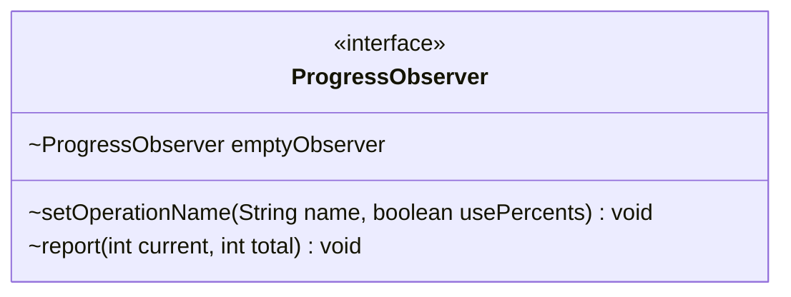

---
aliases:
  - ProgressObserver
tags:
  - java/interface
  - module/forge-core
  - pkg/forge
fqn: forge.CardStorageReader.ProgressObserver
package: forge
module: forge-core
kind: Interface
---

# ProgressObserver

**Package:** `forge`   **Module:** `forge-core`   **Kind:** Interface



## Design Description

ProgressObserver is a callback interface nested within `CardStorageReader` that decouples the card-loading process from any UI or logging that needs to track its progress. It defines two operations: `setOperationName`, which labels the current task and indicates whether progress should be shown as percentages, and `report`, which communicates the current and total item counts as loading proceeds.

The interface follows the Null Object pattern through its static `emptyObserver` field — a no-op implementation that callers can substitute when no real observer is supplied, sparing `CardStorageReader` from repeated null checks. By depending only on this abstraction rather than a concrete reporter, the reader stays in the core module and lets higher-level layers provide whatever progress display they choose.

## Source
`forge-core/src/main/java/forge/CardStorageReader.java` — declaration excerpt

```java
    public interface ProgressObserver{
        void setOperationName(String name, boolean usePercents);
        void report(int current, int total);

        // does nothing, used when they pass null instead of an instance
        ProgressObserver emptyObserver = new ProgressObserver() {
            @Override public void setOperationName(final String name, final boolean usePercents) {}
            @Override public void report(final int current, final int total) {}
        };
    }
```
