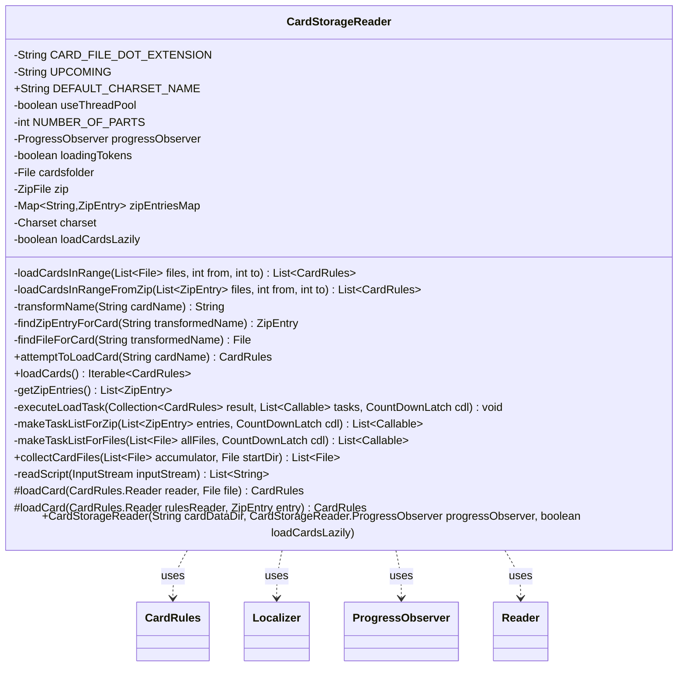

---
aliases:
  - CardStorageReader
tags:
  - java/class
  - module/forge-core
  - pkg/forge
fqn: forge.CardStorageReader
package: forge
module: forge-core
kind: Class
---

# CardStorageReader

**Package:** `forge`   **Module:** `forge-core`   **Kind:** Class



## Relationships
**Uses:**
- [[forge.CardStorageReader.ProgressObserver|ProgressObserver]]
- [[forge.card.CardRules|CardRules]]
- [[forge.card.CardRules.Reader|Reader]]
- [[forge.util.Localizer|Localizer]]

## Design Description

CardStorageReader discovers and parses Forge's card-definition scripts—plain `.txt` files arranged in a letter-keyed directory tree or bundled in a `cardsfolder.zip`—into in-memory `CardRules` objects. Its constructor validates the supplied folder and transparently selects the zip or loose-file backend. `loadCards()` bulk-loads the entire catalog into a case-insensitively sorted set, while `attemptToLoadCard(String)` resolves a single card by normalizing its display name to a canonical filename, with prefix-matching fallback for double-faced cards.

The reader delegates actual script interpretation to `CardRules.Reader`, reports progress through an injected `ProgressObserver` (defaulting to a no-op instance when none is supplied), and localizes status messages via `Localizer`. Notable design intent includes optional lazy loading, a hand-optimized single-pass name normalizer that minimizes allocations, and partitioning the expensive parse into ranged `Callable` tasks dispatched across a computing thread pool on multi-core systems, falling back to single-threaded execution otherwise.

## Source
`forge-core/src/main/java/forge/CardStorageReader.java`

```java
/*
 * Forge: Play Magic: the Gathering.
 * Copyright (C) 2011  Forge Team
 *
 * This program is free software: you can redistribute it and/or modify
 * it under the terms of the GNU General Public License as published by
 * the Free Software Foundation, either version 3 of the License, or
 * (at your option) any later version.
 *
 * This program is distributed in the hope that it will be useful,
 * but WITHOUT ANY WARRANTY; without even the implied warranty of
 * MERCHANTABILITY or FITNESS FOR A PARTICULAR PURPOSE.  See the
 * GNU General Public License for more details.
 *
 * You should have received a copy of the GNU General Public License
 * along with this program.  If not, see <http://www.gnu.org/licenses/>.
 */
package forge;

import com.google.common.io.Files;
import forge.card.CardRules;
import forge.util.BuildInfo;
import forge.util.FileUtil;
import forge.util.Localizer;
import forge.util.ThreadUtil;
import org.apache.commons.lang3.time.StopWatch;

import java.io.*;
import java.nio.charset.Charset;
import java.util.*;
import java.util.concurrent.*;
import java.util.zip.ZipEntry;
import java.util.zip.ZipFile;

/**
 * <p>
 * CardStorageReader class.
 * </p>
 *
 * @author Forge
 * @version $Id: CardStorageReader.java 23742 2013-11-22 16:32:56Z Max mtg $
 */

public class CardStorageReader {
    public interface ProgressObserver{
        void setOperationName(String name, boolean usePercents);
        void report(int current, int total);

        // does nothing, used when they pass null instead of an instance
        ProgressObserver emptyObserver = new ProgressObserver() {
            @Override public void setOperationName(final String name, final boolean usePercents) {}
            @Override public void report(final int current, final int total) {}
        };
    }

    private static final String CARD_FILE_DOT_EXTENSION = ".txt";
    private static final String UPCOMING = "upcoming";

    /** Default charset when loading from files. */
    public static final String DEFAULT_CHARSET_NAME = "UTF-8";

    private final boolean useThreadPool = ThreadUtil.isMultiCoreSystem();
    private final static int NUMBER_OF_PARTS = 25;

    private final ProgressObserver progressObserver;

    private final boolean loadingTokens;
    private transient File cardsfolder;

    private transient ZipFile zip;
    private transient Map<String, ZipEntry> zipEntriesMap;
    private final transient Charset charset;

    private final boolean loadCardsLazily;

    public CardStorageReader(final String cardDataDir, final CardStorageReader.ProgressObserver progressObserver, boolean loadCardsLazily) {
        this.progressObserver = progressObserver != null ? progressObserver : CardStorageReader.ProgressObserver.emptyObserver;
        this.cardsfolder = new File(cardDataDir);

        this.loadingTokens = cardDataDir.contains("token");

        this.loadCardsLazily = loadCardsLazily;

        // These read data for lightweight classes.
        if (!cardsfolder.exists()) {
            throw new RuntimeException("CardReader : constructor error -- " + cardsfolder.getAbsolutePath() + " file/folder not found.");
        }

        if (!cardsfolder.isDirectory()) {
            throw new RuntimeException("CardReader : constructor error -- not a directory -- " + cardsfolder.getAbsolutePath());
        }

        final File zipFile = new File(cardsfolder, "cardsfolder.zip");

        if (zipFile.exists()) {
            try {
                this.zip = new ZipFile(zipFile);
            } catch (final Exception exn) {
                System.err.printf("Error reading zip file \"%s\": %s. Defaulting to txt files in \"%s\".%n", zipFile.getAbsolutePath(), exn, cardsfolder.getAbsolutePath());
            }
        }

        this.charset = Charset.forName(CardStorageReader.DEFAULT_CHARSET_NAME);
    } // CardReader()

    private List<CardRules> loadCardsInRange(final List<File> files, final int from, final int to) {
        final CardRules.Reader rulesReader = new CardRules.Reader();

        final List<CardRules> result = new ArrayList<>();
        for(int i = from; i < to; i++) {
            final File cardTxtFile = files.get(i);
            result.add(this.loadCard(rulesReader, cardTxtFile));
        }
        return result;
    }

    private List<CardRules> loadCardsInRangeFromZip(final List<ZipEntry> files, final int from, final int to) {
        final CardRules.Reader rulesReader = new CardRules.Reader();

        final List<CardRules> result = new ArrayList<>();
        for (int i = from; i < to; i++) {
            final ZipEntry ze = files.get(i);
            // if (ze.getName().endsWith(CardStorageReader.CARD_FILE_DOT_EXTENSION))  // already filtered!
            result.add(this.loadCard(rulesReader, ze));
        }
        return result;
    }

    // Note: This is custom coded for efficiency, since it allows
    // to do the relevant transformation in a single pass with just
    // a single char array allocation.
    private String transformName(String cardName) {
        char[] chars = new char[cardName.length()];
        int charIndex = 0;
        for (int i = 0; i < cardName.length(); i++) {
            char c = Character.toLowerCase(cardName.charAt(i));
            if (c == '\'') {
                continue;
            }
            if ((c < 'a' || c > 'z') && (c < '0' || c > '9')) {
                if (charIndex > 0 && chars[charIndex - 1] == '_') {
                    continue;
                }
                // Comma separator in numbers: "Borrowing 100,000 Arrows"
                if ((c == ',') && (charIndex > 0) && (chars[charIndex-1] >= '0' || chars[charIndex-1] <= '9'))
                    continue;
                c = '_';
            }
            chars[charIndex++] = c;
        }
        if (chars[charIndex - 1] == '_') {
            charIndex--;
        }
        return new String(chars, 0, charIndex);
    }
    
    private ZipEntry findZipEntryForCard(String transformedName) {
        if (zip == null) {
            return null;
        }

        if (zipEntriesMap == null) {
            zipEntriesMap = new HashMap<>();
            for (ZipEntry entry : getZipEntries()) {
                zipEntriesMap.put(entry.getName(), entry);
            }
        }

        transformedName = transformedName.charAt(0) + "/" + transformedName;
        ZipEntry entry = zipEntriesMap.get(transformedName + CardStorageReader.CARD_FILE_DOT_EXTENSION);
        if (entry == null) {
            // Double faced cards file naming convention currently has both names - so try to prefix match.
            // TODO: Consider changing the naming convention for DFCs.
            for (String fileName : zipEntriesMap.keySet()) {
                if (fileName.startsWith(transformedName)) {
                    entry = zipEntriesMap.get(fileName);
                    break;
                }
            }
        }
        return entry;
    }
    
    private File findFileForCard(String transformedName) {
        String folder = cardsfolder.getAbsolutePath() + "/" + transformedName.charAt(0);
        File file = new File(folder + "/" + transformedName + CardStorageReader.CARD_FILE_DOT_EXTENSION);
        if (!file.exists()) {
            file = null;
            // Double faced cards file naming convention currently has both names - so try to prefix match.
            // TODO: Consider changing the naming convention for DFCs.
            String[] fileNames = new File(folder).list();
            if (fileNames != null) {
                for (String fileName : new File(folder).list()) {
                    if (fileName.startsWith(transformedName)) {
                        file = new File(folder, fileName);
                        break;
                    }
                }
            }
        }
        return file;
    }

    public final CardRules attemptToLoadCard(String cardName) {
        String transformedName = transformName(cardName);
        CardRules rules = null;

        // TODO: Should CardRules.Reader object be cached?
        ZipEntry entry = findZipEntryForCard(transformedName);
        if (entry != null) {
            rules = loadCard(new CardRules.Reader(), entry);
        } else {
            File file = findFileForCard(transformedName);
            if (file != null) {
                rules = loadCard(new CardRules.Reader(), file);
            }
        }

        return rules;
    }

    public final Iterable<CardRules> loadCards() {
        final Localizer localizer = Localizer.getInstance();

        progressObserver.setOperationName(localizer.getMessage("splash.loading.examining-cards"), true);

        // Iterate through txt files or zip archive.
        // Report relevant numbers to progress monitor model.

        final Set<CardRules> result;
        result = new TreeSet<>(Comparator.comparing(CardRules::getNormalizedName, String.CASE_INSENSITIVE_ORDER));

        if (loadCardsLazily) {
            return result;
        }
 
        final List<File> allFiles = collectCardFiles(new ArrayList<>(), this.cardsfolder);
        if (!allFiles.isEmpty()) {
            int fileParts = zip == null ? NUMBER_OF_PARTS : 1 + NUMBER_OF_PARTS / 3;
            if (allFiles.size() < fileParts * 100) {
                fileParts = Math.max(1, allFiles.size() / 100); // to avoid creation of many threads for a dozen of files
            }
            final CountDownLatch cdlFiles = new CountDownLatch(fileParts);
            final List<Callable<List<CardRules>>> taskFiles = makeTaskListForFiles(allFiles, cdlFiles);
            progressObserver.setOperationName(localizer.getMessage("splash.loading.cards-folders"), true);
            progressObserver.report(0, taskFiles.size());
            final StopWatch sw = new StopWatch();
            sw.start();
            executeLoadTask(result, taskFiles, cdlFiles);
            sw.stop();
            final long timeOnParse = sw.getTime(TimeUnit.SECONDS);
            System.out.printf("Read cards: %s files in %d ms (%d parts) %s%n", allFiles.size(), timeOnParse, taskFiles.size(), useThreadPool ? "using thread pool" : "in same thread");
        }

        if (this.zip != null) {
            final CountDownLatch cdlZip = new CountDownLatch(NUMBER_OF_PARTS);
            List<Callable<List<CardRules>>> taskZip;
            taskZip = makeTaskListForZip(getZipEntries(), cdlZip);
            progressObserver.setOperationName(localizer.getMessage("splash.loading.cards-archive"), true);
            progressObserver.report(0, taskZip.size());
            final StopWatch sw = new StopWatch();
            sw.start();
            executeLoadTask(result, taskZip, cdlZip);
            sw.stop();
            final long timeOnParse = sw.getTime(TimeUnit.SECONDS);
            System.out.printf("Read cards: %s archived files in %d ms (%d parts) %s%n", this.zip.size(), timeOnParse, taskZip.size(), useThreadPool ? "using thread pool" : "in same thread");
        }

        return result;
    }

    private List<ZipEntry> getZipEntries() {
        ZipEntry entry;
        final List<ZipEntry> entries = new ArrayList<>();
        // zipEnum was initialized in the constructor.
        final Enumeration<? extends ZipEntry> zipEnum = this.zip.entries();
        while (zipEnum.hasMoreElements()) {
            entry = zipEnum.nextElement();
            if (entry.isDirectory() || !entry.getName().endsWith(CardStorageReader.CARD_FILE_DOT_EXTENSION)) {
                continue;
            }
            entries.add(entry);
        }
        return entries;
    }

    private void executeLoadTask(final Collection<CardRules> result, final List<Callable<List<CardRules>>> tasks, final CountDownLatch cdl) {
        try {
            if (useThreadPool) {
                final ExecutorService executor = ThreadUtil.getComputingPool(0.5f);
                final List<Future<List<CardRules>>> parts = executor.invokeAll(tasks);
                executor.shutdown();
                cdl.await();
                for (final Future<List<CardRules>> pp : parts) {
                    result.addAll(pp.get());
                }
            } else {
                for (final Callable<List<CardRules>> c : tasks) {
                    result.addAll(c.call());
                }
            }
        } catch (InterruptedException | ExecutionException e) {
            e.printStackTrace();
        } catch (final Exception e) { // this clause comes from non-threaded branch
            throw new RuntimeException(e);
        }
    }

    private List<Callable<List<CardRules>>> makeTaskListForZip(final List<ZipEntry> entries, final CountDownLatch cdl) {
        final int totalFiles = entries.size();
        final int maxParts = (int) cdl.getCount();
        final int filesPerPart = totalFiles / maxParts;
        final List<Callable<List<CardRules>>> tasks = new ArrayList<>();
        for (int iPart = 0; iPart < maxParts; iPart++) {
            final int from = iPart * filesPerPart;
            final int till = iPart == maxParts - 1 ? totalFiles : from + filesPerPart;
            tasks.add(() -> {
                final List<CardRules> res = loadCardsInRangeFromZip(entries, from, till);
                cdl.countDown();
                progressObserver.report(maxParts - (int)cdl.getCount(), maxParts);
                return res;
            });
        }
        return tasks;
    }

    private List<Callable<List<CardRules>>> makeTaskListForFiles(final List<File> allFiles, final CountDownLatch cdl) {
        final int totalFiles = allFiles.size();
        final int maxParts = (int) cdl.getCount();
        final int filesPerPart = totalFiles / maxParts;
        final List<Callable<List<CardRules>>> tasks = new ArrayList<>();
        for (int iPart = 0; iPart < maxParts; iPart++) {
            final int from = iPart * filesPerPart;
            final int till = iPart == maxParts - 1 ? totalFiles : from + filesPerPart;
            tasks.add(() -> {
                try {
                    final List<CardRules> res = loadCardsInRange(allFiles, from, till);
                    return res;
                } catch (Exception ex) {
                    throw ex;
                } finally {
                    // make sure to continue loading when using multiple threads
                    cdl.countDown();
                    progressObserver.report(maxParts - (int)cdl.getCount(), maxParts);
                }
            });
        }
        return tasks;
    }

    public static List<File> collectCardFiles(final List<File> accumulator, final File startDir) {
        final String[] list = startDir.list();
        for (final String filename : list) {
            final File entry = new File(startDir, filename);

            if (!entry.isDirectory()) {
                if (entry.getName().endsWith(CardStorageReader.CARD_FILE_DOT_EXTENSION)) {
                    accumulator.add(entry);
                }
                continue;
            }
            if (filename.startsWith(".")) {
                continue;
            }

            if (filename.equalsIgnoreCase(CardStorageReader.UPCOMING) && !BuildInfo.isDevelopmentVersion()) {
                // If upcoming folder exits, only load these cards on development builds
                continue;
            }

            collectCardFiles(accumulator, entry);
        }
        return accumulator;
    }

    private List<String> readScript(final InputStream inputStream) {
        return FileUtil.readAllLines(new InputStreamReader(inputStream, this.charset), true);
    }

    /**
     * Load a card from a txt file.
     *
     * @return a new Card instance
     */
    protected final CardRules loadCard(final CardRules.Reader reader, final File file) {
        try (InputStream fileInputStream = java.nio.file.Files.newInputStream(file.toPath())) {
            reader.reset();
            final List<String> lines = readScript(fileInputStream);
            CardRules rules = reader.readCard(lines, Files.getNameWithoutExtension(file.getName()));
            rules.setPath(file.getPath());
            return rules;
        } catch (final FileNotFoundException ex) {
            throw new RuntimeException("CardReader : run error -- file not found: " + file.getPath(), ex);
        } catch (final Exception ex) {
            throw new RuntimeException("Error loading cardscript " + file.getName() + ". Please close Forge and resolve this.", ex);
        }
    }

    /**
     * Load a card from an entry in a zip file.
     *
     * @param entry
     *            to load from
     *
     * @return a new Card instance
     */
    protected final CardRules loadCard(final CardRules.Reader rulesReader, final ZipEntry entry) {
        try (InputStream zipInputStream = this.zip.getInputStream(entry)) {
            rulesReader.reset();
            CardRules rules = rulesReader.readCard(readScript(zipInputStream), Files.getNameWithoutExtension(entry.getName()));
            rules.setPath(entry.getName());
            return rules;
        } catch (final IOException exn) {
            throw new RuntimeException(exn);
        }
    }

}
```

## Python
`forge/CardStorageReader.py`

```python
from forge.card.CardRules import CardRules
from forge.util.BuildInfo import BuildInfo
from forge.util.FileUtil import FileUtil
from forge.util.Localizer import Localizer
from forge.util.ThreadUtil import ThreadUtil

import io
import os
import sys
import time
import threading
from pathlib import Path
from zipfile import ZipFile, ZipInfo


# Minimal idiomatic mapping of java.util.concurrent.CountDownLatch.
class CountDownLatch:
    def __init__(self, count):
        self._count = count
        self._cond = threading.Condition()

    def getCount(self):
        return self._count

    def countDown(self):
        with self._cond:
            if self._count > 0:
                self._count -= 1
                if self._count == 0:
                    self._cond.notify_all()

    def await_(self):
        with self._cond:
            while self._count > 0:
                self._cond.wait()


class CardStorageReader:
    class ProgressObserver:
        def setOperationName(self, name, usePercents):
            raise NotImplementedError

        def report(self, current, total):
            raise NotImplementedError

    CARD_FILE_DOT_EXTENSION = ".txt"
    UPCOMING = "upcoming"

    # Default charset when loading from files.
    DEFAULT_CHARSET_NAME = "UTF-8"

    NUMBER_OF_PARTS = 25

    def __init__(self, cardDataDir, progressObserver, loadCardsLazily):
        self.useThreadPool = ThreadUtil.isMultiCoreSystem()

        self.progressObserver = progressObserver if progressObserver is not None else CardStorageReader.ProgressObserver.emptyObserver
        self.cardsfolder = Path(cardDataDir)

        self.loadingTokens = "token" in cardDataDir

        self.loadCardsLazily = loadCardsLazily

        self.zip = None
        self.zipEntriesMap = None

        # These read data for lightweight classes.
        if not self.cardsfolder.exists():
            raise RuntimeError("CardReader : constructor error -- " + str(self.cardsfolder.resolve()) + " file/folder not found.")

        if not self.cardsfolder.is_dir():
            raise RuntimeError("CardReader : constructor error -- not a directory -- " + str(self.cardsfolder.resolve()))

        zipFile = self.cardsfolder / "cardsfolder.zip"

        if zipFile.exists():
            try:
                self.zip = ZipFile(str(zipFile))
            except Exception as exn:
                print("Error reading zip file \"%s\": %s. Defaulting to txt files in \"%s\"." % (str(zipFile.resolve()), exn, str(self.cardsfolder.resolve())), file=sys.stderr)

        self.charset = CardStorageReader.DEFAULT_CHARSET_NAME
    # CardReader()

    def loadCardsInRange(self, files, from_, to):
        rulesReader = CardRules.Reader()

        result = []
        for i in range(from_, to):
            cardTxtFile = files[i]
            result.append(self.loadCard(rulesReader, cardTxtFile))
        return result

    def loadCardsInRangeFromZip(self, files, from_, to):
        rulesReader = CardRules.Reader()

        result = []
        for i in range(from_, to):
            ze = files[i]
            # if ze.getName().endsWith(CARD_FILE_DOT_EXTENSION)  // already filtered!
            result.append(self.loadCard(rulesReader, ze))
        return result

    # Note: This is custom coded for efficiency, since it allows
    # to do the relevant transformation in a single pass with just
    # a single char array allocation.
    def transformName(self, cardName):
        chars = [''] * len(cardName)
        charIndex = 0
        for i in range(len(cardName)):
            c = cardName[i].lower()
            if c == '\'':
                continue
            if (c < 'a' or c > 'z') and (c < '0' or c > '9'):
                if charIndex > 0 and chars[charIndex - 1] == '_':
                    continue
                # Comma separator in numbers: "Borrowing 100,000 Arrows"
                if (c == ',') and (charIndex > 0) and (chars[charIndex - 1] >= '0' or chars[charIndex - 1] <= '9'):
                    continue
                c = '_'
            chars[charIndex] = c
            charIndex += 1
        if chars[charIndex - 1] == '_':
            charIndex -= 1
        return ''.join(chars[0:charIndex])

    def findZipEntryForCard(self, transformedName):
        if self.zip is None:
            return None

        if self.zipEntriesMap is None:
            self.zipEntriesMap = {}
            for entry in self.getZipEntries():
                self.zipEntriesMap[entry.filename] = entry

        transformedName = transformedName[0] + "/" + transformedName
        entry = self.zipEntriesMap.get(transformedName + CardStorageReader.CARD_FILE_DOT_EXTENSION)
        if entry is None:
            # Double faced cards file naming convention currently has both names - so try to prefix match.
            # TODO: Consider changing the naming convention for DFCs.
            for fileName in self.zipEntriesMap.keys():
                if fileName.startswith(transformedName):
                    entry = self.zipEntriesMap.get(fileName)
                    break
        return entry

    def findFileForCard(self, transformedName):
        folder = str(self.cardsfolder.resolve()) + "/" + transformedName[0]
        file = Path(folder + "/" + transformedName + CardStorageReader.CARD_FILE_DOT_EXTENSION)
        if not file.exists():
            file = None
            # Double faced cards file naming convention currently has both names - so try to prefix match.
            # TODO: Consider changing the naming convention for DFCs.
            fileNames = os.listdir(folder) if os.path.isdir(folder) else None
            if fileNames is not None:
                for fileName in os.listdir(folder):
                    if fileName.startswith(transformedName):
                        file = Path(folder, fileName)
                        break
        return file

    def attemptToLoadCard(self, cardName):
        transformedName = self.transformName(cardName)
        rules = None

        # TODO: Should CardRules.Reader object be cached?
        entry = self.findZipEntryForCard(transformedName)
        if entry is not None:
            rules = self.loadCard(CardRules.Reader(), entry)
        else:
            file = self.findFileForCard(transformedName)
            if file is not None:
                rules = self.loadCard(CardRules.Reader(), file)

        return rules

    def loadCards(self):
        localizer = Localizer.getInstance()

        self.progressObserver.setOperationName(localizer.getMessage("splash.loading.examining-cards"), True)

        # Iterate through txt files or zip archive.
        # Report relevant numbers to progress monitor model.

        result = set()

        if self.loadCardsLazily:
            return result

        allFiles = CardStorageReader.collectCardFiles([], self.cardsfolder)
        if len(allFiles) != 0:
            fileParts = CardStorageReader.NUMBER_OF_PARTS if self.zip is None else 1 + CardStorageReader.NUMBER_OF_PARTS // 3
            if len(allFiles) < fileParts * 100:
                fileParts = max(1, len(allFiles) // 100)  # to avoid creation of many threads for a dozen of files
            cdlFiles = CountDownLatch(fileParts)
            taskFiles = self.makeTaskListForFiles(allFiles, cdlFiles)
            self.progressObserver.setOperationName(localizer.getMessage("splash.loading.cards-folders"), True)
            self.progressObserver.report(0, len(taskFiles))
            sw_start = time.perf_counter()
            self.executeLoadTask(result, taskFiles, cdlFiles)
            sw_stop = time.perf_counter()
            timeOnParse = int(sw_stop - sw_start)
            print("Read cards: %s files in %d ms (%d parts) %s" % (len(allFiles), timeOnParse, len(taskFiles), "using thread pool" if self.useThreadPool else "in same thread"))

        if self.zip is not None:
            cdlZip = CountDownLatch(CardStorageReader.NUMBER_OF_PARTS)
            taskZip = self.makeTaskListForZip(self.getZipEntries(), cdlZip)
            self.progressObserver.setOperationName(localizer.getMessage("splash.loading.cards-archive"), True)
            self.progressObserver.report(0, len(taskZip))
            sw_start = time.perf_counter()
            self.executeLoadTask(result, taskZip, cdlZip)
            sw_stop = time.perf_counter()
            timeOnParse = int(sw_stop - sw_start)
            print("Read cards: %s archived files in %d ms (%d parts) %s" % (len(self.zip.namelist()), timeOnParse, len(taskZip), "using thread pool" if self.useThreadPool else "in same thread"))

        return result

    def getZipEntries(self):
        entries = []
        # zipEnum was initialized in the constructor.
        for entry in self.zip.infolist():
            if entry.is_dir() or not entry.filename.endswith(CardStorageReader.CARD_FILE_DOT_EXTENSION):
                continue
            entries.append(entry)
        return entries

    def executeLoadTask(self, result, tasks, cdl):
        try:
            if self.useThreadPool:
                executor = ThreadUtil.getComputingPool(0.5)
                parts = executor.invokeAll(tasks)
                executor.shutdown()
                cdl.await_()
                for pp in parts:
                    result.update(pp.get())
            else:
                for c in tasks:
                    result.update(c())
        except Exception as e:
            raise RuntimeError(e)

    def makeTaskListForZip(self, entries, cdl):
        totalFiles = len(entries)
        maxParts = cdl.getCount()
        filesPerPart = totalFiles // maxParts
        tasks = []
        for iPart in range(maxParts):
            from_ = iPart * filesPerPart
            till = totalFiles if iPart == maxParts - 1 else from_ + filesPerPart

            def task(from_=from_, till=till):
                res = self.loadCardsInRangeFromZip(entries, from_, till)
                cdl.countDown()
                self.progressObserver.report(maxParts - cdl.getCount(), maxParts)
                return res

            tasks.append(task)
        return tasks

    def makeTaskListForFiles(self, allFiles, cdl):
        totalFiles = len(allFiles)
        maxParts = cdl.getCount()
        filesPerPart = totalFiles // maxParts
        tasks = []
        for iPart in range(maxParts):
            from_ = iPart * filesPerPart
            till = totalFiles if iPart == maxParts - 1 else from_ + filesPerPart

            def task(from_=from_, till=till):
                try:
                    res = self.loadCardsInRange(allFiles, from_, till)
                    return res
                except Exception as ex:
                    raise ex
                finally:
                    # make sure to continue loading when using multiple threads
                    cdl.countDown()
                    self.progressObserver.report(maxParts - cdl.getCount(), maxParts)

            tasks.append(task)
        return tasks

    @staticmethod
    def collectCardFiles(accumulator, startDir):
        list_ = os.listdir(startDir)
        for filename in list_:
            entry = Path(startDir, filename)

            if not entry.is_dir():
                if entry.name.endswith(CardStorageReader.CARD_FILE_DOT_EXTENSION):
                    accumulator.append(entry)
                continue
            if filename.startswith("."):
                continue

            if filename.lower() == CardStorageReader.UPCOMING and not BuildInfo.isDevelopmentVersion():
                # If upcoming folder exits, only load these cards on development builds
                continue

            CardStorageReader.collectCardFiles(accumulator, entry)
        return accumulator

    def readScript(self, inputStream):
        return FileUtil.readAllLines(io.TextIOWrapper(inputStream, encoding=self.charset), True)

    # Load a card from a txt file or from an entry in a zip file.
    #
    # @return a new Card instance
    def loadCard(self, reader, fileOrEntry):
        if isinstance(fileOrEntry, ZipInfo):
            entry = fileOrEntry
            try:
                with self.zip.open(entry) as zipInputStream:
                    reader.reset()
                    rules = reader.readCard(self.readScript(zipInputStream), os.path.splitext(os.path.basename(entry.filename))[0])
                    rules.setPath(entry.filename)
                    return rules
            except IOError as exn:
                raise RuntimeError(exn)
        else:
            file = fileOrEntry
            try:
                with open(str(file), 'rb') as fileInputStream:
                    reader.reset()
                    lines = self.readScript(fileInputStream)
                    rules = reader.readCard(lines, os.path.splitext(file.name)[0])
                    rules.setPath(str(file))
                    return rules
            except FileNotFoundError as ex:
                raise RuntimeError("CardReader : run error -- file not found: " + str(file)) from ex
            except Exception as ex:
                raise RuntimeError("Error loading cardscript " + file.name + ". Please close Forge and resolve this.") from ex


class _EmptyProgressObserver(CardStorageReader.ProgressObserver):
    def setOperationName(self, name, usePercents):
        pass

    def report(self, current, total):
        pass


# does nothing, used when they pass null instead of an instance
CardStorageReader.ProgressObserver.emptyObserver = _EmptyProgressObserver()
```
