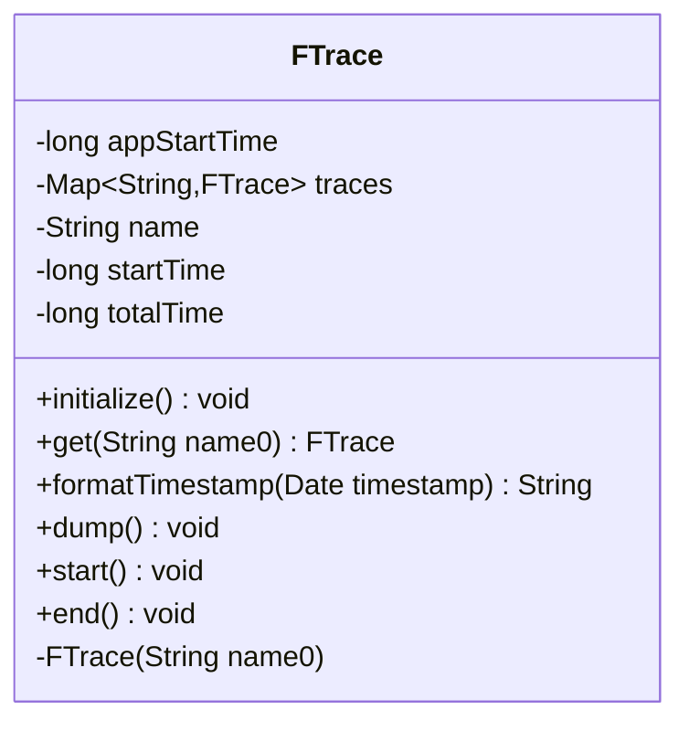

---
aliases:
  - FTrace
tags:
  - java/class
  - module/forge-core
  - pkg/forge
fqn: forge.FTrace
package: forge
module: forge-core
kind: Class
---

# FTrace

**Package:** `forge` &nbsp; **Module:** `forge-core` &nbsp; **Kind:** Class




## Design Description

FTrace is a lightweight static profiling utility that measures wall-clock time for named sections of Forge's execution. It plays a dual role: a class-level registry that maps each name to a single shared `FTrace` via `traces.computeIfAbsent`, and a per-instance stopwatch holding that section's `name`, `startTime`, and cumulative `totalTime`. A private constructor enforces creation only through the static `get`, guaranteeing that every lookup of a name returns the same accumulating timer.

Timing is driven by paired `start`/`end` calls that use the `startTime` field as a sentinel to ignore re-entrant or unmatched invocations, print timestamped console lines, and fold each elapsed span into the running total. The static `dump` reports every trace's total and its percentage of overall runtime (anchored at `initialize`), then clears the map. Depending only on `java.util` and `java.text`, it deliberately favors zero-dependency, console-based instrumentation over a heavier logging framework.

## Source
`forge-core/src/main/java/forge/FTrace.java`

```java
package forge;

import java.text.NumberFormat;
import java.text.SimpleDateFormat;
import java.util.Date;
import java.util.HashMap;
import java.util.Map;

public class FTrace {
    private static long appStartTime;
    private static Map<String, FTrace> traces = new HashMap<>();

    public static void initialize() {
        appStartTime = new Date().getTime();
    }

    public static FTrace get(String name0) {
        FTrace trace = traces.computeIfAbsent(name0, FTrace::new);
        return trace;
    }

    public static String formatTimestamp(Date timestamp) {
        return new SimpleDateFormat("hh:mm:ss.SSS").format(timestamp);
    }

    //dump total time of all traces into log file
    public static void dump() {
        if (traces.isEmpty()) { return; }

        long appTotalTime = new Date().getTime() - appStartTime;
        NumberFormat percent = NumberFormat.getPercentInstance();

        System.out.println();
        System.out.println("Forge total time - " + appTotalTime + "ms");
        for (FTrace trace : traces.values()) {
            System.out.println(trace.name + " total time - " + trace.totalTime + "ms (" + percent.format((double)trace.totalTime / (double)appTotalTime) + ")");
        }
        traces.clear();
    }

    private final String name;
    private long startTime;
    private long totalTime;

    private FTrace(String name0) {
        name = name0;
    }

    public void start() {
        if (startTime > 0) { return; }

        Date now = new Date();
        startTime = now.getTime();
        System.out.println(name + " start - " + formatTimestamp(now));
    }

    public void end() {
        if (startTime == 0) { return; }

        Date now = new Date();
        long elapsed = now.getTime() - startTime;
        startTime = 0;
        totalTime += elapsed;
        System.out.println(name + " end - " + formatTimestamp(now) + " (" + elapsed  + "ms)");
    }
}
```
