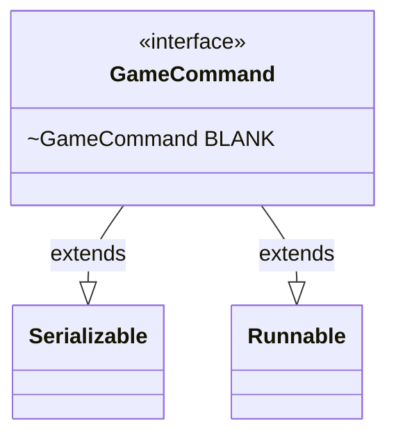

---
aliases:
  - GameCommand
tags:
  - java/interface
  - module/forge-game
  - pkg/forge
fqn: forge.GameCommand
package: forge
module: forge-game
kind: Interface
---

# GameCommand

**Package:** `forge`   **Module:** `forge-game`   **Kind:** Interface



## Design Description

Serves as Forge's general-purpose deferred action interface, representing a parameterless unit of game logic that can be scheduled and executed at a later point during play. By extending `Runnable`, it exposes a single `run()` method as its execution contract, while extending `Serializable` allows commands to be persisted alongside game state for save/load and network synchronization. The interface defines a shared `BLANK` constant—an anonymous no-op implementation—providing a reusable null-object instance that lets callers avoid null checks when no action is required. Its minimal, functional-interface shape reflects an intent to let cards and game systems register lightweight callbacks (triggers, cleanup hooks, state-change responses) without coupling to concrete command classes.

## Source
`forge-game/src/main/java/forge/GameCommand.java`

```java
/*
 * Forge: Play Magic: the Gathering.
 * Copyright (C) 2011  Forge Team
 *
 * This program is free software: you can redistribute it and/or modify
 * it under the terms of the GNU General Public License as published by
 * the Free Software Foundation, either version 3 of the License, or
 * (at your option) any later version.
 * 
 * This program is distributed in the hope that it will be useful,
 * but WITHOUT ANY WARRANTY; without even the implied warranty of
 * MERCHANTABILITY or FITNESS FOR A PARTICULAR PURPOSE.  See the
 * GNU General Public License for more details.
 * 
 * You should have received a copy of the GNU General Public License
 * along with this program.  If not, see <http://www.gnu.org/licenses/>.
 */
package forge;

/**
 * <p>
 * Command interface.
 * </p>
 * 
 * @author Forge
 * @version $Id$
 */
public interface GameCommand extends java.io.Serializable, Runnable {
    /** Constant <code>Blank</code>. */
    GameCommand BLANK = new GameCommand() {

        private static final long serialVersionUID = 2689172297036001710L;

        @Override
        public void run() {
        }

    };
}
```

## Python
`forge/GameCommand.py`

```python
from forge.GameCommand import GameCommand


class _BlankGameCommand(GameCommand):

    serialVersionUID = 2689172297036001710

    def run(self):
        pass


class GameCommand:
    """
    Command interface.

    @author Forge
    @version $Id$
    """

    BLANK: "GameCommand" = None

    def run(self):
        raise NotImplementedError


GameCommand.BLANK = _BlankGameCommand()
```
