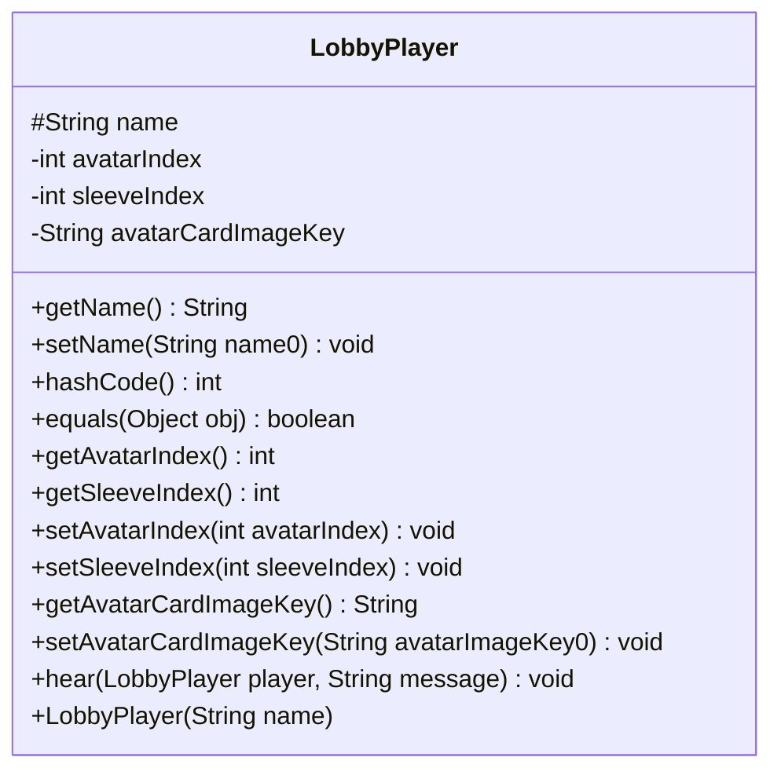

---
aliases:
  - LobbyPlayer
tags:
  - java/class
  - module/forge-core
  - pkg/forge
fqn: forge.LobbyPlayer
package: forge
module: forge-core
kind: Class
---

# LobbyPlayer

**Package:** `forge`   **Module:** `forge-core`   **Kind:** Class



## Design Description

LobbyPlayer is an abstract base class in the forge-core module that models the persistent, game-independent identity of a player at the lobby level—the part of a player that stays constant across all games. It holds presentational and identity state such as the player's name, avatar index, sleeve index, and avatar card image key, exposing standard accessors and mutators (the name setter guards against blank values).

Identity is defined by name: hashCode and equals combine the name with the concrete runtime class, so two LobbyPlayers are equal only when they share both a name and an exact type. As an abstract type it defers communication behavior to subclasses through the abstract hear(LobbyPlayer, String) method, letting each player kind—human or AI—handle incoming messages while inheriting common asset storage. This positions LobbyPlayer as a lightweight supertype that collaborates with String-based identifiers and other LobbyPlayer instances during messaging.

## Source
`forge-core/src/main/java/forge/LobbyPlayer.java`

```java
package forge;

import org.apache.commons.lang3.StringUtils;

import java.util.Objects;

/** 
 * This means a player's part unchanged for all games.
 * 
 * May store player's assets here.
 *
 */
public abstract class LobbyPlayer {
    protected String name;
    private int avatarIndex = -1;
    private int sleeveIndex = -1;
    private String avatarCardImageKey;

    public LobbyPlayer(String name) {
        this.name = name;
    }

    public String getName() {
        return name;
    }
    public void setName(String name0) {
        if (StringUtils.isEmpty(name0)) { return; } //don't allow setting name to nothing
        name = name0;
    }

    @Override
    public int hashCode() {
        final int prime = 31;
        int result = 1;
        result = prime * result + name.hashCode();
        result = prime * result + getClass().hashCode();
        return result;
    }

    /*
     * Two LobbyPlayers are equal if they have the same name.
     */
    @Override
    public boolean equals(Object obj) {
        if (this == obj) {
            return true;
        }
        if (obj == null) {
            return false;
        }
        if (getClass() != obj.getClass()) {
            return false;
        }
        LobbyPlayer other = (LobbyPlayer) obj;
        return Objects.equals(name, other.name);
    }

    public int getAvatarIndex() {
        return avatarIndex;
    }
    public int getSleeveIndex() {
        return sleeveIndex;
    }
    public void setAvatarIndex(int avatarIndex) {
        this.avatarIndex = avatarIndex;
    }
    public void setSleeveIndex(int sleeveIndex) {
        this.sleeveIndex = sleeveIndex;
    }

    public String getAvatarCardImageKey() {
        return avatarCardImageKey;
    }
    public void setAvatarCardImageKey(String avatarImageKey0) {
        this.avatarCardImageKey = avatarImageKey0;
    }

    public abstract void hear(LobbyPlayer player, String message);
}
```

## Python
`forge/LobbyPlayer.py`

```python
from forge.LobbyPlayer import LobbyPlayer
from abc import ABC, abstractmethod
from org.apache.commons.lang3.StringUtils import StringUtils
import java.util.Objects as Objects


class LobbyPlayer(ABC):
    """
    This means a player's part unchanged for all games.

    May store player's assets here.
    """

    def __init__(self, name: str):
        self.name: str = name
        self.avatarIndex: int = -1
        self.sleeveIndex: int = -1
        self.avatarCardImageKey: str = None

    def getName(self) -> str:
        return self.name

    def setName(self, name0: str) -> None:
        if StringUtils.isEmpty(name0):
            return  # don't allow setting name to nothing
        self.name = name0

    def hashCode(self) -> int:
        prime = 31
        result = 1
        result = prime * result + hash(self.name)
        result = prime * result + hash(self.__class__)
        return result

    # Two LobbyPlayers are equal if they have the same name.
    def equals(self, obj: object) -> bool:
        if self is obj:
            return True
        if obj is None:
            return False
        if self.__class__ != obj.__class__:
            return False
        other = obj
        return Objects.equals(self.name, other.name)

    def getAvatarIndex(self) -> int:
        return self.avatarIndex

    def getSleeveIndex(self) -> int:
        return self.sleeveIndex

    def setAvatarIndex(self, avatarIndex: int) -> None:
        self.avatarIndex = avatarIndex

    def setSleeveIndex(self, sleeveIndex: int) -> None:
        self.sleeveIndex = sleeveIndex

    def getAvatarCardImageKey(self) -> str:
        return self.avatarCardImageKey

    def setAvatarCardImageKey(self, avatarImageKey0: str) -> None:
        self.avatarCardImageKey = avatarImageKey0

    @abstractmethod
    def hear(self, player: "LobbyPlayer", message: str) -> None:
        ...
```
