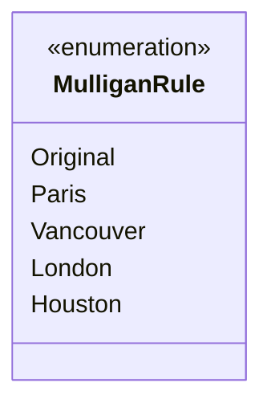

---
aliases:
  - MulliganRule
tags:
  - java/enum
  - module/forge-core
  - pkg/forge
fqn: forge.MulliganDefs.MulliganRule
package: forge
module: forge-core
kind: Enum
---

# MulliganRule

**Package:** `forge` &nbsp; **Module:** `forge-core` &nbsp; **Kind:** Enum



## Source
`forge-core/src/main/java/forge/MulliganDefs.java` — declaration excerpt

```java
    public enum MulliganRule {
        Original,
        Paris,
        Vancouver,
        London,
        Houston
    }
```
