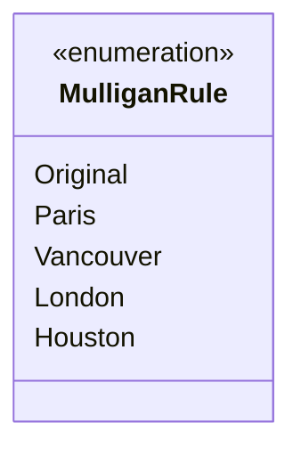

---
aliases:
  - MulliganRule
tags:
  - java/enum
  - module/forge-core
  - pkg/forge
fqn: forge.MulliganDefs.MulliganRule
package: forge
module: forge-core
kind: Enum
---

# MulliganRule

**Package:** `forge`   **Module:** `forge-core`   **Kind:** Enum



## Design Description

The MulliganRule enum defines the set of mulligan rule variants supported by the Forge engine—Original, Paris, Vancouver, London, and Houston—each corresponding to a historically distinct Magic: The Gathering mulligan procedure. As a nested enumeration within the `MulliganDefs` container class in the forge-core module, it serves as a lightweight, type-safe vocabulary for identifying which mulligan algorithm should govern a game's opening-hand resolution. By enumerating the rules as named constants rather than relying on strings or integers, the class lets callers configure and branch on mulligan behavior with compile-time safety, while its placement inside `MulliganDefs` groups it alongside related mulligan definitions to keep the core rules vocabulary cohesive and discoverable.

## Source
`forge-core/src/main/java/forge/MulliganDefs.java` — declaration excerpt

```java
    public enum MulliganRule {
        Original,
        Paris,
        Vancouver,
        London,
        Houston
    }
```

## Python
`forge/MulliganDefs/MulliganRule.py`

```python
from enum import Enum, auto


class MulliganRule(Enum):
    Original = auto()
    Paris = auto()
    Vancouver = auto()
    London = auto()
    Houston = auto()
```
