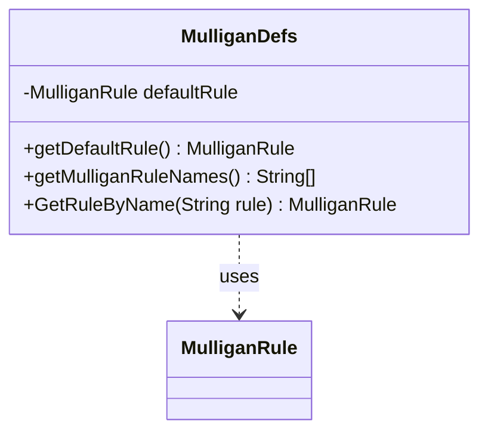

---
aliases:
  - MulliganDefs
tags:
  - java/class
  - module/forge-core
  - pkg/forge
fqn: forge.MulliganDefs
package: forge
module: forge-core
kind: Class
---

# MulliganDefs

**Package:** `forge` &nbsp; **Module:** `forge-core` &nbsp; **Kind:** Class



## Relationships
**Uses:**
- [[forge.MulliganDefs.MulliganRule|MulliganRule]]

## Source
`forge-core/src/main/java/forge/MulliganDefs.java`

```java
package forge;

import com.google.common.collect.Lists;

import java.util.List;

/*
 * A class that contains definitions of available Mulligan rule variants and helper methods to access them
 */
public class MulliganDefs {
    public enum MulliganRule {
        Original,
        Paris,
        Vancouver,
        London,
        Houston
    }

    private static MulliganRule defaultRule = MulliganRule.London;

    public static MulliganRule getDefaultRule() {
        return defaultRule;
    }

    public static String[] getMulliganRuleNames() {
        List<String> names = Lists.newArrayList();
        for (MulliganRule mr : MulliganRule.values()) {
            names.add(mr.name());
        }
        return names.toArray(new String[0]);
    }

    public static MulliganRule GetRuleByName(String rule) {
        MulliganRule r;
        try {
            r = MulliganRule.valueOf(rule);
        } catch (IllegalArgumentException ex) {
            System.err.println("Warning: illegal Mulligan rule specified: " + rule + ", defaulting to " + getDefaultRule().name());
            r = getDefaultRule();
        }

        return r;
    }
}
```
