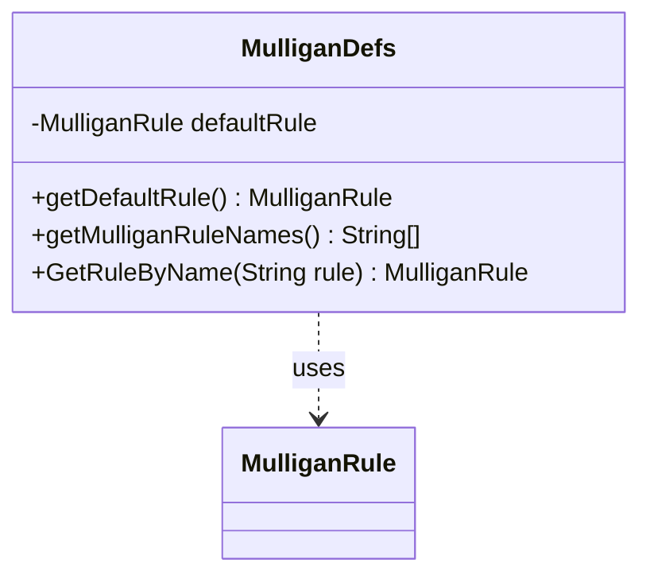

---
aliases:
  - MulliganDefs
tags:
  - java/class
  - module/forge-core
  - pkg/forge
fqn: forge.MulliganDefs
package: forge
module: forge-core
kind: Class
---

# MulliganDefs

**Package:** `forge`   **Module:** `forge-core`   **Kind:** Class



## Relationships
**Uses:**
- [[forge.MulliganDefs.MulliganRule|MulliganRule]]

## Design Description

The MulliganDefs class centralizes the definitions of Magic's supported mulligan rule variants, exposing them through a nested `MulliganRule` enum (Original, Paris, Vancouver, London, and Houston) and a small set of static accessor methods. It serves as a stateless utility/registry: it has no instances, holding only a class-level default rule (London) and helper methods to retrieve that default, enumerate all rule names, and resolve a rule from its string name.

Its sole collaborator is the `MulliganRule` enum it defines, which callers reference when configuring game behavior. The design favors defensive robustness — `GetRuleByName` catches an invalid name, warns to standard error, and falls back to the default rather than propagating an exception — making rule selection from external or configuration input safe and predictable.

## Source
`forge-core/src/main/java/forge/MulliganDefs.java`

```java
package forge;

import com.google.common.collect.Lists;

import java.util.List;

/*
 * A class that contains definitions of available Mulligan rule variants and helper methods to access them
 */
public class MulliganDefs {
    public enum MulliganRule {
        Original,
        Paris,
        Vancouver,
        London,
        Houston
    }

    private static MulliganRule defaultRule = MulliganRule.London;

    public static MulliganRule getDefaultRule() {
        return defaultRule;
    }

    public static String[] getMulliganRuleNames() {
        List<String> names = Lists.newArrayList();
        for (MulliganRule mr : MulliganRule.values()) {
            names.add(mr.name());
        }
        return names.toArray(new String[0]);
    }

    public static MulliganRule GetRuleByName(String rule) {
        MulliganRule r;
        try {
            r = MulliganRule.valueOf(rule);
        } catch (IllegalArgumentException ex) {
            System.err.println("Warning: illegal Mulligan rule specified: " + rule + ", defaulting to " + getDefaultRule().name());
            r = getDefaultRule();
        }

        return r;
    }
}
```

## Python
`forge/MulliganDefs.py`

```python
from forge.MulliganDefs.MulliganRule import MulliganRule
import sys
from enum import Enum


class MulliganDefs:
    class MulliganRule(Enum):
        Original = "Original"
        Paris = "Paris"
        Vancouver = "Vancouver"
        London = "London"
        Houston = "Houston"

    defaultRule = MulliganRule.London

    @staticmethod
    def getDefaultRule() -> "MulliganDefs.MulliganRule":
        return MulliganDefs.defaultRule

    @staticmethod
    def getMulliganRuleNames() -> list[str]:
        names = []
        for mr in MulliganDefs.MulliganRule:
            names.append(mr.name)
        return names

    @staticmethod
    def GetRuleByName(rule: str) -> "MulliganDefs.MulliganRule":
        try:
            r = MulliganDefs.MulliganRule[rule]
        except KeyError:
            sys.stderr.write("Warning: illegal Mulligan rule specified: " + rule + ", defaulting to " + MulliganDefs.getDefaultRule().name + "\n")
            r = MulliganDefs.getDefaultRule()

        return r
```
