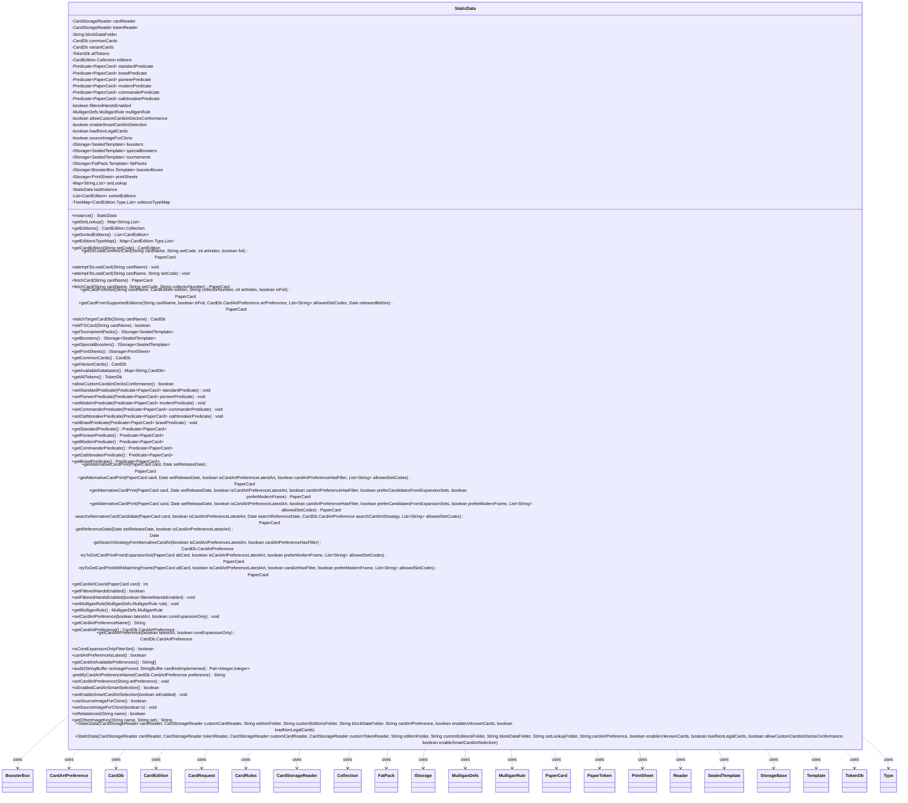

---
aliases:
  - StaticData
tags:
  - java/class
  - module/forge-core
  - pkg/forge
fqn: forge.StaticData
package: forge
module: forge-core
kind: Class
---

# StaticData

**Package:** `forge`   **Module:** `forge-core`   **Kind:** Class



## Relationships
**Uses:**
- [[forge.CardStorageReader|CardStorageReader]]
- [[forge.MulliganDefs|MulliganDefs]]
- [[forge.MulliganDefs.MulliganRule|MulliganRule]]
- [[forge.card.CardDb|CardDb]]
- [[forge.card.CardDb.CardArtPreference|CardArtPreference]]
- [[forge.card.CardDb.CardRequest|CardRequest]]
- [[forge.card.CardEdition|CardEdition]]
- [[forge.card.CardEdition.Collection|Collection]]
- [[forge.card.CardEdition.Reader|Reader]]
- [[forge.card.CardEdition.Type|Type]]
- [[forge.card.CardRules|CardRules]]
- [[forge.card.PrintSheet|PrintSheet]]
- [[forge.item.BoosterBox|BoosterBox]]
- [[forge.item.BoosterBox.Template|Template]]
- [[forge.item.FatPack|FatPack]]
- [[forge.item.FatPack.Template|Template]]
- [[forge.item.PaperCard|PaperCard]]
- [[forge.item.PaperToken|PaperToken]]
- [[forge.item.SealedTemplate|SealedTemplate]]
- [[forge.item.SealedTemplate.Reader|Reader]]
- [[forge.token.TokenDb|TokenDb]]
- [[forge.util.storage.IStorage|IStorage]]
- [[forge.util.storage.StorageBase|StorageBase]]

## Design Description

StaticData is the central, in-memory registry of game invariants for the Forge engine — the cards, tokens, editions, sealed-product templates, and format-legality predicates that remain fixed during play. Constructed once from CardStorageReader sources, it builds and owns the CardDb databases (common and variant), the TokenDb, and the CardEdition.Collection, exposing them through a quasi-singleton accessed via the static instance() handle.

Beyond simple storage, it serves as a façade and lookup service: it resolves PaperCards across all databases by name, set, and collector number, and houses the substantial card-art-preference logic for selecting alternative prints by release date, edition type, and frame. Sealed-product storages (boosters, fat packs, print sheets) are loaded lazily via IStorage/StorageBase, and the audit() method parallelizes image/implementation verification across editions with CompletableFuture, reflecting an intent to keep heavy data marshalling off the critical path.

## Source
`forge-core/src/main/java/forge/StaticData.java`

```java
package forge;

import forge.card.CardDb;
import forge.card.CardEdition;
import forge.card.CardRules;
import forge.card.PrintSheet;
import forge.item.*;
import forge.token.TokenDb;
import forge.util.FileUtil;
import forge.util.ImageUtil;
import forge.util.TextUtil;
import forge.util.storage.IStorage;
import forge.util.storage.StorageBase;
import org.apache.commons.lang3.tuple.Pair;

import java.io.File;
import java.util.*;
import java.util.function.Predicate;
import java.util.concurrent.CompletableFuture;
import java.util.concurrent.ConcurrentLinkedQueue;
import java.util.regex.Pattern;
import java.util.stream.Collectors;

/**
 * The class holding game invariants, such as cards, editions, game formats. All that data, which is not supposed to be changed by player
 *
 * @author Max
 */
public class StaticData {
    private final CardStorageReader cardReader;
    private final CardStorageReader tokenReader;
    private final String blockDataFolder;
    private final CardDb commonCards;
    private final CardDb variantCards;
    private final TokenDb allTokens;
    private final CardEdition.Collection editions;

    private Predicate<PaperCard> standardPredicate;
    private Predicate<PaperCard> brawlPredicate;
    private Predicate<PaperCard> pioneerPredicate;
    private Predicate<PaperCard> modernPredicate;
    private Predicate<PaperCard> commanderPredicate;
    private Predicate<PaperCard> oathbreakerPredicate;

    private boolean filteredHandsEnabled = false;

    private MulliganDefs.MulliganRule mulliganRule = MulliganDefs.getDefaultRule();

    private boolean allowCustomCardsInDecksConformance;
    private boolean enableSmartCardArtSelection;
    private boolean loadNonLegalCards;

    private boolean sourceImageForClone;

    // Loaded lazily:
    private IStorage<SealedTemplate> boosters;
    private IStorage<SealedTemplate> specialBoosters;
    private IStorage<SealedTemplate> tournaments;
    private IStorage<FatPack.Template> fatPacks;
    private IStorage<BoosterBox.Template> boosterBoxes;
    private IStorage<PrintSheet> printSheets;
    private final Map<String, List<String>> setLookup = new HashMap<>();

    private static StaticData lastInstance = null;

    public StaticData(CardStorageReader cardReader, CardStorageReader customCardReader, String editionFolder, String customEditionsFolder, String blockDataFolder, String cardArtPreference, boolean enableUnknownCards, boolean loadNonLegalCards) {
        this(cardReader, null, customCardReader, null, editionFolder, customEditionsFolder, blockDataFolder, "", cardArtPreference, enableUnknownCards, loadNonLegalCards, false, false);
    }

    public StaticData(CardStorageReader cardReader, CardStorageReader tokenReader, CardStorageReader customCardReader, CardStorageReader customTokenReader, String editionFolder, String customEditionsFolder, String blockDataFolder, String setLookupFolder, String cardArtPreference, boolean enableUnknownCards, boolean loadNonLegalCards, boolean allowCustomCardsInDecksConformance, boolean enableSmartCardArtSelection) {
        this.cardReader = cardReader;
        this.tokenReader = tokenReader;
        this.editions = new CardEdition.Collection(new CardEdition.Reader(new File(editionFolder)));
        this.blockDataFolder = blockDataFolder;
        this.allowCustomCardsInDecksConformance = allowCustomCardsInDecksConformance;
        this.enableSmartCardArtSelection = enableSmartCardArtSelection;
        this.loadNonLegalCards = loadNonLegalCards;
        lastInstance = this;
        Set<String> funnyCards = new HashSet<>();
        Set<String> filtered = new HashSet<>();

        editions.append(new CardEdition.Collection(new CardEdition.Reader(new File(customEditionsFolder), true)));

        {
            final Map<String, CardRules> regularCards = new TreeMap<>(String.CASE_INSENSITIVE_ORDER);
            final Map<String, CardRules> variantsCards = new TreeMap<>(String.CASE_INSENSITIVE_ORDER);

            if (!loadNonLegalCards) {
                for (CardEdition e : editions) {
                    if (e.getType() == CardEdition.Type.FUNNY || e.getBorderColor() == CardEdition.BorderColor.SILVER) {
                        List<CardEdition.EditionEntry> eternalCards = e.getFunnyEternalCards();

                        for (CardEdition.EditionEntry cis : e.getAllCardsInSet()) {
                            if (eternalCards.contains(cis))
                                continue;
                            funnyCards.add(cis.name());
                        }
                    }
                }
            }

            for (CardRules card : cardReader.loadCards()) {
                if (null == card) continue;

                final String cardName = card.getPreInitName();

                if (!loadNonLegalCards && funnyCards.contains(cardName) && !card.getType().isBasicLand())
                    filtered.add(cardName);

                if (card.isVariant()) {
                    variantsCards.put(cardName, card);
                } else {
                    regularCards.put(cardName, card);
                }
            }
            if (customCardReader != null) { //Load user's custom cards.
                for (CardRules card : customCardReader.loadCards()) {
                    if (null == card) continue;

                    final String cardName = card.getName();
                    card.setCustom();
                    if (card.isVariant()) { //Append loaded custom cards to the respective list.
                        variantsCards.put(cardName, card);
                    } else {
                        regularCards.put(cardName, card);
                    }
                }
            }

            commonCards = new CardDb(regularCards, editions, filtered);
            variantCards = new CardDb(variantsCards, editions, filtered);

            commonCards.setCardArtPreference(cardArtPreference);
            variantCards.setCardArtPreference(cardArtPreference);

            //must initialize after establish field values for the sake of card image logic
            commonCards.initialize(false, false, enableUnknownCards);
            variantCards.initialize(false, false, enableUnknownCards);
        }

        if (this.tokenReader != null) {
            final Map<String, CardRules> tokens = new TreeMap<>(String.CASE_INSENSITIVE_ORDER);

            for (CardRules card : this.tokenReader.loadCards()) {
                if (null == card) continue;
                tokens.put(card.getNormalizedName(), card);
            }
            if (customTokenReader != null){
                for (CardRules card : customTokenReader.loadCards()){
                    if (null == card) continue;
                    card.setCustom();
                    tokens.put(card.getNormalizedName(), card);
                }
            }
            allTokens = new TokenDb(tokens, editions);
        } else {
            allTokens = null;
        }

        //initialize setLookup
        if (FileUtil.isDirectoryWithFiles(setLookupFolder)){
            for (File f : Objects.requireNonNull(new File(setLookupFolder).listFiles())){
                if (f.isFile()) {
                    setLookup.put(f.getName().replace(".txt",""), FileUtil.readFile(f));
                }
            }
        }
    }

    public static StaticData instance() {
        return lastInstance;
    }

    public Map<String, List<String>> getSetLookup() {
        return setLookup;
    }

    public final CardEdition.Collection getEditions() {
        return this.editions;
    }

    private List<CardEdition> sortedEditions;
    public final List<CardEdition> getSortedEditions() {
        if (sortedEditions == null) {
            sortedEditions = new ArrayList<>();
            for (CardEdition set : editions) {
                sortedEditions.add(set);
            }
            Collections.sort(sortedEditions);
            Collections.reverse(sortedEditions); //put newer sets at the top
        }
        return sortedEditions;
    }

    private TreeMap<CardEdition.Type, List<CardEdition>> editionsTypeMap;
    public final Map<CardEdition.Type, List<CardEdition>> getEditionsTypeMap() {
        if (editionsTypeMap == null) {
            editionsTypeMap = new TreeMap<>();
            for (CardEdition.Type editionType : CardEdition.Type.values()) {
                editionsTypeMap.put(editionType, new ArrayList<>());
            }
            for (CardEdition edition : this.getSortedEditions()) {
                CardEdition.Type key = edition.getType();
                List<CardEdition> editionsOfType = editionsTypeMap.get(key);
                editionsOfType.add(edition);
            }
        }
        return editionsTypeMap;
    }

    public CardEdition getCardEdition(String setCode) {
        if (CardEdition.UNKNOWN_CODE.equals(setCode)) {
            return CardEdition.UNKNOWN;
        }
        CardEdition edition = this.editions.get(setCode);
        return edition;
    }

    public PaperCard getOrLoadCommonCard(String cardName, String setCode, int artIndex, boolean foil) {
        PaperCard card = commonCards.getCard(cardName, setCode, artIndex);
        if (card == null) {
            attemptToLoadCard(cardName, setCode);
            card = commonCards.getCard(cardName, setCode, artIndex);
        }
        if (card == null)
            card = commonCards.getCard(cardName, setCode);
        if (card == null)
            return null;
        return foil ? card.getFoiled() : card;
    }

    public void attemptToLoadCard(String cardName) {
        this.attemptToLoadCard(cardName, null);
    }
    public void attemptToLoadCard(String cardName, String setCode) {
        CardRules rules = cardReader.attemptToLoadCard(cardName);
        if (rules != null) {
            if (rules.isVariant()) {
                variantCards.loadCard(cardName, setCode, rules);
            } else {
                commonCards.loadCard(cardName, setCode, rules);
            }
        }
    }

    /**
     * Retrieve a PaperCard by looking at all available card databases for any matching print.
     * @param cardName The name of the card
     * @return PaperCard instance found in one of the available CardDb databases, or <code>null</code> if not found.
     */
    public PaperCard fetchCard(final String cardName) {
        return fetchCard(cardName, null, null);
    }

    /**
     * Retrieve a PaperCard by looking at all available card databases;
     * @param cardName The name of the card
     * @param setCode The card Edition code
     * @param collectorNumber Card's collector Number
     * @return PaperCard instance found in one of the available CardDb databases, or <code>null</code> if not found.
     */
    public PaperCard fetchCard(final String cardName, final String setCode, final String collectorNumber) {
        PaperCard card = null;
        for (CardDb db : this.getAvailableDatabases().values()) {
            card = db.getCard(cardName, setCode, collectorNumber);
            if (card != null)
                break;
        }
        return card;
    }

    /**
     * Attempt to retrieve a Card from a target Card Edition if found in any available card database.
     * Note: Collector Number and Art Index will be used in a mutual exclusive fashion, that is:
     * collector number will be tried first, and then artIndex will be used in alternative.
     * If neither of those would correspond to any card in the database (due to incorrect value), the method will
     * always attempt a last try by just using card name and set.
     * @param cardName Card Name
     * @param edition CardEdition instance to fetch the card from.
     * @param collectorNumber Card Collector Number.
     * @param artIndex Card Art Index. This value will not be considered if it exceeds the Maximum Art Index value
     *                 supported for the given card in the target Card Edition.
     * @param isFoil Flag determining whether requested card should be foil or not.
     * @return <code>null</code> if no card can be found with the given search parameters.
     */
    public PaperCard getCardFromSet(final String cardName, final CardEdition edition,
                                    final String collectorNumber, final int artIndex, boolean isFoil) {
        CardDb.CardRequest cr = CardDb.CardRequest.fromString(cardName);  // accounts for any foil request ending with+
        cr.isFoil = cr.isFoil || isFoil;
        CardDb targetDb = this.matchTargetCardDb(cr.cardName);
        if (targetDb == null)
            return null;
        // Try with collector number first
        PaperCard result = targetDb.getCardFromSet(cardName, edition, collectorNumber, cr.isFoil);
        if (result == null && !collectorNumber.equals(IPaperCard.NO_COLLECTOR_NUMBER)) {
            if (artIndex != IPaperCard.NO_ART_INDEX) {
                // So here we know cardName exists (checked before invoking this method)
                // and also a Collector Number was specified.
                // The only case we would reach this point is either due to a wrong edition-card match
                // (later resulting in Unknown card - e.g. "Counterspell|FEM") or due to the fact that
                // art Index was specified instead of collector number! Let's give it a go with that
                // but only if artIndex is not NO_ART_INDEX (e.g. collectorNumber = "*32")
                int maxArtForCard = targetDb.getMaxArtIndex(cardName);
                if (artIndex <= maxArtForCard) {
                    // if collNr was "78", it's hardly an artIndex. It was just the wrong collNr for the requested card
                    result = targetDb.getCardFromSet(cardName, edition, artIndex, cr.isFoil);
                }
            }
            if (result == null) {
                // Last chance, try without collector number and see if any match is found
                result = targetDb.getCardFromSet(cardName, edition, cr.isFoil);
            }
        }
        return result;
    }

    /**
     * Retrieves a card from supportedEditions considering current default Card Art Preference,
     * and any possible constraint imposed on Game format (allowed sets) or edition release date.
     * @param cardName Name of the card to match
     * @param isFoil Whether the requested card should be foil.
     * @param artPreference The Card Art Preference to use
     * @param allowedSetCodes List of allowed set codes (if any)
     * @param releasedBefore Any constraint on release date for matched editions. If passed,
     *                       only sets released before the given date (if any) will be considered.
     * @return PaperCard matched in any available dataset, <code>null</code> if no card is found.
     */
    public PaperCard getCardFromSupportedEditions(final String cardName, boolean isFoil,
                                                  CardDb.CardArtPreference artPreference,
                                                  List<String> allowedSetCodes, Date releasedBefore) {
        CardDb.CardRequest cr = CardDb.CardRequest.fromString(cardName);  // accounts for any foil request ending with+
        isFoil = cr.isFoil || isFoil;
        CardDb targetDb = this.matchTargetCardDb(cr.cardName);
        if (targetDb == null)
            return null;
        Predicate<PaperCard> filter = null;
        if (allowedSetCodes != null)
            filter = (Predicate<PaperCard>) targetDb.isLegal(allowedSetCodes);
        PaperCard result;
        String cardRequest = CardDb.CardRequest.compose(cardName, isFoil);
        if (releasedBefore != null) {
            result = targetDb.getCardFromEditionsReleasedBefore(cardRequest, artPreference, releasedBefore, filter);
            if (result == null)
                result = targetDb.getCardFromEditions(cardRequest, artPreference, filter);
        } else
            result = targetDb.getCardFromEditions(cardRequest, artPreference, filter);
        return result;
    }

    private CardDb matchTargetCardDb(final String cardName) {
        // NOTE: any foil request in cardName is NOT taken into account here.
        // It's a private method, so it's a fair assumption.
        for (CardDb targetDb : this.getAvailableDatabases().values()){
            if (targetDb.contains(cardName))
                return targetDb;
        }
        return null;
    }

    /**
     * Determines whether the input String corresponds to an MTG Card Name (in any available card database)
     * @param cardName Name of the Card to verify (CASE SENSITIVE)
     * @return True if a card with the given input string can be found. False otherwise.
     */
    public boolean isMTGCard(final String cardName) {
        if (cardName == null || cardName.trim().length() == 0)
            return false;
        CardDb.CardRequest cr = CardDb.CardRequest.fromString(cardName);  // accounts for any foil request ending with +
        return this.commonCards.contains(cr.cardName) || this.variantCards.contains(cr.cardName);
    }

    /** @return {@link forge.util.storage.IStorage}<{@link forge.item.SealedTemplate}> */
    public final IStorage<SealedTemplate> getTournamentPacks() {
        if (tournaments == null)
            tournaments = new StorageBase<>("Starter sets", new SealedTemplate.Reader(new File(blockDataFolder, "starters.txt")));
        return tournaments;
    }

    /** @return {@link forge.util.storage.IStorage}<{@link forge.item.SealedTemplate}> */
    public final IStorage<SealedTemplate> getBoosters() {
        if (boosters == null)
            boosters = new StorageBase<>("Boosters", editions.getBoosterGenerator());
        return boosters;
    }

    public final IStorage<SealedTemplate> getSpecialBoosters() {
        if (specialBoosters == null)
            specialBoosters = new StorageBase<>("Special boosters", new SealedTemplate.Reader(new File(blockDataFolder, "boosters-special.txt")));
        return specialBoosters;
    }

    public IStorage<PrintSheet> getPrintSheets() {
        if (printSheets == null)
            printSheets = PrintSheet.initializePrintSheets(new File(blockDataFolder, "printsheets.txt"), getEditions());
        return printSheets;
    }

    public CardDb getCommonCards() {
        return commonCards;
    }

    public CardDb getVariantCards() {
        return variantCards;
    }

    public Map<String, CardDb> getAvailableDatabases(){
        Map<String, CardDb> databases = new LinkedHashMap<>();  // to process dbs in this exact order
        databases.put("Common", commonCards);
        databases.put("Variant", variantCards);
        return databases;
    }

    public TokenDb getAllTokens() { return allTokens; }

    public boolean allowCustomCardsInDecksConformance() {
        return this.allowCustomCardsInDecksConformance;
    }

    public void setStandardPredicate(Predicate<PaperCard> standardPredicate) { this.standardPredicate = standardPredicate; }

    public void setPioneerPredicate(Predicate<PaperCard> pioneerPredicate) { this.pioneerPredicate = pioneerPredicate; }

    public void setModernPredicate(Predicate<PaperCard> modernPredicate) { this.modernPredicate = modernPredicate; }

    public void setCommanderPredicate(Predicate<PaperCard> commanderPredicate) { this.commanderPredicate = commanderPredicate; }

    public void setOathbreakerPredicate(Predicate<PaperCard> oathbreakerPredicate) { this.oathbreakerPredicate = oathbreakerPredicate; }

    public void setBrawlPredicate(Predicate<PaperCard> brawlPredicate) { this.brawlPredicate = brawlPredicate; }

    public Predicate<PaperCard> getStandardPredicate() { return standardPredicate; }

    public Predicate<PaperCard> getPioneerPredicate() { return pioneerPredicate; }

    public Predicate<PaperCard> getModernPredicate() { return modernPredicate; }

    public Predicate<PaperCard> getCommanderPredicate() { return commanderPredicate; }

    public Predicate<PaperCard> getOathbreakerPredicate() { return oathbreakerPredicate; }

    public Predicate<PaperCard> getBrawlPredicate() { return brawlPredicate; }

    /**
     * Get an alternative card print for the given card wrt. the input setReleaseDate.
     * The reference release date will be used to retrieve the alternative art, according
     * to the Card Art Preference settings.
     *
     * Note: if input card is Foil, and an alternative card art is found, it will be returned foil too!
     *
     * @param card Input Reference Card
     * @param setReleaseDate reference set release date
     * @return Alternative Card Art (from a different edition) of input card, or null if not found.
     */
    public PaperCard getAlternativeCardPrint(PaperCard card, final Date setReleaseDate) {
        boolean isCardArtPreferenceLatestArt = this.cardArtPreferenceIsLatest();
        boolean cardArtPreferenceHasFilter = this.isCoreExpansionOnlyFilterSet();
        return this.getAlternativeCardPrint(card, setReleaseDate, isCardArtPreferenceLatestArt,
                                            cardArtPreferenceHasFilter, null);
    }

    /**
     * Retrieve an alternative card print for a given card, and the input reference set release date.
     * The <code>setReleaseDate</code> will be used depending on the desired Card Art Preference policy to apply
     * when looking for alternative card, namely <code>Latest Art</code> and <i>with</i> or <i>without</i> filters
     * on editions.
     *
     * In more details:
     * - If card art preference is Latest Art first, the alternative card print will be chosen from
     * the first edition that has been released **after** the reference date.
     * - Conversely, if card art preference is Original Art first, the alternative card print will be
     * chosen from the first edition that has been released **before** the reference date.
     *
     * The rationale behind this strategy is to select an alternative card print from the lower-bound extreme
     * (upper-bound extreme) among the latest (original) editions where the card can be found.
     *
     * @param card  The instance of <code>PaperCard</code> to look for an alternative print
     * @param setReleaseDate  The reference release date used to control the search for alternative card print.
     *                        The chose candidate will be gathered from an edition printed before (upper bound) or
     *                        after (lower bound) the reference set release date.
     * @param isCardArtPreferenceLatestArt  Determines whether "Latest Art" Card Art preference should be used
     *                                      when looking for an alternative candidate print.
     * @param cardArtPreferenceHasFilter    Determines whether the search should only consider
     *                                      Core, Expansions, or Reprints sets when looking for alternative candidates.
     * @return  an instance of <code>PaperCard</code> that is the selected alternative candidate, or <code>null</code>
     * if None could be found.
     */
    public PaperCard getAlternativeCardPrint(PaperCard card, Date setReleaseDate,
                                             boolean isCardArtPreferenceLatestArt,
                                             boolean cardArtPreferenceHasFilter, List<String> allowedSetCodes) {
        Date searchReferenceDate = getReferenceDate(setReleaseDate, isCardArtPreferenceLatestArt);
        CardDb.CardArtPreference searchCardArtStrategy = getSearchStrategyForAlternativeCardArt(isCardArtPreferenceLatestArt,
                                                                          cardArtPreferenceHasFilter);
        return searchAlternativeCardCandidate(card, isCardArtPreferenceLatestArt, searchReferenceDate,
                                              searchCardArtStrategy, allowedSetCodes);
    }

    /**
     * This method extends the default <code>getAlternativeCardPrint</code> with extra settings to be used for
     * alternative card print.
     *
     * <p>
     * These options for Alternative Card Print make sense as part of the harmonisation/theme-matching process for
     * cards in Deck Sections (i.e. CardPool). In fact, the values of the provided flags for alternative print
     * for a single card will be determined according to whole card pool (Deck section) the card appears in.
     *
     * @param card  The instance of <code>PaperCard</code> to look for an alternative print
     * @param setReleaseDate  The reference release date used to control the search for alternative card print.
     *                        The chose candidate will be gathered from an edition printed before (upper bound) or
     *                        after (lower bound) the reference set release date.
     * @param isCardArtPreferenceLatestArt  Determines whether or not "Latest Art" Card Art preference should be used
     *                                      when looking for an alternative candidate print.
     * @param cardArtPreferenceHasFilter    Determines whether or not the search should only consider
     *                                      Core, Expansions, or Reprints sets when looking for alternative candidates.
     * @param preferCandidatesFromExpansionSets Whenever the selected Card Art Preference has filter, try to get
     *                                          prefer candidates from Expansion Sets over those in Core or Reprint
     *                                          Editions (whenever possible)
     *                                          e.g. Necropotence from Ice Age rather than 5th Edition (w/ Latest=false)
     * @param preferModernFrame  If True, Modern Card Frame will be preferred over Old Frames.
     * @return an instance of <code>PaperCard</code> that is the selected alternative candidate, or <code>null</code>
     *          if None could be found.
     */
    public PaperCard getAlternativeCardPrint(PaperCard card, Date setReleaseDate, boolean isCardArtPreferenceLatestArt,
                                             boolean cardArtPreferenceHasFilter,
                                             boolean preferCandidatesFromExpansionSets, boolean preferModernFrame) {
        return getAlternativeCardPrint(card, setReleaseDate, isCardArtPreferenceLatestArt, cardArtPreferenceHasFilter,
                                        preferCandidatesFromExpansionSets, preferModernFrame, null);
    }

    /**
     * This method extends the default <code>getAlternativeCardPrint</code> with extra settings to be used for
     * alternative card print.
     *
     * <p>
     * These options for Alternative Card Print make sense as part of the harmonisation/theme-matching process for
     * cards in Deck Sections (i.e. CardPool). In fact, the values of the provided flags for alternative print
     * for a single card will be determined according to whole card pool (Deck section) the card appears in.
     *
     * @param card  The instance of <code>PaperCard</code> to look for an alternative print
     * @param setReleaseDate  The reference release date used to control the search for alternative card print.
     *                        The chose candidate will be gathered from an edition printed before (upper bound) or
     *                        after (lower bound) the reference set release date.
     * @param isCardArtPreferenceLatestArt  Determines whether or not "Latest Art" Card Art preference should be used
     *                                      when looking for an alternative candidate print.
     * @param cardArtPreferenceHasFilter    Determines whether or not the search should only consider
     *                                      Core, Expansions, or Reprints sets when looking for alternative candidates.
     * @param preferCandidatesFromExpansionSets Whenever the selected Card Art Preference has filter, try to get
     *                                          prefer candidates from Expansion Sets over those in Core or Reprint
     *                                          Editions (whenever possible)
     *                                          e.g. Necropotence from Ice Age rather than 5th Edition (w/ Latest=false)
     * @param preferModernFrame  If True, Modern Card Frame will be preferred over Old Frames.
     * @param allowedSetCodes The list of the allowed set codes to consider when looking for alternative card art
     *                        candidates. If the list is not null and not empty, will be used in combination with the
     *                        <code>isLegal</code> predicate.
     * @return an instance of <code>PaperCard</code> that is the selected alternative candidate, or <code>null</code>
     *          if None could be found.
     */
    public PaperCard getAlternativeCardPrint(PaperCard card, Date setReleaseDate, boolean isCardArtPreferenceLatestArt,
                                             boolean cardArtPreferenceHasFilter,
                                             boolean preferCandidatesFromExpansionSets, boolean preferModernFrame,
                                             List<String> allowedSetCodes){
        PaperCard altCard = this.getAlternativeCardPrint(card, setReleaseDate, isCardArtPreferenceLatestArt,
                                                          cardArtPreferenceHasFilter, allowedSetCodes);
        if (altCard == null)
            return altCard;
        // from here on, we're sure we do have a candidate already!

        /* Try to refine selection by getting one candidate with frame matching current
           Card Art Preference (that is NOT the lookup strategy!)*/
        PaperCard refinedAltCandidate = this.tryToGetCardPrintWithMatchingFrame(altCard, isCardArtPreferenceLatestArt,
                                                                                cardArtPreferenceHasFilter,
                                                                                preferModernFrame, allowedSetCodes);
        if (refinedAltCandidate != null)
            altCard = refinedAltCandidate;

        if (cardArtPreferenceHasFilter && preferCandidatesFromExpansionSets){
            /* Now try to refine selection by looking for an alternative choice extracted from an Expansion Set.
               NOTE: At this stage, any future selection should be already compliant with previous filter on
               Card Frame (if applied) given that we'll be moving either UP or DOWN the timeline of Card Edition */
            refinedAltCandidate = this.tryToGetCardPrintFromExpansionSet(altCard, isCardArtPreferenceLatestArt,
                                                                            preferModernFrame, allowedSetCodes);
            if (refinedAltCandidate != null)
                altCard = refinedAltCandidate;
        }
        return altCard;
    }

    private PaperCard searchAlternativeCardCandidate(PaperCard card, boolean isCardArtPreferenceLatestArt,
                                                     Date searchReferenceDate,
                                                     CardDb.CardArtPreference searchCardArtStrategy,
                                                     List<String> allowedSetCodes) {
        // Note: this won't apply to Custom Nor Variant Cards, so won't bother including it!
        CardDb cardDb = this.commonCards;
        String cardName = card.getName();
        int artIndex = card.getArtIndex();
        PaperCard altCard = null;
        Predicate<PaperCard> filter = null;
        if (allowedSetCodes != null && !allowedSetCodes.isEmpty())
            filter = (Predicate<PaperCard>) cardDb.isLegal(allowedSetCodes);

        if (isCardArtPreferenceLatestArt) {  // RELEASED AFTER REFERENCE DATE
            altCard = cardDb.getCardFromEditionsReleasedAfter(cardName, searchCardArtStrategy, artIndex,
                                                                searchReferenceDate, filter);
            if (altCard == null)  // relax artIndex condition
                altCard = cardDb.getCardFromEditionsReleasedAfter(cardName, searchCardArtStrategy,
                                                                    searchReferenceDate, filter);
        } else {  // RELEASED BEFORE REFERENCE DATE
            altCard = cardDb.getCardFromEditionsReleasedBefore(cardName, searchCardArtStrategy, artIndex,
                                                                searchReferenceDate, filter);
            if (altCard == null)  // relax artIndex constraint
                altCard = cardDb.getCardFromEditionsReleasedBefore(cardName, searchCardArtStrategy,
                                                                    searchReferenceDate, filter);
        }
        if (altCard == null)
            return null;
        return card.isFoil() ? altCard.getFoiled() : altCard;
    }

    private Date getReferenceDate(Date setReleaseDate, boolean isCardArtPreferenceLatestArt) {
        Calendar cal = Calendar.getInstance();
        cal.setTime(setReleaseDate);
        if (isCardArtPreferenceLatestArt)
            cal.add(Calendar.DATE, -2);  // go two days behind to also include the original reference set
        else
            cal.add(Calendar.DATE, 2);  // go two days ahead to also include the original reference set
        return cal.getTime();
    }

    private CardDb.CardArtPreference getSearchStrategyForAlternativeCardArt(boolean isCardArtPreferenceLatestArt, boolean cardArtPreferenceHasFilter) {
        CardDb.CardArtPreference lookupStrategy;
        if (isCardArtPreferenceLatestArt) {
            // Get Lower bound (w/ Original Art and Edition Released AFTER Pivot Date)
            if (cardArtPreferenceHasFilter)
                lookupStrategy = CardDb.CardArtPreference.ORIGINAL_ART_CORE_EXPANSIONS_REPRINT_ONLY;  // keep the filter
            else
                lookupStrategy = CardDb.CardArtPreference.ORIGINAL_ART_ALL_EDITIONS;
        } else {
            // Get Upper bound (w/ Latest Art and Edition released BEFORE Pivot Date)
            if (cardArtPreferenceHasFilter)
                lookupStrategy = CardDb.CardArtPreference.LATEST_ART_CORE_EXPANSIONS_REPRINT_ONLY;  // keep the filter
            else
                lookupStrategy = CardDb.CardArtPreference.LATEST_ART_ALL_EDITIONS;
        }
        return lookupStrategy;
    }

    private PaperCard tryToGetCardPrintFromExpansionSet(PaperCard altCard,
                                                        boolean isCardArtPreferenceLatestArt,
                                                        boolean preferModernFrame,
                                                        List<String> allowedSetCodes) {
        CardEdition altCardEdition = editions.get(altCard.getEdition());
        if (altCardEdition.getType() == CardEdition.Type.EXPANSION)
            return null;  // Nothing to do here!
        boolean searchStrategyFlag = (isCardArtPreferenceLatestArt == preferModernFrame) == isCardArtPreferenceLatestArt;
        // We'll force the filter on to strictly reduce the alternative candidates retrieved to those
        // from Expansions, Core, and Reprint sets.
        CardDb.CardArtPreference searchStrategy = getSearchStrategyForAlternativeCardArt(searchStrategyFlag,
                                                                                         true);
        PaperCard altCandidate = altCard;
        while (altCandidate != null) {
            Date referenceDate = editions.get(altCandidate.getEdition()).getDate();
            altCandidate = this.searchAlternativeCardCandidate(altCandidate, preferModernFrame,
                                                                referenceDate, searchStrategy, allowedSetCodes);
            if (altCandidate != null) {
                CardEdition altCandidateEdition = editions.get(altCandidate.getEdition());
                if (altCandidateEdition.getType() == CardEdition.Type.EXPANSION)
                    break;
            }
        }
        // this will be either a true candidate or null if the cycle broke because of no other suitable candidates
        return altCandidate;
    }

    private PaperCard tryToGetCardPrintWithMatchingFrame(PaperCard altCard,
                                                         boolean isCardArtPreferenceLatestArt,
                                                         boolean cardArtHasFilter,
                                                         boolean preferModernFrame, List<String> allowedSetCodes) {
        CardEdition altCardEdition = editions.get(altCard.getEdition());
        boolean frameIsCompliantAlready = (altCardEdition.isModern() == preferModernFrame);
        if (frameIsCompliantAlready)
            return null;  // Nothing to do here!
        boolean searchStrategyFlag = (isCardArtPreferenceLatestArt == preferModernFrame) == isCardArtPreferenceLatestArt;
        CardDb.CardArtPreference searchStrategy = getSearchStrategyForAlternativeCardArt(searchStrategyFlag,
                                                                                         cardArtHasFilter);
        PaperCard altCandidate = altCard;
        while (altCandidate != null) {
            Date referenceDate = editions.get(altCandidate.getEdition()).getDate();
            altCandidate = this.searchAlternativeCardCandidate(altCandidate, preferModernFrame,
                                                               referenceDate, searchStrategy, allowedSetCodes);
            if (altCandidate != null) {
                CardEdition altCandidateEdition = editions.get(altCandidate.getEdition());
                if (altCandidateEdition.isModern() == preferModernFrame)
                    break;
            }
        }
        // this will be either a true candidate or null if the cycle broke because of no other suitable candidates
        return altCandidate;
    }

    /**
     * Get the Art Count for a given <code>PaperCard</code> looking for a candidate in all
     * available databases.
     *
     * @param card Instance of target <code>PaperCard</code>
     * @return The number of available arts for the given card in the corresponding set, or 0 if not found.
     */
    public int getCardArtCount(PaperCard card) {
        Collection<CardDb> databases = this.getAvailableDatabases().values();
        for (CardDb db: databases){
            int artCount = db.getArtCount(card.getName(), card.getEdition());
            if (artCount > 0)
                return artCount;
        }
        return 0;
    }

    public boolean getFilteredHandsEnabled() {
        return filteredHandsEnabled;
    }
    public void setFilteredHandsEnabled(boolean filteredHandsEnabled) {
        this.filteredHandsEnabled = filteredHandsEnabled;
    }

    public void setMulliganRule(MulliganDefs.MulliganRule rule) {
        mulliganRule = rule;
    }
    public MulliganDefs.MulliganRule getMulliganRule() {
        return mulliganRule;
    }

    public void setCardArtPreference(boolean latestArt, boolean coreExpansionOnly) {
        this.commonCards.setCardArtPreference(latestArt, coreExpansionOnly);
        this.variantCards.setCardArtPreference(latestArt, coreExpansionOnly);
    }

    public String getCardArtPreferenceName() {
        return this.commonCards.getCardArtPreference().toString();
    }

    public CardDb.CardArtPreference getCardArtPreference() {
        return this.commonCards.getCardArtPreference();
    }

    public CardDb.CardArtPreference getCardArtPreference(boolean latestArt, boolean coreExpansionOnly) {
        if (latestArt) {
            return coreExpansionOnly ? CardDb.CardArtPreference.LATEST_ART_CORE_EXPANSIONS_REPRINT_ONLY : CardDb.CardArtPreference.LATEST_ART_ALL_EDITIONS;
        }
        return coreExpansionOnly ? CardDb.CardArtPreference.ORIGINAL_ART_CORE_EXPANSIONS_REPRINT_ONLY : CardDb.CardArtPreference.ORIGINAL_ART_ALL_EDITIONS;
    }


    public boolean isCoreExpansionOnlyFilterSet() { return this.commonCards.getCardArtPreference().filterSets; }

    public boolean cardArtPreferenceIsLatest() {
        return this.commonCards.getCardArtPreference().latestFirst;
    }

    // === MOBILE APP Alternative Methods (using String Labels, not yet localised!!) ===
    // Note: only used in mobile
    public String[] getCardArtAvailablePreferences() {
        CardDb.CardArtPreference[] preferences = CardDb.CardArtPreference.values();
        String[] preferences_avails = new String[preferences.length];
        for (int i = 0; i < preferences.length; i++)
            preferences_avails[i] = prettifyCardArtPreferenceName(preferences[i]);
        return preferences_avails;
    }
    public Pair<Integer, Integer> audit(StringBuffer noImageFound, StringBuffer cardNotImplemented) {
        Queue<String> EDITION_Q = new ConcurrentLinkedQueue<>();
        Queue<String> NIF_Q = new ConcurrentLinkedQueue<>();
        Queue<String> CNI_Q = new ConcurrentLinkedQueue<>();
        Queue<String> TOKEN_Q = new ConcurrentLinkedQueue<>();
        boolean nifHeader = false;
        boolean cniHeader = false;
        final Pattern funnyCardCollectorNumberPattern = Pattern.compile("^F★?\\d+★?");
        for (CardEdition e : editions) {
            if (CardEdition.Type.FUNNY.equals(e.getType()))
                continue;

            Map<String, Pair<Boolean, Integer>> cardCount = new HashMap<>();
            List<CompletableFuture<?>> futures = new ArrayList<>();
            for (CardEdition.EditionEntry c : e.getObtainableCards()) {
                int amount = 1;

                if (cardCount.containsKey(c.name())) {
                    amount = cardCount.get(c.name()).getRight() + 1;
                }

                cardCount.put(c.name(), Pair.of(c.collectorNumber() != null && funnyCardCollectorNumberPattern.matcher(c.collectorNumber()).matches(), amount));
            }

            // loop through the cards in this edition, considering art variations...
            for (Map.Entry<String, Pair<Boolean, Integer>> entry : cardCount.entrySet()) {
                futures.add(CompletableFuture.supplyAsync(()-> {
                    final String c = entry.getKey();
                    final int artID = entry.getValue().getRight();
                    final boolean isFunny = entry.getValue().getLeft();
                    PaperCard cp = getCommonCards().getCard(c, e.getCode(), artID);
                    if (cp == null) {
                        cp = getVariantCards().getCard(c, e.getCode(), artID);
                    }
                    if (cp == null) {
                        if (isFunny) //skip funny cards
                            return null;
                        if (!loadNonLegalCards && CardEdition.Type.FUNNY.equals(e.getType()))
                            return null;
                        EDITION_Q.add(e.getCode() + "_" + e.getName());
                        CNI_Q.add(e.getCode() + "_" + c + "\n");
                        return null;
                    }
                    // check the front image
                    String imagePath = ImageUtil.getImageRelativePath(cp, "", true, false);
                    if (imagePath != null) {
                        File file = ImageKeys.getImageFile(imagePath);
                        if (file == null && ImageKeys.hasSetLookup(imagePath))
                            file = ImageKeys.setLookUpFile(imagePath, imagePath +"border");
                        if (file == null) {
                            if (imagePath.isEmpty())
                                return null;
                            EDITION_Q.add(e.getCode() + "_" + e.getName());
                            NIF_Q.add(e.getCode() + "_" + imagePath + "\n");
                        }
                    }
                    // check the back face
                    if (cp.hasBackFace()) {
                        imagePath = ImageUtil.getImageRelativePath(cp, "back", true, false);
                        if (imagePath != null) {
                            File file = ImageKeys.getImageFile(imagePath);
                            if (file == null && ImageKeys.hasSetLookup(imagePath))
                                file = ImageKeys.setLookUpFile(imagePath, imagePath +"border");
                            if (file == null) {
                                if (imagePath.isEmpty())
                                    return null;
                                EDITION_Q.add(e.getCode() + "_" + e.getName());
                                NIF_Q.add(e.getCode() + "_" + imagePath + "\n");
                            }
                        }
                    }
                    return null;
                }).exceptionally(ex -> {
                    ex.printStackTrace();
                    return null;
                }));
            }
            CompletableFuture<?>[] futuresArray = futures.toArray(new CompletableFuture<?>[0]);
            CompletableFuture.allOf(futuresArray).join();
            futures.clear();

            // TODO: Audit token images here...
            for(Map.Entry<String, Collection<CardEdition.EditionEntry>> tokenEntry : e.getTokens().asMap().entrySet()) {
                final String name = tokenEntry.getKey();
                final int artIndex = tokenEntry.getValue().size();
                try {
                    PaperToken token = getAllTokens().getToken(name, e.getCode());
                    if (token == null) {
                        continue;
                    }

                    for(int i = 0; i < artIndex; i++) {
                        String imgKey = token.getImageKey(i);
                        File file = ImageKeys.getImageFile(imgKey);
                        if (file == null) {
                            EDITION_Q.add(e.getCode() + "_" + e.getName());
                            TOKEN_Q.add(e.getCode() + "_" + token.getImageFilename(i + 1) + "\n");
                        }
                    }
                } catch(Exception ex) {
                    System.out.println("No Token found: " + name + " in " + e.getName());
                }
            }
        }
        // stream().toList() causes crash on Android 8-13, use Collectors.toList()
        List<String> NIF = new ArrayList<>(NIF_Q).stream().sorted().collect(Collectors.toList());
        List<String> CNI = new ArrayList<>(CNI_Q).stream().sorted().collect(Collectors.toList());
        List<String> TOK = new ArrayList<>(TOKEN_Q).stream().sorted().collect(Collectors.toList());
        List<String> sorted_editions = EDITION_Q.stream().distinct().sorted().collect(Collectors.toList());
        for (String edition : sorted_editions) {
            String[] arr =  edition.split("_");
            String code = arr[0];
            boolean NIF_TITLE = false, CNI_TITLE = false, TOK_TITLE = false;
            for (String nif : NIF) {
                if (nif.startsWith(code)) {
                    if (!nifHeader) {
                        noImageFound.append("\n-------------------\n");
                        noImageFound.append("NO IMAGE FOUND LIST\n");
                        noImageFound.append("-------------------\n\n");
                        nifHeader = true;
                    }
                    if (!NIF_TITLE) {
                        noImageFound.append(edition.replace(code + "_","")).append(" (").append(code).append(")").append("\n");
                        NIF_TITLE = true;
                    }
                    noImageFound.append("    ").append(nif.replace(code + "_", ""));
                }
            }
            if (NIF_TITLE)
                noImageFound.append("\n");
            for (String tok : TOK) {
                if (tok.startsWith(code)) {
                    if (!nifHeader) {
                        noImageFound.append("\n-------------------\n");
                        noImageFound.append("NO IMAGE FOUND LIST\n");
                        noImageFound.append("-------------------\n\n");
                        nifHeader = true;
                    }
                    if (!NIF_TITLE) {
                        noImageFound.append(edition.replace(code + "_","")).append(" (").append(code).append(")").append("\n");
                        NIF_TITLE = true;
                    }
                    if (!TOK_TITLE) {
                        noImageFound.append("  TOKENS\n");
                        TOK_TITLE = true;
                    }
                    noImageFound.append("    ").append(tok.replace(code + "_", ""));
                }
            }
            if (TOK_TITLE)
                noImageFound.append("\n");
            for (String cni : CNI) {
                if (cni.startsWith(code)) {
                    if (!cniHeader) {
                        cardNotImplemented.append("\n-------------------\n");
                        cardNotImplemented.append("UNIMPLEMENTED CARD LIST\n");
                        cardNotImplemented.append("-------------------\n\n");
                        cniHeader = true;
                    }
                    if (!CNI_TITLE) {
                        cardNotImplemented.append(edition.replace(code + "_","")).append(" (").append(code).append(")").append("\n");
                        CNI_TITLE = true;
                    }
                    cardNotImplemented.append("     ").append(cni.replace(code + "_", ""));
                }
            }
            if (CNI_TITLE)
                cardNotImplemented.append("\n");
        }

        final int missingImages = NIF.size() + TOK.size();
        final int unimplemenedCards = CNI.size();
        String totalStats = "Missing images: " + missingImages + "\nUnimplemented cards: " + unimplemenedCards + "\n";
        cardNotImplemented.append("\n-----------\n");
        cardNotImplemented.append(totalStats);
        cardNotImplemented.append("-----------\n\n");

        noImageFound.append(cardNotImplemented); // combine things together...
        return Pair.of(missingImages, unimplemenedCards);
    }

    private String prettifyCardArtPreferenceName(CardDb.CardArtPreference preference) {
        StringBuilder label = new StringBuilder();
        String[] fullNames = preference.toString().split("_");
        for (String name : fullNames)
            label.append(TextUtil.capitalize(name.toLowerCase())).append(" ");
        return label.toString().trim();
    }

    public void setCardArtPreference(String artPreference) {
        this.commonCards.setCardArtPreference(artPreference);
        this.variantCards.setCardArtPreference(artPreference);
    }

    public boolean isEnabledCardArtSmartSelection() {
        return this.enableSmartCardArtSelection;
    }
    public void setEnableSmartCardArtSelection(boolean isEnabled) {
        this.enableSmartCardArtSelection = isEnabled;
    }

    public boolean useSourceImageForClone() {
        return sourceImageForClone;
    }
    public void setSourceImageForClone(final boolean b) {
        this.sourceImageForClone = b;
    }

    public boolean isRebalanced(String name) {
        if (!name.startsWith("A-")) {
            return false;
        }
        for (PaperCard pc : this.getCommonCards().getAllCards(name)) {
            CardEdition e = this.editions.get(pc.getEdition());
            if (e != null && e.isRebalanced(name)) {
                return true;
            }
        }
        return false;
    }
    public String getOtherImageKey(String name, String set) {
        if (this.editions.get(set) != null) {
            String realSetCode = this.editions.get(set).getOtherSet(name);
            if (realSetCode != null) {
                CardEdition.EditionEntry ee = this.editions.get(realSetCode).findOther(name);
                if (ee != null) { // TODO add collector Number and new ImageKey format
                    return ImageKeys.getTokenKey(String.format("%s|%s|%s", name, realSetCode, ee.collectorNumber()));
                }
            }
        }
        for (CardEdition e : this.editions) {
            CardEdition.EditionEntry ee = e.findOther(name);
            if (ee != null) { // TODO add collector Number and new ImageKey format
                return ImageKeys.getTokenKey(String.format("%s|%s|%s", name, e.getCode(), ee.collectorNumber()));
            }
        }
        // final fallback
        return ImageKeys.getTokenKey(name);
    }
}
```

## Python
`forge/StaticData.py`

```python
from forge.CardStorageReader import CardStorageReader
from forge.MulliganDefs import MulliganDefs
from forge.MulliganDefs.MulliganRule import MulliganRule
from forge.card.CardDb import CardDb
from forge.card.CardDb.CardArtPreference import CardArtPreference
from forge.card.CardDb.CardRequest import CardRequest
from forge.card.CardEdition import CardEdition
from forge.card.CardEdition.Collection import Collection
from forge.card.CardEdition.Reader import Reader
from forge.card.CardEdition.Type import Type
from forge.card.CardRules import CardRules
from forge.card.PrintSheet import PrintSheet
from forge.item.BoosterBox import BoosterBox
from forge.item.BoosterBox.Template import Template
from forge.item.FatPack import FatPack
from forge.item.FatPack.Template import Template
from forge.item.PaperCard import PaperCard
from forge.item.PaperToken import PaperToken
from forge.item.SealedTemplate import SealedTemplate
from forge.item.SealedTemplate.Reader import Reader
from forge.item.IPaperCard import IPaperCard
from forge.token.TokenDb import TokenDb
from forge.util.storage.IStorage import IStorage
from forge.util.storage.StorageBase import StorageBase
from forge.ImageKeys import ImageKeys
from forge.util.FileUtil import FileUtil
from forge.util.ImageUtil import ImageUtil
from forge.util.TextUtil import TextUtil

import os
import re
import traceback
from datetime import timedelta


class StaticData:
    """
    The class holding game invariants, such as cards, editions, game formats. All that data, which is not supposed to be changed by player

    @author Max
    """

    lastInstance = None

    def __init__(self, *args):
        if len(args) == 8:
            (cardReader, customCardReader, editionFolder, customEditionsFolder,
             blockDataFolder, cardArtPreference, enableUnknownCards, loadNonLegalCards) = args
            self.__init__(cardReader, None, customCardReader, None, editionFolder,
                          customEditionsFolder, blockDataFolder, "", cardArtPreference,
                          enableUnknownCards, loadNonLegalCards, False, False)
            return

        (cardReader, tokenReader, customCardReader, customTokenReader, editionFolder,
         customEditionsFolder, blockDataFolder, setLookupFolder, cardArtPreference,
         enableUnknownCards, loadNonLegalCards, allowCustomCardsInDecksConformance,
         enableSmartCardArtSelection) = args

        # field defaults
        self.filteredHandsEnabled = False
        self.mulliganRule = MulliganDefs.getDefaultRule()
        self.sourceImageForClone = False
        # Loaded lazily:
        self.boosters = None
        self.specialBoosters = None
        self.tournaments = None
        self.fatPacks = None
        self.boosterBoxes = None
        self.printSheets = None
        self.setLookup = {}
        self.sortedEditions = None
        self.editionsTypeMap = None
        self.standardPredicate = None
        self.brawlPredicate = None
        self.pioneerPredicate = None
        self.modernPredicate = None
        self.commanderPredicate = None
        self.oathbreakerPredicate = None

        self.cardReader = cardReader
        self.tokenReader = tokenReader
        self.editions = CardEdition.Collection(CardEdition.Reader(editionFolder))
        self.blockDataFolder = blockDataFolder
        self.allowCustomCardsInDecksConformance = allowCustomCardsInDecksConformance
        self.enableSmartCardArtSelection = enableSmartCardArtSelection
        self.loadNonLegalCards = loadNonLegalCards
        StaticData.lastInstance = self
        funnyCards = set()
        filtered = set()

        self.editions.append(CardEdition.Collection(CardEdition.Reader(customEditionsFolder, True)))

        # case-insensitive ordering in Java; plain dicts here
        regularCards = {}
        variantsCards = {}

        if not loadNonLegalCards:
            for e in self.editions:
                if e.getType() == CardEdition.Type.FUNNY or e.getBorderColor() == CardEdition.BorderColor.SILVER:
                    eternalCards = e.getFunnyEternalCards()

                    for cis in e.getAllCardsInSet():
                        if cis in eternalCards:
                            continue
                        funnyCards.add(cis.name())

        for card in cardReader.loadCards():
            if card is None:
                continue

            cardName = card.getPreInitName()

            if (not loadNonLegalCards) and cardName in funnyCards and not card.getType().isBasicLand():
                filtered.add(cardName)

            if card.isVariant():
                variantsCards[cardName] = card
            else:
                regularCards[cardName] = card

        if customCardReader is not None:  # Load user's custom cards.
            for card in customCardReader.loadCards():
                if card is None:
                    continue

                cardName = card.getName()
                card.setCustom()
                if card.isVariant():  # Append loaded custom cards to the respective list.
                    variantsCards[cardName] = card
                else:
                    regularCards[cardName] = card

        self.commonCards = CardDb(regularCards, self.editions, filtered)
        self.variantCards = CardDb(variantsCards, self.editions, filtered)

        self.commonCards.setCardArtPreference(cardArtPreference)
        self.variantCards.setCardArtPreference(cardArtPreference)

        # must initialize after establish field values for the sake of card image logic
        self.commonCards.initialize(False, False, enableUnknownCards)
        self.variantCards.initialize(False, False, enableUnknownCards)

        if self.tokenReader is not None:
            tokens = {}

            for card in self.tokenReader.loadCards():
                if card is None:
                    continue
                tokens[card.getNormalizedName()] = card
            if customTokenReader is not None:
                for card in customTokenReader.loadCards():
                    if card is None:
                        continue
                    card.setCustom()
                    tokens[card.getNormalizedName()] = card
            self.allTokens = TokenDb(tokens, self.editions)
        else:
            self.allTokens = None

        # initialize setLookup
        if FileUtil.isDirectoryWithFiles(setLookupFolder):
            for name in os.listdir(setLookupFolder):
                f = os.path.join(setLookupFolder, name)
                if os.path.isfile(f):
                    self.setLookup[name.replace(".txt", "")] = FileUtil.readFile(f)

    @staticmethod
    def instance():
        return StaticData.lastInstance

    def getSetLookup(self):
        return self.setLookup

    def getEditions(self):
        return self.editions

    def getSortedEditions(self):
        if self.sortedEditions is None:
            self.sortedEditions = []
            for st in self.editions:
                self.sortedEditions.append(st)
            self.sortedEditions.sort()
            self.sortedEditions.reverse()  # put newer sets at the top
        return self.sortedEditions

    def getEditionsTypeMap(self):
        if self.editionsTypeMap is None:
            self.editionsTypeMap = {}
            for editionType in CardEdition.Type.values():
                self.editionsTypeMap[editionType] = []
            for edition in self.getSortedEditions():
                key = edition.getType()
                editionsOfType = self.editionsTypeMap[key]
                editionsOfType.append(edition)
        return self.editionsTypeMap

    def getCardEdition(self, setCode):
        if CardEdition.UNKNOWN_CODE == setCode:
            return CardEdition.UNKNOWN
        edition = self.editions.get(setCode)
        return edition

    def getOrLoadCommonCard(self, cardName, setCode, artIndex, foil):
        card = self.commonCards.getCard(cardName, setCode, artIndex)
        if card is None:
            self.attemptToLoadCard(cardName, setCode)
            card = self.commonCards.getCard(cardName, setCode, artIndex)
        if card is None:
            card = self.commonCards.getCard(cardName, setCode)
        if card is None:
            return None
        return card.getFoiled() if foil else card

    def attemptToLoadCard(self, cardName, setCode=None):
        rules = self.cardReader.attemptToLoadCard(cardName)
        if rules is not None:
            if rules.isVariant():
                self.variantCards.loadCard(cardName, setCode, rules)
            else:
                self.commonCards.loadCard(cardName, setCode, rules)

    def fetchCard(self, cardName, setCode=None, collectorNumber=None):
        """
        Retrieve a PaperCard by looking at all available card databases.
        """
        card = None
        for db in self.getAvailableDatabases().values():
            card = db.getCard(cardName, setCode, collectorNumber)
            if card is not None:
                break
        return card

    def getCardFromSet(self, cardName, edition, collectorNumber, artIndex, isFoil):
        cr = CardDb.CardRequest.fromString(cardName)  # accounts for any foil request ending with +
        cr.isFoil = cr.isFoil or isFoil
        targetDb = self.matchTargetCardDb(cr.cardName)
        if targetDb is None:
            return None
        # Try with collector number first
        result = targetDb.getCardFromSet(cardName, edition, collectorNumber, cr.isFoil)
        if result is None and collectorNumber != IPaperCard.NO_COLLECTOR_NUMBER:
            if artIndex != IPaperCard.NO_ART_INDEX:
                # So here we know cardName exists (checked before invoking this method)
                # and also a Collector Number was specified.
                # The only case we would reach this point is either due to a wrong edition-card match
                # (later resulting in Unknown card - e.g. "Counterspell|FEM") or due to the fact that
                # art Index was specified instead of collector number! Let's give it a go with that
                # but only if artIndex is not NO_ART_INDEX (e.g. collectorNumber = "*32")
                maxArtForCard = targetDb.getMaxArtIndex(cardName)
                if artIndex <= maxArtForCard:
                    # if collNr was "78", it's hardly an artIndex. It was just the wrong collNr for the requested card
                    result = targetDb.getCardFromSet(cardName, edition, artIndex, cr.isFoil)
            if result is None:
                # Last chance, try without collector number and see if any match is found
                result = targetDb.getCardFromSet(cardName, edition, cr.isFoil)
        return result

    def getCardFromSupportedEditions(self, cardName, isFoil, artPreference, allowedSetCodes, releasedBefore):
        cr = CardDb.CardRequest.fromString(cardName)  # accounts for any foil request ending with +
        isFoil = cr.isFoil or isFoil
        targetDb = self.matchTargetCardDb(cr.cardName)
        if targetDb is None:
            return None
        filter = None
        if allowedSetCodes is not None:
            filter = targetDb.isLegal(allowedSetCodes)
        cardRequest = CardDb.CardRequest.compose(cardName, isFoil)
        if releasedBefore is not None:
            result = targetDb.getCardFromEditionsReleasedBefore(cardRequest, artPreference, releasedBefore, filter)
            if result is None:
                result = targetDb.getCardFromEditions(cardRequest, artPreference, filter)
        else:
            result = targetDb.getCardFromEditions(cardRequest, artPreference, filter)
        return result

    def matchTargetCardDb(self, cardName):
        # NOTE: any foil request in cardName is NOT taken into account here.
        # It's a private method, so it's a fair assumption.
        for targetDb in self.getAvailableDatabases().values():
            if targetDb.contains(cardName):
                return targetDb
        return None

    def isMTGCard(self, cardName):
        if cardName is None or len(cardName.strip()) == 0:
            return False
        cr = CardDb.CardRequest.fromString(cardName)  # accounts for any foil request ending with +
        return self.commonCards.contains(cr.cardName) or self.variantCards.contains(cr.cardName)

    def getTournamentPacks(self):
        if self.tournaments is None:
            self.tournaments = StorageBase("Starter sets", SealedTemplate.Reader(os.path.join(self.blockDataFolder, "starters.txt")))
        return self.tournaments

    def getBoosters(self):
        if self.boosters is None:
            self.boosters = StorageBase("Boosters", self.editions.getBoosterGenerator())
        return self.boosters

    def getSpecialBoosters(self):
        if self.specialBoosters is None:
            self.specialBoosters = StorageBase("Special boosters", SealedTemplate.Reader(os.path.join(self.blockDataFolder, "boosters-special.txt")))
        return self.specialBoosters

    def getPrintSheets(self):
        if self.printSheets is None:
            self.printSheets = PrintSheet.initializePrintSheets(os.path.join(self.blockDataFolder, "printsheets.txt"), self.getEditions())
        return self.printSheets

    def getCommonCards(self):
        return self.commonCards

    def getVariantCards(self):
        return self.variantCards

    def getAvailableDatabases(self):
        databases = {}  # to process dbs in this exact order
        databases["Common"] = self.commonCards
        databases["Variant"] = self.variantCards
        return databases

    def getAllTokens(self):
        return self.allTokens

    def allowCustomCardsInDecksConformance(self):
        return self.allowCustomCardsInDecksConformance

    def setStandardPredicate(self, standardPredicate):
        self.standardPredicate = standardPredicate

    def setPioneerPredicate(self, pioneerPredicate):
        self.pioneerPredicate = pioneerPredicate

    def setModernPredicate(self, modernPredicate):
        self.modernPredicate = modernPredicate

    def setCommanderPredicate(self, commanderPredicate):
        self.commanderPredicate = commanderPredicate

    def setOathbreakerPredicate(self, oathbreakerPredicate):
        self.oathbreakerPredicate = oathbreakerPredicate

    def setBrawlPredicate(self, brawlPredicate):
        self.brawlPredicate = brawlPredicate

    def getStandardPredicate(self):
        return self.standardPredicate

    def getPioneerPredicate(self):
        return self.pioneerPredicate

    def getModernPredicate(self):
        return self.modernPredicate

    def getCommanderPredicate(self):
        return self.commanderPredicate

    def getOathbreakerPredicate(self):
        return self.oathbreakerPredicate

    def getBrawlPredicate(self):
        return self.brawlPredicate

    def getAlternativeCardPrint(self, card, setReleaseDate, isCardArtPreferenceLatestArt=None,
                                cardArtPreferenceHasFilter=None, preferCandidatesFromExpansionSets=None,
                                preferModernFrame=None, allowedSetCodes=None):
        # Overload 1: (card, setReleaseDate)
        if isCardArtPreferenceLatestArt is None:
            isLatest = self.cardArtPreferenceIsLatest()
            hasFilter = self.isCoreExpansionOnlyFilterSet()
            return self.getAlternativeCardPrint(card, setReleaseDate, isLatest, hasFilter, None, None, None)

        # Overload 2: (card, setReleaseDate, isCardArtPreferenceLatestArt, cardArtPreferenceHasFilter, allowedSetCodes)
        if preferCandidatesFromExpansionSets is None and preferModernFrame is None:
            searchReferenceDate = self.getReferenceDate(setReleaseDate, isCardArtPreferenceLatestArt)
            searchCardArtStrategy = self.getSearchStrategyForAlternativeCardArt(isCardArtPreferenceLatestArt,
                                                                                cardArtPreferenceHasFilter)
            return self.searchAlternativeCardCandidate(card, isCardArtPreferenceLatestArt, searchReferenceDate,
                                                       searchCardArtStrategy, allowedSetCodes)

        # Overload 3/4: (..., preferCandidatesFromExpansionSets, preferModernFrame[, allowedSetCodes])
        altCard = self.getAlternativeCardPrint(card, setReleaseDate, isCardArtPreferenceLatestArt,
                                               cardArtPreferenceHasFilter, allowedSetCodes)
        if altCard is None:
            return altCard
        # from here on, we're sure we do have a candidate already!

        # Try to refine selection by getting one candidate with frame matching current
        # Card Art Preference (that is NOT the lookup strategy!)
        refinedAltCandidate = self.tryToGetCardPrintWithMatchingFrame(altCard, isCardArtPreferenceLatestArt,
                                                                      cardArtPreferenceHasFilter,
                                                                      preferModernFrame, allowedSetCodes)
        if refinedAltCandidate is not None:
            altCard = refinedAltCandidate

        if cardArtPreferenceHasFilter and preferCandidatesFromExpansionSets:
            # Now try to refine selection by looking for an alternative choice extracted from an Expansion Set.
            # NOTE: At this stage, any future selection should be already compliant with previous filter on
            # Card Frame (if applied) given that we'll be moving either UP or DOWN the timeline of Card Edition
            refinedAltCandidate = self.tryToGetCardPrintFromExpansionSet(altCard, isCardArtPreferenceLatestArt,
                                                                         preferModernFrame, allowedSetCodes)
            if refinedAltCandidate is not None:
                altCard = refinedAltCandidate
        return altCard

    def searchAlternativeCardCandidate(self, card, isCardArtPreferenceLatestArt, searchReferenceDate,
                                       searchCardArtStrategy, allowedSetCodes):
        # Note: this won't apply to Custom Nor Variant Cards, so won't bother including it!
        cardDb = self.commonCards
        cardName = card.getName()
        artIndex = card.getArtIndex()
        altCard = None
        filter = None
        if allowedSetCodes is not None and len(allowedSetCodes) != 0:
            filter = cardDb.isLegal(allowedSetCodes)

        if isCardArtPreferenceLatestArt:  # RELEASED AFTER REFERENCE DATE
            altCard = cardDb.getCardFromEditionsReleasedAfter(cardName, searchCardArtStrategy, artIndex,
                                                              searchReferenceDate, filter)
            if altCard is None:  # relax artIndex condition
                altCard = cardDb.getCardFromEditionsReleasedAfter(cardName, searchCardArtStrategy,
                                                                  searchReferenceDate, filter)
        else:  # RELEASED BEFORE REFERENCE DATE
            altCard = cardDb.getCardFromEditionsReleasedBefore(cardName, searchCardArtStrategy, artIndex,
                                                               searchReferenceDate, filter)
            if altCard is None:  # relax artIndex constraint
                altCard = cardDb.getCardFromEditionsReleasedBefore(cardName, searchCardArtStrategy,
                                                                   searchReferenceDate, filter)
        if altCard is None:
            return None
        return altCard.getFoiled() if card.isFoil() else altCard

    def getReferenceDate(self, setReleaseDate, isCardArtPreferenceLatestArt):
        if isCardArtPreferenceLatestArt:
            return setReleaseDate - timedelta(days=2)  # go two days behind to also include the original reference set
        else:
            return setReleaseDate + timedelta(days=2)  # go two days ahead to also include the original reference set

    def getSearchStrategyForAlternativeCardArt(self, isCardArtPreferenceLatestArt, cardArtPreferenceHasFilter):
        if isCardArtPreferenceLatestArt:
            # Get Lower bound (w/ Original Art and Edition Released AFTER Pivot Date)
            if cardArtPreferenceHasFilter:
                lookupStrategy = CardDb.CardArtPreference.ORIGINAL_ART_CORE_EXPANSIONS_REPRINT_ONLY  # keep the filter
            else:
                lookupStrategy = CardDb.CardArtPreference.ORIGINAL_ART_ALL_EDITIONS
        else:
            # Get Upper bound (w/ Latest Art and Edition released BEFORE Pivot Date)
            if cardArtPreferenceHasFilter:
                lookupStrategy = CardDb.CardArtPreference.LATEST_ART_CORE_EXPANSIONS_REPRINT_ONLY  # keep the filter
            else:
                lookupStrategy = CardDb.CardArtPreference.LATEST_ART_ALL_EDITIONS
        return lookupStrategy

    def tryToGetCardPrintFromExpansionSet(self, altCard, isCardArtPreferenceLatestArt, preferModernFrame, allowedSetCodes):
        altCardEdition = self.editions.get(altCard.getEdition())
        if altCardEdition.getType() == CardEdition.Type.EXPANSION:
            return None  # Nothing to do here!
        searchStrategyFlag = (isCardArtPreferenceLatestArt == preferModernFrame) == isCardArtPreferenceLatestArt
        # We'll force the filter on to strictly reduce the alternative candidates retrieved to those
        # from Expansions, Core, and Reprint sets.
        searchStrategy = self.getSearchStrategyForAlternativeCardArt(searchStrategyFlag, True)
        altCandidate = altCard
        while altCandidate is not None:
            referenceDate = self.editions.get(altCandidate.getEdition()).getDate()
            altCandidate = self.searchAlternativeCardCandidate(altCandidate, preferModernFrame,
                                                               referenceDate, searchStrategy, allowedSetCodes)
            if altCandidate is not None:
                altCandidateEdition = self.editions.get(altCandidate.getEdition())
                if altCandidateEdition.getType() == CardEdition.Type.EXPANSION:
                    break
        # this will be either a true candidate or null if the cycle broke because of no other suitable candidates
        return altCandidate

    def tryToGetCardPrintWithMatchingFrame(self, altCard, isCardArtPreferenceLatestArt, cardArtHasFilter,
                                           preferModernFrame, allowedSetCodes):
        altCardEdition = self.editions.get(altCard.getEdition())
        frameIsCompliantAlready = (altCardEdition.isModern() == preferModernFrame)
        if frameIsCompliantAlready:
            return None  # Nothing to do here!
        searchStrategyFlag = (isCardArtPreferenceLatestArt == preferModernFrame) == isCardArtPreferenceLatestArt
        searchStrategy = self.getSearchStrategyForAlternativeCardArt(searchStrategyFlag, cardArtHasFilter)
        altCandidate = altCard
        while altCandidate is not None:
            referenceDate = self.editions.get(altCandidate.getEdition()).getDate()
            altCandidate = self.searchAlternativeCardCandidate(altCandidate, preferModernFrame,
                                                               referenceDate, searchStrategy, allowedSetCodes)
            if altCandidate is not None:
                altCandidateEdition = self.editions.get(altCandidate.getEdition())
                if altCandidateEdition.isModern() == preferModernFrame:
                    break
        # this will be either a true candidate or null if the cycle broke because of no other suitable candidates
        return altCandidate

    def getCardArtCount(self, card):
        databases = self.getAvailableDatabases().values()
        for db in databases:
            artCount = db.getArtCount(card.getName(), card.getEdition())
            if artCount > 0:
                return artCount
        return 0

    def getFilteredHandsEnabled(self):
        return self.filteredHandsEnabled

    def setFilteredHandsEnabled(self, filteredHandsEnabled):
        self.filteredHandsEnabled = filteredHandsEnabled

    def setMulliganRule(self, rule):
        self.mulliganRule = rule

    def getMulliganRule(self):
        return self.mulliganRule

    def setCardArtPreference(self, *args):
        if len(args) == 2:
            latestArt, coreExpansionOnly = args
            self.commonCards.setCardArtPreference(latestArt, coreExpansionOnly)
            self.variantCards.setCardArtPreference(latestArt, coreExpansionOnly)
        else:
            artPreference = args[0]
            self.commonCards.setCardArtPreference(artPreference)
            self.variantCards.setCardArtPreference(artPreference)

    def getCardArtPreferenceName(self):
        return str(self.commonCards.getCardArtPreference())

    def getCardArtPreference(self, latestArt=None, coreExpansionOnly=None):
        if latestArt is None:
            return self.commonCards.getCardArtPreference()
        if latestArt:
            return CardDb.CardArtPreference.LATEST_ART_CORE_EXPANSIONS_REPRINT_ONLY if coreExpansionOnly else CardDb.CardArtPreference.LATEST_ART_ALL_EDITIONS
        return CardDb.CardArtPreference.ORIGINAL_ART_CORE_EXPANSIONS_REPRINT_ONLY if coreExpansionOnly else CardDb.CardArtPreference.ORIGINAL_ART_ALL_EDITIONS

    def isCoreExpansionOnlyFilterSet(self):
        return self.commonCards.getCardArtPreference().filterSets

    def cardArtPreferenceIsLatest(self):
        return self.commonCards.getCardArtPreference().latestFirst

    # === MOBILE APP Alternative Methods (using String Labels, not yet localised!!) ===
    # Note: only used in mobile
    def getCardArtAvailablePreferences(self):
        preferences = CardDb.CardArtPreference.values()
        preferences_avails = [None] * len(preferences)
        for i in range(len(preferences)):
            preferences_avails[i] = self.prettifyCardArtPreferenceName(preferences[i])
        return preferences_avails

    def audit(self, noImageFound, cardNotImplemented):
        EDITION_Q = []
        NIF_Q = []
        CNI_Q = []
        TOKEN_Q = []
        nifHeader = False
        cniHeader = False
        funnyCardCollectorNumberPattern = re.compile("^F.*\\d+.*")
        for e in self.editions:
            if CardEdition.Type.FUNNY == e.getType():
                continue

            cardCount = {}
            for c in e.getObtainableCards():
                amount = 1

                if c.name() in cardCount:
                    amount = cardCount[c.name()][1] + 1

                cardCount[c.name()] = (c.collectorNumber() is not None and bool(funnyCardCollectorNumberPattern.fullmatch(c.collectorNumber())), amount)

            # loop through the cards in this edition, considering art variations...
            for key, value in cardCount.items():
                try:
                    c = key
                    artID = value[1]
                    isFunny = value[0]
                    cp = self.getCommonCards().getCard(c, e.getCode(), artID)
                    if cp is None:
                        cp = self.getVariantCards().getCard(c, e.getCode(), artID)
                    if cp is None:
                        if isFunny:  # skip funny cards
                            continue
                        if (not self.loadNonLegalCards) and CardEdition.Type.FUNNY == e.getType():
                            continue
                        EDITION_Q.append(e.getCode() + "_" + e.getName())
                        CNI_Q.append(e.getCode() + "_" + c + "\n")
                        continue
                    # check the front image
                    imagePath = ImageUtil.getImageRelativePath(cp, "", True, False)
                    if imagePath is not None:
                        file = ImageKeys.getImageFile(imagePath)
                        if file is None and ImageKeys.hasSetLookup(imagePath):
                            file = ImageKeys.setLookUpFile(imagePath, imagePath + "border")
                        if file is None:
                            if imagePath == "":
                                continue
                            EDITION_Q.append(e.getCode() + "_" + e.getName())
                            NIF_Q.append(e.getCode() + "_" + imagePath + "\n")
                    # check the back face
                    if cp.hasBackFace():
                        imagePath = ImageUtil.getImageRelativePath(cp, "back", True, False)
                        if imagePath is not None:
                            file = ImageKeys.getImageFile(imagePath)
                            if file is None and ImageKeys.hasSetLookup(imagePath):
                                file = ImageKeys.setLookUpFile(imagePath, imagePath + "border")
                            if file is None:
                                if imagePath == "":
                                    continue
                                EDITION_Q.append(e.getCode() + "_" + e.getName())
                                NIF_Q.append(e.getCode() + "_" + imagePath + "\n")
                except Exception:
                    traceback.print_exc()

            # TODO: Audit token images here...
            for name, coll in e.getTokens().asMap().items():
                artIndex = len(coll)
                try:
                    token = self.getAllTokens().getToken(name, e.getCode())
                    if token is None:
                        continue

                    for i in range(artIndex):
                        imgKey = token.getImageKey(i)
                        file = ImageKeys.getImageFile(imgKey)
                        if file is None:
                            EDITION_Q.append(e.getCode() + "_" + e.getName())
                            TOKEN_Q.append(e.getCode() + "_" + token.getImageFilename(i + 1) + "\n")
                except Exception:
                    print("No Token found: " + name + " in " + e.getName())

        # stream().toList() causes crash on Android 8-13, use Collectors.toList()
        NIF = sorted(NIF_Q)
        CNI = sorted(CNI_Q)
        TOK = sorted(TOKEN_Q)
        sorted_editions = sorted(set(EDITION_Q))
        for edition in sorted_editions:
            arr = edition.split("_")
            code = arr[0]
            NIF_TITLE = False
            CNI_TITLE = False
            TOK_TITLE = False
            for nif in NIF:
                if nif.startswith(code):
                    if not nifHeader:
                        noImageFound.append("\n-------------------\n")
                        noImageFound.append("NO IMAGE FOUND LIST\n")
                        noImageFound.append("-------------------\n\n")
                        nifHeader = True
                    if not NIF_TITLE:
                        noImageFound.append(edition.replace(code + "_", ""))
                        noImageFound.append(" (")
                        noImageFound.append(code)
                        noImageFound.append(")")
                        noImageFound.append("\n")
                        NIF_TITLE = True
                    noImageFound.append("    ")
                    noImageFound.append(nif.replace(code + "_", ""))
            if NIF_TITLE:
                noImageFound.append("\n")
            for tok in TOK:
                if tok.startswith(code):
                    if not nifHeader:
                        noImageFound.append("\n-------------------\n")
                        noImageFound.append("NO IMAGE FOUND LIST\n")
                        noImageFound.append("-------------------\n\n")
                        nifHeader = True
                    if not NIF_TITLE:
                        noImageFound.append(edition.replace(code + "_", ""))
                        noImageFound.append(" (")
                        noImageFound.append(code)
                        noImageFound.append(")")
                        noImageFound.append("\n")
                        NIF_TITLE = True
                    if not TOK_TITLE:
                        noImageFound.append("  TOKENS\n")
                        TOK_TITLE = True
                    noImageFound.append("    ")
                    noImageFound.append(tok.replace(code + "_", ""))
            if TOK_TITLE:
                noImageFound.append("\n")
            for cni in CNI:
                if cni.startswith(code):
                    if not cniHeader:
                        cardNotImplemented.append("\n-------------------\n")
                        cardNotImplemented.append("UNIMPLEMENTED CARD LIST\n")
                        cardNotImplemented.append("-------------------\n\n")
                        cniHeader = True
                    if not CNI_TITLE:
                        cardNotImplemented.append(edition.replace(code + "_", ""))
                        cardNotImplemented.append(" (")
                        cardNotImplemented.append(code)
                        cardNotImplemented.append(")")
                        cardNotImplemented.append("\n")
                        CNI_TITLE = True
                    cardNotImplemented.append("     ")
                    cardNotImplemented.append(cni.replace(code + "_", ""))
            if CNI_TITLE:
                cardNotImplemented.append("\n")

        missingImages = len(NIF) + len(TOK)
        unimplemenedCards = len(CNI)
        totalStats = "Missing images: " + str(missingImages) + "\nUnimplemented cards: " + str(unimplemenedCards) + "\n"
        cardNotImplemented.append("\n-----------\n")
        cardNotImplemented.append(totalStats)
        cardNotImplemented.append("-----------\n\n")

        noImageFound.append(cardNotImplemented)  # combine things together...
        return (missingImages, unimplemenedCards)

    def prettifyCardArtPreferenceName(self, preference):
        label = ""
        fullNames = str(preference).split("_")
        for name in fullNames:
            label += TextUtil.capitalize(name.lower()) + " "
        return label.strip()

    def isEnabledCardArtSmartSelection(self):
        return self.enableSmartCardArtSelection

    def setEnableSmartCardArtSelection(self, isEnabled):
        self.enableSmartCardArtSelection = isEnabled

    def useSourceImageForClone(self):
        return self.sourceImageForClone

    def setSourceImageForClone(self, b):
        self.sourceImageForClone = b

    def isRebalanced(self, name):
        if not name.startswith("A-"):
            return False
        for pc in self.getCommonCards().getAllCards(name):
            e = self.editions.get(pc.getEdition())
            if e is not None and e.isRebalanced(name):
                return True
        return False

    def getOtherImageKey(self, name, set):
        if self.editions.get(set) is not None:
            realSetCode = self.editions.get(set).getOtherSet(name)
            if realSetCode is not None:
                ee = self.editions.get(realSetCode).findOther(name)
                if ee is not None:  # TODO add collector Number and new ImageKey format
                    return ImageKeys.getTokenKey("%s|%s|%s" % (name, realSetCode, ee.collectorNumber()))
        for e in self.editions:
            ee = e.findOther(name)
            if ee is not None:  # TODO add collector Number and new ImageKey format
                return ImageKeys.getTokenKey("%s|%s|%s" % (name, e.getCode(), ee.collectorNumber()))
        # final fallback
        return ImageKeys.getTokenKey(name)
```
