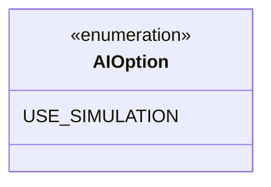

---
aliases:
  - AIOption
tags:
  - java/enum
  - module/forge-ai
  - pkg/forge/ai
fqn: forge.ai.AIOption
package: forge.ai
module: forge-ai
kind: Enum
---

# AIOption

**Package:** `forge.ai` &nbsp; **Module:** `forge-ai` &nbsp; **Kind:** Enum




## Design Description

USE_SIMULATION signals that the AI should employ simulation-based decision making when evaluating game states, weighing the actual outcome of candidate plays rather than relying solely on static heuristic evaluation. As a self-contained enum with no fields, methods, or explicit supertype beyond the implicit `java.lang.Enum`, it functions purely as a type-safe configuration token. Components in the AI module typically hold these values in a set of enabled options and branch on whether a given capability is active. The deliberately minimal design favors extensibility: new AI toggles can be added as additional constants without disturbing the switching structure of consuming code, keeping feature configuration for the AI subsystem centralized and strongly typed.

## Source
`forge-ai/src/main/java/forge/ai/AIOption.java`

```java
package forge.ai;

public enum AIOption {
    USE_SIMULATION
}
```

## Python
`forge/ai/AIOption.py`

```python
package forge.ai

from enum import Enum


class AIOption(Enum):
    USE_SIMULATION = "USE_SIMULATION"
```
