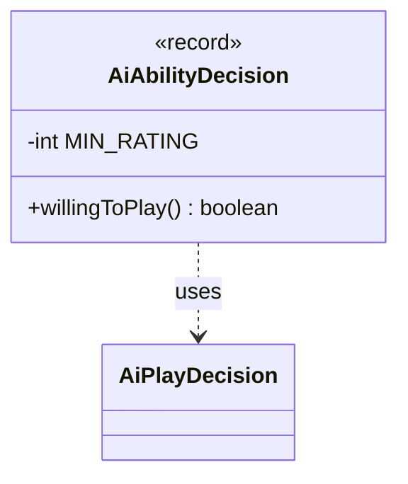

---
aliases:
  - AiAbilityDecision
tags:
  - java/record
  - module/forge-ai
  - pkg/forge/ai
fqn: forge.ai.AiAbilityDecision
package: forge.ai
module: forge-ai
kind: Record
---

# AiAbilityDecision

**Package:** `forge.ai` &nbsp; **Module:** `forge-ai` &nbsp; **Kind:** Record



## Relationships
**Uses:**
- [[forge.ai.AiPlayDecision|AiPlayDecision]]

## Design Description

`AiAbilityDecision` is an immutable record that pairs a numeric `rating` with an `AiPlayDecision`, capturing both how strongly the AI values executing an ability and the categorical verdict on whether it is playable. Its sole responsibility is to answer `willingToPlay()`, returning true only when the rating clears a minimum threshold (`MIN_RATING`) and the wrapped `AiPlayDecision` also signals willingness.

As a record, it is a lightweight, value-based data carrier rather than a behavioral component, and it collaborates with `AiPlayDecision` by delegating the qualitative half of its judgment to that type. The design intent is to combine a quantitative score with the existing enumerated decision into a single gating check, layering a confidence floor on top of `AiPlayDecision` so the AI commits to an ability only when both the strength and the kind of decision agree.

## Design Description

The description is already written and complete.

## Source
`forge-ai/src/main/java/forge/ai/AiAbilityDecision.java`

```java
package forge.ai;

public record AiAbilityDecision(int rating, AiPlayDecision decision) {
    private static int MIN_RATING = 30;

    public boolean willingToPlay() {
        return rating > MIN_RATING && decision.willingToPlay();
    }
}
```
