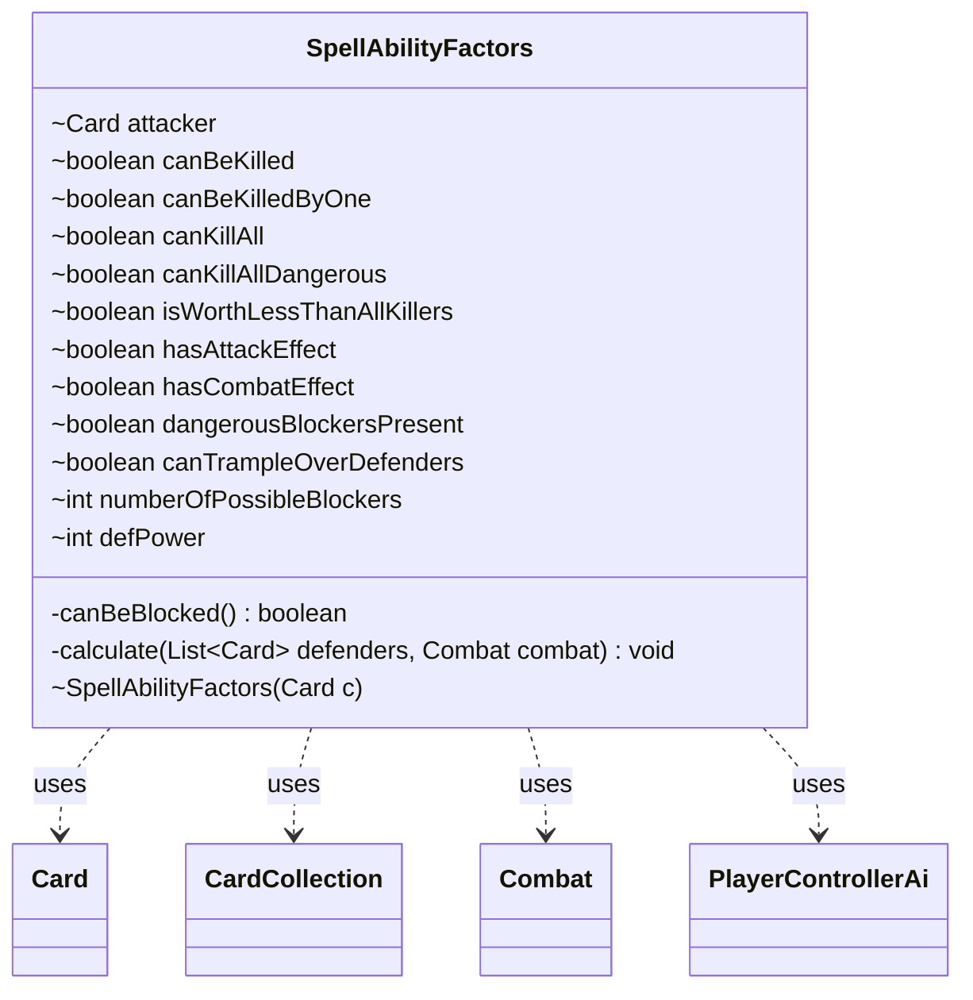

---
aliases:
  - SpellAbilityFactors
tags:
  - java/class
  - module/forge-ai
  - pkg/forge/ai
fqn: forge.ai.AiAttackController.SpellAbilityFactors
package: forge.ai
module: forge-ai
kind: Class
---

# SpellAbilityFactors

**Package:** `forge.ai`   **Module:** `forge-ai`   **Kind:** Class



## Relationships
**Uses:**
- [[forge.ai.PlayerControllerAi|PlayerControllerAi]]
- [[forge.game.card.Card|Card]]
- [[forge.game.card.CardCollection|CardCollection]]
- [[forge.game.combat.Combat|Combat]]

## Design Description

`SpellAbilityFactors` is a private inner helper of `AiAttackController` that captures, for a single prospective attacker, the tactical facts the AI needs to decide whether attacking is worthwhile. Its constructor binds the `Card` attacker, and `calculate(defenders, combat)` evaluates that creature against the opponent's valid blockers — recording whether it can be killed (including by a single blocker or "dangerous" wither/lifelink blockers), whether it can kill all blockers, whether it tramples through, and aggregate blocker counts and power.

Acting as a plain data-and-computation object, it delegates rules queries to collaborators — `CombatUtil`, `ComputerUtilCombat`, and `ComputerUtilCard` — over `CardCollection`/`Combat` inputs, and consults `PlayerControllerAi` for tunable AI properties such as avoiding reckless attacks. The design intent is to precompute combat heuristics once per attacker so the enclosing controller's attack strategy can read simple boolean/int flags rather than recompute combat math, with short-circuiting loops kept for performance.

## Source
`forge-ai/src/main/java/forge/ai/AiAttackController.java` — declaration excerpt

```java
    private class SpellAbilityFactors {
        Card attacker = null;
        boolean canBeKilled = false; // indicates if the attacker can be killed
        boolean canBeKilledByOne = false; // indicates if the attacker can be killed by a single blocker
        boolean canKillAll = true; // indicates if the attacker can kill all single blockers
        boolean canKillAllDangerous = true; // indicates if the attacker can kill all single blockers with wither or infect
        boolean isWorthLessThanAllKillers = true;
        boolean hasAttackEffect = false;
        boolean hasCombatEffect = false;
        boolean dangerousBlockersPresent = false;
        boolean canTrampleOverDefenders = false;
        int numberOfPossibleBlockers = 0;
        int defPower = 0;

        SpellAbilityFactors(Card c) {
            attacker = c;
        }

        private boolean canBeBlocked() {
            return numberOfPossibleBlockers > 2
                    || (numberOfPossibleBlockers >= 1 && CombatUtil.canAttackerBeBlockedWithAmount(attacker, 1, defendingOpponent))
                    || (numberOfPossibleBlockers == 2 && CombatUtil.canAttackerBeBlockedWithAmount(attacker, 2, defendingOpponent));
        }

        private void calculate(final List<Card> defenders, final Combat combat) {
            hasAttackEffect = attacker.getSVar("HasAttackEffect").equals("TRUE") || attacker.hasKeyword(Keyword.ANNIHILATOR);
            // is there a gain in attacking even when the blocker is not killed (Lifelink, Wither,...)
            hasCombatEffect = attacker.getSVar("HasCombatEffect").equals("TRUE") || "Blocked".equals(attacker.getSVar("HasAttackEffect"))
                    || attacker.isWitherDamage() || attacker.hasKeyword(Keyword.LIFELINK) || attacker.hasKeyword(Keyword.AFFLICT);

            // contains only the defender's blockers that can actually block the attacker
            CardCollection validBlockers = CardLists.filter(defenders, defender1 -> CombatUtil.canBlock(attacker, defender1));

            canTrampleOverDefenders = attacker.hasKeyword(Keyword.TRAMPLE) && attacker.getNetCombatDamage() > Aggregates.sum(validBlockers, Card::getNetToughness);

            // used to check that CanKillAllDangerous check makes sense in context where creatures with dangerous abilities are present
            dangerousBlockersPresent = validBlockers.anyMatch(
                    CardPredicates.hasKeyword(Keyword.LIFELINK)
                    .or(Card::isWitherDamage)
            );

            // total power of the defending creatures, used in predicting whether a gang block can kill the attacker
            defPower = CardLists.getTotalPower(validBlockers, null);

            // look at the attacker in relation to the blockers to establish a
            // number of factors about the attacking context that will be relevant
            // to the attackers decision according to the selected strategy
            for (final Card blocker : validBlockers) {
                // if both isWorthLessThanAllKillers and canKillAllDangerous are false there's nothing more to check
                if (isWorthLessThanAllKillers || canKillAllDangerous || numberOfPossibleBlockers < 2) {
                    numberOfPossibleBlockers += 1;
                    if (isWorthLessThanAllKillers && ComputerUtilCombat.canDestroyAttacker(ai, attacker, blocker, combat, false)
                            && !(attacker.hasKeyword(Keyword.UNDYING) && attacker.getCounters(CounterEnumType.P1P1) == 0)) {
                        canBeKilledByOne = true; // there is a single creature on the battlefield that can kill the creature
                        // see if the defending creature is of higher or lower
                        // value. We don't want to attack only to lose value
                        if (isWorthLessThanAllKillers && !attacker.hasSVar("SacMe")
                                && ComputerUtilCard.evaluateCreature(blocker) <= ComputerUtilCard.evaluateCreature(attacker)) {
                            isWorthLessThanAllKillers = false;
                        }
                    }
                    // see if this attacking creature can destroy this defender, if
                    // not record that it can't kill everything
                    if (canKillAllDangerous && !ComputerUtilCombat.canDestroyBlocker(ai, blocker, attacker, combat, false)) {
                        canKillAll = false;

                        if (blocker.getSVar("HasCombatEffect").equals("TRUE") || blocker.getSVar("HasBlockEffect").equals("TRUE")
                                || blocker.isWitherDamage() || blocker.hasKeyword(Keyword.LIFELINK)) {
                            canKillAllDangerous = false;
                            // there is a creature that can survive an attack from this creature
                            // and combat will have negative effects
                        }

                        // Check if maybe we are too reckless in adding this attacker
                        if (canKillAllDangerous) {
                            boolean avoidAttackingIntoBlock = ai.getController().isAI()
                                    && ((PlayerControllerAi) ai.getController()).getAi().getBoolProperty(AiProps.TRY_TO_AVOID_ATTACKING_INTO_CERTAIN_BLOCK);
                            boolean attackerWillDie = defPower >= attacker.getNetToughness();
                            boolean uselessAttack = !hasCombatEffect && !hasAttackEffect;
                            boolean noContributionToAttack = attackers.size() <= defenders.size() || attacker.getNetPower() <= 0;

                            // We are attacking too recklessly if we can't kill a single blocker and:
                            // - our creature will die for sure (chump attack)
                            // - our attack will not do anything special (no attack/combat effect to proc)
                            // - we can't deal damage to our opponent with sheer number of attackers and/or our attacker's power is 0 or less
                            if (attackerWillDie || (avoidAttackingIntoBlock && uselessAttack && noContributionToAttack)) {
                                canKillAllDangerous = false;
                            }
                        }
                    }
                }
            }

            // performance-wise it doesn't seem worth it to check attackVigilance() instead (only includes a single niche card)
            if (!attacker.hasKeyword(Keyword.VIGILANCE) && ComputerUtilCard.canBeKilledByRoyalAssassin(ai, attacker)) {
                canKillAllDangerous = false;
                canBeKilled = true;
                canBeKilledByOne = true;
                isWorthLessThanAllKillers = false;
                hasCombatEffect = false;
            } else if ((canKillAllDangerous || !canBeKilled) && ComputerUtilCard.canBeBlockedProfitably(defendingOpponent, attacker, true)) {
                canKillAllDangerous = false;
                canBeKilled = true;
            }
        }
    }
```

## Python
`forge/ai/AiAttackController/SpellAbilityFactors.py`

```python
from forge.ai.PlayerControllerAi import PlayerControllerAi
from forge.game.card.Card import Card
from forge.game.card.CardCollection import CardCollection
from forge.game.combat.Combat import Combat
from forge.game.combat.CombatUtil import CombatUtil
from forge.game.card.CardLists import CardLists
from forge.game.card.CardPredicates import CardPredicates
from forge.game.card.CounterEnumType import CounterEnumType
from forge.game.keyword.Keyword import Keyword
from forge.util.Aggregates import Aggregates
from forge.ai.ComputerUtilCombat import ComputerUtilCombat
from forge.ai.ComputerUtilCard import ComputerUtilCard
from forge.ai.AiProps import AiProps


class SpellAbilityFactors:
    def __init__(self, c: Card):
        self.attacker = None  # type: Card
        self.canBeKilled = False  # indicates if the attacker can be killed
        self.canBeKilledByOne = False  # indicates if the attacker can be killed by a single blocker
        self.canKillAll = True  # indicates if the attacker can kill all single blockers
        self.canKillAllDangerous = True  # indicates if the attacker can kill all single blockers with wither or infect
        self.isWorthLessThanAllKillers = True
        self.hasAttackEffect = False
        self.hasCombatEffect = False
        self.dangerousBlockersPresent = False
        self.canTrampleOverDefenders = False
        self.numberOfPossibleBlockers = 0
        self.defPower = 0

        self.attacker = c

    def canBeBlocked(self) -> bool:
        return (self.numberOfPossibleBlockers > 2
                or (self.numberOfPossibleBlockers >= 1 and CombatUtil.canAttackerBeBlockedWithAmount(self.attacker, 1, defendingOpponent))
                or (self.numberOfPossibleBlockers == 2 and CombatUtil.canAttackerBeBlockedWithAmount(self.attacker, 2, defendingOpponent)))

    def calculate(self, defenders: list[Card], combat: Combat) -> None:
        self.hasAttackEffect = self.attacker.getSVar("HasAttackEffect") == "TRUE" or self.attacker.hasKeyword(Keyword.ANNIHILATOR)
        # is there a gain in attacking even when the blocker is not killed (Lifelink, Wither,...)
        self.hasCombatEffect = (self.attacker.getSVar("HasCombatEffect") == "TRUE" or "Blocked" == self.attacker.getSVar("HasAttackEffect")
                or self.attacker.isWitherDamage() or self.attacker.hasKeyword(Keyword.LIFELINK) or self.attacker.hasKeyword(Keyword.AFFLICT))

        # contains only the defender's blockers that can actually block the attacker
        validBlockers = CardLists.filter(defenders, lambda defender1: CombatUtil.canBlock(self.attacker, defender1))

        self.canTrampleOverDefenders = self.attacker.hasKeyword(Keyword.TRAMPLE) and self.attacker.getNetCombatDamage() > Aggregates.sum(validBlockers, Card.getNetToughness)

        # used to check that CanKillAllDangerous check makes sense in context where creatures with dangerous abilities are present
        self.dangerousBlockersPresent = validBlockers.anyMatch(
                CardPredicates.hasKeyword(Keyword.LIFELINK)
                .or_(Card.isWitherDamage)
        )

        # total power of the defending creatures, used in predicting whether a gang block can kill the attacker
        self.defPower = CardLists.getTotalPower(validBlockers, None)

        # look at the attacker in relation to the blockers to establish a
        # number of factors about the attacking context that will be relevant
        # to the attackers decision according to the selected strategy
        for blocker in validBlockers:
            # if both isWorthLessThanAllKillers and canKillAllDangerous are false there's nothing more to check
            if self.isWorthLessThanAllKillers or self.canKillAllDangerous or self.numberOfPossibleBlockers < 2:
                self.numberOfPossibleBlockers += 1
                if (self.isWorthLessThanAllKillers and ComputerUtilCombat.canDestroyAttacker(ai, self.attacker, blocker, combat, False)
                        and not (self.attacker.hasKeyword(Keyword.UNDYING) and self.attacker.getCounters(CounterEnumType.P1P1) == 0)):
                    self.canBeKilledByOne = True  # there is a single creature on the battlefield that can kill the creature
                    # see if the defending creature is of higher or lower
                    # value. We don't want to attack only to lose value
                    if (self.isWorthLessThanAllKillers and not self.attacker.hasSVar("SacMe")
                            and ComputerUtilCard.evaluateCreature(blocker) <= ComputerUtilCard.evaluateCreature(self.attacker)):
                        self.isWorthLessThanAllKillers = False
                # see if this attacking creature can destroy this defender, if
                # not record that it can't kill everything
                if self.canKillAllDangerous and not ComputerUtilCombat.canDestroyBlocker(ai, blocker, self.attacker, combat, False):
                    self.canKillAll = False

                    if (blocker.getSVar("HasCombatEffect") == "TRUE" or blocker.getSVar("HasBlockEffect") == "TRUE"
                            or blocker.isWitherDamage() or blocker.hasKeyword(Keyword.LIFELINK)):
                        self.canKillAllDangerous = False
                        # there is a creature that can survive an attack from this creature
                        # and combat will have negative effects

                    # Check if maybe we are too reckless in adding this attacker
                    if self.canKillAllDangerous:
                        avoidAttackingIntoBlock = (ai.getController().isAI()
                                and ai.getController().getAi().getBoolProperty(AiProps.TRY_TO_AVOID_ATTACKING_INTO_CERTAIN_BLOCK))
                        attackerWillDie = self.defPower >= self.attacker.getNetToughness()
                        uselessAttack = not self.hasCombatEffect and not self.hasAttackEffect
                        noContributionToAttack = attackers.size() <= defenders.size() or self.attacker.getNetPower() <= 0

                        # We are attacking too recklessly if we can't kill a single blocker and:
                        # - our creature will die for sure (chump attack)
                        # - our attack will not do anything special (no attack/combat effect to proc)
                        # - we can't deal damage to our opponent with sheer number of attackers and/or our attacker's power is 0 or less
                        if attackerWillDie or (avoidAttackingIntoBlock and uselessAttack and noContributionToAttack):
                            self.canKillAllDangerous = False

        # performance-wise it doesn't seem worth it to check attackVigilance() instead (only includes a single niche card)
        if not self.attacker.hasKeyword(Keyword.VIGILANCE) and ComputerUtilCard.canBeKilledByRoyalAssassin(ai, self.attacker):
            self.canKillAllDangerous = False
            self.canBeKilled = True
            self.canBeKilledByOne = True
            self.isWorthLessThanAllKillers = False
            self.hasCombatEffect = False
        elif (self.canKillAllDangerous or not self.canBeKilled) and ComputerUtilCard.canBeBlockedProfitably(defendingOpponent, self.attacker, True):
            self.canKillAllDangerous = False
            self.canBeKilled = True
```
