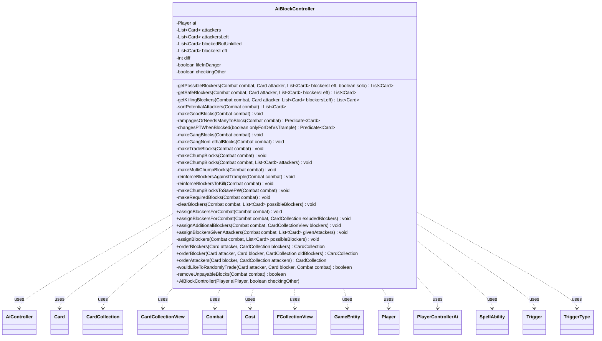

---
aliases:
  - AiBlockController
tags:
  - java/class
  - module/forge-ai
  - pkg/forge/ai
fqn: forge.ai.AiBlockController
package: forge.ai
module: forge-ai
kind: Class
---

# AiBlockController

**Package:** `forge.ai` &nbsp; **Module:** `forge-ai` &nbsp; **Kind:** Class



## Relationships
**Uses:**
- [[forge.ai.AiController|AiController]]
- [[forge.ai.PlayerControllerAi|PlayerControllerAi]]
- [[forge.game.GameEntity|GameEntity]]
- [[forge.game.card.Card|Card]]
- [[forge.game.card.CardCollection|CardCollection]]
- [[forge.game.card.CardCollectionView|CardCollectionView]]
- [[forge.game.combat.Combat|Combat]]
- [[forge.game.cost.Cost|Cost]]
- [[forge.game.player.Player|Player]]
- [[forge.game.spellability.SpellAbility|SpellAbility]]
- [[forge.game.trigger.Trigger|Trigger]]
- [[forge.game.trigger.TriggerType|TriggerType]]
- [[forge.util.collect.FCollectionView|FCollectionView]]


## Design Description

AiBlockController encapsulates the AI's blocker-assignment strategy for a single combat phase, deciding which of the controlling `Player`'s creatures should block which attackers and in what damage order. Constructed for one AI player with a `checkingOther` flag that suppresses use of hidden information when predicting an opponent's blocks, it exposes `assignBlockersForCombat` and its variants (additional, virtual, or given attackers) to mutate a `Combat` instance, plus static `orderBlockers`/`orderBlocker`/`orderAttackers` helpers for sequencing combat damage.

Though a plain class rather than an interface implementation, it functions as a strategy component collaborating heavily with `Combat`, `Card`/`CardCollection`, and the `ComputerUtilCombat`/`CombatUtil` evaluation utilities. Its core design intent is a tiered, escalating heuristic: it first makes favorable good and gang blocks, then progressively layers trade, chump, and reinforcement blocks as the AI's life moves into danger, repeatedly clearing and retrying with safer approaches. Behavior is tuned through `AiProps` profile properties and randomized trades, while honoring required blocks, planeswalker protection, and mana-payable block constraints.

## Source
`forge-ai/src/main/java/forge/ai/AiBlockController.java`

```java
/*
 * Forge: Play Magic: the Gathering.
 * Copyright (C) 2011  Forge Team
 *
 * This program is free software: you can redistribute it and/or modify
 * it under the terms of the GNU General Public License as published by
 * the Free Software Foundation, either version 3 of the License, or
 * (at your option) any later version.
 *
 * This program is distributed in the hope that it will be useful,
 * but WITHOUT ANY WARRANTY; without even the implied warranty of
 * MERCHANTABILITY or FITNESS FOR A PARTICULAR PURPOSE.  See the
 * GNU General Public License for more details.
 *
 * You should have received a copy of the GNU General Public License
 * along with this program.  If not, see <http://www.gnu.org/licenses/>.
 */
package forge.ai;

import java.util.*;
import java.util.function.Predicate;

import forge.card.CardStateName;
import forge.game.GameEntity;
import forge.game.ability.AbilityUtils;
import forge.game.ability.ApiType;
import forge.game.card.Card;
import forge.game.card.CardCollection;
import forge.game.card.CardCollectionView;
import forge.game.card.CardLists;
import forge.game.card.CardPredicates;
import forge.game.card.CounterEnumType;
import forge.game.combat.AttackingBand;
import forge.game.combat.Combat;
import forge.game.combat.CombatUtil;
import forge.game.cost.Cost;
import forge.game.keyword.Keyword;
import forge.game.player.Player;
import forge.game.spellability.SpellAbility;
import forge.game.staticability.StaticAbilityAssignCombatDamageAsUnblocked;
import forge.game.staticability.StaticAbilityCantAttackBlock;
import forge.game.staticability.StaticAbilityMustBlock;
import forge.game.trigger.Trigger;
import forge.game.trigger.TriggerType;
import forge.game.zone.ZoneType;
import forge.util.MyRandom;
import forge.util.collect.FCollectionView;


/**
 * <p>
 * ComputerUtil_Block2 class.
 * </p>
 *
 * @author Forge
 * @version $Id$
 */
public class AiBlockController {

    private final Player ai;
    /** Constant <code>attackers</code>. */
    private List<Card> attackers = new ArrayList<>(); // all attackers
    /** Constant <code>attackersLeft</code>. */
    private List<Card> attackersLeft = new ArrayList<>(); // keeps track of all currently unblocked attackers
    /** Constant <code>blockedButUnkilled</code>. */
    private List<Card> blockedButUnkilled = new ArrayList<>(); // blocked attackers that currently wouldn't be destroyed
    /** Constant <code>blockersLeft</code>. */
    private List<Card> blockersLeft = new ArrayList<>(); // keeps track of all unassigned blockers
    private int diff = 0;

    private boolean lifeInDanger = false;

    // set to true when AI is predicting a blocking for another player so it doesn't use hidden information
    private boolean checkingOther = false;

    public AiBlockController(Player aiPlayer, boolean checkingOther) {
        this.checkingOther = checkingOther;
        ai = aiPlayer;
    }

    // finds the creatures able to block the attacker
    private static List<Card> getPossibleBlockers(final Combat combat, final Card attacker, final List<Card> blockersLeft, final boolean solo) {
        final List<Card> blockers = new ArrayList<>();

        for (final Card blocker : blockersLeft) {
            // if the blocker can block a creature with lure it can't block a creature without
            if (CombatUtil.canBlock(attacker, blocker, combat)) {
                boolean cantBlockAlone = blocker.hasKeyword("CARDNAME can't attack or block alone.") || blocker.hasKeyword("CARDNAME can't block alone.");
                if (solo && cantBlockAlone) {
                    continue;
                }
                blockers.add(blocker);
            }
        }

        return blockers;
    }

    // finds blockers that won't be destroyed
    private List<Card> getSafeBlockers(final Combat combat, final Card attacker, final List<Card> blockersLeft) {
        final List<Card> blockers = new ArrayList<>();

        // Usually don't check attacker static abilities at this point since the attackers have already attacked and, thus,
        // their P/T modifiers are active and are counted as a part of getNetPower/getNetToughness unless we're simulating an outcome outside of real combat
        for (final Card b : blockersLeft) {
            if (!ComputerUtilCombat.canDestroyBlocker(ai, b, attacker, combat, false, attacker.getGame().getPhaseHandler().inCombat())) {
                blockers.add(b);
            }
        }
        return blockers;
    }

    // finds blockers that destroy the attacker
    private List<Card> getKillingBlockers(final Combat combat, final Card attacker, final List<Card> blockersLeft) {
        final List<Card> blockers = new ArrayList<>();

        // Usually don't check attacker static abilities at this point since the attackers have already attacked and, thus,
        // their P/T modifiers are active and are counted as a part of getNetPower/getNetToughness unless we're simulating an outcome outside of real combat
        for (final Card b : blockersLeft) {
            if (ComputerUtilCombat.canDestroyAttacker(ai, attacker, b, combat, false, attacker.getGame().getPhaseHandler().inCombat())) {
                blockers.add(b);
            }
        }

        return blockers;
    }

    private List<Card> sortPotentialAttackers(final Combat combat) {
        final CardCollection sortedAttackers = new CardCollection();
        CardCollection firstAttacker = new CardCollection();
        final FCollectionView<GameEntity> defenders = combat.getDefenders();
        final List<Card> attackingCmd = ComputerUtilCombat.getLifeThreateningCommanders(ai, combat);

        // If I don't have any planeswalkers then sorting doesn't really matter
        if (defenders.size() == 1 || !attackingCmd.isEmpty()) {
            final CardCollection attackers = combat.getAttackersOf(defenders.get(0));
            // Begin with the attackers that pose the biggest threat
            ComputerUtilCard.sortByEvaluateCreature(attackers);
            CardLists.sortByPowerDesc(attackers);
            //move cards like Phage the Untouchable to the front
            attackers.sort((o1, o2) -> {
                if (o1.hasSVar("MustBeBlocked") && !o2.hasSVar("MustBeBlocked")) {
                    return -1;
                }
                if (!o1.hasSVar("MustBeBlocked") && o2.hasSVar("MustBeBlocked")) {
                    return 1;
                }
                if (attackingCmd.contains(o1) && !attackingCmd.contains(o2)) {
                    return -1;
                }
                if (!attackingCmd.contains(o1) && attackingCmd.contains(o2)) {
                    return 1;
                }
                return 0;
            });
            return attackers;
        }

        // TODO Add creatures attacking Planeswalkers in order of which we want to protect
        // defend planeswalkers with more loyalty before planeswalkers with less loyalty,
        // defend battles with fewer defense counters before battles with more defense counters,
        // if planeswalker/battle will be too difficult to defend don't even bother
        for (GameEntity defender : defenders) {
            if ((defender instanceof Card card1 && card1.getController().equals(ai))
                    || (defender instanceof Card card2 && card2.isBattle() && card2.getProtectingPlayer().equals(ai))) {
                final CardCollection ccAttackers = combat.getAttackersOf(defender);
                // Begin with the attackers that pose the biggest threat
                CardLists.sortByPowerDesc(ccAttackers);
                sortedAttackers.addAll(ccAttackers);
            } else if (defender instanceof Player && defender.equals(ai)) {
                firstAttacker = combat.getAttackersOf(defender);
                CardLists.sortByPowerDesc(firstAttacker);
            }
        }

        if (ComputerUtilCombat.lifeInDanger(ai, combat)) {
            // add creatures attacking the Player to the front of the list
            sortedAttackers.addAll(0, firstAttacker);
        } else {
            // add creatures attacking the Player to the back of the list
            sortedAttackers.addAll(firstAttacker);
        }
        return sortedAttackers;
    }

    // Good Blocks means a good trade or no trade
    private void makeGoodBlocks(final Combat combat) {
        List<Card> currentAttackers = new ArrayList<>(attackersLeft);

        for (final Card attacker : attackersLeft) {
            if (CombatUtil.getMinNumBlockersForAttacker(attacker, combat.getDefenderPlayerByAttacker(attacker)) > 1) {
                continue;
            }

            Card blocker = null;
            final List<Card> blockers = getPossibleBlockers(combat, attacker, blockersLeft, true);

            final List<Card> safeBlockers = getSafeBlockers(combat, attacker, blockers);
            List<Card> killingBlockers;

            if (!safeBlockers.isEmpty()) {
                // 1.Blockers that can destroy the attacker but won't get destroyed
                killingBlockers = getKillingBlockers(combat, attacker, safeBlockers);
                if (!killingBlockers.isEmpty()) {
                    if (ComputerUtilCombat.attackerHasThreateningAfflict(attacker, ai)) {
                        continue;
                    }
                    blocker = ComputerUtilCard.getWorstCreatureAI(killingBlockers);
                // 2.Blockers that won't get destroyed
                } else if (!StaticAbilityAssignCombatDamageAsUnblocked.assignCombatDamageAsUnblocked(attacker)
                    && !ComputerUtilCombat.attackerHasThreateningAfflict(attacker, ai)) {
                    blocker = ComputerUtilCard.getWorstCreatureAI(safeBlockers);
                    // check whether it's better to block a creature without trample to absorb more damage
                    if (attacker.hasKeyword(Keyword.TRAMPLE)) {
                        boolean doNotBlock = false;
                        for (Card other : attackersLeft) {
                            if (other.equals(attacker) || !CombatUtil.canBlock(other, blocker)
                                    || other.hasKeyword(Keyword.TRAMPLE)
                                    || ComputerUtilCombat.attackerHasThreateningAfflict(other, ai)
                                    || ComputerUtilCombat.canDestroyBlocker(ai, blocker, other, combat, false)
                                    || StaticAbilityAssignCombatDamageAsUnblocked.assignCombatDamageAsUnblocked(other)) {
                                continue;
                            }

                            if (other.getNetCombatDamage() > blocker.getLethalDamage()) {
                                doNotBlock = true;
                                break;
                            }
                        }
                        if (doNotBlock) {
                            continue;
                        }
                    }
                    blockedButUnkilled.add(attacker);
                }
            } // no safe blockers
            else {
                // 3.Blockers that can destroy the attacker and have an upside when dying
                killingBlockers = getKillingBlockers(combat, attacker, blockers);
                for (Card b : killingBlockers) {
                    if ((b.hasKeyword(Keyword.UNDYING) && b.getCounters(CounterEnumType.P1P1) == 0) || b.hasSVar("SacMe")
                            || (b.hasKeyword(Keyword.VANISHING) && b.getCounters(CounterEnumType.TIME) == 1)
                            || (b.hasKeyword(Keyword.FADING) && b.getCounters(CounterEnumType.FADE) == 0)
                            || b.hasSVar("EndOfTurnLeavePlay")) {
                        blocker = b;
                        break;
                    }
                }
                // 4.Blockers that have a big upside when dying
                // 4a.Blockers that are profitable to sacrifice even in the event of an unfavorable block
                for (Card b : blockers) {
                    if ((b.hasSVar("SacMe") && Integer.parseInt(b.getSVar("SacMe")) > 3) ||
                            (b.hasSVar("SacMeAfterBlock") && !attacker.hasKeyword(Keyword.TRAMPLE) && !attacker.hasKeyword(Keyword.BANDING))) {
                        blocker = b;
                        if (!ComputerUtilCombat.canDestroyAttacker(ai, attacker, blocker, combat, false)) {
                            blockedButUnkilled.add(attacker);
                        }
                        break;
                    }
                }
                // 5.Blockers that can destroy the attacker and are worth less
                if (!killingBlockers.isEmpty()) {
                    final Card worst = ComputerUtilCard.getWorstCreatureAI(killingBlockers);
                    int value = ComputerUtilCard.evaluateCreature(attacker);

                    // check for triggers when unblocked
                    for (Trigger trigger : attacker.getTriggers()) {
                        TriggerType mode = trigger.getMode();

                        if (!trigger.requirementsCheck(attacker.getGame())) {
                            continue;
                        }

                        if (mode == TriggerType.DamageDone) {
                            if (trigger.matchesValidParam("ValidSource", attacker)
                                    && !"False".equals(trigger.getParam("CombatDamage")) && attacker.getNetCombatDamage() > 0
                                    && trigger.matchesValidParam("ValidTarget", combat.getDefenderByAttacker(attacker))) {
                                value += 50;
                            }
                        } else if (mode == TriggerType.AttackerUnblocked) {
                            if (trigger.matchesValidParam("ValidCard", attacker)) {
                                value += 50;
                            }
                        }
                    }

                    if (ComputerUtilCard.evaluateCreature(worst) + diff < value) {
                        blocker = worst;
                    }
                }
            }
            if (blocker != null) {
                currentAttackers.remove(attacker);
                combat.addBlocker(attacker, blocker);
            }
        }
        attackersLeft = new ArrayList<>(currentAttackers);

        // 6. Blockers that don't survive until the next turn anyway
        for (final Card attacker : attackersLeft) {
            if (CombatUtil.getMinNumBlockersForAttacker(attacker, combat.getDefenderPlayerByAttacker(attacker)) > 1) {
                continue;
            }

            Card blocker = null;
            final List<Card> blockers = getPossibleBlockers(combat, attacker, blockersLeft, true);

            for (Card b : blockers) {
                if ((b.hasKeyword(Keyword.VANISHING) && b.getCounters(CounterEnumType.TIME) == 1)
                        || (b.hasKeyword(Keyword.FADING) && b.getCounters(CounterEnumType.FADE) == 0)
                        || b.hasSVar("EndOfTurnLeavePlay")) {
                    blocker = b;
                    if (!ComputerUtilCombat.canDestroyAttacker(ai, attacker, blocker, combat, false)) {
                        blockedButUnkilled.add(attacker);
                    }
                    break;
                }
            }
            if (blocker != null) {
                currentAttackers.remove(attacker);
                combat.addBlocker(attacker, blocker);
            }
        }
        attackersLeft = new ArrayList<>(currentAttackers);
    }

    private Predicate<Card> rampagesOrNeedsManyToBlock(final Combat combat) {
        return CardPredicates.hasKeyword(Keyword.RAMPAGE).or(input -> {
            // select creature that has a max blocker
            return StaticAbilityCantAttackBlock.getMinMaxBlocker(input, combat.getDefenderPlayerByAttacker(input)).getRight() < Integer.MAX_VALUE;
        });
    }

    private Predicate<Card> changesPTWhenBlocked(final boolean onlyForDefVsTrample) {
        return card -> {
            for (final Trigger tr : card.getTriggers()) {
                if (tr.getMode() == TriggerType.AttackerBlocked) {
                    SpellAbility ab = tr.getOverridingAbility();
                    if (ab != null) {
                        if (ab.getApi() == ApiType.Pump && "Self".equals(ab.getParam("Defined"))) {
                            String rawP = ab.getParam("NumAtt");
                            String rawT = ab.getParam("NumDef");
                            if ("+X".equals(rawP) && "+X".equals(rawT) && card.getSVar("X").startsWith("Count$Valid Creature.blockingTriggeredAttacker")) {
                                return true;
                            }
                            // TODO: maybe also predict calculated bonus above certain threshold?
                        } else if (ab.getApi() == ApiType.PumpAll && ab.hasParam("ValidCards")
                            && ab.getParam("ValidCards").startsWith("Creature.blockingSource")) {
                            int pBonus = AbilityUtils.calculateAmount(card, ab.getParam("NumAtt"), ab);
                            int tBonus = AbilityUtils.calculateAmount(card, ab.getParam("NumDef"), ab);
                            return (!onlyForDefVsTrample && pBonus < 0) || tBonus < 0;
                        }
                    }
                }
            }
            return false;
        };
    }

    // Good Gang Blocks means a good trade or no trade
    /**
     * <p>
     * makeGangBlocks.
     * </p>
     *
     * @param combat a {@link forge.game.combat.Combat} object.
     */
    private void makeGangBlocks(final Combat combat) {
        List<Card> currentAttackers = CardLists.filter(attackersLeft, rampagesOrNeedsManyToBlock(combat).negate());
        List<Card> blockers;

        // Try to block an attacker without first strike with a gang of first strikers
        for (final Card attacker : attackersLeft) {
            if (ComputerUtilCombat.combatantCantBeDestroyed(ai, attacker)) {
                // don't bother with gang blocking if the attacker will regenerate or is indestructible
                continue;
            }
            if (!ComputerUtilCombat.dealsFirstStrikeDamage(attacker, false, combat)) {
                blockers = getPossibleBlockers(combat, attacker, blockersLeft, false);
                final List<Card> firstStrikeBlockers = new ArrayList<>();
                final List<Card> blockGang = new ArrayList<>();
                for (Card blocker : blockers) {
                    if (ComputerUtilCombat.canDestroyBlockerBeforeFirstStrike(blocker, attacker, false)) {
                        continue;
                    }
                    if (blocker.hasFirstStrike() || blocker.hasDoubleStrike()) {
                        firstStrikeBlockers.add(blocker);
                    }
                }

                if (firstStrikeBlockers.size() > 1) {
                    CardLists.sortByPowerDesc(firstStrikeBlockers);
                    for (final Card blocker : firstStrikeBlockers) {
                        final int damageNeeded = ComputerUtilCombat.getDamageToKill(attacker, false)
                                + ComputerUtilCombat.predictToughnessBonusOfAttacker(attacker, blocker, combat, false);
                        // if the total damage of the blockgang was not enough
                        // without but is enough with this blocker finish the blockgang
                        if (ComputerUtilCombat.totalFirstStrikeDamageOfBlockers(attacker, blockGang) < damageNeeded
                                || CombatUtil.getMinNumBlockersForAttacker(attacker, ai) > blockGang.size()) {
                            blockGang.add(blocker);
                            if (ComputerUtilCombat.totalFirstStrikeDamageOfBlockers(attacker, blockGang) >= damageNeeded) {
                                currentAttackers.remove(attacker);
                                for (final Card b : blockGang) {
                                    if (CombatUtil.canBlock(attacker, blocker, combat)) {
                                        combat.addBlocker(attacker, b);
                                    }
                                }
                            }
                        }
                    }
                }
            }
        }

        attackersLeft = new ArrayList<>(currentAttackers);

        boolean considerTripleBlock = true;

        // Try to block an attacker with two blockers of which only one will die
        for (final Card attacker : attackersLeft) {
            if (ComputerUtilCombat.combatantCantBeDestroyed(ai, attacker)) {
                // don't bother with gang blocking if the attacker will regenerate or is indestructible
                continue;
            }

            // AI can't handle good blocks with more than three creatures yet
            if (CombatUtil.getMinNumBlockersForAttacker(attacker, ai) > (considerTripleBlock ? 3 : 2)) {
                continue;
            }

            int evalAttackerValue = ComputerUtilCard.evaluateCreature(attacker);

            blockers = getPossibleBlockers(combat, attacker, blockersLeft, false);
            List<Card> usableBlockers;
            final List<Card> blockGang = new ArrayList<>();
            int absorbedDamage; // The amount of damage needed to kill the first blocker
            int currentValue; // The value of the creatures in the blockgang
            boolean foundDoubleBlock = false; // if true, a good double block is found

            // Try to add blockers that could be destroyed, but are worth less than the attacker
            // Don't use blockers without First Strike or Double Strike if attacker has it
            usableBlockers = CardLists.filter(blockers, c -> {
                if (ComputerUtilCombat.dealsFirstStrikeDamage(attacker, false, combat)
                        && !ComputerUtilCombat.dealsFirstStrikeDamage(c, false, combat)) {
                    return false;
                }
                return lifeInDanger || wouldLikeToRandomlyTrade(attacker, c, combat) || ComputerUtilCard.evaluateCreature(c) + diff < ComputerUtilCard.evaluateCreature(attacker);
            });
            if (usableBlockers.size() < 2) {
                return;
            }

            final Card leader = ComputerUtilCard.getBestCreatureAI(usableBlockers);
            blockGang.add(leader);
            usableBlockers.remove(leader);
            absorbedDamage = ComputerUtilCombat.getEnoughDamageToKill(leader, attacker.getNetCombatDamage(), attacker, true);
            currentValue = ComputerUtilCard.evaluateCreature(leader);

            // consider a double block
            for (final Card blocker : usableBlockers) {
                // Add an additional blocker if the current blockers are not
                // enough and the new one would deal the remaining damage
                final int currentDamage = ComputerUtilCombat.totalDamageOfBlockers(attacker, blockGang);
                final int additionalDamage = ComputerUtilCombat.dealsDamageAsBlocker(attacker, blocker);
                final int absorbedDamage2 = ComputerUtilCombat.getEnoughDamageToKill(blocker, attacker.getNetCombatDamage(), attacker, true);
                final int addedValue = ComputerUtilCard.evaluateCreature(blocker);
                final int damageNeeded = ComputerUtilCombat.getDamageToKill(attacker, false)
                        + ComputerUtilCombat.predictToughnessBonusOfAttacker(attacker, blocker, combat, false);
                if ((damageNeeded > currentDamage || CombatUtil.getMinNumBlockersForAttacker(attacker, ai) > blockGang.size())
                        && !(damageNeeded > currentDamage + additionalDamage)
                        // The attacker will be killed
                        && (absorbedDamage2 + absorbedDamage > attacker.getNetCombatDamage()
                        // only one blocker can be killed
                        || currentValue + addedValue - 50 <= evalAttackerValue
                        // or attacker is worth more
                        || (lifeInDanger && ComputerUtilCombat.lifeInDanger(ai, combat)))
                        // or life is in danger
                        && CombatUtil.canBlock(attacker, blocker, combat)) {
                    // this is needed for attackers that can't be blocked by more than 1
                    currentAttackers.remove(attacker);
                    combat.addBlocker(attacker, blocker);
                    if (CombatUtil.canBlock(attacker, leader, combat)) {
                        combat.addBlocker(attacker, leader);
                    }
                    foundDoubleBlock = true;
                    break;
                }
                if (!foundDoubleBlock && (currentDamage + additionalDamage >= damageNeeded)) {
                    // a double block was tested which resulted in a potential kill but it was dismissed,
                    // no need to test for a triple block then to avoid suboptimal plays.
                    considerTripleBlock = false;
                }
            }

            if (foundDoubleBlock || !considerTripleBlock) {
                continue;
            }

            // consider a triple block if a double block was not found
            blockerLoop:
            for (final Card secondBlocker : usableBlockers) {
                // consider the properties of the second blocker
                final int currentDamage = ComputerUtilCombat.totalDamageOfBlockers(attacker, blockGang);
                final int additionalDamage2 = ComputerUtilCombat.dealsDamageAsBlocker(attacker, secondBlocker);
                final int absorbedDamage2 = ComputerUtilCombat.getEnoughDamageToKill(secondBlocker, attacker.getNetCombatDamage(), attacker, true);
                final int addedValue2 = ComputerUtilCard.evaluateCreature(secondBlocker);
                final int damageNeeded = ComputerUtilCombat.getDamageToKill(attacker, false)
                        + ComputerUtilCombat.predictToughnessBonusOfAttacker(attacker, secondBlocker, combat, false);

                List<Card> usableBlockersAsThird = new ArrayList<>(usableBlockers);
                usableBlockersAsThird.remove(secondBlocker);

                // loop over the remaining blockers in search of a good third blocker candidate
                for (Card thirdBlocker : usableBlockersAsThird) {
                    final int additionalDamage3 = ComputerUtilCombat.dealsDamageAsBlocker(attacker, thirdBlocker);
                    final int absorbedDamage3 = ComputerUtilCombat.getEnoughDamageToKill(thirdBlocker, attacker.getNetCombatDamage(), attacker, true);
                    final int addedValue3 = ComputerUtilCard.evaluateCreature(secondBlocker);
                    final int netCombatDamage = attacker.getNetCombatDamage();

                    if ((damageNeeded > currentDamage || CombatUtil.getMinNumBlockersForAttacker(attacker, ai) > blockGang.size())
                            && !(damageNeeded > currentDamage + additionalDamage2 + additionalDamage3)
                            // The attacker will be killed
                            && ((absorbedDamage2 + absorbedDamage > netCombatDamage && absorbedDamage3 + absorbedDamage > netCombatDamage
                            && absorbedDamage3 + absorbedDamage2 > netCombatDamage)
                            // only one blocker can be killed
                            || currentValue + addedValue2 + addedValue3 - 50 <= evalAttackerValue
                            // or attacker is worth more
                            || (thirdBlocker.isToken() && absorbedDamage2 + absorbedDamage > netCombatDamage)
                            // or third blocker is a token and no more than two blockers will die, one of which is the third blocker (token)
                            || (lifeInDanger && ComputerUtilCombat.lifeInDanger(ai, combat)))
                            // or life is in danger
                            && CombatUtil.canBlock(attacker, secondBlocker, combat)
                            && CombatUtil.canBlock(attacker, thirdBlocker, combat)) {
                        // this is needed for attackers that can't be blocked by more than 1
                        currentAttackers.remove(attacker);
                        combat.addBlocker(attacker, thirdBlocker);
                        if (CombatUtil.canBlock(attacker, secondBlocker, combat)) {
                            combat.addBlocker(attacker, secondBlocker);
                        }
                        if (CombatUtil.canBlock(attacker, leader, combat)) {
                            combat.addBlocker(attacker, leader);
                        }
                        break blockerLoop;
                    }
                }
            }
        }

        attackersLeft = new ArrayList<>(currentAttackers);
    }

    private void makeGangNonLethalBlocks(final Combat combat) {
        List<Card> currentAttackers = new ArrayList<>(attackersLeft);
        List<Card> blockers;

        // Try to block a Menace attacker with two blockers, neither of which will die
        for (final Card attacker : attackersLeft) {
            if (CombatUtil.getMinNumBlockersForAttacker(attacker, combat.getDefenderPlayerByAttacker(attacker)) != 2) {
                continue;
            }

            blockers = getPossibleBlockers(combat, attacker, blockersLeft, false);
            final List<Card> blockGang = new ArrayList<>();
            int absorbedDamage; // The amount of damage needed to kill the first blocker

            List<Card> usableBlockers = CardLists.filter(blockers, c -> c.getNetToughness() > attacker.getNetCombatDamage() // performance shortcut
                    || c.getNetToughness() + ComputerUtilCombat.predictToughnessBonusOfBlocker(attacker, c, true) > attacker.getNetCombatDamage());
            if (usableBlockers.size() < 2) {
                return;
            }

            final Card leader = ComputerUtilCard.getWorstCreatureAI(usableBlockers);
            blockGang.add(leader);
            usableBlockers.remove(leader);
            absorbedDamage = ComputerUtilCombat.getEnoughDamageToKill(leader, attacker.getNetCombatDamage(), attacker, true);

            // consider a double block
            for (final Card blocker : usableBlockers) {
                final int absorbedDamage2 = ComputerUtilCombat.getEnoughDamageToKill(blocker, attacker.getNetCombatDamage(), attacker, true);
                // only do it if neither blocking creature will die
                if (absorbedDamage > attacker.getNetCombatDamage() && absorbedDamage2 > attacker.getNetCombatDamage()) {
                    currentAttackers.remove(attacker);
                    combat.addBlocker(attacker, blocker);
                    if (CombatUtil.canBlock(attacker, leader, combat)) {
                        combat.addBlocker(attacker, leader);
                    }
                    break;
                }
            }
        }

        attackersLeft = new ArrayList<>(currentAttackers);
    }

    // Bad Trade Blocks (should only be made if life is in danger)
    // Random Trade Blocks (performed randomly if enabled in profile and only when in favorable conditions)
    /**
     * <p>
     * makeTradeBlocks.
     * </p>
     *
     * @param combat a {@link forge.game.combat.Combat} object.
     */
    private void makeTradeBlocks(final Combat combat) {
        List<Card> currentAttackers = new ArrayList<>(attackersLeft);
        List<Card> killingBlockers;

        for (final Card attacker : attackersLeft) {
            if (CombatUtil.getMinNumBlockersForAttacker(attacker, combat.getDefenderPlayerByAttacker(attacker)) > 1) {
                continue;
            }
            if (ComputerUtilCombat.attackerHasThreateningAfflict(attacker, ai)) {
                continue;
            }

            List<Card> possibleBlockers = getPossibleBlockers(combat, attacker, blockersLeft, true);
            killingBlockers = getKillingBlockers(combat, attacker, possibleBlockers);

            if (!killingBlockers.isEmpty()) {
                final Card blocker = ComputerUtilCard.getWorstCreatureAI(killingBlockers);
                boolean doTrade = false;

                if (lifeInDanger && ComputerUtilCombat.lifeInDanger(ai, combat)) {
                    // Always trade when life in danger
                    doTrade = true;
                } else {
                    // Randomly trade creatures with lower power and [hopefully] worse abilities, if enabled in profile
                    doTrade = wouldLikeToRandomlyTrade(attacker, blocker, combat);
                }

                if (doTrade) {
                    combat.addBlocker(attacker, blocker);
                    currentAttackers.remove(attacker);
                }
            }
        }
        attackersLeft = currentAttackers;
    }

    // Chump Blocks (should only be made if life is in danger)
    private void makeChumpBlocks(final Combat combat) {
        List<Card> currentAttackers = new ArrayList<>(attackersLeft);

        makeChumpBlocks(combat, currentAttackers);

        if (lifeInDanger) {
            makeMultiChumpBlocks(combat);
        }
    }

    private void makeChumpBlocks(final Combat combat, List<Card> attackers) {
        if (!ComputerUtilCombat.lifeInDanger(ai, combat)) {
            lifeInDanger = false;
            return;
        }
        if (attackers.isEmpty()) {
            return;
        }

        Card attacker = attackers.get(0);

        if (CombatUtil.getMinNumBlockersForAttacker(attacker, combat.getDefenderPlayerByAttacker(attacker)) > 1
            || StaticAbilityAssignCombatDamageAsUnblocked.assignCombatDamageAsUnblocked(attacker)
            || ComputerUtilCombat.attackerHasThreateningAfflict(attacker, ai)) {
            attackers.remove(0);
            makeChumpBlocks(combat, attackers);
            return;
        }

        List<Card> chumpBlockers = getPossibleBlockers(combat, attacker, blockersLeft, true);
        if (!chumpBlockers.isEmpty()) {
            final Card blocker = ComputerUtilCard.getWorstCreatureAI(chumpBlockers);

            // check if it's better to block a creature with lower power and without trample
            if (attacker.hasKeyword(Keyword.TRAMPLE)) {
                final int damageAbsorbed = blocker.getLethalDamage();
                if (attacker.getNetCombatDamage() > damageAbsorbed) {
                    for (Card other : attackers) {
                        if (other.equals(attacker)) {
                            continue;
                        }
                        if (other.getNetCombatDamage() >= damageAbsorbed
                                && !other.hasKeyword(Keyword.TRAMPLE)
                                && !StaticAbilityAssignCombatDamageAsUnblocked.assignCombatDamageAsUnblocked(other)
                                && !ComputerUtilCombat.attackerHasThreateningAfflict(other, ai)
                                && CombatUtil.canBlock(other, blocker, combat)) {
                            combat.addBlocker(other, blocker);
                            attackersLeft.remove(other);
                            blockedButUnkilled.add(other);
                            attackers.remove(other);
                            makeChumpBlocks(combat, attackers);
                            return;
                        }
                    }
                }
            }

            combat.addBlocker(attacker, blocker);
            attackersLeft.remove(attacker);
            blockedButUnkilled.add(attacker);
        }
        attackers.remove(0);
        makeChumpBlocks(combat, attackers);
    }

    // Block creatures with "can't be blocked except by two or more creatures"
    private void makeMultiChumpBlocks(final Combat combat) {
        List<Card> currentAttackers = new ArrayList<>(attackersLeft);

        for (final Card attacker : currentAttackers) {
            if (CombatUtil.getMinNumBlockersForAttacker(attacker, combat.getDefenderPlayerByAttacker(attacker)) <= 1) {
                continue;
            }
            List<Card> possibleBlockers = getPossibleBlockers(combat, attacker, blockersLeft, true);
            if (!CombatUtil.canAttackerBeBlockedWithAmount(attacker, possibleBlockers.size(), combat)) {
                continue;
            }
            List<Card> usedBlockers = new ArrayList<>();
            for (Card blocker : possibleBlockers) {
                if (CombatUtil.canBlock(attacker, blocker, combat)) {
                    combat.addBlocker(attacker, blocker);
                    usedBlockers.add(blocker);
                    if (CombatUtil.canAttackerBeBlockedWithAmount(attacker, usedBlockers.size(), combat)) {
                        attackersLeft.remove(attacker);
                        usedBlockers.clear();
                        break;
                    }
                }
            }
            for (Card blocker : usedBlockers) {
                combat.removeBlockAssignment(attacker, blocker);
            }
        }
    }

    /** Reinforce blockers blocking attackers with trample (should only be made if life is in danger) */
    private void reinforceBlockersAgainstTrample(final Combat combat) {
        List<Card> chumpBlockers;

        List<Card> tramplingAttackers = CardLists.getKeyword(attackers, Keyword.TRAMPLE);
        tramplingAttackers = CardLists.filter(tramplingAttackers, rampagesOrNeedsManyToBlock(combat).negate());

        // TODO - Instead of filtering out rampage-like and similar triggers, make the AI properly count P/T and
        // reinforce when actually possible without losing material.
        tramplingAttackers = CardLists.filter(tramplingAttackers, changesPTWhenBlocked(true).negate());

        for (final Card attacker : tramplingAttackers) {
            if (CombatUtil.getMinNumBlockersForAttacker(attacker, combat.getDefenderPlayerByAttacker(attacker)) > combat.getBlockers(attacker).size()) {
                continue;
            }

            boolean needsMoreChumpBlockers = true;

            if (AttackingBand.isValidBand(combat.getBlockers(attacker), true)) {
                continue;
            }

            chumpBlockers = getPossibleBlockers(combat, attacker, blockersLeft, false);
            chumpBlockers.removeAll(combat.getBlockers(attacker));

            // See if there's a Banding blocker that can tank the damage
            for (final Card blocker : chumpBlockers) {
                if (blocker.hasKeyword(Keyword.BANDING) || blocker.hasKeyword(Keyword.BANDSWITH)) {
                    if (ComputerUtilCombat.getAttack(attacker) > ComputerUtilCombat.totalShieldDamage(attacker, combat.getBlockers(attacker))
                            && ComputerUtilCombat.shieldDamage(attacker, blocker) > 0
                            && CombatUtil.canBlock(attacker, blocker, combat) && ComputerUtilCombat.lifeInDanger(ai, combat)) {
                        combat.addBlocker(attacker, blocker);
                        needsMoreChumpBlockers = false;
                        break;
                    }
                }
            }

            if (!needsMoreChumpBlockers || StaticAbilityAssignCombatDamageAsUnblocked.assignCombatDamageAsUnblocked(attacker)) {
                continue;
            }

            if (needsMoreChumpBlockers) {
                for (final Card blocker : chumpBlockers) {
                    // Add an additional blocker if the current blockers are not
                    // enough and the new one would suck some of the damage
                    if (ComputerUtilCombat.getAttack(attacker) > ComputerUtilCombat.totalShieldDamage(attacker, combat.getBlockers(attacker))
                            && ComputerUtilCombat.shieldDamage(attacker, blocker) > 0
                            && CombatUtil.canBlock(attacker, blocker, combat) && ComputerUtilCombat.lifeInDanger(ai, combat)) {
                        combat.addBlocker(attacker, blocker);
                    }
                }
            }
        }
    }

    /** Support blockers not destroying the attacker with more blockers to try to kill the attacker */
    private void reinforceBlockersToKill(final Combat combat) {
        List<Card> safeBlockers;
        List<Card> blockers;
        List<Card> targetAttackers = CardLists.filter(blockedButUnkilled, rampagesOrNeedsManyToBlock(combat).negate());

        // TODO - Instead of filtering out rampage-like and similar triggers, make the AI properly count P/T and
        // reinforce when actually possible without losing material.
        targetAttackers = CardLists.filter(targetAttackers, changesPTWhenBlocked(false).negate());

        for (final Card attacker : targetAttackers) {
            blockers = getPossibleBlockers(combat, attacker, blockersLeft, false);
            blockers.removeAll(combat.getBlockers(attacker));

            // Don't add any blockers that won't kill the attacker because the damage would be prevented by a static effect
            blockers = CardLists.filter(blockers, blocker -> !ComputerUtilCombat.isCombatDamagePrevented(blocker, attacker, blocker.getNetCombatDamage()));

            // Try to use safe blockers first
            if (blockers.size() > 0) {
                safeBlockers = getSafeBlockers(combat, attacker, blockers);
                for (final Card blocker : safeBlockers) {
                    final int damageNeeded = ComputerUtilCombat.getDamageToKill(attacker, false)
                            + ComputerUtilCombat.predictToughnessBonusOfAttacker(attacker, blocker, combat, false);
                    // Add an additional blocker if the current blockers are not
                    // enough and the new one would deal additional damage
                    if (damageNeeded > ComputerUtilCombat.totalDamageOfBlockers(attacker, combat.getBlockers(attacker))
                            && ComputerUtilCombat.dealsDamageAsBlocker(attacker, blocker) > 0
                            && CombatUtil.canBlock(attacker, blocker, combat)) {
                        combat.addBlocker(attacker, blocker);
                    }
                    blockers.remove(blocker); // Don't check them again next
                }
            }
            // don't try to kill what can't be killed
            if (ComputerUtilCombat.combatantCantBeDestroyed(ai, attacker)) {
                continue;
            }

            // Try to add blockers that could be destroyed, but are worth less than the attacker
            // Don't use blockers without First Strike or Double Strike if attacker has it
            if (ComputerUtilCombat.dealsFirstStrikeDamage(attacker, false, combat)) {
                safeBlockers = CardLists.getKeyword(blockers, Keyword.FIRST_STRIKE);
                safeBlockers.addAll(CardLists.getKeyword(blockers, Keyword.DOUBLE_STRIKE));
            } else {
                safeBlockers = new ArrayList<>(blockers);
            }

            for (final Card blocker : safeBlockers) {
                final int damageNeeded = ComputerUtilCombat.getDamageToKill(attacker, false)
                        + ComputerUtilCombat.predictToughnessBonusOfAttacker(attacker, blocker, combat, false);
                // Add an additional blocker if the current blockers are not
                // enough and the new one would deal the remaining damage
                final int currentDamage = ComputerUtilCombat.totalDamageOfBlockers(attacker, combat.getBlockers(attacker));
                final int additionalDamage = ComputerUtilCombat.dealsDamageAsBlocker(attacker, blocker);
                if (damageNeeded > currentDamage
                        && damageNeeded <= currentDamage + additionalDamage
                        && ComputerUtilCard.evaluateCreature(blocker) + diff < ComputerUtilCard.evaluateCreature(attacker)
                        && CombatUtil.canBlock(attacker, blocker, combat)
                        && !ComputerUtilCombat.canDestroyBlockerBeforeFirstStrike(blocker, attacker, false)) {
                    combat.addBlocker(attacker, blocker);
                    blockersLeft.remove(blocker);
                }
            }
        }
    }

    private void makeChumpBlocksToSavePW(Combat combat) {
        if (lifeInDanger) {
            // most likely not worth trying to protect planeswalkers when at threateningly low life
            return;
        }

        final int evalThresholdToken = AiProfileUtil.getIntProperty(ai, AiProps.THRESHOLD_TOKEN_CHUMP_TO_SAVE_PLANESWALKER);
        final int evalThresholdNonToken = AiProfileUtil.getIntProperty(ai, AiProps.THRESHOLD_NONTOKEN_CHUMP_TO_SAVE_PLANESWALKER);
        final boolean onlyIfLethal = AiProfileUtil.getBoolProperty(ai, AiProps.CHUMP_TO_SAVE_PLANESWALKER_ONLY_ON_LETHAL);

        if (evalThresholdToken > 0 || evalThresholdNonToken > 0) {
            // detect how much damage is threatened to each of the planeswalkers, see which ones would be
            // worth protecting according to the AI profile properties
            CardCollection threatenedPWs = new CardCollection();
            for (final Card attacker : attackers) {
                GameEntity def = combat.getDefenderByAttacker(attacker);
                if (def instanceof Card card) {
                    if (!onlyIfLethal) {
                        threatenedPWs.add(card);
                    } else {
                        int damageToPW = 0;
                        for (final Card pwatkr : combat.getAttackersOf(def)) {
                            if (!combat.isBlocked(pwatkr)) {
                                damageToPW += ComputerUtilCombat.predictDamageTo(def, pwatkr.getNetCombatDamage(), pwatkr, true);
                            }
                        }
                        if ((!onlyIfLethal && damageToPW > 0) || damageToPW >= def.getCounters(CounterEnumType.LOYALTY)) {
                            threatenedPWs.add((Card) def);
                        }
                    }
                }
            }

            CardCollection pwsWithChumpBlocks = new CardCollection();
            CardCollection chosenChumpBlockers = new CardCollection();
            CardCollection chumpPWDefenders = CardLists.filter(this.blockersLeft,
                    card -> ComputerUtilCard.evaluateCreature(card) <= (card.isToken() ? evalThresholdToken : evalThresholdNonToken)
            );
            CardLists.sortByPowerAsc(chumpPWDefenders);
            if (!chumpPWDefenders.isEmpty()) {
                for (final Card attacker : attackers) {
                    if (attacker.hasKeyword(Keyword.TRAMPLE)) {
                        // don't bother trying to chump a trampling creature
                        continue;
                    }
                    if (!combat.getBlockers(attacker).isEmpty()) {
                        // already blocked by something, no need to chump
                        continue;
                    }
                    GameEntity def = combat.getDefenderByAttacker(attacker);
                    if (def instanceof Card card && threatenedPWs.contains(def)) {
                        Card blockerDecided = null;
                        for (final Card blocker : chumpPWDefenders) {
                            if (CombatUtil.canBlock(attacker, blocker, combat)) {
                                combat.addBlocker(attacker, blocker);
                                pwsWithChumpBlocks.add(card);
                                chosenChumpBlockers.add(blocker);
                                blockerDecided = blocker;
                                blockersLeft.remove(blocker);
                                break;
                            }
                        }
                        chumpPWDefenders.remove(blockerDecided);
                    }
                }
                // check to see if we managed to cover all the blockers of the planeswalker; if not, bail
                for (final Card pw : pwsWithChumpBlocks) {
                    CardCollection pwAttackers = combat.getAttackersOf(pw);
                    if (!pwAttackers.isEmpty()) {
                        CardCollection pwDefenders = new CardCollection();
                        boolean isFullyBlocked = true;
                        int damageToPW = 0;
                        for (Card pwAtk : pwAttackers) {
                            if (!combat.getBlockers(pwAtk).isEmpty()) {
                                pwDefenders.addAll(combat.getBlockers(pwAtk));
                            } else {
                                isFullyBlocked = false;
                                damageToPW += ComputerUtilCombat.predictDamageTo(pw, pwAtk.getNetCombatDamage(), pwAtk, true);
                            }
                        }
                        if (!isFullyBlocked && damageToPW >= pw.getCounters(CounterEnumType.LOYALTY)) {
                            for (Card chump : pwDefenders) {
                                if (chosenChumpBlockers.contains(chump)) {
                                    combat.removeFromCombat(chump);
                                }
                            }
                        }
                    }
                }
            }
        }
    }

    private void makeRequiredBlocks(Combat combat) {
        // assign blockers that have to block
        final CardCollection chumpBlockers = new CardCollection();
        // if an attacker with lure attacks - all that can block
        for (final Card blocker : blockersLeft) {
            if (CombatUtil.mustBlockAnAttacker(blocker, combat, null) ||
                    StaticAbilityMustBlock.blocksEachCombatIfAble(blocker)) {
                chumpBlockers.add(blocker);
            }
        }
        if (!chumpBlockers.isEmpty()) {
            for (final Card attacker : attackers) {
                List<Card> blockers = getPossibleBlockers(combat, attacker, chumpBlockers, false);
                for (final Card blocker : blockers) {
                    if (CombatUtil.canBlock(attacker, blocker, combat) && blockersLeft.contains(blocker)
                            && (CombatUtil.mustBlockAnAttacker(blocker, combat, null)
                                    || StaticAbilityMustBlock.blocksEachCombatIfAble(blocker))) {
                        combat.addBlocker(attacker, blocker);
                        if (!blocker.getMustBlockCards().isEmpty()) {
                            int mustBlockAmt = blocker.getMustBlockCards().size();
                            final CardCollectionView blockedSoFar = combat.getAttackersBlockedBy(blocker);
                            boolean canBlockAnother = CombatUtil.canBlockMoreCreatures(blocker, blockedSoFar);
                            if (!canBlockAnother || mustBlockAmt == blockedSoFar.size()) {
                                blockersLeft.remove(blocker);
                            }
                        } else {
                            blockersLeft.remove(blocker);
                        }
                    }
                }
            }
        }
    }

    private void clearBlockers(final Combat combat, final List<Card> possibleBlockers) {
        for (final Card blocker : CardLists.filterControlledBy(combat.getAllBlockers(), ai)) {
            // don't touch other player's blockers
            combat.removeFromCombat(blocker);
        }

        attackersLeft = new ArrayList<>(attackers); // keeps track of all currently unblocked attackers
        blockersLeft = new ArrayList<>(possibleBlockers); // keeps track of all unassigned blockers
        blockedButUnkilled = new ArrayList<>(); // keeps track of all blocked attackers that currently wouldn't be destroyed
    }

    /** Assigns blockers for the provided combat instance (in favor of player passes to ctor) */
    public void assignBlockersForCombat(final Combat combat) {
        assignBlockersForCombat(combat, null);
    }
    public void assignBlockersForCombat(final Combat combat, final CardCollection exludedBlockers) {
        List<Card> possibleBlockers = ai.getCreaturesInPlay();
        if (exludedBlockers != null && !exludedBlockers.isEmpty()) {
            possibleBlockers.removeAll(exludedBlockers);
        }
        attackers = sortPotentialAttackers(combat);
        assignBlockers(combat, possibleBlockers);
    }
    /**
     * assignBlockersForCombat() with additional and possibly "virtual" blockers.
     * @param combat combat instance
     * @param blockers blockers to add in addition to creatures already in play
     */
    public void assignAdditionalBlockers(final Combat combat, CardCollectionView blockers) {
        List<Card> possibleBlockers = ai.getCreaturesInPlay();
        for (Card c : blockers) {
            if (!possibleBlockers.contains(c)) {
                possibleBlockers.add(c);
            }
        }
        attackers = sortPotentialAttackers(combat);
        assignBlockers(combat, possibleBlockers);
    }

    /**
     * assignBlockersForCombat() with specific and possibly "virtual" attackers. No other creatures, even if
     * they have already been declared in the combat instance, will be considered.
     * @param combat combat instance
     * @param givenAttackers specific attackers to consider
     */
    public void assignBlockersGivenAttackers(final Combat combat, List<Card> givenAttackers) {
        List<Card> possibleBlockers = ai.getCreaturesInPlay();
        attackers = givenAttackers;
        assignBlockers(combat, possibleBlockers);
    }

    /**
     * Core blocker assignment algorithm.
     * @param combat combat instance
     * @param possibleBlockers list of blockers to be considered
     */
    private void assignBlockers(final Combat combat, List<Card> possibleBlockers) {
        if (attackers.isEmpty()) {
            return;
        }

        clearBlockers(combat, possibleBlockers);

        diff = (ai.getLife() * 2) - 5; // This is the minimal gain for an unnecessary trade
        if (diff > 0 && AiProfileUtil.getBoolProperty(ai, AiProps.PLAY_AGGRO)) {
            diff = 0;
        }

        // remove all attackers that can't be blocked anyway
        for (final Card a : attackers) {
            if (!CombatUtil.canBeBlocked(a, null, ai)) { // pass null to skip redundant checks for performance
                attackersLeft.remove(a);
            }
        }

        if (attackersLeft.isEmpty()) {
            return;
        }

        // remove all blockers that can't block anyway
        for (final Card b : possibleBlockers) {
            if (!CombatUtil.canBlock(b, combat)) {
                blockersLeft.remove(b);
            }
        }

        // Begin with the weakest blockers
        CardLists.sortByPowerAsc(blockersLeft);

        // == 1. choose best blocks first ==
        makeGoodBlocks(combat);
        makeGangBlocks(combat);

        // When the AI holds some Fog effect, don't bother about lifeInDanger
        if (!ComputerUtil.hasAFogEffect(ai, ai, checkingOther)) {
            lifeInDanger = ComputerUtilCombat.lifeInDanger(ai, combat);
            makeTradeBlocks(combat); // choose necessary trade blocks

            // if life is still in danger
            if (lifeInDanger) {
                makeChumpBlocks(combat); // choose necessary chump blocks
            }

            // Reinforce blockers blocking attackers with trample if life is still in danger
            if (lifeInDanger && ComputerUtilCombat.lifeInDanger(ai, combat)) {
                reinforceBlockersAgainstTrample(combat);
            } else {
                lifeInDanger = false;
            }
            // Support blockers not destroying the attacker with more blockers
            // to try to kill the attacker
            if (!lifeInDanger) {
                reinforceBlockersToKill(combat);
            }

            // TODO could be made more accurate if this would be inside each blocker choosing loop instead
            if (removeUnpayableBlocks(combat) || lifeInDanger) {
                lifeInDanger = ComputerUtilCombat.lifeInDanger(ai, combat);
            }

            // == 2. If the AI life would still be in danger make a safer approach ==
            if (lifeInDanger) {
                clearBlockers(combat, possibleBlockers); // reset every block assignment
                makeTradeBlocks(combat); // choose necessary trade blocks
                makeGoodBlocks(combat);
                // choose necessary chump blocks if life is still in danger
                makeChumpBlocks(combat);

                // Reinforce blockers blocking attackers with trample if life is still in danger
                if (lifeInDanger && ComputerUtilCombat.lifeInDanger(ai, combat)) {
                    reinforceBlockersAgainstTrample(combat);
                } else {
                    lifeInDanger = false;
                }

                makeGangBlocks(combat);
                reinforceBlockersToKill(combat);
            }

            // == 3. If the AI life would be in serious danger make an even safer approach ==
            if (lifeInDanger && ComputerUtilCombat.lifeInSeriousDanger(ai, combat)) {
                clearBlockers(combat, possibleBlockers);
                makeChumpBlocks(combat);

                if (lifeInDanger && ComputerUtilCombat.lifeInDanger(ai, combat)) {
                    makeTradeBlocks(combat);
                } else {
                    lifeInDanger = false;
                }

                if (lifeInDanger && ComputerUtilCombat.lifeInDanger(ai, combat)) {
                    reinforceBlockersAgainstTrample(combat);
                } else {
                    lifeInDanger = false;
                }

                if (!lifeInDanger) {
                    makeGoodBlocks(combat);
                }

                makeGangBlocks(combat);
                reinforceBlockersToKill(combat);
            }
        }

        // block requirements
        // TODO because this isn't done earlier, sometimes a good block will enforce a restriction that prevents another for the requirement
        makeRequiredBlocks(combat);

        // check to see if it's possible to defend a Planeswalker under attack with a chump block,
        // unless life is low enough to be more worried about saving preserving the life total
        if (ai.getController().isAI()) {
            makeChumpBlocksToSavePW(combat);
        }

        // if there are still blockers left, see if it's possible to block Menace creatures with
        // non-lethal blockers that won't kill the attacker but won't die to it as well
        makeGangNonLethalBlocks(combat);

        //Check for validity of blocks in case something slipped through
        for (Card attacker : attackers) {
            if (!CombatUtil.canAttackerBeBlockedWithAmount(attacker, combat.getBlockers(attacker).size(), combat)) {
                for (final Card blocker : CardLists.filterControlledBy(combat.getBlockers(attacker), ai)) {
                    // don't touch other player's blockers
                    combat.removeFromCombat(blocker);
                }
            }
        }
    }

    public static CardCollection orderBlockers(Card attacker, CardCollection blockers) {
        // ordering of blockers, sort by evaluate, then try to kill the best
        int damage = attacker.getNetCombatDamage();
        ComputerUtilCard.sortByEvaluateCreature(blockers);
        final CardCollection first = new CardCollection();
        final CardCollection last = new CardCollection();
        for (Card blocker : blockers) {
            int lethal = ComputerUtilCombat.getEnoughDamageToKill(blocker, damage, attacker, true);
            if (lethal > damage) {
                last.add(blocker);
            } else {
                first.add(blocker);
                damage -= lethal;
            }
        }
        first.addAll(last);

        // TODO: Take total damage, and attempt to maximize killing the greatest evaluation of creatures
        // It's probably generally better to kill the largest creature, but sometimes its better to kill a few smaller ones

        return first;
    }

    /**
     * Orders a blocker that put onto the battlefield blocking. Depends heavily
     * on the implementation of orderBlockers().
     */
    public static CardCollection orderBlocker(final Card attacker, final Card blocker, final CardCollection oldBlockers) {
        // add blocker to existing ordering
        // sort by evaluate, then insert it appropriately
        // relies on current implementation of orderBlockers()
        final CardCollection allBlockers = new CardCollection(oldBlockers);
        allBlockers.add(blocker);
        ComputerUtilCard.sortByEvaluateCreature(allBlockers);
        final int newBlockerIndex = allBlockers.indexOf(blocker);

        int damage = attacker.getNetCombatDamage();

        final CardCollection result = new CardCollection();
        boolean newBlockerIsAdded = false;
        // The new blocker comes right after this one
        final Card newBlockerRightAfter = newBlockerIndex == 0 ? null : allBlockers.get(newBlockerIndex - 1);
        if (newBlockerRightAfter == null
                && damage >= ComputerUtilCombat.getEnoughDamageToKill(blocker, damage, attacker, true)) {
            result.add(blocker);
            newBlockerIsAdded = true;
        }
        // Don't bother to keep damage up-to-date after the new blocker is
        // added, as we can't modify the order of the other cards anyway
        for (final Card c : oldBlockers) {
            final int lethal = ComputerUtilCombat.getEnoughDamageToKill(c, damage, attacker, true);
            damage -= lethal;
            result.add(c);
            if (!newBlockerIsAdded && c == newBlockerRightAfter
                    && damage <= ComputerUtilCombat.getEnoughDamageToKill(blocker, damage, attacker, true)) {
                // If blocker is right after this card in priority and we have
                // sufficient damage to kill it, add it here
                result.add(blocker);
                newBlockerIsAdded = true;
            }
        }
        // We don't have sufficient damage, just add it at the end!
        if (!newBlockerIsAdded) {
            result.add(blocker);
        }

        return result;
    }

    public static CardCollection orderAttackers(Card blocker, CardCollection attackers) {
        // This shouldn't really take trample into account, but otherwise should be pretty similar to orderBlockers
        // ordering of blockers, sort by evaluate, then try to kill the best
        int damage = blocker.getNetCombatDamage();
        ComputerUtilCard.sortByEvaluateCreature(attackers);
        final CardCollection first = new CardCollection();
        final CardCollection last = new CardCollection();
        for (Card attacker : attackers) {
            int lethal = ComputerUtilCombat.getEnoughDamageToKill(attacker, damage, blocker, true);
            if (lethal > damage) {
                last.add(attacker);
            } else {
                first.add(attacker);
                damage -= lethal;
            }
        }
        first.addAll(last);

        // TODO: Take total damage, and attempt to maximize killing the greatest evaluation of creatures
        // It's probably generally better to kill the largest creature, but sometimes its better to kill a few smaller ones

        return first;
    }

    private boolean wouldLikeToRandomlyTrade(Card attacker, Card blocker, Combat combat) {
        // Determines if the AI would like to randomly trade its blocker for the attacker in given combat
        boolean enableRandomTrades = false;
        boolean randomTradeIfBehindOnBoard = false;
        boolean randomTradeIfCreatInHand = false;
        int chanceModForEmbalm = 0;
        int chanceToTradeToSaveWalker = 0;
        int chanceToTradeDownToSaveWalker = 0;
        int minRandomTradeChance = 0;
        int maxRandomTradeChance = 0;
        int maxCreatDiff = 0;
        int maxCreatDiffWithRepl = 0;
        int aiCreatureCount = 0;
        int oppCreatureCount = 0;
        if (ai.getController().isAI()) {
            AiController aic = ((PlayerControllerAi) ai.getController()).getAi();
            // simulation must get same results or it may crash
            if (!aic.usesSimulation()) {
                enableRandomTrades = aic.getBoolProperty(AiProps.ENABLE_RANDOM_FAVORABLE_TRADES_ON_BLOCK);
                randomTradeIfBehindOnBoard = aic.getBoolProperty(AiProps.RANDOMLY_TRADE_EVEN_WHEN_HAVE_LESS_CREATS);
                randomTradeIfCreatInHand = aic.getBoolProperty(AiProps.ALSO_TRADE_WHEN_HAVE_A_REPLACEMENT_CREAT);
                minRandomTradeChance = aic.getIntProperty(AiProps.MIN_CHANCE_TO_RANDOMLY_TRADE_ON_BLOCK);
                maxRandomTradeChance = aic.getIntProperty(AiProps.MAX_CHANCE_TO_RANDOMLY_TRADE_ON_BLOCK);
                chanceModForEmbalm = aic.getIntProperty(AiProps.CHANCE_DECREASE_TO_TRADE_VS_EMBALM);
                maxCreatDiff = aic.getIntProperty(AiProps.MAX_DIFF_IN_CREATURE_COUNT_TO_TRADE);
                maxCreatDiffWithRepl = aic.getIntProperty(AiProps.MAX_DIFF_IN_CREATURE_COUNT_TO_TRADE_WITH_REPL);
                chanceToTradeToSaveWalker = aic.getIntProperty(AiProps.CHANCE_TO_TRADE_TO_SAVE_PLANESWALKER);
                chanceToTradeDownToSaveWalker = aic.getIntProperty(AiProps.CHANCE_TO_TRADE_DOWN_TO_SAVE_PLANESWALKER);
            }
        }

        if (!enableRandomTrades) {
            return false;
        }

        aiCreatureCount = ComputerUtil.countUsefulCreatures(ai);

        if (!attackersLeft.isEmpty()) {
            oppCreatureCount = ComputerUtil.countUsefulCreatures(attackersLeft.get(0).getController());
        }

        if (attacker != null && attacker.getOwner() != null)
            if (attacker.getOwner().equals(ai) && "6".equals(attacker.getSVar("SacMe"))) {
            // Temporarily controlled object - don't trade with it
            // TODO: find a more reliable way to figure out that control will be reestablished next turn
            return false;
        }

        int numSteps = Math.max(1, ai.getStartingLife() - 5); // e.g. 15 steps between 5 life and 20 life
        float chanceStep = (maxRandomTradeChance - minRandomTradeChance) / numSteps;
        int chance = (int)Math.max(minRandomTradeChance, (maxRandomTradeChance - (Math.max(5, ai.getLife() - 5)) * chanceStep));
        if (chance > maxRandomTradeChance) {
            chance = maxRandomTradeChance;
        }

        int evalAtk = ComputerUtilCard.evaluateCreature(attacker, true, false);
        boolean atkEmbalm = (attacker.hasKeyword(Keyword.EMBALM) || attacker.hasKeyword(Keyword.ETERNALIZE)) && !attacker.isToken();
        boolean blkEmbalm = (blocker.hasKeyword(Keyword.EMBALM) || blocker.hasKeyword(Keyword.ETERNALIZE)) && !blocker.isToken();

        if (atkEmbalm && !blkEmbalm) {
            // The opponent will eventually get his creature back, while the AI won't
            chance = Math.max(0, chance - chanceModForEmbalm);
        }

        int evalBlk;
        if (blocker.isFaceDown() && blocker.getView().canFaceDownBeShownTo(ai.getView()) && blocker.getState(CardStateName.Original).getType().isCreature()) {
            // if the blocker is a face-down creature (e.g. cast via Morph, Manifest), evaluate it
            // in relation to the original state, not to the Morph state
            evalBlk = ComputerUtilCard.evaluateCreature(Card.fromPaperCard(blocker.getPaperCard(), ai), false, true);
        } else {
            evalBlk = ComputerUtilCard.evaluateCreature(blocker, true, false);
        }
        int chanceToSavePW = chanceToTradeDownToSaveWalker > 0 && evalAtk + 1 < evalBlk ? chanceToTradeDownToSaveWalker : chanceToTradeToSaveWalker;
        boolean powerParityOrHigher = blocker.getNetPower() <= attacker.getNetPower();
        boolean creatureParityOrAllowedDiff = aiCreatureCount
                + (randomTradeIfBehindOnBoard ? maxCreatDiff : 0) >= oppCreatureCount;
        boolean wantToTradeWithCreatInHand = !checkingOther && randomTradeIfCreatInHand
                && ai.getZone(ZoneType.Hand).contains(CardPredicates.CREATURES)
                && aiCreatureCount + maxCreatDiffWithRepl >= oppCreatureCount;
        boolean wantToSavePlaneswalker = MyRandom.percentTrue(chanceToSavePW)
                && combat.getDefenderByAttacker(attacker) instanceof Card card
                && card.isPlaneswalker();
        boolean wantToTradeDownToSavePW = chanceToTradeDownToSaveWalker > 0;

        return ((evalBlk <= evalAtk + 1) || (wantToSavePlaneswalker && wantToTradeDownToSavePW)) // "1" accounts for tapped.
                && powerParityOrHigher
                && (creatureParityOrAllowedDiff || wantToTradeWithCreatInHand)
                && (MyRandom.percentTrue(chance) || wantToSavePlaneswalker);
    }

    private boolean removeUnpayableBlocks(final Combat combat) {
        int myFreeMana = ComputerUtilMana.getAvailableManaEstimate(ai);
        int currentBlockTax = 0;
        List<Card> oldBlockers = CardLists.filterControlledBy(combat.getAllBlockers(), ai);
        CardLists.sortByPowerDesc(oldBlockers);
        boolean modified = false;

        for (final Card blocker : oldBlockers) {
            // TODO check all blocked attackers
            Cost tax = CombatUtil.getBlockCost(blocker.getGame(), blocker, combat.getAttackersBlockedBy(blocker).get(0));
            int taxCMC = tax != null ? tax.getCostMana().getMana().getCMC() : 0;
            if (myFreeMana < currentBlockTax + taxCMC) {
                combat.removeFromCombat(blocker);
                modified = true;
                continue;
            }
            currentBlockTax += taxCMC;
        }
        return modified;
    }
}
```

## Python
`forge/ai/AiBlockController.py`

```python
from forge.card.CardStateName import CardStateName
from forge.game.GameEntity import GameEntity
from forge.game.ability.AbilityUtils import AbilityUtils
from forge.game.ability.ApiType import ApiType
from forge.game.card.Card import Card
from forge.game.card.CardCollection import CardCollection
from forge.game.card.CardCollectionView import CardCollectionView
from forge.game.card.CardLists import CardLists
from forge.game.card.CardPredicates import CardPredicates
from forge.game.card.CounterEnumType import CounterEnumType
from forge.game.combat.AttackingBand import AttackingBand
from forge.game.combat.Combat import Combat
from forge.game.combat.CombatUtil import CombatUtil
from forge.game.cost.Cost import Cost
from forge.game.keyword.Keyword import Keyword
from forge.game.player.Player import Player
from forge.game.spellability.SpellAbility import SpellAbility
from forge.game.staticability.StaticAbilityAssignCombatDamageAsUnblocked import StaticAbilityAssignCombatDamageAsUnblocked
from forge.game.staticability.StaticAbilityCantAttackBlock import StaticAbilityCantAttackBlock
from forge.game.staticability.StaticAbilityMustBlock import StaticAbilityMustBlock
from forge.game.trigger.Trigger import Trigger
from forge.game.trigger.TriggerType import TriggerType
from forge.game.zone.ZoneType import ZoneType
from forge.util.MyRandom import MyRandom
from forge.util.collect.FCollectionView import FCollectionView

from forge.ai.AiController import AiController
from forge.ai.PlayerControllerAi import PlayerControllerAi
from forge.ai.ComputerUtil import ComputerUtil
from forge.ai.ComputerUtilCard import ComputerUtilCard
from forge.ai.ComputerUtilCombat import ComputerUtilCombat
from forge.ai.ComputerUtilMana import ComputerUtilMana
from forge.ai.AiProfileUtil import AiProfileUtil
from forge.ai.AiProps import AiProps

from functools import cmp_to_key

_UNSET = object()


class AiBlockController:

    def __init__(self, aiPlayer, checkingOther):
        self.attackers = []  # all attackers
        self.attackersLeft = []  # keeps track of all currently unblocked attackers
        self.blockedButUnkilled = []  # blocked attackers that currently wouldn't be destroyed
        self.blockersLeft = []  # keeps track of all unassigned blockers
        self.diff = 0
        self.lifeInDanger = False
        # set to true when AI is predicting a blocking for another player so it doesn't use hidden information
        self.checkingOther = checkingOther
        self.ai = aiPlayer

    # finds the creatures able to block the attacker
    @staticmethod
    def getPossibleBlockers(combat, attacker, blockersLeft, solo):
        blockers = []

        for blocker in blockersLeft:
            # if the blocker can block a creature with lure it can't block a creature without
            if CombatUtil.canBlock(attacker, blocker, combat):
                cantBlockAlone = blocker.hasKeyword("CARDNAME can't attack or block alone.") or blocker.hasKeyword("CARDNAME can't block alone.")
                if solo and cantBlockAlone:
                    continue
                blockers.append(blocker)

        return blockers

    # finds blockers that won't be destroyed
    def getSafeBlockers(self, combat, attacker, blockersLeft):
        blockers = []

        # Usually don't check attacker static abilities at this point since the attackers have already attacked and, thus,
        # their P/T modifiers are active and are counted as a part of getNetPower/getNetToughness unless we're simulating an outcome outside of real combat
        for b in blockersLeft:
            if not ComputerUtilCombat.canDestroyBlocker(self.ai, b, attacker, combat, False, attacker.getGame().getPhaseHandler().inCombat()):
                blockers.append(b)
        return blockers

    # finds blockers that destroy the attacker
    def getKillingBlockers(self, combat, attacker, blockersLeft):
        blockers = []

        # Usually don't check attacker static abilities at this point since the attackers have already attacked and, thus,
        # their P/T modifiers are active and are counted as a part of getNetPower/getNetToughness unless we're simulating an outcome outside of real combat
        for b in blockersLeft:
            if ComputerUtilCombat.canDestroyAttacker(self.ai, attacker, b, combat, False, attacker.getGame().getPhaseHandler().inCombat()):
                blockers.append(b)

        return blockers

    def sortPotentialAttackers(self, combat):
        sortedAttackers = CardCollection()
        firstAttacker = CardCollection()
        defenders = combat.getDefenders()
        attackingCmd = ComputerUtilCombat.getLifeThreateningCommanders(self.ai, combat)

        # If I don't have any planeswalkers then sorting doesn't really matter
        if len(defenders) == 1 or len(attackingCmd) != 0:
            attackers = combat.getAttackersOf(defenders[0])
            # Begin with the attackers that pose the biggest threat
            ComputerUtilCard.sortByEvaluateCreature(attackers)
            CardLists.sortByPowerDesc(attackers)

            # move cards like Phage the Untouchable to the front
            def cmp(o1, o2):
                if o1.hasSVar("MustBeBlocked") and not o2.hasSVar("MustBeBlocked"):
                    return -1
                if not o1.hasSVar("MustBeBlocked") and o2.hasSVar("MustBeBlocked"):
                    return 1
                if o1 in attackingCmd and o2 not in attackingCmd:
                    return -1
                if o1 not in attackingCmd and o2 in attackingCmd:
                    return 1
                return 0
            attackers.sort(key=cmp_to_key(cmp))
            return attackers

        # TODO Add creatures attacking Planeswalkers in order of which we want to protect
        # defend planeswalkers with more loyalty before planeswalkers with less loyalty,
        # defend battles with fewer defense counters before battles with more defense counters,
        # if planeswalker/battle will be too difficult to defend don't even bother
        for defender in defenders:
            if ((isinstance(defender, Card) and defender.getController() == self.ai)
                    or (isinstance(defender, Card) and defender.isBattle() and defender.getProtectingPlayer() == self.ai)):
                ccAttackers = combat.getAttackersOf(defender)
                # Begin with the attackers that pose the biggest threat
                CardLists.sortByPowerDesc(ccAttackers)
                sortedAttackers.addAll(ccAttackers)
            elif isinstance(defender, Player) and defender == self.ai:
                firstAttacker = combat.getAttackersOf(defender)
                CardLists.sortByPowerDesc(firstAttacker)

        if ComputerUtilCombat.lifeInDanger(self.ai, combat):
            # add creatures attacking the Player to the front of the list
            sortedAttackers.addAll(0, firstAttacker)
        else:
            # add creatures attacking the Player to the back of the list
            sortedAttackers.addAll(firstAttacker)
        return sortedAttackers

    # Good Blocks means a good trade or no trade
    def makeGoodBlocks(self, combat):
        currentAttackers = list(self.attackersLeft)

        for attacker in self.attackersLeft:
            if CombatUtil.getMinNumBlockersForAttacker(attacker, combat.getDefenderPlayerByAttacker(attacker)) > 1:
                continue

            blocker = None
            blockers = AiBlockController.getPossibleBlockers(combat, attacker, self.blockersLeft, True)

            safeBlockers = self.getSafeBlockers(combat, attacker, blockers)

            if safeBlockers:
                # 1.Blockers that can destroy the attacker but won't get destroyed
                killingBlockers = self.getKillingBlockers(combat, attacker, safeBlockers)
                if killingBlockers:
                    if ComputerUtilCombat.attackerHasThreateningAfflict(attacker, self.ai):
                        continue
                    blocker = ComputerUtilCard.getWorstCreatureAI(killingBlockers)
                # 2.Blockers that won't get destroyed
                elif (not StaticAbilityAssignCombatDamageAsUnblocked.assignCombatDamageAsUnblocked(attacker)
                        and not ComputerUtilCombat.attackerHasThreateningAfflict(attacker, self.ai)):
                    blocker = ComputerUtilCard.getWorstCreatureAI(safeBlockers)
                    # check whether it's better to block a creature without trample to absorb more damage
                    if attacker.hasKeyword(Keyword.TRAMPLE):
                        doNotBlock = False
                        for other in self.attackersLeft:
                            if (other == attacker or not CombatUtil.canBlock(other, blocker)
                                    or other.hasKeyword(Keyword.TRAMPLE)
                                    or ComputerUtilCombat.attackerHasThreateningAfflict(other, self.ai)
                                    or ComputerUtilCombat.canDestroyBlocker(self.ai, blocker, other, combat, False)
                                    or StaticAbilityAssignCombatDamageAsUnblocked.assignCombatDamageAsUnblocked(other)):
                                continue

                            if other.getNetCombatDamage() > blocker.getLethalDamage():
                                doNotBlock = True
                                break
                        if doNotBlock:
                            continue
                    self.blockedButUnkilled.append(attacker)
            # no safe blockers
            else:
                # 3.Blockers that can destroy the attacker and have an upside when dying
                killingBlockers = self.getKillingBlockers(combat, attacker, blockers)
                for b in killingBlockers:
                    if ((b.hasKeyword(Keyword.UNDYING) and b.getCounters(CounterEnumType.P1P1) == 0) or b.hasSVar("SacMe")
                            or (b.hasKeyword(Keyword.VANISHING) and b.getCounters(CounterEnumType.TIME) == 1)
                            or (b.hasKeyword(Keyword.FADING) and b.getCounters(CounterEnumType.FADE) == 0)
                            or b.hasSVar("EndOfTurnLeavePlay")):
                        blocker = b
                        break
                # 4.Blockers that have a big upside when dying
                # 4a.Blockers that are profitable to sacrifice even in the event of an unfavorable block
                for b in blockers:
                    if ((b.hasSVar("SacMe") and int(b.getSVar("SacMe")) > 3) or
                            (b.hasSVar("SacMeAfterBlock") and not attacker.hasKeyword(Keyword.TRAMPLE) and not attacker.hasKeyword(Keyword.BANDING))):
                        blocker = b
                        if not ComputerUtilCombat.canDestroyAttacker(self.ai, attacker, blocker, combat, False):
                            self.blockedButUnkilled.append(attacker)
                        break
                # 5.Blockers that can destroy the attacker and are worth less
                if killingBlockers:
                    worst = ComputerUtilCard.getWorstCreatureAI(killingBlockers)
                    value = ComputerUtilCard.evaluateCreature(attacker)

                    # check for triggers when unblocked
                    for trigger in attacker.getTriggers():
                        mode = trigger.getMode()

                        if not trigger.requirementsCheck(attacker.getGame()):
                            continue

                        if mode == TriggerType.DamageDone:
                            if (trigger.matchesValidParam("ValidSource", attacker)
                                    and "False" != trigger.getParam("CombatDamage") and attacker.getNetCombatDamage() > 0
                                    and trigger.matchesValidParam("ValidTarget", combat.getDefenderByAttacker(attacker))):
                                value += 50
                        elif mode == TriggerType.AttackerUnblocked:
                            if trigger.matchesValidParam("ValidCard", attacker):
                                value += 50

                    if ComputerUtilCard.evaluateCreature(worst) + self.diff < value:
                        blocker = worst
            if blocker is not None:
                currentAttackers.remove(attacker)
                combat.addBlocker(attacker, blocker)
        self.attackersLeft = list(currentAttackers)

        # 6. Blockers that don't survive until the next turn anyway
        for attacker in self.attackersLeft:
            if CombatUtil.getMinNumBlockersForAttacker(attacker, combat.getDefenderPlayerByAttacker(attacker)) > 1:
                continue

            blocker = None
            blockers = AiBlockController.getPossibleBlockers(combat, attacker, self.blockersLeft, True)

            for b in blockers:
                if ((b.hasKeyword(Keyword.VANISHING) and b.getCounters(CounterEnumType.TIME) == 1)
                        or (b.hasKeyword(Keyword.FADING) and b.getCounters(CounterEnumType.FADE) == 0)
                        or b.hasSVar("EndOfTurnLeavePlay")):
                    blocker = b
                    if not ComputerUtilCombat.canDestroyAttacker(self.ai, attacker, blocker, combat, False):
                        self.blockedButUnkilled.append(attacker)
                    break
            if blocker is not None:
                currentAttackers.remove(attacker)
                combat.addBlocker(attacker, blocker)
        self.attackersLeft = list(currentAttackers)

    def rampagesOrNeedsManyToBlock(self, combat):
        hasRampage = CardPredicates.hasKeyword(Keyword.RAMPAGE)

        def pred(input):
            if hasRampage(input):
                return True
            # select creature that has a max blocker
            return StaticAbilityCantAttackBlock.getMinMaxBlocker(input, combat.getDefenderPlayerByAttacker(input)).getRight() < 2147483647
        return pred

    def changesPTWhenBlocked(self, onlyForDefVsTrample):
        def pred(card):
            for tr in card.getTriggers():
                if tr.getMode() == TriggerType.AttackerBlocked:
                    ab = tr.getOverridingAbility()
                    if ab is not None:
                        if ab.getApi() == ApiType.Pump and "Self" == ab.getParam("Defined"):
                            rawP = ab.getParam("NumAtt")
                            rawT = ab.getParam("NumDef")
                            if "+X" == rawP and "+X" == rawT and card.getSVar("X").startswith("Count$Valid Creature.blockingTriggeredAttacker"):
                                return True
                            # TODO: maybe also predict calculated bonus above certain threshold?
                        elif ab.getApi() == ApiType.PumpAll and ab.hasParam("ValidCards") \
                                and ab.getParam("ValidCards").startswith("Creature.blockingSource"):
                            pBonus = AbilityUtils.calculateAmount(card, ab.getParam("NumAtt"), ab)
                            tBonus = AbilityUtils.calculateAmount(card, ab.getParam("NumDef"), ab)
                            return (not onlyForDefVsTrample and pBonus < 0) or tBonus < 0
            return False
        return pred

    # Good Gang Blocks means a good trade or no trade
    def makeGangBlocks(self, combat):
        pred = self.rampagesOrNeedsManyToBlock(combat)
        currentAttackers = CardLists.filter(self.attackersLeft, lambda c: not pred(c))

        # Try to block an attacker without first strike with a gang of first strikers
        for attacker in self.attackersLeft:
            if ComputerUtilCombat.combatantCantBeDestroyed(self.ai, attacker):
                # don't bother with gang blocking if the attacker will regenerate or is indestructible
                continue
            if not ComputerUtilCombat.dealsFirstStrikeDamage(attacker, False, combat):
                blockers = AiBlockController.getPossibleBlockers(combat, attacker, self.blockersLeft, False)
                firstStrikeBlockers = []
                blockGang = []
                for blocker in blockers:
                    if ComputerUtilCombat.canDestroyBlockerBeforeFirstStrike(blocker, attacker, False):
                        continue
                    if blocker.hasFirstStrike() or blocker.hasDoubleStrike():
                        firstStrikeBlockers.append(blocker)

                if len(firstStrikeBlockers) > 1:
                    CardLists.sortByPowerDesc(firstStrikeBlockers)
                    for blocker in firstStrikeBlockers:
                        damageNeeded = ComputerUtilCombat.getDamageToKill(attacker, False) \
                            + ComputerUtilCombat.predictToughnessBonusOfAttacker(attacker, blocker, combat, False)
                        # if the total damage of the blockgang was not enough
                        # without but is enough with this blocker finish the blockgang
                        if (ComputerUtilCombat.totalFirstStrikeDamageOfBlockers(attacker, blockGang) < damageNeeded
                                or CombatUtil.getMinNumBlockersForAttacker(attacker, self.ai) > len(blockGang)):
                            blockGang.append(blocker)
                            if ComputerUtilCombat.totalFirstStrikeDamageOfBlockers(attacker, blockGang) >= damageNeeded:
                                currentAttackers.remove(attacker)
                                for b in blockGang:
                                    if CombatUtil.canBlock(attacker, blocker, combat):
                                        combat.addBlocker(attacker, b)

        self.attackersLeft = list(currentAttackers)

        considerTripleBlock = True

        # Try to block an attacker with two blockers of which only one will die
        for attacker in self.attackersLeft:
            if ComputerUtilCombat.combatantCantBeDestroyed(self.ai, attacker):
                # don't bother with gang blocking if the attacker will regenerate or is indestructible
                continue

            # AI can't handle good blocks with more than three creatures yet
            if CombatUtil.getMinNumBlockersForAttacker(attacker, self.ai) > (3 if considerTripleBlock else 2):
                continue

            evalAttackerValue = ComputerUtilCard.evaluateCreature(attacker)

            blockers = AiBlockController.getPossibleBlockers(combat, attacker, self.blockersLeft, False)
            blockGang = []  # blockers in the gang
            foundDoubleBlock = False  # if true, a good double block is found

            # Try to add blockers that could be destroyed, but are worth less than the attacker
            # Don't use blockers without First Strike or Double Strike if attacker has it
            def _usable(c, attacker=attacker):
                if (ComputerUtilCombat.dealsFirstStrikeDamage(attacker, False, combat)
                        and not ComputerUtilCombat.dealsFirstStrikeDamage(c, False, combat)):
                    return False
                return self.lifeInDanger or self.wouldLikeToRandomlyTrade(attacker, c, combat) \
                    or ComputerUtilCard.evaluateCreature(c) + self.diff < ComputerUtilCard.evaluateCreature(attacker)
            usableBlockers = CardLists.filter(blockers, _usable)
            if len(usableBlockers) < 2:
                return

            leader = ComputerUtilCard.getBestCreatureAI(usableBlockers)
            blockGang.append(leader)
            usableBlockers.remove(leader)
            absorbedDamage = ComputerUtilCombat.getEnoughDamageToKill(leader, attacker.getNetCombatDamage(), attacker, True)
            currentValue = ComputerUtilCard.evaluateCreature(leader)

            # consider a double block
            for blocker in usableBlockers:
                # Add an additional blocker if the current blockers are not
                # enough and the new one would deal the remaining damage
                currentDamage = ComputerUtilCombat.totalDamageOfBlockers(attacker, blockGang)
                additionalDamage = ComputerUtilCombat.dealsDamageAsBlocker(attacker, blocker)
                absorbedDamage2 = ComputerUtilCombat.getEnoughDamageToKill(blocker, attacker.getNetCombatDamage(), attacker, True)
                addedValue = ComputerUtilCard.evaluateCreature(blocker)
                damageNeeded = ComputerUtilCombat.getDamageToKill(attacker, False) \
                    + ComputerUtilCombat.predictToughnessBonusOfAttacker(attacker, blocker, combat, False)
                if ((damageNeeded > currentDamage or CombatUtil.getMinNumBlockersForAttacker(attacker, self.ai) > len(blockGang))
                        and not (damageNeeded > currentDamage + additionalDamage)
                        # The attacker will be killed
                        and (absorbedDamage2 + absorbedDamage > attacker.getNetCombatDamage()
                             # only one blocker can be killed
                             or currentValue + addedValue - 50 <= evalAttackerValue
                             # or attacker is worth more
                             or (self.lifeInDanger and ComputerUtilCombat.lifeInDanger(self.ai, combat)))
                        # or life is in danger
                        and CombatUtil.canBlock(attacker, blocker, combat)):
                    # this is needed for attackers that can't be blocked by more than 1
                    currentAttackers.remove(attacker)
                    combat.addBlocker(attacker, blocker)
                    if CombatUtil.canBlock(attacker, leader, combat):
                        combat.addBlocker(attacker, leader)
                    foundDoubleBlock = True
                    break
                if not foundDoubleBlock and (currentDamage + additionalDamage >= damageNeeded):
                    # a double block was tested which resulted in a potential kill but it was dismissed,
                    # no need to test for a triple block then to avoid suboptimal plays.
                    considerTripleBlock = False

            if foundDoubleBlock or not considerTripleBlock:
                continue

            # consider a triple block if a double block was not found
            brokeBlockerLoop = False
            for secondBlocker in usableBlockers:
                if brokeBlockerLoop:
                    break
                # consider the properties of the second blocker
                currentDamage = ComputerUtilCombat.totalDamageOfBlockers(attacker, blockGang)
                additionalDamage2 = ComputerUtilCombat.dealsDamageAsBlocker(attacker, secondBlocker)
                absorbedDamage2 = ComputerUtilCombat.getEnoughDamageToKill(secondBlocker, attacker.getNetCombatDamage(), attacker, True)
                addedValue2 = ComputerUtilCard.evaluateCreature(secondBlocker)
                damageNeeded = ComputerUtilCombat.getDamageToKill(attacker, False) \
                    + ComputerUtilCombat.predictToughnessBonusOfAttacker(attacker, secondBlocker, combat, False)

                usableBlockersAsThird = list(usableBlockers)
                usableBlockersAsThird.remove(secondBlocker)

                # loop over the remaining blockers in search of a good third blocker candidate
                for thirdBlocker in usableBlockersAsThird:
                    additionalDamage3 = ComputerUtilCombat.dealsDamageAsBlocker(attacker, thirdBlocker)
                    absorbedDamage3 = ComputerUtilCombat.getEnoughDamageToKill(thirdBlocker, attacker.getNetCombatDamage(), attacker, True)
                    addedValue3 = ComputerUtilCard.evaluateCreature(secondBlocker)
                    netCombatDamage = attacker.getNetCombatDamage()

                    if ((damageNeeded > currentDamage or CombatUtil.getMinNumBlockersForAttacker(attacker, self.ai) > len(blockGang))
                            and not (damageNeeded > currentDamage + additionalDamage2 + additionalDamage3)
                            # The attacker will be killed
                            and ((absorbedDamage2 + absorbedDamage > netCombatDamage and absorbedDamage3 + absorbedDamage > netCombatDamage
                                  and absorbedDamage3 + absorbedDamage2 > netCombatDamage)
                                 # only one blocker can be killed
                                 or currentValue + addedValue2 + addedValue3 - 50 <= evalAttackerValue
                                 # or attacker is worth more
                                 or (thirdBlocker.isToken() and absorbedDamage2 + absorbedDamage > netCombatDamage)
                                 # or third blocker is a token and no more than two blockers will die, one of which is the third blocker (token)
                                 or (self.lifeInDanger and ComputerUtilCombat.lifeInDanger(self.ai, combat)))
                            # or life is in danger
                            and CombatUtil.canBlock(attacker, secondBlocker, combat)
                            and CombatUtil.canBlock(attacker, thirdBlocker, combat)):
                        # this is needed for attackers that can't be blocked by more than 1
                        currentAttackers.remove(attacker)
                        combat.addBlocker(attacker, thirdBlocker)
                        if CombatUtil.canBlock(attacker, secondBlocker, combat):
                            combat.addBlocker(attacker, secondBlocker)
                        if CombatUtil.canBlock(attacker, leader, combat):
                            combat.addBlocker(attacker, leader)
                        brokeBlockerLoop = True
                        break

        self.attackersLeft = list(currentAttackers)

    def makeGangNonLethalBlocks(self, combat):
        currentAttackers = list(self.attackersLeft)

        # Try to block a Menace attacker with two blockers, neither of which will die
        for attacker in self.attackersLeft:
            if CombatUtil.getMinNumBlockersForAttacker(attacker, combat.getDefenderPlayerByAttacker(attacker)) != 2:
                continue

            blockers = AiBlockController.getPossibleBlockers(combat, attacker, self.blockersLeft, False)
            blockGang = []

            def _usable(c, attacker=attacker):
                return c.getNetToughness() > attacker.getNetCombatDamage() \
                    or c.getNetToughness() + ComputerUtilCombat.predictToughnessBonusOfBlocker(attacker, c, True) > attacker.getNetCombatDamage()
            usableBlockers = CardLists.filter(blockers, _usable)
            if len(usableBlockers) < 2:
                return

            leader = ComputerUtilCard.getWorstCreatureAI(usableBlockers)
            blockGang.append(leader)
            usableBlockers.remove(leader)
            absorbedDamage = ComputerUtilCombat.getEnoughDamageToKill(leader, attacker.getNetCombatDamage(), attacker, True)

            # consider a double block
            for blocker in usableBlockers:
                absorbedDamage2 = ComputerUtilCombat.getEnoughDamageToKill(blocker, attacker.getNetCombatDamage(), attacker, True)
                # only do it if neither blocking creature will die
                if absorbedDamage > attacker.getNetCombatDamage() and absorbedDamage2 > attacker.getNetCombatDamage():
                    currentAttackers.remove(attacker)
                    combat.addBlocker(attacker, blocker)
                    if CombatUtil.canBlock(attacker, leader, combat):
                        combat.addBlocker(attacker, leader)
                    break

        self.attackersLeft = list(currentAttackers)

    # Bad Trade Blocks (should only be made if life is in danger)
    # Random Trade Blocks (performed randomly if enabled in profile and only when in favorable conditions)
    def makeTradeBlocks(self, combat):
        currentAttackers = list(self.attackersLeft)

        for attacker in self.attackersLeft:
            if CombatUtil.getMinNumBlockersForAttacker(attacker, combat.getDefenderPlayerByAttacker(attacker)) > 1:
                continue
            if ComputerUtilCombat.attackerHasThreateningAfflict(attacker, self.ai):
                continue

            possibleBlockers = AiBlockController.getPossibleBlockers(combat, attacker, self.blockersLeft, True)
            killingBlockers = self.getKillingBlockers(combat, attacker, possibleBlockers)

            if killingBlockers:
                blocker = ComputerUtilCard.getWorstCreatureAI(killingBlockers)

                if self.lifeInDanger and ComputerUtilCombat.lifeInDanger(self.ai, combat):
                    # Always trade when life in danger
                    doTrade = True
                else:
                    # Randomly trade creatures with lower power and [hopefully] worse abilities, if enabled in profile
                    doTrade = self.wouldLikeToRandomlyTrade(attacker, blocker, combat)

                if doTrade:
                    combat.addBlocker(attacker, blocker)
                    currentAttackers.remove(attacker)
        self.attackersLeft = currentAttackers

    # Chump Blocks (should only be made if life is in danger)
    def makeChumpBlocks(self, combat, attackers=_UNSET):
        if attackers is _UNSET:
            currentAttackers = list(self.attackersLeft)

            self.makeChumpBlocks(combat, currentAttackers)

            if self.lifeInDanger:
                self.makeMultiChumpBlocks(combat)
            return

        if not ComputerUtilCombat.lifeInDanger(self.ai, combat):
            self.lifeInDanger = False
            return
        if not attackers:
            return

        attacker = attackers[0]

        if (CombatUtil.getMinNumBlockersForAttacker(attacker, combat.getDefenderPlayerByAttacker(attacker)) > 1
                or StaticAbilityAssignCombatDamageAsUnblocked.assignCombatDamageAsUnblocked(attacker)
                or ComputerUtilCombat.attackerHasThreateningAfflict(attacker, self.ai)):
            attackers.pop(0)
            self.makeChumpBlocks(combat, attackers)
            return

        chumpBlockers = AiBlockController.getPossibleBlockers(combat, attacker, self.blockersLeft, True)
        if chumpBlockers:
            blocker = ComputerUtilCard.getWorstCreatureAI(chumpBlockers)

            # check if it's better to block a creature with lower power and without trample
            if attacker.hasKeyword(Keyword.TRAMPLE):
                damageAbsorbed = blocker.getLethalDamage()
                if attacker.getNetCombatDamage() > damageAbsorbed:
                    for other in attackers:
                        if other == attacker:
                            continue
                        if (other.getNetCombatDamage() >= damageAbsorbed
                                and not other.hasKeyword(Keyword.TRAMPLE)
                                and not StaticAbilityAssignCombatDamageAsUnblocked.assignCombatDamageAsUnblocked(other)
                                and not ComputerUtilCombat.attackerHasThreateningAfflict(other, self.ai)
                                and CombatUtil.canBlock(other, blocker, combat)):
                            combat.addBlocker(other, blocker)
                            self.attackersLeft.remove(other)
                            self.blockedButUnkilled.append(other)
                            attackers.remove(other)
                            self.makeChumpBlocks(combat, attackers)
                            return

            combat.addBlocker(attacker, blocker)
            self.attackersLeft.remove(attacker)
            self.blockedButUnkilled.append(attacker)
        attackers.pop(0)
        self.makeChumpBlocks(combat, attackers)

    # Block creatures with "can't be blocked except by two or more creatures"
    def makeMultiChumpBlocks(self, combat):
        currentAttackers = list(self.attackersLeft)

        for attacker in currentAttackers:
            if CombatUtil.getMinNumBlockersForAttacker(attacker, combat.getDefenderPlayerByAttacker(attacker)) <= 1:
                continue
            possibleBlockers = AiBlockController.getPossibleBlockers(combat, attacker, self.blockersLeft, True)
            if not CombatUtil.canAttackerBeBlockedWithAmount(attacker, len(possibleBlockers), combat):
                continue
            usedBlockers = []
            for blocker in possibleBlockers:
                if CombatUtil.canBlock(attacker, blocker, combat):
                    combat.addBlocker(attacker, blocker)
                    usedBlockers.append(blocker)
                    if CombatUtil.canAttackerBeBlockedWithAmount(attacker, len(usedBlockers), combat):
                        self.attackersLeft.remove(attacker)
                        usedBlockers.clear()
                        break
            for blocker in usedBlockers:
                combat.removeBlockAssignment(attacker, blocker)

    # Reinforce blockers blocking attackers with trample (should only be made if life is in danger)
    def reinforceBlockersAgainstTrample(self, combat):
        tramplingAttackers = CardLists.getKeyword(self.attackers, Keyword.TRAMPLE)
        pred1 = self.rampagesOrNeedsManyToBlock(combat)
        tramplingAttackers = CardLists.filter(tramplingAttackers, lambda c: not pred1(c))

        # TODO - Instead of filtering out rampage-like and similar triggers, make the AI properly count P/T and
        # reinforce when actually possible without losing material.
        pred2 = self.changesPTWhenBlocked(True)
        tramplingAttackers = CardLists.filter(tramplingAttackers, lambda c: not pred2(c))

        for attacker in tramplingAttackers:
            if CombatUtil.getMinNumBlockersForAttacker(attacker, combat.getDefenderPlayerByAttacker(attacker)) > len(combat.getBlockers(attacker)):
                continue

            needsMoreChumpBlockers = True

            if AttackingBand.isValidBand(combat.getBlockers(attacker), True):
                continue

            chumpBlockers = AiBlockController.getPossibleBlockers(combat, attacker, self.blockersLeft, False)
            _blk = combat.getBlockers(attacker)
            chumpBlockers = [c for c in chumpBlockers if c not in _blk]

            # See if there's a Banding blocker that can tank the damage
            for blocker in chumpBlockers:
                if blocker.hasKeyword(Keyword.BANDING) or blocker.hasKeyword(Keyword.BANDSWITH):
                    if (ComputerUtilCombat.getAttack(attacker) > ComputerUtilCombat.totalShieldDamage(attacker, combat.getBlockers(attacker))
                            and ComputerUtilCombat.shieldDamage(attacker, blocker) > 0
                            and CombatUtil.canBlock(attacker, blocker, combat) and ComputerUtilCombat.lifeInDanger(self.ai, combat)):
                        combat.addBlocker(attacker, blocker)
                        needsMoreChumpBlockers = False
                        break

            if not needsMoreChumpBlockers or StaticAbilityAssignCombatDamageAsUnblocked.assignCombatDamageAsUnblocked(attacker):
                continue

            if needsMoreChumpBlockers:
                for blocker in chumpBlockers:
                    # Add an additional blocker if the current blockers are not
                    # enough and the new one would suck some of the damage
                    if (ComputerUtilCombat.getAttack(attacker) > ComputerUtilCombat.totalShieldDamage(attacker, combat.getBlockers(attacker))
                            and ComputerUtilCombat.shieldDamage(attacker, blocker) > 0
                            and CombatUtil.canBlock(attacker, blocker, combat) and ComputerUtilCombat.lifeInDanger(self.ai, combat)):
                        combat.addBlocker(attacker, blocker)

    # Support blockers not destroying the attacker with more blockers to try to kill the attacker
    def reinforceBlockersToKill(self, combat):
        pred1 = self.rampagesOrNeedsManyToBlock(combat)
        targetAttackers = CardLists.filter(self.blockedButUnkilled, lambda c: not pred1(c))

        # TODO - Instead of filtering out rampage-like and similar triggers, make the AI properly count P/T and
        # reinforce when actually possible without losing material.
        pred2 = self.changesPTWhenBlocked(False)
        targetAttackers = CardLists.filter(targetAttackers, lambda c: not pred2(c))

        for attacker in targetAttackers:
            blockers = AiBlockController.getPossibleBlockers(combat, attacker, self.blockersLeft, False)
            _blk = combat.getBlockers(attacker)
            blockers = [b for b in blockers if b not in _blk]

            # Don't add any blockers that won't kill the attacker because the damage would be prevented by a static effect
            blockers = CardLists.filter(blockers, lambda blocker, attacker=attacker: not ComputerUtilCombat.isCombatDamagePrevented(blocker, attacker, blocker.getNetCombatDamage()))

            # Try to use safe blockers first
            if len(blockers) > 0:
                safeBlockers = self.getSafeBlockers(combat, attacker, blockers)
                for blocker in safeBlockers:
                    damageNeeded = ComputerUtilCombat.getDamageToKill(attacker, False) \
                        + ComputerUtilCombat.predictToughnessBonusOfAttacker(attacker, blocker, combat, False)
                    # Add an additional blocker if the current blockers are not
                    # enough and the new one would deal additional damage
                    if (damageNeeded > ComputerUtilCombat.totalDamageOfBlockers(attacker, combat.getBlockers(attacker))
                            and ComputerUtilCombat.dealsDamageAsBlocker(attacker, blocker) > 0
                            and CombatUtil.canBlock(attacker, blocker, combat)):
                        combat.addBlocker(attacker, blocker)
                    blockers.remove(blocker)  # Don't check them again next
            # don't try to kill what can't be killed
            if ComputerUtilCombat.combatantCantBeDestroyed(self.ai, attacker):
                continue

            # Try to add blockers that could be destroyed, but are worth less than the attacker
            # Don't use blockers without First Strike or Double Strike if attacker has it
            if ComputerUtilCombat.dealsFirstStrikeDamage(attacker, False, combat):
                safeBlockers = CardLists.getKeyword(blockers, Keyword.FIRST_STRIKE)
                safeBlockers.addAll(CardLists.getKeyword(blockers, Keyword.DOUBLE_STRIKE))
            else:
                safeBlockers = list(blockers)

            for blocker in safeBlockers:
                damageNeeded = ComputerUtilCombat.getDamageToKill(attacker, False) \
                    + ComputerUtilCombat.predictToughnessBonusOfAttacker(attacker, blocker, combat, False)
                # Add an additional blocker if the current blockers are not
                # enough and the new one would deal the remaining damage
                currentDamage = ComputerUtilCombat.totalDamageOfBlockers(attacker, combat.getBlockers(attacker))
                additionalDamage = ComputerUtilCombat.dealsDamageAsBlocker(attacker, blocker)
                if (damageNeeded > currentDamage
                        and damageNeeded <= currentDamage + additionalDamage
                        and ComputerUtilCard.evaluateCreature(blocker) + self.diff < ComputerUtilCard.evaluateCreature(attacker)
                        and CombatUtil.canBlock(attacker, blocker, combat)
                        and not ComputerUtilCombat.canDestroyBlockerBeforeFirstStrike(blocker, attacker, False)):
                    combat.addBlocker(attacker, blocker)
                    self.blockersLeft.remove(blocker)

    def makeChumpBlocksToSavePW(self, combat):
        if self.lifeInDanger:
            # most likely not worth trying to protect planeswalkers when at threateningly low life
            return

        evalThresholdToken = AiProfileUtil.getIntProperty(self.ai, AiProps.THRESHOLD_TOKEN_CHUMP_TO_SAVE_PLANESWALKER)
        evalThresholdNonToken = AiProfileUtil.getIntProperty(self.ai, AiProps.THRESHOLD_NONTOKEN_CHUMP_TO_SAVE_PLANESWALKER)
        onlyIfLethal = AiProfileUtil.getBoolProperty(self.ai, AiProps.CHUMP_TO_SAVE_PLANESWALKER_ONLY_ON_LETHAL)

        if evalThresholdToken > 0 or evalThresholdNonToken > 0:
            # detect how much damage is threatened to each of the planeswalkers, see which ones would be
            # worth protecting according to the AI profile properties
            threatenedPWs = CardCollection()
            for attacker in self.attackers:
                defn = combat.getDefenderByAttacker(attacker)
                if isinstance(defn, Card):
                    if not onlyIfLethal:
                        threatenedPWs.add(defn)
                    else:
                        damageToPW = 0
                        for pwatkr in combat.getAttackersOf(defn):
                            if not combat.isBlocked(pwatkr):
                                damageToPW += ComputerUtilCombat.predictDamageTo(defn, pwatkr.getNetCombatDamage(), pwatkr, True)
                        if (not onlyIfLethal and damageToPW > 0) or damageToPW >= defn.getCounters(CounterEnumType.LOYALTY):
                            threatenedPWs.add(defn)

            pwsWithChumpBlocks = CardCollection()
            chosenChumpBlockers = CardCollection()
            chumpPWDefenders = CardLists.filter(self.blockersLeft,
                                                lambda card: ComputerUtilCard.evaluateCreature(card) <= (evalThresholdToken if card.isToken() else evalThresholdNonToken))
            CardLists.sortByPowerAsc(chumpPWDefenders)
            if len(chumpPWDefenders) != 0:
                for attacker in self.attackers:
                    if attacker.hasKeyword(Keyword.TRAMPLE):
                        # don't bother trying to chump a trampling creature
                        continue
                    if len(combat.getBlockers(attacker)) != 0:
                        # already blocked by something, no need to chump
                        continue
                    defn = combat.getDefenderByAttacker(attacker)
                    if isinstance(defn, Card) and defn in threatenedPWs:
                        blockerDecided = None
                        for blocker in chumpPWDefenders:
                            if CombatUtil.canBlock(attacker, blocker, combat):
                                combat.addBlocker(attacker, blocker)
                                pwsWithChumpBlocks.add(defn)
                                chosenChumpBlockers.add(blocker)
                                blockerDecided = blocker
                                self.blockersLeft.remove(blocker)
                                break
                        if blockerDecided is not None:
                            chumpPWDefenders.remove(blockerDecided)
                # check to see if we managed to cover all the blockers of the planeswalker; if not, bail
                for pw in pwsWithChumpBlocks:
                    pwAttackers = combat.getAttackersOf(pw)
                    if len(pwAttackers) != 0:
                        pwDefenders = CardCollection()
                        isFullyBlocked = True
                        damageToPW = 0
                        for pwAtk in pwAttackers:
                            if len(combat.getBlockers(pwAtk)) != 0:
                                pwDefenders.addAll(combat.getBlockers(pwAtk))
                            else:
                                isFullyBlocked = False
                                damageToPW += ComputerUtilCombat.predictDamageTo(pw, pwAtk.getNetCombatDamage(), pwAtk, True)
                        if not isFullyBlocked and damageToPW >= pw.getCounters(CounterEnumType.LOYALTY):
                            for chump in pwDefenders:
                                if chump in chosenChumpBlockers:
                                    combat.removeFromCombat(chump)

    def makeRequiredBlocks(self, combat):
        # assign blockers that have to block
        chumpBlockers = CardCollection()
        # if an attacker with lure attacks - all that can block
        for blocker in self.blockersLeft:
            if (CombatUtil.mustBlockAnAttacker(blocker, combat, None) or
                    StaticAbilityMustBlock.blocksEachCombatIfAble(blocker)):
                chumpBlockers.add(blocker)
        if len(chumpBlockers) != 0:
            for attacker in self.attackers:
                blockers = AiBlockController.getPossibleBlockers(combat, attacker, chumpBlockers, False)
                for blocker in blockers:
                    if (CombatUtil.canBlock(attacker, blocker, combat) and blocker in self.blockersLeft
                            and (CombatUtil.mustBlockAnAttacker(blocker, combat, None)
                                 or StaticAbilityMustBlock.blocksEachCombatIfAble(blocker))):
                        combat.addBlocker(attacker, blocker)
                        if len(blocker.getMustBlockCards()) != 0:
                            mustBlockAmt = len(blocker.getMustBlockCards())
                            blockedSoFar = combat.getAttackersBlockedBy(blocker)
                            canBlockAnother = CombatUtil.canBlockMoreCreatures(blocker, blockedSoFar)
                            if not canBlockAnother or mustBlockAmt == len(blockedSoFar):
                                self.blockersLeft.remove(blocker)
                        else:
                            self.blockersLeft.remove(blocker)

    def clearBlockers(self, combat, possibleBlockers):
        for blocker in CardLists.filterControlledBy(combat.getAllBlockers(), self.ai):
            # don't touch other player's blockers
            combat.removeFromCombat(blocker)

        self.attackersLeft = list(self.attackers)  # keeps track of all currently unblocked attackers
        self.blockersLeft = list(possibleBlockers)  # keeps track of all unassigned blockers
        self.blockedButUnkilled = []  # keeps track of all blocked attackers that currently wouldn't be destroyed

    # Assigns blockers for the provided combat instance (in favor of player passes to ctor)
    def assignBlockersForCombat(self, combat, exludedBlockers=None):
        possibleBlockers = self.ai.getCreaturesInPlay()
        if exludedBlockers is not None and len(exludedBlockers) != 0:
            possibleBlockers.removeAll(exludedBlockers)
        self.attackers = self.sortPotentialAttackers(combat)
        self.assignBlockers(combat, possibleBlockers)

    # assignBlockersForCombat() with additional and possibly "virtual" blockers.
    def assignAdditionalBlockers(self, combat, blockers):
        possibleBlockers = self.ai.getCreaturesInPlay()
        for c in blockers:
            if c not in possibleBlockers:
                possibleBlockers.add(c)
        self.attackers = self.sortPotentialAttackers(combat)
        self.assignBlockers(combat, possibleBlockers)

    # assignBlockersForCombat() with specific and possibly "virtual" attackers. No other creatures, even if
    # they have already been declared in the combat instance, will be considered.
    def assignBlockersGivenAttackers(self, combat, givenAttackers):
        possibleBlockers = self.ai.getCreaturesInPlay()
        self.attackers = givenAttackers
        self.assignBlockers(combat, possibleBlockers)

    # Core blocker assignment algorithm.
    def assignBlockers(self, combat, possibleBlockers):
        if len(self.attackers) == 0:
            return

        self.clearBlockers(combat, possibleBlockers)

        self.diff = (self.ai.getLife() * 2) - 5  # This is the minimal gain for an unnecessary trade
        if self.diff > 0 and AiProfileUtil.getBoolProperty(self.ai, AiProps.PLAY_AGGRO):
            self.diff = 0

        # remove all attackers that can't be blocked anyway
        for a in self.attackers:
            if not CombatUtil.canBeBlocked(a, None, self.ai):  # pass null to skip redundant checks for performance
                self.attackersLeft.remove(a)

        if len(self.attackersLeft) == 0:
            return

        # remove all blockers that can't block anyway
        for b in possibleBlockers:
            if not CombatUtil.canBlock(b, combat):
                self.blockersLeft.remove(b)

        # Begin with the weakest blockers
        CardLists.sortByPowerAsc(self.blockersLeft)

        # == 1. choose best blocks first ==
        self.makeGoodBlocks(combat)
        self.makeGangBlocks(combat)

        # When the AI holds some Fog effect, don't bother about lifeInDanger
        if not ComputerUtil.hasAFogEffect(self.ai, self.ai, self.checkingOther):
            self.lifeInDanger = ComputerUtilCombat.lifeInDanger(self.ai, combat)
            self.makeTradeBlocks(combat)  # choose necessary trade blocks

            # if life is still in danger
            if self.lifeInDanger:
                self.makeChumpBlocks(combat)  # choose necessary chump blocks

            # Reinforce blockers blocking attackers with trample if life is still in danger
            if self.lifeInDanger and ComputerUtilCombat.lifeInDanger(self.ai, combat):
                self.reinforceBlockersAgainstTrample(combat)
            else:
                self.lifeInDanger = False
            # Support blockers not destroying the attacker with more blockers
            # to try to kill the attacker
            if not self.lifeInDanger:
                self.reinforceBlockersToKill(combat)

            # TODO could be made more accurate if this would be inside each blocker choosing loop instead
            if self.removeUnpayableBlocks(combat) or self.lifeInDanger:
                self.lifeInDanger = ComputerUtilCombat.lifeInDanger(self.ai, combat)

            # == 2. If the AI life would still be in danger make a safer approach ==
            if self.lifeInDanger:
                self.clearBlockers(combat, possibleBlockers)  # reset every block assignment
                self.makeTradeBlocks(combat)  # choose necessary trade blocks
                self.makeGoodBlocks(combat)
                # choose necessary chump blocks if life is still in danger
                self.makeChumpBlocks(combat)

                # Reinforce blockers blocking attackers with trample if life is still in danger
                if self.lifeInDanger and ComputerUtilCombat.lifeInDanger(self.ai, combat):
                    self.reinforceBlockersAgainstTrample(combat)
                else:
                    self.lifeInDanger = False

                self.makeGangBlocks(combat)
                self.reinforceBlockersToKill(combat)

            # == 3. If the AI life would be in serious danger make an even safer approach ==
            if self.lifeInDanger and ComputerUtilCombat.lifeInSeriousDanger(self.ai, combat):
                self.clearBlockers(combat, possibleBlockers)
                self.makeChumpBlocks(combat)

                if self.lifeInDanger and ComputerUtilCombat.lifeInDanger(self.ai, combat):
                    self.makeTradeBlocks(combat)
                else:
                    self.lifeInDanger = False

                if self.lifeInDanger and ComputerUtilCombat.lifeInDanger(self.ai, combat):
                    self.reinforceBlockersAgainstTrample(combat)
                else:
                    self.lifeInDanger = False

                if not self.lifeInDanger:
                    self.makeGoodBlocks(combat)

                self.makeGangBlocks(combat)
                self.reinforceBlockersToKill(combat)

        # block requirements
        # TODO because this isn't done earlier, sometimes a good block will enforce a restriction that prevents another for the requirement
        self.makeRequiredBlocks(combat)

        # check to see if it's possible to defend a Planeswalker under attack with a chump block,
        # unless life is low enough to be more worried about saving preserving the life total
        if self.ai.getController().isAI():
            self.makeChumpBlocksToSavePW(combat)

        # if there are still blockers left, see if it's possible to block Menace creatures with
        # non-lethal blockers that won't kill the attacker but won't die to it as well
        self.makeGangNonLethalBlocks(combat)

        # Check for validity of blocks in case something slipped through
        for attacker in self.attackers:
            if not CombatUtil.canAttackerBeBlockedWithAmount(attacker, len(combat.getBlockers(attacker)), combat):
                for blocker in CardLists.filterControlledBy(combat.getBlockers(attacker), self.ai):
                    # don't touch other player's blockers
                    combat.removeFromCombat(blocker)

    @staticmethod
    def orderBlockers(attacker, blockers):
        # ordering of blockers, sort by evaluate, then try to kill the best
        damage = attacker.getNetCombatDamage()
        ComputerUtilCard.sortByEvaluateCreature(blockers)
        first = CardCollection()
        last = CardCollection()
        for blocker in blockers:
            lethal = ComputerUtilCombat.getEnoughDamageToKill(blocker, damage, attacker, True)
            if lethal > damage:
                last.add(blocker)
            else:
                first.add(blocker)
                damage -= lethal
        first.addAll(last)

        # TODO: Take total damage, and attempt to maximize killing the greatest evaluation of creatures
        # It's probably generally better to kill the largest creature, but sometimes its better to kill a few smaller ones

        return first

    # Orders a blocker that put onto the battlefield blocking. Depends heavily
    # on the implementation of orderBlockers().
    @staticmethod
    def orderBlocker(attacker, blocker, oldBlockers):
        # add blocker to existing ordering
        # sort by evaluate, then insert it appropriately
        # relies on current implementation of orderBlockers()
        allBlockers = CardCollection(oldBlockers)
        allBlockers.add(blocker)
        ComputerUtilCard.sortByEvaluateCreature(allBlockers)
        newBlockerIndex = allBlockers.indexOf(blocker)

        damage = attacker.getNetCombatDamage()

        result = CardCollection()
        newBlockerIsAdded = False
        # The new blocker comes right after this one
        newBlockerRightAfter = None if newBlockerIndex == 0 else allBlockers[newBlockerIndex - 1]
        if (newBlockerRightAfter is None
                and damage >= ComputerUtilCombat.getEnoughDamageToKill(blocker, damage, attacker, True)):
            result.add(blocker)
            newBlockerIsAdded = True
        # Don't bother to keep damage up-to-date after the new blocker is
        # added, as we can't modify the order of the other cards anyway
        for c in oldBlockers:
            lethal = ComputerUtilCombat.getEnoughDamageToKill(c, damage, attacker, True)
            damage -= lethal
            result.add(c)
            if (not newBlockerIsAdded and c == newBlockerRightAfter
                    and damage <= ComputerUtilCombat.getEnoughDamageToKill(blocker, damage, attacker, True)):
                # If blocker is right after this card in priority and we have
                # sufficient damage to kill it, add it here
                result.add(blocker)
                newBlockerIsAdded = True
        # We don't have sufficient damage, just add it at the end!
        if not newBlockerIsAdded:
            result.add(blocker)

        return result

    @staticmethod
    def orderAttackers(blocker, attackers):
        # This shouldn't really take trample into account, but otherwise should be pretty similar to orderBlockers
        # ordering of blockers, sort by evaluate, then try to kill the best
        damage = blocker.getNetCombatDamage()
        ComputerUtilCard.sortByEvaluateCreature(attackers)
        first = CardCollection()
        last = CardCollection()
        for attacker in attackers:
            lethal = ComputerUtilCombat.getEnoughDamageToKill(attacker, damage, blocker, True)
            if lethal > damage:
                last.add(attacker)
            else:
                first.add(attacker)
                damage -= lethal
        first.addAll(last)

        # TODO: Take total damage, and attempt to maximize killing the greatest evaluation of creatures
        # It's probably generally better to kill the largest creature, but sometimes its better to kill a few smaller ones

        return first

    def wouldLikeToRandomlyTrade(self, attacker, blocker, combat):
        # Determines if the AI would like to randomly trade its blocker for the attacker in given combat
        enableRandomTrades = False
        randomTradeIfBehindOnBoard = False
        randomTradeIfCreatInHand = False
        chanceModForEmbalm = 0
        chanceToTradeToSaveWalker = 0
        chanceToTradeDownToSaveWalker = 0
        minRandomTradeChance = 0
        maxRandomTradeChance = 0
        maxCreatDiff = 0
        maxCreatDiffWithRepl = 0
        aiCreatureCount = 0
        oppCreatureCount = 0
        if self.ai.getController().isAI():
            aic = self.ai.getController().getAi()
            # simulation must get same results or it may crash
            if not aic.usesSimulation():
                enableRandomTrades = aic.getBoolProperty(AiProps.ENABLE_RANDOM_FAVORABLE_TRADES_ON_BLOCK)
                randomTradeIfBehindOnBoard = aic.getBoolProperty(AiProps.RANDOMLY_TRADE_EVEN_WHEN_HAVE_LESS_CREATS)
                randomTradeIfCreatInHand = aic.getBoolProperty(AiProps.ALSO_TRADE_WHEN_HAVE_A_REPLACEMENT_CREAT)
                minRandomTradeChance = aic.getIntProperty(AiProps.MIN_CHANCE_TO_RANDOMLY_TRADE_ON_BLOCK)
                maxRandomTradeChance = aic.getIntProperty(AiProps.MAX_CHANCE_TO_RANDOMLY_TRADE_ON_BLOCK)
                chanceModForEmbalm = aic.getIntProperty(AiProps.CHANCE_DECREASE_TO_TRADE_VS_EMBALM)
                maxCreatDiff = aic.getIntProperty(AiProps.MAX_DIFF_IN_CREATURE_COUNT_TO_TRADE)
                maxCreatDiffWithRepl = aic.getIntProperty(AiProps.MAX_DIFF_IN_CREATURE_COUNT_TO_TRADE_WITH_REPL)
                chanceToTradeToSaveWalker = aic.getIntProperty(AiProps.CHANCE_TO_TRADE_TO_SAVE_PLANESWALKER)
                chanceToTradeDownToSaveWalker = aic.getIntProperty(AiProps.CHANCE_TO_TRADE_DOWN_TO_SAVE_PLANESWALKER)

        if not enableRandomTrades:
            return False

        aiCreatureCount = ComputerUtil.countUsefulCreatures(self.ai)

        if self.attackersLeft:
            oppCreatureCount = ComputerUtil.countUsefulCreatures(self.attackersLeft[0].getController())

        if attacker is not None and attacker.getOwner() is not None:
            if attacker.getOwner() == self.ai and "6" == attacker.getSVar("SacMe"):
                # Temporarily controlled object - don't trade with it
                # TODO: find a more reliable way to figure out that control will be reestablished next turn
                return False

        numSteps = max(1, self.ai.getStartingLife() - 5)  # e.g. 15 steps between 5 life and 20 life
        chanceStep = (maxRandomTradeChance - minRandomTradeChance) / numSteps
        chance = int(max(minRandomTradeChance, (maxRandomTradeChance - (max(5, self.ai.getLife() - 5)) * chanceStep)))
        if chance > maxRandomTradeChance:
            chance = maxRandomTradeChance

        evalAtk = ComputerUtilCard.evaluateCreature(attacker, True, False)
        atkEmbalm = (attacker.hasKeyword(Keyword.EMBALM) or attacker.hasKeyword(Keyword.ETERNALIZE)) and not attacker.isToken()
        blkEmbalm = (blocker.hasKeyword(Keyword.EMBALM) or blocker.hasKeyword(Keyword.ETERNALIZE)) and not blocker.isToken()

        if atkEmbalm and not blkEmbalm:
            # The opponent will eventually get his creature back, while the AI won't
            chance = max(0, chance - chanceModForEmbalm)

        if blocker.isFaceDown() and blocker.getView().canFaceDownBeShownTo(self.ai.getView()) and blocker.getState(CardStateName.Original).getType().isCreature():
            # if the blocker is a face-down creature (e.g. cast via Morph, Manifest), evaluate it
            # in relation to the original state, not to the Morph state
            evalBlk = ComputerUtilCard.evaluateCreature(Card.fromPaperCard(blocker.getPaperCard(), self.ai), False, True)
        else:
            evalBlk = ComputerUtilCard.evaluateCreature(blocker, True, False)
        chanceToSavePW = chanceToTradeDownToSaveWalker if (chanceToTradeDownToSaveWalker > 0 and evalAtk + 1 < evalBlk) else chanceToTradeToSaveWalker
        powerParityOrHigher = blocker.getNetPower() <= attacker.getNetPower()
        creatureParityOrAllowedDiff = aiCreatureCount \
            + (maxCreatDiff if randomTradeIfBehindOnBoard else 0) >= oppCreatureCount
        wantToTradeWithCreatInHand = not self.checkingOther and randomTradeIfCreatInHand \
            and self.ai.getZone(ZoneType.Hand).contains(CardPredicates.CREATURES) \
            and aiCreatureCount + maxCreatDiffWithRepl >= oppCreatureCount
        defn = combat.getDefenderByAttacker(attacker)
        wantToSavePlaneswalker = MyRandom.percentTrue(chanceToSavePW) \
            and isinstance(defn, Card) \
            and defn.isPlaneswalker()
        wantToTradeDownToSavePW = chanceToTradeDownToSaveWalker > 0

        return ((evalBlk <= evalAtk + 1) or (wantToSavePlaneswalker and wantToTradeDownToSavePW)) \
            and powerParityOrHigher \
            and (creatureParityOrAllowedDiff or wantToTradeWithCreatInHand) \
            and (MyRandom.percentTrue(chance) or wantToSavePlaneswalker)

    def removeUnpayableBlocks(self, combat):
        myFreeMana = ComputerUtilMana.getAvailableManaEstimate(self.ai)
        currentBlockTax = 0
        oldBlockers = CardLists.filterControlledBy(combat.getAllBlockers(), self.ai)
        CardLists.sortByPowerDesc(oldBlockers)
        modified = False

        for blocker in oldBlockers:
            # TODO check all blocked attackers
            tax = CombatUtil.getBlockCost(blocker.getGame(), blocker, combat.getAttackersBlockedBy(blocker)[0])
            taxCMC = tax.getCostMana().getMana().getCMC() if tax is not None else 0
            if myFreeMana < currentBlockTax + taxCMC:
                combat.removeFromCombat(blocker)
                modified = True
                continue
            currentBlockTax += taxCMC
        return modified
```
