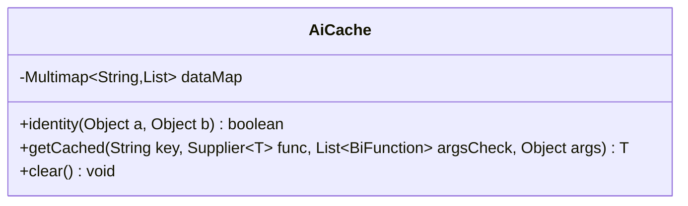

---
aliases:
  - AiCache
tags:
  - java/class
  - module/forge-ai
  - pkg/forge/ai
fqn: forge.ai.AiCache
package: forge.ai
module: forge-ai
kind: Class
---

# AiCache

**Package:** `forge.ai` &nbsp; **Module:** `forge-ai` &nbsp; **Kind:** Class




## Design Description

AiCache is a static utility class that memoizes expensive AI computations whose results can be safely shared across multiple games in the Forge engine. It maintains a single thread-safe `Multimap<String, List<Object>>`, storing each cached result together with the argument vector that produced it under a caller-supplied string key. Its generic `getCached` method scans the entries for a matching key, confirms that the stored arguments match the current call, and only invokes the supplied `Supplier` to compute and store a fresh value on a miss.

Because the cache is process-global, the design explicitly addresses unwanted collisions: callers may pass a list of `BiFunction` comparators to control how individual arguments are matched, defaulting to `equals`, with the static `identity` helper offering reference equality. It collaborates with Guava's `Multimap`/`Multimaps` and Java functional interfaces, and exposes `clear` to flush state between contexts. The class is never instantiated — a purely static API holder.

## Source
`forge-ai/src/main/java/forge/ai/AiCache.java`

```java
package forge.ai;

import com.google.common.collect.HashMultimap;
import com.google.common.collect.Lists;
import com.google.common.collect.Multimap;
import com.google.common.collect.Multimaps;

import java.util.Arrays;
import java.util.List;
import java.util.function.BiFunction;
import java.util.function.Supplier;

public class AiCache {

    // stores result + args as vector
    private static Multimap<String, List<Object>> dataMap = Multimaps.synchronizedMultimap(HashMultimap.create());

    public static boolean identity(Object a, Object b) {
        return a == b;
    }

    // the cache is global for calculations that can be shared between games
    // but that also means unwanted collisions need to be considered:
    // for that you can pass Functions that compare the args
    public static <T> T getCached(String key, Supplier<T> func, List<BiFunction<Object, Object, Boolean>> argsCheck, Object... args) {
        // TODO would like a good strategy to derive default key, but there's no clean way to obtain the method name
        for (List<Object> cached : dataMap.get(key)) {
            boolean hit = true;
            for (int i = 0; i < args.length; i++) {
                BiFunction<Object, Object, Boolean> checker = argsCheck == null ? Object::equals : argsCheck.get(i);
                if (!checker.apply(args[i], cached.get(i + 1))) {
                    hit = false;
                    break;
                }
            }
            if (hit) {
                return (T) cached.get(0);
            }
        }
        T result = func.get();
        List<Object> cached = Lists.newArrayList(result);
        cached.addAll(Arrays.asList(args));
        dataMap.put(key, cached);
        return result;
    }

    public static void clear() {
        dataMap.clear();
    }

}
```
