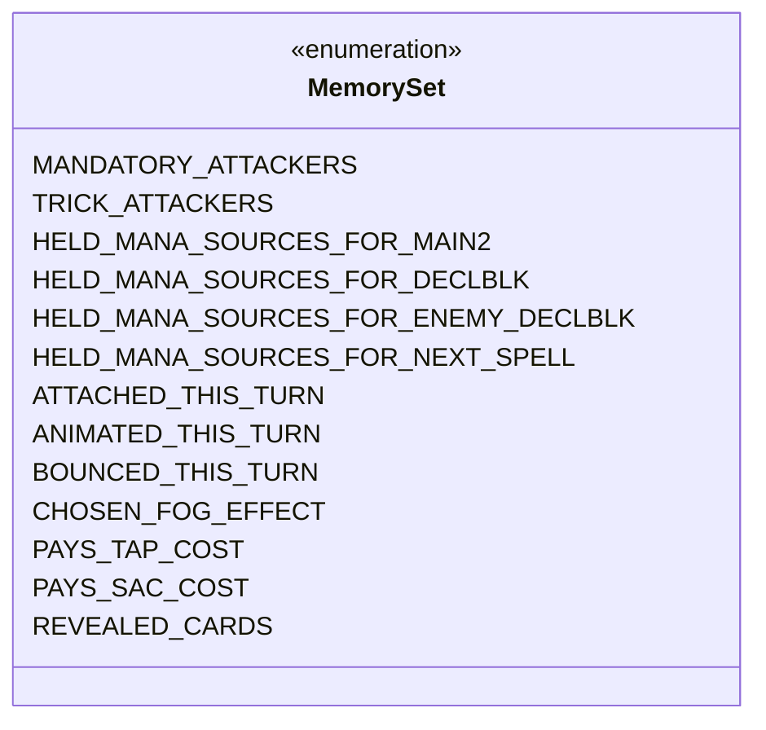

---
aliases:
  - MemorySet
tags:
  - java/enum
  - module/forge-ai
  - pkg/forge/ai
fqn: forge.ai.AiCardMemory.MemorySet
package: forge.ai
module: forge-ai
kind: Enum
---

# MemorySet

**Package:** `forge.ai`   **Module:** `forge-ai`   **Kind:** Enum



## Design Description

MemorySet is a nested enumeration within `AiCardMemory` that enumerates the distinct categories under which the AI subsystem tracks remembered cards. Each constant names a tactical bucket—creatures obligated to attack, mana sources reserved until a specific phase or spell, cards manipulated this turn, or cards earmarked to pay tap and sacrifice costs—so that retained card references carry an explicit semantic meaning rather than living in undifferentiated collections.

As a simple Java enum, it has no behavior of its own; it serves purely as a typed key into the surrounding `AiCardMemory` store, partitioning remembered cards by purpose and letting AI decision logic query the precise set relevant to a given combat, mana, or cost choice. The granular per-constant comments reflect a design intent to keep each memory category narrowly scoped and self-documenting, making the AI's transient turn-state easy to extend with new tactical categories.

## Source
`forge-ai/src/main/java/forge/ai/AiCardMemory.java` — declaration excerpt

```java
    /**
     * Defines the memory set in which the card is remembered
     * (which, in its turn, defines how the AI utilizes the information
     * about remembered cards).
     */
    public enum MemorySet {
        MANDATORY_ATTACKERS, // These creatures must attack this turn
        TRICK_ATTACKERS, // These creatures will attack to try to provoke the opponent to block them into a combat trick
        HELD_MANA_SOURCES_FOR_MAIN2, // These mana sources will not be used before Main 2
        HELD_MANA_SOURCES_FOR_DECLBLK, // These mana sources will not be used before Combat - Declare Blockers
        HELD_MANA_SOURCES_FOR_ENEMY_DECLBLK, // These mana sources will not be used before the opponent's Combat - Declare Blockers
        HELD_MANA_SOURCES_FOR_NEXT_SPELL, // These mana sources will not be used until the next time the AI chooses a spell to cast
        ATTACHED_THIS_TURN, // These equipments were attached to something already this turn
        ANIMATED_THIS_TURN, // These cards had their AF Animate effect activated this turn
        BOUNCED_THIS_TURN, // These cards were bounced this turn
        CHOSEN_FOG_EFFECT, // These cards are marked as the Fog-like effect the AI is planning to cast this turn
        PAYS_TAP_COST, // These cards will be tapped as part of a cost and cannot be chosen in another part
        PAYS_SAC_COST, // These cards will be sacrificed as part of a cost and cannot be chosen in another part
        REVEALED_CARDS // These cards were recently revealed to the AI by a call to PlayerControllerAi.reveal
    }
```
