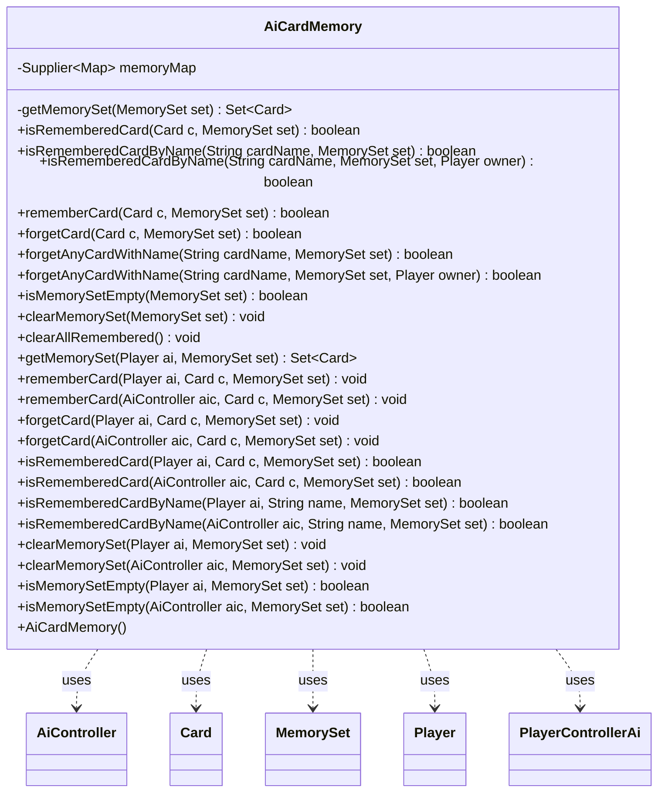

---
aliases:
  - AiCardMemory
tags:
  - java/class
  - module/forge-ai
  - pkg/forge/ai
fqn: forge.ai.AiCardMemory
package: forge.ai
module: forge-ai
kind: Class
---

# AiCardMemory

**Package:** `forge.ai`   **Module:** `forge-ai`   **Kind:** Class



## Relationships
**Uses:**
- [[forge.ai.AiCardMemory.MemorySet|MemorySet]]
- [[forge.ai.AiController|AiController]]
- [[forge.ai.PlayerControllerAi|PlayerControllerAi]]
- [[forge.game.card.Card|Card]]
- [[forge.game.player.Player|Player]]


## Design Description

AiCardMemory gives each AI player a private working memory for "memorizing" cards and bucketing them into named `MemorySet` categories—mandatory attackers, mana sources held back until a later phase, cards bounced or revealed this turn, resources earmarked as a tap or sacrifice cost—so the AI can make better-informed combat and spell-timing decisions. A single instance lives per `AiController` and is reached via `AiController.getCardMemory`. Its instance API exposes symmetric remember/forget/query/clear operations keyed by `Card` or card name, with name lookups optionally narrowed by owning `Player`.

The design favors safe, lazy state: a memoized `Supplier` yields a concurrent map, and each set is a concurrent `Set<Card>` created on demand via `computeIfAbsent`, tolerating concurrent access without explicit synchronization. A parallel layer of static helpers resolves memory either directly from an `AiController` or from a `Player`—guarding with an `isAI` check and casting through `PlayerControllerAi`—so call sites stay terse and harmlessly no-op for human-controlled players.

## Source
`forge-ai/src/main/java/forge/ai/AiCardMemory.java`

```java
/*
 * Forge: Play Magic: the Gathering.
 * Copyright (C) 2011  Forge Team
 *
 * This program is free software: you can redistribute it and/or modify
 * it under the terms of the GNU General Public License as published by
 * the Free Software Foundation, either version 3 of the License, or
 * (at your option) any later version.
 * 
 * This program is distributed in the hope that it will be useful,
 * but WITHOUT ANY WARRANTY; without even the implied warranty of
 * MERCHANTABILITY or FITNESS FOR A PARTICULAR PURPOSE.  See the
 * GNU General Public License for more details.
 * 
 * You should have received a copy of the GNU General Public License
 * along with this program.  If not, see <http://www.gnu.org/licenses/>.
 */

package forge.ai;

import java.util.Map;
import java.util.Set;

import com.google.common.base.Supplier;
import com.google.common.base.Suppliers;
import com.google.common.collect.Maps;
import com.google.common.collect.Sets;
import forge.game.card.Card;
import forge.game.player.Player;


/**
 * <p>
 * AiCardMemory class.
 * </p>
 * 
 * A simple class that allows the AI to "memorize" different cards on the battlefield (and possibly in other zones
 * too, for instance as revealed from the opponent's hand) and assign them to different memory sets in order to help
 * make somewhat more "educated" decisions to attack with certain cards or play certain spell abilities. Each 
 * AiController has its own memory that is created when the AI player is spawned. The card memory is accessible 
 * via AiController.getCardMemory. 
 * 
 * @author Forge
 */
public class AiCardMemory {

    /**
     * Defines the memory set in which the card is remembered
     * (which, in its turn, defines how the AI utilizes the information
     * about remembered cards).
     */
    public enum MemorySet {
        MANDATORY_ATTACKERS, // These creatures must attack this turn
        TRICK_ATTACKERS, // These creatures will attack to try to provoke the opponent to block them into a combat trick
        HELD_MANA_SOURCES_FOR_MAIN2, // These mana sources will not be used before Main 2
        HELD_MANA_SOURCES_FOR_DECLBLK, // These mana sources will not be used before Combat - Declare Blockers
        HELD_MANA_SOURCES_FOR_ENEMY_DECLBLK, // These mana sources will not be used before the opponent's Combat - Declare Blockers
        HELD_MANA_SOURCES_FOR_NEXT_SPELL, // These mana sources will not be used until the next time the AI chooses a spell to cast
        ATTACHED_THIS_TURN, // These equipments were attached to something already this turn
        ANIMATED_THIS_TURN, // These cards had their AF Animate effect activated this turn
        BOUNCED_THIS_TURN, // These cards were bounced this turn
        CHOSEN_FOG_EFFECT, // These cards are marked as the Fog-like effect the AI is planning to cast this turn
        PAYS_TAP_COST, // These cards will be tapped as part of a cost and cannot be chosen in another part
        PAYS_SAC_COST, // These cards will be sacrificed as part of a cost and cannot be chosen in another part
        REVEALED_CARDS // These cards were recently revealed to the AI by a call to PlayerControllerAi.reveal
    }

    private final Supplier<Map<MemorySet, Set<Card>>> memoryMap = Suppliers.memoize(Maps::newConcurrentMap);

    public AiCardMemory() {
    }

    private Set<Card> getMemorySet(MemorySet set) {
        return memoryMap.get().computeIfAbsent(set, value -> Sets.newConcurrentHashSet());
    }

    /**
     * Checks if the given card was remembered in the given memory set. 
     * 
     * @param c
     *            the card
     * @param set the memory set that is to be checked 
     * @return true, if the card is remembered in the given memory set
     */
    public boolean isRememberedCard(Card c, MemorySet set) {
        if (c == null) {
            return false;
        }
        return getMemorySet(set).contains(c);
    }

    /**
     * Checks if at least one card of the given name was remembered in the given memory set.
     * 
     * @param cardName
     *            the card name
     * @param set the memory set that is to be checked 
     * @return true, if at least one card with the given name is remembered in the given memory set
     */
    public boolean isRememberedCardByName(String cardName, MemorySet set) {
        return getMemorySet(set).stream().anyMatch(c -> c.getName().equals(cardName));
    }

    /**
     * Checks if at least one card of the given name was remembered in the given memory set such
     * that its owner is the given player.
     * 
     * @param cardName
     *            the card name
     * @param set the memory set that is to be checked 
     * @param owner the owner of the card
     * @return true, if at least one card with the given name is remembered in the given memory set
     */
    public boolean isRememberedCardByName(String cardName, MemorySet set, Player owner) {
        return getMemorySet(set).stream().anyMatch(c -> c.getName().equals(cardName) && c.getOwner().equals(owner));
    }

    /**
     * Remembers the given card in the given memory set.
     * @param c
     *            the card
     * @param set the memory set to remember the card in
     * @return true, if the card is successfully stored in the given memory set 
     */
    public boolean rememberCard(Card c, MemorySet set) {
        if (c == null)
            return false;
        return getMemorySet(set).add(c);
    }

    /**
     * Forgets the given card in the given memory set.
     * @param c
     *            the card
     * @param set the memory set to forget the card in
     * @return true, if the card was previously remembered in the given memory set and was successfully forgotten
     */
    public boolean forgetCard(Card c, MemorySet set) {
        if (c == null) {
            return false;
        }
        if (!isRememberedCard(c, set)) {
            return false;
        }
        return getMemorySet(set).remove(c);
    }

    /**
     * Forgets a single card with the given name in the given memory set.
     * @param cardName
     *            the card name
     * @param set the memory set to forget the card in
     * @return true, if at least one card with the given name was previously remembered in the given memory set and was successfully forgotten
     */
    public boolean forgetAnyCardWithName(String cardName, MemorySet set) {
        for (Card c : getMemorySet(set)) {
            if (c.getName().equals(cardName)) {
                return forgetCard(c, set);
            }
        }
        return false;
    }

    /**
     * Forgets a single card with the given name owned by the given player in the given memory set.
     * @param cardName
     *            the card name
     * @param set the memory set to forget the card in
     * @param owner the owner of the card
     * @return true, if at least one card with the given name was previously remembered in the given memory set and was successfully forgotten
     */
    public boolean forgetAnyCardWithName(String cardName, MemorySet set, Player owner) {
        for (Card c : getMemorySet(set)) {
            if (c.getName().equals(cardName) && c.getOwner().equals(owner)) {
                return forgetCard(c, set);
            }
        }
        return false;
    }

    /**
     * Determines if the memory set is empty.
     * @param set the memory set to inspect.
     * @return true, if the given memory set contains no remembered cards.
     */
    public boolean isMemorySetEmpty(MemorySet set) {
        return set == null || getMemorySet(set).isEmpty();
    }
    
    /**
     * Clears the given memory set.
     */
    public void clearMemorySet(MemorySet set) {
        if (set != null) {
            getMemorySet(set).clear();
        }
    }

    /**
     * Clears all memory sets stored in this card memory for the given player.
     */
    public void clearAllRemembered() {
        for (MemorySet memSet : MemorySet.values()) {
            clearMemorySet(memSet);
        }
    }

    // Static functions to simplify access to AI card memory of a given AI player.
    public static Set<Card> getMemorySet(Player ai, MemorySet set) {
        if (!ai.getController().isAI()) {
            return null;
        }
        return ((PlayerControllerAi)ai.getController()).getAi().getCardMemory().getMemorySet(set);
    }
    public static void rememberCard(Player ai, Card c, MemorySet set) {
        if (!ai.getController().isAI()) {
            return;
        }
        ((PlayerControllerAi)ai.getController()).getAi().getCardMemory().rememberCard(c, set);
    }
    public static void rememberCard(AiController aic, Card c, MemorySet set) {
        aic.getCardMemory().rememberCard(c, set);
    }
    public static void forgetCard(Player ai, Card c, MemorySet set) {
        if (!ai.getController().isAI()) {
            return;
        }
        ((PlayerControllerAi)ai.getController()).getAi().getCardMemory().forgetCard(c, set);
    }
    public static void forgetCard(AiController aic, Card c, MemorySet set) {
        aic.getCardMemory().forgetCard(c, set);
    }
    public static boolean isRememberedCard(Player ai, Card c, MemorySet set) {
        if (!ai.getController().isAI()) {
            return false;
        }
        return ((PlayerControllerAi)ai.getController()).getAi().getCardMemory().isRememberedCard(c, set);
    }
    public static boolean isRememberedCard(AiController aic, Card c, MemorySet set) {
        return aic.getCardMemory().isRememberedCard(c, set);
    }
    public static boolean isRememberedCardByName(Player ai, String name, MemorySet set) {
        if (!ai.getController().isAI()) {
            return false;
        }
        return ((PlayerControllerAi)ai.getController()).getAi().getCardMemory().isRememberedCardByName(name, set);
    }
    public static boolean isRememberedCardByName(AiController aic, String name, MemorySet set) {
        return aic.getCardMemory().isRememberedCardByName(name, set);
    }
    public static void clearMemorySet(Player ai, MemorySet set) {
        if (!ai.getController().isAI()) {
            return;
        }
        ((PlayerControllerAi)ai.getController()).getAi().getCardMemory().clearMemorySet(set);
    }
    public static void clearMemorySet(AiController aic, MemorySet set) {
        if (!isMemorySetEmpty(aic, set)) {
            aic.getCardMemory().clearMemorySet(set);
        }
    }
    public static boolean isMemorySetEmpty(Player ai, MemorySet set) {
        if (!ai.getController().isAI()) {
            return false;
        }
        return ((PlayerControllerAi)ai.getController()).getAi().getCardMemory().isMemorySetEmpty(set);
    }
    public static boolean isMemorySetEmpty(AiController aic, MemorySet set) {
        return aic.getCardMemory().isMemorySetEmpty(set);
    }
}
```

## Python
`forge/ai/AiCardMemory.py`

```python
from enum import Enum
from typing import Optional

from forge.ai.AiController import AiController
from forge.ai.PlayerControllerAi import PlayerControllerAi
from forge.game.card.Card import Card
from forge.game.player.Player import Player


class AiCardMemory:
    """
    AiCardMemory class.

    A simple class that allows the AI to "memorize" different cards on the battlefield (and possibly in other zones
    too, for instance as revealed from the opponent's hand) and assign them to different memory sets in order to help
    make somewhat more "educated" decisions to attack with certain cards or play certain spell abilities. Each
    AiController has its own memory that is created when the AI player is spawned. The card memory is accessible
    via AiController.getCardMemory.

    @author Forge
    """

    class MemorySet(Enum):
        """
        Defines the memory set in which the card is remembered
        (which, in its turn, defines how the AI utilizes the information
        about remembered cards).
        """
        MANDATORY_ATTACKERS = "MANDATORY_ATTACKERS"  # These creatures must attack this turn
        TRICK_ATTACKERS = "TRICK_ATTACKERS"  # These creatures will attack to try to provoke the opponent to block them into a combat trick
        HELD_MANA_SOURCES_FOR_MAIN2 = "HELD_MANA_SOURCES_FOR_MAIN2"  # These mana sources will not be used before Main 2
        HELD_MANA_SOURCES_FOR_DECLBLK = "HELD_MANA_SOURCES_FOR_DECLBLK"  # These mana sources will not be used before Combat - Declare Blockers
        HELD_MANA_SOURCES_FOR_ENEMY_DECLBLK = "HELD_MANA_SOURCES_FOR_ENEMY_DECLBLK"  # These mana sources will not be used before the opponent's Combat - Declare Blockers
        HELD_MANA_SOURCES_FOR_NEXT_SPELL = "HELD_MANA_SOURCES_FOR_NEXT_SPELL"  # These mana sources will not be used until the next time the AI chooses a spell to cast
        ATTACHED_THIS_TURN = "ATTACHED_THIS_TURN"  # These equipments were attached to something already this turn
        ANIMATED_THIS_TURN = "ANIMATED_THIS_TURN"  # These cards had their AF Animate effect activated this turn
        BOUNCED_THIS_TURN = "BOUNCED_THIS_TURN"  # These cards were bounced this turn
        CHOSEN_FOG_EFFECT = "CHOSEN_FOG_EFFECT"  # These cards are marked as the Fog-like effect the AI is planning to cast this turn
        PAYS_TAP_COST = "PAYS_TAP_COST"  # These cards will be tapped as part of a cost and cannot be chosen in another part
        PAYS_SAC_COST = "PAYS_SAC_COST"  # These cards will be sacrificed as part of a cost and cannot be chosen in another part
        REVEALED_CARDS = "REVEALED_CARDS"  # These cards were recently revealed to the AI by a call to PlayerControllerAi.reveal

    def __init__(self):
        self.memoryMap: dict[AiCardMemory.MemorySet, set[Card]] = {}

    def getMemorySet(self, set: "AiCardMemory.MemorySet") -> set[Card]:
        return self.memoryMap.setdefault(set, set())

    def isRememberedCard(self, c: Card, set: "AiCardMemory.MemorySet") -> bool:
        """
        Checks if the given card was remembered in the given memory set.
        """
        if c is None:
            return False
        return c in self.getMemorySet(set)

    def isRememberedCardByName(self, cardName: str, set: "AiCardMemory.MemorySet", owner: Optional[Player] = None) -> bool:
        """
        Checks if at least one card of the given name was remembered in the given memory set.
        If an owner is given, the lookup is narrowed to cards owned by that player.
        """
        if owner is None:
            return any(c.getName() == cardName for c in self.getMemorySet(set))
        return any(c.getName() == cardName and c.getOwner() == owner for c in self.getMemorySet(set))

    def rememberCard(self, c: Card, set: "AiCardMemory.MemorySet") -> bool:
        """
        Remembers the given card in the given memory set.
        """
        if c is None:
            return False
        memorySet = self.getMemorySet(set)
        if c in memorySet:
            return False
        memorySet.add(c)
        return True

    def forgetCard(self, c: Card, set: "AiCardMemory.MemorySet") -> bool:
        """
        Forgets the given card in the given memory set.
        """
        if c is None:
            return False
        if not self.isRememberedCard(c, set):
            return False
        memorySet = self.getMemorySet(set)
        if c in memorySet:
            memorySet.remove(c)
            return True
        return False

    def forgetAnyCardWithName(self, cardName: str, set: "AiCardMemory.MemorySet", owner: Optional[Player] = None) -> bool:
        """
        Forgets a single card with the given name in the given memory set, optionally narrowed to the given owner.
        """
        for c in self.getMemorySet(set):
            if owner is None:
                if c.getName() == cardName:
                    return self.forgetCard(c, set)
            else:
                if c.getName() == cardName and c.getOwner() == owner:
                    return self.forgetCard(c, set)
        return False

    def isMemorySetEmpty(self, set: "AiCardMemory.MemorySet") -> bool:
        """
        Determines if the memory set is empty.
        """
        return set is None or len(self.getMemorySet(set)) == 0

    def clearMemorySet(self, set: "AiCardMemory.MemorySet") -> None:
        """
        Clears the given memory set.
        """
        if set is not None:
            self.getMemorySet(set).clear()

    def clearAllRemembered(self) -> None:
        """
        Clears all memory sets stored in this card memory for the given player.
        """
        for memSet in AiCardMemory.MemorySet:
            self.clearMemorySet(memSet)

    # Static functions to simplify access to AI card memory of a given AI player.
    @staticmethod
    def getMemorySet(ai: Player, set: "AiCardMemory.MemorySet") -> Optional[set[Card]]:
        if not ai.getController().isAI():
            return None
        return PlayerControllerAi(ai.getController()).getAi().getCardMemory().getMemorySet(set)

    @staticmethod
    def rememberCard(ai, c: Card, set: "AiCardMemory.MemorySet") -> None:
        if isinstance(ai, AiController):
            ai.getCardMemory().rememberCard(c, set)
            return
        if not ai.getController().isAI():
            return
        PlayerControllerAi(ai.getController()).getAi().getCardMemory().rememberCard(c, set)

    @staticmethod
    def forgetCard(ai, c: Card, set: "AiCardMemory.MemorySet") -> None:
        if isinstance(ai, AiController):
            ai.getCardMemory().forgetCard(c, set)
            return
        if not ai.getController().isAI():
            return
        PlayerControllerAi(ai.getController()).getAi().getCardMemory().forgetCard(c, set)

    @staticmethod
    def isRememberedCard(ai, c: Card, set: "AiCardMemory.MemorySet") -> bool:
        if isinstance(ai, AiController):
            return ai.getCardMemory().isRememberedCard(c, set)
        if not ai.getController().isAI():
            return False
        return PlayerControllerAi(ai.getController()).getAi().getCardMemory().isRememberedCard(c, set)

    @staticmethod
    def isRememberedCardByName(ai, name: str, set: "AiCardMemory.MemorySet") -> bool:
        if isinstance(ai, AiController):
            return ai.getCardMemory().isRememberedCardByName(name, set)
        if not ai.getController().isAI():
            return False
        return PlayerControllerAi(ai.getController()).getAi().getCardMemory().isRememberedCardByName(name, set)

    @staticmethod
    def clearMemorySet(ai, set: "AiCardMemory.MemorySet") -> None:
        if isinstance(ai, AiController):
            if not AiCardMemory.isMemorySetEmpty(ai, set):
                ai.getCardMemory().clearMemorySet(set)
            return
        if not ai.getController().isAI():
            return
        PlayerControllerAi(ai.getController()).getAi().getCardMemory().clearMemorySet(set)

    @staticmethod
    def isMemorySetEmpty(ai, set: "AiCardMemory.MemorySet") -> bool:
        if isinstance(ai, AiController):
            return ai.getCardMemory().isMemorySetEmpty(set)
        if not ai.getController().isAI():
            return False
        return PlayerControllerAi(ai.getController()).getAi().getCardMemory().isMemorySetEmpty(set)
```
