---
aliases:
  - AiCostDecision
tags:
  - java/class
  - module/forge-ai
  - pkg/forge/ai
fqn: forge.ai.AiCostDecision
package: forge.ai
module: forge-ai
kind: Class
---

# AiCostDecision

**Package:** `forge.ai`   **Module:** `forge-ai`   **Kind:** Class



```mermaid
classDiagram
    class AiCostDecision {
        -CardCollection discarded
        -CardCollection tapped
        +visit(CostAddMana cost) PaymentDecision
        +visit(CostBehold cost) PaymentDecision
        +visit(CostBeholdExile cost) PaymentDecision
        +visit(CostChooseColor cost) PaymentDecision
        +visit(CostChooseCreatureType cost) PaymentDecision
        +visit(CostCollectEvidence cost) PaymentDecision
        +visit(CostDiscard cost) PaymentDecision
        +visit(CostDamage cost) PaymentDecision
        +visit(CostDraw cost) PaymentDecision
        +visit(CostPromiseGift cost) PaymentDecision
        +visit(CostExile cost) PaymentDecision
        +visit(CostExileFromStack cost) PaymentDecision
        +visit(CostExiledMoveToGrave cost) PaymentDecision
        +visit(CostExert cost) PaymentDecision
        +visit(CostEnlist cost) PaymentDecision
        +visit(CostFlipCoin cost) PaymentDecision
        +visit(CostForage cost) PaymentDecision
        +visit(CostRollDice cost) PaymentDecision
        +visit(CostGainControl cost) PaymentDecision
        +visit(CostGainLife cost) PaymentDecision
        +visit(CostMill cost) PaymentDecision
        +visit(CostPartMana cost) PaymentDecision
        +visit(CostPayLife cost) PaymentDecision
        +visit(CostPayEnergy cost) PaymentDecision
        +visit(CostPutCardToLib cost) PaymentDecision
        +visit(CostPutCounter cost) PaymentDecision
        +visit(CostTap cost) PaymentDecision
        +visit(CostTapType cost) PaymentDecision
        +visit(CostSacrifice cost) PaymentDecision
        +visit(CostReturn cost) PaymentDecision
        +visit(CostReveal cost) PaymentDecision
        +visit(CostRevealChosen cost) PaymentDecision
        #removeCounter(GameEntityCounterTable table, List~Card~ prefs, CounterEnumType cType, int stillToRemove) int
        +visit(CostRemoveAnyCounter cost) PaymentDecision
        +visit(CostRemoveCounter cost) PaymentDecision
        +visit(CostUntapType cost) PaymentDecision
        +visit(CostUntap cost) PaymentDecision
        +visit(CostPayShards cost) PaymentDecision
        +visit(CostUnattach cost) PaymentDecision
        +visit(CostBlight cost) PaymentDecision
        +paysRightAfterDecision() boolean
        +AiCostDecision(Player ai0, SpellAbility sa, boolean effect)
        +AiCostDecision(Player ai0, SpellAbility sa, boolean effect, boolean payMana)
    }
    AiCostDecision --|> CostDecisionMakerBase : extends
    AiCostDecision ..> AiController : uses
    AiCostDecision ..> Card : uses
    AiCostDecision ..> CardCollection : uses
    AiCostDecision ..> CardCollectionView : uses
    AiCostDecision ..> CostAddMana : uses
    AiCostDecision ..> CostBehold : uses
    AiCostDecision ..> CostBeholdExile : uses
    AiCostDecision ..> CostBlight : uses
    AiCostDecision ..> CostChooseColor : uses
    AiCostDecision ..> CostChooseCreatureType : uses
    AiCostDecision ..> CostCollectEvidence : uses
    AiCostDecision ..> CostDamage : uses
    AiCostDecision ..> CostDiscard : uses
    AiCostDecision ..> CostDraw : uses
    AiCostDecision ..> CostEnlist : uses
    AiCostDecision ..> CostExert : uses
    AiCostDecision ..> CostExile : uses
    AiCostDecision ..> CostExileFromStack : uses
    AiCostDecision ..> CostExiledMoveToGrave : uses
    AiCostDecision ..> CostFlipCoin : uses
    AiCostDecision ..> CostForage : uses
    AiCostDecision ..> CostGainControl : uses
    AiCostDecision ..> CostGainLife : uses
    AiCostDecision ..> CostMill : uses
    AiCostDecision ..> CostPartMana : uses
    AiCostDecision ..> CostPayEnergy : uses
    AiCostDecision ..> CostPayLife : uses
    AiCostDecision ..> CostPayShards : uses
    AiCostDecision ..> CostPromiseGift : uses
    AiCostDecision ..> CostPutCardToLib : uses
    AiCostDecision ..> CostPutCounter : uses
    AiCostDecision ..> CostRemoveAnyCounter : uses
    AiCostDecision ..> CostRemoveCounter : uses
    AiCostDecision ..> CostReturn : uses
    AiCostDecision ..> CostReveal : uses
    AiCostDecision ..> CostRevealChosen : uses
    AiCostDecision ..> CostRollDice : uses
    AiCostDecision ..> CostSacrifice : uses
    AiCostDecision ..> CostTap : uses
    AiCostDecision ..> CostTapType : uses
    AiCostDecision ..> CostUnattach : uses
    AiCostDecision ..> CostUntap : uses
    AiCostDecision ..> CostUntapType : uses
    AiCostDecision ..> CounterEnumType : uses
    AiCostDecision ..> CounterType : uses
    AiCostDecision ..> FCollectionView : uses
    AiCostDecision ..> Game : uses
    AiCostDecision ..> GameEntityCounterTable : uses
    AiCostDecision ..> PaymentDecision : uses
    AiCostDecision ..> Player : uses
    AiCostDecision ..> PlayerControllerAi : uses
    AiCostDecision ..> SpellAbility : uses
    AiCostDecision ..> SpellAbilityStackInstance : uses
```

## Relationships
**Extends:**
- [[forge.game.cost.CostDecisionMakerBase|CostDecisionMakerBase]]
**Uses:**
- [[forge.ai.AiController|AiController]]
- [[forge.ai.PlayerControllerAi|PlayerControllerAi]]
- [[forge.game.Game|Game]]
- [[forge.game.GameEntityCounterTable|GameEntityCounterTable]]
- [[forge.game.card.Card|Card]]
- [[forge.game.card.CardCollection|CardCollection]]
- [[forge.game.card.CardCollectionView|CardCollectionView]]
- [[forge.game.card.CounterEnumType|CounterEnumType]]
- [[forge.game.card.CounterType|CounterType]]
- [[forge.game.cost.CostAddMana|CostAddMana]]
- [[forge.game.cost.CostBehold|CostBehold]]
- [[forge.game.cost.CostBeholdExile|CostBeholdExile]]
- [[forge.game.cost.CostBlight|CostBlight]]
- [[forge.game.cost.CostChooseColor|CostChooseColor]]
- [[forge.game.cost.CostChooseCreatureType|CostChooseCreatureType]]
- [[forge.game.cost.CostCollectEvidence|CostCollectEvidence]]
- [[forge.game.cost.CostDamage|CostDamage]]
- [[forge.game.cost.CostDiscard|CostDiscard]]
- [[forge.game.cost.CostDraw|CostDraw]]
- [[forge.game.cost.CostEnlist|CostEnlist]]
- [[forge.game.cost.CostExert|CostExert]]
- [[forge.game.cost.CostExile|CostExile]]
- [[forge.game.cost.CostExileFromStack|CostExileFromStack]]
- [[forge.game.cost.CostExiledMoveToGrave|CostExiledMoveToGrave]]
- [[forge.game.cost.CostFlipCoin|CostFlipCoin]]
- [[forge.game.cost.CostForage|CostForage]]
- [[forge.game.cost.CostGainControl|CostGainControl]]
- [[forge.game.cost.CostGainLife|CostGainLife]]
- [[forge.game.cost.CostMill|CostMill]]
- [[forge.game.cost.CostPartMana|CostPartMana]]
- [[forge.game.cost.CostPayEnergy|CostPayEnergy]]
- [[forge.game.cost.CostPayLife|CostPayLife]]
- [[forge.game.cost.CostPayShards|CostPayShards]]
- [[forge.game.cost.CostPromiseGift|CostPromiseGift]]
- [[forge.game.cost.CostPutCardToLib|CostPutCardToLib]]
- [[forge.game.cost.CostPutCounter|CostPutCounter]]
- [[forge.game.cost.CostRemoveAnyCounter|CostRemoveAnyCounter]]
- [[forge.game.cost.CostRemoveCounter|CostRemoveCounter]]
- [[forge.game.cost.CostReturn|CostReturn]]
- [[forge.game.cost.CostReveal|CostReveal]]
- [[forge.game.cost.CostRevealChosen|CostRevealChosen]]
- [[forge.game.cost.CostRollDice|CostRollDice]]
- [[forge.game.cost.CostSacrifice|CostSacrifice]]
- [[forge.game.cost.CostTap|CostTap]]
- [[forge.game.cost.CostTapType|CostTapType]]
- [[forge.game.cost.CostUnattach|CostUnattach]]
- [[forge.game.cost.CostUntap|CostUntap]]
- [[forge.game.cost.CostUntapType|CostUntapType]]
- [[forge.game.cost.PaymentDecision|PaymentDecision]]
- [[forge.game.player.Player|Player]]
- [[forge.game.spellability.SpellAbility|SpellAbility]]
- [[forge.game.spellability.SpellAbilityStackInstance|SpellAbilityStackInstance]]
- [[forge.util.collect.FCollectionView|FCollectionView]]


## Design Description

Forge's `AiCostDecision` is the AI-player implementation of the cost-payment decision maker, extending `CostDecisionMakerBase`. Following the visitor pattern, it overrides one `visit` method per concrete `Cost*` subclass (sacrifice, discard, tap, exile, counter removal, life/energy payment, and many mechanic-specific costs), each returning a `PaymentDecision` that names the specific cards, players, counters, numbers, or colors the AI chooses to satisfy that cost — or `null` when the cost cannot or should not be paid.

The class encapsulates Forge's automated heuristics for paying costs as cheaply as possible: it picks worst creatures/permanents to sacrifice, prefers removing detrimental or useless counters (and beneficial ones like persist/undying triggers), and consults `ComputerUtilCard` and the `AiController` (via `PlayerControllerAi`) for harder choices. Internal `discarded` and `tapped` collections track in-progress selections—seeded from `AiCardMemory`—so multiple costs within one ability don't double-commit the same card. `paysRightAfterDecision()` returns `false`, deferring actual payment until all decisions are made.

## Source
`forge-ai/src/main/java/forge/ai/AiCostDecision.java`

```java
package forge.ai;

import com.google.common.collect.Lists;

import forge.ai.AiCardMemory.MemorySet;
import forge.card.CardType;
import forge.card.ColorSet;
import forge.game.Game;
import forge.game.GameEntityCounterTable;
import forge.game.ability.AbilityUtils;
import forge.game.card.*;
import forge.game.cost.*;
import forge.game.keyword.Keyword;
import forge.game.player.Player;
import forge.game.spellability.SpellAbility;
import forge.game.spellability.SpellAbilityStackInstance;
import forge.game.zone.ZoneType;
import forge.util.Aggregates;
import forge.util.TextUtil;
import forge.util.collect.FCollectionView;

import java.util.*;

import static forge.ai.ComputerUtilCard.getBestCreatureAI;
import static forge.ai.ComputerUtilCard.getWorstCreatureAI;

public class AiCostDecision extends CostDecisionMakerBase {
    private final CardCollection discarded;
    private final CardCollection tapped;

    public AiCostDecision(Player ai0, SpellAbility sa, final boolean effect) {
        this(ai0, sa, effect, false);
    }
    public AiCostDecision(Player ai0, SpellAbility sa, final boolean effect, final boolean payMana) {
        super(ai0, effect, sa, sa.getHostCard());

        discarded = new CardCollection();
        tapped = new CardCollection();
        Set<Card> tappedForMana = AiCardMemory.getMemorySet(ai0, MemorySet.PAYS_TAP_COST);
        if (!payMana && tappedForMana != null) {
            tapped.addAll(tappedForMana);
        }
    }

    @Override
    public PaymentDecision visit(CostAddMana cost) {
        int c = cost.getAbilityAmount(ability);

        return PaymentDecision.number(c);
    }

    @Override
    public PaymentDecision visit(CostBehold cost) {
        final String type = cost.getType();
        CardCollectionView hand = player.getCardsIn(cost.getRevealFrom());
        hand = CardLists.getValidCards(hand, type.split(";"), player, source, ability);
        return hand.isEmpty() ? null : PaymentDecision.card(getBestCreatureAI(hand));
    }

    @Override
    public PaymentDecision visit(CostBeholdExile cost) {
        final String type = cost.getType();
        CardCollectionView hand = player.getCardsIn(cost.getRevealFrom());
        hand = CardLists.getValidCards(hand, type.split(";"), player, source, ability);
        return hand.isEmpty() ? null : PaymentDecision.card(getWorstCreatureAI(hand));
    }

    @Override
    public PaymentDecision visit(CostChooseColor cost) {
        int c = cost.getAbilityAmount(ability);
        return PaymentDecision.colors(player.getController().chooseColors("Color", ability, c, c, ColorSet.WUBRG));
    }

    @Override
    public PaymentDecision visit(CostChooseCreatureType cost) {
        String choice = player.getController().chooseSomeType("Creature", ability, CardType.getAllCreatureTypes());
        return PaymentDecision.type(choice);
    }

    @Override
    public PaymentDecision visit(CostCollectEvidence cost) {
        int c = cost.getAbilityAmount(ability);
        CardCollectionView chosen = ComputerUtil.chooseCollectEvidence(player, cost, source, c, ability, isEffect());

        return null == chosen ? null : PaymentDecision.card(chosen);
    }

    @Override
    public PaymentDecision visit(CostDiscard cost) {
        final String type = cost.getType();
        CardCollectionView hand = player.getCardsIn(ZoneType.Hand);

        if (type.equals("LastDrawn")) {
            if (!hand.contains(player.getLastDrawnCard())) {
                return null;
            }
            return PaymentDecision.card(player.getLastDrawnCard());
        } else if (cost.payCostFromSource()) {
            if (!hand.contains(source)) {
                return null;
            }

            return PaymentDecision.card(source);
        } else if (type.equals("Hand")) {
            if (hand.size() > 1 && ability.getActivatingPlayer() != null) {
                hand = ability.getActivatingPlayer().getController().orderMoveToZoneList(hand, ZoneType.Graveyard, ability);
            }
            return PaymentDecision.card(hand);
        }

        if (type.contains("WithSameName")) {
            return null;
        }
        int c = cost.getAbilityAmount(ability);

        if (type.equals("Random")) {
            CardCollectionView randomSubset = CardLists.getRandomSubList(new CardCollection(hand), c);
            if (randomSubset.size() > 1 && ability.getActivatingPlayer() != null) {
                randomSubset = ability.getActivatingPlayer().getController().orderMoveToZoneList(randomSubset, ZoneType.Graveyard, ability);
            }
            return PaymentDecision.card(randomSubset);
        } else if (type.contains("+WithDifferentNames")) {
            CardCollection differentNames = new CardCollection();
            CardCollection discardMe = CardLists.filter(hand, CardPredicates.hasSVar("DiscardMe"));
            while (c > 0) {
                Card chosen;
                if (!discardMe.isEmpty()) {
                    chosen = Aggregates.random(discardMe);
                    discardMe = CardLists.filter(discardMe, CardPredicates.sharesNameWith(chosen).negate());
                } else {
                    final Card worst = ComputerUtilCard.getWorstAI(hand);
                    chosen = worst != null ? worst : Aggregates.random(hand);
                }
                differentNames.add(chosen);
                hand = CardLists.filter(hand, CardPredicates.sharesNameWith(chosen).negate());
                c--;
            }
            return PaymentDecision.card(differentNames);
        } else {
            final AiController aic = ((PlayerControllerAi)player.getController()).getAi();

            CardCollection result = aic.getCardsToDiscard(c, type.split(";"), ability, discarded);
            if (result != null) {
                discarded.addAll(result);
            }
            return PaymentDecision.card(result);
        }
    }

    @Override
    public PaymentDecision visit(CostDamage cost) {
        int c = cost.getAbilityAmount(ability);

        return PaymentDecision.number(c);
    }

    @Override
    public PaymentDecision visit(CostDraw cost) {
        if (!cost.canPay(ability, player, isEffect())) {
            return null;
        }
        int c = cost.getAbilityAmount(ability);

        List<Player> res = cost.getPotentialPlayers(player, ability);

        PaymentDecision decision = PaymentDecision.players(res);
        decision.c = c;
        return decision;
    }

    @Override
    public PaymentDecision visit(CostPromiseGift cost) {
        if (!cost.canPay(ability, player, isEffect())) {
            return null;
        }
        List<Player> res = cost.getPotentialPlayers(player, ability);
        // I should only choose one of these right?
        // TODO Choose the "worst" player.
        Collections.shuffle(res);

        return PaymentDecision.players(res.subList(0, 1));
    }

    @Override
    public PaymentDecision visit(CostExile cost) {
        String type = cost.getType();
        if (cost.payCostFromSource()) {
            return PaymentDecision.card(source);
        }

        if (type.equals("All")) {
            return PaymentDecision.card(player.getCardsIn(cost.getFrom()));
        } else if (type.contains("FromTopGrave")) {
            return null;
        } else if (type.contains("+withTotalCMCGE")) {
            String strAmount = type.split("withTotalCMCGE")[1];
            int amount = AbilityUtils.calculateAmount(source, strAmount, ability);
            String typeCleaned = TextUtil.fastReplace(type, TextUtil.concatNoSpace("+withTotalCMCGE", strAmount), "");
            CardCollection valid = CardLists.getValidCards(player.getGame().getCardsIn(cost.getFrom().get(0)), typeCleaned, player, source, ability);
            CardCollection chosen = new CardCollection();

            valid.sort(CardLists.CmcComparator);

            int totalCMC = 0;
            for (Card card : valid) {
                totalCMC += card.getCMC();
                chosen.add(card);
                if (totalCMC >= amount) {
                    return PaymentDecision.card(chosen);
                }
            }

            return null;
        }

        int c = cost.getAbilityAmount(ability);

        if (cost.from.size() == 1 && cost.getFrom().get(0).equals(ZoneType.Library)) {
            return PaymentDecision.card(player.getCardsIn(ZoneType.Library, c));
        }
        else if (cost.zoneRestriction == 0) {
            // TODO Determine exile from same zone for AI
            return null;
        } else {
            CardCollectionView chosen = ComputerUtil.chooseExileFrom(player, cost, source, c, ability, isEffect());
            return null == chosen ? null : PaymentDecision.card(chosen);
        }
    }

    @Override
    public PaymentDecision visit(CostExileFromStack cost) {
        List<SpellAbility> chosen = Lists.newArrayList();
        for (SpellAbilityStackInstance si :source.getGame().getStack()) {
            SpellAbility sp = si.getSpellAbility().getRootAbility();
            if (si.getSourceCard().isValid(cost.getType().split(";"), source.getController(), source, sp)) {
                chosen.add(sp);
            }
        }
        return chosen.isEmpty() ? null : PaymentDecision.spellabilities(chosen);
    }

    @Override
    public PaymentDecision visit(CostExiledMoveToGrave cost) {
        CardCollection chosen = new CardCollection();

        int c = cost.getAbilityAmount(ability);

        CardCollection typeList = CardLists.getValidCards(player.getGame().getCardsIn(ZoneType.Exile), cost.getType().split(";"), player, source, ability);

        if (typeList.size() < c) {
            return null;
        }

        CardLists.sortByPowerDesc(typeList);

        for (int i = 0; i < c; i++) {
            chosen.add(typeList.get(i));
        }

        return chosen.isEmpty() ? null : PaymentDecision.card(chosen);
    }

    @Override
    public PaymentDecision visit(CostExert cost) {
        if (cost.payCostFromSource()) {
            return PaymentDecision.card(source);
        }

        int c = cost.getAbilityAmount(ability);

        final CardCollection typeList = CardLists.getValidCards(player.getGame().getCardsIn(ZoneType.Battlefield), cost.getType().split(";"), player, source, ability);

        if (typeList.size() < c) {
            return null;
        }

        CardLists.sortByPowerAsc(typeList);
        final CardCollection res = new CardCollection();

        for (int i = 0; i < c; i++) {
            res.add(typeList.get(i));
        }
        return res.isEmpty() ? null : PaymentDecision.card(res);
    }

    @Override
    public PaymentDecision visit(final CostEnlist cost) {
        CardCollection choices = CostEnlist.getCardsForEnlisting(player);
        CardLists.sortByPowerDesc(choices);
        return choices.isEmpty() ? null : PaymentDecision.card(choices.getFirst());
    }

    @Override
    public PaymentDecision visit(CostFlipCoin cost) {
        int c = cost.getAbilityAmount(ability);
        return PaymentDecision.number(c);
    }

    @Override
    public PaymentDecision visit(final CostForage cost) {
        CardCollection food = CardLists.filter(player.getCardsIn(ZoneType.Battlefield), CardPredicates.isType("Food"), CardPredicates.canBeSacrificedBy(ability, isEffect()));
        CardCollection exile = CardLists.filter(player.getCardsIn(ZoneType.Graveyard), CardPredicates.canExiledBy(ability, isEffect()));
        if (!food.isEmpty()) {
            final AiController aic = ((PlayerControllerAi)player.getController()).getAi();
            CardCollectionView list = aic.chooseSacrificeType("Food", ability, isEffect(), 1, null);
            return list == null ? null : PaymentDecision.card(list);
        } else {
            CardCollectionView chosen = ComputerUtil.chooseExileFromList(player, exile, source, 3, ability, isEffect());
            return null == chosen ? null : PaymentDecision.card(chosen);
        }
    }

    @Override
    public PaymentDecision visit(CostRollDice cost) {
        int c = cost.getAbilityAmount(ability);
        return PaymentDecision.number(c);
    }

    @Override
    public PaymentDecision visit(CostGainControl cost) {
        if (cost.payCostFromSource()) {
            return PaymentDecision.card(source);
        }

        int c = cost.getAbilityAmount(ability);

        CardCollection typeList = CardLists.getValidCards(player.getGame().getCardsIn(ZoneType.Battlefield), cost.getType().split(";"), player, source, ability);
        typeList = CardLists.filter(typeList, crd -> crd.canBeControlledBy(player));

        if (typeList.size() < c) {
            return null;
        }

        CardLists.sortByPowerAsc(typeList);
        final CardCollection res = new CardCollection();

        for (int i = 0; i < c; i++) {
            res.add(typeList.get(i));
        }
        return res.isEmpty() ? null : PaymentDecision.card(res);
    }

    @Override
    public PaymentDecision visit(CostGainLife cost) {
        final List<Player> oppsThatCanGainLife = Lists.newArrayList();

        for (final Player opp : cost.getPotentialTargets(player, ability)) {
            if (opp.canGainLife()) {
                oppsThatCanGainLife.add(opp);
            }
        }

        if (oppsThatCanGainLife.isEmpty()) {
            return null;
        }

        return PaymentDecision.players(oppsThatCanGainLife);
    }

    @Override
    public PaymentDecision visit(CostMill cost) {
        int c = cost.getAbilityAmount(ability);

        CardCollectionView topLib = player.getCardsIn(ZoneType.Library, c);
        return topLib.size() < c ? null : PaymentDecision.number(c);
    }

    @Override
    public PaymentDecision visit(CostPartMana cost) {
        return PaymentDecision.number(0);
    }

    @Override
    public PaymentDecision visit(CostPayLife cost) {
        int c = cost.getAbilityAmount(ability);
        if (!player.canPayLife(c, isEffect(), ability)) {
            return null;
        }
        return PaymentDecision.number(c);
    }

    @Override
    public PaymentDecision visit(CostPayEnergy cost) {
        int c = cost.getAbilityAmount(ability);
        if (!player.canPayEnergy(c)) {
            return null;
        }
        return PaymentDecision.number(c);
    }

    @Override
    public PaymentDecision visit(CostPutCardToLib cost) {
        if (cost.payCostFromSource()) {
            return PaymentDecision.card(source);
        }
        final Game game = player.getGame();
        CardCollection chosen = new CardCollection();
        CardCollectionView list;

        if (cost.isSameZone()) {
            list = game.getCardsIn(cost.getFrom());
        } else {
            list = player.getCardsIn(cost.getFrom());
        }

        int c = cost.getAbilityAmount(ability);

        list = CardLists.getValidCards(list, cost.getType().split(";"), player, source, ability);

        if (cost.isSameZone()) {
            // Jötun Grunt
            // TODO: improve AI
            final FCollectionView<Player> players = game.getPlayers();
            for (Player p : players) {
                CardCollectionView enoughType = CardLists.filter(list, CardPredicates.isOwner(p));
                if (enoughType.size() >= c) {
                    chosen.addAll(enoughType);
                    break;
                }
            }
            chosen = chosen.subList(0, c);
        } else {
            chosen = ComputerUtil.choosePutToLibraryFrom(player, cost.getFrom(), cost.getType(), source, ability.getTargetCard(), c, ability);
        }
        return chosen.isEmpty() ? null : PaymentDecision.card(chosen);
    }

    @Override
    public PaymentDecision visit(CostPutCounter cost) {
        if (cost.payCostFromSource()) {
            return PaymentDecision.card(source);
        }

        CardCollection typeList = CardLists.getValidCards(player.getGame().getCardsIn(ZoneType.Battlefield),
                cost.getType().split(";"), player, source, ability);
        typeList = CardLists.filter(typeList, CardPredicates.canReceiveCounters(cost.getCounter()));

        Card card;
        if (cost.getType().equals("Creature.YouCtrl")) {
            card = ComputerUtilCard.getWorstCreatureAI(typeList);
        } else {
            card = ComputerUtilCard.getWorstPermanentAI(typeList, false, false, false, false);
        }
        return PaymentDecision.card(card);
    }

    @Override
    public PaymentDecision visit(CostTap cost) {
        return PaymentDecision.number(0);
    }

    @Override
    public PaymentDecision visit(CostTapType cost) {
        String type = cost.getType();
        boolean isVehicle = type.contains("+withTotalPowerGE");

        CardCollection exclude = new CardCollection();
        exclude.addAll(tapped);

        if (type.contains("sharesCreatureTypeWith")) {
            return null;
        }

        String totalP = "";
        CardCollectionView totap;
        if (isVehicle) {
            totalP = type.split("withTotalPowerGE")[1];
            type = TextUtil.fastReplace(type, "+withTotalPowerGE", "");
            totap = ComputerUtil.chooseTapTypeAccumulatePower(player, type, ability, !cost.canTapSource, Integer.parseInt(totalP), exclude);
        } else {
            int c = cost.getAbilityAmount(ability);
            totap = ComputerUtil.chooseTapType(player, type, source, !cost.canTapSource, c, exclude, ability);
        }

        if (totap == null) {
            //System.out.println("Couldn't find a valid card(s) to tap for: " + source.getName());
            return null;
        }
        tapped.addAll(totap);
        return PaymentDecision.card(totap);
    }

    @Override
    public PaymentDecision visit(CostSacrifice cost) {
        if (cost.payCostFromSource()) {
            return PaymentDecision.card(source);
        }
        if (cost.getType().equals("OriginalHost")) {
            return PaymentDecision.card(ability.getOriginalHost());
        }
        if (cost.getAmount().equals("All")) {
            // Does the AI want to use Sacrifice All?
            return null;
        }

        int c = cost.getAbilityAmount(ability);

        final AiController aic = ((PlayerControllerAi)player.getController()).getAi();
        CardCollectionView list = aic.chooseSacrificeType(cost.getType(), ability, isEffect(), c, null);
        return list == null ? null : PaymentDecision.card(list);
    }

    @Override
    public PaymentDecision visit(CostReturn cost) {
        if (cost.payCostFromSource())
            return PaymentDecision.card(source);

        int c = cost.getAbilityAmount(ability);

        CardCollectionView res = ComputerUtil.chooseReturnType(player, cost.getType(), source, ability.getTargetCard(), c, ability);
        return res.isEmpty() ? null : PaymentDecision.card(res);
    }

    @Override
    public PaymentDecision visit(CostReveal cost) {
        final String type = cost.getType();
        CardCollectionView hand = player.getCardsIn(cost.getRevealFrom());

        if (cost.payCostFromSource()) {
            if (!hand.contains(source)) {
                return null;
            }
            return PaymentDecision.card(source);
        }

        if (cost.getType().equals("Hand")) {
            return PaymentDecision.card(hand);
        }

        if (cost.getRevealFrom().size() == 2 && cost.getRevealFrom().containsAll(Arrays.asList(ZoneType.Hand, ZoneType.Battlefield))) { // RevealOrChoose
            String aiLogic = ability.getParamOrDefault("AILogic", "");
            hand = CardLists.getValidCards(hand, type.split(";"), player, source, ability);

            if (aiLogic.startsWith("PowerAtLeast.")) {
                int minPower = Integer.parseInt(aiLogic.substring(aiLogic.indexOf(".") + 1));
                hand = CardLists.filterPower(hand, minPower);
            }

            return hand.isEmpty() ? null : PaymentDecision.card(getBestCreatureAI(hand));
        }

        if (cost.getType().equals("SameColor")) {
            return null;
        }

        if (cost.getRevealFrom().get(0).equals(ZoneType.Exile)) {
            hand = CardLists.getValidCards(hand, type.split(";"), player, source, ability);
            return PaymentDecision.card(getBestCreatureAI(hand));
        }

        int c = cost.getAbilityAmount(ability);

        final AiController aic = ((PlayerControllerAi)player.getController()).getAi();
        return PaymentDecision.card(aic.getCardsToDiscard(c, type.split(";"), ability));
    }

    @Override
    public PaymentDecision visit(CostRevealChosen cost) {
        return PaymentDecision.number(1);
    }

    protected int removeCounter(GameEntityCounterTable table, List<Card> prefs, CounterEnumType cType, int stillToRemove) {
        int removed = 0;
        if (!prefs.isEmpty() && stillToRemove > 0) {
            prefs.sort(CardPredicates.compareByCounterType(cType));

            for (Card prefCard : prefs) {
                // already enough removed
                if (stillToRemove <= removed) {
                    break;
                }
                int thisRemove = Math.min(prefCard.getCounters(cType), stillToRemove);
                if (thisRemove > 0) {
                    removed += thisRemove;
                    table.put(null, prefCard, cType, thisRemove);
                }
            }
        }
        return removed;
    }

    @Override
    public PaymentDecision visit(CostRemoveAnyCounter cost) {
        final int c = cost.getAbilityAmount(ability);
        final Card originalHost = Objects.requireNonNullElse(ability.getOriginalHost(), source);

        if (c <= 0) {
            return null;
        }

        CardCollectionView typeList;
        if (cost.payCostFromSource()) {
            typeList = new CardCollection(ability.getHostCard());
        } else {
            typeList = CardLists.getValidCards(player.getCardsIn(ZoneType.Battlefield), cost.getType().split(";"), player, source, ability);
        }
        // only cards with counters are of interest
        typeList = CardLists.filter(typeList, CardPredicates.hasCounters());

        // no target
        if (typeList.isEmpty()) {
            return null;
        }

        // TODO fill up a GameEntityCounterTable
        // cost now has counter type or null
        // the amount might be different from 1, could be X
        // currently if amount is bigger than one,
        // it tries to remove all counters from one source and type at once

        int toRemove = 0;
        final GameEntityCounterTable table = new GameEntityCounterTable();

        // currently the only one using remove any counter using a type uses p1p1

        // the first things are benefit from removing counters

        // try to remove -1/-1 counter from persist creature
        if (c > toRemove && (cost.counter == null || cost.counter.is(CounterEnumType.M1M1))) {
            List<Card> prefs = CardLists.filter(typeList, CardPredicates.hasCounter(CounterEnumType.M1M1), CardPredicates.hasKeyword(Keyword.PERSIST));

            toRemove += removeCounter(table, prefs, CounterEnumType.M1M1, c - toRemove);
        }

        // try to remove +1/+1 counter from undying creature
        if (c > toRemove && (cost.counter == null || cost.counter.is(CounterEnumType.P1P1))) {
            List<Card> prefs = CardLists.filter(typeList, CardPredicates.hasCounter(CounterEnumType.P1P1), CardPredicates.hasKeyword(Keyword.UNDYING));

            toRemove += removeCounter(table, prefs, CounterEnumType.P1P1, c - toRemove);
        }

        if (c > toRemove && cost.counter == null && originalHost.hasSVar("AIRemoveCounterCostPriority") && !"ANY".equalsIgnoreCase(originalHost.getSVar("AIRemoveCounterCostPriority"))) {
            String[] counters = TextUtil.split(originalHost.getSVar("AIRemoveCounterCostPriority"), ',');

            for (final String ctr : counters) {
                CounterType ctype = CounterType.getType(ctr);
                // ctype == null means any type
                // any type is just used to return null for this

                for (Card card : CardLists.filter(typeList, CardPredicates.hasCounter(ctype))) {
                    int thisRemove = Math.min(card.getCounters(ctype), c - toRemove);
                    if (thisRemove > 0) {
                        toRemove += thisRemove;
                        table.put(null, card, ctype, thisRemove);
                    }
                }
            }
        }

        // filter for negative counters
        if (c > toRemove && cost.counter == null) {
            List<Card> negatives = CardLists.filter(typeList, crd -> {
                for (CounterType cType : table.filterToRemove(crd).keySet()) {
                    if (ComputerUtil.isNegativeCounter(cType, crd)) {
                        return true;
                    }
                }
                return false;
            });

            if (!negatives.isEmpty()) {
                // TODO sort negatives to remove from best Cards first?
                for (final Card crd : negatives) {
                    for (Map.Entry<CounterType, Integer> e : table.filterToRemove(crd).entrySet()) {
                        if (ComputerUtil.isNegativeCounter(e.getKey(), crd) && crd.canRemoveCounters(e.getKey())) {
                            int over = Math.min(e.getValue(), c - toRemove);
                            if (over > 0) {
                                toRemove += over;
                                table.put(null, crd, e.getKey(), over);
                            }
                        }
                    }
                }
            }
        }

        // filter for useless counters
        // they have no effect on the card, if they are there or removed
        if (c > toRemove && cost.counter == null) {
            List<Card> useless = CardLists.filter(typeList, crd -> {
                for (CounterType ctype : table.filterToRemove(crd).keySet()) {
                    if (ComputerUtil.isUselessCounter(ctype, crd)) {
                        return true;
                    }
                }
                return false;
            });

            if (!useless.isEmpty()) {
                for (final Card crd : useless) {
                    for (Map.Entry<CounterType, Integer> e : table.filterToRemove(crd).entrySet()) {
                        if (ComputerUtil.isUselessCounter(e.getKey(), crd)) {
                            int over = Math.min(e.getValue(), c - toRemove);
                            if (over > 0) {
                                toRemove += over;
                                table.put(null, crd, e.getKey(), over);
                            }
                        }
                    }
                }
            }
        }

        // try to remove Time counter from Chronozoa, it will generate more token
        if (c > toRemove && (cost.counter == null || cost.counter.is(CounterEnumType.TIME))) {
            List<Card> prefs = CardLists.filter(typeList, CardPredicates.hasCounter(CounterEnumType.TIME), CardPredicates.nameEquals("Chronozoa"));

            toRemove += removeCounter(table, prefs, CounterEnumType.TIME, c - toRemove);
        }

        // try to remove Quest counter on something with enough counters for the
        // effect to continue
        CounterType quest = CounterType.getType("QUEST");
        if (c > toRemove && (cost.counter == null || quest == cost.counter)) {
            List<Card> prefs = CardLists.filter(typeList, crd -> {
                // a Card without MaxQuestEffect doesn't need any Quest
                // counters
                int e = 0;
                if (crd.hasSVar("MaxQuestEffect")) {
                    e = Integer.parseInt(crd.getSVar("MaxQuestEffect"));
                }
                return crd.getCounters(quest) > e;
            });
            prefs.sort(Collections.reverseOrder(CardPredicates.compareByCounterType(quest)));

            for (final Card crd : prefs) {
                int e = 0;
                if (crd.hasSVar("MaxQuestEffect")) {
                    e = Integer.parseInt(crd.getSVar("MaxQuestEffect"));
                }
                int over = Math.min(crd.getCounters(quest) - e, c - toRemove);
                if (over > 0) {
                    toRemove += over;
                    table.put(null, crd, quest, over);
                }
            }
        }

        // remove Lore counters from Sagas to keep them longer
        if (c > toRemove && (cost.counter == null || cost.counter.is(CounterEnumType.LORE))) {
            List<Card> prefs = CardLists.filter(typeList, CardPredicates.hasCounter(CounterEnumType.LORE), CardPredicates.isType("Saga"));
            // TODO add Svars and other stuff to keep the Sagas on specific levels
            // also add a way for the AI to respond to the last Chapter ability to keep the Saga on the field if wanted
            toRemove += removeCounter(table, prefs, CounterEnumType.LORE, c - toRemove);
        }

        // TODO add logic to remove positive counters?
        if (c > toRemove && cost.counter != null) {
            // TODO add logic for Ooze Flux, should probably try to make a token as big as possible
            // without killing own non undying creatures in the process
            // the amount of X should probably be tweaked for this
            List<Card> withCtr = CardLists.filter(typeList, CardPredicates.hasCounter(cost.counter));
            for (Card card : withCtr) {
                int thisRemove = Math.min(card.getCounters(cost.counter), c - toRemove);
                if (thisRemove > 0) {
                    toRemove += thisRemove;
                    table.put(null, card, cost.counter, thisRemove);
                }
            }
        }

        // Used to not return null
        // Special part for CostPriority Any
        if (c > toRemove && cost.counter == null && originalHost.hasSVar("AIRemoveCounterCostPriority") && "ANY".equalsIgnoreCase(originalHost.getSVar("AIRemoveCounterCostPriority"))) {
            for (Card card : typeList) {
                // TODO try not to remove to much positive counters from the same card
                for (Map.Entry<CounterType, Integer> e : table.filterToRemove(card).entrySet()) {
                    int thisRemove = Math.min(e.getValue(), c - toRemove);
                    if (thisRemove > 0) {
                        toRemove += thisRemove;
                        table.put(null, card, e.getKey(), thisRemove);
                    }
                }
            }
        }

        // if table is empty, then no counter was removed
        return table.isEmpty() ? null : PaymentDecision.counters(table);
    }

    @Override
    public PaymentDecision visit(CostRemoveCounter cost) {
        final String amount = cost.getAmount();
        final String type = cost.getType();
        final GameEntityCounterTable counterTable = new GameEntityCounterTable();

        // TODO Help AI filter card with most useless counters and put those counters in countertable for things like
        //  Moxite Refinery, similar to CostRemoveAnyCounter
        //  Probably a lot of that decision making can be re-used or pulled out for both PaymentDecisions to use
        if (cost.counter == null) return null;

        int c;

        final String sVar = ability.getSVar(amount);
        if (amount.equals("All")) {
            c = source.getCounters(cost.counter);
        } else if (sVar.equals("Targeted$CardManaCost")) {
            c = 0;
            if (ability.getTargets().size() > 0) {
                for (Card tgt : ability.getTargets().getTargetCards()) {
                    if (tgt.getManaCost() != null) {
                        c += tgt.getManaCost().getCMC();
                    }
                }
            }
        } else {
            c = cost.getAbilityAmount(ability);
        }

        if (!cost.payCostFromSource()) {
            CardCollectionView typeList;
            if (type.equals("OriginalHost")) {
                typeList = new CardCollection(ability.getOriginalHost());
            } else {
                typeList = CardLists.getValidCards(player.getCardsIn(cost.zone), type.split(";"), player, source, ability);
            }
            for (Card card : typeList) {
                if (card.getCounters(cost.counter) >= c) {
                    counterTable.put(null, card, cost.counter, c);
                    return PaymentDecision.counters(counterTable);
                }
            }
            return null;
        }

        if (c > source.getCounters(cost.counter)) {
            System.out.println("Not enough " + cost.counter + " on " + source.getName());
            return null;
        }

        counterTable.put(null, source, cost.counter, c);
        return PaymentDecision.counters(counterTable);
    }

    @Override
    public PaymentDecision visit(CostUntapType cost) {
        int c = cost.getAbilityAmount(ability);

        CardCollectionView list = ComputerUtil.chooseUntapType(player, cost.getType(), source, cost.canUntapSource, c, ability);

        if (list == null) {
            System.out.println("Couldn't find a valid card to untap for: " + source.getName());
            return null;
        }

        return PaymentDecision.card(list);
    }

    @Override
    public PaymentDecision visit(CostUntap cost) {
        return PaymentDecision.number(0);
    }

    @Override
    public PaymentDecision visit(CostPayShards cost) {
        return PaymentDecision.number(0);
    }

    @Override
    public PaymentDecision visit(CostUnattach cost) {
        final CardCollection cardToUnattach = cost.findCardToUnattach(source, player, ability);
        if (cardToUnattach.isEmpty()) {
            // We really shouldn't be able to get here if there's nothing to unattach
            return null;
        }
        return PaymentDecision.card(cardToUnattach.getFirst());
    }

    @Override
    public PaymentDecision visit(CostBlight cost) {
        // This tells the AI: "Treat this like placing counters"
        return this.visit((CostPutCounter) cost);
    }

    @Override
    public boolean paysRightAfterDecision() {
        return false;
    }
}
```

## Python
`forge/ai/AiCostDecision.py`

````python
package forge.ai

The task is a faithful Java→Python port. Here is the result:

```python
import random
from functools import cmp_to_key

from forge.ai.AiCardMemory import AiCardMemory
from forge.ai.AiController import AiController
from forge.ai.ComputerUtil import ComputerUtil
from forge.ai.ComputerUtilCard import ComputerUtilCard
from forge.ai.PlayerControllerAi import PlayerControllerAi
from forge.card.CardType import CardType
from forge.card.ColorSet import ColorSet
from forge.game.Game import Game
from forge.game.GameEntityCounterTable import GameEntityCounterTable
from forge.game.ability.AbilityUtils import AbilityUtils
from forge.game.card.Card import Card
from forge.game.card.CardCollection import CardCollection
from forge.game.card.CardCollectionView import CardCollectionView
from forge.game.card.CardLists import CardLists
from forge.game.card.CardPredicates import CardPredicates
from forge.game.card.CounterEnumType import CounterEnumType
from forge.game.card.CounterType import CounterType
from forge.game.cost.CostAddMana import CostAddMana
from forge.game.cost.CostBehold import CostBehold
from forge.game.cost.CostBeholdExile import CostBeholdExile
from forge.game.cost.CostBlight import CostBlight
from forge.game.cost.CostChooseColor import CostChooseColor
from forge.game.cost.CostChooseCreatureType import CostChooseCreatureType
from forge.game.cost.CostCollectEvidence import CostCollectEvidence
from forge.game.cost.CostDamage import CostDamage
from forge.game.cost.CostDecisionMakerBase import CostDecisionMakerBase
from forge.game.cost.CostDiscard import CostDiscard
from forge.game.cost.CostDraw import CostDraw
from forge.game.cost.CostEnlist import CostEnlist
from forge.game.cost.CostExert import CostExert
from forge.game.cost.CostExile import CostExile
from forge.game.cost.CostExileFromStack import CostExileFromStack
from forge.game.cost.CostExiledMoveToGrave import CostExiledMoveToGrave
from forge.game.cost.CostFlipCoin import CostFlipCoin
from forge.game.cost.CostForage import CostForage
from forge.game.cost.CostGainControl import CostGainControl
from forge.game.cost.CostGainLife import CostGainLife
from forge.game.cost.CostMill import CostMill
from forge.game.cost.CostPartMana import CostPartMana
from forge.game.cost.CostPayEnergy import CostPayEnergy
from forge.game.cost.CostPayLife import CostPayLife
from forge.game.cost.CostPayShards import CostPayShards
from forge.game.cost.CostPromiseGift import CostPromiseGift
from forge.game.cost.CostPutCardToLib import CostPutCardToLib
from forge.game.cost.CostPutCounter import CostPutCounter
from forge.game.cost.CostRemoveAnyCounter import CostRemoveAnyCounter
from forge.game.cost.CostRemoveCounter import CostRemoveCounter
from forge.game.cost.CostReturn import CostReturn
from forge.game.cost.CostReveal import CostReveal
from forge.game.cost.CostRevealChosen import CostRevealChosen
from forge.game.cost.CostRollDice import CostRollDice
from forge.game.cost.CostSacrifice import CostSacrifice
from forge.game.cost.CostTap import CostTap
from forge.game.cost.CostTapType import CostTapType
from forge.game.cost.CostUnattach import CostUnattach
from forge.game.cost.CostUntap import CostUntap
from forge.game.cost.CostUntapType import CostUntapType
from forge.game.cost.PaymentDecision import PaymentDecision
from forge.game.keyword.Keyword import Keyword
from forge.game.player.Player import Player
from forge.game.spellability.SpellAbility import SpellAbility
from forge.game.spellability.SpellAbilityStackInstance import SpellAbilityStackInstance
from forge.game.zone.ZoneType import ZoneType
from forge.util.Aggregates import Aggregates
from forge.util.TextUtil import TextUtil
from forge.util.collect.FCollectionView import FCollectionView


class AiCostDecision(CostDecisionMakerBase):
    def __init__(self, ai0, sa, effect, payMana=False):
        super().__init__(ai0, effect, sa, sa.getHostCard())

        self.discarded = CardCollection()
        self.tapped = CardCollection()
        tappedForMana = AiCardMemory.getMemorySet(ai0, AiCardMemory.MemorySet.PAYS_TAP_COST)
        if not payMana and tappedForMana is not None:
            self.tapped.addAll(tappedForMana)

    def visit(self, cost: CostAddMana) -> PaymentDecision:
        c = cost.getAbilityAmount(self.ability)

        return PaymentDecision.number(c)

    def visit(self, cost: CostBehold) -> PaymentDecision:
        type = cost.getType()
        hand = self.player.getCardsIn(cost.getRevealFrom())
        hand = CardLists.getValidCards(hand, type.split(";"), self.player, self.source, self.ability)
        return None if hand.isEmpty() else PaymentDecision.card(ComputerUtilCard.getBestCreatureAI(hand))

    def visit(self, cost: CostBeholdExile) -> PaymentDecision:
        type = cost.getType()
        hand = self.player.getCardsIn(cost.getRevealFrom())
        hand = CardLists.getValidCards(hand, type.split(";"), self.player, self.source, self.ability)
        return None if hand.isEmpty() else PaymentDecision.card(ComputerUtilCard.getWorstCreatureAI(hand))

    def visit(self, cost: CostChooseColor) -> PaymentDecision:
        c = cost.getAbilityAmount(self.ability)
        return PaymentDecision.colors(self.player.getController().chooseColors("Color", self.ability, c, c, ColorSet.WUBRG))

    def visit(self, cost: CostChooseCreatureType) -> PaymentDecision:
        choice = self.player.getController().chooseSomeType("Creature", self.ability, CardType.getAllCreatureTypes())
        return PaymentDecision.type(choice)

    def visit(self, cost: CostCollectEvidence) -> PaymentDecision:
        c = cost.getAbilityAmount(self.ability)
        chosen = ComputerUtil.chooseCollectEvidence(self.player, cost, self.source, c, self.ability, self.isEffect())

        return None if chosen is None else PaymentDecision.card(chosen)

    def visit(self, cost: CostDiscard) -> PaymentDecision:
        type = cost.getType()
        hand = self.player.getCardsIn(ZoneType.Hand)

        if type == "LastDrawn":
            if not hand.contains(self.player.getLastDrawnCard()):
                return None
            return PaymentDecision.card(self.player.getLastDrawnCard())
        elif cost.payCostFromSource():
            if not hand.contains(self.source):
                return None

            return PaymentDecision.card(self.source)
        elif type == "Hand":
            if hand.size() > 1 and self.ability.getActivatingPlayer() is not None:
                hand = self.ability.getActivatingPlayer().getController().orderMoveToZoneList(hand, ZoneType.Graveyard, self.ability)
            return PaymentDecision.card(hand)

        if "WithSameName" in type:
            return None
        c = cost.getAbilityAmount(self.ability)

        if type == "Random":
            randomSubset = CardLists.getRandomSubList(CardCollection(hand), c)
            if randomSubset.size() > 1 and self.ability.getActivatingPlayer() is not None:
                randomSubset = self.ability.getActivatingPlayer().getController().orderMoveToZoneList(randomSubset, ZoneType.Graveyard, self.ability)
            return PaymentDecision.card(randomSubset)
        elif "+WithDifferentNames" in type:
            differentNames = CardCollection()
            discardMe = CardLists.filter(hand, CardPredicates.hasSVar("DiscardMe"))
            while c > 0:
                if not discardMe.isEmpty():
                    chosen = Aggregates.random(discardMe)
                    discardMe = CardLists.filter(discardMe, CardPredicates.sharesNameWith(chosen).negate())
                else:
                    worst = ComputerUtilCard.getWorstAI(hand)
                    chosen = worst if worst is not None else Aggregates.random(hand)
                differentNames.add(chosen)
                hand = CardLists.filter(hand, CardPredicates.sharesNameWith(chosen).negate())
                c -= 1
            return PaymentDecision.card(differentNames)
        else:
            aic = self.player.getController().getAi()

            result = aic.getCardsToDiscard(c, type.split(";"), self.ability, self.discarded)
            if result is not None:
                self.discarded.addAll(result)
            return PaymentDecision.card(result)

    def visit(self, cost: CostDamage) -> PaymentDecision:
        c = cost.getAbilityAmount(self.ability)

        return PaymentDecision.number(c)

    def visit(self, cost: CostDraw) -> PaymentDecision:
        if not cost.canPay(self.ability, self.player, self.isEffect()):
            return None
        c = cost.getAbilityAmount(self.ability)

        res = cost.getPotentialPlayers(self.player, self.ability)

        decision = PaymentDecision.players(res)
        decision.c = c
        return decision

    def visit(self, cost: CostPromiseGift) -> PaymentDecision:
        if not cost.canPay(self.ability, self.player, self.isEffect()):
            return None
        res = cost.getPotentialPlayers(self.player, self.ability)
        # I should only choose one of these right?
        # TODO Choose the "worst" player.
        random.shuffle(res)

        return PaymentDecision.players(res[0:1])

    def visit(self, cost: CostExile) -> PaymentDecision:
        type = cost.getType()
        if cost.payCostFromSource():
            return PaymentDecision.card(self.source)

        if type == "All":
            return PaymentDecision.card(self.player.getCardsIn(cost.getFrom()))
        elif "FromTopGrave" in type:
            return None
        elif "+withTotalCMCGE" in type:
            strAmount = type.split("withTotalCMCGE")[1]
            amount = AbilityUtils.calculateAmount(self.source, strAmount, self.ability)
            typeCleaned = TextUtil.fastReplace(type, TextUtil.concatNoSpace("+withTotalCMCGE", strAmount), "")
            valid = CardLists.getValidCards(self.player.getGame().getCardsIn(cost.getFrom()[0]), typeCleaned, self.player, self.source, self.ability)
            chosen = CardCollection()

            valid.sort(cmp_to_key(CardLists.CmcComparator))

            totalCMC = 0
            for card in valid:
                totalCMC += card.getCMC()
                chosen.add(card)
                if totalCMC >= amount:
                    return PaymentDecision.card(chosen)

            return None

        c = cost.getAbilityAmount(self.ability)

        if len(cost.from) == 1 and cost.getFrom()[0] == ZoneType.Library:
            return PaymentDecision.card(self.player.getCardsIn(ZoneType.Library, c))
        elif cost.zoneRestriction == 0:
            # TODO Determine exile from same zone for AI
            return None
        else:
            chosen = ComputerUtil.chooseExileFrom(self.player, cost, self.source, c, self.ability, self.isEffect())
            return None if chosen is None else PaymentDecision.card(chosen)

    def visit(self, cost: CostExileFromStack) -> PaymentDecision:
        chosen = []
        for si in self.source.getGame().getStack():
            sp = si.getSpellAbility().getRootAbility()
            if si.getSourceCard().isValid(cost.getType().split(";"), self.source.getController(), self.source, sp):
                chosen.append(sp)
        return None if not chosen else PaymentDecision.spellabilities(chosen)

    def visit(self, cost: CostExiledMoveToGrave) -> PaymentDecision:
        chosen = CardCollection()

        c = cost.getAbilityAmount(self.ability)

        typeList = CardLists.getValidCards(self.player.getGame().getCardsIn(ZoneType.Exile), cost.getType().split(";"), self.player, self.source, self.ability)

        if typeList.size() < c:
            return None

        CardLists.sortByPowerDesc(typeList)

        for i in range(c):
            chosen.add(typeList[i])

        return None if chosen.isEmpty() else PaymentDecision.card(chosen)

    def visit(self, cost: CostExert) -> PaymentDecision:
        if cost.payCostFromSource():
            return PaymentDecision.card(self.source)

        c = cost.getAbilityAmount(self.ability)

        typeList = CardLists.getValidCards(self.player.getGame().getCardsIn(ZoneType.Battlefield), cost.getType().split(";"), self.player, self.source, self.ability)

        if typeList.size() < c:
            return None

        CardLists.sortByPowerAsc(typeList)
        res = CardCollection()

        for i in range(c):
            res.add(typeList[i])
        return None if res.isEmpty() else PaymentDecision.card(res)

    def visit(self, cost: CostEnlist) -> PaymentDecision:
        choices = CostEnlist.getCardsForEnlisting(self.player)
        CardLists.sortByPowerDesc(choices)
        return None if choices.isEmpty() else PaymentDecision.card(choices.getFirst())

    def visit(self, cost: CostFlipCoin) -> PaymentDecision:
        c = cost.getAbilityAmount(self.ability)
        return PaymentDecision.number(c)

    def visit(self, cost: CostForage) -> PaymentDecision:
        food = CardLists.filter(self.player.getCardsIn(ZoneType.Battlefield), CardPredicates.isType("Food"), CardPredicates.canBeSacrificedBy(self.ability, self.isEffect()))
        exile = CardLists.filter(self.player.getCardsIn(ZoneType.Graveyard), CardPredicates.canExiledBy(self.ability, self.isEffect()))
        if not food.isEmpty():
            aic = self.player.getController().getAi()
            list = aic.chooseSacrificeType("Food", self.ability, self.isEffect(), 1, None)
            return None if list is None else PaymentDecision.card(list)
        else:
            chosen = ComputerUtil.chooseExileFromList(self.player, exile, self.source, 3, self.ability, self.isEffect())
            return None if chosen is None else PaymentDecision.card(chosen)

    def visit(self, cost: CostRollDice) -> PaymentDecision:
        c = cost.getAbilityAmount(self.ability)
        return PaymentDecision.number(c)

    def visit(self, cost: CostGainControl) -> PaymentDecision:
        if cost.payCostFromSource():
            return PaymentDecision.card(self.source)

        c = cost.getAbilityAmount(self.ability)

        typeList = CardLists.getValidCards(self.player.getGame().getCardsIn(ZoneType.Battlefield), cost.getType().split(";"), self.player, self.source, self.ability)
        typeList = CardLists.filter(typeList, lambda crd: crd.canBeControlledBy(self.player))

        if typeList.size() < c:
            return None

        CardLists.sortByPowerAsc(typeList)
        res = CardCollection()

        for i in range(c):
            res.add(typeList[i])
        return None if res.isEmpty() else PaymentDecision.card(res)

    def visit(self, cost: CostGainLife) -> PaymentDecision:
        oppsThatCanGainLife = []

        for opp in cost.getPotentialTargets(self.player, self.ability):
            if opp.canGainLife():
                oppsThatCanGainLife.append(opp)

        if not oppsThatCanGainLife:
            return None

        return PaymentDecision.players(oppsThatCanGainLife)

    def visit(self, cost: CostMill) -> PaymentDecision:
        c = cost.getAbilityAmount(self.ability)

        topLib = self.player.getCardsIn(ZoneType.Library, c)
        return None if topLib.size() < c else PaymentDecision.number(c)

    def visit(self, cost: CostPartMana) -> PaymentDecision:
        return PaymentDecision.number(0)

    def visit(self, cost: CostPayLife) -> PaymentDecision:
        c = cost.getAbilityAmount(self.ability)
        if not self.player.canPayLife(c, self.isEffect(), self.ability):
            return None
        return PaymentDecision.number(c)

    def visit(self, cost: CostPayEnergy) -> PaymentDecision:
        c = cost.getAbilityAmount(self.ability)
        if not self.player.canPayEnergy(c):
            return None
        return PaymentDecision.number(c)

    def visit(self, cost: CostPutCardToLib) -> PaymentDecision:
        if cost.payCostFromSource():
            return PaymentDecision.card(self.source)
        game = self.player.getGame()
        chosen = CardCollection()

        if cost.isSameZone():
            list = game.getCardsIn(cost.getFrom())
        else:
            list = self.player.getCardsIn(cost.getFrom())

        c = cost.getAbilityAmount(self.ability)

        list = CardLists.getValidCards(list, cost.getType().split(";"), self.player, self.source, self.ability)

        if cost.isSameZone():
            # J├╢tun Grunt
            # TODO: improve AI
            players = game.getPlayers()
            for p in players:
                enoughType = CardLists.filter(list, CardPredicates.isOwner(p))
                if enoughType.size() >= c:
                    chosen.addAll(enoughType)
                    break
            chosen = chosen.subList(0, c)
        else:
            chosen = ComputerUtil.choosePutToLibraryFrom(self.player, cost.getFrom(), cost.getType(), self.source, self.ability.getTargetCard(), c, self.ability)
        return None if chosen.isEmpty() else PaymentDecision.card(chosen)

    def visit(self, cost: CostPutCounter) -> PaymentDecision:
        if cost.payCostFromSource():
            return PaymentDecision.card(self.source)

        typeList = CardLists.getValidCards(self.player.getGame().getCardsIn(ZoneType.Battlefield),
                cost.getType().split(";"), self.player, self.source, self.ability)
        typeList = CardLists.filter(typeList, CardPredicates.canReceiveCounters(cost.getCounter()))

        if cost.getType() == "Creature.YouCtrl":
            card = ComputerUtilCard.getWorstCreatureAI(typeList)
        else:
            card = ComputerUtilCard.getWorstPermanentAI(typeList, False, False, False, False)
        return PaymentDecision.card(card)

    def visit(self, cost: CostTap) -> PaymentDecision:
        return PaymentDecision.number(0)

    def visit(self, cost: CostTapType) -> PaymentDecision:
        type = cost.getType()
        isVehicle = "+withTotalPowerGE" in type

        exclude = CardCollection()
        exclude.addAll(self.tapped)

        if "sharesCreatureTypeWith" in type:
            return None

        totalP = ""
        if isVehicle:
            totalP = type.split("withTotalPowerGE")[1]
            type = TextUtil.fastReplace(type, "+withTotalPowerGE", "")
            totap = ComputerUtil.chooseTapTypeAccumulatePower(self.player, type, self.ability, not cost.canTapSource, int(totalP), exclude)
        else:
            c = cost.getAbilityAmount(self.ability)
            totap = ComputerUtil.chooseTapType(self.player, type, self.source, not cost.canTapSource, c, exclude, self.ability)

        if totap is None:
            # System.out.println("Couldn't find a valid card(s) to tap for: " + source.getName());
            return None
        self.tapped.addAll(totap)
        return PaymentDecision.card(totap)

    def visit(self, cost: CostSacrifice) -> PaymentDecision:
        if cost.payCostFromSource():
            return PaymentDecision.card(self.source)
        if cost.getType() == "OriginalHost":
            return PaymentDecision.card(self.ability.getOriginalHost())
        if cost.getAmount() == "All":
            # Does the AI want to use Sacrifice All?
            return None

        c = cost.getAbilityAmount(self.ability)

        aic = self.player.getController().getAi()
        list = aic.chooseSacrificeType(cost.getType(), self.ability, self.isEffect(), c, None)
        return None if list is None else PaymentDecision.card(list)

    def visit(self, cost: CostReturn) -> PaymentDecision:
        if cost.payCostFromSource():
            return PaymentDecision.card(self.source)

        c = cost.getAbilityAmount(self.ability)

        res = ComputerUtil.chooseReturnType(self.player, cost.getType(), self.source, self.ability.getTargetCard(), c, self.ability)
        return None if res.isEmpty() else PaymentDecision.card(res)

    def visit(self, cost: CostReveal) -> PaymentDecision:
        type = cost.getType()
        hand = self.player.getCardsIn(cost.getRevealFrom())

        if cost.payCostFromSource():
            if not hand.contains(self.source):
                return None
            return PaymentDecision.card(self.source)

        if cost.getType() == "Hand":
            return PaymentDecision.card(hand)

        if len(cost.getRevealFrom()) == 2 and all(z in cost.getRevealFrom() for z in [ZoneType.Hand, ZoneType.Battlefield]):  # RevealOrChoose
            aiLogic = self.ability.getParamOrDefault("AILogic", "")
            hand = CardLists.getValidCards(hand, type.split(";"), self.player, self.source, self.ability)

            if aiLogic.startswith("PowerAtLeast."):
                minPower = int(aiLogic[aiLogic.index(".") + 1:])
                hand = CardLists.filterPower(hand, minPower)

            return None if hand.isEmpty() else PaymentDecision.card(ComputerUtilCard.getBestCreatureAI(hand))

        if cost.getType() == "SameColor":
            return None

        if cost.getRevealFrom()[0] == ZoneType.Exile:
            hand = CardLists.getValidCards(hand, type.split(";"), self.player, self.source, self.ability)
            return PaymentDecision.card(ComputerUtilCard.getBestCreatureAI(hand))

        c = cost.getAbilityAmount(self.ability)

        aic = self.player.getController().getAi()
        return PaymentDecision.card(aic.getCardsToDiscard(c, type.split(";"), self.ability))

    def visit(self, cost: CostRevealChosen) -> PaymentDecision:
        return PaymentDecision.number(1)

    def removeCounter(self, table, prefs, cType, stillToRemove):
        removed = 0
        if prefs and stillToRemove > 0:
            prefs.sort(key=cmp_to_key(CardPredicates.compareByCounterType(cType)))

            for prefCard in prefs:
                # already enough removed
                if stillToRemove <= removed:
                    break
                thisRemove = min(prefCard.getCounters(cType), stillToRemove)
                if thisRemove > 0:
                    removed += thisRemove
                    table.put(None, prefCard, cType, thisRemove)
        return removed

    def visit(self, cost: CostRemoveAnyCounter) -> PaymentDecision:
        c = cost.getAbilityAmount(self.ability)
        originalHost = self.ability.getOriginalHost() if self.ability.getOriginalHost() is not None else self.source

        if c <= 0:
            return None

        if cost.payCostFromSource():
            typeList = CardCollection(self.ability.getHostCard())
        else:
            typeList = CardLists.getValidCards(self.player.getCardsIn(ZoneType.Battlefield), cost.getType().split(";"), self.player, self.source, self.ability)
        # only cards with counters are of interest
        typeList = CardLists.filter(typeList, CardPredicates.hasCounters())

        # no target
        if typeList.isEmpty():
            return None

        # TODO fill up a GameEntityCounterTable
        # cost now has counter type or null
        # the amount might be different from 1, could be X
        # currently if amount is bigger than one,
        # it tries to remove all counters from one source and type at once

        toRemove = 0
        table = GameEntityCounterTable()

        # currently the only one using remove any counter using a type uses p1p1

        # the first things are benefit from removing counters

        # try to remove -1/-1 counter from persist creature
        if c > toRemove and (cost.counter is None or cost.counter.is_(CounterEnumType.M1M1)):
            prefs = CardLists.filter(typeList, CardPredicates.hasCounter(CounterEnumType.M1M1), CardPredicates.hasKeyword(Keyword.PERSIST))

            toRemove += self.removeCounter(table, prefs, CounterEnumType.M1M1, c - toRemove)

        # try to remove +1/+1 counter from undying creature
        if c > toRemove and (cost.counter is None or cost.counter.is_(CounterEnumType.P1P1)):
            prefs = CardLists.filter(typeList, CardPredicates.hasCounter(CounterEnumType.P1P1), CardPredicates.hasKeyword(Keyword.UNDYING))

            toRemove += self.removeCounter(table, prefs, CounterEnumType.P1P1, c - toRemove)

        if c > toRemove and cost.counter is None and originalHost.hasSVar("AIRemoveCounterCostPriority") and originalHost.getSVar("AIRemoveCounterCostPriority").upper() != "ANY":
            counters = TextUtil.split(originalHost.getSVar("AIRemoveCounterCostPriority"), ',')

            for ctr in counters:
                ctype = CounterType.getType(ctr)
                # ctype == null means any type
                # any type is just used to return null for this

                for card in CardLists.filter(typeList, CardPredicates.hasCounter(ctype)):
                    thisRemove = min(card.getCounters(ctype), c - toRemove)
                    if thisRemove > 0:
                        toRemove += thisRemove
                        table.put(None, card, ctype, thisRemove)

        # filter for negative counters
        if c > toRemove and cost.counter is None:
            def _isNegative(crd):
                for cType in table.filterToRemove(crd).keys():
                    if ComputerUtil.isNegativeCounter(cType, crd):
                        return True
                return False
            negatives = CardLists.filter(typeList, _isNegative)

            if negatives:
                # TODO sort negatives to remove from best Cards first?
                for crd in negatives:
                    for key, value in table.filterToRemove(crd).items():
                        if ComputerUtil.isNegativeCounter(key, crd) and crd.canRemoveCounters(key):
                            over = min(value, c - toRemove)
                            if over > 0:
                                toRemove += over
                                table.put(None, crd, key, over)

        # filter for useless counters
        # they have no effect on the card, if they are there or removed
        if c > toRemove and cost.counter is None:
            def _isUseless(crd):
                for ctype in table.filterToRemove(crd).keys():
                    if ComputerUtil.isUselessCounter(ctype, crd):
                        return True
                return False
            useless = CardLists.filter(typeList, _isUseless)

            if useless:
                for crd in useless:
                    for key, value in table.filterToRemove(crd).items():
                        if ComputerUtil.isUselessCounter(key, crd):
                            over = min(value, c - toRemove)
                            if over > 0:
                                toRemove += over
                                table.put(None, crd, key, over)

        # try to remove Time counter from Chronozoa, it will generate more token
        if c > toRemove and (cost.counter is None or cost.counter.is_(CounterEnumType.TIME)):
            prefs = CardLists.filter(typeList, CardPredicates.hasCounter(CounterEnumType.TIME), CardPredicates.nameEquals("Chronozoa"))

            toRemove += self.removeCounter(table, prefs, CounterEnumType.TIME, c - toRemove)

        # try to remove Quest counter on something with enough counters for the
        # effect to continue
        quest = CounterType.getType("QUEST")
        if c > toRemove and (cost.counter is None or quest == cost.counter):
            def _questPref(crd):
                # a Card without MaxQuestEffect doesn't need any Quest
                # counters
                e = 0
                if crd.hasSVar("MaxQuestEffect"):
                    e = int(crd.getSVar("MaxQuestEffect"))
                return crd.getCounters(quest) > e
            prefs = CardLists.filter(typeList, _questPref)
            prefs.sort(key=cmp_to_key(CardPredicates.compareByCounterType(quest)), reverse=True)

            for crd in prefs:
                e = 0
                if crd.hasSVar("MaxQuestEffect"):
                    e = int(crd.getSVar("MaxQuestEffect"))
                over = min(crd.getCounters(quest) - e, c - toRemove)
                if over > 0:
                    toRemove += over
                    table.put(None, crd, quest, over)

        # remove Lore counters from Sagas to keep them longer
        if c > toRemove and (cost.counter is None or cost.counter.is_(CounterEnumType.LORE)):
            prefs = CardLists.filter(typeList, CardPredicates.hasCounter(CounterEnumType.LORE), CardPredicates.isType("Saga"))
            # TODO add Svars and other stuff to keep the Sagas on specific levels
            # also add a way for the AI to respond to the last Chapter ability to keep the Saga on the field if wanted
            toRemove += self.removeCounter(table, prefs, CounterEnumType.LORE, c - toRemove)

        # TODO add logic to remove positive counters?
        if c > toRemove and cost.counter is not None:
            # TODO add logic for Ooze Flux, should probably try to make a token as big as possible
            # without killing own non undying creatures in the process
            # the amount of X should probably be tweaked for this
            withCtr = CardLists.filter(typeList, CardPredicates.hasCounter(cost.counter))
            for card in withCtr:
                thisRemove = min(card.getCounters(cost.counter), c - toRemove)
                if thisRemove > 0:
                    toRemove += thisRemove
                    table.put(None, card, cost.counter, thisRemove)

        # Used to not return null
        # Special part for CostPriority Any
        if c > toRemove and cost.counter is None and originalHost.hasSVar("AIRemoveCounterCostPriority") and originalHost.getSVar("AIRemoveCounterCostPriority").upper() == "ANY":
            for card in typeList:
                # TODO try not to remove to much positive counters from the same card
                for key, value in table.filterToRemove(card).items():
                    thisRemove = min(value, c - toRemove)
                    if thisRemove > 0:
                        toRemove += thisRemove
                        table.put(None, card, key, thisRemove)

        # if table is empty, then no counter was removed
        return None if table.isEmpty() else PaymentDecision.counters(table)

    def visit(self, cost: CostRemoveCounter) -> PaymentDecision:
        amount = cost.getAmount()
        type = cost.getType()
        counterTable = GameEntityCounterTable()

        # TODO Help AI filter card with most useless counters and put those counters in countertable for things like
        #  Moxite Refinery, similar to CostRemoveAnyCounter
        #  Probably a lot of that decision making can be re-used or pulled out for both PaymentDecisions to use
        if cost.counter is None:
            return None

        sVar = self.ability.getSVar(amount)
        if amount == "All":
            c = self.source.getCounters(cost.counter)
        elif sVar == "Targeted$CardManaCost":
            c = 0
            if self.ability.getTargets().size() > 0:
                for tgt in self.ability.getTargets().getTargetCards():
                    if tgt.getManaCost() is not None:
                        c += tgt.getManaCost().getCMC()
        else:
            c = cost.getAbilityAmount(self.ability)

        if not cost.payCostFromSource():
            if type == "OriginalHost":
                typeList = CardCollection(self.ability.getOriginalHost())
            else:
                typeList = CardLists.getValidCards(self.player.getCardsIn(cost.zone), type.split(";"), self.player, self.source, self.ability)
            for card in typeList:
                if card.getCounters(cost.counter) >= c:
                    counterTable.put(None, card, cost.counter, c)
                    return PaymentDecision.counters(counterTable)
            return None

        if c > self.source.getCounters(cost.counter):
            print("Not enough " + str(cost.counter) + " on " + self.source.getName())
            return None

        counterTable.put(None, self.source, cost.counter, c)
        return PaymentDecision.counters(counterTable)

    def visit(self, cost: CostUntapType) -> PaymentDecision:
        c = cost.getAbilityAmount(self.ability)

        list = ComputerUtil.chooseUntapType(self.player, cost.getType(), self.source, cost.canUntapSource, c, self.ability)

        if list is None:
            print("Couldn't find a valid card to untap for: " + self.source.getName())
            return None

        return PaymentDecision.card(list)

    def visit(self, cost: CostUntap) -> PaymentDecision:
        return PaymentDecision.number(0)

    def visit(self, cost: CostPayShards) -> PaymentDecision:
        return PaymentDecision.number(0)

    def visit(self, cost: CostUnattach) -> PaymentDecision:
        cardToUnattach = cost.findCardToUnattach(self.source, self.player, self.ability)
        if cardToUnattach.isEmpty():
            # We really shouldn't be able to get here if there's nothing to unattach
            return None
        return PaymentDecision.card(cardToUnattach.getFirst())

    def visit(self, cost: CostBlight) -> PaymentDecision:
        # This tells the AI: "Treat this like placing counters"
        return self.visit(cost)

    def paysRightAfterDecision(self) -> bool:
        return False
```

Two notes on unavoidable Java→Python adaptations:

- **`visit` overloading:** Java resolves the many `visit(CostX)` overloads by static type; Python has no method overloading, so all `def visit` share one name and only the last binds. I kept each definition with a typed parameter for faithfulness, but a working port would need `functools.singledispatchmethod` (or a type-dispatch table) ΓÇö flagging it since the source's correctness depends on it.
- **`cost.counter.is(...)`:** `is` is a reserved word in Python, so the literal `.is(` is a syntax error. I rendered it as `.is_(...)`, assuming the `CounterType` port renames it accordingly.
````
