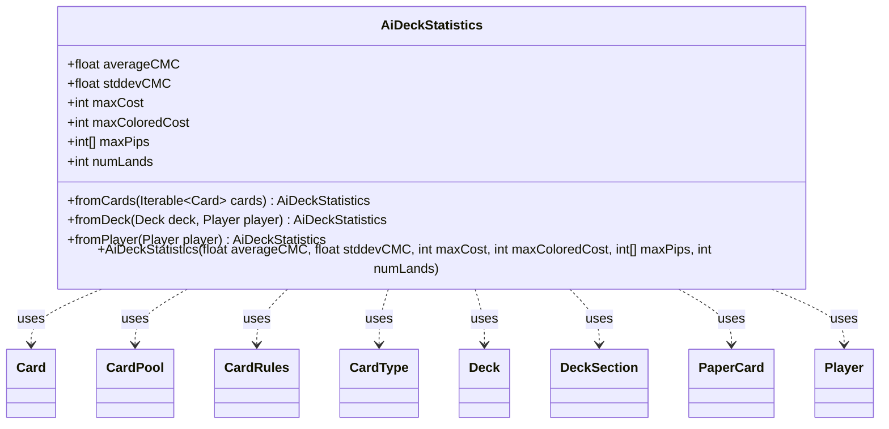

---
aliases:
  - AiDeckStatistics
tags:
  - java/class
  - module/forge-ai
  - pkg/forge/ai
fqn: forge.ai.AiDeckStatistics
package: forge.ai
module: forge-ai
kind: Class
---

# AiDeckStatistics

**Package:** `forge.ai`   **Module:** `forge-ai`   **Kind:** Class



## Relationships
**Uses:**
- [[forge.card.CardRules|CardRules]]
- [[forge.card.CardType|CardType]]
- [[forge.deck.CardPool|CardPool]]
- [[forge.deck.Deck|Deck]]
- [[forge.deck.DeckSection|DeckSection]]
- [[forge.game.card.Card|Card]]
- [[forge.game.player.Player|Player]]
- [[forge.item.PaperCard|PaperCard]]


## Design Description

`AiDeckStatistics` is a small, immutable value object that summarizes the mana profile of an AI player's deck—average converted mana cost, standard deviation, maximum total and colored costs, peak colored-pip requirements per color (in WUBRGC order, from `ManaCost.getColorShardCounts()`), and land count. It exposes public fields and a single all-args constructor, holding no behavior of its own; it serves as a compact input for AI deck-building and casting heuristics.

Construction is delegated to three layered static factories. `fromCards` performs the core aggregation over an `Iterable<Card>`, consulting each card's `CardRules` and `CardType` to separate lands from spells and tally costs and pips. `fromDeck` flattens a `Deck`'s Main and Commander `CardPool` sections into `Card` instances via `PaperCard`, then defers to `fromCards`. `fromPlayer` resolves a `Player`'s registered deck, falling back to scanning the player's live cards when no decklist exists (tests or atypical matches). TODO markers indicate the type is intentionally incomplete—standard-deviation and mana-source counting remain stubbed pending numerically stable implementations.

## Source
`forge-ai/src/main/java/forge/ai/AiDeckStatistics.java`

```java
package forge.ai;

import forge.card.CardRules;
import forge.card.CardType;
import forge.deck.CardPool;
import forge.deck.Deck;
import forge.deck.DeckSection;
import forge.game.card.Card;
import forge.game.player.Player;
import forge.item.PaperCard;

import java.util.ArrayList;
import java.util.List;
import java.util.Map;

public class AiDeckStatistics {

    public float averageCMC = 0;
    // TODO implement this. Use a numerically stable algorithm from
    // https://en.wikipedia.org/wiki/Algorithms_for_calculating_variance#Weighted_incremental_algorithm
    public float stddevCMC = 0;
    public int maxCost = 0;
    public int maxColoredCost = 0;

    // in WUBRGC order from ManaCost.getColorShardCounts()
    public int[] maxPips = null;
    // public int[] numSources = new int[6];
    public int numLands = 0;
    public AiDeckStatistics(float averageCMC, float stddevCMC, int maxCost, int maxColoredCost, int[] maxPips, int numLands) {
        this.averageCMC = averageCMC;
        this.stddevCMC = stddevCMC;
        this.maxCost = maxCost;
        this.maxColoredCost = maxColoredCost;
        this.maxPips = maxPips;
        this.numLands = numLands;
    }

    public static AiDeckStatistics fromCards(Iterable<Card> cards) {
        int totalCMC = 0;
        int totalCount = 0;
        int numLands = 0;
        int maxCost = 0;
        int[] maxPips = new int[6];
        int maxColoredCost = 0;
        for (Card c : cards) {
            CardRules rules = c.getRules();
            if (rules == null) {
                System.err.println(c + " CardRules is null" + (c.isToken() ? "/token" : "."));
                continue;
            }
            CardType type = rules.getType();
            if (type.isLand()) {
                numLands += 1;
            } else {
                int cost = rules.getManaCost().getCMC();
                // TODO use alternate casting costs for this, free spells will usually be cast for free
                maxCost = Math.max(maxCost, cost);
                totalCMC += cost;
                totalCount++;
                int[] pips = rules.getManaCost().getColorShardCounts();
                int colored_pips = 0;
                for (int i = 0; i < pips.length; i++) {
                    maxPips[i] = Math.max(maxPips[i], pips[i]);
                    if (i < 5) {
                        colored_pips += pips[i];
                    }
                }
                maxColoredCost = Math.max(maxColoredCost, colored_pips);
            }

            // TODO implement the number of mana sources
            // find the sources
            // What about non-mana-ability mana sources?
            // fetchlands, ramp spells, etc
        }

        return new AiDeckStatistics(totalCount == 0 ? 0 : totalCMC / (float)totalCount,
                0, // TODO use https://en.wikipedia.org/wiki/Algorithms_for_calculating_variance
                maxCost,
                maxColoredCost,
                maxPips,
                numLands
                );
    }

    public static AiDeckStatistics fromDeck(Deck deck, Player player) {
        List<Card> cardlist = new ArrayList<>();
        for (final Map.Entry<DeckSection, CardPool> deckEntry : deck) {
            switch (deckEntry.getKey()) {
                case Main:
                case Commander:
                    for (final Map.Entry<PaperCard, Integer> poolEntry : deckEntry.getValue()) {
                        Card card = Card.fromPaperCard(poolEntry.getKey(), player);
                        cardlist.add(card);
                    }
                    break;
                default:
                    break; //ignore other sections
            }
        }

        return fromCards(cardlist);
    }

    public static AiDeckStatistics fromPlayer(Player player) {
        Deck deck = player.getRegisteredPlayer().getDeck();
        if (deck.isEmpty()) {
            // we're in a test or some weird match, search through the hand and library and build the decklist
            List<Card> cardlist = new ArrayList<>();
            for (Card c : player.getAllCards()) {
                if (c.getPaperCard() == null) {
                    continue;
                }
                cardlist.add(c);
            }

            return fromCards(cardlist);
        }

        return fromDeck(deck, player);
    }

}
```

## Python
`forge/ai/AiDeckStatistics.py`

```python
from forge.card.CardRules import CardRules
from forge.card.CardType import CardType
from forge.deck.CardPool import CardPool
from forge.deck.Deck import Deck
from forge.deck.DeckSection import DeckSection
from forge.game.card.Card import Card
from forge.game.player.Player import Player
from forge.item.PaperCard import PaperCard

import sys


class AiDeckStatistics:

    def __init__(self, averageCMC: float, stddevCMC: float, maxCost: int, maxColoredCost: int, maxPips: list[int], numLands: int):
        self.averageCMC = averageCMC
        # TODO implement this. Use a numerically stable algorithm from
        # https://en.wikipedia.org/wiki/Algorithms_for_calculating_variance#Weighted_incremental_algorithm
        self.stddevCMC = stddevCMC
        self.maxCost = maxCost
        self.maxColoredCost = maxColoredCost
        # in WUBRGC order from ManaCost.getColorShardCounts()
        self.maxPips = maxPips
        # self.numSources = [0] * 6
        self.numLands = numLands

    @staticmethod
    def fromCards(cards) -> "AiDeckStatistics":
        totalCMC = 0
        totalCount = 0
        numLands = 0
        maxCost = 0
        maxPips = [0] * 6
        maxColoredCost = 0
        for c in cards:
            rules = c.getRules()
            if rules is None:
                print(str(c) + " CardRules is null" + ("/token" if c.isToken() else "."), file=sys.stderr)
                continue
            type = rules.getType()
            if type.isLand():
                numLands += 1
            else:
                cost = rules.getManaCost().getCMC()
                # TODO use alternate casting costs for this, free spells will usually be cast for free
                maxCost = max(maxCost, cost)
                totalCMC += cost
                totalCount += 1
                pips = rules.getManaCost().getColorShardCounts()
                colored_pips = 0
                for i in range(len(pips)):
                    maxPips[i] = max(maxPips[i], pips[i])
                    if i < 5:
                        colored_pips += pips[i]
                maxColoredCost = max(maxColoredCost, colored_pips)

            # TODO implement the number of mana sources
            # find the sources
            # What about non-mana-ability mana sources?
            # fetchlands, ramp spells, etc

        return AiDeckStatistics(0 if totalCount == 0 else totalCMC / float(totalCount),
                                0,  # TODO use https://en.wikipedia.org/wiki/Algorithms_for_calculating_variance
                                maxCost,
                                maxColoredCost,
                                maxPips,
                                numLands
                                )

    @staticmethod
    def fromDeck(deck: Deck, player: Player) -> "AiDeckStatistics":
        cardlist: list[Card] = []
        for deckEntry in deck:
            key = deckEntry.getKey()
            if key == DeckSection.Main or key == DeckSection.Commander:
                for poolEntry in deckEntry.getValue():
                    card = Card.fromPaperCard(poolEntry.getKey(), player)
                    cardlist.append(card)
            else:
                pass  # ignore other sections

        return AiDeckStatistics.fromCards(cardlist)

    @staticmethod
    def fromPlayer(player: Player) -> "AiDeckStatistics":
        deck = player.getRegisteredPlayer().getDeck()
        if deck.isEmpty():
            # we're in a test or some weird match, search through the hand and library and build the decklist
            cardlist: list[Card] = []
            for c in player.getAllCards():
                if c.getPaperCard() is None:
                    continue
                cardlist.append(c)

            return AiDeckStatistics.fromCards(cardlist)

        return AiDeckStatistics.fromDeck(deck, player)
```
