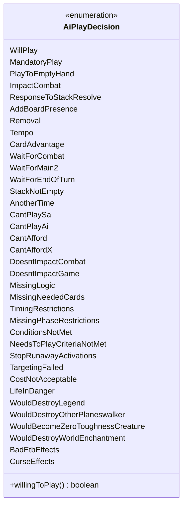

---
aliases:
  - AiPlayDecision
tags:
  - java/enum
  - module/forge-ai
  - pkg/forge/ai
fqn: forge.ai.AiPlayDecision
package: forge.ai
module: forge-ai
kind: Enum
---

# AiPlayDecision

**Package:** `forge.ai` &nbsp; **Module:** `forge-ai` &nbsp; **Kind:** Enum




## Design Description

`AiPlayDecision` is an enumeration in the `forge-ai` module that captures the AI engine's verdict on whether, when, and why a spell or ability should be played. Its constants are organized into three intent groups by inline comments: reasons to play immediately (`WillPlay`, `Removal`, `Tempo`, `CardAdvantage`), reasons to defer (`WaitForMain2`, `StackNotEmpty`, `AnotherTime`), and reasons to decline (`CantAfford`, `TargetingFailed`, `LifeInDanger`). This gives the decision logic a single, self-documenting vocabulary for both choosing and explaining actions.

As a pure enum it holds no state and collaborates with no other types; its sole behavior is the `willingToPlay()` predicate, which uses a `switch` expression to map the affirmative constants to `true` and all others to `false`. The design intent is to centralize the "should act" test in one place while preserving the finer-grained reason, so callers branch on a typed result rather than scattered booleans yet retain the specific rationale for logging and diagnostics.

## Source
`forge-ai/src/main/java/forge/ai/AiPlayDecision.java`

```java
package forge.ai;

public enum AiPlayDecision {
    // Play decision reasons
    WillPlay,
    MandatoryPlay,
    PlayToEmptyHand,
    ImpactCombat,
    ResponseToStackResolve,
    AddBoardPresence,
    Removal,
    Tempo,
    CardAdvantage,

    // Play later decisions
    WaitForCombat,
    WaitForMain2,
    WaitForEndOfTurn,
    StackNotEmpty,
    AnotherTime,

    // Don't play decision reasons
    CantPlaySa,
    CantPlayAi,
    CantAfford,
    CantAffordX,
    DoesntImpactCombat,
    DoesntImpactGame,
    MissingLogic,
    MissingNeededCards,
    TimingRestrictions,
    MissingPhaseRestrictions,
    ConditionsNotMet,
    NeedsToPlayCriteriaNotMet,
    StopRunawayActivations,
    TargetingFailed,
    CostNotAcceptable,
    LifeInDanger,
    WouldDestroyLegend,
    WouldDestroyOtherPlaneswalker,
    WouldBecomeZeroToughnessCreature,
    WouldDestroyWorldEnchantment,
    BadEtbEffects,
    CurseEffects;

    public boolean willingToPlay() {
        return switch (this) {
            case WillPlay, MandatoryPlay, PlayToEmptyHand, AddBoardPresence, ImpactCombat, ResponseToStackResolve, Removal, Tempo, CardAdvantage -> true;
            default -> false;
        };
    }
}
```
