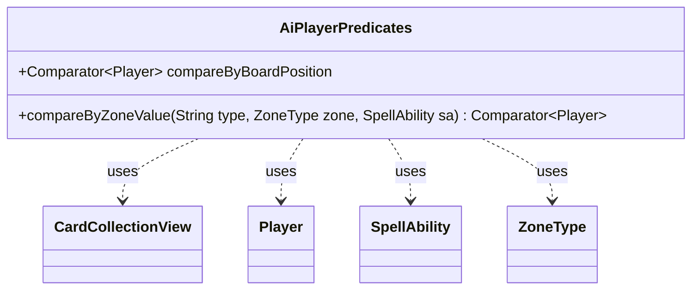

---
aliases:
  - AiPlayerPredicates
tags:
  - java/class
  - module/forge-ai
  - pkg/forge/ai
fqn: forge.ai.AiPlayerPredicates
package: forge.ai
module: forge-ai
kind: Class
---

# AiPlayerPredicates

**Package:** `forge.ai` &nbsp; **Module:** `forge-ai` &nbsp; **Kind:** Class



## Relationships
**Uses:**
- [[forge.game.card.CardCollectionView|CardCollectionView]]
- [[forge.game.player.Player|Player]]
- [[forge.game.spellability.SpellAbility|SpellAbility]]
- [[forge.game.zone.ZoneType|ZoneType]]


## Design Description

`AiPlayerPredicates` is a final utility class in the forge-ai module that produces reusable `Comparator<Player>` instances for ranking opposing players during AI decision-making. It has no state or instance API; it simply centralizes the heuristics the AI uses to decide which player to target or prioritize, exposing each as a stateless comparator over the live game model.

The two comparators collaborate with the core game types they rank. `compareByZoneValue` resolves a type filter through `AbilityUtils` and the originating `SpellAbility`, applies it to each player's `CardCollectionView` in the given `ZoneType`, then scores the results—using `ComputerUtilCard.evaluateCreatureList` when both sides are entirely creatures and `evaluatePermanentList` otherwise. The static `compareByBoardPosition` field ranks players by overall board strength via `ComputerUtil.evaluateBoardPosition`. By delegating valuation to `ComputerUtilCard`/`ComputerUtil` and returning standard `Comparator<Player>` values, the class plugs directly into Java sorting and selection pipelines and keeps player-ranking logic reusable across AI call sites.

## Source
`forge-ai/src/main/java/forge/ai/AiPlayerPredicates.java`

```java
package forge.ai;

import java.util.Comparator;

import forge.game.ability.AbilityUtils;
import forge.game.card.CardCollectionView;
import forge.game.card.CardLists;
import forge.game.player.Player;
import forge.game.spellability.SpellAbility;
import forge.game.zone.ZoneType;

public final class AiPlayerPredicates {

    public static Comparator<Player> compareByZoneValue(final String type, final ZoneType zone, final SpellAbility sa) {
        return (arg0, arg1) -> {
            CardCollectionView list0 = AbilityUtils.filterListByType(arg0.getCardsIn(zone), type, sa);
            CardCollectionView list1 = AbilityUtils.filterListByType(arg1.getCardsIn(zone), type, sa);

            int v0, v1;

            if ((CardLists.getNotType(list0, "Creature").isEmpty())
                    && (CardLists.getNotType(list1, "Creature").isEmpty())) {
                v0 = ComputerUtilCard.evaluateCreatureList(list0);
                v1 = ComputerUtilCard.evaluateCreatureList(list1);
            } // otherwise evaluate both lists by CMC and pass only if human
              // permanents are less valuable
            else {
                v0 = ComputerUtilCard.evaluatePermanentList(list0);
                v1 = ComputerUtilCard.evaluatePermanentList(list1);
            }
            return Integer.compare(v0, v1);
        };
    }

    public static Comparator<Player> compareByBoardPosition = Comparator.comparing(p -> ComputerUtil.evaluateBoardPosition(null, p));
}
```
