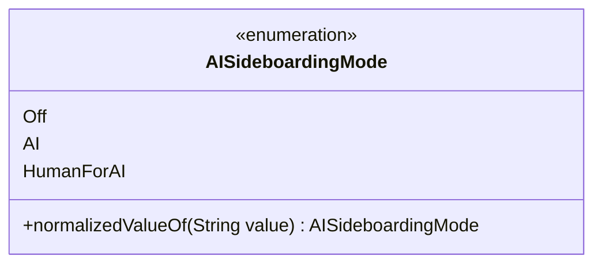

---
aliases:
  - AISideboardingMode
tags:
  - java/enum
  - module/forge-ai
  - pkg/forge/ai
fqn: forge.ai.AiProfileUtil.AISideboardingMode
package: forge.ai
module: forge-ai
kind: Enum
---

# AISideboardingMode

**Package:** `forge.ai`   **Module:** `forge-ai`   **Kind:** Enum



## Design Description

The AISideboardingMode enum, nested within AiProfileUtil in the forge-ai module, enumerates the three policies governing how sideboarding decisions are handled between games of a match: Off (no sideboarding), AI (the engine sideboards autonomously), and HumanForAI (a human makes sideboarding choices on the AI's behalf). Its sole behavior is normalizedValueOf, a parsing helper that strips spaces from an incoming string before delegating to the standard valueOf, allowing display-friendly or whitespace-laden configuration values to map cleanly onto enum constants. As a static nested type within the AiProfileUtil utility class, it serves as a small, self-contained vocabulary that other AI-profile and configuration code references when resolving the sideboarding strategy for a given profile, keeping the lenient string-to-constant conversion encapsulated alongside the constants themselves.

## Source
`forge-ai/src/main/java/forge/ai/AiProfileUtil.java` — declaration excerpt

```java
    public enum AISideboardingMode {
        Off,
        AI,
        HumanForAI;

        public static AISideboardingMode normalizedValueOf(String value) {
            return valueOf(value.replace(" ", ""));
        }
    }
```
