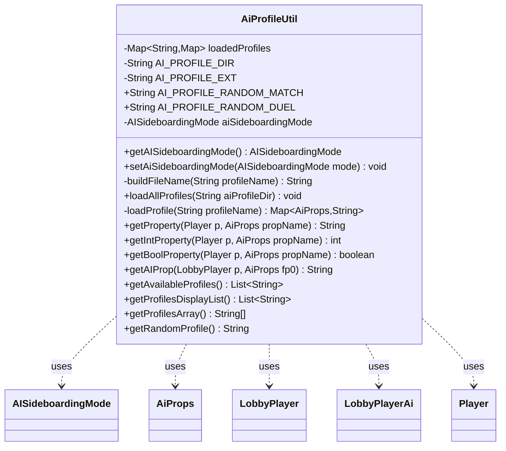

---
aliases:
  - AiProfileUtil
tags:
  - java/class
  - module/forge-ai
  - pkg/forge/ai
fqn: forge.ai.AiProfileUtil
package: forge.ai
module: forge-ai
kind: Class
---

# AiProfileUtil

**Package:** `forge.ai`   **Module:** `forge-ai`   **Kind:** Class



## Relationships
**Uses:**
- [[forge.LobbyPlayer|LobbyPlayer]]
- [[forge.ai.AiProfileUtil.AISideboardingMode|AISideboardingMode]]
- [[forge.ai.AiProps|AiProps]]
- [[forge.ai.LobbyPlayerAi|LobbyPlayerAi]]
- [[forge.game.player.Player|Player]]


## Design Description

AiProfileUtil is a stateless, static utility that manages the AI's "personality" profiles, which tune how the computer opponent makes decisions. It loads `.ai` property files from a configurable directory into an in-memory cache (`loadedProfiles`), parsing each `key=value` line into a map keyed by the `AiProps` enum. Its primary service is typed property lookup—`getProperty`, `getIntProperty`, `getBoolProperty`—resolving a value for a given `Player` by routing through its `LobbyPlayer`, falling back to each property's hard-coded default when a profile is missing or silent.

It collaborates with `LobbyPlayerAi` to read the active profile name (returning empty for human players), and exposes profile enumeration for UI selection, including special "Random" pseudo-profiles and a `getRandomProfile` picker. The design favors safe degradation: every lookup guarantees a usable default rather than failing. It also holds the global `AISideboardingMode` toggle, a loosely related piece of AI configuration co-located here for convenience.

## Source
`forge-ai/src/main/java/forge/ai/AiProfileUtil.java`

```java
/*
 * Forge: Play Magic: the Gathering.
 * Copyright (C) 2013  Forge Team
 *
 * This program is free software: you can redistribute it and/or modify
 * it under the terms of the GNU General Public License as published by
 * the Free Software Foundation, either version 3 of the License, or
 * (at your option) any later version.
 * 
 * This program is distributed in the hope that it will be useful,
 * but WITHOUT ANY WARRANTY; without even the implied warranty of
 * MERCHANTABILITY or FITNESS FOR A PARTICULAR PURPOSE.  See the
 * GNU General Public License for more details.
 * 
 * You should have received a copy of the GNU General Public License
 * along with this program.  If not, see <http://www.gnu.org/licenses/>.
 */
package forge.ai;

import forge.LobbyPlayer;
import forge.game.player.Player;
import forge.util.Aggregates;
import forge.util.FileUtil;
import forge.util.TextUtil;
import org.apache.commons.lang3.ArrayUtils;

import java.io.File;
import java.util.ArrayList;
import java.util.HashMap;
import java.util.List;
import java.util.Map;

/**
 * Holds default AI personality profile values in an enum.
 * Loads profile from the given text file when setProfile is called.
 * If a requested value is not loaded from a profile, default is returned.
 * 
 * @author Forge
 * @version $Id: AIProfile.java 20169 2013-03-08 08:24:17Z Agetian $
 */
public class AiProfileUtil {
    private static Map<String, Map<AiProps, String>> loadedProfiles = new HashMap<>();

    private static String AI_PROFILE_DIR;
    private static final String AI_PROFILE_EXT = ".ai";

    public static final String AI_PROFILE_RANDOM_MATCH = "Random (Every Match)";
    public static final String AI_PROFILE_RANDOM_DUEL = "Random (Every Game)";

    public enum AISideboardingMode {
        Off,
        AI,
        HumanForAI;

        public static AISideboardingMode normalizedValueOf(String value) {
            return valueOf(value.replace(" ", ""));
        }
    }

    private static AISideboardingMode aiSideboardingMode = AISideboardingMode.Off;

    public static AISideboardingMode getAISideboardingMode() {
        return aiSideboardingMode;
    }

    public static void setAiSideboardingMode(AISideboardingMode mode) {
        aiSideboardingMode = mode;
    }

    /** Builds an AI profile file name with full relative 
     * path based on the profile name. 
     * @param profileName the name of the profile.
     * @return the full relative path and file name for the given profile.
     */
    private static String buildFileName(final String profileName) {
        return TextUtil.concatNoSpace(AI_PROFILE_DIR, "/", profileName, AI_PROFILE_EXT);
    }
    
    /**
     * Load all profiles
     */
    public static final void loadAllProfiles(String aiProfileDir) {
        AI_PROFILE_DIR = aiProfileDir;

        loadedProfiles.clear();
        List<String> availableProfiles = getAvailableProfiles();
        for (String profile : availableProfiles) {
            loadedProfiles.put(profile, loadProfile(profile));
        }
    }
    
    /**
     * Load a single profile.
     * @param profileName a profile to load.
     */
    private static Map<AiProps, String> loadProfile(final String profileName) {
        Map<AiProps, String> profileMap = new HashMap<>();

        List<String> lines = FileUtil.readFile(buildFileName(profileName));
        for (String line : lines) {
            if (line.startsWith("#") || (line.length() == 0)) {
                continue;
            }

            final String[] split = line.split("=");

            if (split.length == 2) {
                profileMap.put(AiProps.valueOf(split[0]), split[1]);
            } else if (split.length == 1 && line.endsWith("=")) {
                profileMap.put(AiProps.valueOf(split[0]), "");
            }
        }

        return profileMap;
    }

    public static String getProperty(final Player p, final AiProps propName) {
        String prop = AiProfileUtil.getAIProp(p.getLobbyPlayer(), propName);

        if (prop == null || prop.isEmpty()) {
            // TODO if p is human try to predict some values from previous plays or something
            return propName.getDefault();
        }

        return prop;
    }
    public static int getIntProperty(final Player p, final AiProps propName) {
        return Integer.parseInt(getProperty(p, propName));
    }
    public static boolean getBoolProperty(final Player p, final AiProps propName) {
        return Boolean.parseBoolean(getProperty(p, propName));
    }

    /**
     * Returns an AI property value for the current profile.
     * 
     * @param fp0 an AI property.
     * @return String
     */
    public static String getAIProp(final LobbyPlayer p, final AiProps fp0) {
        String val = null;
        if (!(p instanceof LobbyPlayerAi))
            return "";
        String profile = ((LobbyPlayerAi) p).getAiProfile();
       
        if (loadedProfiles.get(profile) != null) {
            val = loadedProfiles.get(profile).get(fp0);
        }
        if (val == null) { val = fp0.getDefault(); }

        return val;
    }

    /**
     * Returns an array of strings containing all available profiles.
     * @return ArrayList<String> - an array of strings containing all 
     * available profiles.
     */
    public static List<String> getAvailableProfiles() {
        final List<String> availableProfiles = new ArrayList<>();

        final File dir = new File(AI_PROFILE_DIR);
        final String[] children = dir.list();
        if (children == null) {
            System.err.println("AIProfile > can't find AI profile directory!");
        } else {
            for (String child : children) {
                if (child.endsWith(AI_PROFILE_EXT)) {
                    availableProfiles.add(child.substring(0, child.length() - AI_PROFILE_EXT.length()));
                }
            }
        }

        return availableProfiles;
    }
    
    /**
     * Returns an array of strings containing all available profiles including 
     * the special "Random" profiles.
     * @return ArrayList<String> - an array list of strings containing all 
     * available profiles including special random profile tags.
     */
    public static List<String> getProfilesDisplayList() {
        final List<String> availableProfiles = new ArrayList<>();
        availableProfiles.add(AI_PROFILE_RANDOM_MATCH);
        availableProfiles.add(AI_PROFILE_RANDOM_DUEL);
        availableProfiles.addAll(getAvailableProfiles());

        return availableProfiles;
    }
    
    public static String[] getProfilesArray() {
        return getProfilesDisplayList().toArray(ArrayUtils.EMPTY_STRING_ARRAY);
    }

    /**
     * Returns a random personality from the currently available ones.
     * @return String - a string containing a random profile from all the
     * currently available ones.
     */
    public static String getRandomProfile() {
        return Aggregates.random(getAvailableProfiles());
    }

    /**
     * Simple class test facility for AiProfileUtil.
     *-/
    public static void selfTest() {
        final LobbyPlayer activePlayer = Singletons.getControl().getPlayer().getLobbyPlayer();
        System.out.println(String.format("Current profile = %s", activePlayer.getAiProfile()));
        ArrayList<String> profiles = getAvailableProfiles();
        System.out.println(String.format("Available profiles: %s", profiles));
        if (profiles.size() > 0) {
            System.out.println(String.format("Loading all profiles..."));
            loadAllProfiles();
            System.out.println(String.format("Setting profile %s...", profiles.get(0)));
            activePlayer.setAiProfile(profiles.get(0));
            for (AiProps property : AiProps.values()) {
                System.out.println(String.format("%s = %s", property, getAIProp(activePlayer, property)));
            }
            String randomProfile = getRandomProfile();
            System.out.println(String.format("Loading random profile %s...", randomProfile));
            activePlayer.setAiProfile(randomProfile);
            for (AiProps property : AiProps.values()) {
                System.out.println(String.format("%s = %s", property, getAIProp(activePlayer, property)));
            }
        }
    }
    */
}
```

## Python
`forge/ai/AiProfileUtil.py`

```python
from forge.LobbyPlayer import LobbyPlayer
from forge.ai.AiProps import AiProps
from forge.ai.LobbyPlayerAi import LobbyPlayerAi
from forge.game.player.Player import Player
from forge.util.Aggregates import Aggregates
from forge.util.FileUtil import FileUtil
from forge.util.TextUtil import TextUtil
from org.apache.commons.lang3.ArrayUtils import ArrayUtils

import os
from enum import Enum


class AiProfileUtil:
    """
    Holds default AI personality profile values in an enum.
    Loads profile from the given text file when setProfile is called.
    If a requested value is not loaded from a profile, default is returned.

    @author Forge
    @version $Id: AIProfile.java 20169 2013-03-08 08:24:17Z Agetian $
    """
    loadedProfiles: dict[str, dict["AiProps", str]] = {}

    AI_PROFILE_DIR = None
    AI_PROFILE_EXT = ".ai"

    AI_PROFILE_RANDOM_MATCH = "Random (Every Match)"
    AI_PROFILE_RANDOM_DUEL = "Random (Every Game)"

    class AISideboardingMode(Enum):
        Off = "Off"
        AI = "AI"
        HumanForAI = "HumanForAI"

        @staticmethod
        def normalizedValueOf(value: str) -> "AiProfileUtil.AISideboardingMode":
            return AiProfileUtil.AISideboardingMode[value.replace(" ", "")]

    aiSideboardingMode = AISideboardingMode.Off

    @staticmethod
    def getAISideboardingMode() -> "AiProfileUtil.AISideboardingMode":
        return AiProfileUtil.aiSideboardingMode

    @staticmethod
    def setAiSideboardingMode(mode: "AiProfileUtil.AISideboardingMode") -> None:
        AiProfileUtil.aiSideboardingMode = mode

    @staticmethod
    def buildFileName(profileName: str) -> str:
        """
        Builds an AI profile file name with full relative
        path based on the profile name.
        @param profileName the name of the profile.
        @return the full relative path and file name for the given profile.
        """
        return TextUtil.concatNoSpace(AiProfileUtil.AI_PROFILE_DIR, "/", profileName, AiProfileUtil.AI_PROFILE_EXT)

    @staticmethod
    def loadAllProfiles(aiProfileDir: str) -> None:
        """
        Load all profiles
        """
        AiProfileUtil.AI_PROFILE_DIR = aiProfileDir

        AiProfileUtil.loadedProfiles.clear()
        availableProfiles = AiProfileUtil.getAvailableProfiles()
        for profile in availableProfiles:
            AiProfileUtil.loadedProfiles[profile] = AiProfileUtil.loadProfile(profile)

    @staticmethod
    def loadProfile(profileName: str) -> dict["AiProps", str]:
        """
        Load a single profile.
        @param profileName a profile to load.
        """
        profileMap: dict[AiProps, str] = {}

        lines = FileUtil.readFile(AiProfileUtil.buildFileName(profileName))
        for line in lines:
            if line.startswith("#") or (len(line) == 0):
                continue

            split = line.split("=")

            if len(split) == 2:
                profileMap[AiProps.valueOf(split[0])] = split[1]
            elif len(split) == 1 and line.endswith("="):
                profileMap[AiProps.valueOf(split[0])] = ""

        return profileMap

    @staticmethod
    def getProperty(p: Player, propName: "AiProps") -> str:
        prop = AiProfileUtil.getAIProp(p.getLobbyPlayer(), propName)

        if prop is None or len(prop) == 0:
            # TODO if p is human try to predict some values from previous plays or something
            return propName.getDefault()

        return prop

    @staticmethod
    def getIntProperty(p: Player, propName: "AiProps") -> int:
        return int(AiProfileUtil.getProperty(p, propName))

    @staticmethod
    def getBoolProperty(p: Player, propName: "AiProps") -> bool:
        return AiProfileUtil.getProperty(p, propName).lower() == "true"

    @staticmethod
    def getAIProp(p: LobbyPlayer, fp0: "AiProps") -> str:
        """
        Returns an AI property value for the current profile.

        @param fp0 an AI property.
        @return String
        """
        val = None
        if not isinstance(p, LobbyPlayerAi):
            return ""
        profile = p.getAiProfile()

        if AiProfileUtil.loadedProfiles.get(profile) is not None:
            val = AiProfileUtil.loadedProfiles.get(profile).get(fp0)
        if val is None:
            val = fp0.getDefault()

        return val

    @staticmethod
    def getAvailableProfiles() -> list[str]:
        """
        Returns an array of strings containing all available profiles.
        @return ArrayList<String> - an array of strings containing all
        available profiles.
        """
        availableProfiles: list[str] = []

        try:
            children = os.listdir(AiProfileUtil.AI_PROFILE_DIR)
        except (FileNotFoundError, NotADirectoryError, TypeError):
            children = None

        if children is None:
            import sys
            print("AIProfile > can't find AI profile directory!", file=sys.stderr)
        else:
            for child in children:
                if child.endswith(AiProfileUtil.AI_PROFILE_EXT):
                    availableProfiles.append(child[0:len(child) - len(AiProfileUtil.AI_PROFILE_EXT)])

        return availableProfiles

    @staticmethod
    def getProfilesDisplayList() -> list[str]:
        """
        Returns an array of strings containing all available profiles including
        the special "Random" profiles.
        @return ArrayList<String> - an array list of strings containing all
        available profiles including special random profile tags.
        """
        availableProfiles: list[str] = []
        availableProfiles.append(AiProfileUtil.AI_PROFILE_RANDOM_MATCH)
        availableProfiles.append(AiProfileUtil.AI_PROFILE_RANDOM_DUEL)
        availableProfiles.extend(AiProfileUtil.getAvailableProfiles())

        return availableProfiles

    @staticmethod
    def getProfilesArray() -> list[str]:
        return AiProfileUtil.getProfilesDisplayList()

    @staticmethod
    def getRandomProfile() -> str:
        """
        Returns a random personality from the currently available ones.
        @return String - a string containing a random profile from all the
        currently available ones.
        """
        return Aggregates.random(AiProfileUtil.getAvailableProfiles())
```
