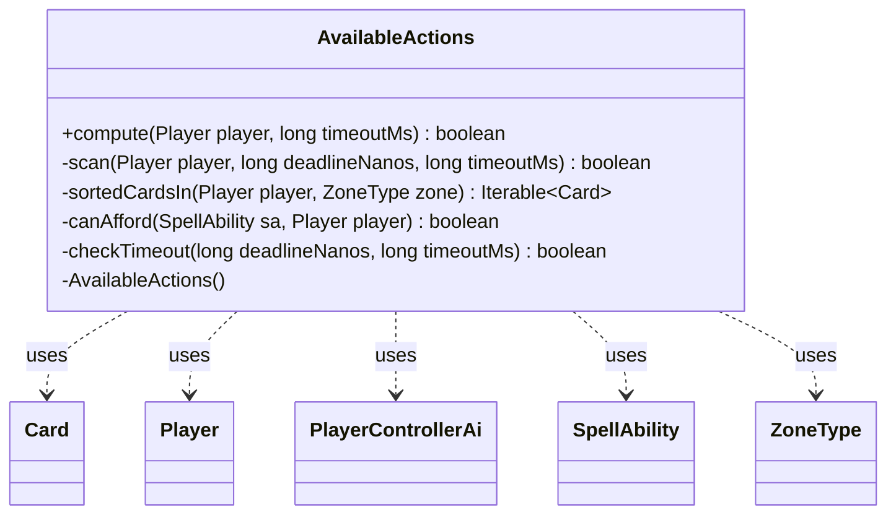

---
aliases:
  - AvailableActions
tags:
  - java/class
  - module/forge-ai
  - pkg/forge/ai
fqn: forge.ai.AvailableActions
package: forge.ai
module: forge-ai
kind: Class
---

# AvailableActions

**Package:** `forge.ai`   **Module:** `forge-ai`   **Kind:** Class



## Relationships
**Uses:**
- [[forge.ai.PlayerControllerAi|PlayerControllerAi]]
- [[forge.game.card.Card|Card]]
- [[forge.game.player.Player|Player]]
- [[forge.game.spellability.SpellAbility|SpellAbility]]
- [[forge.game.zone.ZoneType|ZoneType]]


## Design Description

`AvailableActions` is a stateless utility (private constructor, all-static API) that answers one heuristic question for Forge's AI layer: does a player have any playable action during the current priority window? Its public `compute` entry point installs a temporary `PlayerControllerAi` via `runWithController` so cost-adjustment dispatches auto-resolve instead of prompting a human, then delegates to a bounded predictive sweep that returns as soon as one affordable, fully targetable spell, land, or activated ability is found.

The private `scan` walks the player's hand, battlefield, and flashback zones, querying `Card` for candidate `SpellAbility` instances and leaning on `ComputerUtilMana`/`ComputerUtilAbility` to confirm affordability and targetability. Notable design intent: hand and flashback cards are sorted cheapest-first (`CmcComparator`) so easy-to-validate plays exit early while battlefield activations stay unsorted; every loop is guarded by a nanosecond deadline; and on timeout the method deliberately returns `true` — a conservative false-positive that prompts the player rather than silently skipping a legitimate turn.

## Source
`forge-ai/src/main/java/forge/ai/AvailableActions.java`

```java
package forge.ai;

import forge.game.card.Card;
import forge.game.card.CardLists;
import forge.game.player.Player;
import forge.game.spellability.SpellAbility;
import forge.game.zone.ZoneType;
import org.tinylog.Logger;

import java.util.stream.Collectors;

// Heuristic: does the player have any playable action this priority window?
// Bounded by timeoutMs; returns true on expiry (false-positive — player is prompted).
public final class AvailableActions {

    private AvailableActions() {}

    public static boolean compute(Player player, long timeoutMs) {
        long deadlineNanos = System.nanoTime() + timeoutMs * 1_000_000L;

        // Run the predictive sweep under an AI controller so cost-adjustment chooseX dispatches don't prompt (mirrors InputPayMana auto-pay).
        boolean[] result = {false};
        player.runWithController(
                () -> result[0] = scan(player, deadlineNanos, timeoutMs),
                new PlayerControllerAi(player.getGame(), player, player.getOriginalLobbyPlayer()));
        return result[0];
    }

    private static boolean scan(Player player, long deadlineNanos, long timeoutMs) {
        for (Card card : sortedCardsIn(player, ZoneType.Hand)) {
            for (SpellAbility sa : card.getAllPossibleAbilities(player, true)) {
                if (checkTimeout(deadlineNanos, timeoutMs)) return true;
                if (sa.isSpell()) {
                    if (canAfford(sa, player) && ComputerUtilAbility.isFullyTargetable(sa)) {
                        return true;
                    }
                } else if (sa.isLandAbility()) {
                    return true;
                }
            }
        }

        // Not sorted: activation costs are per-ability, not the permanent's CMC.
        for (Card card : player.getCardsIn(ZoneType.Battlefield)) {
            for (SpellAbility sa : card.getAllPossibleAbilities(player, true)) {
                if (checkTimeout(deadlineNanos, timeoutMs)) return true;
                if (!sa.isManaAbility() && canAfford(sa, player) && ComputerUtilAbility.isFullyTargetable(sa)) {
                    return true;
                }
            }
        }

        for (Card card : sortedCardsIn(player, ZoneType.Flashback)) {
            for (SpellAbility sa : card.getAllPossibleAbilities(player, true)) {
                if (checkTimeout(deadlineNanos, timeoutMs)) return true;
                if (!sa.isManaAbility() && canAfford(sa, player) && ComputerUtilAbility.isFullyTargetable(sa)) {
                    return true;
                }
            }
        }

        return false;
    }

    // Sort cheap cards first so cheap-to-validate matches early-exit
    private static Iterable<Card> sortedCardsIn(Player player, ZoneType zone) {
        return player.getCardsIn(zone).stream().sorted(CardLists.CmcComparator).collect(Collectors.toList());
    }

    private static boolean canAfford(SpellAbility sa, Player player) {
        if (sa.getPayCosts() == null || !sa.getPayCosts().hasManaCost()) {
            return true;
        }
        return ComputerUtilMana.canPayManaCost(sa, player, 0, false);
    }

    private static boolean checkTimeout(long deadlineNanos, long timeoutMs) {
        if (System.nanoTime() < deadlineNanos) {
            return false;
        }
        Logger.warn("AvailableActions: heuristic timed out after {}ms; returning true.", timeoutMs);
        return true;
    }
}
```

## Python
`forge/ai/AvailableActions.py`

```python
from forge.game.card.Card import Card
from forge.game.card.CardLists import CardLists
from forge.game.player.Player import Player
from forge.game.spellability.SpellAbility import SpellAbility
from forge.game.zone.ZoneType import ZoneType
from forge.ai.PlayerControllerAi import PlayerControllerAi
from forge.ai.ComputerUtilAbility import ComputerUtilAbility
from forge.ai.ComputerUtilMana import ComputerUtilMana

import time
import logging

Logger = logging.getLogger(__name__)


# Heuristic: does the player have any playable action this priority window?
# Bounded by timeoutMs; returns true on expiry (false-positive ΓÇö player is prompted).
class AvailableActions:

    def __init__(self):
        pass

    @staticmethod
    def compute(player: Player, timeoutMs: int) -> bool:
        deadlineNanos = time.perf_counter_ns() + timeoutMs * 1_000_000

        # Run the predictive sweep under an AI controller so cost-adjustment chooseX dispatches don't prompt (mirrors InputPayMana auto-pay).
        result = [False]
        player.runWithController(
            lambda: result.__setitem__(0, AvailableActions.scan(player, deadlineNanos, timeoutMs)),
            PlayerControllerAi(player.getGame(), player, player.getOriginalLobbyPlayer()))
        return result[0]

    @staticmethod
    def scan(player: Player, deadlineNanos: int, timeoutMs: int) -> bool:
        for card in AvailableActions.sortedCardsIn(player, ZoneType.Hand):
            for sa in card.getAllPossibleAbilities(player, True):
                if AvailableActions.checkTimeout(deadlineNanos, timeoutMs):
                    return True
                if sa.isSpell():
                    if AvailableActions.canAfford(sa, player) and ComputerUtilAbility.isFullyTargetable(sa):
                        return True
                elif sa.isLandAbility():
                    return True

        # Not sorted: activation costs are per-ability, not the permanent's CMC.
        for card in player.getCardsIn(ZoneType.Battlefield):
            for sa in card.getAllPossibleAbilities(player, True):
                if AvailableActions.checkTimeout(deadlineNanos, timeoutMs):
                    return True
                if not sa.isManaAbility() and AvailableActions.canAfford(sa, player) and ComputerUtilAbility.isFullyTargetable(sa):
                    return True

        for card in AvailableActions.sortedCardsIn(player, ZoneType.Flashback):
            for sa in card.getAllPossibleAbilities(player, True):
                if AvailableActions.checkTimeout(deadlineNanos, timeoutMs):
                    return True
                if not sa.isManaAbility() and AvailableActions.canAfford(sa, player) and ComputerUtilAbility.isFullyTargetable(sa):
                    return True

        return False

    # Sort cheap cards first so cheap-to-validate matches early-exit
    @staticmethod
    def sortedCardsIn(player: Player, zone: ZoneType):
        return sorted(player.getCardsIn(zone), key=CardLists.CmcComparator)

    @staticmethod
    def canAfford(sa: SpellAbility, player: Player) -> bool:
        if sa.getPayCosts() is None or not sa.getPayCosts().hasManaCost():
            return True
        return ComputerUtilMana.canPayManaCost(sa, player, 0, False)

    @staticmethod
    def checkTimeout(deadlineNanos: int, timeoutMs: int) -> bool:
        if time.perf_counter_ns() < deadlineNanos:
            return False
        Logger.warning("AvailableActions: heuristic timed out after {}ms; returning true.".format(timeoutMs))
        return True
```
