---
aliases:
  - ComputerUtil
tags:
  - java/class
  - module/forge-ai
  - pkg/forge/ai
fqn: forge.ai.ComputerUtil
package: forge.ai
module: forge-ai
kind: Class
---

# ComputerUtil

**Package:** `forge.ai`   **Module:** `forge-ai`   **Kind:** Class



```mermaid
classDiagram
    class ComputerUtil {
        +handlePlayingSpellAbility(Player ai, SpellAbility sa, Runnable chooseTargets) boolean
        -hasDiscardHandCost(Cost cost) boolean
        +counterSpellRestriction(Player ai, SpellAbility sa) int
        +playStack(SpellAbility sa, Player ai, Game game) boolean
        +playNoStack(Player ai, SpellAbility sa, Game game, boolean effect) boolean
        +getCardPreference(Player ai, Card activate, String pref, CardCollection typeList) Card
        +getCardPreference(Player ai, Card activate, String pref, CardCollection typeList, SpellAbility sa) Card
        +getAIPreferenceParameter(Card c, String paramName, SpellAbility sa) int
        +chooseSacrificeType(Player ai, String type, SpellAbility ability, Card target, boolean effect, int amount, CardCollectionView exclude) CardCollection
        +chooseCollectEvidence(Player ai, CostCollectEvidence cost, Card activate, int amount, SpellAbility sa, boolean effect) CardCollection
        +chooseExileFrom(Player ai, CostExile cost, Card activate, int amount, SpellAbility sa, boolean effect) CardCollection
        +chooseExileFromList(Player ai, CardCollection typeList, Card activate, int amount, SpellAbility sa, boolean effect) CardCollection
        +choosePutToLibraryFrom(Player ai, ZoneType zone, String type, Card activate, Card target, int amount, SpellAbility sa) CardCollection
        +chooseTapType(Player ai, String type, Card activate, boolean tap, int amount, CardCollectionView exclude, SpellAbility sa) CardCollection
        +chooseTapTypeAccumulatePower(Player ai, String type, SpellAbility sa, boolean tap, int amount, CardCollectionView exclude) CardCollection
        +chooseUntapType(Player ai, String type, Card activate, boolean untap, int amount, SpellAbility sa) CardCollection
        +chooseReturnType(Player ai, String type, Card activate, Card target, int amount, SpellAbility sa) CardCollection
        +choosePermanentsToSacrifice(Player ai, CardCollectionView cardlist, int amount, SpellAbility source, boolean destroy, boolean isOptional) CardCollection
        -chooseCardToSacrifice(SpellAbility source, CardCollection remaining, Player ai, boolean destroy) Card
        +canRegenerate(Player ai, Card card) boolean
        +possibleDamagePrevention(Card card) int
        +shouldCastLessThanMax(Player ai, Card source) boolean
        +isWorseThanDraw(Player ai, Card discard) boolean
        +waitForBlocking(SpellAbility sa) boolean
        +castPermanentInMain1(Player ai, SpellAbility sa) boolean
        +castSpellInMain1(Player ai, SpellAbility sa) boolean
        +preventRunAwayActivations(SpellAbility sa) boolean
        +activateForCost(SpellAbility sa, Player ai) boolean
        +hasACardGivingHaste(Player ai, boolean checkOpponentCards) boolean
        +hasAFogEffect(Player defender, Player ai, boolean checkingOther) boolean
        +possibleNonCombatDamage(Player ai, Player enemy) int
        +predictThreatenedObjects(Player ai, SpellAbility sa) List~GameObject~
        +predictThreatenedObjects(Player ai, SpellAbility sa, boolean top) List~GameObject~
        -predictThreatenedObjects(Player aiPlayer, SpellAbility saviour, SpellAbility topStack) Iterable~GameObject~
        +predictCreatureWillDieThisTurn(Player ai, Card creature, SpellAbility excludeSa) boolean
        +predictCreatureWillDieThisTurn(Player ai, Card creature, SpellAbility excludeSa, boolean nonCombatOnly) boolean
        +filterCreaturesThatWillDieThisTurn(Player ai, CardCollection list, SpellAbility excludeSa) CardCollection
        +playImmediately(Player ai, SpellAbility sa) boolean
        +scoreHand(CardCollectionView handList, Player ai, int cardsToReturn) int
        +wantMulligan(Player ai, int cardsToReturn) boolean
        +getPartialParisCandidates(Player ai) CardCollection
        +scryWillMoveCardToBottomOfLibrary(Player player, Card c) boolean
        +getCardsToDiscardFromOpponent(Player chooser, Player discarder, SpellAbility sa, CardCollection validCards, int min, int max) CardCollection
        +getCardsToDiscardFromFriend(Player aiChooser, Player p, SpellAbility sa, CardCollection validCards, int min, int max) CardCollection
        +chooseSomeType(Player ai, String kindOfType, SpellAbility sa, Collection~String~ validTypes) String
        +vote(Player ai, List~Object~ options, SpellAbility sa, Multimap~Object,Player~ votes, Player forPlayer) Object
        +getSafeTargets(Player ai, SpellAbility sa, CardCollectionView validCards) CardCollection
        +getKilledByTargeting(SpellAbility sa, Iterable~Card~ validCards) Card
        +predictDamageFromSpell(SpellAbility ab, Player targetPlayer) int
        +getDamageForPlaying(Player player, SpellAbility sa) int
        +getDamageFromETB(Player player, Card permanent) int
        +getCounterCategory(CounterType type, Card c) CounterAiCategory
        +isNegativeCounter(CounterType type, Card c) boolean
        +isUselessCounter(CounterType type, Card c) boolean
        +evaluateBoardPosition(Player ai, Player opponent) int
        -evaluateBoardPositionChanged(Player ai, Player opponent) int
        +hasReasonToPlayCardThisTurn(Player ai, Card c) boolean
        +lifegainPositive(Player player, Card source) boolean
        +lifegainNegative(Player player, Card source) boolean
        +lifegainNegative(Player player, Card source, int n) boolean
        +targetPlayableSpellCard(Player ai, Iterable~Card~ options, SpellAbility sa, boolean withoutPayingManaCost, boolean mandatory) boolean
        +countUsefulCreatures(Player p) int
        +isPlayingReanimator(Player ai) boolean
        +filterAITgts(SpellAbility sa, Player ai, CardCollection targetables, boolean alwaysStrict) CardCollection
        +aiLifeInDanger(Player ai, boolean serious, int payment) boolean
        +predictNextCombatsRemainingLife(Player ai, boolean serious, boolean checkDiff, int payment, CardCollection excludedBlockers) int
        +predictNextCombatsRemainingLife(Player ai, boolean serious, boolean checkDiff, int payment, CardCollection excludedBlockers, List~Player~ opps) int
        +isETBprevented(Card c) boolean
        +shouldSacrificeThreatenedCard(Player ai, Card c, SpellAbility sa) boolean
        +protectRecursion(SpellAbility sa, Supplier~T~ loopableMethod, T fallback) T
    }
    ComputerUtil ..> AbilityKey : uses
    ComputerUtil ..> AbilitySub : uses
    ComputerUtil ..> AiBlockController : uses
    ComputerUtil ..> AiCache : uses
    ComputerUtil ..> AiController : uses
    ComputerUtil ..> AiCostDecision : uses
    ComputerUtil ..> AiPlayDecision : uses
    ComputerUtil ..> ApiType : uses
    ComputerUtil ..> Card : uses
    ComputerUtil ..> CardCollection : uses
    ComputerUtil ..> CardCollectionView : uses
    ComputerUtil ..> CardState : uses
    ComputerUtil ..> CardType : uses
    ComputerUtil ..> Combat : uses
    ComputerUtil ..> CoreType : uses
    ComputerUtil ..> Cost : uses
    ComputerUtil ..> CostCollectEvidence : uses
    ComputerUtil ..> CostDiscard : uses
    ComputerUtil ..> CostExile : uses
    ComputerUtil ..> CostPart : uses
    ComputerUtil ..> CostPayment : uses
    ComputerUtil ..> CostPutCounter : uses
    ComputerUtil ..> CostSacrifice : uses
    ComputerUtil ..> CounterAiCategory : uses
    ComputerUtil ..> CounterType : uses
    ComputerUtil ..> FCollection : uses
    ComputerUtil ..> Game : uses
    ComputerUtil ..> GameEntity : uses
    ComputerUtil ..> GameEntityCounterTable : uses
    ComputerUtil ..> GameObject : uses
    ComputerUtil ..> PhaseHandler : uses
    ComputerUtil ..> Player : uses
    ComputerUtil ..> PlayerControllerAi : uses
    ComputerUtil ..> ReplacementEffect : uses
    ComputerUtil ..> SpellAbility : uses
    ComputerUtil ..> SpellAbilityStackInstance : uses
    ComputerUtil ..> StaticAbility : uses
    ComputerUtil ..> TargetRestrictions : uses
    ComputerUtil ..> Trigger : uses
    ComputerUtil ..> WrappedAbility : uses
    ComputerUtil ..> Zone : uses
    ComputerUtil ..> ZoneType : uses
```

## Relationships
**Uses:**
- [[forge.ai.AiBlockController|AiBlockController]]
- [[forge.ai.AiCache|AiCache]]
- [[forge.ai.AiController|AiController]]
- [[forge.ai.AiCostDecision|AiCostDecision]]
- [[forge.ai.AiPlayDecision|AiPlayDecision]]
- [[forge.ai.PlayerControllerAi|PlayerControllerAi]]
- [[forge.card.CardType|CardType]]
- [[forge.card.CardType.CoreType|CoreType]]
- [[forge.game.Game|Game]]
- [[forge.game.GameEntity|GameEntity]]
- [[forge.game.GameEntityCounterTable|GameEntityCounterTable]]
- [[forge.game.GameObject|GameObject]]
- [[forge.game.ability.AbilityKey|AbilityKey]]
- [[forge.game.ability.ApiType|ApiType]]
- [[forge.game.card.Card|Card]]
- [[forge.game.card.CardCollection|CardCollection]]
- [[forge.game.card.CardCollectionView|CardCollectionView]]
- [[forge.game.card.CardState|CardState]]
- [[forge.game.card.CounterAiCategory|CounterAiCategory]]
- [[forge.game.card.CounterType|CounterType]]
- [[forge.game.combat.Combat|Combat]]
- [[forge.game.cost.Cost|Cost]]
- [[forge.game.cost.CostCollectEvidence|CostCollectEvidence]]
- [[forge.game.cost.CostDiscard|CostDiscard]]
- [[forge.game.cost.CostExile|CostExile]]
- [[forge.game.cost.CostPart|CostPart]]
- [[forge.game.cost.CostPayment|CostPayment]]
- [[forge.game.cost.CostPutCounter|CostPutCounter]]
- [[forge.game.cost.CostSacrifice|CostSacrifice]]
- [[forge.game.phase.PhaseHandler|PhaseHandler]]
- [[forge.game.player.Player|Player]]
- [[forge.game.replacement.ReplacementEffect|ReplacementEffect]]
- [[forge.game.spellability.AbilitySub|AbilitySub]]
- [[forge.game.spellability.SpellAbility|SpellAbility]]
- [[forge.game.spellability.SpellAbilityStackInstance|SpellAbilityStackInstance]]
- [[forge.game.spellability.TargetRestrictions|TargetRestrictions]]
- [[forge.game.staticability.StaticAbility|StaticAbility]]
- [[forge.game.trigger.Trigger|Trigger]]
- [[forge.game.trigger.WrappedAbility|WrappedAbility]]
- [[forge.game.zone.Zone|Zone]]
- [[forge.game.zone.ZoneType|ZoneType]]
- [[forge.util.collect.FCollection|FCollection]]


## Design Description

ComputerUtil is a stateless utility class in the `forge.ai` package — a collection of `public static` methods, with no instance state, supertype, or interface — that centralizes the heuristics an AI player uses to make Magic: The Gathering decisions. It is invoked by the AI controller layer (PlayerControllerAi/AiController) and per-ability handlers to put spells on the stack and pay their costs (handlePlayingSpellAbility, playStack, playNoStack via CostPayment and AiCostDecision), choose which permanents to sacrifice, exile, tap, untap, return, or discard, predict threatened objects and combat lethality, score opening hands for mulligans, and decide main-phase casting timing.

It collaborates broadly with the game model — Player, Card, SpellAbility, Cost, Combat, Game, ZoneType — but holds no references, reading all state through its parameters. Notable design intent includes card-scripted hints via SVars (SacMe, DiscardMe, AIPreference), profile-driven tuning through AiProfileUtil/AiProps, memoization via AiCache, and protectRecursion, a reentrancy guard that breaks the evaluation loops these mutually-referential predictions can otherwise cause.

## Source
`forge-ai/src/main/java/forge/ai/ComputerUtil.java`

```java
/*
 * Forge: Play Magic: the Gathering.
 * Copyright (C) 2011  Forge Team
 *
 * This program is free software: you can redistribute it and/or modify
 * it under the terms of the GNU General Public License as published by
 * the Free Software Foundation, either version 3 of the License, or
 * (at your option) any later version.
 *
 * This program is distributed in the hope that it will be useful,
 * but WITHOUT ANY WARRANTY; without even the implied warranty of
 * MERCHANTABILITY or FITNESS FOR A PARTICULAR PURPOSE.  See the
 * GNU General Public License for more details.
 *
 * You should have received a copy of the GNU General Public License
 * along with this program.  If not, see <http://www.gnu.org/licenses/>.
 */
package forge.ai;

import com.google.common.collect.*;

import forge.ai.AiCardMemory.MemorySet;
import forge.ai.ability.ProtectAi;
import forge.ai.ability.TokenAi;
import forge.card.CardStateName;
import forge.card.CardType;
import forge.card.ColorSet;
import forge.card.MagicColor;
import forge.card.mana.ManaAtom;
import forge.game.*;
import forge.game.ability.AbilityKey;
import forge.game.ability.AbilityUtils;
import forge.game.ability.ApiType;
import forge.game.ability.effects.CharmEffect;
import forge.game.card.*;
import forge.game.combat.Combat;
import forge.game.combat.CombatUtil;
import forge.game.cost.*;
import forge.game.keyword.Keyword;
import forge.game.phase.PhaseHandler;
import forge.game.phase.PhaseType;
import forge.game.player.GameLossReason;
import forge.game.player.Player;
import forge.game.replacement.ReplacementEffect;
import forge.game.replacement.ReplacementLayer;
import forge.game.replacement.ReplacementType;
import forge.game.spellability.AbilitySub;
import forge.game.spellability.SpellAbility;
import forge.game.spellability.SpellAbilityStackInstance;
import forge.game.spellability.TargetRestrictions;
import forge.game.staticability.StaticAbility;
import forge.game.staticability.StaticAbilityMode;
import forge.game.trigger.Trigger;
import forge.game.trigger.TriggerType;
import forge.game.trigger.WrappedAbility;
import forge.game.zone.Zone;
import forge.game.zone.ZoneType;
import forge.util.Aggregates;
import forge.util.MyRandom;
import forge.util.StreamUtil;
import forge.util.collect.FCollection;
import org.apache.commons.lang3.StringUtils;

import java.util.*;
import java.util.function.Predicate;
import java.util.function.Supplier;
import java.util.stream.Collectors;

/**
 * <p>
 * ComputerUtil class.
 * </p>
 *
 * @author Forge
 * @version $Id$
 */
public class ComputerUtil {

    public static boolean handlePlayingSpellAbility(final Player ai, SpellAbility sa, Runnable chooseTargets) {
        final Card source = sa.getHostCard();
        final Game game = source.getGame();
        final Card host = sa.getHostCard();
        final Zone hz = host.isCopiedSpell() ? null : host.getZone();
        source.setSplitStateToPlayAbility(sa);

        if (sa.isSpell() && !source.isCopiedSpell()) {
            sa = AbilityUtils.addSpliceEffects(sa);
            if (sa.getSplicedCards() != null && !sa.getSplicedCards().isEmpty() && ai.getController().isAI()) {
                // we need to reconsider and retarget the SA after additional SAs have been added onto it via splice,
                // otherwise the AI will fail to add the card to stack and that'll knock it out of the game
                sa.resetTargets();
                if (((PlayerControllerAi) ai.getController()).getAi().canPlaySa(sa) != AiPlayDecision.WillPlay) {
                    // for whatever reason the AI doesn't want to play the thing with the spliced subs anymore,
                    // proceeding past this point may result in an illegal play
                    return false;
                }
            }

            sa.setHostCard(game.getAction().moveToStack(source, sa));
        }

        if (!sa.isCopied()) {
            sa.resetPaidHash();
            sa.setPaidLife(0);
        }

        sa = GameActionUtil.addExtraKeywordCost(sa);

        if (sa.getApi() == ApiType.Charm && !CharmEffect.makeChoices(sa)) {
            // 603.3c If no mode is chosen, the ability is removed from the stack.
            return false;
        }
        if (chooseTargets != null) {
            chooseTargets.run();
            if (!sa.isTargetNumberValid()) {
                return false;
            }
        }
        // Spell Permanents inherit their cost from Mana Cost
        final Cost cost = sa.getPayCosts();

        game.getStack().freezeStack(sa);

        final CostPayment pay = new CostPayment(cost, sa);
        if (pay.payComputerCosts(new AiCostDecision(ai, sa, false))) {
            game.getStack().addAndUnfreeze(sa);
            if (sa.getSplicedCards() != null && !sa.getSplicedCards().isEmpty()) {
                game.getAction().reveal(sa.getSplicedCards(), ai, true, "Computer reveals spliced cards from ");
            }
            return true;
        }
        // FIXME: Should not arrive here, though the card seems to be stuck on stack zone and invalidated and nowhere to be found, try to put back to original zone and maybe try to cast again if possible at later time?
        System.out.println("[" + sa.getActivatingPlayer() + "] AI failed to play " + sa.getHostCard() + " [" + sa.getHostCard().getZone() + "]");
        sa.setSkip(true);
        if (host != null && hz != null && hz.is(ZoneType.Stack)) {
            Card c = game.getAction().moveTo(hz.getZoneType(), host, null, null);
            for (SpellAbility csa : c.getSpellAbilities()) {
                csa.setSkip(true);
            }
        }
        return false;
    }

    private static boolean hasDiscardHandCost(final Cost cost) {
        if (cost == null) {
            return false;
        }
        for (final CostPart part : cost.getCostParts()) {
            if (part instanceof CostDiscard) {
                final CostDiscard disc = (CostDiscard) part;
                if (disc.getType().equals("Hand")) {
                    return true;
                }
            }
        }
        return false;
    }

    public static int counterSpellRestriction(final Player ai, final SpellAbility sa) {
        // Restriction Level is Based off a handful of factors

        int restrict = 0;

        final Card source = sa.getHostCard();
        final TargetRestrictions tgt = sa.getTargetRestrictions();

        // Play higher costing spells first?
        final Cost cost = sa.getPayCosts();

        // Consider the costs here for relative "scoring"
        if (hasDiscardHandCost(cost)) {
            // Null Brooch aid
            restrict -= ai.getCardsIn(ZoneType.Hand).size() * 20;
        }

        // Abilities before Spells (card advantage)
        if (sa.isActivatedAbility()) {
            restrict += 40;
        }

        // TargetValidTargeting gets biggest bonus
        if (tgt.getSAValidTargeting() != null) {
            restrict += 35;
        }

        // Unless Cost gets significant bonus + 10-Payment Amount
        final String unless = sa.getParam("UnlessCost");
        if (unless != null && !unless.endsWith(">")) {
            final int amount = AbilityUtils.calculateAmount(source, unless, sa);

            // this is enough as long as the AI is only smart enough to target top of stack
            final int usableManaSources = ComputerUtilMana.getAvailableManaSources(ComputerUtilAbility.getTopSpellAbilityOnStack(ai.getGame(), sa).getActivatingPlayer(), true).size();

            // If the Unless isn't enough, this should be less likely to be used
            if (amount > usableManaSources) {
                restrict += 20 - (2 * amount);
            } else {
                restrict -= (10 - (2 * amount));
            }
        }

        // Then base on Targeting Restriction
        final String[] validTgts = tgt.getValidTgts();
        if (validTgts.length != 1 || !validTgts[0].equals("Card")) {
            restrict += 10;
        }

        // And lastly give some bonus points to least restrictive TargetType
        // (Spell,Ability,Triggered)
        final String tgtType = sa.getParam("TargetType");
        if (tgtType != null) {
            restrict -= 5 * tgtType.split(",").length;
        }
        return restrict;
    }

    public static final boolean playStack(SpellAbility sa, final Player ai, final Game game) {
        sa.setActivatingPlayer(ai);
        if (!ComputerUtilCost.canPayCost(sa, ai, false))
            return false;

        final Card source = sa.getHostCard();

        Zone fromZone = game.getZoneOf(source);
        int zonePosition = 0;
        if (fromZone != null) {
            zonePosition = fromZone.getCards().indexOf(source);
        }

        if (sa.isSpell() && !source.isCopiedSpell()) {
            sa.setHostCard(game.getAction().moveToStack(source, sa));
            sa = GameActionUtil.addExtraKeywordCost(sa);
        }

        final Cost cost = sa.getPayCosts();
        final CostPayment pay = new CostPayment(cost, sa);

        // do this after card got added to stack
        if (!sa.checkRestrictions(ai)) {
            GameActionUtil.rollbackAbility(sa, fromZone, zonePosition, pay, source);
            return false;
        }

        if (pay.payComputerCosts(new AiCostDecision(ai, sa, false))) {
            game.getStack().add(sa);
            return true;
        }
        return false;
    }

    public static final boolean playNoStack(final Player ai, SpellAbility sa, final Game game, final boolean effect) {
        sa.setActivatingPlayer(ai);
        // TODO: We should really restrict what doesn't use the Stack
        if (!ComputerUtilCost.canPayCost(sa, ai, effect)) {
            return false;
        }

        final Card source = sa.getHostCard();
        if (!effect && sa.isSpell() && !source.isCopiedSpell()) {
            sa.setHostCard(game.getAction().moveToStack(source, sa));
            sa = GameActionUtil.addExtraKeywordCost(sa);
        }

        final Cost cost = sa.getPayCosts();
        final CostPayment pay = new CostPayment(cost, sa);
        if (pay.payComputerCosts(new AiCostDecision(ai, sa, effect))) {
            AbilityUtils.resolve(sa);
            return true;
        }

        return false;
    }

    public static Card getCardPreference(final Player ai, final Card activate, final String pref, final CardCollection typeList) {
        return getCardPreference(ai, activate, pref, typeList, null);
    }
    public static Card getCardPreference(final Player ai, final Card activate, final String pref, final CardCollection typeList, SpellAbility sa) {
        final Game game = ai.getGame();
        String prefDef = "";
        if (activate != null) {
            prefDef = activate.getSVar("AIPreference");
            final String[] prefGroups = prefDef.split("\\|");
            for (String prefGroup : prefGroups) {
                final String[] prefValid = prefGroup.trim().split("\\$");
                if (prefValid[0].equals(pref) && !prefValid[1].startsWith("Special:")) {
                    CardCollection overrideList = null;
                    if (activate.hasSVar("AIPreferenceOverride")) {
                        overrideList = CardLists.getValidCards(typeList, activate.getSVar("AIPreferenceOverride"), activate.getController(), activate, null);
                    }

                    for (String validItem : prefValid[1].split(",")) {
                        final CardCollection prefList = CardLists.getValidCards(typeList, validItem, activate.getController(), activate, null);
                        int threshold = getAIPreferenceParameter(activate, "CreatureEvalThreshold", sa);
                        int minNeeded = getAIPreferenceParameter(activate, "MinCreaturesBelowThreshold", sa);

                        if (threshold != -1) {
                            List<Card> toRemove = Lists.newArrayList();
                            for (Card c : prefList) {
                                if (c.isCreature()) {
                                    if (ComputerUtilCard.isUselessCreature(ai, c) || ComputerUtilCard.evaluateCreature(c) <= threshold) {
                                        continue;
                                    }
                                    if (ComputerUtilCard.hasActiveUndyingOrPersist(c)) {
                                        continue;
                                    }
                                    toRemove.add(c);
                                }
                            }
                            prefList.removeAll(toRemove);
                        }
                        if (minNeeded != -1) {
                            if (prefList.size() < minNeeded) {
                                return null;
                            }
                        }

                        if (!prefList.isEmpty() || (overrideList != null && !overrideList.isEmpty())) {
                            if ("true".equalsIgnoreCase(activate.getSVar("AIPreferBestCard"))) {
                                return ComputerUtilCard.getBestAI(overrideList == null ? prefList : overrideList);
                            }
                            return ComputerUtilCard.getWorstAI(overrideList == null ? prefList : overrideList);
                        }
                    }
                }
            }
        }
        if (pref.contains("SacCost")) {
            // search for permanents with SacMe. priority 1 is the lowest, priority 5 the highest
            for (int ip = 0; ip < 6; ip++) {
                final int priority = 6 - ip;
                if (priority == 2 && ai.isCardInPlay("Crucible of Worlds")) {
                    CardCollection landsInPlay = CardLists.getType(typeList, "Land");
                    if (!landsInPlay.isEmpty()) {
                        // Don't need more land.
                        return ComputerUtilCard.getWorstLand(landsInPlay);
                    }
                }
                final CardCollection sacMeList = CardLists.filter(typeList, c -> (c.hasSVar("SacMe") && Integer.parseInt(c.getSVar("SacMe")) == priority)
                        || (priority == 1 && shouldSacrificeThreatenedCard(ai, c, sa))
                );
                if (!sacMeList.isEmpty()) {
                    CardLists.shuffle(sacMeList);
                    return sacMeList.getFirst();
                }
            }

            if (AiProfileUtil.getBoolProperty(ai, AiProps.SACRIFICE_DEFAULT_PREF_ENABLE)) {
                int minCMC = AiProfileUtil.getIntProperty(ai, AiProps.SACRIFICE_DEFAULT_PREF_MIN_CMC);
                int maxCMC = AiProfileUtil.getIntProperty(ai, AiProps.SACRIFICE_DEFAULT_PREF_MAX_CMC);
                int maxCreatureEval = AiProfileUtil.getIntProperty(ai, AiProps.SACRIFICE_DEFAULT_PREF_MAX_CREATURE_EVAL);
                boolean allowTokens = AiProfileUtil.getBoolProperty(ai, AiProps.SACRIFICE_DEFAULT_PREF_ALLOW_TOKENS);
                List<String> dontSac = Arrays.asList("Black Lotus", "Mox Pearl", "Mox Jet", "Mox Emerald", "Mox Ruby", "Mox Sapphire", "Lotus Petal");
                CardCollection allowList = CardLists.filter(typeList, card -> {
                    if (card.isCreature() && ComputerUtilCard.evaluateCreature(card) > maxCreatureEval) {
                        return false;
                    }

                    if (card.hasKeyword(Keyword.DISTURB) || card.hasKeyword(Keyword.ESCAPE) || card.hasKeyword(Keyword.DISTURB)) {
                        return true;
                    }

                    return (allowTokens && card.isToken())
                            || (card.getCMC() >= minCMC && card.getCMC() <= maxCMC && !dontSac.contains(card.getName()));
                });
                if (!allowList.isEmpty()) {
                    CardLists.sortByCmcDesc(allowList);
                    return allowList.getLast();
                }
            }

            // Sac lands
            final CardCollection landsInPlay = CardLists.getType(typeList, "Land");
            if (!landsInPlay.isEmpty()) {
                final int landsInHand = Math.min(2, CardLists.getType(ai.getCardsIn(ZoneType.Hand), "Land").size());
                final CardCollection nonLandsInHand = CardLists.getNotType(ai.getCardsIn(ZoneType.Hand), "Land");
                nonLandsInHand.addAll(ai.getCardsIn(ZoneType.Library));
                final int highestCMC = Math.max(6, Aggregates.max(nonLandsInHand, Card::getCMC));
                if (landsInPlay.size() + landsInHand >= highestCMC) {
                    // Don't need more land.
                    return ComputerUtilCard.getWorstLand(landsInPlay);
                }
            }

            // try everything when about to die
            if (game.getPhaseHandler().getPhase().equals(PhaseType.COMBAT_DECLARE_BLOCKERS) && ComputerUtil.protectRecursion(sa,
                        () -> ComputerUtilCombat.lifeInSeriousDanger(ai, game.getCombat()), false)) {
                final CardCollection nonCreatures = CardLists.getNotType(typeList, "Creature");
                if (!nonCreatures.isEmpty()) {
                    return ComputerUtilCard.getWorstAI(nonCreatures);
                } else if (!typeList.isEmpty()) {
                    // TODO make sure survival is possible in case the creature blocks a trampler
                    return ComputerUtilCard.getWorstAI(typeList);
                }
            }
        }
        else if (pref.contains("DiscardCost")) { // search for permanents with DiscardMe
            for (int ip = 0; ip < 6; ip++) { // priority 0 is the lowest, priority 5 the highest
                final int priority = 6 - ip;
                for (Card c : typeList) {
                    if (priority == 3 && c.isLand() && ai.isCardInPlay("Crucible of Worlds")) {
                        return c;
                    }
                    if (c.hasSVar("DiscardMe") && Integer.parseInt(c.getSVar("DiscardMe")) == priority) {
                        return c;
                    }
                }
            }

            if (activate != null && ComputerUtilCost.isFreeCastAllowedByPermanent(ai, "Discard")) {
                // Dream Halls allows to discard 1 worthless card to cast 1 expensive for free
                // Do it even if nothing marked for discard in hand, if it's worth doing!
                int mana = ComputerUtilMana.getAvailableManaEstimate(ai, false);

                boolean cantAffordSoon = activate.getCMC() > mana + 1;
                boolean wrongColor = !activate.getColor().hasNoColorsExcept(ColorSet.fromNames(ComputerUtilCost.getAvailableManaColors(ai, List.of())).getColor());

                // Only do this for spells, not activated abilities
                // We can't pay for this spell even if we play another land, or have wrong colors
                if (!activate.isInPlay() && (cantAffordSoon || wrongColor)) {
                    CardCollection options = new CardCollection();
                    for (Card c : typeList) {
                        // Try to avoid stupidity by playing cheap spells and paying for them with expensive spells
                        // while the intention was to do things the other way around
                        if (c.isCreature() && activate.isCreature()) {
                            if (ComputerUtilCard.evaluateCreature(c) < ComputerUtilCard.evaluateCreature(activate)) {
                                options.add(c);
                            }
                        } else if (c.getCMC() <= activate.getCMC()) {
                            options.add(c);
                        }
                    }
                    if (!options.isEmpty()) {
                        return ComputerUtilCard.getWorstAI(options);
                    }
                }
            }

            if (prefDef.contains("DiscardCost$Special:SurvivalOfTheFittest")) {
                return SpecialCardAi.SurvivalOfTheFittest.considerDiscardTarget(ai);
            }

            // Discard lands
            final CardCollection landsInHand = CardLists.getType(typeList, "Land");
            if (!landsInHand.isEmpty()) {
                final int numLandsInPlay = CardLists.count(ai.getCardsIn(ZoneType.Battlefield), CardPredicates.LANDS_PRODUCING_MANA);
                final CardCollection nonLandsInHand = CardLists.getNotType(ai.getCardsIn(ZoneType.Hand), "Land");
                final int highestCMC = Math.max(6, Aggregates.max(nonLandsInHand, Card::getCMC));
                if (numLandsInPlay >= highestCMC
                        || (numLandsInPlay + landsInHand.size() > 6 && landsInHand.size() > 1)) {
                    // Don't need more land
                    return ComputerUtilCard.getWorstLand(landsInHand);
                }
            }

            CardCollection replayKW = typeList.filter(c -> c.hasKeyword(Keyword.DISTURB) || c.hasKeyword(Keyword.ESCAPE) || c.hasKeyword(Keyword.DISTURB)
                    || c.hasKeyword(Keyword.FLASHBACK));
            if (!replayKW.isEmpty()) {
                return Aggregates.random(replayKW);
            }

            // try everything when about to die
            if (activate != null && "Reality Smasher".equals(activate.getName()) ||
                    game.getPhaseHandler().getPhase().equals(PhaseType.COMBAT_DECLARE_BLOCKERS)
                    && ComputerUtilCombat.lifeInSeriousDanger(ai, game.getCombat())) {
                if (!typeList.isEmpty()) {
                    return ComputerUtilCard.getWorstAI(typeList);
                }
            }
        } else if (pref.contains("DonateMe")) {
            // search for permanents with DonateMe. priority 1 is the lowest, priority 5 the highest
            for (int ip = 0; ip < 6; ip++) {
                final int priority = 6 - ip;
                for (Card c : typeList) {
                    if (c.hasSVar("DonateMe") && Integer.parseInt(c.getSVar("DonateMe")) == priority) {
                        return c;
                    }
                }
            }
        }
        return null;
    }

    public static int getAIPreferenceParameter(final Card c, final String paramName, SpellAbility sa) {
        if (!c.hasSVar("AIPreferenceParams")) {
            return -1;
        }

        String[] params = StringUtils.split(c.getSVar("AIPreferenceParams"), '|');
        for (String param : params) {
            String[] props = StringUtils.split(param, "$");
            String parName = props[0].trim();
            String parValue = props[1].trim();

            switch (parName) {
                case "CreatureEvalThreshold":
                    // Threshold of 150 is just below the level of a 1/1 mana dork or a 2/2 baseline creature with no keywords
                    if (paramName.equals(parName)) {
                        int num = 0;
                        try {
                            num = Integer.parseInt(parValue);
                        } catch (NumberFormatException nfe) {
                            String[] valParts = StringUtils.split(parValue, "/");
                            CardCollection foundCards  = AbilityUtils.getDefinedCards(c, valParts[0], sa);
                            if (!foundCards.isEmpty()) {
                                num = ComputerUtilCard.evaluateCreature(foundCards.get(0));
                            }
                            valParts[0] = Integer.toString(num);
                            if (valParts.length > 1) {
                                num = AbilityUtils.doXMath(num, valParts[1], c, sa);
                            }
                        }
                        return num;
                    }
                    break;
                case "MinCreaturesBelowThreshold":
                    if (paramName.equals(parName)) {
                        return Integer.parseInt(parValue);
                    }
                    break;
                default:
                    System.err.println("Warning: unknown parameter " + parName + " in AIPreferenceParams for card " + c);
                    break;
            }
        }

        return -1;
    }

    public static CardCollection chooseSacrificeType(final Player ai, String type, final SpellAbility ability, final Card target, final boolean effect, final int amount, final CardCollectionView exclude) {
        final Card source = ability.getHostCard();
        boolean differentNames = false;
        if (type.contains("+WithDifferentNames")) {
            differentNames = true;
            type = type.replace("+WithDifferentNames", "");
        }

        CardCollection typeList = CardLists.getValidCards(ai.getCardsIn(ZoneType.Battlefield), type.split(";"), source.getController(), source, ability);
        if (differentNames) {
            final Set<Card> uniqueNameCards = Sets.newHashSet();
            for (final Card card : typeList) {
                // CR 201.2b Those objects have different names only if each of them has at least one name and no two objects in that group have a name in common
                if (!card.hasNoName()) {
                    uniqueNameCards.add(card);
                }
            }
            typeList.clear();
            typeList.addAll(uniqueNameCards);
        }

        if (exclude != null) {
            typeList.removeAll(exclude);
        }

        typeList = CardLists.filter(typeList, CardPredicates.canBeSacrificedBy(ability, effect));

        // don't sacrifice the card we're pumping
        typeList = ComputerUtilCost.paymentChoicesWithoutTargets(typeList, ability, ai);

        // if the source has "Casualty", don't sacrifice cards that may have granted the effect
        // TODO: is there a surefire way to determine which card added Casualty?
        if (source.hasKeyword(Keyword.CASUALTY)) {
            typeList = CardLists.filter(typeList, CardPredicates.hasSVar("AIDontSacToCasualty").negate());
        }

        if (typeList.size() < amount) {
            return null;
        }

        final CardCollection sacList = new CardCollection();
        int count = 0;

        while (count < amount) {
            Card prefCard = getCardPreference(ai, source, "SacCost", typeList, ability);
            if (prefCard == null) {
                prefCard = ComputerUtilCard.getWorstAI(typeList);
            }
            if (prefCard == null) {
                return null;
            }
            sacList.add(prefCard);
            typeList.remove(prefCard);
            count++;
        }
        return sacList;
    }

    public static CardCollection chooseCollectEvidence(final Player ai, CostCollectEvidence cost, final Card activate, int amount, SpellAbility sa, final boolean effect) {
        CardCollection typeList = CardLists.filter(ai.getCardsIn(ZoneType.Graveyard), CardPredicates.canExiledBy(sa, effect));

        if (CardLists.getTotalCMC(typeList) < amount) return null;

        typeList.sort(CardLists.CmcComparator);

        // TODO AI needs some improvements here
        // What's the best way to choose evidence to collect?
        // Probably want to filter out cards that have graveyard abilities/castable from graveyard
        // Ideally we remove as few cards as possible "Don't overspend"

        final CardCollection exileList = new CardCollection();
        while (amount > 0) {
            Card c = typeList.remove(0);

            amount -= c.getCMC();

            exileList.add(c);
        }

        return exileList;
    }

    public static CardCollection chooseExileFrom(final Player ai, CostExile cost, final Card activate, final int amount, SpellAbility sa, final boolean effect) {
        CardCollection typeList;
        if (cost.zoneRestriction != 1) {
            typeList = new CardCollection(ai.getGame().getCardsIn(cost.from));
        } else {
            typeList = new CardCollection(ai.getCardsIn(cost.from));
        }
        typeList = CardLists.getValidCards(typeList, cost.getType().split(";"), activate.getController(), activate, sa);

        return chooseExileFromList(ai, typeList, activate, amount, sa, effect);
    }

    public static CardCollection chooseExileFromList(final Player ai, CardCollection typeList, final Card activate, final int amount, SpellAbility sa, final boolean effect) {
        typeList = CardLists.filter(typeList, CardPredicates.canExiledBy(sa, effect));

        // don't exile the card we're pumping
        typeList = ComputerUtilCost.paymentChoicesWithoutTargets(typeList, sa, ai);

        if (typeList.size() < amount) {
            return null;
        }

        CardLists.sortByPowerAsc(typeList);
        if (sa.isCraft()) {
            // remove anything above 3 CMC so that high tier stuff doesn't get exiled with this
            CardCollection toRemove = new CardCollection();
            for (Card exileTgt : typeList) {
                if (exileTgt.isInPlay() && exileTgt.getCMC() >= 3) toRemove.add(exileTgt);
            }
            typeList.removeAll(toRemove);

            // TODO sort flashback and the like to end

            if (typeList.size() < amount) return null;

            // FIXME: This is suboptimal, maybe implement a single comparator that'll take care of all of this?
            CardLists.sortByCmcDesc(typeList);
            Collections.reverse(typeList);
            typeList.sort((a, b) -> {
                if (!a.isInPlay() && b.isInPlay()) return -1;
                else if (!b.isInPlay() && a.isInPlay()) return 1;
                else return 0;
            }); // something that's not on the battlefield should come first
        }

        return typeList.subList(0, amount);
    }

    public static CardCollection choosePutToLibraryFrom(final Player ai, final ZoneType zone, final String type, final Card activate,
            final Card target, final int amount, SpellAbility sa) {
        CardCollection typeList = CardLists.getValidCards(ai.getCardsIn(zone), type.split(";"), activate.getController(), activate, sa);

        // don't move the card we're pumping
        typeList = ComputerUtilCost.paymentChoicesWithoutTargets(typeList, sa, ai);

        if (typeList.size() < amount) {
            return null;
        }

        CardLists.sortByPowerAsc(typeList);
        final CardCollection list = new CardCollection();

        if (zone != ZoneType.Hand) {
            Collections.reverse(typeList);
        }

        for (int i = 0; i < amount; i++) {
            list.add(typeList.get(i));
        }
        return list;
    }

    public static CardCollection chooseTapType(final Player ai, final String type, final Card activate, final boolean tap, final int amount, final CardCollectionView exclude, SpellAbility sa) {
        CardCollection all = new CardCollection(ai.getCardsIn(ZoneType.Battlefield));
        all.removeAll(exclude);
        CardCollection typeList = CardLists.getValidCards(all, type.split(";"), activate.getController(), activate, sa);

        typeList = CardLists.filter(typeList, CardPredicates.CAN_TAP);

        if (tap) {
            typeList.remove(activate);
        }

        if (typeList.size() < amount) {
            return null;
        }

        if (sa.isKeyword(Keyword.STATION)) {
            typeList.removeAll(CardLists.filter(typeList, c -> c.getNetPower() <= 0));
        }

        CardLists.sortByPowerAsc(typeList);
        // TODO prefer noncreatures without tap abilities

        final CardCollection tapList = new CardCollection();

        for (int i = 0; i < amount; i++) {
            tapList.add(typeList.get(i));
        }
        return tapList;
    }

    public static CardCollection chooseTapTypeAccumulatePower(final Player ai, final String type, final SpellAbility sa,
            final boolean tap, final int amount, final CardCollectionView exclude) {
        // Used for Crewing vehicles, ideally we sort by useless creatures. Can't Attack/Defender
        int totalPower = 0;
        final Card activate = sa.getHostCard();

        CardCollection all = new CardCollection(ai.getCardsIn(ZoneType.Battlefield));
        all.removeAll(exclude);
        CardCollection typeList = CardLists.getValidCards(all, type.split(";"), activate.getController(), activate, sa);

        typeList = CardLists.filter(typeList, sa.isCrew() ? CardPredicates.CAN_CREW : CardPredicates.CAN_TAP);

        if (tap) {
            typeList.remove(activate);
        }
        ComputerUtilCard.sortByEvaluateCreature(typeList);
        Collections.reverse(typeList);

        final CardCollection tapList = new CardCollection();

        // Accumulate from "worst" creature
        for (Card next : typeList) {
            int pow = next.getNetPower();
            if (pow <= 0) {
                continue;
            }
            if (pow >= amount) {
                // If the power of this creature matches the totalPower needed
                // Might as well only use this creature?
                tapList.clear();
            }
            tapList.add(next);
            totalPower = CardLists.getTotalPower(tapList, sa);
            if (totalPower >= amount) {
                break;
            }
        }

        if (totalPower < amount) {
            return null;
        }
        return tapList;
    }

    public static CardCollection chooseUntapType(final Player ai, final String type, final Card activate, final boolean untap, final int amount, SpellAbility sa) {
        CardCollection typeList = CardLists.getValidCards(ai.getCardsIn(ZoneType.Battlefield), type.split(";"), activate.getController(), activate, sa);

        typeList = CardLists.filter(typeList, c -> c.canUntap(null, false) &&
                (c.getCounters(CounterEnumType.STUN) == 0 || c.canRemoveCounters(CounterEnumType.STUN)));

        if (untap) {
            typeList.remove(activate);
        }

        if (typeList.size() < amount) {
            return null;
        }

        CardLists.sortByPowerDesc(typeList);

        return typeList.subList(0, amount);
    }

    public static CardCollection chooseReturnType(final Player ai, final String type, final Card activate, final Card target, final int amount, SpellAbility sa) {
        CardCollection typeList = CardLists.getValidCards(ai.getCardsIn(ZoneType.Battlefield), type.split(";"), activate.getController(), activate, sa);

        // don't bounce the card we're pumping
        // TODO unless it can be used as a save
        typeList = ComputerUtilCost.paymentChoicesWithoutTargets(typeList, sa, ai);

        if (typeList.size() < amount) {
            return new CardCollection();
        }

        CardLists.sortByPowerAsc(typeList);
        final CardCollection returnList = new CardCollection();

        for (int i = 0; i < amount; i++) {
            returnList.add(typeList.get(i));
        }
        return returnList;
    }

    public static CardCollection choosePermanentsToSacrifice(final Player ai, final CardCollectionView cardlist, final int amount, final SpellAbility source,
            final boolean destroy, final boolean isOptional) {
        CardCollection remaining = new CardCollection(cardlist);
        final CardCollection sacrificed = new CardCollection();
        final Card host = source.getHostCard();
        final int considerSacThreshold = getAIPreferenceParameter(host, "CreatureEvalThreshold", source);

        if ("OpponentOnly".equals(source.getParam("AILogic"))) {
            if (!source.getActivatingPlayer().isOpponentOf(ai)) {
                return sacrificed; // sacrifice none
            }
        } else if ("DesecrationDemon".equals(source.getParam("AILogic"))) {
            if (!SpecialCardAi.DesecrationDemon.considerSacrificingCreature(ai, source)) {
                return sacrificed; // don't sacrifice unless in special conditions specified by DesecrationDemon AI
            }
        } else if ("Lethal".equals(source.getParam("AILogic"))) {
            for (Card c : cardlist) {
                boolean isLethal = false;
                for (Player opp : ai.getOpponents()) {
                    if (opp.canLoseLife() && !opp.cantLoseForZeroOrLessLife() && c.getNetPower() >= opp.getLife()) {
                        isLethal = true;
                        break;
                    }
                }
                for (Card creature : ai.getOpponents().getCreaturesInPlay()) {
                    if (creature.canBeDestroyed() && c.getNetPower() >= creature.getNetToughness()) {
                        isLethal = true;
                        break;
                    }
                }
                if (c.hasSVar("SacMe") || isLethal) {
                    sacrificed.add(c);
                    if (sacrificed.size() == amount) {
                        return sacrificed;
                    }
                }
            }
            if (sacrificed.size() < amount) {
                System.err.println("Warning: AILogic Lethal could not meaningfully select enough cards for the AF Sacrifice on " + source.getHostCard());
            }
        } else if (isOptional && source.getActivatingPlayer().isOpponentOf(ai)) {
            // Check if not sacrificing would result in lethal life loss
            boolean wouldDieFromNotSacrificing = false;
            if (ai.canLoseLife() && !ai.cantLoseForZeroOrLessLife()) {
                // Look for a SubAbility that causes life loss to players who don't sacrifice
                SpellAbility sub = source.getSubAbility();
                while (sub != null) {
                    if (sub.getApi() == ApiType.LoseLife) {
                        String defined = sub.getParamOrDefault("Defined", "");
                        // Check if this targets the AI (e.g., OppNonRememberedController, TriggeredPlayer)
                        if (defined.contains("OppNon") || defined.contains("Opponent") || defined.contains("TriggeredPlayer")) {
                            int lifeAmount = AbilityUtils.calculateAmount(host, sub.getParamOrDefault("LifeAmount", "0"), sub);
                            if (lifeAmount >= ai.getLife()) {
                                wouldDieFromNotSacrificing = true;
                            }
                        }
                        break;
                    }
                    sub = sub.getSubAbility();
                }
            }
            if (!wouldDieFromNotSacrificing) {
                return sacrificed; // sacrifice none since we won't die from it
            }
            // Otherwise, continue to choose permanents to sacrifice to avoid dying
        }
        boolean exceptSelf = "ExceptSelf".equals(source.getParam("AILogic"));
        boolean removedSelf = false;

        if (isOptional && (source.isKeyword(Keyword.DEVOUR) || source.isKeyword(Keyword.EXPLOIT))) {
            if (source.isKeyword(Keyword.EXPLOIT)) {
                for (Trigger t : host.getTriggers()) {
                    if (t.getMode() == TriggerType.Exploited) {
                        final SpellAbility exSA = t.ensureAbility().copy(ai);

                        exSA.setTrigger(t);

                        // Run non-mandatory trigger.
                        // These checks only work if the Executing SpellAbility is an Ability_Sub.
                        if ((exSA instanceof AbilitySub) && !SpellApiToAi.Converter.get(exSA).doTrigger(ai, exSA, false)) {
                            // AI would not run this trigger if given the chance
                            return sacrificed;
                        }
                    }
                }
            }
            remaining = CardLists.filter(remaining, c -> {
                int sacThreshold = 190;

                String logic = source.getParamOrDefault("AILogic", "");
                if (logic.startsWith("SacForDamage")) {
                    final int damageAmt = logic.contains("cmc") ? c.getManaCost().getCMC() : c.getNetPower();
                    if (damageAmt <= 0) {
                        return false;
                    } else if (damageAmt >= ai.getOpponentsSmallestLifeTotal()) {
                        return true;
                    } else if (logic.endsWith(".GiantX2") && c.getType().hasCreatureType("Giant")
                            && damageAmt * 2 >= ai.getOpponentsSmallestLifeTotal()) {
                        return true; // TODO: generalize this for any type and actually make the AI prefer giants?
                    }
                }

                if ("DesecrationDemon".equals(logic)) {
                    sacThreshold = SpecialCardAi.DesecrationDemon.getSacThreshold();
                } else if (considerSacThreshold != -1) {
                    sacThreshold = considerSacThreshold;
                }

                if (c.hasSVar("SacMe") || ComputerUtilCard.evaluateCreature(c) < sacThreshold) {
                    return true;
                }

                if (ComputerUtilCard.hasActiveUndyingOrPersist(c)) {
                    return true;
                }

                return false;
            });
        }

        final int max = Math.min(remaining.size(), amount);

        if (exceptSelf && max < remaining.size()) {
            removedSelf = remaining.remove(host);
        }

        for (int i = 0; i < max; i++) {
            Card c = chooseCardToSacrifice(source, remaining, ai, destroy);
            remaining.remove(c);
            if (c != null) {
                sacrificed.add(c);
            }
        }

        if (sacrificed.isEmpty() && removedSelf) {
            sacrificed.add(host);
        }

        return sacrificed;
    }

    // Precondition it wants: remaining are reverse-sorted by CMC
    private static Card chooseCardToSacrifice(final SpellAbility source, CardCollection remaining, final Player ai, final boolean destroy) {
        // If somehow ("Drop of Honey") they suggest to destroy opponent's card - use the chance!
        for (Card c : remaining) { // first compare is fast, second is precise
            if (ai.isOpponentOf(c.getController()))
                return c;
        }

        if (destroy) {
            final CardCollection indestructibles = CardLists.getKeyword(remaining, Keyword.INDESTRUCTIBLE);
            if (!indestructibles.isEmpty()) {
                return indestructibles.get(0);
            }
        }

        for (int prio = 6; prio > 0; prio--) {
            for (Card card : remaining) {
                if (card.hasSVar("SacMe") && Integer.parseInt(card.getSVar("SacMe")) == prio) {
                    return card;
                }
            }
        }

        if (source.isEmerge() || source.isOffering()) {
            // don't sac when cost wouldn't be reduced
            remaining = CardLists.filter(remaining, CardPredicates.greaterCMC(1));
        }

        Card c = null;
        if (CardLists.getNotType(remaining, "Creature").isEmpty()) {
            c = ComputerUtilCard.getWorstCreatureAI(remaining);
        }
        else if (CardLists.getNotType(remaining, "Land").isEmpty()) {
            c = ComputerUtilCard.getWorstLand(CardLists.filter(remaining, CardPredicates.LANDS));
        }
        else {
            c = ComputerUtilCard.getWorstPermanentAI(remaining, false, false, false, false);
        }

        if (c != null && c.isEnchanted()) {
            // TODO: choose "worst" controlled enchanting Aura
            for (Card aura : c.getEnchantedBy()) {
                if (aura.getController().equals(c.getController()) && remaining.contains(aura)) {
                    return aura;
                }
            }
        }
        return c;
    }

    public static boolean canRegenerate(Player ai, final Card card) {
        if (!card.canBeShielded()) {
            return false;
        }

        final Player controller = card.getController();
        final Game game = controller.getGame();
        final CardCollectionView l = controller.getCardsIn(ZoneType.Battlefield);
        for (final Card c : l) {
            for (final SpellAbility sa : c.getSpellAbilities()) {
                if (!sa.isActivatedAbility() || sa.getApi() != ApiType.Regenerate) {
                    continue; // Not a Regenerate ability
                }
                sa.setActivatingPlayer(controller);
                if (!(sa.canPlay() && ComputerUtilCost.canPayCost(sa, controller, false))) {
                    continue; // Can't play ability
                }

                if (controller == ai) {
                    final Cost abCost = sa.getPayCosts();
                    if (abCost != null) {
                        if (!ComputerUtilCost.checkLifeCost(controller, abCost, c, 4, sa)) {
                            continue; // Won't play ability
                        }

                        if (ComputerUtil.protectRecursion(sa, () -> !ComputerUtilCost.checkSacrificeCost(controller, abCost, c, sa)
                                || !ComputerUtilCost.checkCreatureSacrificeCost(controller, abCost, c, sa), true)) {
                            continue; // Won't play ability
                        }
                    }
                }

                final TargetRestrictions tgt = sa.getTargetRestrictions();
                if (tgt != null) {
                    if (CardLists.getValidCards(game.getCardsIn(ZoneType.Battlefield), tgt.getValidTgts(), controller, sa.getHostCard(), sa).contains(card)) {
                        return true;
                    }
                } else if (AbilityUtils.getDefinedCards(sa.getHostCard(), sa.getParam("Defined"), sa).contains(card)) {
                    return true;
                }
            }
        }

        return false;
    }

    public static int possibleDamagePrevention(final Card card) {
        int prevented = 0;

        final Player controller = card.getController();
        final Game game = controller.getGame();

        final CardCollectionView l = controller.getCardsIn(ZoneType.Battlefield);
        for (final Card c : l) {
            for (final SpellAbility sa : c.getSpellAbilities()) {
                // if SA is from AF_Counter don't add to getPlayable
                if (!sa.isActivatedAbility() || sa.getApi() != ApiType.PreventDamage) {
                    continue;
                }

                if (!(sa.canPlay() && ComputerUtilCost.canPayCost(sa, controller, false))) {
                    continue;
                }

                if (AbilityUtils.getDefinedCards(sa.getHostCard(), sa.getParam("Defined"), sa).contains(card)) {
                    prevented += AbilityUtils.calculateAmount(sa.getHostCard(), sa.getParam("Amount"), sa);
                }
                final TargetRestrictions tgt = sa.getTargetRestrictions();
                if (tgt != null) {
                    if (CardLists.getValidCards(game.getCardsIn(ZoneType.Battlefield), tgt.getValidTgts(), controller, sa.getHostCard(), sa).contains(card)) {
                        prevented += AbilityUtils.calculateAmount(sa.getHostCard(), sa.getParam("Amount"), sa);
                    }
                }
            }
        }
        return prevented;
    }

    /**
     * Is it OK to cast this for less than the Max Targets?
     * @param source the source Card
     * @return true if it's OK to cast this Card for less than the max targets
     */
    public static boolean shouldCastLessThanMax(final Player ai, final Card source) {
        if (source.getXManaCostPaid() > 0) {
            // If TargetMax is MaxTgts (i.e., an "X" cost), this is fine because AI is limited by payment resources available.
            return true;
        }
        if (aiLifeInDanger(ai, false, 0)) {
            // Otherwise, if life is possibly in danger, then this is fine.
            return true;
        }
        // do not play now.
        return false;
    }

    /**
     * Is this discard probably worse than a random draw?
     * @param discard Card to discard
     * @return boolean
     */
    public static boolean isWorseThanDraw(final Player ai, Card discard) {
        if (discard.hasSVar("DiscardMe")) {
            return true;
        }

        final Game game = ai.getGame();
        final CardCollection landsInPlay = CardLists.filter(ai.getCardsIn(ZoneType.Battlefield), CardPredicates.LANDS_PRODUCING_MANA);
        final CardCollection landsInHand = CardLists.filter(ai.getCardsIn(ZoneType.Hand), CardPredicates.LANDS);
        final CardCollection nonLandsInHand = CardLists.getNotType(ai.getCardsIn(ZoneType.Hand), "Land");
        final int highestCMC = Math.max(6, Aggregates.max(nonLandsInHand, Card::getCMC));
        final int discardCMC = discard.getCMC();
        if (discard.isLand()) {
            if (landsInPlay.size() >= highestCMC
                    || (landsInPlay.size() + landsInHand.size() > 6 && landsInHand.size() > 1)
                    || (landsInPlay.size() > 3 && nonLandsInHand.size() == 0)) {
                // Don't need more land.
                return true;
            }
        } else { //non-land
            if (discardCMC > landsInPlay.size() + landsInHand.size() + 2) {
                // not castable for some time.
                return true;
            } else if (!game.getPhaseHandler().isPlayerTurn(ai)
                    && game.getPhaseHandler().getPhase().isAfter(PhaseType.MAIN2)
                    && discardCMC > landsInPlay.size() + landsInHand.size()
                    && discardCMC > landsInPlay.size() + 1
                    && nonLandsInHand.size() > 1) {
                // not castable for at least one other turn.
                return true;
            } else if (landsInPlay.size() > 5 && discard.getCMC() <= 1
                    && !discard.hasProperty("hasXCost", ai, null, null)) {
                // Probably don't need small stuff now.
                return true;
            }
        }
        return false;
    }

    // returns true if it's better to wait until blockers are declared
    public static boolean waitForBlocking(final SpellAbility sa) {
        final Game game = sa.getActivatingPlayer().getGame();
        final PhaseHandler ph = game.getPhaseHandler();

        return sa.getHostCard().isCreature()
                && sa.getPayCosts().hasTapCost()
                && (ph.getPhase().isBefore(PhaseType.COMBAT_DECLARE_BLOCKERS)
                        && !ph.getNextTurn().equals(sa.getActivatingPlayer()))
                && !sa.getHostCard().hasSVar("EndOfTurnLeavePlay")
                && !sa.hasParam("ActivationPhases");
    }

    public static boolean castPermanentInMain1(final Player ai, final SpellAbility sa) {
        final Card card = sa.getHostCard();
        final CardState cardState = card.isFaceDown() ? card.getState(CardStateName.Original) : card.getCurrentState();

        if (card.hasSVar("PlayMain1")) {
            if (card.getSVar("PlayMain1").equals("ALWAYS") || sa.getPayCosts().hasNoManaCost()) {
                return true;
            } else if (card.getSVar("PlayMain1").equals("OPPONENTCREATURES")) {
                // Only play these main1 when the opponent has creatures (stealing and giving them haste)
                if (!ai.getOpponents().getCreaturesInPlay().isEmpty()) {
                    return true;
                }
            } else if (!card.getController().getCreaturesInPlay().isEmpty()) {
                return true;
            }
        }

        // cast Backup creatures in main 1 to pump attackers
        if (cardState.hasKeyword(Keyword.BACKUP)) {
            for (Card potentialAtkr: ai.getCreaturesInPlay()) {
                if (ComputerUtilCard.doesCreatureAttackAI(ai, potentialAtkr)) {
                    return true;
                }
            }
        }

        // if AI has no speed, play start your engines on Main1
        if (ai.noSpeed() && cardState.hasKeyword(Keyword.START_YOUR_ENGINES)) {
            return true;
        }

        // cast Blitz in main 1 if the creature attacks
        if (sa.isBlitz() && ComputerUtilCard.doesSpecifiedCreatureAttackAI(ai, card)) {
            return true;
        }

        // try not to cast Raid creatures in main 1 if an attack is likely
        if ("Count$AttackersDeclared".equals(card.getSVar("RaidTest")) && !cardState.hasKeyword(Keyword.HASTE)) {
            for (Card potentialAtkr: ai.getCreaturesInPlay()) {
                if (ComputerUtilCard.doesCreatureAttackAI(ai, potentialAtkr)) {
                    return false;
                }
            }
        }

        if (card.getManaCost().isZero()) {
            return true;
        }

        if (cardState.hasKeyword(Keyword.EXALTED) || cardState.hasKeyword(Keyword.EXTORT)) {
            return true;
        }

        if (cardState.hasKeyword(Keyword.RIOT) && SpecialAiLogic.preferHasteForRiot(sa, ai)) {
            // Planning to choose Haste for Riot, so do this in Main 1
            return true;
        }

        // if we have non-persistent mana in our pool, would be good to try to use it and not waste it
        if (ai.getManaPool().willManaBeLostAtEndOfPhase()) {
            // TODO should check if some will be kept and skip those
            boolean canUseToPayCost = false;
            for (byte color : ManaAtom.MANATYPES) {
                // tries to reuse any amount of colorless if cost only has generic
                if (ai.getManaPool().getAmountOfColor(color) > 0 && card.getManaCost().canBePaidWithAvailable(color)) {
                    canUseToPayCost = true;
                    break;
                }
            }

            if (canUseToPayCost) {
                return true;
            }
        }

        if (card.isCreature() && !cardState.hasKeyword(Keyword.DEFENDER)
                && (cardState.hasKeyword(Keyword.HASTE) || hasACardGivingHaste(ai, true) || sa.isDash())) {
            return true;
        }

        //cast equipment in Main1 when there are creatures to equip and no other unequipped equipment
        if (card.isEquipment()) {
            boolean playNow = false;
            for (Card c : card.getController().getCardsIn(ZoneType.Battlefield)) {
                if (c.isEquipment() && !c.isEquipping()) {
                    playNow = false;
                    break;
                }
                if (!playNow && c.isCreature() && ComputerUtilCombat.canAttackNextTurn(c) && c.canBeAttached(card, null)) {
                    playNow = true;
                }
            }
            if (playNow) {
                return true;
            }
        }

        // get all cards the computer controls with BuffedBy
        final CardCollectionView buffed = ai.getCardsIn(ZoneType.Battlefield);
        for (Card buffedcard : buffed) {
            if (buffedcard.hasSVar("BuffedBy")) {
                final String buffedby = buffedcard.getSVar("BuffedBy");
                final String[] bffdby = buffedby.split(",");
                if (card.isValid(bffdby, buffedcard.getController(), buffedcard, sa)) {
                    return true;
                }
            }
            if (card.isCreature()) {
                if (buffedcard.hasKeyword(Keyword.SOULBOND) && !buffedcard.isPaired()) {
                    return true;
                }
                if (buffedcard.hasKeyword(Keyword.EVOLVE)) {
                    if (buffedcard.getNetPower() < card.getNetPower() || buffedcard.getNetToughness() < card.getNetToughness()) {
                        return true;
                    }
                }
            }

            if (ApiType.PermanentNoncreature.equals(sa.getApi()) && buffedcard.hasKeyword(Keyword.PROWESS)) {
                // non creature Permanent spell
                return true;
            }

            if (cardState.hasKeyword(Keyword.SOULBOND) && buffedcard.isCreature() && !buffedcard.isPaired()) {
                return true;
            }
        } // BuffedBy

        // there's a good chance AI will attack weak target
        final CardCollectionView antibuffed = ai.getWeakestOpponent().getCardsIn(ZoneType.Battlefield);
        for (Card buffedcard : antibuffed) {
            if (buffedcard.hasSVar("AntiBuffedBy")) {
                final String buffedby = buffedcard.getSVar("AntiBuffedBy");
                final String[] bffdby = buffedby.split(",");
                if (card.isValid(bffdby, buffedcard.getController(), buffedcard, sa)) {
                    return true;
                }
            }
        } // AntiBuffedBy

        final CardCollectionView vengevines = ai.getCardsIn(ZoneType.Graveyard, "Vengevine");
        if (!vengevines.isEmpty()) {
            final CardCollectionView creatures = ai.getCardsIn(ZoneType.Hand);
            final CardCollection creatures2 = new CardCollection();
            for (int i = 0; i < creatures.size(); i++) {
                if (creatures.get(i).isCreature() && creatures.get(i).getManaCost().getCMC() <= 3) {
                    creatures2.add(creatures.get(i));
                }
            }
            if (((creatures2.size() + CardUtil.getThisTurnCast("Creature.YouCtrl", vengevines.get(0), null, ai).size()) > 1)
                    && card.isCreature() && card.getManaCost().getCMC() <= 3) {
                return true;
            }
        }
        return false;
    }

    public static boolean castSpellInMain1(final Player ai, final SpellAbility sa) {
        final Card source = sa.getHostCard();
        final SpellAbility sub = sa.getSubAbility();

        if (source != null && "ALWAYS".equals(source.getSVar("PlayMain1"))) {
            return true;
        }

        if (sub != null) {
            final ApiType api = sub.getApi();
            if (ApiType.Encode == api && !ai.getCreaturesInPlay().isEmpty()) {
                return true;
            }
            if (ApiType.PumpAll == api && !ai.getCreaturesInPlay().isEmpty()) {
                return true;
            }
            if (ApiType.Pump == api) {
                return true;
            }
        }

        boolean checkThreshold = sa.isSpell() && !ai.hasThreshold() && !source.isInZone(ZoneType.Graveyard);
        final CardCollectionView buffed = ai.getCardsIn(ZoneType.Battlefield);
        for (Card buffedCard : buffed) {
            if (buffedCard.hasSVar("BuffedBy")) {
                final String buffedby = buffedCard.getSVar("BuffedBy");
                final String[] bffdby = buffedby.split(",");
                if (source.isValid(bffdby, buffedCard.getController(), buffedCard, sa)) {
                    return true;
                }
            }
            if (ApiType.PermanentNoncreature.equals(sa.getApi()) && buffedCard.hasKeyword(Keyword.PROWESS)) {
                return true;
            }
            //Fill the graveyard for Threshold
            if (checkThreshold) {
                for (StaticAbility stAb : buffedCard.getStaticAbilities()) {
                    if ("Threshold".equals(stAb.getParam("Condition"))) {
                        return true;
                    }
                }
            }
        }

        // there's a good chance AI will attack weak target
        final CardCollectionView antibuffed = ai.getWeakestOpponent().getCardsIn(ZoneType.Battlefield);
        for (Card buffedcard : antibuffed) {
            if (buffedcard.hasSVar("AntiBuffedBy")) {
                final String buffedby = buffedcard.getSVar("AntiBuffedBy");
                final String[] bffdby = buffedby.split(",");
                if (source.isValid(bffdby, buffedcard.getController(), buffedcard, sa)) {
                    return true;
                }
            }
        } // AntiBuffedBy

        if (sub != null) {
            return castSpellInMain1(ai, sub);
        }

        return false;
    }

    // returns true if the AI should stop using the ability
    public static boolean preventRunAwayActivations(final SpellAbility sa) {
        if (!sa.isActivatedAbility()) {
            return false;
        }

        int activations = sa.getActivationsThisTurn();

        //10 activations should still be acceptable
        if (activations < 10) {
            return false;
        }

        return MyRandom.getRandom().nextFloat() >= Math.pow(.95, activations);
    }

    public static boolean activateForCost(SpellAbility sa, final Player ai) {
        final Cost abCost = sa.getPayCosts();
        final Card source = sa.getHostCard();
        if (abCost == null) {
            return false;
        }
        if (abCost.hasTapCost() && source.hasSVar("AITapDown")) {
            return true;
        } else if (sa.getRootAbility().isPwAbility() && ai.getGame().getPhaseHandler().is(PhaseType.MAIN2)) {
            for (final CostPart part : sa.getRootAbility().getPayCosts().getCostParts()) {
                if (part instanceof CostPutCounter) {
                    return part.convertAmount() == null || part.convertAmount() > 0 || ai.isCardInPlay("Carth the Lion");
                }
            }
        }
        for (final CostPart part : abCost.getCostParts()) {
            if (part instanceof CostSacrifice sac) {
                if (sac.payCostFromSource()) {
                    if (source.getSVar("SacMe").equals("6")) {
                        return true;
                    } else if (shouldSacrificeThreatenedCard(ai, source, sa)) {
                        return true;
                    }
                    continue;
                }

                final CardCollection typeList =
                        CardLists.getValidCards(ai.getCardsIn(ZoneType.Battlefield), sac.getType(), source.getController(), source, sa);
                for (Card c : typeList) {
                    if (c.getSVar("SacMe").equals("6")) {
                        return true;
                    } else if (shouldSacrificeThreatenedCard(ai, c, sa)) {
                        return true;
                    }
                }
            }
        }
        return false;
    }

    public static boolean hasACardGivingHaste(final Player ai, final boolean checkOpponentCards) {
        final CardCollection all = new CardCollection(ai.getCardsIn(Lists.newArrayList(ZoneType.Battlefield, ZoneType.Command)));

        // Special for Anger
        if (!ai.getGame().isCardInPlay("Yixlid Jailer")
                && !ai.getCardsIn(ZoneType.Graveyard, "Anger").isEmpty()
                && !CardLists.getType(all, "Mountain").isEmpty()) {
            return true;
        }

        // Special for Odric
        if (ai.isCardInPlay("Odric, Lunarch Marshal")
                && !CardLists.getKeyword(all, Keyword.HASTE).isEmpty()) {
            return true;
        }

        // check for Continuous abilities that grant Haste
        for (final Card c : all) {
            for (StaticAbility stAb : c.getStaticAbilities()) {
                if (stAb.checkMode(StaticAbilityMode.Continuous) && stAb.hasParam("AddKeyword")
                        && stAb.getParam("AddKeyword").contains("Haste")) {
                    if (c.isEquipment() && c.getEquipping() == null) {
                        return true;
                    }

                    final String affected = stAb.getParam("Affected");
                    if (affected.startsWith("Creature") && (affected.contains("YouCtrl") || !affected.contains("."))) {
                        return true;
                    }
                    if (affected.contains("Creature.PairedWith") && !c.isPaired()) {
                        return true;
                    }
                }
            }

            for (Trigger t : c.getTriggers()) {
                Map<String, String> params = t.getMapParams();
                if (!"ChangesZone".equals(params.get("Mode"))
                        || !"Battlefield".equals(params.get("Destination"))
                        || !params.containsKey("ValidCard")) {
                    continue;
                }

                final String valid = params.get("ValidCard");
                if (valid.contains("Creature.YouCtrl") || valid.contains("Other+YouCtrl") ) {

                    final SpellAbility sa = t.getOverridingAbility();
                    if (sa != null && sa.getApi() == ApiType.Pump && sa.hasParam("KW")
                            && sa.getParam("KW").contains("Haste")) {
                        return true;
                    }
                }
            }
        }

        all.addAll(ai.getCardsActivatableInExternalZones(true));
        all.addAll(ai.getCardsIn(ZoneType.Hand));

        for (final Card c : all) {
            if (c.getZone().getPlayer() != null && c.getZone().getPlayer() != ai && c.mayPlay(ai).isEmpty()) {
                continue;
            }
            for (final SpellAbility sa : c.getSpellAbilities()) {
                if (sa.getApi() == ApiType.Pump && sa.hasParam("KW") && sa.getParam("KW").contains("Haste")) {
                    return true;
                }
            }
        }

        if (checkOpponentCards) {
            // Check if the opponents have any cards giving Haste to all creatures on the battlefield
            CardCollection opp = new CardCollection();
            opp.addAll(ai.getOpponents().getCardsIn(ZoneType.Battlefield));
            opp.addAll(ai.getOpponents().getCardsIn(ZoneType.Command));

            for (final Card c : opp) {
                for (StaticAbility stAb : c.getStaticAbilities()) {
                    if (stAb.checkMode(StaticAbilityMode.Continuous) && stAb.hasParam("AddKeyword")
                            && stAb.getParam("AddKeyword").contains("Haste")) {

                        final ArrayList<String> affected = Lists.newArrayList(stAb.getParam("Affected").split(","));
                        if (affected.contains("Creature")) {
                            return true;
                        }
                    }
                }
            }
        }

        return false;
    }

    public static boolean hasAFogEffect(final Player defender, final Player ai, boolean checkingOther) {
        final CardCollection all = new CardCollection(defender.getCardsIn(ZoneType.Battlefield));

        all.addAll(defender.getCardsActivatableInExternalZones(true));
        // TODO check if cards can be viewed instead
        if (!checkingOther) {
            all.addAll(defender.getCardsIn(ZoneType.Hand));
        }

        Set<Card> revealed = AiCardMemory.getMemorySet(ai, MemorySet.REVEALED_CARDS);
        if (revealed != null) {
            for (Card c : revealed) {
                // if the card moved to a hidden zone depending on the circumstances the AI could not have noticed...?
                if (c.isInZone(ZoneType.Hand) && c.getOwner() == defender) {
                    all.add(c);
                }
            }
        }

        for (final Card c : all) {
            // check if card is at least available to be played
            // further improvements might consider if AI has options to steal the spell by making it playable first
            if (c.getZone() != null && c.getZone().getPlayer() != null && c.getZone().getPlayer() != defender && c.mayPlay(defender).isEmpty()) {
                continue;
            }
            for (final SpellAbility sa : c.getSpellAbilities()) {
                if (sa.getApi() != ApiType.Fog) {
                    continue;
                }

                if ((c.hasKeyword(Keyword.CONVOKE) || c.hasKeyword(Keyword.IMPROVISE)) && sa.isSpell() && !c.getController().isAI()) {
                    // TODO skipping for now else this will lead to GUI interaction
                    continue;
                }

                if (!ComputerUtilCost.canPayCost(sa, defender, false)) {
                    continue;
                }
                return true;
            }
        }
        return false;
    }

    public static int possibleNonCombatDamage(final Player ai, final Player enemy) {
        int damage = 0;
        final CardCollection all = new CardCollection(ai.getCardsIn(ZoneType.Battlefield));
        all.addAll(ai.getCardsActivatableInExternalZones(true));
        all.addAll(CardLists.filter(ai.getCardsIn(ZoneType.Hand), CardPredicates.PERMANENTS.negate()));

        for (final Card c : all) {
            if (c.getZone().getPlayer() != null && c.getZone().getPlayer() != ai && c.mayPlay(ai).isEmpty()) {
                continue;
            }
            for (final SpellAbility sa : c.getSpellAbilities()) {
                if (sa.getApi() != ApiType.DealDamage) {
                    continue;
                }
                sa.setActivatingPlayer(ai);
                final String numDam = sa.getParam("NumDmg");
                int dmg = AbilityUtils.calculateAmount(sa.getHostCard(), numDam, sa);
                if (dmg <= damage) {
                    continue;
                }
                if (!sa.usesTargeting()) {
                    continue;
                }
                if (!sa.canTarget(enemy)) {
                    continue;
                }
                if (!ComputerUtilCost.canPayCost(sa, ai, false)) {
                    continue;
                }
                if (!GameActionUtil.getOptionalCostValues(sa).isEmpty()) {
                    continue; // we can't rely on the AI being always willing and able to pay the optional cost to deal extra damage
                }
                damage = dmg;
            }

            if (c.isCreature() && c.isInPlay() && CombatUtil.canAttack(c)) {
                for (final Trigger t : c.getTriggers()) {
                    if (TriggerType.Attacks.equals(t.getMode())) {
                        SpellAbility sa = t.ensureAbility();
                        if (sa == null) {
                            continue;
                        }
                        if (sa.getApi() == ApiType.LoseLife && sa.getParamOrDefault("Defined", "").contains("Opponent")) {
                            damage += AbilityUtils.calculateAmount(sa.getHostCard(), sa.getParam("LifeAmount"), sa);
                        }
                    }
                }
            }
        }

        return damage;
    }

    /**
     * Overload of predictThreatenedObjects that evaluates the full stack
     */
    public static List<GameObject> predictThreatenedObjects(final Player ai, final SpellAbility sa) {
        return predictThreatenedObjects(ai, sa, false);
    }

    /**
     * Returns list of objects threatened by effects on the stack
     *
     * @param ai
     *            calling player
     * @param sa
     *            SpellAbility to exclude
     * @param top
     *            only evaluate the top of the stack for threatening effects
     * @return list of threatened objects
     */
    public static List<GameObject> predictThreatenedObjects(final Player ai, final SpellAbility sa, boolean top) {
        final Game game = ai.getGame();
        final List<GameObject> objects = new ArrayList<>();
        if (game.getStack().isEmpty()) {
            return objects;
        }

        // check stack for something that will kill this
        for (SpellAbilityStackInstance si : game.getStack()) {
            // iterate from top of stack to find SpellAbility, including sub-abilities,
            // that does not match "sa"
            SpellAbility spell = si.getSpellAbility(), sub = spell.getSubAbility();
            if (spell.isWrapper()) {
                spell = ((WrappedAbility) spell).getWrappedAbility();
            }
            if (spell.getOriginalAbility() != null && spell.getOriginalAbility().getHostCard().equals(spell.getHostCard())) {
                spell = spell.getOriginalAbility();
            }
            while (sub != null && sub != sa) {
                sub = sub.getSubAbility();
            }
            if (sa == null || (sa != spell && sa != sub)) {
                predictThreatenedObjects(ai, sa, spell).forEach(objects::add);
            }
            if (top) {
                break; // only evaluate top-stack
            }
        }

        // align threatened with resolve order
        // matters if stack contains multiple activations (e.g. Temur Sabertooth)
        Collections.reverse(objects);
        return objects;
    }

    private static Iterable<? extends GameObject> predictThreatenedObjects(final Player aiPlayer, final SpellAbility saviour,
            final SpellAbility topStack) {
        Iterable<? extends GameObject> objects = new ArrayList<>();
        final List<GameObject> threatened = new ArrayList<>();
        ApiType saviourApi = saviour == null ? null : saviour.getApi();
        int toughness = 0;
        boolean grantIndestructible = false;
        boolean grantShroud = false;

        if (topStack == null) {
            return objects;
        }

        final Card source = topStack.getHostCard();
        final ApiType threatApi = topStack.getApi();

        // Can only Predict things from AFs
        if (threatApi == null) {
            return threatened;
        }

        if (!topStack.usesTargeting()) {
            if (topStack.hasParam("Defined")) {
                objects = AbilityUtils.getDefinedObjects(source, topStack.getParam("Defined"), topStack);
            } else if (topStack.hasParam("ValidCards")) {
                CardCollectionView battleField = aiPlayer.getCardsIn(ZoneType.Battlefield);
                objects = CardLists.getValidCards(battleField, topStack.getParam("ValidCards"), source.getController(), source, topStack);
            } else {
                return threatened;
            }
        } else {
            final List<GameObject> canBeTargeted = new ArrayList<>();
            for (GameEntity ge : topStack.getTargets().getTargetEntities()) {
                if (ge.canBeTargetedBy(topStack)) {
                    canBeTargeted.add(ge);
                }
            }
            if (canBeTargeted.isEmpty()) {
                return threatened;
            }
            objects = canBeTargeted;
        }

        SpellAbility saviorWithSubs = saviour;
        ApiType saviorWithSubsApi = saviorWithSubs == null ? null : saviorWithSubs.getApi();
        while (saviorWithSubs != null) {
            ApiType curApi = saviorWithSubs.getApi();
            if (curApi == ApiType.Pump || curApi == ApiType.PumpAll) {
                toughness = saviorWithSubs.hasParam("NumDef") ?
                        AbilityUtils.calculateAmount(saviorWithSubs.getHostCard(), saviorWithSubs.getParam("NumDef"), saviour) : 0;
                final List<String> keywords = saviorWithSubs.hasParam("KW") ?
                        Arrays.asList(saviorWithSubs.getParam("KW").split(" & ")) : new ArrayList<>();
                if (keywords.contains("Indestructible")) {
                    grantIndestructible = true;
                }
                if (keywords.contains("Hexproof") || keywords.contains("Shroud")) {
                    grantShroud = true;
                }
                break;
            }
            // Consider pump in subabilities, e.g. Bristling Hydra hexproof subability
            saviorWithSubs = saviorWithSubs.getSubAbility();
        }

        if (saviourApi == ApiType.PutCounter || saviourApi == ApiType.PutCounterAll) {
            if (saviour != null && saviour.hasParam("CounterType") && saviour.getParam("CounterType").equals("P1P1")) {
                toughness = AbilityUtils.calculateAmount(saviour.getHostCard(), saviour.getParamOrDefault("CounterNum", "1"), saviour);
            } else {
                return threatened;
            }
        }

        // Determine if Defined Objects are "threatened" will be destroyed
        // due to this SA

        // Lethal Damage => prevent damage/regeneration/bounce/shroud
        if (threatApi == ApiType.DealDamage || threatApi == ApiType.DamageAll) {
            // If PredictDamage is >= Lethal Damage
            final int dmg = AbilityUtils.calculateAmount(source, topStack.getParam("NumDmg"), topStack);
            final SpellAbility sub = topStack.getSubAbility();
            boolean noRegen = false;
            if (sub != null && sub.getApi() == ApiType.Effect && sub.hasParam("AILogic") && sub.getParam("AILogic").equals("CantRegenerate")) {
                noRegen = true;
            }
            for (final Object o : objects) {
                if (o instanceof Card c) {
                    // indestructible
                    if (c.hasKeyword(Keyword.INDESTRUCTIBLE)) {
                        continue;
                    }

                    if (c.getCounters(CounterEnumType.SHIELD) > 0) {
                        continue;
                    }

                    // already regenerated
                    if (c.getShieldCount() > 0) {
                        continue;
                    }

                    // don't use it on creatures that can't be regenerated
                    if ((saviourApi == ApiType.Regenerate) &&
                            (!c.canBeShielded() || noRegen)) {
                        continue;
                    }

                    if (saviourApi == ApiType.Pump || saviourApi == ApiType.PumpAll) {
                        if (saviour.usesTargeting() && !saviour.canTarget(c)) {
                            continue;
                        } else if (saviour.getPayCosts() != null && saviour.getPayCosts().hasSpecificCostType(CostSacrifice.class)
                                && (!ComputerUtilCost.isSacrificeSelfCost(saviour.getPayCosts())) || c == source) {
                            continue;
                        }

                        boolean canSave = ComputerUtilCombat.predictDamageTo(c, dmg - toughness, source, false) < ComputerUtilCombat.getDamageToKill(c, false);
                        if ((!topStack.usesTargeting() && !grantIndestructible && !canSave)
                                || (!grantIndestructible && !grantShroud && !canSave)) {
                            continue;
                        }
                    }

                    if (saviourApi == ApiType.PutCounter || saviourApi == ApiType.PutCounterAll) {
                        if (saviour.usesTargeting() && !saviour.canTarget(c)) {
                            continue;
                        } else if (saviour.getPayCosts() != null && saviour.getPayCosts().hasSpecificCostType(CostSacrifice.class)
                                && (!ComputerUtilCost.isSacrificeSelfCost(saviour.getPayCosts())) || c == source) {
                            continue;
                        }

                        boolean canSave = ComputerUtilCombat.predictDamageTo(c, dmg - toughness, source, false) < ComputerUtilCombat.getDamageToKill(c, false);
                        if (!canSave) {
                            continue;
                        }
                    }

                    // cannot protect against source
                    if (saviourApi == ApiType.Protection && ProtectAi.toProtectFrom(source, saviour) == null) {
                        continue;
                    }

                    // don't bounce or blink a permanent that the human
                    // player owns or is a token
                    if (saviourApi == ApiType.ChangeZone && (c.getOwner().isOpponentOf(aiPlayer) || c.isToken())) {
                        continue;
                    }

                    if (ComputerUtilCombat.predictDamageTo(c, dmg, source, false) >= ComputerUtilCombat.getDamageToKill(c, false)) {
                        threatened.add(c);
                    }
                } else if (o instanceof Player p) {
                    if (source.hasKeyword(Keyword.INFECT)) {
                        if (p.canReceiveCounters(CounterEnumType.POISON) && ComputerUtilCombat.predictDamageTo(p, dmg, source, false) >= 10 - p.getPoisonCounters()) {
                            threatened.add(p);
                        }
                    } else if (ComputerUtilCombat.predictDamageTo(p, dmg, source, false) >= p.getLife()) {
                        threatened.add(p);
                    }
                }
            }
        }
        // -Toughness Curse
        else if ((threatApi == ApiType.Pump || threatApi == ApiType.PumpAll && topStack.isCurse())
                && (saviourApi == ApiType.ChangeZone || saviourApi == ApiType.Pump || saviourApi == ApiType.PumpAll
                || saviourApi == ApiType.Protection || saviourApi == ApiType.PutCounter || saviourApi == ApiType.PutCounterAll
                || saviourApi == null)) {
            final int dmg = -AbilityUtils.calculateAmount(source, topStack.getParam("NumDef"), topStack);
            for (final Object o : objects) {
                if (o instanceof Card c) {
                    final boolean canRemove = (c.getNetToughness() <= dmg)
                            || (!c.hasKeyword(Keyword.INDESTRUCTIBLE) && c.getShieldCount() == 0 && dmg >= ComputerUtilCombat.getDamageToKill(c, false));
                    if (!canRemove) {
                        continue;
                    }

                    if (saviourApi == ApiType.Pump || saviourApi == ApiType.PumpAll) {
                        final boolean cantSave = c.getNetToughness() + toughness <= dmg
                                || (!c.hasKeyword(Keyword.INDESTRUCTIBLE) && c.getShieldCount() == 0 && !grantIndestructible
                                        && (dmg >= toughness + ComputerUtilCombat.getDamageToKill(c, false)));
                        if (cantSave && (!topStack.usesTargeting() || !grantShroud)) {
                            continue;
                        }
                    }

                    if (saviourApi == ApiType.PutCounter || saviourApi == ApiType.PutCounterAll) {
                        boolean canSave = c.getNetToughness() + toughness > dmg;
                        if (!canSave) {
                            continue;
                        }
                    }

                    if (saviourApi == ApiType.Protection) {
                        if (!topStack.usesTargeting() || ProtectAi.toProtectFrom(source, saviour) == null) {
                            continue;
                        }
                    }

                    // don't bounce or blink a permanent that the human
                    // player owns or is a token
                    if (saviourApi == ApiType.ChangeZone && (c.getOwner().isOpponentOf(aiPlayer) || c.isToken())) {
                        continue;
                    }
                    threatened.add(c);
                }
            }
        }
        // Destroy => regeneration/bounce/shroud
        else if ((threatApi == ApiType.Destroy || threatApi == ApiType.DestroyAll)
                && ((saviourApi == ApiType.Regenerate
                        && !topStack.hasParam("NoRegen")) || saviourApi == ApiType.ChangeZone
                        || saviourApi == ApiType.Pump || saviourApi == ApiType.PumpAll
                        || saviourApi == ApiType.Protection || saviourApi == null
                        || saviorWithSubsApi == ApiType.Pump || saviorWithSubsApi == ApiType.PumpAll)) {
            for (final Object o : objects) {
                if (o instanceof Card c) {
                    if (c.hasKeyword(Keyword.INDESTRUCTIBLE)) {
                        continue;
                    }

                    if (c.getCounters(CounterEnumType.SHIELD) > 0) {
                        continue;
                    }

                    // already regenerated
                    if (c.getShieldCount() > 0) {
                        continue;
                    }

                    if (saviourApi == ApiType.Pump || saviourApi == ApiType.PumpAll
                            || saviorWithSubsApi == ApiType.Pump
                            || saviorWithSubsApi == ApiType.PumpAll) {
                        if ((!topStack.usesTargeting() && !grantIndestructible)
                                || (!grantShroud && !grantIndestructible)) {
                            continue;
                        }
                    }
                    if (saviourApi == ApiType.Protection) {
                        if (!topStack.usesTargeting() || ProtectAi.toProtectFrom(source, saviour) == null) {
                            continue;
                        }
                    }

                    // don't bounce or blink a permanent that the human
                    // player owns or is a token
                    if (saviourApi == ApiType.ChangeZone && (c.getOwner().isOpponentOf(aiPlayer) || c.isToken())) {
                        continue;
                    }

                    // don't use it on creatures that can't be regenerated
                    if (saviourApi == ApiType.Regenerate && !c.canBeShielded()) {
                        continue;
                    }
                    threatened.add(c);
                }
            }
        }
        // Exiling => bounce/shroud
        else if ((threatApi == ApiType.ChangeZone || threatApi == ApiType.ChangeZoneAll)
                && (saviourApi == ApiType.ChangeZone || saviourApi == ApiType.Pump || saviourApi == ApiType.PumpAll
                || saviourApi == ApiType.Protection || saviourApi == null)
                && topStack.hasParam("Destination")
                && topStack.getParam("Destination").equals("Exile")) {
            for (final Object o : objects) {
                if (o instanceof Card c) {
                    // give Shroud to targeted creatures
                    if ((saviourApi == ApiType.Pump || saviourApi == ApiType.PumpAll) && (!topStack.usesTargeting() || !grantShroud)) {
                        continue;
                    }
                    if (saviourApi == ApiType.Protection) {
                        if (!topStack.usesTargeting() || ProtectAi.toProtectFrom(source, saviour) == null) {
                            continue;
                        }
                    }

                    // don't bounce or blink a permanent that the human
                    // player owns or is a token
                    if (saviourApi == ApiType.ChangeZone && (c.getOwner().isOpponentOf(aiPlayer) || c.isToken())) {
                        continue;
                    }

                    threatened.add(c);
                }
            }
        }
        //GainControl
        else if ((threatApi == ApiType.GainControl
                    || (threatApi == ApiType.Attach && topStack.hasParam("AILogic") && topStack.getParam("AILogic").equals("GainControl") ))
                && (saviourApi == ApiType.ChangeZone || saviourApi == ApiType.Pump || saviourApi == ApiType.PumpAll
                || saviourApi == ApiType.Protection || saviourApi == null)) {
            for (final Object o : objects) {
                if (o instanceof Card c) {
                    // give Shroud to targeted creatures
                    if ((saviourApi == ApiType.Pump || saviourApi == ApiType.PumpAll) && (!topStack.usesTargeting() || !grantShroud)) {
                        continue;
                    }
                    if (saviourApi == ApiType.Protection) {
                        if (!topStack.usesTargeting() || ProtectAi.toProtectFrom(source, saviour) == null) {
                            continue;
                        }
                    }
                    threatened.add(c);
                }
            }
        }
        //Generic curse auras
        else if ((threatApi == ApiType.Attach && (topStack.isCurse() || "Curse".equals(topStack.getParam("AILogic"))))
                && (saviourApi == ApiType.Pump || saviourApi == ApiType.PumpAll
                || saviourApi == ApiType.Protection || saviourApi == null)) {
            boolean enableCurseAuraRemoval = AiProfileUtil.getBoolProperty(aiPlayer, AiProps.ACTIVELY_DESTROY_IMMEDIATELY_UNBLOCKABLE);
            if (enableCurseAuraRemoval) {
                for (final Object o : objects) {
                    if (o instanceof Card c) {
                        // give Shroud to targeted creatures
                        if ((saviourApi == ApiType.Pump || saviourApi == ApiType.PumpAll) && (!topStack.usesTargeting() || !grantShroud)) {
                            continue;
                        }
                        if (saviourApi == ApiType.Protection) {
                            if (!topStack.usesTargeting() || ProtectAi.toProtectFrom(source, saviour) == null) {
                                continue;
                            }
                        }
                        threatened.add(c);
                    }
                }
            }
        }

        predictThreatenedObjects(aiPlayer, saviour, topStack.getSubAbility()).forEach(threatened::add);
        return threatened;
    }

    /**
     * Returns true if the specified creature will die this turn either from lethal damage in combat
     * or from a killing spell on stack.
     * TODO: This currently does not account for the fact that spells on stack can be countered, can be improved.
     *
     * @param creature
     *            A creature to check
     * @return true if the creature dies according to current board position.
     */
    public static boolean predictCreatureWillDieThisTurn(final Player ai, final Card creature, final SpellAbility excludeSa) {
        return predictCreatureWillDieThisTurn(ai, creature, excludeSa, false);
    }
    public static boolean predictCreatureWillDieThisTurn(final Player ai, final Card creature, final SpellAbility excludeSa, final boolean nonCombatOnly) {
        final Game game = ai.getGame();

        // a creature will [hopefully] die from a spell on stack
        boolean willDieFromSpell = false;
        boolean noStackCheck = false;
        if (AiProfileUtil.getBoolProperty(ai, AiProps.DONT_EVAL_KILLSPELLS_ON_STACK_WITH_PERMISSION)) {
            // See if permission is on stack and ignore this check if there is and the relevant AI flag is set
            // TODO: improve this so that this flag is not needed and the AI can properly evaluate spells in presence of counterspells.
            for (SpellAbilityStackInstance si : game.getStack()) {
                SpellAbility sa = si.getSpellAbility();
                if (sa.getApi() == ApiType.Counter) {
                    noStackCheck = true;
                    break;
                }
            }
        }
        willDieFromSpell = !noStackCheck && predictThreatenedObjects(creature.getController(), excludeSa).contains(creature);

        if (nonCombatOnly) {
            return willDieFromSpell;
        }

        // a creature will die as a result of combat
        boolean willDieInCombat = !willDieFromSpell && game.getPhaseHandler().inCombat()
                && ComputerUtilCombat.combatantWouldBeDestroyed(creature.getController(), creature, game.getCombat());

        return willDieInCombat || willDieFromSpell;
    }

    /**
     * Returns a list of cards excluding any creatures that will die in active combat or from a spell on stack.
     * Works only on AI profiles which have AVOID_TARGETING_CREATS_THAT_WILL_DIE enabled, otherwise returns
     * the original list.
     *
     * @param ai
     *            The AI player performing this evaluation
     * @param list
     *            The list of cards to work with
     * @return a filtered list with no dying creatures in it
     */
    public static CardCollection filterCreaturesThatWillDieThisTurn(final Player ai, final CardCollection list, final SpellAbility excludeSa) {
        if (AiProfileUtil.getBoolProperty(ai, AiProps.AVOID_TARGETING_CREATS_THAT_WILL_DIE)) {
            // Try to avoid targeting creatures that are dead on board
            List<Card> willBeKilled = CardLists.filter(list, card -> card.isCreature() && predictCreatureWillDieThisTurn(ai, card, excludeSa));
            list.removeAll(willBeKilled);
        }
        return list;
    }

    public static boolean playImmediately(Player ai, SpellAbility sa) {
        final Card source = sa.getHostCard();
        final Zone zone = source.getZone();
        final Game game = source.getGame();

        if (sa.isTrigger() || zone == null || sa.isCopied()) {
            return true;
        }

        if (zone.getZoneType() == ZoneType.Battlefield) {
            if (predictThreatenedObjects(ai, null).contains(source)) {
                return true;
            }
            if (game.getPhaseHandler().inCombat() &&
                    ComputerUtilCombat.combatantWouldBeDestroyed(ai, source, game.getCombat())) {
                return true;
            }
        } else if (zone.getZoneType() == ZoneType.Exile && sa.getMayPlay() != null) {
            // play cards in exile that can only be played that turn
            if (game.getPhaseHandler().getPhase() == PhaseType.MAIN2) {
                if (source.mayPlay(sa.getMayPlay()) != null) {
                    return true;
                }
            }
        }
        return false;
    }

    public static int scoreHand(CardCollectionView handList, Player ai, int cardsToReturn) {
        // TODO Improve hand scoring in relation to cards to return.
        // If final hand size is 5, score a hand based on what that 5 would be.
        // Or if this is really really fast, determine what the 5 would be based on scoring
        // All of the possibilities

        final AiController aic = ((PlayerControllerAi)ai.getController()).getAi();
        int currentHandSize = handList.size();
        int finalHandSize = currentHandSize - cardsToReturn;

        // don't mulligan when already too low
        if (finalHandSize < aic.getIntProperty(AiProps.MULLIGAN_THRESHOLD)) {
            return finalHandSize;
        }

        CardCollectionView library = ai.getCardsIn(ZoneType.Library);
        int landsInDeck = CardLists.count(library, CardPredicates.LANDS);

        // no land deck, can't do anything better
        if (landsInDeck == 0) {
            return finalHandSize;
        }

        final CardCollectionView lands = CardLists.filter(handList, c -> c.getManaCost().getCMC() <= 0 && !c.hasSVar("NeedsToPlay")
                && (c.isLand() || c.isArtifact()));

        final int handSize = handList.size();
        final int landSize = lands.size();
        int score = handList.size();
        //adjust score for Living End decks
        final CardCollectionView livingEnd = CardLists.filter(handList, c -> "Living End".equalsIgnoreCase(c.getName()));
        if (livingEnd.size() > 0)
            score = -(livingEnd.size() * 10);

        if (handSize/2 == landSize || handSize/2 == landSize +1) {
            score += 10;
        }

        final CardCollectionView castables = CardLists.filter(handList, c -> c.getManaCost().getCMC() <= 0 || c.getManaCost().getCMC() <= landSize);

        score += castables.size() * 2;

        // Improve score for perceived mana efficiency of the hand

        // if at mulligan threshold, and we have any lands accept the hand
        if (handSize == aic.getIntProperty(AiProps.MULLIGAN_THRESHOLD) && landSize > 0) {
            return score;
        }

        // otherwise, reject bad hands or return score
        if (landSize < 2) {
            // BAD Hands, 0 or 1 lands
            if (landsInDeck == 0 || library.size()/landsInDeck > 6) {
                // Heavy spell deck it's ok
                return handSize;
            }
            return 0;
        } else if (landSize == handSize) {
            if (library.size()/landsInDeck < 2) {
                // Heavy land deck/Momir Basic it's ok
                return handSize;
            }
            return 0;
        } else if (handSize >= 7 && landSize >= handSize-1) {
            // BAD Hands - Mana flooding

            if (library.size()/landsInDeck < 2) {
                // Heavy land deck/Momir Basic it's ok
                return handSize;
            }
            return 0;
        }
        return score;
    }

    // Computer mulligans if there are no cards with converted mana cost of 0 in its hand
    public static boolean wantMulligan(Player ai, int cardsToReturn) {
        final CardCollectionView handList = ai.getCardsIn(ZoneType.Hand);
        return !handList.isEmpty() && scoreHand(handList, ai, cardsToReturn) <= 0;
    }

    public static CardCollection getPartialParisCandidates(Player ai) {
        // Commander no longer uses partial paris.
        final CardCollection candidates = new CardCollection();
        final CardCollectionView handList = ai.getCardsIn(ZoneType.Hand);

        final CardCollection lands = CardLists.getValidCards(handList, "Card.Land", ai, null, null);
        final CardCollection nonLands = CardLists.getValidCards(handList, "Card.nonLand", ai, null, null);
        CardLists.sortByCmcDesc(nonLands);

        if (lands.size() >= 3 && lands.size() <= 4) {
            return candidates;
        }
        if (lands.size() < 3) {
            //Not enough lands!
            int tgtCandidates = Math.max(Math.abs(lands.size()-nonLands.size()), 3);
            System.out.println("Partial Paris: " + ai.getName() + " lacks lands, aiming to exile " + tgtCandidates + " cards.");

            for (int i=0;i<tgtCandidates;i++) {
                candidates.add(nonLands.get(i));
            }
        } else {
            //Too many lands!
            //Init
            int cntColors = MagicColor.WUBRG.length;
            List<CardCollection> numProducers = new ArrayList<>(cntColors);
            for (byte col : MagicColor.WUBRG) {
                numProducers.add(col, new CardCollection());
            }

            for (Card c : lands) {
                for (SpellAbility sa : c.getManaAbilities()) {
                    for (byte col : MagicColor.WUBRG) {
                        if (sa.canProduce(MagicColor.toLongString(col))) {
                            numProducers.get(col).add(c);
                        }
                    }
                }
            }
        }

        System.out.print("Partial Paris: " + ai.getName() + " may exile ");
        for (Card c : candidates) {
            System.out.print(c.toString() + ", ");
        }
        System.out.println();

        if (candidates.size() < 2) {
            candidates.clear();
        }
        return candidates;
    }

    public static boolean scryWillMoveCardToBottomOfLibrary(Player player, Card c) {
        boolean bottom = false;

        // AI profile-based toggles
        int maxLandsToScryLandsToTop = AiProfileUtil.getIntProperty(player, AiProps.SCRY_NUM_LANDS_TO_STILL_NEED_MORE);
        int minLandsToScryLandsAway = AiProfileUtil.getIntProperty(player, AiProps.SCRY_NUM_LANDS_TO_NOT_NEED_MORE);
        int minCreatsToScryCreatsAway = AiProfileUtil.getIntProperty(player, AiProps.SCRY_NUM_CREATURES_TO_NOT_NEED_SUBPAR_ONES);
        int minCreatEvalThreshold = AiProfileUtil.getIntProperty(player, AiProps.SCRY_EVALTHR_TO_SCRY_AWAY_LOWCMC_CREATURE);
        int lowCMCThreshold = AiProfileUtil.getIntProperty(player, AiProps.SCRY_EVALTHR_CMC_THRESHOLD);
        int maxCreatsToScryLowCMCAway = AiProfileUtil.getIntProperty(player, AiProps.SCRY_EVALTHR_CREATCOUNT_TO_SCRY_AWAY_LOWCMC);
        boolean uncastablesToBottom = AiProfileUtil.getBoolProperty(player, AiProps.SCRY_IMMEDIATELY_UNCASTABLE_TO_BOTTOM);
        int uncastableCMCThreshold = AiProfileUtil.getIntProperty(player, AiProps.SCRY_IMMEDIATELY_UNCASTABLE_CMC_DIFF);

        CardCollectionView allCards = player.getAllCards();
        CardCollectionView cardsInHand = player.getCardsIn(ZoneType.Hand);
        CardCollectionView cardsOTB = player.getCardsIn(ZoneType.Battlefield);

        CardCollection landsOTB = CardLists.filter(cardsOTB, CardPredicates.LANDS_PRODUCING_MANA);
        CardCollection thisLandOTB = CardLists.filter(cardsOTB, CardPredicates.nameEquals(c.getName()));
        CardCollection landsInHand = CardLists.filter(cardsInHand, CardPredicates.LANDS_PRODUCING_MANA);
        // valuable mana-producing artifacts that may be equated to a land
        List<String> manaArts = Arrays.asList("Mox Pearl", "Mox Sapphire", "Mox Jet", "Mox Ruby", "Mox Emerald");

        // evaluate creatures available in deck
        CardCollectionView allCreatures = CardLists.filter(allCards, CardPredicates.CREATURES, CardPredicates.isOwner(player));
        int numCards = allCreatures.size();

        if (landsOTB.size() < maxLandsToScryLandsToTop && landsInHand.isEmpty()) {
            if ((!c.isLand() && !manaArts.contains(c.getName()))
                    || (c.getManaAbilities().isEmpty() && !c.hasABasicLandType())) {
                // scry away non-lands and non-manaproducing lands in situations when the land count
                // on the battlefield is low, to try to improve the mana base early
                bottom = true;
            }
        }

        if (c.isLand()) {
            if (landsOTB.size() >= minLandsToScryLandsAway) {
                // probably enough lands not to urgently need another one, so look for more gas instead
                bottom = true;
            } else if (landsInHand.size() >= Math.max(cardsInHand.size() / 2, 2)) {
                // scry lands to the bottom if we already have enough lands in hand
                bottom = true;
            }

            if (c.isBasicLand()) {
                if (landsOTB.size() > 5 && thisLandOTB.size() >= 2) {
                    // if we control more than 5 lands, 2 or more of them of the basic type in question,
                    // scry to the bottom if it's a basic land
                    bottom = true;
                }
            }
        } else if (c.isCreature()) {
            CardCollection creaturesOTB = CardLists.filter(cardsOTB, CardPredicates.CREATURES);
            int avgCreatureValue = numCards != 0 ? ComputerUtilCard.evaluateCreatureList(allCreatures) / numCards : 0;
            int maxControlledCMC = Aggregates.max(creaturesOTB, Card::getCMC);

            if (ComputerUtilCard.evaluateCreature(c) < avgCreatureValue) {
                if (creaturesOTB.size() > minCreatsToScryCreatsAway) {
                    // if there are more than five creatures and the creature is question is below average for
                    // the deck, scry it to the bottom
                    bottom = true;
                } else if (creaturesOTB.size() > maxCreatsToScryLowCMCAway && c.getCMC() <= lowCMCThreshold
                        && maxControlledCMC >= lowCMCThreshold + 1 && ComputerUtilCard.evaluateCreature(c) <= minCreatEvalThreshold) {
                    // if we are already at a stage when we have 4+ CMC creatures on the battlefield,
                    // probably worth it to scry away very low value creatures with low CMC
                    bottom = true;
                }
            }
        }

        if (uncastablesToBottom && !c.isLand()) {
            int cmc = c.isSplitCard() ? Math.min(c.getCMC(Card.SplitCMCMode.LeftSplitCMC), c.getCMC(Card.SplitCMCMode.RightSplitCMC))
                    : c.getCMC();
            int maxCastable = ComputerUtilMana.getAvailableManaEstimate(player, false) + landsInHand.size();
            if (cmc - maxCastable >= uncastableCMCThreshold) {
                bottom = true;
            }
        }

        return bottom;
    }

    public static CardCollection getCardsToDiscardFromOpponent(Player chooser, Player discarder, SpellAbility sa, CardCollection validCards, int min, int max) {
        CardCollection goodChoices = CardLists.filter(validCards, c -> !c.hasSVar("DiscardMeByOpp") && !c.hasSVar("DiscardMe"));
        if (goodChoices.isEmpty()) {
            goodChoices = validCards;
        }

        if (min == 1 && max == 1) {
            if (sa.hasParam("DiscardValid")) {
                final String validString = sa.getParam("DiscardValid");
                if (validString.contains("Creature") && !validString.contains("nonCreature")) {
                    final Card c = ComputerUtilCard.getBestCreatureAI(goodChoices);
                    if (c != null) {
                        return new CardCollection(c);
                    }
                }
            }
        }

        // not enough good choices, need to fill the rest
        int minDiff = min - goodChoices.size();
        if (minDiff > 0) {
            List<Card> choices = validCards.stream()
                    .filter(Predicate.not(goodChoices::contains))
                    .collect(StreamUtil.random(minDiff));
            goodChoices.addAll(choices);
            return goodChoices;
        }

        goodChoices.sort(CardLists.TextLenComparator);

        CardLists.sortByCmcDesc(goodChoices);

        return goodChoices.subList(0, max);
    }

    public static CardCollection getCardsToDiscardFromFriend(Player aiChooser, Player p, SpellAbility sa, CardCollection validCards, int min, int max) {
        if (p == aiChooser) { // ask that ai player what he would like to discard
            final AiController aic = ((PlayerControllerAi)p.getController()).getAi();
            return aic.getCardsToDiscard(min, max, validCards, sa);
        }
        // no special options for human or remote friends
        return getCardsToDiscardFromOpponent(aiChooser, p, sa, validCards, min, max);
    }

    public static String chooseSomeType(Player ai, String kindOfType, SpellAbility sa, Collection<String> validTypes) {
        final String logic = sa.getParam("AILogic");

        if (validTypes == null) {
            validTypes = List.of();
        }

        final Game game = ai.getGame();
        String chosen = "";
        if (kindOfType.equals("Card")) {
            // TODO
            // computer will need to choose a type based on whether it needs a creature or land,
            // otherwise, lib search for most common type left then, reveal chosenType to Human
            if (game.getPhaseHandler().is(PhaseType.UNTAP) && logic == null) { // Storage Matrix
                double amount = 0;
                for (String type : validTypes) {
                    CardCollection list = CardLists.filter(ai.getCardsIn(ZoneType.Battlefield), CardPredicates.isType(type), CardPredicates.TAPPED);
                    double i = type.equals("Creature") ? list.size() * 1.5 : list.size();
                    if (i > amount) {
                        amount = i;
                        chosen = type;
                    }
                }
            } else if ("ProtectionFromType".equals(logic)) {
                CardCollectionView evalList = ai.getOpponents().getCardsIn(ZoneType.Battlefield);

                // TODO: protection vs. damage-dealing and milling instants/sorceries in low creature decks and the like?
                // Maybe non-creature artifacts in certain cases?
                // types that make sense to get protected against
                CardType.CoreType chosenCore = ComputerUtilCard.getMostProminentCardType(evalList, List.of(CardType.CoreType.Creature, CardType.CoreType.Planeswalker));
                // if in doubt, choose Creature, I guess
                chosen = chosenCore == null ? "Creature" : chosenCore.toString();
            } else {
                // Are we picking a type to reduce costs for that type?
                boolean reducingCost = false;
                for (StaticAbility s : sa.getHostCard().getStaticAbilities()) {
                    if (s.checkMode(StaticAbilityMode.ReduceCost) && "Card.ChosenType".equals(s.getParam("ValidCard"))) {
                        reducingCost = true;
                        break;
                    }
                }

                if (reducingCost) {
                    List<CardType.CoreType> valid = validTypes.stream().map(s -> CardType.CoreType.valueOf(s)).collect(Collectors.toList());
                    valid.remove(CardType.CoreType.Land); // Lands don't have costs to reduce
                    CardType.CoreType chosenCore = ComputerUtilCard.getMostProminentCardType(ai.getAllCards(), valid);
                    // if in doubt, choose Creature, I guess
                    chosen = chosenCore == null ? "Creature" : chosenCore.toString();
                }
            }
            if (StringUtils.isEmpty(chosen)) {
                chosen = validTypes.isEmpty() ? "Creature" : Aggregates.random(validTypes);
            }
        } else if (kindOfType.equals("Creature")) {
            if (logic != null) {
                if (logic.equals("MostProminentOnBattlefield")) {
                    chosen = ComputerUtilCard.getMostProminentType(game.getCardsIn(ZoneType.Battlefield), validTypes);
                } else if (logic.equals("MostProminentComputerControls")) {
                    chosen = ComputerUtilCard.getMostProminentType(ai.getCardsIn(ZoneType.Battlefield), validTypes);
                } else if (logic.equals("MostProminentComputerControlsOrOwns")) {
                    CardCollectionView list = ai.getCardsIn(Arrays.asList(ZoneType.Battlefield, ZoneType.Hand));
                    if (list.isEmpty()) {
                        list = ai.getCardsIn(Arrays.asList(ZoneType.Library));
                    }
                    chosen = ComputerUtilCard.getMostProminentType(list, validTypes);
                } else if (logic.equals("MostProminentOppControls")) {
                    CardCollection list = ai.getOpponents().getCardsIn(ZoneType.Battlefield);
                    chosen = ComputerUtilCard.getMostProminentType(list, validTypes);
                    if (!CardType.isACreatureType(chosen)) {
                        list = CardLists.filterControlledBy(game.getCardsInGame(), ai.getOpponents());
                        chosen = ComputerUtilCard.getMostProminentType(list, validTypes);
                    }
                } else if (logic.startsWith("MostProminentInComputerDeck")) {
                    boolean includeTokens = !logic.endsWith("NonToken");
                    chosen = ComputerUtilCard.getMostProminentType(ai.getAllCards(), validTypes, includeTokens);
                } else if (logic.equals("MostProminentInComputerGraveyard")) {
                    chosen = ComputerUtilCard.getMostProminentType(ai.getCardsIn(ZoneType.Graveyard), validTypes);
                }
            }

            if (!CardType.isACreatureType(chosen)) {
                chosen = validTypes.size() == 1 ? (String) validTypes.toArray()[0] :
                        ComputerUtilCard.getMostProminentType(ai.getAllCards(), validTypes, false);
                //chosen = "Sliver";
            }

        } else if (kindOfType.equals("Basic Land")) {
            if (logic != null) {
                if (logic.equals("MostProminentOppControls")) {
                    CardCollection list = ai.getOpponents().getCardsIn(ZoneType.Battlefield);
                    chosen = ComputerUtilCard.getMostProminentType(list, validTypes);
                } else  if (logic.equals("MostNeededType")) {
                    // Choose a type that is in the deck, but not in hand or on the battlefield
                    final Collection<String> basics = CardType.getBasicTypes();
                    CardCollectionView presentCards = CardCollection.combine(ai.getCardsIn(ZoneType.Battlefield), ai.getCardsIn(ZoneType.Hand));
                    CardCollectionView possibleCards = ai.getAllCards();

                    for (String b : basics) {
                        if (!presentCards.anyMatch(CardPredicates.isType(b)) && possibleCards.anyMatch(CardPredicates.isType(b))) {
                            chosen = b;
                        }
                    }
                    if (chosen.isEmpty()) {
                        for (String b : basics) {
                            if (possibleCards.anyMatch(CardPredicates.isType(b))) {
                                chosen = b;
                            }
                        }
                    }
                }
                else if (logic.equals("ChosenLandwalk")) {
                    for (Card c : AiAttackController.choosePreferredDefenderPlayer(ai).getLandsInPlay()) {
                        for (String t : c.getType().getLandTypes()) {
                            if (CardType.isABasicLandType(t)) {
                                chosen = t;
                                break;
                            }
                        }
                    }
                }
            }

            if (!CardType.isABasicLandType(chosen) || !validTypes.contains(chosen)) {
                chosen = "Island";
            }
        }
        else if (kindOfType.equals("Land")) {
            if (logic != null) {
                if (logic.equals("ChosenLandwalk")) {
                    for (Card c : AiAttackController.choosePreferredDefenderPlayer(ai).getLandsInPlay()) {
                        for (String t : c.getType().getLandTypes()) {
                            if (validTypes.contains(t)) {
                                chosen = t;
                                break;
                            }
                        }
                    }
                }
            }
            if (StringUtils.isEmpty(chosen)) {
                chosen = "Island";
            }
        }
        return chosen;
    }

    public static Object vote(Player ai, List<Object> options, SpellAbility sa, Multimap<Object, Player> votes, Player forPlayer) {
        final Card source = sa.getHostCard();
        final Player controller = source.getController();
        final Game game = controller.getGame();

        boolean opponent = controller.isOpponentOf(ai);

        final CounterType p1p1Type = CounterEnumType.P1P1;

        if (!sa.hasParam("AILogic")) {
            return Aggregates.random(options);
        }

        String logic = sa.getParam("AILogic");
        switch (logic) {
        case "Torture":
            return options.get(1);
        case "GraceOrCondemnation":
            List<ZoneType> graceZones = new ArrayList<ZoneType>();
            graceZones.add(ZoneType.Battlefield);
            graceZones.add(ZoneType.Graveyard);
            CardCollection graceCreatures = CardLists.getType(game.getCardsIn(graceZones), "Creature");
            int humanGrace = CardLists.filterControlledBy(graceCreatures, ai.getOpponents()).size();
            int aiGrace = CardLists.filterControlledBy(graceCreatures, ai).size();
            return options.get(aiGrace > humanGrace ? 0 : 1);
        case "CarnageOrHomage":
            CardCollection cardsInPlay = CardLists.getNotType(game.getCardsIn(ZoneType.Battlefield), "Land");
            CardCollection humanlist = CardLists.filterControlledBy(cardsInPlay, ai.getOpponents());
            CardCollection computerlist = ai.getCreaturesInPlay();
            return options.get(ComputerUtilCard.evaluatePermanentList(computerlist) + 3 < ComputerUtilCard.evaluatePermanentList(humanlist) ? 0 : 1);
        case "Judgment":
            if (votes.isEmpty()) {
                CardCollection list = new CardCollection();
                for (Object o : options) {
                    if (o instanceof Card) {
                        list.add((Card) o);
                    }
                }
                return ComputerUtilCard.getBestAI(list);
            }
            return Iterables.getFirst(votes.keySet(), null);
        case "Protection":
            if (votes.isEmpty()) {
                Map<String, SpellAbility> restrictedToColors = Maps.newHashMap();
                for (Object o : options) {
                    if (o instanceof SpellAbility sp) { // TODO check for Color Word Changes
                        restrictedToColors.put(sp.getOriginalDescription(), sp);
                    }
                }
                CardCollection lists = CardLists.filterControlledBy(game.getCardsInGame(), ai.getOpponents());
                return restrictedToColors.get(StringUtils.capitalize(ComputerUtilCard.getMostProminentColor(lists, restrictedToColors.keySet())));
            }
            return Iterables.getFirst(votes.keySet(), null);
        case "FeatherOrQuill":
            SpellAbility feather = (SpellAbility)options.get(0);
            SpellAbility quill = (SpellAbility)options.get(1);
            // try to mill opponent with Quill vote
            if (opponent && !controller.cantLoseCheck(GameLossReason.Milled)) {
                int numQuill = votes.get(quill).size();
                if (numQuill + 1 >= controller.getCardsIn(ZoneType.Library).size()) {
                    return controller.isCardInPlay("Laboratory Maniac") ? feather : quill;
                }
            }
            // is it can't receive counters, choose +1/+1 ones
            if (!source.canReceiveCounters(p1p1Type)) {
                return opponent ? feather : quill;
            }
            // if source is not on the battlefield anymore, choose +1/+1 ones
            if (!game.getCardState(source).isInPlay()) {
                return opponent ? feather : quill;
            }
            // if no hand cards, try to mill opponent
            if (controller.getCardsIn(ZoneType.Hand).isEmpty()) {
                return opponent ? quill : feather;
            }

            // AI has something to discard
            if (ai.equals(controller)) {
                CardCollectionView aiCardsInHand = ai.getCardsIn(ZoneType.Hand);
                if (CardLists.count(aiCardsInHand, CardPredicates.hasSVar("DiscardMe")) >= 1) {
                    return quill;
                }
            }

            // default card draw and discard are better than +1/+1 counter
            return opponent ? feather : quill;
        case "StrengthOrNumbers":
            SpellAbility strength = (SpellAbility)options.get(0);
            SpellAbility numbers = (SpellAbility)options.get(1);
            // similar to fabricate choose +1/+1 or Token
            int numStrength = votes.get(strength).size();
            int numNumbers = votes.get(numbers).size();

            Card token = TokenAi.spawnToken(controller, numbers);

            // is it can't receive counters, choose +1/+1 ones
            if (!source.canReceiveCounters(p1p1Type)) {
                return opponent ? strength : numbers;
            }

            // if source is not on the battlefield anymore
            if (!game.getCardState(source).isInPlay()) {
                return opponent ? strength : numbers;
            }

            // token would not survive
            if (token == null || !token.isCreature()  || token.getNetToughness() < 1) {
                return opponent ? numbers : strength;
            }

            // TODO check for ETB to +1/+1 counters or over another trigger like lifegain

            int tokenScore = ComputerUtilCard.evaluateCreature(token);

            // score check similar to Fabricate
            Card sourceNumbers = CardCopyService.getLKICopy(source);
            Card sourceStrength = CardCopyService.getLKICopy(source);

            sourceNumbers.setCounters(p1p1Type, sourceNumbers.getCounters(p1p1Type) + numStrength);
            sourceNumbers.setZone(source.getZone());

            sourceStrength.setCounters(p1p1Type,
                    sourceStrength.getCounters(p1p1Type) + numStrength + 1);
            sourceStrength.setZone(source.getZone());

            int scoreStrength = ComputerUtilCard.evaluateCreature(sourceStrength) + tokenScore * numNumbers;
            int scoreNumbers = ComputerUtilCard.evaluateCreature(sourceNumbers) + tokenScore * (numNumbers + 1);

            return (scoreNumbers >= scoreStrength) != opponent ? numbers : strength;
        case "SproutOrHarvest":
            SpellAbility sprout = (SpellAbility)options.get(0);
            SpellAbility harvest = (SpellAbility)options.get(1);
            // lifegain would hurt or has no effect
            if (opponent) {
                if (lifegainNegative(controller, source)) {
                    return harvest;
                }
            } else {
                if (lifegainNegative(controller, source)) {
                    return sprout;
                }
            }

            // is it can't receive counters, choose +1/+1 ones
            if (!source.canReceiveCounters(p1p1Type)) {
                return opponent ? sprout : harvest;
            }

            // if source is not on the battlefield anymore
            if (!game.getCardState(source).isInPlay()) {
                return opponent ? sprout : harvest;
            }
            // TODO add Lifegain to +1/+1 counters trigger

            // for now +1/+1 counters are better
            return opponent ? harvest : sprout;
        case "DeathOrTaxes":
            SpellAbility death = (SpellAbility)options.get(0);
            SpellAbility taxes = (SpellAbility)options.get(1);

            int numDeath = votes.get(death).size();
            int numTaxes = votes.get(taxes).size();

            if (opponent) {
                CardCollection aiCreatures = ai.getCreaturesInPlay();
                CardCollectionView aiCardsInHand = ai.getCardsIn(ZoneType.Hand);
                // would need to sacrifice more creatures than AI has
                // sacrifice even more
                if (aiCreatures.size() <= numDeath) {
                    return death;
                }
                // would need to discard more cards than it has
                if (aiCardsInHand.size() <= numTaxes) {
                    return taxes;
                }

                // has cards with SacMe or Token
                if (CardLists.count(aiCreatures, CardPredicates.hasSVar("SacMe").or(CardPredicates.TOKEN)) >= numDeath) {
                    return death;
                }

                // has cards with DiscardMe
                if (CardLists.count(aiCardsInHand, CardPredicates.hasSVar("DiscardMe")) >= numTaxes) {
                    return taxes;
                }

                // discard is probably less worse than sacrifice
                return taxes;
            } else {
                // ai is first voter or ally of controller
                // both are not affected, but if opponents control creatures, sacrifice is worse
                return controller.getOpponents().getCreaturesInPlay().isEmpty() ? taxes : death;
            }
        default:
            return Iterables.getFirst(options, null);
        }
    }

    public static CardCollection getSafeTargets(final Player ai, SpellAbility sa, CardCollectionView validCards) {
        CardCollection safeCards = CardLists.filter(validCards, c -> {
            if (c.getController() == ai) {
                return !c.getSVar("Targeting").equals("Dies") && !c.getSVar("Targeting").equals("Counter");
            }
            return true;
        });
        return safeCards;
    }

    public static Card getKilledByTargeting(final SpellAbility sa, Iterable<Card> validCards) {
        CardCollection killables = CardLists.filter(validCards, c -> c.getController() != sa.getActivatingPlayer() && c.getSVar("Targeting").equals("Dies"));
        return ComputerUtilCard.getBestCreatureAI(killables);
    }

    public static int predictDamageFromSpell(SpellAbility ab, final Player targetPlayer) {
        int damage = -1; // returns -1 if the spell does not deal damage
        final Card card = ab.getHostCard();

        while (ab != null && targetPlayer.canLoseLife()) {
            if (ab.getApi() == ApiType.DealDamage) {
                if (damage == -1) { damage = 0; } // found a damage-dealing spell
                if (!ab.hasParam("NumDmg")) {
                    continue;
                }
                damage += ComputerUtilCombat.predictDamageTo(targetPlayer,
                        AbilityUtils.calculateAmount(card, ab.getParam("NumDmg"), ab), card, false);
            } else if (ab.getApi() == ApiType.LoseLife) {
                if (damage == -1) { damage = 0; } // found a damage-dealing spell
                if (!ab.hasParam("LifeAmount")) {
                    continue;
                }
                damage += AbilityUtils.calculateAmount(card, ab.getParam("LifeAmount"), ab);
            }
            ab = ab.getSubAbility();
        }

        return damage;
    }

    public static int getDamageForPlaying(final Player player, final SpellAbility sa) {
        // check for bad spell cast triggers
        int damage = 0;
        final Game game = player.getGame();
        final Card card = sa.getHostCard();
        final FCollection<Trigger> theTriggers = new FCollection<>();

        for (Card c : game.getCardsIn(ZoneType.Battlefield)) {
            theTriggers.addAll(c.getTriggers());
        }
        for (Trigger trigger : theTriggers) {
            final Card source = trigger.getHostCard();

            if (trigger.getMode() != TriggerType.SpellCast) {
                continue;
            }
            if (!trigger.zonesCheck(game.getZoneOf(source))) {
                continue;
            }
            if (!trigger.requirementsCheck(game)) {
                continue;
            }

            if (!trigger.matchesValidParam("ValidCard", card)) {
                continue;
            }
            if (!trigger.matchesValidParam("ValidActivatingPlayer", player)) {
                continue;
            }

            // fall back for OverridingAbility
            SpellAbility trigSa = trigger.ensureAbility();
            if (trigSa == null) {
                continue;
            }
            if (trigSa.getApi() == ApiType.DealDamage) {
                if (!"TriggeredActivator".equals(trigSa.getParam("Defined"))) {
                    continue;
                }
                if (!trigSa.hasParam("NumDmg")) {
                    continue;
                }
                damage += ComputerUtilCombat.predictDamageTo(player,
                        AbilityUtils.calculateAmount(source, trigSa.getParam("NumDmg"), trigSa), source, false);
            } else if (trigSa.getApi() == ApiType.LoseLife) {
                if (!"TriggeredActivator".equals(trigSa.getParam("Defined"))) {
                    continue;
                }
                if (!trigSa.hasParam("LifeAmount")) {
                    continue;
                }
                damage += AbilityUtils.calculateAmount(source, trigSa.getParam("LifeAmount"), trigSa);
            }
        }

        return damage;
    }

    public static int getDamageFromETB(final Player player, final Card permanent) {
        int damage = 0;
        final Game game = player.getGame();
        final FCollection<Trigger> theTriggers = new FCollection<>();

        for (Card card : game.getCardsIn(ZoneType.Battlefield)) {
            theTriggers.addAll(card.getTriggers());
        }
        for (Trigger trigger : theTriggers) {
            final Card source = trigger.getHostCard();

            if (trigger.getMode() != TriggerType.ChangesZone) {
                continue;
            }
            if (!"Battlefield".equals(trigger.getParam("Destination"))) {
                continue;
            }
            if (!trigger.zonesCheck(game.getZoneOf(source))) {
                continue;
            }
            if (!trigger.requirementsCheck(game)) {
                continue;
            }
            if (trigger.hasParam("CheckOnTriggeredCard")
                    && AbilityUtils.getDefinedCards(permanent, source.getSVar(trigger.getParam("CheckOnTriggeredCard").split(" ")[0]), null).isEmpty()) {
                continue;
            }
            if (!trigger.matchesValidParam("ValidCard", permanent)) {
                continue;
            }
            // fall back for OverridingAbility
            SpellAbility trigSa = trigger.ensureAbility();
            if (trigSa == null) {
                continue;
            }
            if (trigSa.getApi() == ApiType.DealDamage) {
                if (!"TriggeredCardController".equals(trigSa.getParam("Defined"))) {
                    continue;
                }
                if (!trigSa.hasParam("NumDmg")) {
                    continue;
                }
                damage += ComputerUtilCombat.predictDamageTo(player,
                        AbilityUtils.calculateAmount(source, trigSa.getParam("NumDmg"), trigSa), source, false);
            } else if (trigSa.getApi() == ApiType.LoseLife) {
                if (!"TriggeredCardController".equals(trigSa.getParam("Defined"))) {
                    continue;
                }
                if (!trigSa.hasParam("LifeAmount")) {
                    continue;
                }
                damage += AbilityUtils.calculateAmount(source, trigSa.getParam("LifeAmount"), trigSa);
            }
        }
        return damage;
    }

    public static CounterAiCategory getCounterCategory(CounterType type, Card c) {
        if (c.hasSVar("AICounterOverride" + type.toString())) {
            return CounterAiCategory.valueOf(c.getSVar("AICounterOverride" + type.toString()));
        }
        // keyword counters
        if (type.isKeywordCounter() && c.hasKeyword(type.toString())) {
            return CounterAiCategory.Neutral;
        }
        if (type.is(CounterEnumType.TIME) && !c.isInPlay()) {
            return CounterAiCategory.Negative;
        }
        if (type == CounterType.getType("BLAZE") && c.isLand()) {
            return CounterAiCategory.Negative;
        }
        // Quest counter on a card without MaxQuestEffect are useless
        // this checks for over max quest to mark them negative
        if (type == CounterType.getType("QUEST") && c.hasSVar("MaxQuestEffect")) {
            if (c.getCounters(type) > Integer.parseInt(c.getSVar("MaxQuestEffect"))) {
                return CounterAiCategory.Negative;
            }
        }
        return type.getAiCategory();
    }

    public static boolean isNegativeCounter(CounterType type, Card c) {
        return getCounterCategory(type, c) == CounterAiCategory.Negative;
    }

    // this countertypes has no effect
    public static boolean isUselessCounter(CounterType type, Card c) {
        return getCounterCategory(type, c) == CounterAiCategory.Neutral;
    }

    public static int evaluateBoardPosition(final Player ai, final Player opponent) {
        return AiCache.getCached("evaluateBoardPosition",
                () -> evaluateBoardPositionChanged(ai, opponent),
                List.of(AiCache::identity, AiCache::identity), ai, opponent);
    }
    private static int evaluateBoardPositionChanged(final Player ai, final Player opponent) {
        int rating = 0;

        rating += opponent.getCardsIn(ZoneType.Hand).size() * 15;
        rating += opponent.getLandsInPlay().size() * 8;

        if (opponent.getCardsIn(ZoneType.Library).size() < 3) {
            rating /= 5;
        }

        for (final Card c : opponent.getCardsIn(ZoneType.Battlefield)) {
            if (c.isCreature()) {
                rating += ComputerUtilCard.evaluateCreature(c) / 2;
            } else if (c.isPlaneswalker()) {
                rating += 50 + c.getCMC() * 20 + c.getCounters(CounterEnumType.LOYALTY) * 10;
            } else if (!c.isLand()) {
                rating += 25 + c.getCMC() * 15;
            }
        }

        if (ai == null) {
            // non combat check takes life into account here
            rating += opponent.getLife() * 3;
        } else {
            // TODO: Consider whether the opponent is likely to attack a bigger threat instead.
            // This is hard to predict for human players and multiplayer politics.
            int remainingLife = predictNextCombatsRemainingLife(ai, true, true, 0 , null, List.of(opponent));
            if (remainingLife < ai.getLife()) {
                int lifeLoss = Math.abs(ai.getLife() - Math.max(-20, remainingLife));
                rating += lifeLoss * lifeLoss;
            }
        }

        return rating;
    }

    public static boolean hasReasonToPlayCardThisTurn(final Player ai, final Card c) {
        if (!(ai.getController() instanceof PlayerControllerAi)) {
            System.err.println("Unexpected behavior: ComputerUtil::getReasonToPlayCard called with the non-AI player as a parameter.");
            return false;
        }

        for (SpellAbility sa : c.getAllPossibleAbilities(ai, true)) {
            if (sa.getApi() == ApiType.Counter) {
                // return true for counterspells so that the AI can take into account that it may need to cast it later in the opponent's turn
                return true;
            }
            AiPlayDecision decision = ((PlayerControllerAi)ai.getController()).getAi().canPlaySa(sa);
            if (decision == AiPlayDecision.WillPlay || decision == AiPlayDecision.WaitForMain2) {
                return true;
            }
        }

        return false;
    }

    public static boolean lifegainPositive(final Player player, final Card source) {
        if (!player.canGainLife()) {
            return false;
        }

        // Run any applicable replacement effects.
        final Map<AbilityKey, Object> repParams = AbilityKey.mapFromAffected(player);
        repParams.put(AbilityKey.LifeGained, 1);
        repParams.put(AbilityKey.Source, source);

        List<ReplacementEffect> list = player.getGame().getReplacementHandler().getReplacementList(
                ReplacementType.GainLife,
                repParams,
                ReplacementLayer.Other);

        if (list.stream().anyMatch(CardTraitPredicates.hasParam("AILogic", "NoLife"))) {
            return false;
        } else if (list.stream().anyMatch(CardTraitPredicates.hasParam("AILogic", "LoseLife"))) {
            return false;
        } else if (list.stream().anyMatch(CardTraitPredicates.hasParam("AILogic", "LichDraw"))) {
            return false;
        }
        return true;
    }

    public static boolean lifegainNegative(final Player player, final Card source) {
        return lifegainNegative(player, source, 1);
    }
    public static boolean lifegainNegative(final Player player, final Card source, final int n) {
        if (!player.canGainLife()) {
            return false;
        }

        // Run any applicable replacement effects.
        final Map<AbilityKey, Object> repParams = AbilityKey.mapFromAffected(player);
        repParams.put(AbilityKey.LifeGained, n);
        repParams.put(AbilityKey.Source, source);

        List<ReplacementEffect> list = player.getGame().getReplacementHandler().getReplacementList(
            ReplacementType.GainLife,
            repParams,
            ReplacementLayer.Other
        );

        if (list.stream().anyMatch(CardTraitPredicates.hasParam("AILogic", "NoLife"))) {
            // no life gain is not negative
            return false;
        } else if (list.stream().anyMatch(CardTraitPredicates.hasParam("AILogic", "LoseLife"))) {
            // lose life is only negative is the player can lose life
            return player.canLoseLife();
        } else if (list.stream().anyMatch(CardTraitPredicates.hasParam("AILogic", "LichDraw"))) {
            // if it would draw more cards than player has, then its negative
            return player.getCardsIn(ZoneType.Library).size() <= n;
        }

        return false;
    }

    public static boolean targetPlayableSpellCard(final Player ai, Iterable<Card> options, final SpellAbility sa, final boolean withoutPayingManaCost, boolean mandatory) {
        // determine and target a card with a SA that the AI can afford and will play
        AiController aic = ((PlayerControllerAi) ai.getController()).getAi();
        sa.resetTargets();

        CardCollection targets = new CardCollection();
        for (Card c : options) {
            if (withoutPayingManaCost && c.getManaCost() != null && c.getManaCost().countX() > 0) {
                // The AI will otherwise cheat with the mana payment, announcing X > 0 for spells like Heat Ray when replaying them
                // without paying their mana cost.
                continue;
            }
            for (SpellAbility ab : c.getSpellAbilities()) {
                if (ab.getApi() == null) {
                    // only API-based SAs are supported, other things may lead to a NPE (e.g. Ancestral Vision Suspend SA)
                    continue;
                } else if (ab.getApi() == ApiType.Mana && "ManaRitual".equals(ab.getParam("AILogic"))) {
                    // TODO Mana Ritual cards are too complex for the AI to consider casting through a spell effect and will
                    // lead to a stack overflow. Consider improving.
                    continue;
                }
                SpellAbility abTest = withoutPayingManaCost ? ab.copyWithNoManaCost() : ab.copy();
                // at this point, we're assuming that card will be castable from whichever zone it's in by the AI player.
                abTest.setActivatingPlayer(ai);
                abTest.getRestrictions().setZone(c.getZone().getZoneType());
                if (AiPlayDecision.WillPlay == aic.canPlaySa(abTest) && ComputerUtilCost.canPayCost(abTest, ai, false)) {
                    targets.add(c);
                }
            }
        }

        if (targets.isEmpty()) {
            if (mandatory && !Iterables.isEmpty(options)) {
                targets.addAll(options);
            } else {
                return false;
            }
        }

        sa.getTargets().add(ComputerUtilCard.getBestAI(targets));
        return true;
    }

    public static int countUsefulCreatures(Player p) {
        CardCollection creats = p.getCreaturesInPlay();
        int count = 0;

        for (Card c : creats) {
            if (!ComputerUtilCard.isUselessCreature(p, c)) {
                count ++;
            }
        }

        return count;
    }

    public static boolean isPlayingReanimator(final Player ai) {
        // TODO: either add SVars to other reanimator cards, or improve the prediction so that it avoids using a SVar
        // at all but detects this effect from SA parameters (preferred, but difficult)
        CardCollectionView inHand = ai.getCardsIn(ZoneType.Hand);
        CardCollectionView inDeck = ai.getCardsIn(ZoneType.Library);

        Predicate<Card> markedAsReanimator = card -> "true".equalsIgnoreCase(card.getSVar("IsReanimatorCard"));

        int numInHand = CardLists.count(inHand, markedAsReanimator);
        int numInDeck = CardLists.count(inDeck, markedAsReanimator);

        return numInHand > 0 || numInDeck >= 3;
    }

    // this function should be called by most API to give scripters the option of helping AI
    public static CardCollection filterAITgts(SpellAbility sa, Player ai, CardCollection targetables, boolean alwaysStrict) {
        // TODO support players
        final Card source = sa.getHostCard();
        if (source == null || !sa.hasParam("AITgts")) {
            return targetables;
        }

        // TODO randomize the order, just so human can't predict in advance which of two equal cards AI might pick

        CardCollection filtered;
        String aiTgts = sa.getParam("AITgts");
        if (aiTgts.startsWith("BetterThan")) {
            int value = 0;
            if (aiTgts.endsWith("Source")) {
                value = ComputerUtilCard.evaluateCreature(source);
                if (source.isEnchanted()) {
                    for (Card enc : source.getEnchantedBy()) {
                        if (enc.getController().equals(ai)) {
                            value += 100; // is 100 per AI's own aura enough?
                        }
                    }
                }
            } else if (aiTgts.contains("EvalRating.")) {
                value = AbilityUtils.calculateAmount(source, aiTgts.substring(aiTgts.indexOf(".") + 1), sa);
            } else {
                System.err.println("Warning: Unspecified AI target evaluation rating for SA " + sa);
                value = ComputerUtilCard.evaluateCreature(source);
            }
            final int totalValue = value;
            filtered = CardLists.filter(targetables, c -> ComputerUtilCard.evaluateCreature(c) > totalValue + 30);
        } else {
            filtered = CardLists.getValidCards(targetables, aiTgts, sa.getActivatingPlayer(), source, sa);
        }

        if (sa.hasParam("AITgtsStrict") || alwaysStrict) {
            return filtered;
        }
        if (!filtered.isEmpty()) {
            // try to fill up with other regular targets to increase chance of playing
            for (Card tgt : targetables) {
                if (filtered.size() >= sa.getMinTargets()) {
                    break;
                }
                if (filtered.contains(tgt)) {
                    continue;
                }
                filtered.add(tgt);
            }
            return filtered;
        }
        return targetables;
    }

    // Check if AI life is in danger/serious danger based on next expected combat
    // assuming a loss of "payment" life
    // call this to determine if it's safe to use a life payment spell
    // or trigger "emergency" strategies such as holding mana for Spike Weaver or Counterspell.
    public static boolean aiLifeInDanger(Player ai, boolean serious, int payment) {
        return Integer.MIN_VALUE == AiCache.getCached("aiLifeInDanger", () -> predictNextCombatsRemainingLife(ai, serious, false, payment, null),
                List.of(AiCache::identity, Objects::equals, Objects::equals), ai, serious, payment);
    }
    public static int predictNextCombatsRemainingLife(Player ai, boolean serious, boolean checkDiff, int payment, final CardCollection excludedBlockers) {
        return predictNextCombatsRemainingLife(ai, serious, checkDiff, payment, excludedBlockers, ai.getOpponents());
    }
    public static int predictNextCombatsRemainingLife(Player ai, boolean serious, boolean checkDiff, int payment, final CardCollection excludedBlockers, final List<Player> opps) {
        // life won't change
        int remainingLife = Integer.MAX_VALUE;

        // performance shortcut
        // TODO if checking upcoming turn it should be a permanent effect
        if (ai.cantLoseForZeroOrLessLife()) {
            return remainingLife;
        }

        // TODO should also consider them as teams (with increased likelihood to be attacked by multiple if ai is biggest threat)
        // TODO worth it to sort by creature amount for chance to terminate earlier?
        for (Player opp: opps) {
            Combat combat = new Combat(opp);
            boolean containsAttacker = false;
            boolean thisCombat = ai.getGame().getPhaseHandler().isPlayerTurn(opp) && ai.getGame().getPhaseHandler().getPhase().isBefore(PhaseType.COMBAT_BEGIN);

            // TODO !thisCombat should include cards that will phase in
            for (Card att : opp.getCreaturesInPlay()) {
                // TODO should be limited based on how much getAttackCost the opp can pay
                if ((thisCombat && CombatUtil.canAttack(att, ai)) || (!thisCombat && ComputerUtilCombat.canAttackNextTurn(att, ai))) {
                    // TODO need to copy the card
                    // att = ComputerUtilCombat.applyPotentialAttackCloneTriggers(att);
                    combat.addAttacker(att, ai);
                    containsAttacker = true;
                }
            }
            if (!containsAttacker) {
                continue;
            }
            // TODO if it's next turn ignore mustBlockCards
            AiBlockController block = new AiBlockController(ai, false);
            // TODO for performance skip ahead to safer blocking approach (though probably only when not in checkDiff mode as that could lead to inflated prediction)
            block.assignBlockersForCombat(combat, excludedBlockers);

            // TODO predict other, noncombat sources of damage and add them to the "payment" variable.
            // examples : Black Vise, The Rack, known direct damage spells in enemy hand, etc
            // If added, might need a parameter to define whether we want to check all threats or combat threats.

            if (serious && ComputerUtilCombat.lifeInSeriousDanger(ai, combat, payment)) {
                return Integer.MIN_VALUE;
            }
            if (!serious && ComputerUtilCombat.lifeInDanger(ai, combat, payment)) {
                return Integer.MIN_VALUE;
            }

            if (checkDiff && !ai.cantLoseForZeroOrLessLife()) {
                // find out the worst possible outcome
                remainingLife = Math.min(ComputerUtilCombat.lifeThatWouldRemain(ai, combat), remainingLife);
            }
        }
        return remainingLife;
    }

    public static boolean isETBprevented(Card c) {
        final Map<AbilityKey, Object> repParams = AbilityKey.mapFromAffected(c);
        // don't need to bother with real LKI since this is a passive check and the card isn't going anywhere
        repParams.put(AbilityKey.CardLKI, c);
        repParams.put(AbilityKey.Origin, c.getLastKnownZone().getZoneType());
        repParams.put(AbilityKey.Destination, ZoneType.Battlefield);
        // add Params for AddCounter Replacements
        GameEntityCounterTable table = new GameEntityCounterTable();
        repParams.put(AbilityKey.EffectOnly, true);
        repParams.put(AbilityKey.CounterTable, table);
        repParams.put(AbilityKey.CounterMap, table.column(c));
        return c.getGame().getReplacementHandler().cantHappenCheck(ReplacementType.Moved, repParams);
    }

    public static boolean shouldSacrificeThreatenedCard(Player ai, Card c, SpellAbility sa) {
        if (!ai.getController().isAI()) {
            return false; // only makes sense for actual AI decisions
        } else if (sa != null && sa.getApi() == ApiType.Regenerate && sa.getHostCard().equals(c)) {
            return false; // no use in sacrificing a card in an attempt to regenerate it
        }
        Combat combat = ai.getGame().getCombat();
        boolean isThreatened = (c.isCreature() && ComputerUtil.predictCreatureWillDieThisTurn(ai, c, sa, false)
                && !ComputerUtilCombat.willOpposingCreatureDieInCombat(ai, c, combat) && !ComputerUtilCombat.isDangerousToSacInCombat(ai, c, combat))
                || (!c.isCreature() && ComputerUtil.predictThreatenedObjects(ai, sa).contains(c));
        return isThreatened;
    }

    // some AI checks can lead to loops depending on the boardstate
    public static <T> T protectRecursion(SpellAbility sa, Supplier<T> loopableMethod, T fallback) {
        boolean unskip = false;
        if (sa != null) {
            if (sa.isSkip()) {
                return fallback;
            } else {
                sa.setSkip(true);
                unskip = true;
            }
        }
        T result = loopableMethod.get();
        if (unskip) {
            sa.setSkip(false);
        }
        return result;
    }
}
```

## Python
`forge/ai/ComputerUtil.py`

```python
import sys

from forge.ai.AiBlockController import AiBlockController
from forge.ai.AiCache import AiCache
from forge.ai.AiController import AiController
from forge.ai.AiCostDecision import AiCostDecision
from forge.ai.AiPlayDecision import AiPlayDecision
from forge.ai.PlayerControllerAi import PlayerControllerAi
from forge.ai.AiCardMemory import AiCardMemory
from forge.ai.AiCardMemory.MemorySet import MemorySet
from forge.ai.ability.ProtectAi import ProtectAi
from forge.ai.ability.TokenAi import TokenAi
from forge.ai.AiAttackController import AiAttackController
from forge.ai.AiProfileUtil import AiProfileUtil
from forge.ai.AiProps import AiProps
from forge.ai.ComputerUtilAbility import ComputerUtilAbility
from forge.ai.ComputerUtilCard import ComputerUtilCard
from forge.ai.ComputerUtilCombat import ComputerUtilCombat
from forge.ai.ComputerUtilCost import ComputerUtilCost
from forge.ai.ComputerUtilMana import ComputerUtilMana
from forge.ai.SpecialAiLogic import SpecialAiLogic
from forge.ai.SpecialCardAi import SpecialCardAi
from forge.ai.SpellApiToAi import SpellApiToAi
from forge.card.CardStateName import CardStateName
from forge.card.CardType import CardType
from forge.card.CardType.CoreType import CoreType
from forge.card.ColorSet import ColorSet
from forge.card.MagicColor import MagicColor
from forge.card.mana.ManaAtom import ManaAtom
from forge.game.Game import Game
from forge.game.GameActionUtil import GameActionUtil
from forge.game.GameEntity import GameEntity
from forge.game.GameEntityCounterTable import GameEntityCounterTable
from forge.game.GameObject import GameObject
from forge.game.ability.AbilityKey import AbilityKey
from forge.game.ability.AbilityUtils import AbilityUtils
from forge.game.ability.ApiType import ApiType
from forge.game.ability.effects.CharmEffect import CharmEffect
from forge.game.card.Card import Card
from forge.game.card.CardCollection import CardCollection
from forge.game.card.CardCollectionView import CardCollectionView
from forge.game.card.CardCopyService import CardCopyService
from forge.game.card.CardLists import CardLists
from forge.game.card.CardPredicates import CardPredicates
from forge.game.card.CardState import CardState
from forge.game.card.CardTraitPredicates import CardTraitPredicates
from forge.game.card.CardUtil import CardUtil
from forge.game.card.CounterAiCategory import CounterAiCategory
from forge.game.card.CounterEnumType import CounterEnumType
from forge.game.card.CounterType import CounterType
from forge.game.combat.Combat import Combat
from forge.game.combat.CombatUtil import CombatUtil
from forge.game.cost.Cost import Cost
from forge.game.cost.CostCollectEvidence import CostCollectEvidence
from forge.game.cost.CostDiscard import CostDiscard
from forge.game.cost.CostExile import CostExile
from forge.game.cost.CostPart import CostPart
from forge.game.cost.CostPayment import CostPayment
from forge.game.cost.CostPutCounter import CostPutCounter
from forge.game.cost.CostSacrifice import CostSacrifice
from forge.game.keyword.Keyword import Keyword
from forge.game.phase.PhaseHandler import PhaseHandler
from forge.game.phase.PhaseType import PhaseType
from forge.game.player.GameLossReason import GameLossReason
from forge.game.player.Player import Player
from forge.game.replacement.ReplacementEffect import ReplacementEffect
from forge.game.replacement.ReplacementLayer import ReplacementLayer
from forge.game.replacement.ReplacementType import ReplacementType
from forge.game.spellability.AbilitySub import AbilitySub
from forge.game.spellability.SpellAbility import SpellAbility
from forge.game.spellability.SpellAbilityStackInstance import SpellAbilityStackInstance
from forge.game.spellability.TargetRestrictions import TargetRestrictions
from forge.game.staticability.StaticAbility import StaticAbility
from forge.game.staticability.StaticAbilityMode import StaticAbilityMode
from forge.game.trigger.Trigger import Trigger
from forge.game.trigger.TriggerType import TriggerType
from forge.game.trigger.WrappedAbility import WrappedAbility
from forge.game.zone.Zone import Zone
from forge.game.zone.ZoneType import ZoneType
from forge.util.Aggregates import Aggregates
from forge.util.MyRandom import MyRandom
from forge.util.StreamUtil import StreamUtil
from forge.util.collect.FCollection import FCollection
from org.apache.commons.lang3.StringUtils import StringUtils

INTEGER_MAX_VALUE = 2147483647
INTEGER_MIN_VALUE = -2147483648


class ComputerUtil:

    @staticmethod
    def handlePlayingSpellAbility(ai, sa, chooseTargets):
        source = sa.getHostCard()
        game = source.getGame()
        host = sa.getHostCard()
        hz = None if host.isCopiedSpell() else host.getZone()
        source.setSplitStateToPlayAbility(sa)

        if sa.isSpell() and not source.isCopiedSpell():
            sa = AbilityUtils.addSpliceEffects(sa)
            if sa.getSplicedCards() is not None and not sa.getSplicedCards().isEmpty() and ai.getController().isAI():
                # we need to reconsider and retarget the SA after additional SAs have been added onto it via splice,
                # otherwise the AI will fail to add the card to stack and that'll knock it out of the game
                sa.resetTargets()
                if ai.getController().getAi().canPlaySa(sa) != AiPlayDecision.WillPlay:
                    # for whatever reason the AI doesn't want to play the thing with the spliced subs anymore,
                    # proceeding past this point may result in an illegal play
                    return False

            sa.setHostCard(game.getAction().moveToStack(source, sa))

        if not sa.isCopied():
            sa.resetPaidHash()
            sa.setPaidLife(0)

        sa = GameActionUtil.addExtraKeywordCost(sa)

        if sa.getApi() == ApiType.Charm and not CharmEffect.makeChoices(sa):
            # 603.3c If no mode is chosen, the ability is removed from the stack.
            return False
        if chooseTargets is not None:
            chooseTargets.run()
            if not sa.isTargetNumberValid():
                return False
        # Spell Permanents inherit their cost from Mana Cost
        cost = sa.getPayCosts()

        game.getStack().freezeStack(sa)

        pay = CostPayment(cost, sa)
        if pay.payComputerCosts(AiCostDecision(ai, sa, False)):
            game.getStack().addAndUnfreeze(sa)
            if sa.getSplicedCards() is not None and not sa.getSplicedCards().isEmpty():
                game.getAction().reveal(sa.getSplicedCards(), ai, True, "Computer reveals spliced cards from ")
            return True
        # FIXME: Should not arrive here, though the card seems to be stuck on stack zone and invalidated and nowhere to be found, try to put back to original zone and maybe try to cast again if possible at later time?
        print("[" + str(sa.getActivatingPlayer()) + "] AI failed to play " + str(sa.getHostCard()) + " [" + str(sa.getHostCard().getZone()) + "]")
        sa.setSkip(True)
        if host is not None and hz is not None and hz.is_(ZoneType.Stack):
            c = game.getAction().moveTo(hz.getZoneType(), host, None, None)
            for csa in c.getSpellAbilities():
                csa.setSkip(True)
        return False

    @staticmethod
    def hasDiscardHandCost(cost):
        if cost is None:
            return False
        for part in cost.getCostParts():
            if isinstance(part, CostDiscard):
                disc = part
                if disc.getType() == "Hand":
                    return True
        return False

    @staticmethod
    def counterSpellRestriction(ai, sa):
        # Restriction Level is Based off a handful of factors

        restrict = 0

        source = sa.getHostCard()
        tgt = sa.getTargetRestrictions()

        # Play higher costing spells first?
        cost = sa.getPayCosts()

        # Consider the costs here for relative "scoring"
        if ComputerUtil.hasDiscardHandCost(cost):
            # Null Brooch aid
            restrict -= ai.getCardsIn(ZoneType.Hand).size() * 20

        # Abilities before Spells (card advantage)
        if sa.isActivatedAbility():
            restrict += 40

        # TargetValidTargeting gets biggest bonus
        if tgt.getSAValidTargeting() is not None:
            restrict += 35

        # Unless Cost gets significant bonus + 10-Payment Amount
        unless = sa.getParam("UnlessCost")
        if unless is not None and not unless.endswith(">"):
            amount = AbilityUtils.calculateAmount(source, unless, sa)

            # this is enough as long as the AI is only smart enough to target top of stack
            usableManaSources = ComputerUtilMana.getAvailableManaSources(ComputerUtilAbility.getTopSpellAbilityOnStack(ai.getGame(), sa).getActivatingPlayer(), True).size()

            # If the Unless isn't enough, this should be less likely to be used
            if amount > usableManaSources:
                restrict += 20 - (2 * amount)
            else:
                restrict -= (10 - (2 * amount))

        # Then base on Targeting Restriction
        validTgts = tgt.getValidTgts()
        if len(validTgts) != 1 or validTgts[0] != "Card":
            restrict += 10

        # And lastly give some bonus points to least restrictive TargetType
        # (Spell,Ability,Triggered)
        tgtType = sa.getParam("TargetType")
        if tgtType is not None:
            restrict -= 5 * len(tgtType.split(","))
        return restrict

    @staticmethod
    def playStack(sa, ai, game):
        sa.setActivatingPlayer(ai)
        if not ComputerUtilCost.canPayCost(sa, ai, False):
            return False

        source = sa.getHostCard()

        fromZone = game.getZoneOf(source)
        zonePosition = 0
        if fromZone is not None:
            zonePosition = fromZone.getCards().indexOf(source)

        if sa.isSpell() and not source.isCopiedSpell():
            sa.setHostCard(game.getAction().moveToStack(source, sa))
            sa = GameActionUtil.addExtraKeywordCost(sa)

        cost = sa.getPayCosts()
        pay = CostPayment(cost, sa)

        # do this after card got added to stack
        if not sa.checkRestrictions(ai):
            GameActionUtil.rollbackAbility(sa, fromZone, zonePosition, pay, source)
            return False

        if pay.payComputerCosts(AiCostDecision(ai, sa, False)):
            game.getStack().add(sa)
            return True
        return False

    @staticmethod
    def playNoStack(ai, sa, game, effect):
        sa.setActivatingPlayer(ai)
        # TODO: We should really restrict what doesn't use the Stack
        if not ComputerUtilCost.canPayCost(sa, ai, effect):
            return False

        source = sa.getHostCard()
        if not effect and sa.isSpell() and not source.isCopiedSpell():
            sa.setHostCard(game.getAction().moveToStack(source, sa))
            sa = GameActionUtil.addExtraKeywordCost(sa)

        cost = sa.getPayCosts()
        pay = CostPayment(cost, sa)
        if pay.payComputerCosts(AiCostDecision(ai, sa, effect)):
            AbilityUtils.resolve(sa)
            return True

        return False

    @staticmethod
    def getCardPreference(ai, activate, pref, typeList, sa=None):
        game = ai.getGame()
        prefDef = ""
        if activate is not None:
            prefDef = activate.getSVar("AIPreference")
            prefGroups = prefDef.split("|")
            for prefGroup in prefGroups:
                prefValid = prefGroup.strip().split("$")
                if prefValid[0] == pref and not prefValid[1].startswith("Special:"):
                    overrideList = None
                    if activate.hasSVar("AIPreferenceOverride"):
                        overrideList = CardLists.getValidCards(typeList, activate.getSVar("AIPreferenceOverride"), activate.getController(), activate, None)

                    for validItem in prefValid[1].split(","):
                        prefList = CardLists.getValidCards(typeList, validItem, activate.getController(), activate, None)
                        threshold = ComputerUtil.getAIPreferenceParameter(activate, "CreatureEvalThreshold", sa)
                        minNeeded = ComputerUtil.getAIPreferenceParameter(activate, "MinCreaturesBelowThreshold", sa)

                        if threshold != -1:
                            toRemove = []
                            for c in prefList:
                                if c.isCreature():
                                    if ComputerUtilCard.isUselessCreature(ai, c) or ComputerUtilCard.evaluateCreature(c) <= threshold:
                                        continue
                                    if ComputerUtilCard.hasActiveUndyingOrPersist(c):
                                        continue
                                    toRemove.append(c)
                            prefList.removeAll(toRemove)
                        if minNeeded != -1:
                            if prefList.size() < minNeeded:
                                return None

                        if not prefList.isEmpty() or (overrideList is not None and not overrideList.isEmpty()):
                            if activate.getSVar("AIPreferBestCard").lower() == "true":
                                return ComputerUtilCard.getBestAI(prefList if overrideList is None else overrideList)
                            return ComputerUtilCard.getWorstAI(prefList if overrideList is None else overrideList)

        if "SacCost" in pref:
            # search for permanents with SacMe. priority 1 is the lowest, priority 5 the highest
            for ip in range(6):
                priority = 6 - ip
                if priority == 2 and ai.isCardInPlay("Crucible of Worlds"):
                    landsInPlay = CardLists.getType(typeList, "Land")
                    if not landsInPlay.isEmpty():
                        # Don't need more land.
                        return ComputerUtilCard.getWorstLand(landsInPlay)
                sacMeList = CardLists.filter(typeList, lambda c: (c.hasSVar("SacMe") and int(c.getSVar("SacMe")) == priority)
                        or (priority == 1 and ComputerUtil.shouldSacrificeThreatenedCard(ai, c, sa)))
                if not sacMeList.isEmpty():
                    CardLists.shuffle(sacMeList)
                    return sacMeList.getFirst()

            if AiProfileUtil.getBoolProperty(ai, AiProps.SACRIFICE_DEFAULT_PREF_ENABLE):
                minCMC = AiProfileUtil.getIntProperty(ai, AiProps.SACRIFICE_DEFAULT_PREF_MIN_CMC)
                maxCMC = AiProfileUtil.getIntProperty(ai, AiProps.SACRIFICE_DEFAULT_PREF_MAX_CMC)
                maxCreatureEval = AiProfileUtil.getIntProperty(ai, AiProps.SACRIFICE_DEFAULT_PREF_MAX_CREATURE_EVAL)
                allowTokens = AiProfileUtil.getBoolProperty(ai, AiProps.SACRIFICE_DEFAULT_PREF_ALLOW_TOKENS)
                dontSac = ["Black Lotus", "Mox Pearl", "Mox Jet", "Mox Emerald", "Mox Ruby", "Mox Sapphire", "Lotus Petal"]

                def _allow(card):
                    if card.isCreature() and ComputerUtilCard.evaluateCreature(card) > maxCreatureEval:
                        return False
                    if card.hasKeyword(Keyword.DISTURB) or card.hasKeyword(Keyword.ESCAPE) or card.hasKeyword(Keyword.DISTURB):
                        return True
                    return (allowTokens and card.isToken()) \
                        or (card.getCMC() >= minCMC and card.getCMC() <= maxCMC and card.getName() not in dontSac)

                allowList = CardLists.filter(typeList, _allow)
                if not allowList.isEmpty():
                    CardLists.sortByCmcDesc(allowList)
                    return allowList.getLast()

            # Sac lands
            landsInPlay = CardLists.getType(typeList, "Land")
            if not landsInPlay.isEmpty():
                landsInHand = min(2, CardLists.getType(ai.getCardsIn(ZoneType.Hand), "Land").size())
                nonLandsInHand = CardLists.getNotType(ai.getCardsIn(ZoneType.Hand), "Land")
                nonLandsInHand.addAll(ai.getCardsIn(ZoneType.Library))
                highestCMC = max(6, Aggregates.max(nonLandsInHand, lambda c: c.getCMC()))
                if landsInPlay.size() + landsInHand >= highestCMC:
                    # Don't need more land.
                    return ComputerUtilCard.getWorstLand(landsInPlay)

            # try everything when about to die
            if game.getPhaseHandler().getPhase() == PhaseType.COMBAT_DECLARE_BLOCKERS and ComputerUtil.protectRecursion(sa,
                        lambda: ComputerUtilCombat.lifeInSeriousDanger(ai, game.getCombat()), False):
                nonCreatures = CardLists.getNotType(typeList, "Creature")
                if not nonCreatures.isEmpty():
                    return ComputerUtilCard.getWorstAI(nonCreatures)
                elif not typeList.isEmpty():
                    # TODO make sure survival is possible in case the creature blocks a trampler
                    return ComputerUtilCard.getWorstAI(typeList)
        elif "DiscardCost" in pref:  # search for permanents with DiscardMe
            for ip in range(6):  # priority 0 is the lowest, priority 5 the highest
                priority = 6 - ip
                for c in typeList:
                    if priority == 3 and c.isLand() and ai.isCardInPlay("Crucible of Worlds"):
                        return c
                    if c.hasSVar("DiscardMe") and int(c.getSVar("DiscardMe")) == priority:
                        return c

            if activate is not None and ComputerUtilCost.isFreeCastAllowedByPermanent(ai, "Discard"):
                # Dream Halls allows to discard 1 worthless card to cast 1 expensive for free
                # Do it even if nothing marked for discard in hand, if it's worth doing!
                mana = ComputerUtilMana.getAvailableManaEstimate(ai, False)

                cantAffordSoon = activate.getCMC() > mana + 1
                wrongColor = not activate.getColor().hasNoColorsExcept(ColorSet.fromNames(ComputerUtilCost.getAvailableManaColors(ai, [])).getColor())

                # Only do this for spells, not activated abilities
                # We can't pay for this spell even if we play another land, or have wrong colors
                if not activate.isInPlay() and (cantAffordSoon or wrongColor):
                    options = CardCollection()
                    for c in typeList:
                        # Try to avoid stupidity by playing cheap spells and paying for them with expensive spells
                        # while the intention was to do things the other way around
                        if c.isCreature() and activate.isCreature():
                            if ComputerUtilCard.evaluateCreature(c) < ComputerUtilCard.evaluateCreature(activate):
                                options.add(c)
                        elif c.getCMC() <= activate.getCMC():
                            options.add(c)
                    if not options.isEmpty():
                        return ComputerUtilCard.getWorstAI(options)

            if "DiscardCost$Special:SurvivalOfTheFittest" in prefDef:
                return SpecialCardAi.SurvivalOfTheFittest.considerDiscardTarget(ai)

            # Discard lands
            landsInHand = CardLists.getType(typeList, "Land")
            if not landsInHand.isEmpty():
                numLandsInPlay = CardLists.count(ai.getCardsIn(ZoneType.Battlefield), CardPredicates.LANDS_PRODUCING_MANA)
                nonLandsInHand = CardLists.getNotType(ai.getCardsIn(ZoneType.Hand), "Land")
                highestCMC = max(6, Aggregates.max(nonLandsInHand, lambda c: c.getCMC()))
                if numLandsInPlay >= highestCMC \
                        or (numLandsInPlay + landsInHand.size() > 6 and landsInHand.size() > 1):
                    # Don't need more land
                    return ComputerUtilCard.getWorstLand(landsInHand)

            replayKW = typeList.filter(lambda c: c.hasKeyword(Keyword.DISTURB) or c.hasKeyword(Keyword.ESCAPE) or c.hasKeyword(Keyword.DISTURB)
                    or c.hasKeyword(Keyword.FLASHBACK))
            if not replayKW.isEmpty():
                return Aggregates.random(replayKW)

            # try everything when about to die
            if activate is not None and "Reality Smasher" == activate.getName() or \
                    game.getPhaseHandler().getPhase() == PhaseType.COMBAT_DECLARE_BLOCKERS \
                    and ComputerUtilCombat.lifeInSeriousDanger(ai, game.getCombat()):
                if not typeList.isEmpty():
                    return ComputerUtilCard.getWorstAI(typeList)
        elif "DonateMe" in pref:
            # search for permanents with DonateMe. priority 1 is the lowest, priority 5 the highest
            for ip in range(6):
                priority = 6 - ip
                for c in typeList:
                    if c.hasSVar("DonateMe") and int(c.getSVar("DonateMe")) == priority:
                        return c
        return None

    @staticmethod
    def getAIPreferenceParameter(c, paramName, sa):
        if not c.hasSVar("AIPreferenceParams"):
            return -1

        params = StringUtils.split(c.getSVar("AIPreferenceParams"), '|')
        for param in params:
            props = StringUtils.split(param, "$")
            parName = props[0].strip()
            parValue = props[1].strip()

            if parName == "CreatureEvalThreshold":
                # Threshold of 150 is just below the level of a 1/1 mana dork or a 2/2 baseline creature with no keywords
                if paramName == parName:
                    num = 0
                    try:
                        num = int(parValue)
                    except ValueError:
                        valParts = StringUtils.split(parValue, "/")
                        foundCards = AbilityUtils.getDefinedCards(c, valParts[0], sa)
                        if not foundCards.isEmpty():
                            num = ComputerUtilCard.evaluateCreature(foundCards.get(0))
                        valParts[0] = str(num)
                        if len(valParts) > 1:
                            num = AbilityUtils.doXMath(num, valParts[1], c, sa)
                    return num
            elif parName == "MinCreaturesBelowThreshold":
                if paramName == parName:
                    return int(parValue)
            else:
                print("Warning: unknown parameter " + parName + " in AIPreferenceParams for card " + str(c), file=sys.stderr)

        return -1

    @staticmethod
    def chooseSacrificeType(ai, type, ability, target, effect, amount, exclude):
        source = ability.getHostCard()
        differentNames = False
        if "+WithDifferentNames" in type:
            differentNames = True
            type = type.replace("+WithDifferentNames", "")

        typeList = CardLists.getValidCards(ai.getCardsIn(ZoneType.Battlefield), type.split(";"), source.getController(), source, ability)
        if differentNames:
            uniqueNameCards = set()
            for card in typeList:
                # CR 201.2b Those objects have different names only if each of them has at least one name and no two objects in that group have a name in common
                if not card.hasNoName():
                    uniqueNameCards.add(card)
            typeList.clear()
            typeList.addAll(uniqueNameCards)

        if exclude is not None:
            typeList.removeAll(exclude)

        typeList = CardLists.filter(typeList, CardPredicates.canBeSacrificedBy(ability, effect))

        # don't sacrifice the card we're pumping
        typeList = ComputerUtilCost.paymentChoicesWithoutTargets(typeList, ability, ai)

        # if the source has "Casualty", don't sacrifice cards that may have granted the effect
        # TODO: is there a surefire way to determine which card added Casualty?
        if source.hasKeyword(Keyword.CASUALTY):
            typeList = CardLists.filter(typeList, CardPredicates.hasSVar("AIDontSacToCasualty").negate())

        if typeList.size() < amount:
            return None

        sacList = CardCollection()
        count = 0

        while count < amount:
            prefCard = ComputerUtil.getCardPreference(ai, source, "SacCost", typeList, ability)
            if prefCard is None:
                prefCard = ComputerUtilCard.getWorstAI(typeList)
            if prefCard is None:
                return None
            sacList.add(prefCard)
            typeList.remove(prefCard)
            count += 1
        return sacList

    @staticmethod
    def chooseCollectEvidence(ai, cost, activate, amount, sa, effect):
        typeList = CardLists.filter(ai.getCardsIn(ZoneType.Graveyard), CardPredicates.canExiledBy(sa, effect))

        if CardLists.getTotalCMC(typeList) < amount:
            return None

        typeList.sort(CardLists.CmcComparator)

        # TODO AI needs some improvements here
        # What's the best way to choose evidence to collect?
        # Probably want to filter out cards that have graveyard abilities/castable from graveyard
        # Ideally we remove as few cards as possible "Don't overspend"

        exileList = CardCollection()
        while amount > 0:
            c = typeList.remove(0)

            amount -= c.getCMC()

            exileList.add(c)

        return exileList

    @staticmethod
    def chooseExileFrom(ai, cost, activate, amount, sa, effect):
        if cost.zoneRestriction != 1:
            typeList = CardCollection(ai.getGame().getCardsIn(cost.from_))
        else:
            typeList = CardCollection(ai.getCardsIn(cost.from_))
        typeList = CardLists.getValidCards(typeList, cost.getType().split(";"), activate.getController(), activate, sa)

        return ComputerUtil.chooseExileFromList(ai, typeList, activate, amount, sa, effect)

    @staticmethod
    def chooseExileFromList(ai, typeList, activate, amount, sa, effect):
        typeList = CardLists.filter(typeList, CardPredicates.canExiledBy(sa, effect))

        # don't exile the card we're pumping
        typeList = ComputerUtilCost.paymentChoicesWithoutTargets(typeList, sa, ai)

        if typeList.size() < amount:
            return None

        CardLists.sortByPowerAsc(typeList)
        if sa.isCraft():
            # remove anything above 3 CMC so that high tier stuff doesn't get exiled with this
            toRemove = CardCollection()
            for exileTgt in typeList:
                if exileTgt.isInPlay() and exileTgt.getCMC() >= 3:
                    toRemove.add(exileTgt)
            typeList.removeAll(toRemove)

            # TODO sort flashback and the like to end

            if typeList.size() < amount:
                return None

            # FIXME: This is suboptimal, maybe implement a single comparator that'll take care of all of this?
            CardLists.sortByCmcDesc(typeList)
            typeList.reverse()
            typeList.sort(lambda a, b: -1 if (not a.isInPlay() and b.isInPlay()) else (1 if (not b.isInPlay() and a.isInPlay()) else 0))  # something that's not on the battlefield should come first

        return typeList.subList(0, amount)

    @staticmethod
    def choosePutToLibraryFrom(ai, zone, type, activate, target, amount, sa):
        typeList = CardLists.getValidCards(ai.getCardsIn(zone), type.split(";"), activate.getController(), activate, sa)

        # don't move the card we're pumping
        typeList = ComputerUtilCost.paymentChoicesWithoutTargets(typeList, sa, ai)

        if typeList.size() < amount:
            return None

        CardLists.sortByPowerAsc(typeList)
        list = CardCollection()

        if zone != ZoneType.Hand:
            typeList.reverse()

        for i in range(amount):
            list.add(typeList.get(i))
        return list

    @staticmethod
    def chooseTapType(ai, type, activate, tap, amount, exclude, sa):
        all = CardCollection(ai.getCardsIn(ZoneType.Battlefield))
        all.removeAll(exclude)
        typeList = CardLists.getValidCards(all, type.split(";"), activate.getController(), activate, sa)

        typeList = CardLists.filter(typeList, CardPredicates.CAN_TAP)

        if tap:
            typeList.remove(activate)

        if typeList.size() < amount:
            return None

        if sa.isKeyword(Keyword.STATION):
            typeList.removeAll(CardLists.filter(typeList, lambda c: c.getNetPower() <= 0))

        CardLists.sortByPowerAsc(typeList)
        # TODO prefer noncreatures without tap abilities

        tapList = CardCollection()

        for i in range(amount):
            tapList.add(typeList.get(i))
        return tapList

    @staticmethod
    def chooseTapTypeAccumulatePower(ai, type, sa, tap, amount, exclude):
        # Used for Crewing vehicles, ideally we sort by useless creatures. Can't Attack/Defender
        totalPower = 0
        activate = sa.getHostCard()

        all = CardCollection(ai.getCardsIn(ZoneType.Battlefield))
        all.removeAll(exclude)
        typeList = CardLists.getValidCards(all, type.split(";"), activate.getController(), activate, sa)

        typeList = CardLists.filter(typeList, CardPredicates.CAN_CREW if sa.isCrew() else CardPredicates.CAN_TAP)

        if tap:
            typeList.remove(activate)
        ComputerUtilCard.sortByEvaluateCreature(typeList)
        typeList.reverse()

        tapList = CardCollection()

        # Accumulate from "worst" creature
        for next in typeList:
            pow = next.getNetPower()
            if pow <= 0:
                continue
            if pow >= amount:
                # If the power of this creature matches the totalPower needed
                # Might as well only use this creature?
                tapList.clear()
            tapList.add(next)
            totalPower = CardLists.getTotalPower(tapList, sa)
            if totalPower >= amount:
                break

        if totalPower < amount:
            return None
        return tapList

    @staticmethod
    def chooseUntapType(ai, type, activate, untap, amount, sa):
        typeList = CardLists.getValidCards(ai.getCardsIn(ZoneType.Battlefield), type.split(";"), activate.getController(), activate, sa)

        typeList = CardLists.filter(typeList, lambda c: c.canUntap(None, False) and
                (c.getCounters(CounterEnumType.STUN) == 0 or c.canRemoveCounters(CounterEnumType.STUN)))

        if untap:
            typeList.remove(activate)

        if typeList.size() < amount:
            return None

        CardLists.sortByPowerDesc(typeList)

        return typeList.subList(0, amount)

    @staticmethod
    def chooseReturnType(ai, type, activate, target, amount, sa):
        typeList = CardLists.getValidCards(ai.getCardsIn(ZoneType.Battlefield), type.split(";"), activate.getController(), activate, sa)

        # don't bounce the card we're pumping
        # TODO unless it can be used as a save
        typeList = ComputerUtilCost.paymentChoicesWithoutTargets(typeList, sa, ai)

        if typeList.size() < amount:
            return CardCollection()

        CardLists.sortByPowerAsc(typeList)
        returnList = CardCollection()

        for i in range(amount):
            returnList.add(typeList.get(i))
        return returnList

    @staticmethod
    def choosePermanentsToSacrifice(ai, cardlist, amount, source, destroy, isOptional):
        remaining = CardCollection(cardlist)
        sacrificed = CardCollection()
        host = source.getHostCard()
        considerSacThreshold = ComputerUtil.getAIPreferenceParameter(host, "CreatureEvalThreshold", source)

        if "OpponentOnly" == source.getParam("AILogic"):
            if not source.getActivatingPlayer().isOpponentOf(ai):
                return sacrificed  # sacrifice none
        elif "DesecrationDemon" == source.getParam("AILogic"):
            if not SpecialCardAi.DesecrationDemon.considerSacrificingCreature(ai, source):
                return sacrificed  # don't sacrifice unless in special conditions specified by DesecrationDemon AI
        elif "Lethal" == source.getParam("AILogic"):
            for c in cardlist:
                isLethal = False
                for opp in ai.getOpponents():
                    if opp.canLoseLife() and not opp.cantLoseForZeroOrLessLife() and c.getNetPower() >= opp.getLife():
                        isLethal = True
                        break
                for creature in ai.getOpponents().getCreaturesInPlay():
                    if creature.canBeDestroyed() and c.getNetPower() >= creature.getNetToughness():
                        isLethal = True
                        break
                if c.hasSVar("SacMe") or isLethal:
                    sacrificed.add(c)
                    if sacrificed.size() == amount:
                        return sacrificed
            if sacrificed.size() < amount:
                print("Warning: AILogic Lethal could not meaningfully select enough cards for the AF Sacrifice on " + str(source.getHostCard()), file=sys.stderr)
        elif isOptional and source.getActivatingPlayer().isOpponentOf(ai):
            # Check if not sacrificing would result in lethal life loss
            wouldDieFromNotSacrificing = False
            if ai.canLoseLife() and not ai.cantLoseForZeroOrLessLife():
                # Look for a SubAbility that causes life loss to players who don't sacrifice
                sub = source.getSubAbility()
                while sub is not None:
                    if sub.getApi() == ApiType.LoseLife:
                        defined = sub.getParamOrDefault("Defined", "")
                        # Check if this targets the AI (e.g., OppNonRememberedController, TriggeredPlayer)
                        if "OppNon" in defined or "Opponent" in defined or "TriggeredPlayer" in defined:
                            lifeAmount = AbilityUtils.calculateAmount(host, sub.getParamOrDefault("LifeAmount", "0"), sub)
                            if lifeAmount >= ai.getLife():
                                wouldDieFromNotSacrificing = True
                        break
                    sub = sub.getSubAbility()
            if not wouldDieFromNotSacrificing:
                return sacrificed  # sacrifice none since we won't die from it
            # Otherwise, continue to choose permanents to sacrifice to avoid dying

        exceptSelf = "ExceptSelf" == source.getParam("AILogic")
        removedSelf = False

        if isOptional and (source.isKeyword(Keyword.DEVOUR) or source.isKeyword(Keyword.EXPLOIT)):
            if source.isKeyword(Keyword.EXPLOIT):
                for t in host.getTriggers():
                    if t.getMode() == TriggerType.Exploited:
                        exSA = t.ensureAbility().copy(ai)

                        exSA.setTrigger(t)

                        # Run non-mandatory trigger.
                        # These checks only work if the Executing SpellAbility is an Ability_Sub.
                        if isinstance(exSA, AbilitySub) and not SpellApiToAi.Converter.get(exSA).doTrigger(ai, exSA, False):
                            # AI would not run this trigger if given the chance
                            return sacrificed

            def _remFilter(c):
                sacThreshold = 190

                logic = source.getParamOrDefault("AILogic", "")
                if logic.startswith("SacForDamage"):
                    damageAmt = c.getManaCost().getCMC() if "cmc" in logic else c.getNetPower()
                    if damageAmt <= 0:
                        return False
                    elif damageAmt >= ai.getOpponentsSmallestLifeTotal():
                        return True
                    elif logic.endswith(".GiantX2") and c.getType().hasCreatureType("Giant") \
                            and damageAmt * 2 >= ai.getOpponentsSmallestLifeTotal():
                        return True  # TODO: generalize this for any type and actually make the AI prefer giants?

                if "DesecrationDemon" == logic:
                    sacThreshold2 = SpecialCardAi.DesecrationDemon.getSacThreshold()
                elif considerSacThreshold != -1:
                    sacThreshold2 = considerSacThreshold
                else:
                    sacThreshold2 = sacThreshold

                if c.hasSVar("SacMe") or ComputerUtilCard.evaluateCreature(c) < sacThreshold2:
                    return True

                if ComputerUtilCard.hasActiveUndyingOrPersist(c):
                    return True

                return False

            remaining = CardLists.filter(remaining, _remFilter)

        max = min(remaining.size(), amount)

        if exceptSelf and max < remaining.size():
            removedSelf = remaining.remove(host)

        for i in range(max):
            c = ComputerUtil.chooseCardToSacrifice(source, remaining, ai, destroy)
            remaining.remove(c)
            if c is not None:
                sacrificed.add(c)

        if sacrificed.isEmpty() and removedSelf:
            sacrificed.add(host)

        return sacrificed

    # Precondition it wants: remaining are reverse-sorted by CMC
    @staticmethod
    def chooseCardToSacrifice(source, remaining, ai, destroy):
        # If somehow ("Drop of Honey") they suggest to destroy opponent's card - use the chance!
        for c in remaining:  # first compare is fast, second is precise
            if ai.isOpponentOf(c.getController()):
                return c

        if destroy:
            indestructibles = CardLists.getKeyword(remaining, Keyword.INDESTRUCTIBLE)
            if not indestructibles.isEmpty():
                return indestructibles.get(0)

        for prio in range(6, 0, -1):
            for card in remaining:
                if card.hasSVar("SacMe") and int(card.getSVar("SacMe")) == prio:
                    return card

        if source.isEmerge() or source.isOffering():
            # don't sac when cost wouldn't be reduced
            remaining = CardLists.filter(remaining, CardPredicates.greaterCMC(1))

        c = None
        if CardLists.getNotType(remaining, "Creature").isEmpty():
            c = ComputerUtilCard.getWorstCreatureAI(remaining)
        elif CardLists.getNotType(remaining, "Land").isEmpty():
            c = ComputerUtilCard.getWorstLand(CardLists.filter(remaining, CardPredicates.LANDS))
        else:
            c = ComputerUtilCard.getWorstPermanentAI(remaining, False, False, False, False)

        if c is not None and c.isEnchanted():
            # TODO: choose "worst" controlled enchanting Aura
            for aura in c.getEnchantedBy():
                if aura.getController() == c.getController() and remaining.contains(aura):
                    return aura
        return c

    @staticmethod
    def canRegenerate(ai, card):
        if not card.canBeShielded():
            return False

        controller = card.getController()
        game = controller.getGame()
        l = controller.getCardsIn(ZoneType.Battlefield)
        for c in l:
            for sa in c.getSpellAbilities():
                if not sa.isActivatedAbility() or sa.getApi() != ApiType.Regenerate:
                    continue  # Not a Regenerate ability
                sa.setActivatingPlayer(controller)
                if not (sa.canPlay() and ComputerUtilCost.canPayCost(sa, controller, False)):
                    continue  # Can't play ability

                if controller == ai:
                    abCost = sa.getPayCosts()
                    if abCost is not None:
                        if not ComputerUtilCost.checkLifeCost(controller, abCost, c, 4, sa):
                            continue  # Won't play ability

                        if ComputerUtil.protectRecursion(sa, lambda: not ComputerUtilCost.checkSacrificeCost(controller, abCost, c, sa)
                                or not ComputerUtilCost.checkCreatureSacrificeCost(controller, abCost, c, sa), True):
                            continue  # Won't play ability

                tgt = sa.getTargetRestrictions()
                if tgt is not None:
                    if CardLists.getValidCards(game.getCardsIn(ZoneType.Battlefield), tgt.getValidTgts(), controller, sa.getHostCard(), sa).contains(card):
                        return True
                elif AbilityUtils.getDefinedCards(sa.getHostCard(), sa.getParam("Defined"), sa).contains(card):
                    return True

        return False

    @staticmethod
    def possibleDamagePrevention(card):
        prevented = 0

        controller = card.getController()
        game = controller.getGame()

        l = controller.getCardsIn(ZoneType.Battlefield)
        for c in l:
            for sa in c.getSpellAbilities():
                # if SA is from AF_Counter don't add to getPlayable
                if not sa.isActivatedAbility() or sa.getApi() != ApiType.PreventDamage:
                    continue

                if not (sa.canPlay() and ComputerUtilCost.canPayCost(sa, controller, False)):
                    continue

                if AbilityUtils.getDefinedCards(sa.getHostCard(), sa.getParam("Defined"), sa).contains(card):
                    prevented += AbilityUtils.calculateAmount(sa.getHostCard(), sa.getParam("Amount"), sa)
                tgt = sa.getTargetRestrictions()
                if tgt is not None:
                    if CardLists.getValidCards(game.getCardsIn(ZoneType.Battlefield), tgt.getValidTgts(), controller, sa.getHostCard(), sa).contains(card):
                        prevented += AbilityUtils.calculateAmount(sa.getHostCard(), sa.getParam("Amount"), sa)
        return prevented

    # Is it OK to cast this for less than the Max Targets?
    @staticmethod
    def shouldCastLessThanMax(ai, source):
        if source.getXManaCostPaid() > 0:
            # If TargetMax is MaxTgts (i.e., an "X" cost), this is fine because AI is limited by payment resources available.
            return True
        if ComputerUtil.aiLifeInDanger(ai, False, 0):
            # Otherwise, if life is possibly in danger, then this is fine.
            return True
        # do not play now.
        return False

    # Is this discard probably worse than a random draw?
    @staticmethod
    def isWorseThanDraw(ai, discard):
        if discard.hasSVar("DiscardMe"):
            return True

        game = ai.getGame()
        landsInPlay = CardLists.filter(ai.getCardsIn(ZoneType.Battlefield), CardPredicates.LANDS_PRODUCING_MANA)
        landsInHand = CardLists.filter(ai.getCardsIn(ZoneType.Hand), CardPredicates.LANDS)
        nonLandsInHand = CardLists.getNotType(ai.getCardsIn(ZoneType.Hand), "Land")
        highestCMC = max(6, Aggregates.max(nonLandsInHand, lambda c: c.getCMC()))
        discardCMC = discard.getCMC()
        if discard.isLand():
            if landsInPlay.size() >= highestCMC \
                    or (landsInPlay.size() + landsInHand.size() > 6 and landsInHand.size() > 1) \
                    or (landsInPlay.size() > 3 and nonLandsInHand.size() == 0):
                # Don't need more land.
                return True
        else:  # non-land
            if discardCMC > landsInPlay.size() + landsInHand.size() + 2:
                # not castable for some time.
                return True
            elif not game.getPhaseHandler().isPlayerTurn(ai) \
                    and game.getPhaseHandler().getPhase().isAfter(PhaseType.MAIN2) \
                    and discardCMC > landsInPlay.size() + landsInHand.size() \
                    and discardCMC > landsInPlay.size() + 1 \
                    and nonLandsInHand.size() > 1:
                # not castable for at least one other turn.
                return True
            elif landsInPlay.size() > 5 and discard.getCMC() <= 1 \
                    and not discard.hasProperty("hasXCost", ai, None, None):
                # Probably don't need small stuff now.
                return True
        return False

    # returns true if it's better to wait until blockers are declared
    @staticmethod
    def waitForBlocking(sa):
        game = sa.getActivatingPlayer().getGame()
        ph = game.getPhaseHandler()

        return sa.getHostCard().isCreature() \
                and sa.getPayCosts().hasTapCost() \
                and (ph.getPhase().isBefore(PhaseType.COMBAT_DECLARE_BLOCKERS)
                        and not ph.getNextTurn() == sa.getActivatingPlayer()) \
                and not sa.getHostCard().hasSVar("EndOfTurnLeavePlay") \
                and not sa.hasParam("ActivationPhases")

    @staticmethod
    def castPermanentInMain1(ai, sa):
        card = sa.getHostCard()
        cardState = card.getState(CardStateName.Original) if card.isFaceDown() else card.getCurrentState()

        if card.hasSVar("PlayMain1"):
            if card.getSVar("PlayMain1") == "ALWAYS" or sa.getPayCosts().hasNoManaCost():
                return True
            elif card.getSVar("PlayMain1") == "OPPONENTCREATURES":
                # Only play these main1 when the opponent has creatures (stealing and giving them haste)
                if not ai.getOpponents().getCreaturesInPlay().isEmpty():
                    return True
            elif not card.getController().getCreaturesInPlay().isEmpty():
                return True

        # cast Backup creatures in main 1 to pump attackers
        if cardState.hasKeyword(Keyword.BACKUP):
            for potentialAtkr in ai.getCreaturesInPlay():
                if ComputerUtilCard.doesCreatureAttackAI(ai, potentialAtkr):
                    return True

        # if AI has no speed, play start your engines on Main1
        if ai.noSpeed() and cardState.hasKeyword(Keyword.START_YOUR_ENGINES):
            return True

        # cast Blitz in main 1 if the creature attacks
        if sa.isBlitz() and ComputerUtilCard.doesSpecifiedCreatureAttackAI(ai, card):
            return True

        # try not to cast Raid creatures in main 1 if an attack is likely
        if "Count$AttackersDeclared" == card.getSVar("RaidTest") and not cardState.hasKeyword(Keyword.HASTE):
            for potentialAtkr in ai.getCreaturesInPlay():
                if ComputerUtilCard.doesCreatureAttackAI(ai, potentialAtkr):
                    return False

        if card.getManaCost().isZero():
            return True

        if cardState.hasKeyword(Keyword.EXALTED) or cardState.hasKeyword(Keyword.EXTORT):
            return True

        if cardState.hasKeyword(Keyword.RIOT) and SpecialAiLogic.preferHasteForRiot(sa, ai):
            # Planning to choose Haste for Riot, so do this in Main 1
            return True

        # if we have non-persistent mana in our pool, would be good to try to use it and not waste it
        if ai.getManaPool().willManaBeLostAtEndOfPhase():
            # TODO should check if some will be kept and skip those
            canUseToPayCost = False
            for color in ManaAtom.MANATYPES:
                # tries to reuse any amount of colorless if cost only has generic
                if ai.getManaPool().getAmountOfColor(color) > 0 and card.getManaCost().canBePaidWithAvailable(color):
                    canUseToPayCost = True
                    break

            if canUseToPayCost:
                return True

        if card.isCreature() and not cardState.hasKeyword(Keyword.DEFENDER) \
                and (cardState.hasKeyword(Keyword.HASTE) or ComputerUtil.hasACardGivingHaste(ai, True) or sa.isDash()):
            return True

        # cast equipment in Main1 when there are creatures to equip and no other unequipped equipment
        if card.isEquipment():
            playNow = False
            for c in card.getController().getCardsIn(ZoneType.Battlefield):
                if c.isEquipment() and not c.isEquipping():
                    playNow = False
                    break
                if not playNow and c.isCreature() and ComputerUtilCombat.canAttackNextTurn(c) and c.canBeAttached(card, None):
                    playNow = True
            if playNow:
                return True

        # get all cards the computer controls with BuffedBy
        buffed = ai.getCardsIn(ZoneType.Battlefield)
        for buffedcard in buffed:
            if buffedcard.hasSVar("BuffedBy"):
                buffedby = buffedcard.getSVar("BuffedBy")
                bffdby = buffedby.split(",")
                if card.isValid(bffdby, buffedcard.getController(), buffedcard, sa):
                    return True
            if card.isCreature():
                if buffedcard.hasKeyword(Keyword.SOULBOND) and not buffedcard.isPaired():
                    return True
                if buffedcard.hasKeyword(Keyword.EVOLVE):
                    if buffedcard.getNetPower() < card.getNetPower() or buffedcard.getNetToughness() < card.getNetToughness():
                        return True

            if ApiType.PermanentNoncreature == sa.getApi() and buffedcard.hasKeyword(Keyword.PROWESS):
                # non creature Permanent spell
                return True

            if cardState.hasKeyword(Keyword.SOULBOND) and buffedcard.isCreature() and not buffedcard.isPaired():
                return True
        # BuffedBy

        # there's a good chance AI will attack weak target
        antibuffed = ai.getWeakestOpponent().getCardsIn(ZoneType.Battlefield)
        for buffedcard in antibuffed:
            if buffedcard.hasSVar("AntiBuffedBy"):
                buffedby = buffedcard.getSVar("AntiBuffedBy")
                bffdby = buffedby.split(",")
                if card.isValid(bffdby, buffedcard.getController(), buffedcard, sa):
                    return True
        # AntiBuffedBy

        vengevines = ai.getCardsIn(ZoneType.Graveyard, "Vengevine")
        if not vengevines.isEmpty():
            creatures = ai.getCardsIn(ZoneType.Hand)
            creatures2 = CardCollection()
            for i in range(creatures.size()):
                if creatures.get(i).isCreature() and creatures.get(i).getManaCost().getCMC() <= 3:
                    creatures2.add(creatures.get(i))
            if ((creatures2.size() + CardUtil.getThisTurnCast("Creature.YouCtrl", vengevines.get(0), None, ai).size()) > 1) \
                    and card.isCreature() and card.getManaCost().getCMC() <= 3:
                return True
        return False

    @staticmethod
    def castSpellInMain1(ai, sa):
        source = sa.getHostCard()
        sub = sa.getSubAbility()

        if source is not None and "ALWAYS" == source.getSVar("PlayMain1"):
            return True

        if sub is not None:
            api = sub.getApi()
            if ApiType.Encode == api and not ai.getCreaturesInPlay().isEmpty():
                return True
            if ApiType.PumpAll == api and not ai.getCreaturesInPlay().isEmpty():
                return True
            if ApiType.Pump == api:
                return True

        checkThreshold = sa.isSpell() and not ai.hasThreshold() and not source.isInZone(ZoneType.Graveyard)
        buffed = ai.getCardsIn(ZoneType.Battlefield)
        for buffedCard in buffed:
            if buffedCard.hasSVar("BuffedBy"):
                buffedby = buffedCard.getSVar("BuffedBy")
                bffdby = buffedby.split(",")
                if source.isValid(bffdby, buffedCard.getController(), buffedCard, sa):
                    return True
            if ApiType.PermanentNoncreature == sa.getApi() and buffedCard.hasKeyword(Keyword.PROWESS):
                return True
            # Fill the graveyard for Threshold
            if checkThreshold:
                for stAb in buffedCard.getStaticAbilities():
                    if "Threshold" == stAb.getParam("Condition"):
                        return True

        # there's a good chance AI will attack weak target
        antibuffed = ai.getWeakestOpponent().getCardsIn(ZoneType.Battlefield)
        for buffedcard in antibuffed:
            if buffedcard.hasSVar("AntiBuffedBy"):
                buffedby = buffedcard.getSVar("AntiBuffedBy")
                bffdby = buffedby.split(",")
                if source.isValid(bffdby, buffedcard.getController(), buffedcard, sa):
                    return True
        # AntiBuffedBy

        if sub is not None:
            return ComputerUtil.castSpellInMain1(ai, sub)

        return False

    # returns true if the AI should stop using the ability
    @staticmethod
    def preventRunAwayActivations(sa):
        if not sa.isActivatedAbility():
            return False

        activations = sa.getActivationsThisTurn()

        # 10 activations should still be acceptable
        if activations < 10:
            return False

        return MyRandom.getRandom().nextFloat() >= (0.95 ** activations)

    @staticmethod
    def activateForCost(sa, ai):
        abCost = sa.getPayCosts()
        source = sa.getHostCard()
        if abCost is None:
            return False
        if abCost.hasTapCost() and source.hasSVar("AITapDown"):
            return True
        elif sa.getRootAbility().isPwAbility() and ai.getGame().getPhaseHandler().is_(PhaseType.MAIN2):
            for part in sa.getRootAbility().getPayCosts().getCostParts():
                if isinstance(part, CostPutCounter):
                    return part.convertAmount() is None or part.convertAmount() > 0 or ai.isCardInPlay("Carth the Lion")
        for part in abCost.getCostParts():
            if isinstance(part, CostSacrifice):
                sac = part
                if sac.payCostFromSource():
                    if source.getSVar("SacMe") == "6":
                        return True
                    elif ComputerUtil.shouldSacrificeThreatenedCard(ai, source, sa):
                        return True
                    continue

                typeList = CardLists.getValidCards(ai.getCardsIn(ZoneType.Battlefield), sac.getType(), source.getController(), source, sa)
                for c in typeList:
                    if c.getSVar("SacMe") == "6":
                        return True
                    elif ComputerUtil.shouldSacrificeThreatenedCard(ai, c, sa):
                        return True
        return False

    @staticmethod
    def hasACardGivingHaste(ai, checkOpponentCards):
        all = CardCollection(ai.getCardsIn([ZoneType.Battlefield, ZoneType.Command]))

        # Special for Anger
        if not ai.getGame().isCardInPlay("Yixlid Jailer") \
                and not ai.getCardsIn(ZoneType.Graveyard, "Anger").isEmpty() \
                and not CardLists.getType(all, "Mountain").isEmpty():
            return True

        # Special for Odric
        if ai.isCardInPlay("Odric, Lunarch Marshal") \
                and not CardLists.getKeyword(all, Keyword.HASTE).isEmpty():
            return True

        # check for Continuous abilities that grant Haste
        for c in all:
            for stAb in c.getStaticAbilities():
                if stAb.checkMode(StaticAbilityMode.Continuous) and stAb.hasParam("AddKeyword") \
                        and "Haste" in stAb.getParam("AddKeyword"):
                    if c.isEquipment() and c.getEquipping() is None:
                        return True

                    affected = stAb.getParam("Affected")
                    if affected.startswith("Creature") and ("YouCtrl" in affected or "." not in affected):
                        return True
                    if "Creature.PairedWith" in affected and not c.isPaired():
                        return True

            for t in c.getTriggers():
                params = t.getMapParams()
                if "ChangesZone" != params.get("Mode") \
                        or "Battlefield" != params.get("Destination") \
                        or not params.containsKey("ValidCard"):
                    continue

                valid = params.get("ValidCard")
                if "Creature.YouCtrl" in valid or "Other+YouCtrl" in valid:

                    sa = t.getOverridingAbility()
                    if sa is not None and sa.getApi() == ApiType.Pump and sa.hasParam("KW") \
                            and "Haste" in sa.getParam("KW"):
                        return True

        all.addAll(ai.getCardsActivatableInExternalZones(True))
        all.addAll(ai.getCardsIn(ZoneType.Hand))

        for c in all:
            if c.getZone().getPlayer() is not None and c.getZone().getPlayer() is not ai and c.mayPlay(ai).isEmpty():
                continue
            for sa in c.getSpellAbilities():
                if sa.getApi() == ApiType.Pump and sa.hasParam("KW") and "Haste" in sa.getParam("KW"):
                    return True

        if checkOpponentCards:
            # Check if the opponents have any cards giving Haste to all creatures on the battlefield
            opp = CardCollection()
            opp.addAll(ai.getOpponents().getCardsIn(ZoneType.Battlefield))
            opp.addAll(ai.getOpponents().getCardsIn(ZoneType.Command))

            for c in opp:
                for stAb in c.getStaticAbilities():
                    if stAb.checkMode(StaticAbilityMode.Continuous) and stAb.hasParam("AddKeyword") \
                            and "Haste" in stAb.getParam("AddKeyword"):

                        affected = stAb.getParam("Affected").split(",")
                        if "Creature" in affected:
                            return True

        return False

    @staticmethod
    def hasAFogEffect(defender, ai, checkingOther):
        all = CardCollection(defender.getCardsIn(ZoneType.Battlefield))

        all.addAll(defender.getCardsActivatableInExternalZones(True))
        # TODO check if cards can be viewed instead
        if not checkingOther:
            all.addAll(defender.getCardsIn(ZoneType.Hand))

        revealed = AiCardMemory.getMemorySet(ai, MemorySet.REVEALED_CARDS)
        if revealed is not None:
            for c in revealed:
                # if the card moved to a hidden zone depending on the circumstances the AI could not have noticed...?
                if c.isInZone(ZoneType.Hand) and c.getOwner() == defender:
                    all.add(c)

        for c in all:
            # check if card is at least available to be played
            # further improvements might consider if AI has options to steal the spell by making it playable first
            if c.getZone() is not None and c.getZone().getPlayer() is not None and c.getZone().getPlayer() is not defender and c.mayPlay(defender).isEmpty():
                continue
            for sa in c.getSpellAbilities():
                if sa.getApi() != ApiType.Fog:
                    continue

                if (c.hasKeyword(Keyword.CONVOKE) or c.hasKeyword(Keyword.IMPROVISE)) and sa.isSpell() and not c.getController().isAI():
                    # TODO skipping for now else this will lead to GUI interaction
                    continue

                if not ComputerUtilCost.canPayCost(sa, defender, False):
                    continue
                return True
        return False

    @staticmethod
    def possibleNonCombatDamage(ai, enemy):
        damage = 0
        all = CardCollection(ai.getCardsIn(ZoneType.Battlefield))
        all.addAll(ai.getCardsActivatableInExternalZones(True))
        all.addAll(CardLists.filter(ai.getCardsIn(ZoneType.Hand), CardPredicates.PERMANENTS.negate()))

        for c in all:
            if c.getZone().getPlayer() is not None and c.getZone().getPlayer() is not ai and c.mayPlay(ai).isEmpty():
                continue
            for sa in c.getSpellAbilities():
                if sa.getApi() != ApiType.DealDamage:
                    continue
                sa.setActivatingPlayer(ai)
                numDam = sa.getParam("NumDmg")
                dmg = AbilityUtils.calculateAmount(sa.getHostCard(), numDam, sa)
                if dmg <= damage:
                    continue
                if not sa.usesTargeting():
                    continue
                if not sa.canTarget(enemy):
                    continue
                if not ComputerUtilCost.canPayCost(sa, ai, False):
                    continue
                if not GameActionUtil.getOptionalCostValues(sa).isEmpty():
                    continue  # we can't rely on the AI being always willing and able to pay the optional cost to deal extra damage
                damage = dmg

            if c.isCreature() and c.isInPlay() and CombatUtil.canAttack(c):
                for t in c.getTriggers():
                    if TriggerType.Attacks == t.getMode():
                        sa = t.ensureAbility()
                        if sa is None:
                            continue
                        if sa.getApi() == ApiType.LoseLife and "Opponent" in sa.getParamOrDefault("Defined", ""):
                            damage += AbilityUtils.calculateAmount(sa.getHostCard(), sa.getParam("LifeAmount"), sa)

        return damage

    # Overload of predictThreatenedObjects that evaluates the full stack
    @staticmethod
    def predictThreatenedObjects(ai, sa, top=False):
        game = ai.getGame()
        objects = []
        if game.getStack().isEmpty():
            return objects

        # check stack for something that will kill this
        for si in game.getStack():
            # iterate from top of stack to find SpellAbility, including sub-abilities,
            # that does not match "sa"
            spell = si.getSpellAbility()
            sub = spell.getSubAbility()
            if spell.isWrapper():
                spell = spell.getWrappedAbility()
            if spell.getOriginalAbility() is not None and spell.getOriginalAbility().getHostCard() == spell.getHostCard():
                spell = spell.getOriginalAbility()
            while sub is not None and sub is not sa:
                sub = sub.getSubAbility()
            if sa is None or (sa is not spell and sa is not sub):
                for x in ComputerUtil._predictThreatenedObjects(ai, sa, spell):
                    objects.append(x)
            if top:
                break  # only evaluate top-stack

        # align threatened with resolve order
        # matters if stack contains multiple activations (e.g. Temur Sabertooth)
        objects.reverse()
        return objects

    @staticmethod
    def _predictThreatenedObjects(aiPlayer, saviour, topStack):
        objects = []
        threatened = []
        saviourApi = None if saviour is None else saviour.getApi()
        toughness = 0
        grantIndestructible = False
        grantShroud = False

        if topStack is None:
            return objects

        source = topStack.getHostCard()
        threatApi = topStack.getApi()

        # Can only Predict things from AFs
        if threatApi is None:
            return threatened

        if not topStack.usesTargeting():
            if topStack.hasParam("Defined"):
                objects = AbilityUtils.getDefinedObjects(source, topStack.getParam("Defined"), topStack)
            elif topStack.hasParam("ValidCards"):
                battleField = aiPlayer.getCardsIn(ZoneType.Battlefield)
                objects = CardLists.getValidCards(battleField, topStack.getParam("ValidCards"), source.getController(), source, topStack)
            else:
                return threatened
        else:
            canBeTargeted = []
            for ge in topStack.getTargets().getTargetEntities():
                if ge.canBeTargetedBy(topStack):
                    canBeTargeted.append(ge)
            if not canBeTargeted:
                return threatened
            objects = canBeTargeted

        saviorWithSubs = saviour
        saviorWithSubsApi = None if saviorWithSubs is None else saviorWithSubs.getApi()
        while saviorWithSubs is not None:
            curApi = saviorWithSubs.getApi()
            if curApi == ApiType.Pump or curApi == ApiType.PumpAll:
                toughness = AbilityUtils.calculateAmount(saviorWithSubs.getHostCard(), saviorWithSubs.getParam("NumDef"), saviour) if saviorWithSubs.hasParam("NumDef") else 0
                keywords = saviorWithSubs.getParam("KW").split(" & ") if saviorWithSubs.hasParam("KW") else []
                if "Indestructible" in keywords:
                    grantIndestructible = True
                if "Hexproof" in keywords or "Shroud" in keywords:
                    grantShroud = True
                break
            # Consider pump in subabilities, e.g. Bristling Hydra hexproof subability
            saviorWithSubs = saviorWithSubs.getSubAbility()

        if saviourApi == ApiType.PutCounter or saviourApi == ApiType.PutCounterAll:
            if saviour is not None and saviour.hasParam("CounterType") and saviour.getParam("CounterType") == "P1P1":
                toughness = AbilityUtils.calculateAmount(saviour.getHostCard(), saviour.getParamOrDefault("CounterNum", "1"), saviour)
            else:
                return threatened

        # Determine if Defined Objects are "threatened" will be destroyed
        # due to this SA

        # Lethal Damage => prevent damage/regeneration/bounce/shroud
        if threatApi == ApiType.DealDamage or threatApi == ApiType.DamageAll:
            # If PredictDamage is >= Lethal Damage
            dmg = AbilityUtils.calculateAmount(source, topStack.getParam("NumDmg"), topStack)
            sub = topStack.getSubAbility()
            noRegen = False
            if sub is not None and sub.getApi() == ApiType.Effect and sub.hasParam("AILogic") and sub.getParam("AILogic") == "CantRegenerate":
                noRegen = True
            for o in objects:
                if isinstance(o, Card):
                    c = o
                    # indestructible
                    if c.hasKeyword(Keyword.INDESTRUCTIBLE):
                        continue

                    if c.getCounters(CounterEnumType.SHIELD) > 0:
                        continue

                    # already regenerated
                    if c.getShieldCount() > 0:
                        continue

                    # don't use it on creatures that can't be regenerated
                    if (saviourApi == ApiType.Regenerate) and (not c.canBeShielded() or noRegen):
                        continue

                    if saviourApi == ApiType.Pump or saviourApi == ApiType.PumpAll:
                        if saviour.usesTargeting() and not saviour.canTarget(c):
                            continue
                        elif (saviour.getPayCosts() is not None and saviour.getPayCosts().hasSpecificCostType(CostSacrifice)
                                and (not ComputerUtilCost.isSacrificeSelfCost(saviour.getPayCosts()))) or c is source:
                            continue

                        canSave = ComputerUtilCombat.predictDamageTo(c, dmg - toughness, source, False) < ComputerUtilCombat.getDamageToKill(c, False)
                        if (not topStack.usesTargeting() and not grantIndestructible and not canSave) \
                                or (not grantIndestructible and not grantShroud and not canSave):
                            continue

                    if saviourApi == ApiType.PutCounter or saviourApi == ApiType.PutCounterAll:
                        if saviour.usesTargeting() and not saviour.canTarget(c):
                            continue
                        elif (saviour.getPayCosts() is not None and saviour.getPayCosts().hasSpecificCostType(CostSacrifice)
                                and (not ComputerUtilCost.isSacrificeSelfCost(saviour.getPayCosts()))) or c is source:
                            continue

                        canSave = ComputerUtilCombat.predictDamageTo(c, dmg - toughness, source, False) < ComputerUtilCombat.getDamageToKill(c, False)
                        if not canSave:
                            continue

                    # cannot protect against source
                    if saviourApi == ApiType.Protection and ProtectAi.toProtectFrom(source, saviour) is None:
                        continue

                    # don't bounce or blink a permanent that the human
                    # player owns or is a token
                    if saviourApi == ApiType.ChangeZone and (c.getOwner().isOpponentOf(aiPlayer) or c.isToken()):
                        continue

                    if ComputerUtilCombat.predictDamageTo(c, dmg, source, False) >= ComputerUtilCombat.getDamageToKill(c, False):
                        threatened.append(c)
                elif isinstance(o, Player):
                    p = o
                    if source.hasKeyword(Keyword.INFECT):
                        if p.canReceiveCounters(CounterEnumType.POISON) and ComputerUtilCombat.predictDamageTo(p, dmg, source, False) >= 10 - p.getPoisonCounters():
                            threatened.append(p)
                    elif ComputerUtilCombat.predictDamageTo(p, dmg, source, False) >= p.getLife():
                        threatened.append(p)
        # -Toughness Curse
        elif (threatApi == ApiType.Pump or (threatApi == ApiType.PumpAll and topStack.isCurse())) \
                and (saviourApi == ApiType.ChangeZone or saviourApi == ApiType.Pump or saviourApi == ApiType.PumpAll
                or saviourApi == ApiType.Protection or saviourApi == ApiType.PutCounter or saviourApi == ApiType.PutCounterAll
                or saviourApi is None):
            dmg = -AbilityUtils.calculateAmount(source, topStack.getParam("NumDef"), topStack)
            for o in objects:
                if isinstance(o, Card):
                    c = o
                    canRemove = (c.getNetToughness() <= dmg) \
                            or (not c.hasKeyword(Keyword.INDESTRUCTIBLE) and c.getShieldCount() == 0 and dmg >= ComputerUtilCombat.getDamageToKill(c, False))
                    if not canRemove:
                        continue

                    if saviourApi == ApiType.Pump or saviourApi == ApiType.PumpAll:
                        cantSave = c.getNetToughness() + toughness <= dmg \
                                or (not c.hasKeyword(Keyword.INDESTRUCTIBLE) and c.getShieldCount() == 0 and not grantIndestructible
                                        and (dmg >= toughness + ComputerUtilCombat.getDamageToKill(c, False)))
                        if cantSave and (not topStack.usesTargeting() or not grantShroud):
                            continue

                    if saviourApi == ApiType.PutCounter or saviourApi == ApiType.PutCounterAll:
                        canSave = c.getNetToughness() + toughness > dmg
                        if not canSave:
                            continue

                    if saviourApi == ApiType.Protection:
                        if not topStack.usesTargeting() or ProtectAi.toProtectFrom(source, saviour) is None:
                            continue

                    # don't bounce or blink a permanent that the human
                    # player owns or is a token
                    if saviourApi == ApiType.ChangeZone and (c.getOwner().isOpponentOf(aiPlayer) or c.isToken()):
                        continue
                    threatened.append(c)
        # Destroy => regeneration/bounce/shroud
        elif (threatApi == ApiType.Destroy or threatApi == ApiType.DestroyAll) \
                and ((saviourApi == ApiType.Regenerate
                        and not topStack.hasParam("NoRegen")) or saviourApi == ApiType.ChangeZone
                        or saviourApi == ApiType.Pump or saviourApi == ApiType.PumpAll
                        or saviourApi == ApiType.Protection or saviourApi is None
                        or saviorWithSubsApi == ApiType.Pump or saviorWithSubsApi == ApiType.PumpAll):
            for o in objects:
                if isinstance(o, Card):
                    c = o
                    if c.hasKeyword(Keyword.INDESTRUCTIBLE):
                        continue

                    if c.getCounters(CounterEnumType.SHIELD) > 0:
                        continue

                    # already regenerated
                    if c.getShieldCount() > 0:
                        continue

                    if saviourApi == ApiType.Pump or saviourApi == ApiType.PumpAll \
                            or saviorWithSubsApi == ApiType.Pump \
                            or saviorWithSubsApi == ApiType.PumpAll:
                        if (not topStack.usesTargeting() and not grantIndestructible) \
                                or (not grantShroud and not grantIndestructible):
                            continue
                    if saviourApi == ApiType.Protection:
                        if not topStack.usesTargeting() or ProtectAi.toProtectFrom(source, saviour) is None:
                            continue

                    # don't bounce or blink a permanent that the human
                    # player owns or is a token
                    if saviourApi == ApiType.ChangeZone and (c.getOwner().isOpponentOf(aiPlayer) or c.isToken()):
                        continue

                    # don't use it on creatures that can't be regenerated
                    if saviourApi == ApiType.Regenerate and not c.canBeShielded():
                        continue
                    threatened.append(c)
        # Exiling => bounce/shroud
        elif (threatApi == ApiType.ChangeZone or threatApi == ApiType.ChangeZoneAll) \
                and (saviourApi == ApiType.ChangeZone or saviourApi == ApiType.Pump or saviourApi == ApiType.PumpAll
                or saviourApi == ApiType.Protection or saviourApi is None) \
                and topStack.hasParam("Destination") \
                and topStack.getParam("Destination") == "Exile":
            for o in objects:
                if isinstance(o, Card):
                    c = o
                    # give Shroud to targeted creatures
                    if (saviourApi == ApiType.Pump or saviourApi == ApiType.PumpAll) and (not topStack.usesTargeting() or not grantShroud):
                        continue
                    if saviourApi == ApiType.Protection:
                        if not topStack.usesTargeting() or ProtectAi.toProtectFrom(source, saviour) is None:
                            continue

                    # don't bounce or blink a permanent that the human
                    # player owns or is a token
                    if saviourApi == ApiType.ChangeZone and (c.getOwner().isOpponentOf(aiPlayer) or c.isToken()):
                        continue

                    threatened.append(c)
        # GainControl
        elif (threatApi == ApiType.GainControl
                    or (threatApi == ApiType.Attach and topStack.hasParam("AILogic") and topStack.getParam("AILogic") == "GainControl")) \
                and (saviourApi == ApiType.ChangeZone or saviourApi == ApiType.Pump or saviourApi == ApiType.PumpAll
                or saviourApi == ApiType.Protection or saviourApi is None):
            for o in objects:
                if isinstance(o, Card):
                    c = o
                    # give Shroud to targeted creatures
                    if (saviourApi == ApiType.Pump or saviourApi == ApiType.PumpAll) and (not topStack.usesTargeting() or not grantShroud):
                        continue
                    if saviourApi == ApiType.Protection:
                        if not topStack.usesTargeting() or ProtectAi.toProtectFrom(source, saviour) is None:
                            continue
                    threatened.append(c)
        # Generic curse auras
        elif (threatApi == ApiType.Attach and (topStack.isCurse() or "Curse" == topStack.getParam("AILogic"))) \
                and (saviourApi == ApiType.Pump or saviourApi == ApiType.PumpAll
                or saviourApi == ApiType.Protection or saviourApi is None):
            enableCurseAuraRemoval = AiProfileUtil.getBoolProperty(aiPlayer, AiProps.ACTIVELY_DESTROY_IMMEDIATELY_UNBLOCKABLE)
            if enableCurseAuraRemoval:
                for o in objects:
                    if isinstance(o, Card):
                        c = o
                        # give Shroud to targeted creatures
                        if (saviourApi == ApiType.Pump or saviourApi == ApiType.PumpAll) and (not topStack.usesTargeting() or not grantShroud):
                            continue
                        if saviourApi == ApiType.Protection:
                            if not topStack.usesTargeting() or ProtectAi.toProtectFrom(source, saviour) is None:
                                continue
                        threatened.append(c)

        for x in ComputerUtil._predictThreatenedObjects(aiPlayer, saviour, topStack.getSubAbility()):
            threatened.append(x)
        return threatened

    @staticmethod
    def predictCreatureWillDieThisTurn(ai, creature, excludeSa, nonCombatOnly=False):
        game = ai.getGame()

        # a creature will [hopefully] die from a spell on stack
        willDieFromSpell = False
        noStackCheck = False
        if AiProfileUtil.getBoolProperty(ai, AiProps.DONT_EVAL_KILLSPELLS_ON_STACK_WITH_PERMISSION):
            # See if permission is on stack and ignore this check if there is and the relevant AI flag is set
            # TODO: improve this so that this flag is not needed and the AI can properly evaluate spells in presence of counterspells.
            for si in game.getStack():
                sa = si.getSpellAbility()
                if sa.getApi() == ApiType.Counter:
                    noStackCheck = True
                    break
        willDieFromSpell = not noStackCheck and creature in ComputerUtil.predictThreatenedObjects(creature.getController(), excludeSa)

        if nonCombatOnly:
            return willDieFromSpell

        # a creature will die as a result of combat
        willDieInCombat = not willDieFromSpell and game.getPhaseHandler().inCombat() \
                and ComputerUtilCombat.combatantWouldBeDestroyed(creature.getController(), creature, game.getCombat())

        return willDieInCombat or willDieFromSpell

    @staticmethod
    def filterCreaturesThatWillDieThisTurn(ai, list, excludeSa):
        if AiProfileUtil.getBoolProperty(ai, AiProps.AVOID_TARGETING_CREATS_THAT_WILL_DIE):
            # Try to avoid targeting creatures that are dead on board
            willBeKilled = CardLists.filter(list, lambda card: card.isCreature() and ComputerUtil.predictCreatureWillDieThisTurn(ai, card, excludeSa))
            list.removeAll(willBeKilled)
        return list

    @staticmethod
    def playImmediately(ai, sa):
        source = sa.getHostCard()
        zone = source.getZone()
        game = source.getGame()

        if sa.isTrigger() or zone is None or sa.isCopied():
            return True

        if zone.getZoneType() == ZoneType.Battlefield:
            if source in ComputerUtil.predictThreatenedObjects(ai, None):
                return True
            if game.getPhaseHandler().inCombat() and \
                    ComputerUtilCombat.combatantWouldBeDestroyed(ai, source, game.getCombat()):
                return True
        elif zone.getZoneType() == ZoneType.Exile and sa.getMayPlay() is not None:
            # play cards in exile that can only be played that turn
            if game.getPhaseHandler().getPhase() == PhaseType.MAIN2:
                if source.mayPlay(sa.getMayPlay()) is not None:
                    return True
        return False

    @staticmethod
    def scoreHand(handList, ai, cardsToReturn):
        # TODO Improve hand scoring in relation to cards to return.
        # If final hand size is 5, score a hand based on what that 5 would be.
        # Or if this is really really fast, determine what the 5 would be based on scoring
        # All of the possibilities

        aic = ai.getController().getAi()
        currentHandSize = handList.size()
        finalHandSize = currentHandSize - cardsToReturn

        # don't mulligan when already too low
        if finalHandSize < aic.getIntProperty(AiProps.MULLIGAN_THRESHOLD):
            return finalHandSize

        library = ai.getCardsIn(ZoneType.Library)
        landsInDeck = CardLists.count(library, CardPredicates.LANDS)

        # no land deck, can't do anything better
        if landsInDeck == 0:
            return finalHandSize

        lands = CardLists.filter(handList, lambda c: c.getManaCost().getCMC() <= 0 and not c.hasSVar("NeedsToPlay")
                and (c.isLand() or c.isArtifact()))

        handSize = handList.size()
        landSize = lands.size()
        score = handList.size()
        # adjust score for Living End decks
        livingEnd = CardLists.filter(handList, lambda c: "living end" == c.getName().lower())
        if livingEnd.size() > 0:
            score = -(livingEnd.size() * 10)

        if handSize // 2 == landSize or handSize // 2 == landSize + 1:
            score += 10

        castables = CardLists.filter(handList, lambda c: c.getManaCost().getCMC() <= 0 or c.getManaCost().getCMC() <= landSize)

        score += castables.size() * 2

        # Improve score for perceived mana efficiency of the hand

        # if at mulligan threshold, and we have any lands accept the hand
        if handSize == aic.getIntProperty(AiProps.MULLIGAN_THRESHOLD) and landSize > 0:
            return score

        # otherwise, reject bad hands or return score
        if landSize < 2:
            # BAD Hands, 0 or 1 lands
            if landsInDeck == 0 or library.size() // landsInDeck > 6:
                # Heavy spell deck it's ok
                return handSize
            return 0
        elif landSize == handSize:
            if library.size() // landsInDeck < 2:
                # Heavy land deck/Momir Basic it's ok
                return handSize
            return 0
        elif handSize >= 7 and landSize >= handSize - 1:
            # BAD Hands - Mana flooding
            if library.size() // landsInDeck < 2:
                # Heavy land deck/Momir Basic it's ok
                return handSize
            return 0
        return score

    # Computer mulligans if there are no cards with converted mana cost of 0 in its hand
    @staticmethod
    def wantMulligan(ai, cardsToReturn):
        handList = ai.getCardsIn(ZoneType.Hand)
        return not handList.isEmpty() and ComputerUtil.scoreHand(handList, ai, cardsToReturn) <= 0

    @staticmethod
    def getPartialParisCandidates(ai):
        # Commander no longer uses partial paris.
        candidates = CardCollection()
        handList = ai.getCardsIn(ZoneType.Hand)

        lands = CardLists.getValidCards(handList, "Card.Land", ai, None, None)
        nonLands = CardLists.getValidCards(handList, "Card.nonLand", ai, None, None)
        CardLists.sortByCmcDesc(nonLands)

        if lands.size() >= 3 and lands.size() <= 4:
            return candidates
        if lands.size() < 3:
            # Not enough lands!
            tgtCandidates = max(abs(lands.size() - nonLands.size()), 3)
            print("Partial Paris: " + ai.getName() + " lacks lands, aiming to exile " + str(tgtCandidates) + " cards.")

            for i in range(tgtCandidates):
                candidates.add(nonLands.get(i))
        else:
            # Too many lands!
            # Init
            cntColors = len(MagicColor.WUBRG)
            numProducers = []
            for col in MagicColor.WUBRG:
                numProducers.insert(col, CardCollection())

            for c in lands:
                for sa in c.getManaAbilities():
                    for col in MagicColor.WUBRG:
                        if sa.canProduce(MagicColor.toLongString(col)):
                            numProducers[col].add(c)

        print("Partial Paris: " + ai.getName() + " may exile ", end="")
        for c in candidates:
            print(str(c) + ", ", end="")
        print()

        if candidates.size() < 2:
            candidates.clear()
        return candidates

    @staticmethod
    def scryWillMoveCardToBottomOfLibrary(player, c):
        bottom = False

        # AI profile-based toggles
        maxLandsToScryLandsToTop = AiProfileUtil.getIntProperty(player, AiProps.SCRY_NUM_LANDS_TO_STILL_NEED_MORE)
        minLandsToScryLandsAway = AiProfileUtil.getIntProperty(player, AiProps.SCRY_NUM_LANDS_TO_NOT_NEED_MORE)
        minCreatsToScryCreatsAway = AiProfileUtil.getIntProperty(player, AiProps.SCRY_NUM_CREATURES_TO_NOT_NEED_SUBPAR_ONES)
        minCreatEvalThreshold = AiProfileUtil.getIntProperty(player, AiProps.SCRY_EVALTHR_TO_SCRY_AWAY_LOWCMC_CREATURE)
        lowCMCThreshold = AiProfileUtil.getIntProperty(player, AiProps.SCRY_EVALTHR_CMC_THRESHOLD)
        maxCreatsToScryLowCMCAway = AiProfileUtil.getIntProperty(player, AiProps.SCRY_EVALTHR_CREATCOUNT_TO_SCRY_AWAY_LOWCMC)
        uncastablesToBottom = AiProfileUtil.getBoolProperty(player, AiProps.SCRY_IMMEDIATELY_UNCASTABLE_TO_BOTTOM)
        uncastableCMCThreshold = AiProfileUtil.getIntProperty(player, AiProps.SCRY_IMMEDIATELY_UNCASTABLE_CMC_DIFF)

        allCards = player.getAllCards()
        cardsInHand = player.getCardsIn(ZoneType.Hand)
        cardsOTB = player.getCardsIn(ZoneType.Battlefield)

        landsOTB = CardLists.filter(cardsOTB, CardPredicates.LANDS_PRODUCING_MANA)
        thisLandOTB = CardLists.filter(cardsOTB, CardPredicates.nameEquals(c.getName()))
        landsInHand = CardLists.filter(cardsInHand, CardPredicates.LANDS_PRODUCING_MANA)
        # valuable mana-producing artifacts that may be equated to a land
        manaArts = ["Mox Pearl", "Mox Sapphire", "Mox Jet", "Mox Ruby", "Mox Emerald"]

        # evaluate creatures available in deck
        allCreatures = CardLists.filter(allCards, CardPredicates.CREATURES, CardPredicates.isOwner(player))
        numCards = allCreatures.size()

        if landsOTB.size() < maxLandsToScryLandsToTop and landsInHand.isEmpty():
            if (not c.isLand() and c.getName() not in manaArts) \
                    or (c.getManaAbilities().isEmpty() and not c.hasABasicLandType()):
                # scry away non-lands and non-manaproducing lands in situations when the land count
                # on the battlefield is low, to try to improve the mana base early
                bottom = True

        if c.isLand():
            if landsOTB.size() >= minLandsToScryLandsAway:
                # probably enough lands not to urgently need another one, so look for more gas instead
                bottom = True
            elif landsInHand.size() >= max(cardsInHand.size() // 2, 2):
                # scry lands to the bottom if we already have enough lands in hand
                bottom = True

            if c.isBasicLand():
                if landsOTB.size() > 5 and thisLandOTB.size() >= 2:
                    # if we control more than 5 lands, 2 or more of them of the basic type in question,
                    # scry to the bottom if it's a basic land
                    bottom = True
        elif c.isCreature():
            creaturesOTB = CardLists.filter(cardsOTB, CardPredicates.CREATURES)
            avgCreatureValue = (ComputerUtilCard.evaluateCreatureList(allCreatures) // numCards) if numCards != 0 else 0
            maxControlledCMC = Aggregates.max(creaturesOTB, lambda card: card.getCMC())

            if ComputerUtilCard.evaluateCreature(c) < avgCreatureValue:
                if creaturesOTB.size() > minCreatsToScryCreatsAway:
                    # if there are more than five creatures and the creature is question is below average for
                    # the deck, scry it to the bottom
                    bottom = True
                elif creaturesOTB.size() > maxCreatsToScryLowCMCAway and c.getCMC() <= lowCMCThreshold \
                        and maxControlledCMC >= lowCMCThreshold + 1 and ComputerUtilCard.evaluateCreature(c) <= minCreatEvalThreshold:
                    # if we are already at a stage when we have 4+ CMC creatures on the battlefield,
                    # probably worth it to scry away very low value creatures with low CMC
                    bottom = True

        if uncastablesToBottom and not c.isLand():
            cmc = min(c.getCMC(Card.SplitCMCMode.LeftSplitCMC), c.getCMC(Card.SplitCMCMode.RightSplitCMC)) if c.isSplitCard() \
                    else c.getCMC()
            maxCastable = ComputerUtilMana.getAvailableManaEstimate(player, False) + landsInHand.size()
            if cmc - maxCastable >= uncastableCMCThreshold:
                bottom = True

        return bottom

    @staticmethod
    def getCardsToDiscardFromOpponent(chooser, discarder, sa, validCards, min_, max_):
        goodChoices = CardLists.filter(validCards, lambda c: not c.hasSVar("DiscardMeByOpp") and not c.hasSVar("DiscardMe"))
        if goodChoices.isEmpty():
            goodChoices = validCards

        if min_ == 1 and max_ == 1:
            if sa.hasParam("DiscardValid"):
                validString = sa.getParam("DiscardValid")
                if "Creature" in validString and "nonCreature" not in validString:
                    c = ComputerUtilCard.getBestCreatureAI(goodChoices)
                    if c is not None:
                        return CardCollection(c)

        # not enough good choices, need to fill the rest
        minDiff = min_ - goodChoices.size()
        if minDiff > 0:
            choices = StreamUtil.random(minDiff, [c for c in validCards if not goodChoices.contains(c)])
            goodChoices.addAll(choices)
            return goodChoices

        goodChoices.sort(CardLists.TextLenComparator)

        CardLists.sortByCmcDesc(goodChoices)

        return goodChoices.subList(0, max_)

    @staticmethod
    def getCardsToDiscardFromFriend(aiChooser, p, sa, validCards, min_, max_):
        if p == aiChooser:  # ask that ai player what he would like to discard
            aic = p.getController().getAi()
            return aic.getCardsToDiscard(min_, max_, validCards, sa)
        # no special options for human or remote friends
        return ComputerUtil.getCardsToDiscardFromOpponent(aiChooser, p, sa, validCards, min_, max_)

    @staticmethod
    def chooseSomeType(ai, kindOfType, sa, validTypes):
        logic = sa.getParam("AILogic")

        if validTypes is None:
            validTypes = []

        game = ai.getGame()
        chosen = ""
        if kindOfType == "Card":
            # TODO
            # computer will need to choose a type based on whether it needs a creature or land,
            # otherwise, lib search for most common type left then, reveal chosenType to Human
            if game.getPhaseHandler().is_(PhaseType.UNTAP) and logic is None:  # Storage Matrix
                amount = 0
                for type in validTypes:
                    list = CardLists.filter(ai.getCardsIn(ZoneType.Battlefield), CardPredicates.isType(type), CardPredicates.TAPPED)
                    i = list.size() * 1.5 if type == "Creature" else list.size()
                    if i > amount:
                        amount = i
                        chosen = type
            elif "ProtectionFromType" == logic:
                evalList = ai.getOpponents().getCardsIn(ZoneType.Battlefield)

                # TODO: protection vs. damage-dealing and milling instants/sorceries in low creature decks and the like?
                # Maybe non-creature artifacts in certain cases?
                # types that make sense to get protected against
                chosenCore = ComputerUtilCard.getMostProminentCardType(evalList, [CardType.CoreType.Creature, CardType.CoreType.Planeswalker])
                # if in doubt, choose Creature, I guess
                chosen = "Creature" if chosenCore is None else chosenCore.toString()
            else:
                # Are we picking a type to reduce costs for that type?
                reducingCost = False
                for s in sa.getHostCard().getStaticAbilities():
                    if s.checkMode(StaticAbilityMode.ReduceCost) and "Card.ChosenType" == s.getParam("ValidCard"):
                        reducingCost = True
                        break

                if reducingCost:
                    valid = [CardType.CoreType.valueOf(s) for s in validTypes]
                    valid.remove(CardType.CoreType.Land)  # Lands don't have costs to reduce
                    chosenCore = ComputerUtilCard.getMostProminentCardType(ai.getAllCards(), valid)
                    # if in doubt, choose Creature, I guess
                    chosen = "Creature" if chosenCore is None else chosenCore.toString()
            if StringUtils.isEmpty(chosen):
                chosen = "Creature" if not validTypes else Aggregates.random(validTypes)
        elif kindOfType == "Creature":
            if logic is not None:
                if logic == "MostProminentOnBattlefield":
                    chosen = ComputerUtilCard.getMostProminentType(game.getCardsIn(ZoneType.Battlefield), validTypes)
                elif logic == "MostProminentComputerControls":
                    chosen = ComputerUtilCard.getMostProminentType(ai.getCardsIn(ZoneType.Battlefield), validTypes)
                elif logic == "MostProminentComputerControlsOrOwns":
                    list = ai.getCardsIn([ZoneType.Battlefield, ZoneType.Hand])
                    if list.isEmpty():
                        list = ai.getCardsIn([ZoneType.Library])
                    chosen = ComputerUtilCard.getMostProminentType(list, validTypes)
                elif logic == "MostProminentOppControls":
                    list = ai.getOpponents().getCardsIn(ZoneType.Battlefield)
                    chosen = ComputerUtilCard.getMostProminentType(list, validTypes)
                    if not CardType.isACreatureType(chosen):
                        list = CardLists.filterControlledBy(game.getCardsInGame(), ai.getOpponents())
                        chosen = ComputerUtilCard.getMostProminentType(list, validTypes)
                elif logic.startswith("MostProminentInComputerDeck"):
                    includeTokens = not logic.endswith("NonToken")
                    chosen = ComputerUtilCard.getMostProminentType(ai.getAllCards(), validTypes, includeTokens)
                elif logic == "MostProminentInComputerGraveyard":
                    chosen = ComputerUtilCard.getMostProminentType(ai.getCardsIn(ZoneType.Graveyard), validTypes)

            if not CardType.isACreatureType(chosen):
                chosen = list(validTypes)[0] if len(validTypes) == 1 else \
                        ComputerUtilCard.getMostProminentType(ai.getAllCards(), validTypes, False)
                # chosen = "Sliver";
        elif kindOfType == "Basic Land":
            if logic is not None:
                if logic == "MostProminentOppControls":
                    list = ai.getOpponents().getCardsIn(ZoneType.Battlefield)
                    chosen = ComputerUtilCard.getMostProminentType(list, validTypes)
                elif logic == "MostNeededType":
                    # Choose a type that is in the deck, but not in hand or on the battlefield
                    basics = CardType.getBasicTypes()
                    presentCards = CardCollection.combine(ai.getCardsIn(ZoneType.Battlefield), ai.getCardsIn(ZoneType.Hand))
                    possibleCards = ai.getAllCards()

                    for b in basics:
                        if not presentCards.anyMatch(CardPredicates.isType(b)) and possibleCards.anyMatch(CardPredicates.isType(b)):
                            chosen = b
                    if chosen == "":
                        for b in basics:
                            if possibleCards.anyMatch(CardPredicates.isType(b)):
                                chosen = b
                elif logic == "ChosenLandwalk":
                    for c in AiAttackController.choosePreferredDefenderPlayer(ai).getLandsInPlay():
                        for t in c.getType().getLandTypes():
                            if CardType.isABasicLandType(t):
                                chosen = t
                                break

            if not CardType.isABasicLandType(chosen) or chosen not in validTypes:
                chosen = "Island"
        elif kindOfType == "Land":
            if logic is not None:
                if logic == "ChosenLandwalk":
                    for c in AiAttackController.choosePreferredDefenderPlayer(ai).getLandsInPlay():
                        for t in c.getType().getLandTypes():
                            if t in validTypes:
                                chosen = t
                                break
            if StringUtils.isEmpty(chosen):
                chosen = "Island"
        return chosen

    @staticmethod
    def vote(ai, options, sa, votes, forPlayer):
        source = sa.getHostCard()
        controller = source.getController()
        game = controller.getGame()

        opponent = controller.isOpponentOf(ai)

        p1p1Type = CounterEnumType.P1P1

        if not sa.hasParam("AILogic"):
            return Aggregates.random(options)

        logic = sa.getParam("AILogic")
        if logic == "Torture":
            return options[1]
        elif logic == "GraceOrCondemnation":
            graceZones = []
            graceZones.append(ZoneType.Battlefield)
            graceZones.append(ZoneType.Graveyard)
            graceCreatures = CardLists.getType(game.getCardsIn(graceZones), "Creature")
            humanGrace = CardLists.filterControlledBy(graceCreatures, ai.getOpponents()).size()
            aiGrace = CardLists.filterControlledBy(graceCreatures, ai).size()
            return options[0 if aiGrace > humanGrace else 1]
        elif logic == "CarnageOrHomage":
            cardsInPlay = CardLists.getNotType(game.getCardsIn(ZoneType.Battlefield), "Land")
            humanlist = CardLists.filterControlledBy(cardsInPlay, ai.getOpponents())
            computerlist = ai.getCreaturesInPlay()
            return options[0 if ComputerUtilCard.evaluatePermanentList(computerlist) + 3 < ComputerUtilCard.evaluatePermanentList(humanlist) else 1]
        elif logic == "Judgment":
            if votes.isEmpty():
                list = CardCollection()
                for o in options:
                    if isinstance(o, Card):
                        list.add(o)
                return ComputerUtilCard.getBestAI(list)
            return next(iter(votes.keySet()), None)
        elif logic == "Protection":
            if votes.isEmpty():
                restrictedToColors = {}
                for o in options:
                    if isinstance(o, SpellAbility):  # TODO check for Color Word Changes
                        sp = o
                        restrictedToColors[sp.getOriginalDescription()] = sp
                lists = CardLists.filterControlledBy(game.getCardsInGame(), ai.getOpponents())
                return restrictedToColors.get(StringUtils.capitalize(ComputerUtilCard.getMostProminentColor(lists, restrictedToColors.keys())))
            return next(iter(votes.keySet()), None)
        elif logic == "FeatherOrQuill":
            feather = options[0]
            quill = options[1]
            # try to mill opponent with Quill vote
            if opponent and not controller.cantLoseCheck(GameLossReason.Milled):
                numQuill = votes.get(quill).size()
                if numQuill + 1 >= controller.getCardsIn(ZoneType.Library).size():
                    return feather if controller.isCardInPlay("Laboratory Maniac") else quill
            # is it can't receive counters, choose +1/+1 ones
            if not source.canReceiveCounters(p1p1Type):
                return feather if opponent else quill
            # if source is not on the battlefield anymore, choose +1/+1 ones
            if not game.getCardState(source).isInPlay():
                return feather if opponent else quill
            # if no hand cards, try to mill opponent
            if controller.getCardsIn(ZoneType.Hand).isEmpty():
                return quill if opponent else feather

            # AI has something to discard
            if ai == controller:
                aiCardsInHand = ai.getCardsIn(ZoneType.Hand)
                if CardLists.count(aiCardsInHand, CardPredicates.hasSVar("DiscardMe")) >= 1:
                    return quill

            # default card draw and discard are better than +1/+1 counter
            return feather if opponent else quill
        elif logic == "StrengthOrNumbers":
            strength = options[0]
            numbers = options[1]
            # similar to fabricate choose +1/+1 or Token
            numStrength = votes.get(strength).size()
            numNumbers = votes.get(numbers).size()

            token = TokenAi.spawnToken(controller, numbers)

            # is it can't receive counters, choose +1/+1 ones
            if not source.canReceiveCounters(p1p1Type):
                return strength if opponent else numbers

            # if source is not on the battlefield anymore
            if not game.getCardState(source).isInPlay():
                return strength if opponent else numbers

            # token would not survive
            if token is None or not token.isCreature() or token.getNetToughness() < 1:
                return numbers if opponent else strength

            # TODO check for ETB to +1/+1 counters or over another trigger like lifegain

            tokenScore = ComputerUtilCard.evaluateCreature(token)

            # score check similar to Fabricate
            sourceNumbers = CardCopyService.getLKICopy(source)
            sourceStrength = CardCopyService.getLKICopy(source)

            sourceNumbers.setCounters(p1p1Type, sourceNumbers.getCounters(p1p1Type) + numStrength)
            sourceNumbers.setZone(source.getZone())

            sourceStrength.setCounters(p1p1Type, sourceStrength.getCounters(p1p1Type) + numStrength + 1)
            sourceStrength.setZone(source.getZone())

            scoreStrength = ComputerUtilCard.evaluateCreature(sourceStrength) + tokenScore * numNumbers
            scoreNumbers = ComputerUtilCard.evaluateCreature(sourceNumbers) + tokenScore * (numNumbers + 1)

            return numbers if ((scoreNumbers >= scoreStrength) != opponent) else strength
        elif logic == "SproutOrHarvest":
            sprout = options[0]
            harvest = options[1]
            # lifegain would hurt or has no effect
            if opponent:
                if ComputerUtil.lifegainNegative(controller, source):
                    return harvest
            else:
                if ComputerUtil.lifegainNegative(controller, source):
                    return sprout

            # is it can't receive counters, choose +1/+1 ones
            if not source.canReceiveCounters(p1p1Type):
                return sprout if opponent else harvest

            # if source is not on the battlefield anymore
            if not game.getCardState(source).isInPlay():
                return sprout if opponent else harvest
            # TODO add Lifegain to +1/+1 counters trigger

            # for now +1/+1 counters are better
            return harvest if opponent else sprout
        elif logic == "DeathOrTaxes":
            death = options[0]
            taxes = options[1]

            numDeath = votes.get(death).size()
            numTaxes = votes.get(taxes).size()

            if opponent:
                aiCreatures = ai.getCreaturesInPlay()
                aiCardsInHand = ai.getCardsIn(ZoneType.Hand)
                # would need to sacrifice more creatures than AI has
                # sacrifice even more
                if aiCreatures.size() <= numDeath:
                    return death
                # would need to discard more cards than it has
                if aiCardsInHand.size() <= numTaxes:
                    return taxes

                # has cards with SacMe or Token
                if CardLists.count(aiCreatures, CardPredicates.hasSVar("SacMe").or_(CardPredicates.TOKEN)) >= numDeath:
                    return death

                # has cards with DiscardMe
                if CardLists.count(aiCardsInHand, CardPredicates.hasSVar("DiscardMe")) >= numTaxes:
                    return taxes

                # discard is probably less worse than sacrifice
                return taxes
            else:
                # ai is first voter or ally of controller
                # both are not affected, but if opponents control creatures, sacrifice is worse
                return taxes if controller.getOpponents().getCreaturesInPlay().isEmpty() else death
        else:
            return next(iter(options), None)

    @staticmethod
    def getSafeTargets(ai, sa, validCards):
        safeCards = CardLists.filter(validCards, lambda c: (c.getSVar("Targeting") != "Dies" and c.getSVar("Targeting") != "Counter") if c.getController() == ai else True)
        return safeCards

    @staticmethod
    def getKilledByTargeting(sa, validCards):
        killables = CardLists.filter(validCards, lambda c: c.getController() != sa.getActivatingPlayer() and c.getSVar("Targeting") == "Dies")
        return ComputerUtilCard.getBestCreatureAI(killables)

    @staticmethod
    def predictDamageFromSpell(ab, targetPlayer):
        damage = -1  # returns -1 if the spell does not deal damage
        card = ab.getHostCard()

        while ab is not None and targetPlayer.canLoseLife():
            if ab.getApi() == ApiType.DealDamage:
                if damage == -1:
                    damage = 0  # found a damage-dealing spell
                if not ab.hasParam("NumDmg"):
                    continue
                damage += ComputerUtilCombat.predictDamageTo(targetPlayer,
                        AbilityUtils.calculateAmount(card, ab.getParam("NumDmg"), ab), card, False)
            elif ab.getApi() == ApiType.LoseLife:
                if damage == -1:
                    damage = 0  # found a damage-dealing spell
                if not ab.hasParam("LifeAmount"):
                    continue
                damage += AbilityUtils.calculateAmount(card, ab.getParam("LifeAmount"), ab)
            ab = ab.getSubAbility()

        return damage

    @staticmethod
    def getDamageForPlaying(player, sa):
        # check for bad spell cast triggers
        damage = 0
        game = player.getGame()
        card = sa.getHostCard()
        theTriggers = FCollection()

        for c in game.getCardsIn(ZoneType.Battlefield):
            theTriggers.addAll(c.getTriggers())
        for trigger in theTriggers:
            source = trigger.getHostCard()

            if trigger.getMode() != TriggerType.SpellCast:
                continue
            if not trigger.zonesCheck(game.getZoneOf(source)):
                continue
            if not trigger.requirementsCheck(game):
                continue

            if not trigger.matchesValidParam("ValidCard", card):
                continue
            if not trigger.matchesValidParam("ValidActivatingPlayer", player):
                continue

            # fall back for OverridingAbility
            trigSa = trigger.ensureAbility()
            if trigSa is None:
                continue
            if trigSa.getApi() == ApiType.DealDamage:
                if "TriggeredActivator" != trigSa.getParam("Defined"):
                    continue
                if not trigSa.hasParam("NumDmg"):
                    continue
                damage += ComputerUtilCombat.predictDamageTo(player,
                        AbilityUtils.calculateAmount(source, trigSa.getParam("NumDmg"), trigSa), source, False)
            elif trigSa.getApi() == ApiType.LoseLife:
                if "TriggeredActivator" != trigSa.getParam("Defined"):
                    continue
                if not trigSa.hasParam("LifeAmount"):
                    continue
                damage += AbilityUtils.calculateAmount(source, trigSa.getParam("LifeAmount"), trigSa)

        return damage

    @staticmethod
    def getDamageFromETB(player, permanent):
        damage = 0
        game = player.getGame()
        theTriggers = FCollection()

        for card in game.getCardsIn(ZoneType.Battlefield):
            theTriggers.addAll(card.getTriggers())
        for trigger in theTriggers:
            source = trigger.getHostCard()

            if trigger.getMode() != TriggerType.ChangesZone:
                continue
            if "Battlefield" != trigger.getParam("Destination"):
                continue
            if not trigger.zonesCheck(game.getZoneOf(source)):
                continue
            if not trigger.requirementsCheck(game):
                continue
            if trigger.hasParam("CheckOnTriggeredCard") \
                    and AbilityUtils.getDefinedCards(permanent, source.getSVar(trigger.getParam("CheckOnTriggeredCard").split(" ")[0]), None).isEmpty():
                continue
            if not trigger.matchesValidParam("ValidCard", permanent):
                continue
            # fall back for OverridingAbility
            trigSa = trigger.ensureAbility()
            if trigSa is None:
                continue
            if trigSa.getApi() == ApiType.DealDamage:
                if "TriggeredCardController" != trigSa.getParam("Defined"):
                    continue
                if not trigSa.hasParam("NumDmg"):
                    continue
                damage += ComputerUtilCombat.predictDamageTo(player,
                        AbilityUtils.calculateAmount(source, trigSa.getParam("NumDmg"), trigSa), source, False)
            elif trigSa.getApi() == ApiType.LoseLife:
                if "TriggeredCardController" != trigSa.getParam("Defined"):
                    continue
                if not trigSa.hasParam("LifeAmount"):
                    continue
                damage += AbilityUtils.calculateAmount(source, trigSa.getParam("LifeAmount"), trigSa)
        return damage

    @staticmethod
    def getCounterCategory(type, c):
        if c.hasSVar("AICounterOverride" + type.toString()):
            return CounterAiCategory.valueOf(c.getSVar("AICounterOverride" + type.toString()))
        # keyword counters
        if type.isKeywordCounter() and c.hasKeyword(type.toString()):
            return CounterAiCategory.Neutral
        if type.is_(CounterEnumType.TIME) and not c.isInPlay():
            return CounterAiCategory.Negative
        if type == CounterType.getType("BLAZE") and c.isLand():
            return CounterAiCategory.Negative
        # Quest counter on a card without MaxQuestEffect are useless
        # this checks for over max quest to mark them negative
        if type == CounterType.getType("QUEST") and c.hasSVar("MaxQuestEffect"):
            if c.getCounters(type) > int(c.getSVar("MaxQuestEffect")):
                return CounterAiCategory.Negative
        return type.getAiCategory()

    @staticmethod
    def isNegativeCounter(type, c):
        return ComputerUtil.getCounterCategory(type, c) == CounterAiCategory.Negative

    # this countertypes has no effect
    @staticmethod
    def isUselessCounter(type, c):
        return ComputerUtil.getCounterCategory(type, c) == CounterAiCategory.Neutral

    @staticmethod
    def evaluateBoardPosition(ai, opponent):
        return AiCache.getCached("evaluateBoardPosition",
                lambda: ComputerUtil.evaluateBoardPositionChanged(ai, opponent),
                [AiCache.identity, AiCache.identity], ai, opponent)

    @staticmethod
    def evaluateBoardPositionChanged(ai, opponent):
        rating = 0

        rating += opponent.getCardsIn(ZoneType.Hand).size() * 15
        rating += opponent.getLandsInPlay().size() * 8

        if opponent.getCardsIn(ZoneType.Library).size() < 3:
            rating //= 5

        for c in opponent.getCardsIn(ZoneType.Battlefield):
            if c.isCreature():
                rating += ComputerUtilCard.evaluateCreature(c) // 2
            elif c.isPlaneswalker():
                rating += 50 + c.getCMC() * 20 + c.getCounters(CounterEnumType.LOYALTY) * 10
            elif not c.isLand():
                rating += 25 + c.getCMC() * 15

        if ai is None:
            # non combat check takes life into account here
            rating += opponent.getLife() * 3
        else:
            # TODO: Consider whether the opponent is likely to attack a bigger threat instead.
            # This is hard to predict for human players and multiplayer politics.
            remainingLife = ComputerUtil.predictNextCombatsRemainingLife(ai, True, True, 0, None, [opponent])
            if remainingLife < ai.getLife():
                lifeLoss = abs(ai.getLife() - max(-20, remainingLife))
                rating += lifeLoss * lifeLoss

        return rating

    @staticmethod
    def hasReasonToPlayCardThisTurn(ai, c):
        if not isinstance(ai.getController(), PlayerControllerAi):
            print("Unexpected behavior: ComputerUtil::getReasonToPlayCard called with the non-AI player as a parameter.", file=sys.stderr)
            return False

        for sa in c.getAllPossibleAbilities(ai, True):
            if sa.getApi() == ApiType.Counter:
                # return true for counterspells so that the AI can take into account that it may need to cast it later in the opponent's turn
                return True
            decision = ai.getController().getAi().canPlaySa(sa)
            if decision == AiPlayDecision.WillPlay or decision == AiPlayDecision.WaitForMain2:
                return True

        return False

    @staticmethod
    def lifegainPositive(player, source):
        if not player.canGainLife():
            return False

        # Run any applicable replacement effects.
        repParams = AbilityKey.mapFromAffected(player)
        repParams.put(AbilityKey.LifeGained, 1)
        repParams.put(AbilityKey.Source, source)

        list = player.getGame().getReplacementHandler().getReplacementList(
                ReplacementType.GainLife,
                repParams,
                ReplacementLayer.Other)

        if any(CardTraitPredicates.hasParam("AILogic", "NoLife")(re) for re in list):
            return False
        elif any(CardTraitPredicates.hasParam("AILogic", "LoseLife")(re) for re in list):
            return False
        elif any(CardTraitPredicates.hasParam("AILogic", "LichDraw")(re) for re in list):
            return False
        return True

    @staticmethod
    def lifegainNegative(player, source, n=1):
        if not player.canGainLife():
            return False

        # Run any applicable replacement effects.
        repParams = AbilityKey.mapFromAffected(player)
        repParams.put(AbilityKey.LifeGained, n)
        repParams.put(AbilityKey.Source, source)

        list = player.getGame().getReplacementHandler().getReplacementList(
            ReplacementType.GainLife,
            repParams,
            ReplacementLayer.Other
        )

        if any(CardTraitPredicates.hasParam("AILogic", "NoLife")(re) for re in list):
            # no life gain is not negative
            return False
        elif any(CardTraitPredicates.hasParam("AILogic", "LoseLife")(re) for re in list):
            # lose life is only negative is the player can lose life
            return player.canLoseLife()
        elif any(CardTraitPredicates.hasParam("AILogic", "LichDraw")(re) for re in list):
            # if it would draw more cards than player has, then its negative
            return player.getCardsIn(ZoneType.Library).size() <= n

        return False

    @staticmethod
    def targetPlayableSpellCard(ai, options, sa, withoutPayingManaCost, mandatory):
        # determine and target a card with a SA that the AI can afford and will play
        aic = ai.getController().getAi()
        sa.resetTargets()

        targets = CardCollection()
        for c in options:
            if withoutPayingManaCost and c.getManaCost() is not None and c.getManaCost().countX() > 0:
                # The AI will otherwise cheat with the mana payment, announcing X > 0 for spells like Heat Ray when replaying them
                # without paying their mana cost.
                continue
            for ab in c.getSpellAbilities():
                if ab.getApi() is None:
                    # only API-based SAs are supported, other things may lead to a NPE (e.g. Ancestral Vision Suspend SA)
                    continue
                elif ab.getApi() == ApiType.Mana and "ManaRitual" == ab.getParam("AILogic"):
                    # TODO Mana Ritual cards are too complex for the AI to consider casting through a spell effect and will
                    # lead to a stack overflow. Consider improving.
                    continue
                abTest = ab.copyWithNoManaCost() if withoutPayingManaCost else ab.copy()
                # at this point, we're assuming that card will be castable from whichever zone it's in by the AI player.
                abTest.setActivatingPlayer(ai)
                abTest.getRestrictions().setZone(c.getZone().getZoneType())
                if AiPlayDecision.WillPlay == aic.canPlaySa(abTest) and ComputerUtilCost.canPayCost(abTest, ai, False):
                    targets.add(c)

        if targets.isEmpty():
            if mandatory and any(True for _ in options):
                targets.addAll(options)
            else:
                return False

        sa.getTargets().add(ComputerUtilCard.getBestAI(targets))
        return True

    @staticmethod
    def countUsefulCreatures(p):
        creats = p.getCreaturesInPlay()
        count = 0

        for c in creats:
            if not ComputerUtilCard.isUselessCreature(p, c):
                count += 1

        return count

    @staticmethod
    def isPlayingReanimator(ai):
        # TODO: either add SVars to other reanimator cards, or improve the prediction so that it avoids using a SVar
        # at all but detects this effect from SA parameters (preferred, but difficult)
        inHand = ai.getCardsIn(ZoneType.Hand)
        inDeck = ai.getCardsIn(ZoneType.Library)

        markedAsReanimator = lambda card: "true" == card.getSVar("IsReanimatorCard").lower()

        numInHand = CardLists.count(inHand, markedAsReanimator)
        numInDeck = CardLists.count(inDeck, markedAsReanimator)

        return numInHand > 0 or numInDeck >= 3

    # this function should be called by most API to give scripters the option of helping AI
    @staticmethod
    def filterAITgts(sa, ai, targetables, alwaysStrict):
        # TODO support players
        source = sa.getHostCard()
        if source is None or not sa.hasParam("AITgts"):
            return targetables

        # TODO randomize the order, just so human can't predict in advance which of two equal cards AI might pick

        aiTgts = sa.getParam("AITgts")
        if aiTgts.startswith("BetterThan"):
            value = 0
            if aiTgts.endswith("Source"):
                value = ComputerUtilCard.evaluateCreature(source)
                if source.isEnchanted():
                    for enc in source.getEnchantedBy():
                        if enc.getController() == ai:
                            value += 100  # is 100 per AI's own aura enough?
            elif "EvalRating." in aiTgts:
                value = AbilityUtils.calculateAmount(source, aiTgts[aiTgts.index(".") + 1:], sa)
            else:
                print("Warning: Unspecified AI target evaluation rating for SA " + str(sa), file=sys.stderr)
                value = ComputerUtilCard.evaluateCreature(source)
            totalValue = value
            filtered = CardLists.filter(targetables, lambda c: ComputerUtilCard.evaluateCreature(c) > totalValue + 30)
        else:
            filtered = CardLists.getValidCards(targetables, aiTgts, sa.getActivatingPlayer(), source, sa)

        if sa.hasParam("AITgtsStrict") or alwaysStrict:
            return filtered
        if not filtered.isEmpty():
            # try to fill up with other regular targets to increase chance of playing
            for tgt in targetables:
                if filtered.size() >= sa.getMinTargets():
                    break
                if filtered.contains(tgt):
                    continue
                filtered.add(tgt)
            return filtered
        return targetables

    # Check if AI life is in danger/serious danger based on next expected combat
    # assuming a loss of "payment" life
    # call this to determine if it's safe to use a life payment spell
    # or trigger "emergency" strategies such as holding mana for Spike Weaver or Counterspell.
    @staticmethod
    def aiLifeInDanger(ai, serious, payment):
        return INTEGER_MIN_VALUE == AiCache.getCached("aiLifeInDanger", lambda: ComputerUtil.predictNextCombatsRemainingLife(ai, serious, False, payment, None),
                [AiCache.identity, lambda a, b: a == b, lambda a, b: a == b], ai, serious, payment)

    @staticmethod
    def predictNextCombatsRemainingLife(ai, serious, checkDiff, payment, excludedBlockers, opps=None):
        if opps is None:
            opps = ai.getOpponents()
        # life won't change
        remainingLife = INTEGER_MAX_VALUE

        # performance shortcut
        # TODO if checking upcoming turn it should be a permanent effect
        if ai.cantLoseForZeroOrLessLife():
            return remainingLife

        # TODO should also consider them as teams (with increased likelihood to be attacked by multiple if ai is biggest threat)
        # TODO worth it to sort by creature amount for chance to terminate earlier?
        for opp in opps:
            combat = Combat(opp)
            containsAttacker = False
            thisCombat = ai.getGame().getPhaseHandler().isPlayerTurn(opp) and ai.getGame().getPhaseHandler().getPhase().isBefore(PhaseType.COMBAT_BEGIN)

            # TODO !thisCombat should include cards that will phase in
            for att in opp.getCreaturesInPlay():
                # TODO should be limited based on how much getAttackCost the opp can pay
                if (thisCombat and CombatUtil.canAttack(att, ai)) or (not thisCombat and ComputerUtilCombat.canAttackNextTurn(att, ai)):
                    # TODO need to copy the card
                    # att = ComputerUtilCombat.applyPotentialAttackCloneTriggers(att);
                    combat.addAttacker(att, ai)
                    containsAttacker = True
            if not containsAttacker:
                continue
            # TODO if it's next turn ignore mustBlockCards
            block = AiBlockController(ai, False)
            # TODO for performance skip ahead to safer blocking approach (though probably only when not in checkDiff mode as that could lead to inflated prediction)
            block.assignBlockersForCombat(combat, excludedBlockers)

            # TODO predict other, noncombat sources of damage and add them to the "payment" variable.
            # examples : Black Vise, The Rack, known direct damage spells in enemy hand, etc
            # If added, might need a parameter to define whether we want to check all threats or combat threats.

            if serious and ComputerUtilCombat.lifeInSeriousDanger(ai, combat, payment):
                return INTEGER_MIN_VALUE
            if not serious and ComputerUtilCombat.lifeInDanger(ai, combat, payment):
                return INTEGER_MIN_VALUE

            if checkDiff and not ai.cantLoseForZeroOrLessLife():
                # find out the worst possible outcome
                remainingLife = min(ComputerUtilCombat.lifeThatWouldRemain(ai, combat), remainingLife)
        return remainingLife

    @staticmethod
    def isETBprevented(c):
        repParams = AbilityKey.mapFromAffected(c)
        # don't need to bother with real LKI since this is a passive check and the card isn't going anywhere
        repParams.put(AbilityKey.CardLKI, c)
        repParams.put(AbilityKey.Origin, c.getLastKnownZone().getZoneType())
        repParams.put(AbilityKey.Destination, ZoneType.Battlefield)
        # add Params for AddCounter Replacements
        table = GameEntityCounterTable()
        repParams.put(AbilityKey.EffectOnly, True)
        repParams.put(AbilityKey.CounterTable, table)
        repParams.put(AbilityKey.CounterMap, table.column(c))
        return c.getGame().getReplacementHandler().cantHappenCheck(ReplacementType.Moved, repParams)

    @staticmethod
    def shouldSacrificeThreatenedCard(ai, c, sa):
        if not ai.getController().isAI():
            return False  # only makes sense for actual AI decisions
        elif sa is not None and sa.getApi() == ApiType.Regenerate and sa.getHostCard() == c:
            return False  # no use in sacrificing a card in an attempt to regenerate it
        combat = ai.getGame().getCombat()
        isThreatened = (c.isCreature() and ComputerUtil.predictCreatureWillDieThisTurn(ai, c, sa, False)
                and not ComputerUtilCombat.willOpposingCreatureDieInCombat(ai, c, combat) and not ComputerUtilCombat.isDangerousToSacInCombat(ai, c, combat)) \
                or (not c.isCreature() and c in ComputerUtil.predictThreatenedObjects(ai, sa))
        return isThreatened

    # some AI checks can lead to loops depending on the boardstate
    @staticmethod
    def protectRecursion(sa, loopableMethod, fallback):
        unskip = False
        if sa is not None:
            if sa.isSkip():
                return fallback
            else:
                sa.setSkip(True)
                unskip = True
        result = loopableMethod()
        if unskip:
            sa.setSkip(False)
        return result
```
