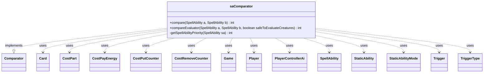

---
aliases:
  - saComparator
tags:
  - java/class
  - module/forge-ai
  - pkg/forge/ai
fqn: forge.ai.ComputerUtilAbility.saComparator
package: forge.ai
module: forge-ai
kind: Class
---

# saComparator

**Package:** `forge.ai`   **Module:** `forge-ai`   **Kind:** Class



## Relationships
**Uses:**
- [[forge.ai.PlayerControllerAi|PlayerControllerAi]]
- [[forge.game.Game|Game]]
- [[forge.game.card.Card|Card]]
- [[forge.game.cost.CostPart|CostPart]]
- [[forge.game.cost.CostPayEnergy|CostPayEnergy]]
- [[forge.game.cost.CostPutCounter|CostPutCounter]]
- [[forge.game.cost.CostRemoveCounter|CostRemoveCounter]]
- [[forge.game.player.Player|Player]]
- [[forge.game.spellability.SpellAbility|SpellAbility]]
- [[forge.game.staticability.StaticAbility|StaticAbility]]
- [[forge.game.staticability.StaticAbilityMode|StaticAbilityMode]]
- [[forge.game.trigger.Trigger|Trigger]]
- [[forge.game.trigger.TriggerType|TriggerType]]

## Design Description

The `saComparator` is a static nested `Comparator<SpellAbility>` used by the Forge AI to order candidate spells and abilities for activation, sorting from most to least valuable so the AI plays its strongest, most appropriate option first. Its `compare` delegates to `compareEvaluator`, which scores each `SpellAbility` primarily by converted mana cost and then applies a large set of MTG-specific heuristics—deprioritizing energy pumps, free or zero-cost spells, planar die rolls, Spectacle, Surge, Storm, and equipment plays without creatures, while boosting boardwipes, mana rituals, and flashback.

The private `getSpellAbilityPriority` encapsulates these per-ability adjustments, inspecting the host `Card`'s triggers, static abilities, keywords, and cost parts to compute a priority offset. The class collaborates broadly with the game model—`Card`, `Player`, `Game`, cost types, triggers, and `StaticAbility`—and consults `PlayerControllerAi` for profile-driven tuning, keeping all sequencing logic in one cohesive, stateless comparator.

## Source
`forge-ai/src/main/java/forge/ai/ComputerUtilAbility.java` — declaration excerpt

```java
    // not sure "playing biggest spell" matters?
    public final static class saComparator implements Comparator<SpellAbility> {
        @Override
        public int compare(final SpellAbility a, final SpellAbility b) {
            return compareEvaluator(a, b, false);
        }
        public int compareEvaluator(final SpellAbility a, final SpellAbility b, boolean safeToEvaluateCreatures) {
            // sort from highest cost to lowest
            // we want the highest costs first
            int a1 = a.getPayCosts().getTotalMana().getCMC();
            int b1 = b.getPayCosts().getTotalMana().getCMC();

            // deprioritize SAs explicitly marked as preferred to be activated last compared to all other SAs
            if (a.hasParam("AIActivateLast") && !b.hasParam("AIActivateLast")) {
                return 1;
            } else if (b.hasParam("AIActivateLast") && !a.hasParam("AIActivateLast")) {
                return -1;
            }

            // deprioritize planar die roll marked with AIRollPlanarDieParams:LowPriority$ True
            if (ApiType.RollPlanarDice == a.getApi() || ApiType.RollPlanarDice == b.getApi()) {
                Card hostCardForGame = a.getHostCard();
                if (hostCardForGame == null) {
                    if (b.getHostCard() != null) {
                        hostCardForGame = b.getHostCard();
                    } else {
                        return 0; // fallback if neither SA have a host card somehow
                    }
                }
                Game game = hostCardForGame.getGame();
                if (game.getActivePlanes() != null) {
                    for (Card c : game.getActivePlanes()) {
                        if (c.hasSVar("AIRollPlanarDieParams") && c.getSVar("AIRollPlanarDieParams").toLowerCase().matches(".*lowpriority\\$\\s*true.*")) {
                            if (ApiType.RollPlanarDice == a.getApi()) {
                                return 1;
                            } else {
                                return -1;
                            }
                        }
                    }
                }
            }

            // deprioritize pump spells with pure energy cost (can be activated last,
            // since energy is generally scarce, plus can benefit e.g. Electrostatic Pummeler)
            int a2 = 0, b2 = 0;
            if (a.getApi() == ApiType.Pump && a.getPayCosts().getCostEnergy() != null) {
                if (a.getPayCosts().hasOnlySpecificCostType(CostPayEnergy.class)) {
                    a2 = a.getPayCosts().getCostEnergy().convertAmount();
                }
            }
            if (b.getApi() == ApiType.Pump && b.getPayCosts().getCostEnergy() != null) {
                if (b.getPayCosts().hasOnlySpecificCostType(CostPayEnergy.class)) {
                    b2 = b.getPayCosts().getCostEnergy().convertAmount();
                }
            }
            if (a2 == 0 && b2 > 0) {
                return -1;
            } else if (b2 == 0 && a2 > 0) {
                return 1;
            }

            // cast 0 mana cost spells first (might be a Mox)
            if (a1 == 0 && b1 > 0 && ApiType.Mana != a.getApi()) {
                return -1;
            } else if (a1 > 0 && b1 == 0 && ApiType.Mana != b.getApi()) {
                return 1;
            }

            if (a.getHostCard() != null && a.getHostCard().hasSVar("FreeSpellAI")) {
                return -1;
            } else if (b.getHostCard() != null && b.getHostCard().hasSVar("FreeSpellAI")) {
                return 1;
            }

            if (a.getHostCard().equals(b.getHostCard()) && a.getApi() == b.getApi()) {
                // Cheaper Spectacle costs should be preferred
                // FIXME: Any better way to identify that these are the same ability, one with Spectacle and one not?
                // (looks like it's not a full-fledged alternative cost as such, and is not processed with other alt costs)
                if (a.isSpectacle() && !b.isSpectacle() && a1 < b1) {
                    return 1;
                } else if (b.isSpectacle() && !a.isSpectacle() && b1 < a1) {
                    return 1;
                }
            }

            a1 += getSpellAbilityPriority(a);
            b1 += getSpellAbilityPriority(b);

            // if both are creature spells sort them after
            if (safeToEvaluateCreatures) {
                // try to align the scales: if priority swings in either direction extra evaluation matters less
                a1 += Math.round(ComputerUtilCard.evaluateCreature(a) / (10.5f + Math.abs(a1)));
                b1 += Math.round(ComputerUtilCard.evaluateCreature(b) / (10.5f + Math.abs(b1)));
            }

            return b1 - a1;
        }

        private static int getSpellAbilityPriority(SpellAbility sa) {
            int p = 0;
            Card source = sa.getHostCard();
            final Player ai = source == null ? sa.getActivatingPlayer() : source.getController();
            if (ai == null) {
                System.err.println("Error: couldn't figure out the activating player and host card for SA: " + sa);
                return 0;
            }
            final boolean noCreatures = ai.getCreaturesInPlay().isEmpty();

            if (source != null) {
                // puts creatures in front of spells
                if (source.isCreature()) {
                    p += 1;
                }
                if (source.hasSVar("AIPriorityModifier")) {
                    p += Integer.parseInt(source.getSVar("AIPriorityModifier"));
                }
                // try to use it before it's gone
                if (source.isInPlay() && source.hasSVar("EndOfTurnLeavePlay")) {
                    p += 1;
                }
                if (ComputerUtilCard.isCardRemAIDeck(sa.getOriginalHost() != null ? sa.getOriginalHost() : source)) {
                    p -= 10;
                }
                // don't play equipment before having any creatures
                if (source.isEquipment() && noCreatures) {
                    p -= 9;
                }
                // don't equip stuff in main 2 if there's more stuff to cast at the moment
                if (sa.getApi() == ApiType.Attach && !sa.isCurse() && source.getGame().getPhaseHandler().getPhase().isAfter(PhaseType.COMBAT_DECLARE_BLOCKERS)) {
                    p -= 1;
                }
                // 1. increase chance of using Surge effects
                // 2. non-surged versions are usually inefficient
                if (source.hasKeyword(Keyword.SURGE) && !sa.isSurged()) {
                    p -= 9;
                }
                // move snap-casted spells to front
                if (source.isInZone(ZoneType.Graveyard) && source.mayPlay(sa.getMayPlay()) != null) {
                    p += 50;
                }
                // if the profile specifies it, deprioritize Storm spells in an attempt to build up storm count
                if (source.hasKeyword(Keyword.STORM) && ai.getController() instanceof PlayerControllerAi) {
                    p -= (((PlayerControllerAi) ai.getController()).getAi().getIntProperty(AiProps.PRIORITY_REDUCTION_FOR_STORM_SPELLS));
                }

                for (Trigger trig : source.getTriggers()) {
                    if (!"Battlefield".equals(trig.getParam("TriggerZones"))) {
                        continue;
                    }
                    final TriggerType mode = trig.getMode();
                    // benefit from Magecraft abilities
                    if ((mode == TriggerType.SpellCast || mode == TriggerType.SpellCastOrCopy) && "You".equals(sa.getParam("ValidActivatingPlayer"))) {
                        p += 1;
                    }
                }

                for (StaticAbility sta : source.getStaticAbilities()) {
                    final Set<StaticAbilityMode> mode = sta.getMode();
                    // reduce cost to enable more plays
                    if (mode.contains(StaticAbilityMode.ReduceCost) && "You".equals(sta.getParam("Activator"))) {
                        p += 1;
                    }
                }
            }

            // use Surge and Prowl costs when able to
            if (sa.isSurged() || sa.isProwl()) {
                p += 9;
            }
            // sort planeswalker abilities with most costly first
            if (sa.isPwAbility()) {
                final CostPart cost = sa.getPayCosts().getCostParts().get(0);
                if (cost instanceof CostRemoveCounter) {
                    p += cost.convertAmount() == null ? 1 : cost.convertAmount();
                } else if (cost instanceof CostPutCounter) {
                    p -= cost.convertAmount();
                }
                if (sa.hasParam("Ultimate")) {
                    p += 9;
                }
            }

            if (ApiType.DestroyAll == sa.getApi()) {
                // check boardwipe earlier
                p += 4;
            } else if (ApiType.Mana == sa.getApi()) {
                // keep mana abilities for paying
                p -= 9;
            }

            // try to cast mana ritual spells before casting spells to maximize potential mana
            if ("ManaRitual".equals(sa.getParam("AILogic"))) {
                p += 9;
            }

            return p;
        }
    }
```

## Python
`forge/ai/ComputerUtilAbility/saComparator.py`

```python
from forge.ai.PlayerControllerAi import PlayerControllerAi
from forge.ai.ComputerUtilCard import ComputerUtilCard
from forge.ai.AiProps import AiProps
from forge.game.Game import Game
from forge.game.card.Card import Card
from forge.game.cost.CostPart import CostPart
from forge.game.cost.CostPayEnergy import CostPayEnergy
from forge.game.cost.CostPutCounter import CostPutCounter
from forge.game.cost.CostRemoveCounter import CostRemoveCounter
from forge.game.player.Player import Player
from forge.game.spellability.SpellAbility import SpellAbility
from forge.game.staticability.StaticAbility import StaticAbility
from forge.game.staticability.StaticAbilityMode import StaticAbilityMode
from forge.game.trigger.Trigger import Trigger
from forge.game.trigger.TriggerType import TriggerType
from forge.game.ability.ApiType import ApiType
from forge.game.phase.PhaseType import PhaseType
from forge.game.keyword.Keyword import Keyword
from forge.game.zone.ZoneType import ZoneType

import re
import sys


# not sure "playing biggest spell" matters?
class saComparator:
    def compare(self, a: SpellAbility, b: SpellAbility) -> int:
        return self.compareEvaluator(a, b, False)

    def compareEvaluator(self, a: SpellAbility, b: SpellAbility, safeToEvaluateCreatures: bool) -> int:
        # sort from highest cost to lowest
        # we want the highest costs first
        a1 = a.getPayCosts().getTotalMana().getCMC()
        b1 = b.getPayCosts().getTotalMana().getCMC()

        # deprioritize SAs explicitly marked as preferred to be activated last compared to all other SAs
        if a.hasParam("AIActivateLast") and not b.hasParam("AIActivateLast"):
            return 1
        elif b.hasParam("AIActivateLast") and not a.hasParam("AIActivateLast"):
            return -1

        # deprioritize planar die roll marked with AIRollPlanarDieParams:LowPriority$ True
        if ApiType.RollPlanarDice == a.getApi() or ApiType.RollPlanarDice == b.getApi():
            hostCardForGame = a.getHostCard()
            if hostCardForGame is None:
                if b.getHostCard() is not None:
                    hostCardForGame = b.getHostCard()
                else:
                    return 0  # fallback if neither SA have a host card somehow
            game = hostCardForGame.getGame()
            if game.getActivePlanes() is not None:
                for c in game.getActivePlanes():
                    if c.hasSVar("AIRollPlanarDieParams") and re.fullmatch(r".*lowpriority\$\s*true.*", c.getSVar("AIRollPlanarDieParams").lower()):
                        if ApiType.RollPlanarDice == a.getApi():
                            return 1
                        else:
                            return -1

        # deprioritize pump spells with pure energy cost (can be activated last,
        # since energy is generally scarce, plus can benefit e.g. Electrostatic Pummeler)
        a2 = 0
        b2 = 0
        if a.getApi() == ApiType.Pump and a.getPayCosts().getCostEnergy() is not None:
            if a.getPayCosts().hasOnlySpecificCostType(CostPayEnergy):
                a2 = a.getPayCosts().getCostEnergy().convertAmount()
        if b.getApi() == ApiType.Pump and b.getPayCosts().getCostEnergy() is not None:
            if b.getPayCosts().hasOnlySpecificCostType(CostPayEnergy):
                b2 = b.getPayCosts().getCostEnergy().convertAmount()
        if a2 == 0 and b2 > 0:
            return -1
        elif b2 == 0 and a2 > 0:
            return 1

        # cast 0 mana cost spells first (might be a Mox)
        if a1 == 0 and b1 > 0 and ApiType.Mana != a.getApi():
            return -1
        elif a1 > 0 and b1 == 0 and ApiType.Mana != b.getApi():
            return 1

        if a.getHostCard() is not None and a.getHostCard().hasSVar("FreeSpellAI"):
            return -1
        elif b.getHostCard() is not None and b.getHostCard().hasSVar("FreeSpellAI"):
            return 1

        if a.getHostCard().equals(b.getHostCard()) and a.getApi() == b.getApi():
            # Cheaper Spectacle costs should be preferred
            # FIXME: Any better way to identify that these are the same ability, one with Spectacle and one not?
            # (looks like it's not a full-fledged alternative cost as such, and is not processed with other alt costs)
            if a.isSpectacle() and not b.isSpectacle() and a1 < b1:
                return 1
            elif b.isSpectacle() and not a.isSpectacle() and b1 < a1:
                return 1

        a1 += self.getSpellAbilityPriority(a)
        b1 += self.getSpellAbilityPriority(b)

        # if both are creature spells sort them after
        if safeToEvaluateCreatures:
            # try to align the scales: if priority swings in either direction extra evaluation matters less
            a1 += round(ComputerUtilCard.evaluateCreature(a) / (10.5 + abs(a1)))
            b1 += round(ComputerUtilCard.evaluateCreature(b) / (10.5 + abs(b1)))

        return b1 - a1

    @staticmethod
    def getSpellAbilityPriority(sa: SpellAbility) -> int:
        p = 0
        source = sa.getHostCard()
        ai = sa.getActivatingPlayer() if source is None else source.getController()
        if ai is None:
            print("Error: couldn't figure out the activating player and host card for SA: " + str(sa), file=sys.stderr)
            return 0
        noCreatures = ai.getCreaturesInPlay().isEmpty()

        if source is not None:
            # puts creatures in front of spells
            if source.isCreature():
                p += 1
            if source.hasSVar("AIPriorityModifier"):
                p += int(source.getSVar("AIPriorityModifier"))
            # try to use it before it's gone
            if source.isInPlay() and source.hasSVar("EndOfTurnLeavePlay"):
                p += 1
            if ComputerUtilCard.isCardRemAIDeck(sa.getOriginalHost() if sa.getOriginalHost() is not None else source):
                p -= 10
            # don't play equipment before having any creatures
            if source.isEquipment() and noCreatures:
                p -= 9
            # don't equip stuff in main 2 if there's more stuff to cast at the moment
            if sa.getApi() == ApiType.Attach and not sa.isCurse() and source.getGame().getPhaseHandler().getPhase().isAfter(PhaseType.COMBAT_DECLARE_BLOCKERS):
                p -= 1
            # 1. increase chance of using Surge effects
            # 2. non-surged versions are usually inefficient
            if source.hasKeyword(Keyword.SURGE) and not sa.isSurged():
                p -= 9
            # move snap-casted spells to front
            if source.isInZone(ZoneType.Graveyard) and source.mayPlay(sa.getMayPlay()) is not None:
                p += 50
            # if the profile specifies it, deprioritize Storm spells in an attempt to build up storm count
            if source.hasKeyword(Keyword.STORM) and isinstance(ai.getController(), PlayerControllerAi):
                p -= ai.getController().getAi().getIntProperty(AiProps.PRIORITY_REDUCTION_FOR_STORM_SPELLS)

            for trig in source.getTriggers():
                if "Battlefield" != trig.getParam("TriggerZones"):
                    continue
                mode = trig.getMode()
                # benefit from Magecraft abilities
                if (mode == TriggerType.SpellCast or mode == TriggerType.SpellCastOrCopy) and "You" == sa.getParam("ValidActivatingPlayer"):
                    p += 1

            for sta in source.getStaticAbilities():
                mode = sta.getMode()
                # reduce cost to enable more plays
                if StaticAbilityMode.ReduceCost in mode and "You" == sta.getParam("Activator"):
                    p += 1

        # use Surge and Prowl costs when able to
        if sa.isSurged() or sa.isProwl():
            p += 9
        # sort planeswalker abilities with most costly first
        if sa.isPwAbility():
            cost = sa.getPayCosts().getCostParts().get(0)
            if isinstance(cost, CostRemoveCounter):
                p += 1 if cost.convertAmount() is None else cost.convertAmount()
            elif isinstance(cost, CostPutCounter):
                p -= cost.convertAmount()
            if sa.hasParam("Ultimate"):
                p += 9

        if ApiType.DestroyAll == sa.getApi():
            # check boardwipe earlier
            p += 4
        elif ApiType.Mana == sa.getApi():
            # keep mana abilities for paying
            p -= 9

        # try to cast mana ritual spells before casting spells to maximize potential mana
        if "ManaRitual" == sa.getParam("AILogic"):
            p += 9

        return p
```
