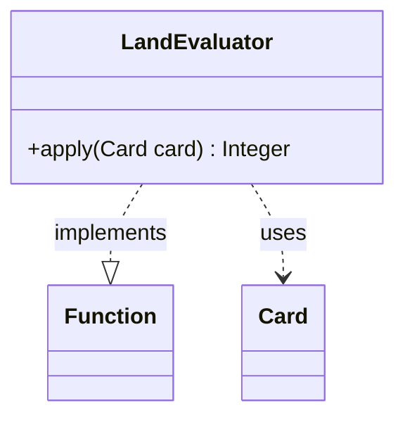

---
aliases:
  - LandEvaluator
tags:
  - java/class
  - module/forge-ai
  - pkg/forge/ai
fqn: forge.ai.ComputerUtilCard.LandEvaluator
package: forge.ai
module: forge-ai
kind: Class
---

# LandEvaluator

**Package:** `forge.ai`   **Module:** `forge-ai`   **Kind:** Class



## Relationships
**Uses:**
- [[forge.game.card.Card|Card]]

## Design Description

LandEvaluator is a small, stateless adapter that exposes Forge's land-scoring logic as a reusable function object. Declared as a static nested class of `ComputerUtilCard`, it implements `Function<Card, Integer>`, so callers can treat land valuation as a first-class value—passing it to streams, comparators, or other higher-order AI utilities rather than invoking a static method directly. Its sole responsibility is to delegate each `apply(Card)` call to `GameStateEvaluator.evaluateLand`, mapping a `Card` to an integer worth. This keeps the numeric heuristics centralized in `GameStateEvaluator` while letting the AI layer compose land evaluation functionally. The design favors thin, side-effect-free delegation: no fields, no state, and a single-line override, making the class trivially shareable as a singleton-like helper within the engine's decision-making code.

## Source
`forge-ai/src/main/java/forge/ai/ComputerUtilCard.java` — declaration excerpt

```java
    static class LandEvaluator implements Function<Card, Integer> {
        @Override
        public Integer apply(Card card) {
            return GameStateEvaluator.evaluateLand(card);
        }
    }
```
