---
aliases:
  - ComputerUtilCard
tags:
  - java/class
  - module/forge-ai
  - pkg/forge/ai
fqn: forge.ai.ComputerUtilCard
package: forge.ai
module: forge-ai
kind: Class
---

# ComputerUtilCard

**Package:** `forge.ai` &nbsp; **Module:** `forge-ai` &nbsp; **Kind:** Class

```mermaid
classDiagram
    class ComputerUtilCard {
        +Comparator~SpellAbility~ EvaluateCreatureSpellComparator
        -CreatureEvaluator creatureEvaluator
        -LandEvaluator landEvaluator
        +Predicate~Deck~ AI_KNOWS_HOW_TO_PLAY_ALL_CARDS
        +getMostExpensivePermanentAI(CardCollectionView list, SpellAbility spell, boolean targeted) Card
        +sortByEvaluateCreature(CardCollection list) void
        +getBestArtifactAI(List~Card~ list) Card
        +getBestPlaneswalkerAI(List~Card~ list) Card
        +getWorstPlaneswalkerAI(List~Card~ list) Card
        +getBestPlaneswalkerToDamage(List~Card~ pws) Card
        +getWorstPlaneswalkerToDamage(List~Card~ pws) Card
        +getBestEnchantmentAI(List~Card~ list, SpellAbility spell, boolean targeted) Card
        +getBestLandAI(Iterable~Card~ list) Card
        +getBestLandToRemoveAI(Player ai, Iterable~Card~ list, SpellAbility removal) Card
        +evaluateLandRemovalPriority(Player ai, Card land, SpellAbility removal) int
        -evaluateLandRemovalPriority(Player ai, Card land, SpellAbility removal, boolean includeLandDestruction) int
        -hasManaBoostingText(Card aura) boolean
        -hasRemovedAiPermanent(Player ai, Card card) boolean
        -isLandDestructionAbility(SpellAbility ability) boolean
        -isHomewardPathAbility(SpellAbility ability) boolean
        -aiControlsStolenCreature(Player ai) boolean
        -isLandAnimationAbility(SpellAbility ability) boolean
        -isAttackingAi(Card land, Player ai) boolean
        -aiHasHighPriorityLand(Player ai) boolean
        +getWorstLand(List~Card~ lands) Card
        +getBestLandToAnimate(Iterable~Card~ lands) Card
        +getCheapestPermanentAI(Iterable~Card~ all, SpellAbility spell, boolean targeted) Card
        +getBestAI(Iterable~Card~ list) Card
        +getBestRemovalTargetAI(Player ai, Iterable~Card~ list) Card
        -evaluateRemovalTargetPriority(Player ai, Card c) int
        +getBestCreatureAI(Iterable~Card~ list) Card
        +getBestLandToPlayAI(Iterable~Card~ list) Card
        +getWorstCreatureAI(Iterable~Card~ list) Card
        +getBestCreatureToAttackNextTurnAI(Player aiPlayer, Iterable~Card~ list) Card
        +getWorstAI(Iterable~Card~ list) Card
        +getWorstPermanentAI(Iterable~Card~ list, boolean biasEnch, boolean biasLand, boolean biasArt, boolean biasCreature) Card
        +getCheapestSpellAI(Iterable~Card~ list) Card
        +getCachedCreatureComparator() Comparator~Card~
        +evaluateCreature(Card c) int
        +evaluateCreature(Card c, boolean considerPT, boolean considerCMC) int
        +evaluateCreature(SpellAbility sa) int
        +evaluatePermanentList(CardCollectionView list) int
        +evaluateCreatureList(CardCollectionView list) int
        +evaluateCreatureListByName(CardCollectionView list) Map~String,Integer~
        +doesCreatureAttackAI(Player aiPlayer, Card card) boolean
        +doesSpecifiedCreatureAttackAI(Player ai, Card card) boolean
        +getLikelyBlockers(Player ai, CardCollectionView blockers) CardCollectionView
        +doesSpecifiedCreatureBlock(Player ai, Card blocker) boolean
        +canBeBlockedProfitably(Player ai, Card attacker, boolean checkingOther) boolean
        +canBeKilledByRoyalAssassin(Player ai, Card card) boolean
        +getMostExpensivePermanentAI(Iterable~Card~ all) Card
        +getMostProminentCardName(CardCollectionView list) String
        +getMostProminentType(CardCollectionView list, Collection~String~ valid) String
        +getMostProminentType(CardCollectionView list, Collection~String~ valid, boolean includeTokens) String
        +getMostProminentCardType(CardCollectionView list, Collection~CardType.CoreType~ valid) CardType.CoreType
        +getMostProminentColor(Iterable~Card~ list) String
        +getMostProminentColor(CardCollectionView list, Iterable~String~ restrictedToColors) String
        +getColorByProminence(List~Card~ list) List~String~
        +chooseColor(SpellAbility sa, int min, int max, List~String~ colorChoices) List~String~
        +useRemovalNow(SpellAbility sa, Card c, int dmg, ZoneType destination) boolean
        +shouldPumpCard(Player ai, SpellAbility sa, Card c, int toughness, int power, List~String~ keywords) boolean
        +shouldPumpCard(Player ai, SpellAbility sa, Card c, int toughness, int power, List~String~ keywords, boolean immediately) boolean
        +getPumpedCreature(Player ai, SpellAbility sa, Card c, int toughness, int power, List~String~ keywords) Card
        +applyStaticContPT(Game game, Card vCard, CardCollectionView exclude) void
        +canPumpAgainstRemoval(Player ai, SpellAbility sa) AiAbilityDecision
        +isUselessCreature(Player ai, Card c) boolean
        +hasActiveUndyingOrPersist(Card c) boolean
        +getMaxSAEnergyCostOnBattlefield(Player ai) int
        +prioritizeCreaturesWorthRemovingNow(Player ai, CardCollection oppCards, boolean temporary) CardCollection
        +checkNeedsToPlayReqs(Card card, SpellAbility sa) AiPlayDecision
        +getTotalWardCost(Card c) Cost
        +willUntap(Player ai, Card tapped) boolean
        +isNonDisabledCardInPlay(Player ai, String cardName) boolean
        +dedupeCards(CardCollection cc) CardCollection
        +isCardRemAIDeck(Card card) boolean
        +isCardRemRandomDeck(Card card) boolean
        +isCardRemNonCommanderDeck(Card card) boolean
    }
    ComputerUtilCard ..> AiAbilityDecision : uses
    ComputerUtilCard ..> AiAttackController : uses
    ComputerUtilCard ..> AiBlockController : uses
    ComputerUtilCard ..> AiController : uses
    ComputerUtilCard ..> AiPlayDecision : uses
    ComputerUtilCard ..> Card : uses
    ComputerUtilCard ..> CardCollection : uses
    ComputerUtilCard ..> CardCollectionView : uses
    ComputerUtilCard ..> CardCopyService : uses
    ComputerUtilCard ..> CardPool : uses
    ComputerUtilCard ..> CardRules : uses
    ComputerUtilCard ..> CardStateName : uses
    ComputerUtilCard ..> CardType : uses
    ComputerUtilCard ..> ColorSet : uses
    ComputerUtilCard ..> Combat : uses
    ComputerUtilCard ..> CoreType : uses
    ComputerUtilCard ..> Cost : uses
    ComputerUtilCard ..> CostPayEnergy : uses
    ComputerUtilCard ..> CostRemoveCounter : uses
    ComputerUtilCard ..> CostSacrifice : uses
    ComputerUtilCard ..> CostUntap : uses
    ComputerUtilCard ..> CreatureEvaluator : uses
    ComputerUtilCard ..> Deck : uses
    ComputerUtilCard ..> DeckSection : uses
    ComputerUtilCard ..> Game : uses
    ComputerUtilCard ..> GameObject : uses
    ComputerUtilCard ..> KeywordCollection : uses
    ComputerUtilCard ..> KeywordInterface : uses
    ComputerUtilCard ..> LandEvaluator : uses
    ComputerUtilCard ..> MagicStack : uses
    ComputerUtilCard ..> PaperCard : uses
    ComputerUtilCard ..> PhaseHandler : uses
    ComputerUtilCard ..> PhaseType : uses
    ComputerUtilCard ..> Player : uses
    ComputerUtilCard ..> PlayerControllerAi : uses
    ComputerUtilCard ..> ReplacementEffect : uses
    ComputerUtilCard ..> SpellAbility : uses
    ComputerUtilCard ..> StaticAbility : uses
    ComputerUtilCard ..> Trigger : uses
    ComputerUtilCard ..> ZoneType : uses
```



## Relationships
**Uses:**
- [[forge.ai.AiAbilityDecision|AiAbilityDecision]]
- [[forge.ai.AiAttackController|AiAttackController]]
- [[forge.ai.AiBlockController|AiBlockController]]
- [[forge.ai.AiController|AiController]]
- [[forge.ai.AiPlayDecision|AiPlayDecision]]
- [[forge.ai.ComputerUtilCard.LandEvaluator|LandEvaluator]]
- [[forge.ai.CreatureEvaluator|CreatureEvaluator]]
- [[forge.ai.PlayerControllerAi|PlayerControllerAi]]
- [[forge.card.CardRules|CardRules]]
- [[forge.card.CardStateName|CardStateName]]
- [[forge.card.CardType|CardType]]
- [[forge.card.CardType.CoreType|CoreType]]
- [[forge.card.ColorSet|ColorSet]]
- [[forge.deck.CardPool|CardPool]]
- [[forge.deck.Deck|Deck]]
- [[forge.deck.DeckSection|DeckSection]]
- [[forge.game.Game|Game]]
- [[forge.game.GameObject|GameObject]]
- [[forge.game.card.Card|Card]]
- [[forge.game.card.CardCollection|CardCollection]]
- [[forge.game.card.CardCollectionView|CardCollectionView]]
- [[forge.game.card.CardCopyService|CardCopyService]]
- [[forge.game.combat.Combat|Combat]]
- [[forge.game.cost.Cost|Cost]]
- [[forge.game.cost.CostPayEnergy|CostPayEnergy]]
- [[forge.game.cost.CostRemoveCounter|CostRemoveCounter]]
- [[forge.game.cost.CostSacrifice|CostSacrifice]]
- [[forge.game.cost.CostUntap|CostUntap]]
- [[forge.game.keyword.KeywordCollection|KeywordCollection]]
- [[forge.game.keyword.KeywordInterface|KeywordInterface]]
- [[forge.game.phase.PhaseHandler|PhaseHandler]]
- [[forge.game.phase.PhaseType|PhaseType]]
- [[forge.game.player.Player|Player]]
- [[forge.game.replacement.ReplacementEffect|ReplacementEffect]]
- [[forge.game.spellability.SpellAbility|SpellAbility]]
- [[forge.game.staticability.StaticAbility|StaticAbility]]
- [[forge.game.trigger.Trigger|Trigger]]
- [[forge.game.zone.MagicStack|MagicStack]]
- [[forge.game.zone.ZoneType|ZoneType]]
- [[forge.item.PaperCard|PaperCard]]


## Design Description

ComputerUtilCard is a stateless utility class in the forge-ai module that centralizes the AI's card-evaluation and selection heuristics. Holding only shared CreatureEvaluator and LandEvaluator instances, its static methods answer the recurring questions the engine's decision logic asks of a card list: which permanent is best, worst, cheapest, or most expensive (optionally restricted to targetable cards); how to score creatures, lands, and planeswalkers; which color or type is most prominent; and whether to apply removal, pumps, or combat tricks now.

It collaborates broadly across the game model, operating on Card/CardCollection lists while querying Player, Game, Combat, and PhaseHandler for context and inspecting SpellAbility APIs and costs. For combat-aware decisions it builds throwaway AiAttackController/AiBlockController simulations and clones candidates via CardCopyService (getPumpedCreature), returning typed verdicts such as AiPlayDecision and AiAbilityDecision. The design intent is a single reusable home for heuristic scoring that higher-level AI controllers compose rather than reimplement.

## Source
`forge-ai/src/main/java/forge/ai/ComputerUtilCard.java`

```java
package forge.ai;

import java.util.ArrayList;
import java.util.Arrays;
import java.util.Collection;
import java.util.Comparator;
import java.util.IdentityHashMap;
import java.util.List;
import java.util.Map;
import java.util.Map.Entry;
import java.util.Set;
import java.util.function.Function;
import java.util.function.Predicate;
import java.util.stream.Collectors;
import java.util.stream.Stream;

import org.apache.commons.lang3.StringUtils;
import org.apache.commons.lang3.tuple.MutablePair;
import org.apache.commons.lang3.tuple.Pair;

import com.google.common.collect.Iterables;
import com.google.common.collect.Lists;
import com.google.common.collect.Maps;

import forge.StaticData;
import forge.ai.simulation.GameStateEvaluator;
import forge.card.CardRules;
import forge.card.CardStateName;
import forge.card.CardType;
import forge.card.ColorSet;
import forge.card.MagicColor;
import forge.card.MagicColor.Constant;
import forge.card.mana.ManaCost;
import forge.deck.CardPool;
import forge.deck.Deck;
import forge.deck.DeckSection;
import forge.game.Game;
import forge.game.GameObject;
import forge.game.ability.AbilityUtils;
import forge.game.ability.ApiType;
import forge.game.card.Card;
import forge.game.card.CardCollection;
import forge.game.card.CardCollectionView;
import forge.game.card.CardCopyService;
import forge.game.card.CardFactoryUtil;
import forge.game.card.CardLists;
import forge.game.card.CardPredicates;
import forge.game.card.CounterEnumType;
import forge.game.combat.Combat;
import forge.game.combat.CombatUtil;
import forge.game.cost.Cost;
import forge.game.cost.CostPayEnergy;
import forge.game.cost.CostRemoveCounter;
import forge.game.cost.CostSacrifice;
import forge.game.cost.CostUntap;
import forge.game.keyword.Keyword;
import forge.game.keyword.KeywordCollection;
import forge.game.keyword.KeywordInterface;
import forge.game.phase.PhaseHandler;
import forge.game.phase.PhaseType;
import forge.game.player.Player;
import forge.game.replacement.ReplacementEffect;
import forge.game.replacement.ReplacementLayer;
import forge.game.spellability.SpellAbility;
import forge.game.staticability.StaticAbility;
import forge.game.staticability.StaticAbilityMode;
import forge.game.trigger.Trigger;
import forge.game.trigger.TriggerType;
import forge.game.zone.MagicStack;
import forge.game.zone.ZoneType;
import forge.item.PaperCard;
import forge.util.Aggregates;
import forge.util.Expressions;
import forge.util.IterableUtil;
import forge.util.MyRandom;
import forge.util.TextUtil;

public class ComputerUtilCard {
    public static Card getMostExpensivePermanentAI(final CardCollectionView list, final SpellAbility spell, final boolean targeted) {
        CardCollectionView all = list;
        if (targeted) {
            all = CardLists.filter(all, c -> c.canBeTargetedBy(spell));
        }
        return getMostExpensivePermanentAI(all);
    }

    /**
     * <p>
     * Sorts a List<Card> by "best" using the EvaluateCreature function.
     * the best creatures will be first in the list.
     * </p>
     *
     * @param list
     */
    public static void sortByEvaluateCreature(final CardCollection list) {
        list.sort(getCachedCreatureComparator().reversed());
    }

    /**
     * <p>
     * getBestArtifactAI.
     * </p>
     *
     * @param list
     * @return a {@link forge.game.card.Card} object.
     */
    public static Card getBestArtifactAI(final List<Card> list) {
        // get biggest Artifact
        return list.stream()
                .filter(CardPredicates.ARTIFACTS)
                .max(Comparator.comparing(Card::getCMC))
                .orElse(null);
    }

    /**
     * Returns the best Planeswalker from a given list
     *
     * @param list list of cards to evaluate
     * @return best Planeswalker
     */
    public static Card getBestPlaneswalkerAI(final List<Card> list) {
        // no AI logic, just return most expensive
        return list.stream()
                .filter(CardPredicates.PLANESWALKERS)
                .max(Comparator.comparing(Card::getCMC))
                .orElse(null);
    }

    /**
     * Returns the worst Planeswalker from a given list
     *
     * @param list list of cards to evaluate
     * @return best Planeswalker
     */
    public static Card getWorstPlaneswalkerAI(final List<Card> list) {
        // no AI logic, just return least expensive
        return list.stream()
                .filter(CardPredicates.PLANESWALKERS)
                .min(Comparator.comparing(Card::getCMC))
                .orElse(null);
    }

    public static Card getBestPlaneswalkerToDamage(final List<Card> pws) {
        Card bestTgt = null;

        // As of right now, ranks planeswalkers by their Current Loyalty * 10 + Big buff if close to "Ultimate"
        int bestScore = 0;
        for (Card pw : pws) {
            int curLoyalty = pw.getCounters(CounterEnumType.LOYALTY);
            int pwScore = curLoyalty * 10;

            for (SpellAbility sa : pw.getSpellAbilities()) {
                if (sa.hasParam("Ultimate")) {
                    Integer loyaltyCost = 0;
                    CostRemoveCounter remLoyalty = sa.getPayCosts().getCostPartByType(CostRemoveCounter.class);
                    if (remLoyalty != null) {
                        // if remLoyalty is null, generally there's an AddCounter<0/LOYALTY> cost, like for Gideon Jura.
                        loyaltyCost = remLoyalty.convertAmount();
                    }

                    if (loyaltyCost != null && loyaltyCost != 0 && loyaltyCost - curLoyalty <= 1) {
                        // Will ultimate soon
                        pwScore += 10000;
                    }

                    if (pwScore > bestScore) {
                        bestScore = pwScore;
                        bestTgt = pw;
                    }
                }
            }
        }

        return bestTgt;
    }

    public static Card getWorstPlaneswalkerToDamage(final List<Card> pws) {
        Card bestTgt = null;

        int bestScore = Integer.MAX_VALUE;
        for (Card pw : pws) {
            int curLoyalty = pw.getCounters(CounterEnumType.LOYALTY);

            if (curLoyalty < bestScore) {
                bestScore = curLoyalty;
                bestTgt = pw;
            }
        }

        return bestTgt;
    }

    // The AI doesn't really pick the best enchantment, just the most expensive.

    /**
     * <p>
     * getBestEnchantmentAI.
     * </p>
     *
     * @param list
     * @param spell    a {@link forge.game.card.Card} object.
     * @param targeted a boolean.
     * @return a {@link forge.game.card.Card} object.
     */
    public static Card getBestEnchantmentAI(final List<Card> list, final SpellAbility spell, final boolean targeted) {
        Stream<Card> cardStream = list.stream().filter(CardPredicates.ENCHANTMENTS);
        if (targeted) {
            cardStream = cardStream.filter(c -> c.canBeTargetedBy(spell));
        }

        // get biggest Enchantment
        return cardStream.max(Comparator.comparing(Card::getCMC)).orElse(null);
    }

    /**
     * <p>
     * getBestLandAI.
     * </p>
     *
     * @param list
     * @return a {@link forge.game.card.Card} object.
     */
    public static Card getBestLandAI(final Iterable<Card> list) {
        final List<Card> land = CardLists.filter(list, CardPredicates.LANDS);
        if (land.isEmpty()) {
            return null;
        }

        // prefer to target non basic lands
        final List<Card> nbLand = CardLists.filter(land, CardPredicates.NONBASIC_LANDS);

        if (!nbLand.isEmpty()) {
            // TODO - Improve ranking various non-basic lands depending on context

            // Urza's Mine/Tower/Power Plant
            final CardCollectionView aiAvailable = nbLand.get(0).getController().getCardsIn(Arrays.asList(ZoneType.Battlefield, ZoneType.Hand));
            if (IterableUtil.any(list, CardPredicates.nameEquals("Urza's Mine"))) {
                if (CardLists.filter(aiAvailable, CardPredicates.nameEquals("Urza's Mine")).isEmpty()) {
                    return CardLists.filter(nbLand, CardPredicates.nameEquals("Urza's Mine")).getFirst();
                }
            }
            if (IterableUtil.any(list, CardPredicates.nameEquals("Urza's Tower"))) {
                if (CardLists.filter(aiAvailable, CardPredicates.nameEquals("Urza's Tower")).isEmpty()) {
                    return CardLists.filter(nbLand, CardPredicates.nameEquals("Urza's Tower")).getFirst();
                }
            }
            if (IterableUtil.any(list, CardPredicates.nameEquals("Urza's Power Plant"))) {
                if (CardLists.filter(aiAvailable, CardPredicates.nameEquals("Urza's Power Plant")).isEmpty()) {
                    return CardLists.filter(nbLand, CardPredicates.nameEquals("Urza's Power Plant")).getFirst();
                }
            }

            return Aggregates.random(nbLand);
        }

        // if no non-basic lands, target the least represented basic land type
        String sminBL = "";
        int iminBL = Integer.MAX_VALUE;
        int n = 0;
        for (String name : MagicColor.Constant.BASIC_LANDS) {
            n = CardLists.getType(land, name).size();
            if (n < iminBL && n > 0) {
                iminBL = n;
                sminBL = name;
            }
        }
        if (iminBL == Integer.MAX_VALUE) {
            // All basic lands have no basic land type. Just return something
            return land.stream().filter(CardPredicates.UNTAPPED).findFirst().orElse(land.get(0));
        }

        final List<Card> bLand = CardLists.getType(land, sminBL);

        return bLand.stream()
                .filter(CardPredicates.UNTAPPED)
                .findFirst()
                // TODO potentially risky if simulation mode currently able to reach this from triggers
                .orElseGet(() -> Aggregates.random(bLand)); // random tapped land of least represented type
    }

    public static Card getBestLandToRemoveAI(final Player ai, final Iterable<Card> list, final SpellAbility removal) {
        final List<Card> lands = CardLists.filter(list, CardPredicates.LANDS);
        if (lands.isEmpty()) {
            return null;
        }

        return lands.stream()
                .max(Comparator.comparingInt(c -> evaluateLandRemovalPriority(ai, c, removal)))
                .orElse(null);
    }

    public static int evaluateLandRemovalPriority(final Player ai, final Card land, final SpellAbility removal) {
        return evaluateLandRemovalPriority(ai, land, removal, true);
    }

    private static int evaluateLandRemovalPriority(final Player ai, final Card land, final SpellAbility removal,
            final boolean includeLandDestruction) {
        if (land == null || !land.isLand()) {
            return 0;
        }

        // Start with the existing land valuation and convert it into a
        // removal priority baseline. A normal one-mana land is worth about 100
        // in LandEvaluator, so subtract that off to keep basics and simple
        // MDFC lands low while preserving high scores for Gaea's Cradle,
        // Tolarian Academy, Serra's Sanctum, Cabal Coffers, etc.
        int score = Math.max(0, landEvaluator.apply(land) - 100);

        boolean hasAnimationAbility = false;
        for (SpellAbility ability : land.getNonManaAbilities()) {
            if (ability.isLandAbility()) {
                continue;
            }
            Cost cost = ability.getPayCosts();
            if (includeLandDestruction && isLandDestructionAbility(ability)) {
                // High priority only when it cannot answer immediately:
                // a tapped Strip Mine or Wasteland matters if the AI controls
                // something worth protecting, but an untapped one can respond.
                if (land.isTapped() && aiHasHighPriorityLand(ai)) {
                    score += 170;
                }
                continue;
            }
            if (isHomewardPathAbility(ability)) {
                // Usually low priority: Homeward Path matters if the AI has
                // stolen creatures that it could lose, but otherwise it is
                // mostly just a colorless land with a narrow political button.
                if (aiControlsStolenCreature(ai)) {
                    score += 100;
                } else {
                    score = Math.max(0, score - 50);
                }
                continue;
            }
            if (isLandAnimationAbility(ability)) {
                hasAnimationAbility = true;
                // Medium priority: manlands like Mishra's Factory and Mutavault.
                // They become much more urgent while attacking the AI.
                score += isAttackingAi(land, ai) ? 140 : 70;
            } else if (cost != null && cost.hasSpecificCostType(CostSacrifice.class)) {
                // Medium priority: one-shot utility lands such as Scavenger
                // Grounds or Blast Zone are relevant, but usually not urgent.
                score += 40;
            }
            if (ability.getApi() == ApiType.Mana || ability.findSubAbilityByType(ApiType.Mana) != null) {
                // High priority: non-mana root abilities that create mana,
                // such as Nykthos-style choose-color abilities implemented in
                // a sub-DB. LandEvaluator sees these as utility, not big mana.
                score += 100;
            }
        }

        if (land.isCreature() && !hasAnimationAbility) {
            // Medium priority: already-animated manlands and lands that are
            // naturally creatures. Manlands with their own animation ability
            // were already scored above; this catches external animation.
            score += isAttackingAi(land, ai) ? 140 : 55;
        }

        if (land.hasSVar("AILandRemovalMinScore")) {
            // Card-specific floor for lands whose danger is hard to infer from
            // their generic ability shape, like Dark Depths or Nykthos. Keep it
            // removal-specific so regular land play does not overvalue them.
            score = Math.max(score, AbilityUtils.calculateAmount(land,
                    land.getSVar("AILandRemovalMinScore"), null));
        }

        for (Card aura : land.getEnchantedBy()) {
            // High priority: an opponent's land enhanced by Wild Growth,
            // Utopia Sprawl, Overgrowth, or similar mana-boosting Auras.
            if (aura.getController().equals(land.getController()) && hasManaBoostingText(aura)) {
                score += 160;
            }
            // High priority: remove the land hosting an On Thin Ice-style Aura
            // when that Aura has removed one of this AI's permanents.
            if (hasRemovedAiPermanent(ai, aura)) {
                score += 180;
            }
        }

        return score;
    }

    private static boolean hasManaBoostingText(final Card aura) {
        for (String value : aura.getSVars().values()) {
            if (value.contains("DB$ Mana") || value.contains("TapsForMana") || value.contains("ManaReflected")) {
                return true;
            }
        }
        for (Trigger trigger : aura.getTriggers()) {
            if (TriggerType.TapsForMana.equals(trigger.getMode())) {
                return true;
            }
        }
        return false;
    }

    private static boolean hasRemovedAiPermanent(final Player ai, final Card card) {
        for (Card exiled : card.getExiledCards()) {
            if (exiled.getOwner().equals(ai) && exiled.isPermanent()) {
                return true;
            }
        }
        for (Object remembered : card.getRemembered()) {
            if (remembered instanceof Card rememberedCard
                    && rememberedCard.getOwner().equals(ai)
                    && rememberedCard.isPermanent()) {
                return true;
            }
        }
        return false;
    }

    private static boolean isLandDestructionAbility(final SpellAbility ability) {
        if (ability.getApi() != ApiType.Destroy && ability.getApi() != ApiType.ChangeZone) {
            return false;
        }
        String valid = ability.getParamOrDefault("ValidTgts", "");
        if (valid.isEmpty()) {
            valid = ability.getParamOrDefault("ValidCards", "");
        }
        return valid.contains("Land");
    }

    private static boolean isHomewardPathAbility(final SpellAbility ability) {
        return ability.getApi() == ApiType.GainControlVariant
                && "GainControlOwns".equals(ability.getParam("AILogic"));
    }

    private static boolean aiControlsStolenCreature(final Player ai) {
        for (Card creature : ai.getCreaturesInPlay()) {
            if (!creature.getOwner().equals(ai)) {
                return true;
            }
        }
        return false;
    }

    private static boolean isLandAnimationAbility(final SpellAbility ability) {
        if (ability.getApi() == ApiType.Animate) {
            return true;
        }
        String description = ability.getDescription();
        return description != null && description.contains("becomes") && description.contains("creature");
    }

    private static boolean isAttackingAi(final Card land, final Player ai) {
        Combat combat = land.getGame() == null ? null : land.getGame().getCombat();
        return combat != null && combat.isAttacking(land, ai);
    }

    private static boolean aiHasHighPriorityLand(final Player ai) {
        for (Card aiLand : ai.getLandsInPlay()) {
            if (evaluateLandRemovalPriority(ai, aiLand, null, false) >= 150) {
                return true;
            }
        }
        return false;
    }

    /**
     * <p>
     * getWorstLand.
     * </p>
     *
     * @param lands
     * @return a {@link forge.game.card.Card} object.
     */
    public static Card getWorstLand(final List<Card> lands) {
        Card worstLand = null;
        int maxScore = Integer.MIN_VALUE;
        // first, check for tapped, basic lands
        for (Card tmp : lands) {
            int score = tmp.isTapped() ? 2 : 0;
            score += tmp.isBasicLand() ? 1 : 0;
            score -= tmp.isCreature() ? 4 : 0;
            for (Card aura : tmp.getEnchantedBy()) {
                if (aura.getController().isOpponentOf(tmp.getController())) {
                    score += 5;
                } else {
                    score -= 5;
                }
            }
            if (score == maxScore &&
                    CardLists.count(lands, CardPredicates.sharesNameWith(tmp)) > CardLists.count(lands, CardPredicates.sharesNameWith(worstLand))) {
                worstLand = tmp;
            }
            if (score > maxScore) {
                worstLand = tmp;
                maxScore = score;
            }
        }
        return worstLand;
    }

    public static Card getBestLandToAnimate(final Iterable<Card> lands) {
        Card land = null;
        int maxScore = Integer.MIN_VALUE;
        // first, check for tapped, basic lands
        for (Card tmp : lands) {
            int score = tmp.isTapped() ? 0 : 2;
            score += tmp.isBasicLand() ? 2 : 0;
            score -= tmp.isCreature() ? 4 : 0;
            score -= 5 * tmp.getEnchantedBy().size();

            if (score == maxScore &&
                    CardLists.count(lands, CardPredicates.sharesNameWith(tmp)) > CardLists.count(lands, CardPredicates.sharesNameWith(land))) {
                land = tmp;
            }
            if (score > maxScore) {
                land = tmp;
                maxScore = score;
            }
        }
        return land;
    }

    /**
     * <p>
     * getCheapestPermanentAI.
     * </p>
     *
     * @param all
     * @param spell    a {@link forge.game.card.Card} object.
     * @param targeted a boolean.
     * @return a {@link forge.game.card.Card} object.
     */
    public static Card getCheapestPermanentAI(Iterable<Card> all, final SpellAbility spell, final boolean targeted) {
        if (targeted) {
            all = CardLists.filter(all, c -> c.canBeTargetedBy(spell));
        }
        if (Iterables.isEmpty(all)) {
            return null;
        }

        // get cheapest card:
        Card cheapest = null;

        for (Card c : all) {
            if (cheapest == null || c.getManaCost().getCMC() <= cheapest.getManaCost().getCMC()) {
                cheapest = c;
            }
        }

        return cheapest;
    }

    // returns null if list.size() == 0

    /**
     * <p>
     * getBestAI.
     * </p>
     *
     * @param list
     * @return a {@link forge.game.card.Card} object.
     */
    public static Card getBestAI(final Iterable<Card> list) {
        // Get Best will filter by appropriate getBest list if ALL of the list is of that type
        if (IterableUtil.all(list, CardPredicates.CREATURES)) {
            return getBestCreatureAI(list);
        }
        if (IterableUtil.all(list, CardPredicates.LANDS)) {
            return getBestLandAI(list);
        }
        // TODO - Once we get an EvaluatePermanent this should call getBestPermanent()
        return getMostExpensivePermanentAI(list);
    }

    public static Card getBestRemovalTargetAI(final Player ai, final Iterable<Card> list) {
        if (Iterables.isEmpty(list)) {
            return null;
        }
        return Aggregates.itemWithMax(list, c -> evaluateRemovalTargetPriority(ai, c));
    }

    private static int evaluateRemovalTargetPriority(final Player ai, final Card c) {
        int value;
        if (c.isCreature()) {
            value = evaluateCreature(c);
        } else if (c.isLand()) {
            value = evaluateLandRemovalPriority(ai, c, null, false);
        } else {
            value = 50 + 30 * c.getCMC();
            if (c.isPlaneswalker()) {
                value += c.getCounters(CounterEnumType.LOYALTY) * 10;
            }
        }

        // tokens are slightly better since they'll be gone forever
        if (c.isToken()) {
            value += 30;
        }

        if (c.getController().isOpponentOf(ai)) {
            value += ComputerUtil.evaluateBoardPosition(ai, c.getController()) / 4;
        }
        return value;
    }

    /**
     * getBestCreatureAI.
     *
     * @param list the list
     * @return the card
     */
    public static Card getBestCreatureAI(final Iterable<Card> list) {
        if (Iterables.size(list) == 1) {
            return Iterables.get(list, 0);
        }
        return Aggregates.itemWithMax(IterableUtil.filter(list, CardPredicates.CREATURES), ComputerUtilCard.creatureEvaluator);
    }

    /**
     * getBestLandToPlayAI.
     *
     * @param list the list
     * @return the card
     */
    public static Card getBestLandToPlayAI(final Iterable<Card> list) {
        if (Iterables.size(list) == 1) {
            return Iterables.get(list, 0);
        }
        return Aggregates.itemWithMax(IterableUtil.filter(list, Card::hasPlayableLandFace), ComputerUtilCard.landEvaluator);
    }

    /**
     * <p>
     * getWorstCreatureAI.
     * </p>
     *
     * @param list
     * @return a {@link forge.game.card.Card} object.
     */
    public static Card getWorstCreatureAI(final Iterable<Card> list) {
        if (Iterables.size(list) == 1) {
            return Iterables.get(list, 0);
        }
        return Aggregates.itemWithMin(IterableUtil.filter(list, CardPredicates.CREATURES), ComputerUtilCard.creatureEvaluator);
    }

    // For ability of Oracle en-Vec, return the first card that are going to attack next turn
    public static Card getBestCreatureToAttackNextTurnAI(final Player aiPlayer, final Iterable<Card> list) {
        AiController aic = ((PlayerControllerAi) aiPlayer.getController()).getAi();
        for (final Card card : list) {
            if (aic.getPredictedCombatNextTurn().isAttacking(card)) {
                return card;
            }
        }
        return null;
    }

    /**
     * <p>
     * getWorstAI.
     * </p>
     *
     * @param list
     * @return a {@link forge.game.card.Card} object.
     */
    public static Card getWorstAI(final Iterable<Card> list) {
        return getWorstPermanentAI(list, false, false, false, false);
    }

    /**
     * <p>
     * getWorstPermanentAI.
     * </p>
     *
     * @param list
     * @param biasEnch     a boolean.
     * @param biasLand     a boolean.
     * @param biasArt      a boolean.
     * @param biasCreature a boolean.
     * @return a {@link forge.game.card.Card} object.
     */
    public static Card getWorstPermanentAI(final Iterable<Card> list, final boolean biasEnch, final boolean biasLand,
                                           final boolean biasArt, final boolean biasCreature) {
        if (Iterables.isEmpty(list)) {
            return null;
        }

        final boolean hasEnchantmants = IterableUtil.any(list, CardPredicates.ENCHANTMENTS);
        if (biasEnch && hasEnchantmants) {
            return getCheapestPermanentAI(CardLists.filter(list, CardPredicates.ENCHANTMENTS), null, false);
        }

        final boolean hasArtifacts = IterableUtil.any(list, CardPredicates.ARTIFACTS);
        if (biasArt && hasArtifacts) {
            return getCheapestPermanentAI(CardLists.filter(list, CardPredicates.ARTIFACTS), null, false);
        }

        if (biasLand && IterableUtil.any(list, CardPredicates.LANDS)) {
            return getWorstLand(CardLists.filter(list, CardPredicates.LANDS));
        }

        final boolean hasCreatures = IterableUtil.any(list, CardPredicates.CREATURES);
        if (biasCreature && hasCreatures) {
            return getWorstCreatureAI(CardLists.filter(list, CardPredicates.CREATURES));
        }

        List<Card> lands = CardLists.filter(list, CardPredicates.LANDS);
        if (lands.size() > 6 || lands.size() == Iterables.size(list)) {
            return getWorstLand(lands);
        }

        if (hasEnchantmants || hasArtifacts) {
            final List<Card> ae = CardLists.filter(list,
                    (CardPredicates.ARTIFACTS.or(CardPredicates.ENCHANTMENTS))
                    .and(card -> !card.hasSVar("DoNotDiscardIfAble"))
            );
            return getCheapestPermanentAI(ae, null, false);
        }

        if (hasCreatures) {
            return getWorstCreatureAI(CardLists.filter(list, CardPredicates.CREATURES));
        }

        // Planeswalkers fall through to here, lands will fall through if there aren't very many
        return getCheapestPermanentAI(list, null, false);
    }

    public static final Card getCheapestSpellAI(final Iterable<Card> list) {
        if (!Iterables.isEmpty(list)) {
            CardCollection cc = CardLists.filter(list, CardPredicates.INSTANTS_AND_SORCERIES);

            if (cc.isEmpty()) {
                return null;
            }

            cc.sort(CardLists.CmcComparatorInv);

            Card cheapest = cc.getLast();
            if (cheapest.hasSVar("DoNotDiscardIfAble")) {
                for (int i = cc.size() - 1; i >= 0; i--) {
                    if (!cc.get(i).hasSVar("DoNotDiscardIfAble")) {
                        cheapest = cc.get(i);
                        break;
                    }
                }
            }

            return cheapest;
        }

        return null;
    }

    public static Comparator<Card> getCachedCreatureComparator() {
        Map<Card, Integer> cache = new IdentityHashMap<>();
        return Comparator.comparing(c -> cache.computeIfAbsent(c, creatureEvaluator));
    }
    public static final Comparator<SpellAbility> EvaluateCreatureSpellComparator = (a, b) -> {
        // TODO ideally we could reuse the value from the previous pass with false
        return ComputerUtilAbility.saEvaluator.compareEvaluator(a, b, true);
    };

    private static final CreatureEvaluator creatureEvaluator = new CreatureEvaluator();
    private static final LandEvaluator landEvaluator = new LandEvaluator();

    /**
     * <p>
     * evaluateCreature.
     * </p>
     *
     * @param c a {@link forge.game.card.Card} object.
     * @return a int.
     */
    public static int evaluateCreature(final Card c) {
        return creatureEvaluator.evaluateCreature(c);
    }
    public static int evaluateCreature(final Card c, final boolean considerPT, final boolean considerCMC) {
        return creatureEvaluator.evaluateCreature(c, considerPT, considerCMC);
    }
    public static int evaluateCreature(final SpellAbility sa) {
        final Card host = sa.getHostCard();

        if (sa.getApi() != ApiType.PermanentCreature) {
            System.err.println("Warning: tried to evaluate a non-creature spell with evaluateCreature for card " + host + " via SA " + sa);
            return 0;
        }

        // switch to the needed card face
        CardStateName currentState = sa.getCardState() != null && host.getCurrentStateName() != sa.getCardStateName() && !host.isInPlay() ? host.getCurrentStateName() : null;
        if (currentState != null) {
            host.setState(sa.getCardStateName(), false);
        }

        int eval = evaluateCreature(host, true, false);

        if (currentState != null) {
            host.setState(currentState, false);
        }

        return eval;
    }

    public static int evaluatePermanentList(final CardCollectionView list) {
        int value = 0;
        for (int i = 0; i < list.size(); i++) {
            value += list.get(i).getCMC() + 1;
        }
        return value;
    }

    public static int evaluateCreatureList(final CardCollectionView list) {
        return Aggregates.sum(list, creatureEvaluator);
    }

    public static Map<String, Integer> evaluateCreatureListByName(final CardCollectionView list) {
        // Compute value for each possible target
        return list.stream().collect(Collectors.groupingBy(Card::getName, Collectors.summingInt(c -> evaluateCreature(c))));
    }

    public static boolean doesCreatureAttackAI(final Player aiPlayer, final Card card) {
        AiController aic = ((PlayerControllerAi) aiPlayer.getController()).getAi();
        return aic.getPredictedCombat().isAttacking(card);
    }

    /**
     * Extension of doesCreatureAttackAI() for "virtual" creatures that do not actually exist on the battlefield yet
     * such as unanimated manlands.
     *
     * @param ai   controller of creature
     * @param card creature to be evaluated
     * @return creature will be attack
     */
    public static boolean doesSpecifiedCreatureAttackAI(final Player ai, final Card card) {
        AiAttackController aiAtk = new AiAttackController(ai, card);
        Combat combat = new Combat(ai);
        aiAtk.declareAttackers(combat);
        return combat.isAttacking(card);
    }

    /**
     * Create a mock combat where ai is being attacked and returns the list of likely blockers.
     *
     * @param ai       blocking player
     * @param blockers list of additional blockers to be considered
     * @return list of creatures assigned to block in the simulation
     */
    public static CardCollectionView getLikelyBlockers(final Player ai, final CardCollectionView blockers) {
        AiBlockController aiBlk = new AiBlockController(ai, false);
        final Player opp = AiAttackController.choosePreferredDefenderPlayer(ai);
        Combat combat = new Combat(opp);
        //Use actual attackers if available, else consider all possible attackers
        Combat currentCombat = ai.getGame().getCombat();
        if (currentCombat != null && currentCombat.getAttackingPlayer() != ai) {
            for (Card c : currentCombat.getAttackers()) {
                combat.addAttacker(c, ai);
            }
        } else {
            for (Card c : opp.getCreaturesInPlay()) {
                if (ComputerUtilCombat.canAttackNextTurn(c, ai)) {
                    combat.addAttacker(c, ai);
                }
            }
        }
        if (blockers == null || blockers.isEmpty()) {
            aiBlk.assignBlockersForCombat(combat);
        } else {
            aiBlk.assignAdditionalBlockers(combat, blockers);
        }
        return combat.getAllBlockers();
    }

    /**
     * Decide if a creature is going to be used as a blocker.
     *
     * @param ai      controller of creature
     * @param blocker creature to be evaluated
     * @return creature will be a blocker
     */
    public static boolean doesSpecifiedCreatureBlock(final Player ai, Card blocker) {
        return getLikelyBlockers(ai, new CardCollection(blocker)).contains(blocker);
    }

    /**
     * Check if an attacker can be blocked profitably (ie. kill attacker)
     *
     * @param ai       controller of attacking creature
     * @param attacker attacking creature to evaluate
     * @return attacker will die
     */
    public static boolean canBeBlockedProfitably(final Player ai, Card attacker, boolean checkingOther) {
        AiBlockController aiBlk = new AiBlockController(ai, checkingOther);
        Combat combat = new Combat(ai);
        // avoid removing original attacker
        attacker.setCombatLKI(null);
        combat.addAttacker(attacker, ai);
        final List<Card> attackers = Lists.newArrayList(attacker);
        aiBlk.assignBlockersGivenAttackers(combat, attackers);
        return ComputerUtilCombat.attackerWouldBeDestroyed(ai, attacker, combat);
    }

    public static boolean canBeKilledByRoyalAssassin(final Player ai, final Card card) {
        boolean wasTapped = card.isTapped();
        for (Player opp : ai.getOpponents()) {
            for (Card c : opp.getCardsIn(ZoneType.Battlefield)) {
                for (SpellAbility sa : c.getSpellAbilities()) {
                    if (sa.getApi() != ApiType.Destroy) {
                        continue;
                    }
                    if (!ComputerUtilCost.canPayCost(sa, opp, sa.isTrigger())) {
                        continue;
                    }
                    sa.setActivatingPlayer(opp);
                    if (sa.canTarget(card)) {
                        continue;
                    }
                    // check whether the ability can only target tapped creatures
                    card.setTapped(true);
                    if (!sa.canTarget(card)) {
                        card.setTapped(wasTapped);
                        continue;
                    }
                    card.setTapped(wasTapped);
                    return true;
                }
            }
        }
        return false;
    }

    /**
     * getMostExpensivePermanentAI.
     *
     * @param all the all
     * @return the card
     */
    public static Card getMostExpensivePermanentAI(final Iterable<Card> all) {
        Card biggest = null;

        int bigCMC = -1;
        for (final Card card : all) {
            // TODO when PlayAi can consider MDFC this should also look at the back face (if not on stack or battlefield)
            int curCMC = card.getCMC();

            // Add all cost of all auras with the same controller
            if (card.isEnchanted()) {
                final List<Card> auras = CardLists.filterControlledBy(card.getEnchantedBy(), card.getController());
                curCMC += Aggregates.sum(auras, Card::getCMC) + auras.size();
            }

            if (curCMC >= bigCMC) {
                bigCMC = curCMC;
                biggest = card;
            }
        }

        return biggest;
    }

    public static String getMostProminentCardName(final CardCollectionView list) {
        if (list.size() == 0) {
            return "";
        }

        return list.stream()
                .collect(Collectors.groupingBy(Card::getName, Collectors.counting()))
                .entrySet().stream().max(Entry.comparingByValue()).orElse(Map.entry("", 0l)).getKey();
    }

    public static String getMostProminentType(final CardCollectionView list, final Collection<String> valid) {
        return getMostProminentType(list, valid, true);
    }
    public static String getMostProminentType(final CardCollectionView list, final Collection<String> valid, boolean includeTokens) {
        if (list.isEmpty()) {
            return "";
        }

        final Map<String, Integer> typesInDeck = Maps.newHashMap();

        for (final Card c : list) {
            if (!includeTokens && c.isToken()) {
                continue;
            }
            // Changeling are all creature types, they are not interesting for
            // counting creature types
            if (c.getType().hasAllCreatureTypes()) {
                continue;
            }
            // ignore cards that does enter the battlefield as clones
            boolean isClone = false;
            for (ReplacementEffect re : c.getReplacementEffects()) {
                if (re.getLayer() == ReplacementLayer.Copy) {
                    isClone = true;
                    break;
                }
            }
            if (isClone) {
                continue;
            }

            // Cards in hand and commanders are worth double, as they are more likely to be played.
            int weight = 1;
            if (c.isInZone(ZoneType.Hand) || c.isRealCommander()) {
                weight = 2;
            }

            Set<String> cardCreatureTypes = c.getType().getCreatureTypes();
            for (String type : cardCreatureTypes) {
                typesInDeck.merge(type, weight, Integer::sum);
            }

            //also take into account abilities that generate tokens
            if (includeTokens) {
                if (c.getRules() != null) {
                    for (String token : c.getRules().getTokens()) {
                        CardRules tokenCR = StaticData.instance().getAllTokens().getToken(token).getRules();
                        if (tokenCR == null)
                            continue;
                        for (String type : tokenCR.getType().getCreatureTypes()) {
                            typesInDeck.merge(type, 1, Integer::sum);
                        }
                    }
                }

                // special rule for Fabricate and Servo
                if (c.hasKeyword(Keyword.FABRICATE)) {
                    typesInDeck.merge("Servo", weight, Integer::sum);
                }
            }
        }

        int max = 0;
        String maxType = "";

        // Iterate through typesInDeck and consider only valid types
        for (final Entry<String, Integer> entry : typesInDeck.entrySet()) {
            final String type = entry.getKey();

            // consider the types that are in the valid list
            if ((valid.isEmpty() || valid.contains(type)) && max < entry.getValue()) {
                max = entry.getValue();
                maxType = type;
            }
        }

        return maxType;
    }

    public static CardType.CoreType getMostProminentCardType(final CardCollectionView list, final Collection<CardType.CoreType> valid) {
        if (list.isEmpty() || valid.isEmpty()) {
            return null;
        }

        Map.Entry<CardType.CoreType, Long> result = list.stream().flatMap(c -> c.getType().getCoreTypes().stream())
                .filter(valid::contains)
                .collect(Collectors.groupingBy(s -> s, Collectors.counting()))
                .entrySet().stream().max(Entry.comparingByValue()).orElse(null);
        return result == null ? null : result.getKey(); // Map.entry doesn't like null key
    }

    /**
     * <p>
     * getMostProminentColor.
     * </p>
     *
     * @param list
     * @return a {@link java.lang.String} object.
     */
    public static String getMostProminentColor(final Iterable<Card> list) {
        byte colors = CardFactoryUtil.getMostProminentColors(list);
        for (byte c : MagicColor.WUBRG) {
            if ((colors & c) != 0)
                return MagicColor.toLongString(c);
        }
        return MagicColor.Constant.WHITE; // no difference, there was no prominent color
    }

    public static String getMostProminentColor(final CardCollectionView list, final Iterable<String> restrictedToColors) {
        byte colors = CardFactoryUtil.getMostProminentColorsFromList(list, restrictedToColors);
        for (byte c : MagicColor.WUBRG) {
            if ((colors & c) != 0) {
                return MagicColor.toLongString(c);
            }
        }
        return Iterables.get(restrictedToColors, 0); // no difference, there was no prominent color
    }

    public static List<String> getColorByProminence(final List<Card> list) {
        int cntColors = MagicColor.WUBRG.length;
        final List<Pair<Byte, Integer>> map = new ArrayList<>();
        for (int i = 0; i < cntColors; i++) {
            map.add(MutablePair.of(MagicColor.WUBRG[i], 0));
        }

        for (final Card crd : list) {
            ColorSet color = crd.getColor();
            if (color.hasWhite()) map.get(0).setValue(map.get(0).getValue() + 1);
            if (color.hasBlue()) map.get(1).setValue(map.get(1).getValue() + 1);
            if (color.hasBlack()) map.get(2).setValue(map.get(2).getValue() + 1);
            if (color.hasRed()) map.get(3).setValue(map.get(3).getValue() + 1);
            if (color.hasGreen()) map.get(4).setValue(map.get(4).getValue() + 1);
        }

        map.sort(Comparator.<Pair<Byte, Integer>>comparingInt(Pair::getValue).reversed());

        // will this part be once dropped?
        List<String> result = new ArrayList<>(cntColors);
        for (Pair<Byte, Integer> idx : map) { // fetch color names in the same order
            result.add(MagicColor.toLongString(idx.getKey()));
        }
        // reverse to get indices for most prominent colors first.
        return result;
    }

    public static final Predicate<Deck> AI_KNOWS_HOW_TO_PLAY_ALL_CARDS = d -> {
        for (Entry<DeckSection, CardPool> cp : d) {
            for (Entry<PaperCard, Integer> e : cp.getValue()) {
                if (e.getKey().getRules().getAiHints().getRemAIDecks())
                    return false;
            }
        }
        return true;
    };

    public static List<String> chooseColor(SpellAbility sa, int min, int max, List<String> colorChoices) {
        List<String> chosen = new ArrayList<>();
        Player ai = sa.getActivatingPlayer();
        final Game game = ai.getGame();
        Player opp = ai.getStrongestOpponent();
        if (sa.hasParam("AILogic")) {
            final String logic = sa.getParam("AILogic");

            if (logic.equals("MostProminentInHumanDeck")) {
                chosen.add(getMostProminentColor(CardLists.filterControlledBy(game.getCardsInGame(), opp), colorChoices));
            } else if (logic.equals("MostProminentInComputerDeck")) {
                chosen.add(getMostProminentColor(CardLists.filterControlledBy(game.getCardsInGame(), ai), colorChoices));
            } else if (logic.equals("MostProminentDualInComputerDeck")) {
                List<String> prominence = getColorByProminence(CardLists.filterControlledBy(game.getCardsInGame(), ai));
                chosen.add(prominence.get(0));
                chosen.add(prominence.get(1));
            } else if (logic.equals("MostProminentInGame")) {
                chosen.add(getMostProminentColor(game.getCardsInGame(), colorChoices));
            } else if (logic.equals("MostProminentHumanCreatures")) {
                CardCollectionView list = opp.getCreaturesInPlay();
                if (list.isEmpty()) {
                    list = CardLists.filter(CardLists.filterControlledBy(game.getCardsInGame(), opp), CardPredicates.CREATURES);
                }
                chosen.add(getMostProminentColor(list, colorChoices));
            } else if (logic.equals("MostProminentComputerControls")) {
                chosen.add(getMostProminentColor(ai.getCardsIn(ZoneType.Battlefield), colorChoices));
            } else if (logic.equals("MostProminentHumanControls")) {
                chosen.add(getMostProminentColor(opp.getCardsIn(ZoneType.Battlefield), colorChoices));
            } else if (logic.equals("MostProminentPermanent")) {
                chosen.add(getMostProminentColor(game.getCardsIn(ZoneType.Battlefield), colorChoices));
            } else if (logic.equals("MostProminentAttackers") && game.getPhaseHandler().inCombat()) {
                chosen.add(getMostProminentColor(game.getCombat().getAttackers(), colorChoices));
            } else if (logic.equals("MostProminentInActivePlayerHand")) {
                chosen.add(getMostProminentColor(game.getPhaseHandler().getPlayerTurn().getCardsIn(ZoneType.Hand), colorChoices));
            } else if (logic.equals("MostProminentInComputerDeckButGreen")) {
                List<String> prominence = getColorByProminence(CardLists.filterControlledBy(game.getCardsInGame(), ai));
                if (prominence.get(0).equals(MagicColor.Constant.GREEN)) {
                    chosen.add(prominence.get(1));
                } else {
                    chosen.add(prominence.get(0));
                }
            } else if (logic.equals("MostExcessOpponentControls")) {
                int maxExcess = 0;
                String bestColor = Constant.GREEN;
                for (byte color : MagicColor.WUBRG) {
                    CardCollectionView ailist = ai.getColoredCardsInPlay(color);
                    CardCollectionView opplist = opp.getColoredCardsInPlay(color);

                    int excess = evaluatePermanentList(opplist) - evaluatePermanentList(ailist);
                    if (excess > maxExcess) {
                        maxExcess = excess;
                        bestColor = MagicColor.toLongString(color);
                    }
                }
                chosen.add(bestColor);
            } else if (logic.equals("MostProminentKeywordInComputerDeck")) {
                CardCollectionView list = ai.getAllCards();
                int m1 = 0;
                String chosenColor = MagicColor.Constant.WHITE;

                for (final String c : MagicColor.Constant.ONLY_COLORS) {
                    final int cmp = CardLists.filter(list, CardPredicates.containsKeyword(c)).size();
                    if (cmp > m1) {
                        m1 = cmp;
                        chosenColor = c;
                    }
                }
                chosen.add(chosenColor);
            } else if (logic.equals("HighestDevotionToColor")) {
                int curDevotion = 0;
                String chosenColor = MagicColor.Constant.WHITE;
                CardCollectionView hand = ai.getCardsIn(ZoneType.Hand);
                for (byte c : MagicColor.WUBRG) {
                    String devotionCode = "Count$Devotion." + MagicColor.toLongString(c);

                    int devotion = AbilityUtils.calculateAmount(sa.getHostCard(), devotionCode, sa);
                    if (devotion > curDevotion && hand.anyMatch(CardPredicates.isColor(c))) {
                        curDevotion = devotion;
                        chosenColor = MagicColor.toLongString(c);
                    }
                }
                chosen.add(chosenColor);
            }

        }
        if (chosen.isEmpty()) {
            //chosen.add(MagicColor.Constant.GREEN);
            chosen.add(getMostProminentColor(ai.getAllCards(), colorChoices));
        }
        return chosen;
    }

    public static boolean useRemovalNow(final SpellAbility sa, final Card c, final int dmg, ZoneType destination) {
        final Player ai = sa.getActivatingPlayer();
        final Game game = ai.getGame();
        final PhaseHandler ph = game.getPhaseHandler();
        final PhaseType phaseType = ph.getPhase();
        final Player opp = ph.getPlayerTurn().isOpponentOf(ai) ? ph.getPlayerTurn() : ai.getStrongestOpponent();

        final int costRemoval = sa.getHostCard().getCMC();
        final int costTarget = c.getCMC();

        if (!sa.isSpell()) {
            return true;
        }

        //Check for cards that profit from spells - for example Prowess or Threshold
        if (phaseType == PhaseType.MAIN1 && ComputerUtil.castSpellInMain1(ai, sa)) {
            return true;
        }

        //interrupt 1: Check whether a possible blocker will be killed for the AI to make a bigger attack
        if (ph.is(PhaseType.MAIN1) && ph.isPlayerTurn(ai) && c.isCreature()) {
            AiAttackController aiAtk = new AiAttackController(ai);
            final Combat combat = new Combat(ai);
            aiAtk.removeBlocker(c);
            aiAtk.declareAttackers(combat);
            if (!combat.getAttackers().isEmpty()) {
                AiAttackController aiAtk2 = new AiAttackController(ai);
                final Combat combat2 = new Combat(ai);
                aiAtk2.declareAttackers(combat2);
                if (combat.getAttackers().size() > combat2.getAttackers().size()) {
                    return true;
                }
            }
        }

        // interrupt 2: remove blocker to save my attacker
        if (ph.is(PhaseType.COMBAT_DECLARE_BLOCKERS) && !ph.isPlayerTurn(ai)) {
            Combat currCombat = game.getCombat();
            if (currCombat != null && !currCombat.getAllBlockers().isEmpty() && currCombat.getAllBlockers().contains(c)) {
                for (Card attacker : currCombat.getAttackersBlockedBy(c)) {
                    if (attacker.getShieldCount() == 0 && ComputerUtilCombat.attackerWouldBeDestroyed(ai, attacker, currCombat)) {
                        CardCollection blockers = currCombat.getBlockers(attacker);
                        sortByEvaluateCreature(blockers);
                        Combat combat = new Combat(ai);
                        combat.addAttacker(attacker, opp);
                        for (Card blocker : blockers) {
                            if (blocker == c) {
                                continue;
                            }
                            combat.addBlocker(attacker, blocker);
                        }
                        if (!ComputerUtilCombat.attackerWouldBeDestroyed(ai, attacker, combat)) {
                            return true;
                        }
                    }
                }
            }
        }

        // interrupt 3:  two for one = good
        if (c.isEnchanted()) {
            boolean myEnchants = false;
            for (Card enc : c.getEnchantedBy()) {
                if (enc.getOwner().equals(ai)) {
                    myEnchants = true;
                    break;
                }
            }
            if (!myEnchants) {
                return true;    //card advantage > tempo
            }
        }

        //interrupt 4: opponent pumping target (only works if the pump target is the chosen best target to begin with)
        final MagicStack stack = game.getStack();
        if (!stack.isEmpty()) {
            final SpellAbility topStack = stack.peekAbility();
            if (topStack.getActivatingPlayer().equals(opp) && c.equals(topStack.getTargetCard()) && topStack.isSpell()) {
                return true;
            }
        }

        //burn and curse spells
        float valueBurn = 0;
        if (dmg > 0) {
            if (sa.getDescription().contains("would die, exile it instead")) {
                destination = ZoneType.Exile;
            }
            valueBurn = 1.0f * c.getNetToughness() / dmg;
            valueBurn *= valueBurn;
            if (sa.getTargetRestrictions().canTgtPlayer()) {
                valueBurn /= 2;     //preserve option to burn to the face
            }
            if (valueBurn >= 0.8 && phaseType.isBefore(PhaseType.COMBAT_END)) {
                return true;
            }
        }

        //evaluate tempo gain
        float valueTempo = Math.max(0.1f * costTarget / costRemoval, valueBurn);
        if (c.isEquipped()) {
            valueTempo *= 2;
        }
        if (SpellAbilityAi.isSorcerySpeed(sa, ai)) {
            valueTempo *= 2;    //sorceries have less usage opportunities
        }
        if (!c.canBeDestroyed()) {
            valueTempo *= 2;    //deal with annoying things
        }
        if (!destination.equals(ZoneType.Graveyard) &&  //TODO:boat-load of "when blah dies" triggers
                c.hasKeyword(Keyword.PERSIST) || c.hasKeyword(Keyword.UNDYING) || c.hasKeyword(Keyword.MODULAR)) {
            valueTempo *= 2;
        }
        if (destination.equals(ZoneType.Hand) && !c.isToken()) {
            valueTempo /= 2;    //bouncing non-tokens for tempo is less valuable
        }
        if (c.isLand()) {
            valueTempo += 0.5f / opp.getLandsInPlay().size();   //set back opponent's mana
            if ("Land".equals(sa.getParam("ValidTgts")) && ph.getPhase().isAfter(PhaseType.COMBAT_END)) {
                valueTempo += 0.5; // especially when nothing else can be targeted
            }
        }
        if (!ph.isPlayerTurn(ai) && ph.getPhase().equals(PhaseType.END_OF_TURN)) {
            valueTempo *= 2;    //prefer to cast at opponent EOT
        }
        if (valueTempo >= 0.8 && ph.getPhase().isBefore(PhaseType.COMBAT_END)) {
            return true;
        }

        //evaluate threat of targeted card
        float threat = 0;
        if (c.isCreature()) {
            // the base value for evaluate creature is 100
            threat += (-1 + 1.0f * evaluateCreature(c) / 100) / costRemoval;
            if (ai.getLife() > 0 && ComputerUtilCombat.canAttackNextTurn(c)) {
                Combat combat = game.getCombat();
                threat += 1.0f * ComputerUtilCombat.damageIfUnblocked(c, ai, combat, true) / ai.getLife();
                //TODO:add threat from triggers and other abilities (ie. Master of Cruelties)
            }
            if (ph.isPlayerTurn(ai) && phaseType.isAfter(PhaseType.COMBAT_DECLARE_BLOCKERS)) {
                threat *= 0.1f;
            }
            if (!ph.isPlayerTurn(ai) &&
                    (phaseType.isBefore(PhaseType.COMBAT_BEGIN) || phaseType.isAfter(PhaseType.COMBAT_DECLARE_BLOCKERS))) {
                threat *= 0.1f;
            }
        } else if (c.isPlaneswalker()) {
            threat = 1;
        } else if (AiProfileUtil.getBoolProperty(ai, AiProps.ACTIVELY_DESTROY_ARTS_AND_NONAURA_ENCHS) && ((c.isArtifact() && !c.isCreature()) || (c.isEnchantment() && !c.isAura()))) {
            // non-creature artifacts and global enchantments with suspicious intrinsic abilities
            boolean priority = false;
            if (c.getOwner().isOpponentOf(ai) && c.getController().isOpponentOf(ai)) {
                // if this thing is both owned and controlled by an opponent and it has a continuous ability,
                // assume it either benefits the player or disrupts the opponent
                for (final StaticAbility stAb : c.getStaticAbilities()) {
                    if (stAb.checkMode(StaticAbilityMode.Continuous) && stAb.isIntrinsic()) {
                        priority = true;
                        break;
                    }
                }
                if (!priority) {
                    for (final Trigger t : c.getTriggers()) {
                        if (t.isIntrinsic()) {
                            // has a triggered ability, could be benefitting the opponent or disrupting the AI
                            priority = true;
                            break;
                        }
                    }
                }
                // if this thing has AILogic set to "Curse", it's probably meant as some form of disruption
                if (!priority) {
                    for (final String value : c.getSVars().values()) {
                        if (value.contains("AILogic$ Curse")) {
                            // this is a curse ability, so prioritize its removal
                            priority = true;
                            break;
                        }
                    }
                }
                // if it's a priority object, set its threat level to high
                if (priority) {
                    threat = 1.0f;
                }
            }
        } else {
            for (final StaticAbility stAb : c.getStaticAbilities()) {
                //continuous buffs
                if (stAb.checkMode(StaticAbilityMode.Continuous) && "Creature.YouCtrl".equals(stAb.getParam("Affected"))) {
                    int bonusPT = 0;
                    if (stAb.hasParam("AddPower")) {
                        bonusPT += AbilityUtils.calculateAmount(c, stAb.getParam("AddPower"), stAb);
                    }
                    if (stAb.hasParam("AddToughness")) {
                        bonusPT += AbilityUtils.calculateAmount(c, stAb.getParam("AddPower"), stAb);
                    }
                    String kws = stAb.getParam("AddKeyword");
                    if (kws != null) {
                        bonusPT += 4 * (1 + StringUtils.countMatches(kws, "&")); //treat each added keyword as a +2/+2 for now
                    }
                    if (bonusPT > 0) {
                        threat = bonusPT * (1 + opp.getCreaturesInPlay().size()) / 10.0f;
                    }
                }
            }
            //TODO:add threat from triggers and other abilities (ie. Bident of Thassa)
        }
        if (!c.getManaAbilities().isEmpty()) {
            threat += 0.5f * costTarget / opp.getLandsInPlay().size();   //set back opponent's mana
        }

        final float valueNow = Math.max(valueTempo, threat);
        if (valueNow < 0.2) { //hard floor to reduce ridiculous odds for instants over time
            return false;
        }
        final float chance = MyRandom.getRandom().nextFloat();
        return chance < valueNow;
    }

    /**
     * Decides if the "pump" is worthwhile
     *
     * @param ai        casting player
     * @param sa        Pump* or CounterPut*
     * @param c         target of sa
     * @param toughness +T
     * @param power     +P
     * @param keywords  additional keywords from sa (only for Pump)
     * @return
     */
    public static boolean shouldPumpCard(final Player ai, final SpellAbility sa, final Card c, final int toughness,
                                         final int power, final List<String> keywords) {
        return shouldPumpCard(ai, sa, c, toughness, power, keywords, false);
    }
    public static boolean shouldPumpCard(final Player ai, final SpellAbility sa, final Card c, final int toughness,
                                         final int power, final List<String> keywords, boolean immediately) {
        final Game game = ai.getGame();
        final PhaseHandler phase = game.getPhaseHandler();
        final Combat combat = phase.getCombat();
        final boolean main1Preferred = "Main1IfAble".equals(sa.getParam("AILogic")) && phase.is(PhaseType.MAIN1, ai);
        final boolean isBerserk = "Berserk".equals(sa.getParam("AILogic"));
        final boolean loseCardAtEOT = "Sacrifice".equals(sa.getParam("AtEOT")) || "Exile".equals(sa.getParam("AtEOT"))
                || "Destroy".equals(sa.getParam("AtEOT")) || "ExileCombat".equals(sa.getParam("AtEOT"));

        boolean combatTrick = false;
        boolean holdCombatTricks = false;
        int chanceToHoldCombatTricks = -1;
        boolean simAI = false;

        if (ai.getController().isAI()) {
            AiController aic = ((PlayerControllerAi) ai.getController()).getAi();
            simAI = aic.usesSimulation();
            if (!simAI) {
                holdCombatTricks = aic.getBoolProperty(AiProps.TRY_TO_HOLD_COMBAT_TRICKS_UNTIL_BLOCK);
                chanceToHoldCombatTricks = aic.getIntProperty(AiProps.CHANCE_TO_HOLD_COMBAT_TRICKS_UNTIL_BLOCK);
            }
        }

        if (!c.canBeTargetedBy(sa)) {
            return false;
        }

        if (c.getNetToughness() + toughness <= 0) {
            return false;
        }

        if (sa.getHostCard().equals(c) && ComputerUtilCost.isSacrificeSelfCost(sa.getPayCosts())) {
            return false;
        }

        /* -- currently disabled until better conditions are devised and the spell prediction is made smarter --
        // Determine if some mana sources need to be held for the future spell to cast in Main 2 before determining whether to pump.
        AiController aic = ((PlayerControllerAi)ai.getController()).getAi();
        if (aic.getCardMemory().isMemorySetEmpty(AiCardMemory.MemorySet.HELD_MANA_SOURCES_FOR_MAIN2)) {
            // only hold mana sources once
            SpellAbility futureSpell = aic.predictSpellToCastInMain2(ApiType.Pump);
            if (futureSpell != null && futureSpell.getHostCard() != null) {
                aic.reserveManaSources(futureSpell);
            }
        }
        */

        // will the creature attack (only relevant for sorcery speed)?
        if (phase.getPhase().isBefore(PhaseType.COMBAT_DECLARE_ATTACKERS)
                && phase.isPlayerTurn(ai)
                && (SpellAbilityAi.isSorcerySpeed(sa, ai) || main1Preferred)
                && power > 0
                && doesCreatureAttackAI(ai, c)) {
            return true;
        }

        // buff attacker/blocker using triggered pump (unless it's lethal and we don't want to be reckless)
        if (immediately && phase.getPhase().isBefore(PhaseType.COMBAT_DECLARE_BLOCKERS) && !loseCardAtEOT) {
            if (phase.isPlayerTurn(ai)) {
                if (CombatUtil.canAttack(c) || (phase.inCombat() && c.isAttacking())) {
                    return true;
                }
            } else if (CombatUtil.canBlock(c)) {
                return true;
            }
        }

        if (keywords.contains("Banding") && !c.hasKeyword(Keyword.BANDING)) {
            if (phase.is(PhaseType.COMBAT_BEGIN) && phase.isPlayerTurn(ai) && !ComputerUtilCard.doesCreatureAttackAI(ai, c)) {
                // will this card participate in an attacking band?
                Card bandingCard = getPumpedCreature(ai, sa, c, toughness, power, keywords);
                // TODO: It may be possible to use AiController.getPredictedCombat here, but that makes it difficult to
                // use reinforceWithBanding through the attack controller, especially with the extra card parameter in mind
                AiAttackController aiAtk = new AiAttackController(ai);
                Combat predicted = new Combat(ai);
                aiAtk.declareAttackers(predicted);
                aiAtk.reinforceWithBanding(predicted, bandingCard);
                if (predicted.isAttacking(bandingCard) && predicted.getBandOfAttacker(bandingCard).getAttackers().size() > 1) {
                    return true;
                }
            } else if (phase.is(PhaseType.COMBAT_DECLARE_BLOCKERS) && combat != null) {
                // does this card block a Trample card or participate in a multi block?
                for (Card atk : combat.getAttackers()) {
                    if (atk.getController().isOpponentOf(ai)) {
                        CardCollection blockers = combat.getBlockers(atk);
                        boolean hasBanding = false;
                        for (Card blocker : blockers) {
                            if (blocker.hasKeyword(Keyword.BANDING)) {
                                hasBanding = true;
                                break;
                            }
                        }
                        if (!hasBanding && ((blockers.contains(c) && blockers.size() > 1) || atk.hasKeyword(Keyword.TRAMPLE))) {
                            return true;
                        }
                    }
                }
            }
        }

        final Player opp = ai.getWeakestOpponent();
        Card pumped = getPumpedCreature(ai, sa, c, toughness, power, keywords);
        List<Card> oppCreatures = opp.getCreaturesInPlay();
        float chance = 0;

        //create and buff attackers
        if (phase.getPhase().isBefore(PhaseType.COMBAT_DECLARE_ATTACKERS) && phase.isPlayerTurn(ai) && opp.getLife() > 0) {
            //1. become attacker for whatever reason
            if (!doesCreatureAttackAI(ai, c) && doesSpecifiedCreatureAttackAI(ai, pumped)) {
                float threat = 1.0f * ComputerUtilCombat.damageIfUnblocked(pumped, opp, combat, true) / opp.getLife();
                if (oppCreatures.stream().noneMatch(CardPredicates.possibleBlockers(pumped))) {
                    threat *= 2;
                }
                if (c.getNetPower() == 0 && c == sa.getHostCard() && power > 0) {
                    threat *= 4; //over-value self +attack for 0 power creatures which may be pumped further after attacking 
                }
                chance += threat;

                // -- Hold combat trick (the AI will try to delay the pump until Declare Blockers) --
                // Enable combat trick mode only in case it's a pure buff spell in hand with no keywords or with Trample,
                // First Strike, or Double Strike, otherwise the AI is unlikely to cast it or it's too late to
                // cast it during Declare Blockers, thus ruining its attacker
                if (holdCombatTricks && sa.getApi() == ApiType.Pump
                        && sa.hasParam("NumAtt") && sa.getHostCard() != null
                        && sa.getHostCard().isInZone(ZoneType.Hand)
                        && c.getNetPower() > 0 // too obvious if attacking with a 0-power creature
                        && sa.getHostCard().isInstant() // only do it for instant speed spells in hand
                        && ComputerUtilMana.hasEnoughManaSourcesToCast(sa, ai)) {
                    combatTrick = true;

                    for (String kw : keywords) {
                        if (!kw.equals("Trample") && !kw.equals("First Strike") && !kw.equals("Double Strike")) {
                            combatTrick = false;
                            break;
                        }
                    }
                }
            }

            //2. grant haste
            if (keywords.contains("Haste") && c.hasSickness() && !c.isTapped()) {
                double nonCombatChance = 0.0f;
                double combatChance = 0.0f;
                // non-combat Haste: has an activated ability with tap cost
                if (c.isAbilitySick()) {
                    for (SpellAbility ab : c.getSpellAbilities()) {
                        Cost abCost = ab.getPayCosts();
                        if (abCost != null && (abCost.hasTapCost() || abCost.hasSpecificCostType(CostUntap.class))
                                && (!abCost.hasManaCost() || ComputerUtilMana.canPayManaCost(ab, ai, sa.getPayCosts().getTotalMana().getCMC(), false))) {
                            nonCombatChance += 0.5f;
                            break;
                        }
                    }
                }
                // combat Haste: only grant it if the creature will attack
                if (doesSpecifiedCreatureAttackAI(ai, pumped)) {
                    combatChance += 0.5f + (0.5f * ComputerUtilCombat.damageIfUnblocked(pumped, opp, combat, true) / opp.getLife());
                }
                chance += nonCombatChance + combatChance;
            }

            //3. grant evasive
            if (oppCreatures.stream().anyMatch(CardPredicates.possibleBlockers(c))) {
                if (oppCreatures.stream().noneMatch(CardPredicates.possibleBlockers(pumped))
                        && doesSpecifiedCreatureAttackAI(ai, pumped)) {
                    chance += 0.5f * ComputerUtilCombat.damageIfUnblocked(pumped, opp, combat, true) / opp.getLife();
                }
            }
        }

        //combat trickery
        if (phase.is(PhaseType.COMBAT_DECLARE_BLOCKERS)) {
            //clunky code because ComputerUtilCombat.combatantWouldBeDestroyed() does not work for this sort of artificial combat
            Combat pumpedCombat = new Combat(phase.isPlayerTurn(ai) ? ai : opp);
            List<Card> opposing = null;
            boolean pumpedWillDie = false;
            final boolean isAttacking = combat.isAttacking(c);

            if ((isBerserk && isAttacking) || loseCardAtEOT) {
                pumpedWillDie = true;
            }

            if (isAttacking) {
                pumpedCombat.addAttacker(pumped, opp);
                opposing = combat.getBlockers(c);
                for (Card b : opposing) {
                    pumpedCombat.addBlocker(pumped, b);
                }
                if (ComputerUtilCombat.attackerWouldBeDestroyed(ai, pumped, pumpedCombat)) {
                    pumpedWillDie = true;
                }
            } else {
                opposing = combat.getAttackersBlockedBy(c);
                for (Card a : opposing) {
                    pumpedCombat.addAttacker(a, ai);
                    pumpedCombat.addBlocker(a, pumped);
                }
                if (ComputerUtilCombat.blockerWouldBeDestroyed(ai, pumped, pumpedCombat)) {
                    pumpedWillDie = true;
                }
            }

            //1. save combatant
            if (ComputerUtilCombat.combatantWouldBeDestroyed(ai, c, combat) && !pumpedWillDie
                    && !c.hasKeyword(Keyword.INDESTRUCTIBLE)) {
                // hack because attackerWouldBeDestroyed()
                // does not check for Indestructible when computing lethal damage
                return true;
            }

            //2. kill combatant
            boolean survivor = false;
            for (Card o : opposing) {
                if (!ComputerUtilCombat.combatantWouldBeDestroyed(opp, o, combat)) {
                    survivor = true;
                    break;
                }
            }
            if (survivor) {
                for (Card o : opposing) {
                    if (!ComputerUtilCombat.combatantWouldBeDestroyed(opp, o, combat)
                            && !(o.hasSVar("SacMe") && Integer.parseInt(o.getSVar("SacMe")) > 2)) {
                        if (isAttacking) {
                            if (ComputerUtilCombat.blockerWouldBeDestroyed(opp, o, pumpedCombat)) {
                                return true;
                            }
                        } else {
                            if (ComputerUtilCombat.attackerWouldBeDestroyed(opp, o, pumpedCombat)) {
                                return true;
                            }
                        }
                    }
                }
            }

            //3. buff attacker
            if (combat.isAttacking(c) && opp.getLife() > 0) {
                int dmg = ComputerUtilCombat.damageIfUnblocked(c, opp, combat, true);
                int pumpedDmg = ComputerUtilCombat.damageIfUnblocked(pumped, opp, pumpedCombat, true);
                int poisonOrig = ComputerUtilCombat.poisonIfUnblocked(c, ai);
                int poisonPumped = ComputerUtilCombat.poisonIfUnblocked(pumped, ai);

                // predict Infect
                if (pumpedDmg == 0 && c.hasKeyword(Keyword.INFECT)) {
                    if (poisonPumped > poisonOrig) {
                        pumpedDmg = poisonPumped;
                    }
                }

                if (combat.isBlocked(c)) {
                    if (!c.hasKeyword(Keyword.TRAMPLE)) {
                        dmg = 0;
                    }
                    if (c.hasKeyword(Keyword.TRAMPLE) || keywords.contains("Trample")) {
                        for (Card b : combat.getBlockers(c)) {
                            pumpedDmg -= ComputerUtilCombat.getDamageToKill(b, false);
                        }
                    } else {
                        pumpedDmg = 0;
                    }
                }
                if (pumpedDmg > dmg) {
                    if ((!c.hasKeyword(Keyword.INFECT) && pumpedDmg >= opp.getLife())
                            || (c.hasKeyword(Keyword.INFECT) && opp.canReceiveCounters(CounterEnumType.POISON) && pumpedDmg >= opp.getPoisonCounters())
                            || ("PumpForTrample".equals(sa.getParam("AILogic")))) {
                        return true;
                    }

                    // try to determine if pumping a creature for more power will give lethal on board
                    // considering all unblocked creatures after the blockers are already declared
                    if (phase.is(PhaseType.COMBAT_DECLARE_BLOCKERS)) {
                        int totalPowerUnblocked = 0;
                        for (Card atk : combat.getAttackers()) {
                            if (combat.isBlocked(atk) && !atk.hasKeyword(Keyword.TRAMPLE)) {
                                continue;
                            }
                            if (atk == c) {
                                totalPowerUnblocked += pumpedDmg; // this accounts for Trample by now
                            } else {
                                totalPowerUnblocked += ComputerUtilCombat.damageIfUnblocked(atk, opp, combat, true);
                                if (combat.isBlocked(atk)) {
                                    // consider Trample damage properly for a blocked creature
                                    for (Card blk : combat.getBlockers(atk)) {
                                        totalPowerUnblocked -= ComputerUtilCombat.getDamageToKill(blk, false);
                                    }
                                }
                            }
                        }
                        if (totalPowerUnblocked >= opp.getLife()) {
                            return true;
                        } else if (totalPowerUnblocked > dmg && sa.getHostCard() != null && sa.getHostCard().isInPlay()) {
                            if (sa.getPayCosts().hasNoManaCost()) {
                                return true; // always activate abilities which cost no mana and which can increase unblocked damage
                            }
                        }
                    }
                }

                float value = 1.0f * (pumpedDmg - dmg);
                if (c == sa.getHostCard() && power > 0) {
                    int divisor = sa.getPayCosts().getTotalMana().getCMC();
                    if (divisor <= 0) {
                        divisor = 1;
                    }
                    value *= power / divisor;
                } else {
                    value /= opp.getLife();
                }
                chance += value;
            }

            //4. lifelink
            if (ai.canGainLife() && ai.getLife() > 0 && !c.hasKeyword(Keyword.LIFELINK) && keywords.contains("Lifelink")
                    && (combat.isAttacking(c) || combat.isBlocking(c))) {
                int dmg = pumped.getNetCombatDamage();
                //The actual dmg inflicted should be the sum of ComputerUtilCombat.predictDamageTo() for opposing creature
                //and trample damage (if any)
                chance += 1.0f * dmg / ai.getLife();
            }

            //5. if the life of the computer is in danger, try to pump blockers blocking Tramplers
            if (combat.isBlocking(c) && toughness > 0) {
                List<Card> blockedBy = combat.getAttackersBlockedBy(c);
                boolean attackerHasTrample = false;
                for (Card b : blockedBy) {
                    attackerHasTrample |= b.hasKeyword(Keyword.TRAMPLE);
                }
                if (attackerHasTrample && (sa.isAbility() || ComputerUtilCombat.lifeInDanger(ai, combat))) {
                    return true;
                }
            }
        }

        if ("UntapCombatTrick".equals(sa.getParam("AILogic")) && c.isTapped()) {
            if (phase.is(PhaseType.COMBAT_DECLARE_ATTACKERS) && phase.getPlayerTurn().isOpponentOf(ai)) {
                chance += 0.5f; // this creature will untap to become a potential blocker
            } else if (phase.is(PhaseType.COMBAT_DECLARE_BLOCKERS, ai)) {
                chance += 1.0f; // untap after tapping for attack
            }
        }

        if (isBerserk) {
            // if we got here, Berserk will result in the pumped creature dying at EOT and the opponent will not lose
            // (other similar cards with AILogic$ Berserk that do not die only when attacking are excluded from consideration)
            if (ai.getController() instanceof PlayerControllerAi) {
                boolean aggr = ((PlayerControllerAi) ai.getController()).getAi().getBoolProperty(AiProps.USE_BERSERK_AGGRESSIVELY)
                        || sa.hasParam("AtEOT");
                if (!aggr) {
                    return false;
                }
            }
        }

        boolean wantToHoldTrick = holdCombatTricks && !ai.getCardsIn(ZoneType.Hand).isEmpty();
        if (chanceToHoldCombatTricks >= 0) {
            // Obey the chance specified in the AI profile for holding combat tricks
            wantToHoldTrick &= MyRandom.percentTrue(chanceToHoldCombatTricks);
        } else {
            // Use standard considerations dependent solely on the buff chance determined above
            wantToHoldTrick &= MyRandom.getRandom().nextFloat() < chance;
        }

        boolean isHeldCombatTrick = combatTrick && wantToHoldTrick;

        if (isHeldCombatTrick) {
            if (AiCardMemory.isMemorySetEmpty(ai, AiCardMemory.MemorySet.TRICK_ATTACKERS)) {
                // Attempt to hold combat tricks until blockers are declared, and try to lure the opponent into blocking
                // (The AI will only do it for one attacker at the moment, otherwise it risks running his attackers into
                // an army of opposing blockers with only one combat trick in hand)
                // Reserve the mana until Declare Blockers such that the AI doesn't tap out before having a chance to use
                // the combat trick
                boolean reserved = false;
                if (ai.getController().isAI()) {
                    reserved = ((PlayerControllerAi) ai.getController()).getAi().reserveManaSources(sa, PhaseType.COMBAT_DECLARE_BLOCKERS, false);
                    // Only proceed with this if we could actually reserve mana
                    if (reserved) {
                        AiCardMemory.rememberCard(ai, c, AiCardMemory.MemorySet.MANDATORY_ATTACKERS);
                        AiCardMemory.rememberCard(ai, c, AiCardMemory.MemorySet.TRICK_ATTACKERS);
                        return false;
                    }
                }
            } else {
                // Don't try to mix "lure" and "precast" paradigms for combat tricks, since that creates issues with
                // the AI overextending the attack
                return false;
            }
        }

        return simAI || MyRandom.getRandom().nextFloat() < chance;
    }

    /**
     * Apply "pump" ability and return modified creature
     *
     * @param ai        casting player
     * @param sa        Pump* or CounterPut*
     * @param c         target of sa
     * @param toughness +T
     * @param power     +P
     * @param keywords  additional keywords from sa (only for Pump)
     * @return
     */
    public static Card getPumpedCreature(final Player ai, final SpellAbility sa,
                                         final Card c, int toughness, int power, final List<String> keywords) {
        Card pumped = new CardCopyService(c).copyCard(false);
        pumped.setSickness(c.hasSickness());
        final long timestamp = c.getGame().getNextTimestamp();
        final List<String> kws = Lists.newArrayList();
        final List<String> hiddenKws = Lists.newArrayList();
        for (String kw : keywords) {
            if (kw.startsWith("HIDDEN")) {
                hiddenKws.add(kw.substring(7));
            } else {
                kws.add(kw);
            }
        }

        // Berserk (and other similar cards)
        final boolean isBerserk = "Berserk".equals(sa.getParam("AILogic"));
        int berserkPower = 0;
        if (isBerserk && sa.hasSVar("X")) {
            if ("Targeted$CardPower".equals(sa.getSVar("X"))) {
                berserkPower = c.getCurrentPower();
            } else {
                berserkPower = AbilityUtils.calculateAmount(sa.getHostCard(), "X", sa);
            }
        }

        // Electrostatic Pummeler
        for (SpellAbility ab : c.getSpellAbilities()) {
            if ("Pummeler".equals(ab.getParam("AILogic"))) {
                Pair<Integer, Integer> newPT = SpecialCardAi.ElectrostaticPummeler.getPumpedPT(ai, power, toughness);
                power = newPT.getLeft();
                toughness = newPT.getRight();
            }
        }

        pumped.addNewPT(c.getCurrentPower(), c.getCurrentToughness(), timestamp, 0);
        pumped.setPTBoost(c.getPTBoostTable());
        pumped.addPTBoost(power + berserkPower, toughness, timestamp, 0);

        if (!kws.isEmpty()) {
            pumped.addChangedCardKeywords(kws, null, false, timestamp, null, false);
        }
        if (!hiddenKws.isEmpty()) {
            pumped.addHiddenExtrinsicKeywords(timestamp, 0, hiddenKws);
        }
        pumped.setCounters(c.getCounters());
        //Copies tap-state and extra keywords (auras, equipment, etc.) 
        if (c.isTapped()) {
            pumped.setTapped(true);
        }

        KeywordCollection copiedKeywords = new KeywordCollection();
        copiedKeywords.insertAll(pumped.getKeywords());
        List<KeywordInterface> toCopy = Lists.newArrayList();
        for (KeywordInterface k : c.getUnhiddenKeywords()) {
            KeywordInterface copiedKI = k.copy(c, true);
            if (!copiedKeywords.contains(copiedKI.getOriginal())) {
                toCopy.add(copiedKI);
            }
        }
        final long timestamp2 = c.getGame().getNextTimestamp(); //is this necessary or can the timestamp be re-used?
        pumped.addChangedCardKeywordsInternal(toCopy, null, false, timestamp2, null, false);
        pumped.updateKeywordsCache();
        applyStaticContPT(ai.getGame(), pumped, new CardCollection(c));
        return pumped;
    }

    /**
     * Applies static continuous Power/Toughness effects to a (virtual) creature.
     *
     * @param game    game instance to work with
     * @param vCard   creature to work with
     * @param exclude list of cards to exclude when considering ability sources, accepts null
     */
    public static void applyStaticContPT(final Game game, Card vCard, final CardCollectionView exclude) {
        if (!vCard.isCreature()) {
            return;
        }
        final CardCollection list = new CardCollection(game.getCardsIn(ZoneType.Battlefield));
        list.addAll(game.getCardsIn(ZoneType.Command));
        if (exclude != null) {
            list.removeAll(exclude);
        }
        list.add(vCard); // account for the static abilities that may be present on the card itself
        for (final Card c : list) {
            // remove old boost that might be copied
            for (final StaticAbility stAb : c.getStaticAbilities()) {
                vCard.removePTBoost(c.getLayerTimestamp(), stAb.getId());
                if (!stAb.checkMode(StaticAbilityMode.Continuous)) {
                    continue;
                }
                if (!stAb.hasParam("Affected")) {
                    continue;
                }
                if (!stAb.hasParam("AddPower") && !stAb.hasParam("AddToughness")) {
                    continue;
                }
                if (!stAb.matchesValidParam("Affected", vCard)) {
                    continue;
                }
                int att = 0;
                if (stAb.hasParam("AddPower")) {
                    String addP = stAb.getParam("AddPower");
                    att = AbilityUtils.calculateAmount(addP.contains("Affected") ? vCard : c, addP, stAb, true);
                }
                int def = 0;
                if (stAb.hasParam("AddToughness")) {
                    String addT = stAb.getParam("AddToughness");
                    def = AbilityUtils.calculateAmount(addT.contains("Affected") ? vCard : c, addT, stAb, true);
                }
                vCard.addPTBoost(att, def, c.getLayerTimestamp(), stAb.getId());
            }
        }
    }

    /**
     * Evaluate if the ability can save a target against removal
     *
     * @param ai casting player
     * @param sa Pump* or CounterPut*
     * @return
     */
    public static AiAbilityDecision canPumpAgainstRemoval(Player ai, SpellAbility sa) {
        final List<GameObject> objects = ComputerUtil.predictThreatenedObjects(sa.getActivatingPlayer(), sa, true);

        if (!sa.usesTargeting()) {
            final List<Card> cards = AbilityUtils.getDefinedCards(sa.getHostCard(), sa.getParam("Defined"), sa);
            for (final Card card : cards) {
                if (objects.contains(card)) {
                    return new AiAbilityDecision(100, AiPlayDecision.ResponseToStackResolve);
                }
            }
            // For pumps without targeting restrictions, just return immediately until this is fleshed out.
            return new AiAbilityDecision(0, AiPlayDecision.TargetingFailed);
        }

        CardCollection threatenedTargets = CardLists.getTargetableCards(ai.getCardsIn(ZoneType.Battlefield), sa);
        threatenedTargets = ComputerUtil.getSafeTargets(ai, sa, threatenedTargets);
        threatenedTargets.retainAll(objects);

        if (!threatenedTargets.isEmpty()) {
            sortByEvaluateCreature(threatenedTargets);
            for (Card c : threatenedTargets) {
                if (sa.canAddMoreTarget()) {
                    sa.getTargets().add(c);
                    if (!sa.canAddMoreTarget()) {
                        break;
                    }
                }
            }
            if (!sa.isTargetNumberValid()) {
                sa.resetTargets();
                return new AiAbilityDecision(0, AiPlayDecision.TargetingFailed);
            }
            return new AiAbilityDecision(100, AiPlayDecision.ResponseToStackResolve);
        }
        return new AiAbilityDecision(0, AiPlayDecision.CantPlayAi);
    }

    public static boolean isUselessCreature(Player ai, Card c) {
        if (c == null) {
            return true;
        }
        if (!c.isCreature()) {
            return false;
        }
        if (c.isDetained()) {
            return true;
        }
        if (c.hasKeyword("CARDNAME can't attack or block.")) {
            return true;
        }
        if (c.getOwner() == ai && ai.getOpponents().contains(c.getController())) {
            return true;
        }
        if (c.isTapped() && !c.canUntap(ai, true)) {
            return true;
        }
        return false;
    }

    public static boolean hasActiveUndyingOrPersist(final Card c) {
        if (c.isToken()) {
            return false;
        }
        if (c.hasKeyword(Keyword.UNDYING) && c.getCounters(CounterEnumType.P1P1) == 0) {
            return true;
        }
        if (c.hasKeyword(Keyword.PERSIST) && c.getCounters(CounterEnumType.M1M1) == 0) {
            return true;
        }
        return false;
    }

    public static int getMaxSAEnergyCostOnBattlefield(final Player ai) {
        // returns the maximum energy cost of an ability that permanents on the battlefield under AI's control have
        int maxEnergyCost = 0;

        for (Card c : ai.getCardsIn(ZoneType.Battlefield)) {
            for (SpellAbility sa : c.getSpellAbilities()) {
                CostPayEnergy energyCost = sa.getPayCosts().getCostEnergy();
                if (energyCost != null) {
                    int amount = energyCost.convertAmount();
                    if (amount > maxEnergyCost) {
                        maxEnergyCost = amount;
                    }
                }
            }
        }

        return maxEnergyCost;
    }

    public static CardCollection prioritizeCreaturesWorthRemovingNow(final Player ai, CardCollection oppCards, final boolean temporary) {
        if (!CardLists.getNotType(oppCards, "Creature").isEmpty()) {
            // non-creatures were passed, nothing to do here
            return oppCards;
        }

        boolean enablePriorityRemoval = AiProfileUtil.getBoolProperty(ai, AiProps.ACTIVELY_DESTROY_IMMEDIATELY_UNBLOCKABLE);
        int priorityRemovalThreshold = AiProfileUtil.getIntProperty(ai, AiProps.DESTROY_IMMEDIATELY_UNBLOCKABLE_THRESHOLD);
        boolean priorityRemovalOnlyInDanger = AiProfileUtil.getBoolProperty(ai, AiProps.DESTROY_IMMEDIATELY_UNBLOCKABLE_ONLY_IN_DNGR);
        int lifeInDanger = AiProfileUtil.getIntProperty(ai, AiProps.DESTROY_IMMEDIATELY_UNBLOCKABLE_LIFE_IN_DNGR);

        if (!enablePriorityRemoval) {
            // Nothing to do here, the profile does not allow prioritizing
            return oppCards;
        }

        CardCollection aiCreats = ai.getCreaturesInPlay();
        if (temporary) {
            // Pump effects that add "CARDNAME can't attack" and similar things. Only do it if something is untapped.
            oppCards = CardLists.filter(oppCards, CardPredicates.UNTAPPED);
        }

        CardCollection priorityCards = new CardCollection();
        for (Card atk : oppCards) {
            boolean canBeBlocked = false;
            if (isUselessCreature(atk.getController(), atk)) {
                continue;
            }
            for (Card blk : aiCreats) {
                if (CombatUtil.canBlock(atk, blk, true)) {
                    canBeBlocked = true;
                    break;
                }
            }
            if (!canBeBlocked) {
                boolean threat = ComputerUtilCombat.getAttack(atk) >= ai.getLife() - lifeInDanger;
                if (!priorityRemovalOnlyInDanger || threat) {
                    priorityCards.add(atk);
                }
            }
        }

        if (!priorityCards.isEmpty() && priorityCards.size() <= priorityRemovalThreshold) {
            return priorityCards;
        }

        return oppCards;
    }

    public static AiPlayDecision checkNeedsToPlayReqs(final Card card, final SpellAbility sa) {
        Game game = card.getGame();
        String needsToPlayName = "NeedsToPlay";
        String needsToPlayVarName = "NeedsToPlayVar";

        // TODO: if there are ever split cards with Evoke or Kicker, factor in the right split option above
        if (sa != null) {
            if (sa.isEvoke()) {
                // if the spell is evoked, will use NeedsToPlayEvoked if available (otherwise falls back to NeedsToPlay)
                if (card.hasSVar("NeedsToPlayEvoked")) {
                    needsToPlayName = "NeedsToPlayEvoked";
                }
                if (card.hasSVar("NeedsToPlayEvokedVar")) {
                    needsToPlayVarName = "NeedsToPlayEvokedVar";
                }
            } else if (sa.isKicked()) {
                // if the spell is kicked, uses NeedsToPlayKicked if able and locks out the regular NeedsToPlay check
                // for unkicked spells, uses NeedsToPlay
                if (card.hasSVar("NeedsToPlayKicked")) {
                    needsToPlayName = "NeedsToPlayKicked";
                } else {
                    needsToPlayName = "UNUSED";
                }
                if (card.hasSVar("NeedsToPlayKickedVar")) {
                    needsToPlayVarName = "NeedsToPlayKickedVar";
                } else {
                    needsToPlayVarName = "UNUSED";
                }
            }
        }

        if (card.hasSVar(needsToPlayName)) {
            final String needsToPlay = card.getSVar(needsToPlayName);

            // A special case which checks that this creature will attack if it's the AI's turn
            if (needsToPlay.equalsIgnoreCase("WillAttack")) {
                if (sa != null && game.getPhaseHandler().isPlayerTurn(sa.getActivatingPlayer())) {
                    return doesSpecifiedCreatureAttackAI(sa.getActivatingPlayer(), card) ?
                            AiPlayDecision.WillPlay : AiPlayDecision.BadEtbEffects;
                } else {
                    return AiPlayDecision.WillPlay; // not our turn, skip this check for the possible Flash use etc.
                }
            }

            CardCollectionView list = game.getCardsIn(ZoneType.Battlefield);

            list = CardLists.getValidCards(list, needsToPlay, card.getController(), card, sa);
            if (list.isEmpty()) {
                return AiPlayDecision.MissingNeededCards;
            }
        }
        if (card.getSVar(needsToPlayVarName).length() > 0) {
            final String needsToPlay = card.getSVar(needsToPlayVarName);
            String sVar = needsToPlay.split(" ")[0];
            String comparator = needsToPlay.split(" ")[1];
            String compareTo = comparator.substring(2);
            int x = AbilityUtils.calculateAmount(card, sVar, sa);
            int y = AbilityUtils.calculateAmount(card, compareTo, sa);

            if (!Expressions.compare(x, comparator, y)) {
                return AiPlayDecision.NeedsToPlayCriteriaNotMet;
            }
        }

        return AiPlayDecision.WillPlay;
    }

    public static Cost getTotalWardCost(Card c) {
        Cost totalCost = new Cost(ManaCost.NO_COST, false);
        for (final KeywordInterface inst : c.getKeywords(Keyword.WARD)) {
            final String keyword = inst.getOriginal();
            final String[] k = keyword.split(":");
            final Cost wardCost = new Cost(k[1], false);
            totalCost = totalCost.add(wardCost);
        }
        return totalCost;
    }

    public static boolean willUntap(Player ai, Card tapped) {
        // TODO use AiLogic on trigger in case card loses all abilities
        // if it's from a static need to also check canUntap
        for (Card card : ai.getGame().getCardsIn(ZoneType.Battlefield)) {
            boolean untapsEachTurn = card.hasSVar("UntapsEachTurn");
            boolean untapsEachOtherTurn = card.hasSVar("UntapsEachOtherPlayerTurn");

            if (untapsEachTurn || untapsEachOtherTurn) {
                String affected = untapsEachTurn ? card.getSVar("UntapsEachTurn")
                        : card.getSVar("UntapsEachOtherPlayerTurn");

                for (String aff : TextUtil.split(affected, ',')) {
                    if (tapped.isValid(aff, ai, tapped, null)
                            && (untapsEachTurn || (untapsEachOtherTurn && ai.equals(card.getController())))) {
                        return true;
                    }
                }
            }
        }
        return false;
    }

    // TODO replace most calls to Player.isCardInPlay because they include phased out
    public static boolean isNonDisabledCardInPlay(final Player ai, final String cardName) {
        for (Card card : ai.getCardsIn(ZoneType.Battlefield, cardName)) {
            // TODO - Better logic to determine if a permanent is disabled by local effects
            // currently assuming any permanent enchanted by another player
            // is disabled and a second copy is necessary
            // will need actual logic that determines if the enchantment is able
            // to disable the permanent or it's still functional and a duplicate is unneeded.
            boolean disabledByEnemy = false;
            for (Card card2 : card.getEnchantedBy()) {
                if (card2.getOwner() != ai) {
                    disabledByEnemy = true;
                    break;
                }
            }
            if (!disabledByEnemy) {
                return true;
            }
        }
        return false;
    }

    // use this function to skip expensive calculations on identical cards
    public static CardCollection dedupeCards(CardCollection cc) {
        if (cc.size() <= 1) {
            return cc;
        }
        CardCollection deduped = new CardCollection();
        for (Card c : cc) {
            boolean unique = true;
            if (c.isInZone(ZoneType.Hand) && !c.hasPerpetual()) {
                for (Card d : deduped) {
                    if (d.isInZone(ZoneType.Hand) && d.getOwner().equals(c.getOwner()) && d.getName().equals(c.getName())) {
                        unique = false;
                        break;
                    }
                }
            }
            if (unique) {
                deduped.add(c);
            }
        }
        return deduped;
    }

    // Determine if the AI has an AI:RemoveDeck:All or an AI:RemoveDeck:Random hint specified.
    // Includes a NPE guard on getRules() which might otherwise be tripped on some cards (e.g. tokens).
    public static boolean isCardRemAIDeck(final Card card) {
        return card.getRules() != null && card.getRules().getAiHints().getRemAIDecks();
    }

    public static boolean isCardRemRandomDeck(final Card card) {
        return card.getRules() != null && card.getRules().getAiHints().getRemRandomDecks();
    }

    public static boolean isCardRemNonCommanderDeck(final Card card) {
        return card.getRules() != null && card.getRules().getAiHints().getRemNonCommanderDecks();
    }

    static class LandEvaluator implements Function<Card, Integer> {
        @Override
        public Integer apply(Card card) {
            return GameStateEvaluator.evaluateLand(card);
        }
    }
}
```

## Python
`forge/ai/ComputerUtilCard.py`

```python
from forge.StaticData import StaticData
from forge.ai.simulation.GameStateEvaluator import GameStateEvaluator
from forge.ai.AiAbilityDecision import AiAbilityDecision
from forge.ai.AiAttackController import AiAttackController
from forge.ai.AiBlockController import AiBlockController
from forge.ai.AiCardMemory import AiCardMemory
from forge.ai.AiController import AiController
from forge.ai.AiPlayDecision import AiPlayDecision
from forge.ai.AiProfileUtil import AiProfileUtil
from forge.ai.AiProps import AiProps
from forge.ai.ComputerUtil import ComputerUtil
from forge.ai.ComputerUtilAbility import ComputerUtilAbility
from forge.ai.ComputerUtilCombat import ComputerUtilCombat
from forge.ai.ComputerUtilCost import ComputerUtilCost
from forge.ai.ComputerUtilMana import ComputerUtilMana
from forge.ai.CreatureEvaluator import CreatureEvaluator
from forge.ai.PlayerControllerAi import PlayerControllerAi
from forge.ai.SpecialCardAi import SpecialCardAi
from forge.ai.SpellAbilityAi import SpellAbilityAi
from forge.card.CardRules import CardRules
from forge.card.CardStateName import CardStateName
from forge.card.CardType import CardType
from forge.card.CardType.CoreType import CoreType
from forge.card.ColorSet import ColorSet
from forge.card.MagicColor import MagicColor
from forge.card.MagicColor.Constant import Constant
from forge.card.mana.ManaCost import ManaCost
from forge.deck.CardPool import CardPool
from forge.deck.Deck import Deck
from forge.deck.DeckSection import DeckSection
from forge.game.Game import Game
from forge.game.GameObject import GameObject
from forge.game.ability.AbilityUtils import AbilityUtils
from forge.game.ability.ApiType import ApiType
from forge.game.card.Card import Card
from forge.game.card.CardCollection import CardCollection
from forge.game.card.CardCollectionView import CardCollectionView
from forge.game.card.CardCopyService import CardCopyService
from forge.game.card.CardFactoryUtil import CardFactoryUtil
from forge.game.card.CardLists import CardLists
from forge.game.card.CardPredicates import CardPredicates
from forge.game.card.CounterEnumType import CounterEnumType
from forge.game.combat.Combat import Combat
from forge.game.combat.CombatUtil import CombatUtil
from forge.game.cost.Cost import Cost
from forge.game.cost.CostPayEnergy import CostPayEnergy
from forge.game.cost.CostRemoveCounter import CostRemoveCounter
from forge.game.cost.CostSacrifice import CostSacrifice
from forge.game.cost.CostUntap import CostUntap
from forge.game.keyword.Keyword import Keyword
from forge.game.keyword.KeywordCollection import KeywordCollection
from forge.game.keyword.KeywordInterface import KeywordInterface
from forge.game.phase.PhaseHandler import PhaseHandler
from forge.game.phase.PhaseType import PhaseType
from forge.game.player.Player import Player
from forge.game.replacement.ReplacementEffect import ReplacementEffect
from forge.game.replacement.ReplacementLayer import ReplacementLayer
from forge.game.spellability.SpellAbility import SpellAbility
from forge.game.staticability.StaticAbility import StaticAbility
from forge.game.staticability.StaticAbilityMode import StaticAbilityMode
from forge.game.trigger.Trigger import Trigger
from forge.game.trigger.TriggerType import TriggerType
from forge.game.zone.MagicStack import MagicStack
from forge.game.zone.ZoneType import ZoneType
from forge.item.PaperCard import PaperCard
from forge.util.Aggregates import Aggregates
from forge.util.Expressions import Expressions
from forge.util.IterableUtil import IterableUtil
from forge.util.MyRandom import MyRandom
from forge.util.TextUtil import TextUtil

import functools
import sys


class ComputerUtilCard:

    class LandEvaluator:
        def apply(self, card):
            return GameStateEvaluator.evaluateLand(card)

    creatureEvaluator = CreatureEvaluator()
    landEvaluator = LandEvaluator()

    @staticmethod
    def getMostExpensivePermanentAI(all, spell=None, targeted=False):
        if targeted:
            all = CardLists.filter(all, lambda c: c.canBeTargetedBy(spell))

        biggest = None
        bigCMC = -1
        for card in all:
            # TODO when PlayAi can consider MDFC this should also look at the back face (if not on stack or battlefield)
            curCMC = card.getCMC()

            # Add all cost of all auras with the same controller
            if card.isEnchanted():
                auras = CardLists.filterControlledBy(card.getEnchantedBy(), card.getController())
                curCMC += Aggregates.sum(auras, lambda a: a.getCMC()) + len(auras)

            if curCMC >= bigCMC:
                bigCMC = curCMC
                biggest = card

        return biggest

    @staticmethod
    def sortByEvaluateCreature(list):
        comparator = ComputerUtilCard.getCachedCreatureComparator()
        list.sort(key=functools.cmp_to_key(lambda a, b: comparator(b, a)))

    @staticmethod
    def getBestArtifactAI(list):
        # get biggest Artifact
        return max((c for c in list if CardPredicates.ARTIFACTS(c)),
                   key=lambda c: c.getCMC(), default=None)

    @staticmethod
    def getBestPlaneswalkerAI(list):
        # no AI logic, just return most expensive
        return max((c for c in list if CardPredicates.PLANESWALKERS(c)),
                   key=lambda c: c.getCMC(), default=None)

    @staticmethod
    def getWorstPlaneswalkerAI(list):
        # no AI logic, just return least expensive
        return min((c for c in list if CardPredicates.PLANESWALKERS(c)),
                   key=lambda c: c.getCMC(), default=None)

    @staticmethod
    def getBestPlaneswalkerToDamage(pws):
        bestTgt = None

        # As of right now, ranks planeswalkers by their Current Loyalty * 10 + Big buff if close to "Ultimate"
        bestScore = 0
        for pw in pws:
            curLoyalty = pw.getCounters(CounterEnumType.LOYALTY)
            pwScore = curLoyalty * 10

            for sa in pw.getSpellAbilities():
                if sa.hasParam("Ultimate"):
                    loyaltyCost = 0
                    remLoyalty = sa.getPayCosts().getCostPartByType(CostRemoveCounter)
                    if remLoyalty is not None:
                        # if remLoyalty is null, generally there's an AddCounter<0/LOYALTY> cost, like for Gideon Jura.
                        loyaltyCost = remLoyalty.convertAmount()

                    if loyaltyCost is not None and loyaltyCost != 0 and loyaltyCost - curLoyalty <= 1:
                        # Will ultimate soon
                        pwScore += 10000

                    if pwScore > bestScore:
                        bestScore = pwScore
                        bestTgt = pw

        return bestTgt

    @staticmethod
    def getWorstPlaneswalkerToDamage(pws):
        bestTgt = None

        bestScore = float('inf')
        for pw in pws:
            curLoyalty = pw.getCounters(CounterEnumType.LOYALTY)

            if curLoyalty < bestScore:
                bestScore = curLoyalty
                bestTgt = pw

        return bestTgt

    # The AI doesn't really pick the best enchantment, just the most expensive.
    @staticmethod
    def getBestEnchantmentAI(list, spell, targeted):
        cardStream = (c for c in list if CardPredicates.ENCHANTMENTS(c))
        if targeted:
            cardStream = (c for c in cardStream if c.canBeTargetedBy(spell))

        # get biggest Enchantment
        return max(cardStream, key=lambda c: c.getCMC(), default=None)

    @staticmethod
    def getBestLandAI(list):
        land = CardLists.filter(list, CardPredicates.LANDS)
        if land.isEmpty():
            return None

        # prefer to target non basic lands
        nbLand = CardLists.filter(land, CardPredicates.NONBASIC_LANDS)

        if not nbLand.isEmpty():
            # TODO - Improve ranking various non-basic lands depending on context

            # Urza's Mine/Tower/Power Plant
            aiAvailable = nbLand.get(0).getController().getCardsIn([ZoneType.Battlefield, ZoneType.Hand])
            if IterableUtil.any(list, CardPredicates.nameEquals("Urza's Mine")):
                if CardLists.filter(aiAvailable, CardPredicates.nameEquals("Urza's Mine")).isEmpty():
                    return CardLists.filter(nbLand, CardPredicates.nameEquals("Urza's Mine")).getFirst()
            if IterableUtil.any(list, CardPredicates.nameEquals("Urza's Tower")):
                if CardLists.filter(aiAvailable, CardPredicates.nameEquals("Urza's Tower")).isEmpty():
                    return CardLists.filter(nbLand, CardPredicates.nameEquals("Urza's Tower")).getFirst()
            if IterableUtil.any(list, CardPredicates.nameEquals("Urza's Power Plant")):
                if CardLists.filter(aiAvailable, CardPredicates.nameEquals("Urza's Power Plant")).isEmpty():
                    return CardLists.filter(nbLand, CardPredicates.nameEquals("Urza's Power Plant")).getFirst()

            return Aggregates.random(nbLand)

        # if no non-basic lands, target the least represented basic land type
        sminBL = ""
        iminBL = float('inf')
        n = 0
        for name in MagicColor.Constant.BASIC_LANDS:
            n = CardLists.getType(land, name).size()
            if n < iminBL and n > 0:
                iminBL = n
                sminBL = name
        if iminBL == float('inf'):
            # All basic lands have no basic land type. Just return something
            return next((c for c in land if CardPredicates.UNTAPPED(c)), land.get(0))

        bLand = CardLists.getType(land, sminBL)

        result = next((c for c in bLand if CardPredicates.UNTAPPED(c)), None)
        # TODO potentially risky if simulation mode currently able to reach this from triggers
        return result if result is not None else Aggregates.random(bLand)  # random tapped land of least represented type

    @staticmethod
    def getBestLandToRemoveAI(ai, list, removal):
        lands = CardLists.filter(list, CardPredicates.LANDS)
        if lands.isEmpty():
            return None

        return max(lands, key=lambda c: ComputerUtilCard.evaluateLandRemovalPriority(ai, c, removal), default=None)

    @staticmethod
    def evaluateLandRemovalPriority(ai, land, removal, includeLandDestruction=True):
        if land is None or not land.isLand():
            return 0

        # Start with the existing land valuation and convert it into a
        # removal priority baseline. A normal one-mana land is worth about 100
        # in LandEvaluator, so subtract that off to keep basics and simple
        # MDFC lands low while preserving high scores for Gaea's Cradle,
        # Tolarian Academy, Serra's Sanctum, Cabal Coffers, etc.
        score = max(0, ComputerUtilCard.landEvaluator.apply(land) - 100)

        hasAnimationAbility = False
        for ability in land.getNonManaAbilities():
            if ability.isLandAbility():
                continue
            cost = ability.getPayCosts()
            if includeLandDestruction and ComputerUtilCard.isLandDestructionAbility(ability):
                # High priority only when it cannot answer immediately:
                # a tapped Strip Mine or Wasteland matters if the AI controls
                # something worth protecting, but an untapped one can respond.
                if land.isTapped() and ComputerUtilCard.aiHasHighPriorityLand(ai):
                    score += 170
                continue
            if ComputerUtilCard.isHomewardPathAbility(ability):
                # Usually low priority: Homeward Path matters if the AI has
                # stolen creatures that it could lose, but otherwise it is
                # mostly just a colorless land with a narrow political button.
                if ComputerUtilCard.aiControlsStolenCreature(ai):
                    score += 100
                else:
                    score = max(0, score - 50)
                continue
            if ComputerUtilCard.isLandAnimationAbility(ability):
                hasAnimationAbility = True
                # Medium priority: manlands like Mishra's Factory and Mutavault.
                # They become much more urgent while attacking the AI.
                score += 140 if ComputerUtilCard.isAttackingAi(land, ai) else 70
            elif cost is not None and cost.hasSpecificCostType(CostSacrifice):
                # Medium priority: one-shot utility lands such as Scavenger
                # Grounds or Blast Zone are relevant, but usually not urgent.
                score += 40
            if ability.getApi() == ApiType.Mana or ability.findSubAbilityByType(ApiType.Mana) is not None:
                # High priority: non-mana root abilities that create mana,
                # such as Nykthos-style choose-color abilities implemented in
                # a sub-DB. LandEvaluator sees these as utility, not big mana.
                score += 100

        if land.isCreature() and not hasAnimationAbility:
            # Medium priority: already-animated manlands and lands that are
            # naturally creatures. Manlands with their own animation ability
            # were already scored above; this catches external animation.
            score += 140 if ComputerUtilCard.isAttackingAi(land, ai) else 55

        if land.hasSVar("AILandRemovalMinScore"):
            # Card-specific floor for lands whose danger is hard to infer from
            # their generic ability shape, like Dark Depths or Nykthos. Keep it
            # removal-specific so regular land play does not overvalue them.
            score = max(score, AbilityUtils.calculateAmount(land,
                        land.getSVar("AILandRemovalMinScore"), None))

        for aura in land.getEnchantedBy():
            # High priority: an opponent's land enhanced by Wild Growth,
            # Utopia Sprawl, Overgrowth, or similar mana-boosting Auras.
            if aura.getController().equals(land.getController()) and ComputerUtilCard.hasManaBoostingText(aura):
                score += 160
            # High priority: remove the land hosting an On Thin Ice-style Aura
            # when that Aura has removed one of this AI's permanents.
            if ComputerUtilCard.hasRemovedAiPermanent(ai, aura):
                score += 180

        return score

    @staticmethod
    def hasManaBoostingText(aura):
        for value in aura.getSVars().values():
            if "DB$ Mana" in value or "TapsForMana" in value or "ManaReflected" in value:
                return True
        for trigger in aura.getTriggers():
            if TriggerType.TapsForMana.equals(trigger.getMode()):
                return True
        return False

    @staticmethod
    def hasRemovedAiPermanent(ai, card):
        for exiled in card.getExiledCards():
            if exiled.getOwner().equals(ai) and exiled.isPermanent():
                return True
        for remembered in card.getRemembered():
            if isinstance(remembered, Card) and remembered.getOwner().equals(ai) and remembered.isPermanent():
                return True
        return False

    @staticmethod
    def isLandDestructionAbility(ability):
        if ability.getApi() != ApiType.Destroy and ability.getApi() != ApiType.ChangeZone:
            return False
        valid = ability.getParamOrDefault("ValidTgts", "")
        if valid == "":
            valid = ability.getParamOrDefault("ValidCards", "")
        return "Land" in valid

    @staticmethod
    def isHomewardPathAbility(ability):
        return ability.getApi() == ApiType.GainControlVariant \
            and "GainControlOwns" == ability.getParam("AILogic")

    @staticmethod
    def aiControlsStolenCreature(ai):
        for creature in ai.getCreaturesInPlay():
            if not creature.getOwner().equals(ai):
                return True
        return False

    @staticmethod
    def isLandAnimationAbility(ability):
        if ability.getApi() == ApiType.Animate:
            return True
        description = ability.getDescription()
        return description is not None and "becomes" in description and "creature" in description

    @staticmethod
    def isAttackingAi(land, ai):
        combat = None if land.getGame() is None else land.getGame().getCombat()
        return combat is not None and combat.isAttacking(land, ai)

    @staticmethod
    def aiHasHighPriorityLand(ai):
        for aiLand in ai.getLandsInPlay():
            if ComputerUtilCard.evaluateLandRemovalPriority(ai, aiLand, None, False) >= 150:
                return True
        return False

    @staticmethod
    def getWorstLand(lands):
        worstLand = None
        maxScore = float('-inf')
        # first, check for tapped, basic lands
        for tmp in lands:
            score = 2 if tmp.isTapped() else 0
            score += 1 if tmp.isBasicLand() else 0
            score -= 4 if tmp.isCreature() else 0
            for aura in tmp.getEnchantedBy():
                if aura.getController().isOpponentOf(tmp.getController()):
                    score += 5
                else:
                    score -= 5
            if score == maxScore and \
                    CardLists.count(lands, CardPredicates.sharesNameWith(tmp)) > CardLists.count(lands, CardPredicates.sharesNameWith(worstLand)):
                worstLand = tmp
            if score > maxScore:
                worstLand = tmp
                maxScore = score
        return worstLand

    @staticmethod
    def getBestLandToAnimate(lands):
        land = None
        maxScore = float('-inf')
        # first, check for tapped, basic lands
        for tmp in lands:
            score = 0 if tmp.isTapped() else 2
            score += 2 if tmp.isBasicLand() else 0
            score -= 4 if tmp.isCreature() else 0
            score -= 5 * tmp.getEnchantedBy().size()

            if score == maxScore and \
                    CardLists.count(lands, CardPredicates.sharesNameWith(tmp)) > CardLists.count(lands, CardPredicates.sharesNameWith(land)):
                land = tmp
            if score > maxScore:
                land = tmp
                maxScore = score
        return land

    @staticmethod
    def getCheapestPermanentAI(all, spell, targeted):
        if targeted:
            all = CardLists.filter(all, lambda c: c.canBeTargetedBy(spell))
        allCards = [c for c in all]
        if not allCards:
            return None

        # get cheapest card:
        cheapest = None

        for c in allCards:
            if cheapest is None or c.getManaCost().getCMC() <= cheapest.getManaCost().getCMC():
                cheapest = c

        return cheapest

    # returns null if list.size() == 0
    @staticmethod
    def getBestAI(list):
        cards = [c for c in list]
        # Get Best will filter by appropriate getBest list if ALL of the list is of that type
        if IterableUtil.all(cards, CardPredicates.CREATURES):
            return ComputerUtilCard.getBestCreatureAI(cards)
        if IterableUtil.all(cards, CardPredicates.LANDS):
            return ComputerUtilCard.getBestLandAI(cards)
        # TODO - Once we get an EvaluatePermanent this should call getBestPermanent()
        return ComputerUtilCard.getMostExpensivePermanentAI(cards)

    @staticmethod
    def getBestRemovalTargetAI(ai, list):
        cards = [c for c in list]
        if not cards:
            return None
        return Aggregates.itemWithMax(cards, lambda c: ComputerUtilCard.evaluateRemovalTargetPriority(ai, c))

    @staticmethod
    def evaluateRemovalTargetPriority(ai, c):
        if c.isCreature():
            value = ComputerUtilCard.evaluateCreature(c)
        elif c.isLand():
            value = ComputerUtilCard.evaluateLandRemovalPriority(ai, c, None, False)
        else:
            value = 50 + 30 * c.getCMC()
            if c.isPlaneswalker():
                value += c.getCounters(CounterEnumType.LOYALTY) * 10

        # tokens are slightly better since they'll be gone forever
        if c.isToken():
            value += 30

        if c.getController().isOpponentOf(ai):
            value += ComputerUtil.evaluateBoardPosition(ai, c.getController()) // 4
        return value

    @staticmethod
    def getBestCreatureAI(list):
        cards = [c for c in list]
        if len(cards) == 1:
            return cards[0]
        return Aggregates.itemWithMax(IterableUtil.filter(cards, CardPredicates.CREATURES), ComputerUtilCard.creatureEvaluator.apply)

    @staticmethod
    def getBestLandToPlayAI(list):
        cards = [c for c in list]
        if len(cards) == 1:
            return cards[0]
        return Aggregates.itemWithMax(IterableUtil.filter(cards, lambda c: c.hasPlayableLandFace()), ComputerUtilCard.landEvaluator.apply)

    @staticmethod
    def getWorstCreatureAI(list):
        cards = [c for c in list]
        if len(cards) == 1:
            return cards[0]
        return Aggregates.itemWithMin(IterableUtil.filter(cards, CardPredicates.CREATURES), ComputerUtilCard.creatureEvaluator.apply)

    # For ability of Oracle en-Vec, return the first card that are going to attack next turn
    @staticmethod
    def getBestCreatureToAttackNextTurnAI(aiPlayer, list):
        aic = aiPlayer.getController().getAi()
        for card in list:
            if aic.getPredictedCombatNextTurn().isAttacking(card):
                return card
        return None

    @staticmethod
    def getWorstAI(list):
        return ComputerUtilCard.getWorstPermanentAI(list, False, False, False, False)

    @staticmethod
    def getWorstPermanentAI(list, biasEnch, biasLand, biasArt, biasCreature):
        items = [c for c in list]
        if not items:
            return None

        hasEnchantmants = IterableUtil.any(items, CardPredicates.ENCHANTMENTS)
        if biasEnch and hasEnchantmants:
            return ComputerUtilCard.getCheapestPermanentAI(CardLists.filter(items, CardPredicates.ENCHANTMENTS), None, False)

        hasArtifacts = IterableUtil.any(items, CardPredicates.ARTIFACTS)
        if biasArt and hasArtifacts:
            return ComputerUtilCard.getCheapestPermanentAI(CardLists.filter(items, CardPredicates.ARTIFACTS), None, False)

        if biasLand and IterableUtil.any(items, CardPredicates.LANDS):
            return ComputerUtilCard.getWorstLand(CardLists.filter(items, CardPredicates.LANDS))

        hasCreatures = IterableUtil.any(items, CardPredicates.CREATURES)
        if biasCreature and hasCreatures:
            return ComputerUtilCard.getWorstCreatureAI(CardLists.filter(items, CardPredicates.CREATURES))

        lands = CardLists.filter(items, CardPredicates.LANDS)
        if lands.size() > 6 or lands.size() == len(items):
            return ComputerUtilCard.getWorstLand(lands)

        if hasEnchantmants or hasArtifacts:
            ae = CardLists.filter(items,
                    (CardPredicates.ARTIFACTS.or_(CardPredicates.ENCHANTMENTS))
                    .and_(lambda card: not card.hasSVar("DoNotDiscardIfAble")))
            return ComputerUtilCard.getCheapestPermanentAI(ae, None, False)

        if hasCreatures:
            return ComputerUtilCard.getWorstCreatureAI(CardLists.filter(items, CardPredicates.CREATURES))

        # Planeswalkers fall through to here, lands will fall through if there aren't very many
        return ComputerUtilCard.getCheapestPermanentAI(items, None, False)

    @staticmethod
    def getCheapestSpellAI(list):
        cards = [c for c in list]
        if cards:
            cc = CardLists.filter(cards, CardPredicates.INSTANTS_AND_SORCERIES)

            if cc.isEmpty():
                return None

            cc.sort(key=functools.cmp_to_key(CardLists.CmcComparatorInv))

            cheapest = cc.getLast()
            if cheapest.hasSVar("DoNotDiscardIfAble"):
                for i in range(cc.size() - 1, -1, -1):
                    if not cc.get(i).hasSVar("DoNotDiscardIfAble"):
                        cheapest = cc.get(i)
                        break

            return cheapest

        return None

    @staticmethod
    def getCachedCreatureComparator():
        cache = {}

        def comparator(a, b):
            if id(a) not in cache:
                cache[id(a)] = ComputerUtilCard.creatureEvaluator.apply(a)
            if id(b) not in cache:
                cache[id(b)] = ComputerUtilCard.creatureEvaluator.apply(b)
            return cache[id(a)] - cache[id(b)]

        return comparator

    @staticmethod
    def EvaluateCreatureSpellComparator(a, b):
        # TODO ideally we could reuse the value from the previous pass with false
        return ComputerUtilAbility.saEvaluator.compareEvaluator(a, b, True)

    @staticmethod
    def evaluateCreature(c, considerPT=None, considerCMC=None):
        if isinstance(c, SpellAbility):
            sa = c
            host = sa.getHostCard()

            if sa.getApi() != ApiType.PermanentCreature:
                print("Warning: tried to evaluate a non-creature spell with evaluateCreature for card " + str(host) + " via SA " + str(sa), file=sys.stderr)
                return 0

            # switch to the needed card face
            currentState = host.getCurrentStateName() if (sa.getCardState() is not None and host.getCurrentStateName() != sa.getCardStateName() and not host.isInPlay()) else None
            if currentState is not None:
                host.setState(sa.getCardStateName(), False)

            eval = ComputerUtilCard.evaluateCreature(host, True, False)

            if currentState is not None:
                host.setState(currentState, False)

            return eval

        if considerPT is None:
            return ComputerUtilCard.creatureEvaluator.evaluateCreature(c)
        return ComputerUtilCard.creatureEvaluator.evaluateCreature(c, considerPT, considerCMC)

    @staticmethod
    def evaluatePermanentList(list):
        value = 0
        for i in range(list.size()):
            value += list.get(i).getCMC() + 1
        return value

    @staticmethod
    def evaluateCreatureList(list):
        return Aggregates.sum(list, ComputerUtilCard.creatureEvaluator.apply)

    @staticmethod
    def evaluateCreatureListByName(list):
        # Compute value for each possible target
        result = {}
        for c in list:
            result[c.getName()] = result.get(c.getName(), 0) + ComputerUtilCard.evaluateCreature(c)
        return result

    @staticmethod
    def doesCreatureAttackAI(aiPlayer, card):
        aic = aiPlayer.getController().getAi()
        return aic.getPredictedCombat().isAttacking(card)

    @staticmethod
    def doesSpecifiedCreatureAttackAI(ai, card):
        aiAtk = AiAttackController(ai, card)
        combat = Combat(ai)
        aiAtk.declareAttackers(combat)
        return combat.isAttacking(card)

    @staticmethod
    def getLikelyBlockers(ai, blockers):
        aiBlk = AiBlockController(ai, False)
        opp = AiAttackController.choosePreferredDefenderPlayer(ai)
        combat = Combat(opp)
        # Use actual attackers if available, else consider all possible attackers
        currentCombat = ai.getGame().getCombat()
        if currentCombat is not None and currentCombat.getAttackingPlayer() != ai:
            for c in currentCombat.getAttackers():
                combat.addAttacker(c, ai)
        else:
            for c in opp.getCreaturesInPlay():
                if ComputerUtilCombat.canAttackNextTurn(c, ai):
                    combat.addAttacker(c, ai)
        if blockers is None or blockers.isEmpty():
            aiBlk.assignBlockersForCombat(combat)
        else:
            aiBlk.assignAdditionalBlockers(combat, blockers)
        return combat.getAllBlockers()

    @staticmethod
    def doesSpecifiedCreatureBlock(ai, blocker):
        return ComputerUtilCard.getLikelyBlockers(ai, CardCollection(blocker)).contains(blocker)

    @staticmethod
    def canBeBlockedProfitably(ai, attacker, checkingOther):
        aiBlk = AiBlockController(ai, checkingOther)
        combat = Combat(ai)
        # avoid removing original attacker
        attacker.setCombatLKI(None)
        combat.addAttacker(attacker, ai)
        attackers = [attacker]
        aiBlk.assignBlockersGivenAttackers(combat, attackers)
        return ComputerUtilCombat.attackerWouldBeDestroyed(ai, attacker, combat)

    @staticmethod
    def canBeKilledByRoyalAssassin(ai, card):
        wasTapped = card.isTapped()
        for opp in ai.getOpponents():
            for c in opp.getCardsIn(ZoneType.Battlefield):
                for sa in c.getSpellAbilities():
                    if sa.getApi() != ApiType.Destroy:
                        continue
                    if not ComputerUtilCost.canPayCost(sa, opp, sa.isTrigger()):
                        continue
                    sa.setActivatingPlayer(opp)
                    if sa.canTarget(card):
                        continue
                    # check whether the ability can only target tapped creatures
                    card.setTapped(True)
                    if not sa.canTarget(card):
                        card.setTapped(wasTapped)
                        continue
                    card.setTapped(wasTapped)
                    return True
        return False

    @staticmethod
    def getMostProminentCardName(list):
        if list.size() == 0:
            return ""

        counts = {}
        for c in list:
            counts[c.getName()] = counts.get(c.getName(), 0) + 1
        return max(counts.items(), key=lambda e: e[1], default=("", 0))[0]

    @staticmethod
    def getMostProminentType(list, valid, includeTokens=True):
        if list.isEmpty():
            return ""

        typesInDeck = {}

        for c in list:
            if not includeTokens and c.isToken():
                continue
            # Changeling are all creature types, they are not interesting for
            # counting creature types
            if c.getType().hasAllCreatureTypes():
                continue
            # ignore cards that does enter the battlefield as clones
            isClone = False
            for re in c.getReplacementEffects():
                if re.getLayer() == ReplacementLayer.Copy:
                    isClone = True
                    break
            if isClone:
                continue

            # Cards in hand and commanders are worth double, as they are more likely to be played.
            weight = 1
            if c.isInZone(ZoneType.Hand) or c.isRealCommander():
                weight = 2

            cardCreatureTypes = c.getType().getCreatureTypes()
            for type in cardCreatureTypes:
                typesInDeck[type] = typesInDeck.get(type, 0) + weight

            # also take into account abilities that generate tokens
            if includeTokens:
                if c.getRules() is not None:
                    for token in c.getRules().getTokens():
                        tokenCR = StaticData.instance().getAllTokens().getToken(token).getRules()
                        if tokenCR is None:
                            continue
                        for type in tokenCR.getType().getCreatureTypes():
                            typesInDeck[type] = typesInDeck.get(type, 0) + 1

                # special rule for Fabricate and Servo
                if c.hasKeyword(Keyword.FABRICATE):
                    typesInDeck["Servo"] = typesInDeck.get("Servo", 0) + weight

        max_ = 0
        maxType = ""

        # Iterate through typesInDeck and consider only valid types
        for type, count in typesInDeck.items():
            # consider the types that are in the valid list
            if (len(valid) == 0 or type in valid) and max_ < count:
                max_ = count
                maxType = type

        return maxType

    @staticmethod
    def getMostProminentCardType(list, valid):
        if list.isEmpty() or len(valid) == 0:
            return None

        counts = {}
        for c in list:
            for s in c.getType().getCoreTypes():
                if s in valid:
                    counts[s] = counts.get(s, 0) + 1
        if not counts:
            return None  # Map.entry doesn't like null key
        return max(counts.items(), key=lambda e: e[1])[0]

    @staticmethod
    def getMostProminentColor(list, restrictedToColors=None):
        if restrictedToColors is None:
            colors = CardFactoryUtil.getMostProminentColors(list)
            for c in MagicColor.WUBRG:
                if (colors & c) != 0:
                    return MagicColor.toLongString(c)
            return MagicColor.Constant.WHITE  # no difference, there was no prominent color

        colors = CardFactoryUtil.getMostProminentColorsFromList(list, restrictedToColors)
        for c in MagicColor.WUBRG:
            if (colors & c) != 0:
                return MagicColor.toLongString(c)
        return Iterables_get(restrictedToColors, 0)  # no difference, there was no prominent color

    @staticmethod
    def getColorByProminence(list):
        cntColors = len(MagicColor.WUBRG)
        map = []
        for i in range(cntColors):
            map.append([MagicColor.WUBRG[i], 0])

        for crd in list:
            color = crd.getColor()
            if color.hasWhite(): map[0][1] += 1
            if color.hasBlue(): map[1][1] += 1
            if color.hasBlack(): map[2][1] += 1
            if color.hasRed(): map[3][1] += 1
            if color.hasGreen(): map[4][1] += 1

        map.sort(key=lambda p: p[1], reverse=True)

        # will this part be once dropped?
        result = []
        for idx in map:  # fetch color names in the same order
            result.append(MagicColor.toLongString(idx[0]))
        # reverse to get indices for most prominent colors first.
        return result

    @staticmethod
    def AI_KNOWS_HOW_TO_PLAY_ALL_CARDS(d):
        for cp in d:
            for e in cp.getValue():
                if e.getKey().getRules().getAiHints().getRemAIDecks():
                    return False
        return True

    @staticmethod
    def chooseColor(sa, min, max, colorChoices):
        chosen = []
        ai = sa.getActivatingPlayer()
        game = ai.getGame()
        opp = ai.getStrongestOpponent()
        if sa.hasParam("AILogic"):
            logic = sa.getParam("AILogic")

            if logic == "MostProminentInHumanDeck":
                chosen.append(ComputerUtilCard.getMostProminentColor(CardLists.filterControlledBy(game.getCardsInGame(), opp), colorChoices))
            elif logic == "MostProminentInComputerDeck":
                chosen.append(ComputerUtilCard.getMostProminentColor(CardLists.filterControlledBy(game.getCardsInGame(), ai), colorChoices))
            elif logic == "MostProminentDualInComputerDeck":
                prominence = ComputerUtilCard.getColorByProminence(CardLists.filterControlledBy(game.getCardsInGame(), ai))
                chosen.append(prominence[0])
                chosen.append(prominence[1])
            elif logic == "MostProminentInGame":
                chosen.append(ComputerUtilCard.getMostProminentColor(game.getCardsInGame(), colorChoices))
            elif logic == "MostProminentHumanCreatures":
                list = opp.getCreaturesInPlay()
                if list.isEmpty():
                    list = CardLists.filter(CardLists.filterControlledBy(game.getCardsInGame(), opp), CardPredicates.CREATURES)
                chosen.append(ComputerUtilCard.getMostProminentColor(list, colorChoices))
            elif logic == "MostProminentComputerControls":
                chosen.append(ComputerUtilCard.getMostProminentColor(ai.getCardsIn(ZoneType.Battlefield), colorChoices))
            elif logic == "MostProminentHumanControls":
                chosen.append(ComputerUtilCard.getMostProminentColor(opp.getCardsIn(ZoneType.Battlefield), colorChoices))
            elif logic == "MostProminentPermanent":
                chosen.append(ComputerUtilCard.getMostProminentColor(game.getCardsIn(ZoneType.Battlefield), colorChoices))
            elif logic == "MostProminentAttackers" and game.getPhaseHandler().inCombat():
                chosen.append(ComputerUtilCard.getMostProminentColor(game.getCombat().getAttackers(), colorChoices))
            elif logic == "MostProminentInActivePlayerHand":
                chosen.append(ComputerUtilCard.getMostProminentColor(game.getPhaseHandler().getPlayerTurn().getCardsIn(ZoneType.Hand), colorChoices))
            elif logic == "MostProminentInComputerDeckButGreen":
                prominence = ComputerUtilCard.getColorByProminence(CardLists.filterControlledBy(game.getCardsInGame(), ai))
                if prominence[0] == MagicColor.Constant.GREEN:
                    chosen.append(prominence[1])
                else:
                    chosen.append(prominence[0])
            elif logic == "MostExcessOpponentControls":
                maxExcess = 0
                bestColor = Constant.GREEN
                for color in MagicColor.WUBRG:
                    ailist = ai.getColoredCardsInPlay(color)
                    opplist = opp.getColoredCardsInPlay(color)

                    excess = ComputerUtilCard.evaluatePermanentList(opplist) - ComputerUtilCard.evaluatePermanentList(ailist)
                    if excess > maxExcess:
                        maxExcess = excess
                        bestColor = MagicColor.toLongString(color)
                chosen.append(bestColor)
            elif logic == "MostProminentKeywordInComputerDeck":
                list = ai.getAllCards()
                m1 = 0
                chosenColor = MagicColor.Constant.WHITE

                for c in MagicColor.Constant.ONLY_COLORS:
                    cmp = CardLists.filter(list, CardPredicates.containsKeyword(c)).size()
                    if cmp > m1:
                        m1 = cmp
                        chosenColor = c
                chosen.append(chosenColor)
            elif logic == "HighestDevotionToColor":
                curDevotion = 0
                chosenColor = MagicColor.Constant.WHITE
                hand = ai.getCardsIn(ZoneType.Hand)
                for c in MagicColor.WUBRG:
                    devotionCode = "Count$Devotion." + MagicColor.toLongString(c)

                    devotion = AbilityUtils.calculateAmount(sa.getHostCard(), devotionCode, sa)
                    if devotion > curDevotion and hand.anyMatch(CardPredicates.isColor(c)):
                        curDevotion = devotion
                        chosenColor = MagicColor.toLongString(c)
                chosen.append(chosenColor)

        if not chosen:
            # chosen.add(MagicColor.Constant.GREEN);
            chosen.append(ComputerUtilCard.getMostProminentColor(ai.getAllCards(), colorChoices))
        return chosen

    @staticmethod
    def useRemovalNow(sa, c, dmg, destination):
        ai = sa.getActivatingPlayer()
        game = ai.getGame()
        ph = game.getPhaseHandler()
        phaseType = ph.getPhase()
        opp = ph.getPlayerTurn() if ph.getPlayerTurn().isOpponentOf(ai) else ai.getStrongestOpponent()

        costRemoval = sa.getHostCard().getCMC()
        costTarget = c.getCMC()

        if not sa.isSpell():
            return True

        # Check for cards that profit from spells - for example Prowess or Threshold
        if phaseType == PhaseType.MAIN1 and ComputerUtil.castSpellInMain1(ai, sa):
            return True

        # interrupt 1: Check whether a possible blocker will be killed for the AI to make a bigger attack
        if ph.is_(PhaseType.MAIN1) and ph.isPlayerTurn(ai) and c.isCreature():
            aiAtk = AiAttackController(ai)
            combat = Combat(ai)
            aiAtk.removeBlocker(c)
            aiAtk.declareAttackers(combat)
            if not combat.getAttackers().isEmpty():
                aiAtk2 = AiAttackController(ai)
                combat2 = Combat(ai)
                aiAtk2.declareAttackers(combat2)
                if combat.getAttackers().size() > combat2.getAttackers().size():
                    return True

        # interrupt 2: remove blocker to save my attacker
        if ph.is_(PhaseType.COMBAT_DECLARE_BLOCKERS) and not ph.isPlayerTurn(ai):
            currCombat = game.getCombat()
            if currCombat is not None and not currCombat.getAllBlockers().isEmpty() and currCombat.getAllBlockers().contains(c):
                for attacker in currCombat.getAttackersBlockedBy(c):
                    if attacker.getShieldCount() == 0 and ComputerUtilCombat.attackerWouldBeDestroyed(ai, attacker, currCombat):
                        blockers = currCombat.getBlockers(attacker)
                        ComputerUtilCard.sortByEvaluateCreature(blockers)
                        combat = Combat(ai)
                        combat.addAttacker(attacker, opp)
                        for blocker in blockers:
                            if blocker == c:
                                continue
                            combat.addBlocker(attacker, blocker)
                        if not ComputerUtilCombat.attackerWouldBeDestroyed(ai, attacker, combat):
                            return True

        # interrupt 3:  two for one = good
        if c.isEnchanted():
            myEnchants = False
            for enc in c.getEnchantedBy():
                if enc.getOwner().equals(ai):
                    myEnchants = True
                    break
            if not myEnchants:
                return True  # card advantage > tempo

        # interrupt 4: opponent pumping target (only works if the pump target is the chosen best target to begin with)
        stack = game.getStack()
        if not stack.isEmpty():
            topStack = stack.peekAbility()
            if topStack.getActivatingPlayer().equals(opp) and c.equals(topStack.getTargetCard()) and topStack.isSpell():
                return True

        # burn and curse spells
        valueBurn = 0.0
        if dmg > 0:
            if "would die, exile it instead" in sa.getDescription():
                destination = ZoneType.Exile
            valueBurn = 1.0 * c.getNetToughness() / dmg
            valueBurn *= valueBurn
            if sa.getTargetRestrictions().canTgtPlayer():
                valueBurn /= 2  # preserve option to burn to the face
            if valueBurn >= 0.8 and phaseType.isBefore(PhaseType.COMBAT_END):
                return True

        # evaluate tempo gain
        valueTempo = max(0.1 * costTarget / costRemoval, valueBurn)
        if c.isEquipped():
            valueTempo *= 2
        if SpellAbilityAi.isSorcerySpeed(sa, ai):
            valueTempo *= 2  # sorceries have less usage opportunities
        if not c.canBeDestroyed():
            valueTempo *= 2  # deal with annoying things
        if (not destination.equals(ZoneType.Graveyard) and  # TODO:boat-load of "when blah dies" triggers
                c.hasKeyword(Keyword.PERSIST)) or c.hasKeyword(Keyword.UNDYING) or c.hasKeyword(Keyword.MODULAR):
            valueTempo *= 2
        if destination.equals(ZoneType.Hand) and not c.isToken():
            valueTempo /= 2  # bouncing non-tokens for tempo is less valuable
        if c.isLand():
            valueTempo += 0.5 / opp.getLandsInPlay().size()  # set back opponent's mana
            if "Land" == sa.getParam("ValidTgts") and ph.getPhase().isAfter(PhaseType.COMBAT_END):
                valueTempo += 0.5  # especially when nothing else can be targeted
        if not ph.isPlayerTurn(ai) and ph.getPhase().equals(PhaseType.END_OF_TURN):
            valueTempo *= 2  # prefer to cast at opponent EOT
        if valueTempo >= 0.8 and ph.getPhase().isBefore(PhaseType.COMBAT_END):
            return True

        # evaluate threat of targeted card
        threat = 0.0
        if c.isCreature():
            # the base value for evaluate creature is 100
            threat += (-1 + 1.0 * ComputerUtilCard.evaluateCreature(c) / 100) / costRemoval
            if ai.getLife() > 0 and ComputerUtilCombat.canAttackNextTurn(c):
                combat = game.getCombat()
                threat += 1.0 * ComputerUtilCombat.damageIfUnblocked(c, ai, combat, True) / ai.getLife()
                # TODO:add threat from triggers and other abilities (ie. Master of Cruelties)
            if ph.isPlayerTurn(ai) and phaseType.isAfter(PhaseType.COMBAT_DECLARE_BLOCKERS):
                threat *= 0.1
            if not ph.isPlayerTurn(ai) and \
                    (phaseType.isBefore(PhaseType.COMBAT_BEGIN) or phaseType.isAfter(PhaseType.COMBAT_DECLARE_BLOCKERS)):
                threat *= 0.1
        elif c.isPlaneswalker():
            threat = 1
        elif AiProfileUtil.getBoolProperty(ai, AiProps.ACTIVELY_DESTROY_ARTS_AND_NONAURA_ENCHS) and ((c.isArtifact() and not c.isCreature()) or (c.isEnchantment() and not c.isAura())):
            # non-creature artifacts and global enchantments with suspicious intrinsic abilities
            priority = False
            if c.getOwner().isOpponentOf(ai) and c.getController().isOpponentOf(ai):
                # if this thing is both owned and controlled by an opponent and it has a continuous ability,
                # assume it either benefits the player or disrupts the opponent
                for stAb in c.getStaticAbilities():
                    if stAb.checkMode(StaticAbilityMode.Continuous) and stAb.isIntrinsic():
                        priority = True
                        break
                if not priority:
                    for t in c.getTriggers():
                        if t.isIntrinsic():
                            # has a triggered ability, could be benefitting the opponent or disrupting the AI
                            priority = True
                            break
                # if this thing has AILogic set to "Curse", it's probably meant as some form of disruption
                if not priority:
                    for value in c.getSVars().values():
                        if "AILogic$ Curse" in value:
                            # this is a curse ability, so prioritize its removal
                            priority = True
                            break
                # if it's a priority object, set its threat level to high
                if priority:
                    threat = 1.0
        else:
            for stAb in c.getStaticAbilities():
                # continuous buffs
                if stAb.checkMode(StaticAbilityMode.Continuous) and "Creature.YouCtrl" == stAb.getParam("Affected"):
                    bonusPT = 0
                    if stAb.hasParam("AddPower"):
                        bonusPT += AbilityUtils.calculateAmount(c, stAb.getParam("AddPower"), stAb)
                    if stAb.hasParam("AddToughness"):
                        bonusPT += AbilityUtils.calculateAmount(c, stAb.getParam("AddPower"), stAb)
                    kws = stAb.getParam("AddKeyword")
                    if kws is not None:
                        bonusPT += 4 * (1 + kws.count("&"))  # treat each added keyword as a +2/+2 for now
                    if bonusPT > 0:
                        threat = bonusPT * (1 + opp.getCreaturesInPlay().size()) / 10.0
            # TODO:add threat from triggers and other abilities (ie. Bident of Thassa)
        if not c.getManaAbilities().isEmpty():
            threat += 0.5 * costTarget / opp.getLandsInPlay().size()  # set back opponent's mana

        valueNow = max(valueTempo, threat)
        if valueNow < 0.2:  # hard floor to reduce ridiculous odds for instants over time
            return False
        chance = MyRandom.getRandom().nextFloat()
        return chance < valueNow

    @staticmethod
    def shouldPumpCard(ai, sa, c, toughness, power, keywords, immediately=False):
        game = ai.getGame()
        phase = game.getPhaseHandler()
        combat = phase.getCombat()
        main1Preferred = "Main1IfAble" == sa.getParam("AILogic") and phase.is_(PhaseType.MAIN1, ai)
        isBerserk = "Berserk" == sa.getParam("AILogic")
        loseCardAtEOT = "Sacrifice" == sa.getParam("AtEOT") or "Exile" == sa.getParam("AtEOT") \
            or "Destroy" == sa.getParam("AtEOT") or "ExileCombat" == sa.getParam("AtEOT")

        combatTrick = False
        holdCombatTricks = False
        chanceToHoldCombatTricks = -1
        simAI = False

        if ai.getController().isAI():
            aic = ai.getController().getAi()
            simAI = aic.usesSimulation()
            if not simAI:
                holdCombatTricks = aic.getBoolProperty(AiProps.TRY_TO_HOLD_COMBAT_TRICKS_UNTIL_BLOCK)
                chanceToHoldCombatTricks = aic.getIntProperty(AiProps.CHANCE_TO_HOLD_COMBAT_TRICKS_UNTIL_BLOCK)

        if not c.canBeTargetedBy(sa):
            return False

        if c.getNetToughness() + toughness <= 0:
            return False

        if sa.getHostCard().equals(c) and ComputerUtilCost.isSacrificeSelfCost(sa.getPayCosts()):
            return False

        # will the creature attack (only relevant for sorcery speed)?
        if phase.getPhase().isBefore(PhaseType.COMBAT_DECLARE_ATTACKERS) \
                and phase.isPlayerTurn(ai) \
                and (SpellAbilityAi.isSorcerySpeed(sa, ai) or main1Preferred) \
                and power > 0 \
                and ComputerUtilCard.doesCreatureAttackAI(ai, c):
            return True

        # buff attacker/blocker using triggered pump (unless it's lethal and we don't want to be reckless)
        if immediately and phase.getPhase().isBefore(PhaseType.COMBAT_DECLARE_BLOCKERS) and not loseCardAtEOT:
            if phase.isPlayerTurn(ai):
                if CombatUtil.canAttack(c) or (phase.inCombat() and c.isAttacking()):
                    return True
            elif CombatUtil.canBlock(c):
                return True

        if "Banding" in keywords and not c.hasKeyword(Keyword.BANDING):
            if phase.is_(PhaseType.COMBAT_BEGIN) and phase.isPlayerTurn(ai) and not ComputerUtilCard.doesCreatureAttackAI(ai, c):
                # will this card participate in an attacking band?
                bandingCard = ComputerUtilCard.getPumpedCreature(ai, sa, c, toughness, power, keywords)
                # TODO: It may be possible to use AiController.getPredictedCombat here, but that makes it difficult to
                # use reinforceWithBanding through the attack controller, especially with the extra card parameter in mind
                aiAtk = AiAttackController(ai)
                predicted = Combat(ai)
                aiAtk.declareAttackers(predicted)
                aiAtk.reinforceWithBanding(predicted, bandingCard)
                if predicted.isAttacking(bandingCard) and predicted.getBandOfAttacker(bandingCard).getAttackers().size() > 1:
                    return True
            elif phase.is_(PhaseType.COMBAT_DECLARE_BLOCKERS) and combat is not None:
                # does this card block a Trample card or participate in a multi block?
                for atk in combat.getAttackers():
                    if atk.getController().isOpponentOf(ai):
                        blockers = combat.getBlockers(atk)
                        hasBanding = False
                        for blocker in blockers:
                            if blocker.hasKeyword(Keyword.BANDING):
                                hasBanding = True
                                break
                        if not hasBanding and ((blockers.contains(c) and blockers.size() > 1) or atk.hasKeyword(Keyword.TRAMPLE)):
                            return True

        opp = ai.getWeakestOpponent()
        pumped = ComputerUtilCard.getPumpedCreature(ai, sa, c, toughness, power, keywords)
        oppCreatures = opp.getCreaturesInPlay()
        chance = 0.0

        # create and buff attackers
        if phase.getPhase().isBefore(PhaseType.COMBAT_DECLARE_ATTACKERS) and phase.isPlayerTurn(ai) and opp.getLife() > 0:
            # 1. become attacker for whatever reason
            if not ComputerUtilCard.doesCreatureAttackAI(ai, c) and ComputerUtilCard.doesSpecifiedCreatureAttackAI(ai, pumped):
                threat = 1.0 * ComputerUtilCombat.damageIfUnblocked(pumped, opp, combat, True) / opp.getLife()
                if not any(CardPredicates.possibleBlockers(pumped)(x) for x in oppCreatures):
                    threat *= 2
                if c.getNetPower() == 0 and c == sa.getHostCard() and power > 0:
                    threat *= 4  # over-value self +attack for 0 power creatures which may be pumped further after attacking
                chance += threat

                # -- Hold combat trick (the AI will try to delay the pump until Declare Blockers) --
                # Enable combat trick mode only in case it's a pure buff spell in hand with no keywords or with Trample,
                # First Strike, or Double Strike, otherwise the AI is unlikely to cast it or it's too late to
                # cast it during Declare Blockers, thus ruining its attacker
                if holdCombatTricks and sa.getApi() == ApiType.Pump \
                        and sa.hasParam("NumAtt") and sa.getHostCard() is not None \
                        and sa.getHostCard().isInZone(ZoneType.Hand) \
                        and c.getNetPower() > 0 \
                        and sa.getHostCard().isInstant() \
                        and ComputerUtilMana.hasEnoughManaSourcesToCast(sa, ai):
                    combatTrick = True

                    for kw in keywords:
                        if kw != "Trample" and kw != "First Strike" and kw != "Double Strike":
                            combatTrick = False
                            break

            # 2. grant haste
            if "Haste" in keywords and c.hasSickness() and not c.isTapped():
                nonCombatChance = 0.0
                combatChance = 0.0
                # non-combat Haste: has an activated ability with tap cost
                if c.isAbilitySick():
                    for ab in c.getSpellAbilities():
                        abCost = ab.getPayCosts()
                        if abCost is not None and (abCost.hasTapCost() or abCost.hasSpecificCostType(CostUntap)) \
                                and (not abCost.hasManaCost() or ComputerUtilMana.canPayManaCost(ab, ai, sa.getPayCosts().getTotalMana().getCMC(), False)):
                            nonCombatChance += 0.5
                            break
                # combat Haste: only grant it if the creature will attack
                if ComputerUtilCard.doesSpecifiedCreatureAttackAI(ai, pumped):
                    combatChance += 0.5 + (0.5 * ComputerUtilCombat.damageIfUnblocked(pumped, opp, combat, True) / opp.getLife())
                chance += nonCombatChance + combatChance

            # 3. grant evasive
            if any(CardPredicates.possibleBlockers(c)(x) for x in oppCreatures):
                if not any(CardPredicates.possibleBlockers(pumped)(x) for x in oppCreatures) \
                        and ComputerUtilCard.doesSpecifiedCreatureAttackAI(ai, pumped):
                    chance += 0.5 * ComputerUtilCombat.damageIfUnblocked(pumped, opp, combat, True) / opp.getLife()

        # combat trickery
        if phase.is_(PhaseType.COMBAT_DECLARE_BLOCKERS):
            # clunky code because ComputerUtilCombat.combatantWouldBeDestroyed() does not work for this sort of artificial combat
            pumpedCombat = Combat(ai if phase.isPlayerTurn(ai) else opp)
            opposing = None
            pumpedWillDie = False
            isAttacking = combat.isAttacking(c)

            if (isBerserk and isAttacking) or loseCardAtEOT:
                pumpedWillDie = True

            if isAttacking:
                pumpedCombat.addAttacker(pumped, opp)
                opposing = combat.getBlockers(c)
                for b in opposing:
                    pumpedCombat.addBlocker(pumped, b)
                if ComputerUtilCombat.attackerWouldBeDestroyed(ai, pumped, pumpedCombat):
                    pumpedWillDie = True
            else:
                opposing = combat.getAttackersBlockedBy(c)
                for a in opposing:
                    pumpedCombat.addAttacker(a, ai)
                    pumpedCombat.addBlocker(a, pumped)
                if ComputerUtilCombat.blockerWouldBeDestroyed(ai, pumped, pumpedCombat):
                    pumpedWillDie = True

            # 1. save combatant
            if ComputerUtilCombat.combatantWouldBeDestroyed(ai, c, combat) and not pumpedWillDie \
                    and not c.hasKeyword(Keyword.INDESTRUCTIBLE):
                # hack because attackerWouldBeDestroyed()
                # does not check for Indestructible when computing lethal damage
                return True

            # 2. kill combatant
            survivor = False
            for o in opposing:
                if not ComputerUtilCombat.combatantWouldBeDestroyed(opp, o, combat):
                    survivor = True
                    break
            if survivor:
                for o in opposing:
                    if not ComputerUtilCombat.combatantWouldBeDestroyed(opp, o, combat) \
                            and not (o.hasSVar("SacMe") and int(o.getSVar("SacMe")) > 2):
                        if isAttacking:
                            if ComputerUtilCombat.blockerWouldBeDestroyed(opp, o, pumpedCombat):
                                return True
                        else:
                            if ComputerUtilCombat.attackerWouldBeDestroyed(opp, o, pumpedCombat):
                                return True

            # 3. buff attacker
            if combat.isAttacking(c) and opp.getLife() > 0:
                dmg = ComputerUtilCombat.damageIfUnblocked(c, opp, combat, True)
                pumpedDmg = ComputerUtilCombat.damageIfUnblocked(pumped, opp, pumpedCombat, True)
                poisonOrig = ComputerUtilCombat.poisonIfUnblocked(c, ai)
                poisonPumped = ComputerUtilCombat.poisonIfUnblocked(pumped, ai)

                # predict Infect
                if pumpedDmg == 0 and c.hasKeyword(Keyword.INFECT):
                    if poisonPumped > poisonOrig:
                        pumpedDmg = poisonPumped

                if combat.isBlocked(c):
                    if not c.hasKeyword(Keyword.TRAMPLE):
                        dmg = 0
                    if c.hasKeyword(Keyword.TRAMPLE) or "Trample" in keywords:
                        for b in combat.getBlockers(c):
                            pumpedDmg -= ComputerUtilCombat.getDamageToKill(b, False)
                    else:
                        pumpedDmg = 0
                if pumpedDmg > dmg:
                    if (not c.hasKeyword(Keyword.INFECT) and pumpedDmg >= opp.getLife()) \
                            or (c.hasKeyword(Keyword.INFECT) and opp.canReceiveCounters(CounterEnumType.POISON) and pumpedDmg >= opp.getPoisonCounters()) \
                            or ("PumpForTrample" == sa.getParam("AILogic")):
                        return True

                    # try to determine if pumping a creature for more power will give lethal on board
                    # considering all unblocked creatures after the blockers are already declared
                    if phase.is_(PhaseType.COMBAT_DECLARE_BLOCKERS):
                        totalPowerUnblocked = 0
                        for atk in combat.getAttackers():
                            if combat.isBlocked(atk) and not atk.hasKeyword(Keyword.TRAMPLE):
                                continue
                            if atk == c:
                                totalPowerUnblocked += pumpedDmg  # this accounts for Trample by now
                            else:
                                totalPowerUnblocked += ComputerUtilCombat.damageIfUnblocked(atk, opp, combat, True)
                                if combat.isBlocked(atk):
                                    # consider Trample damage properly for a blocked creature
                                    for blk in combat.getBlockers(atk):
                                        totalPowerUnblocked -= ComputerUtilCombat.getDamageToKill(blk, False)
                        if totalPowerUnblocked >= opp.getLife():
                            return True
                        elif totalPowerUnblocked > dmg and sa.getHostCard() is not None and sa.getHostCard().isInPlay():
                            if sa.getPayCosts().hasNoManaCost():
                                return True  # always activate abilities which cost no mana and which can increase unblocked damage

                value = 1.0 * (pumpedDmg - dmg)
                if c == sa.getHostCard() and power > 0:
                    divisor = sa.getPayCosts().getTotalMana().getCMC()
                    if divisor <= 0:
                        divisor = 1
                    value *= power / divisor
                else:
                    value /= opp.getLife()
                chance += value

            # 4. lifelink
            if ai.canGainLife() and ai.getLife() > 0 and not c.hasKeyword(Keyword.LIFELINK) and "Lifelink" in keywords \
                    and (combat.isAttacking(c) or combat.isBlocking(c)):
                dmg = pumped.getNetCombatDamage()
                # The actual dmg inflicted should be the sum of ComputerUtilCombat.predictDamageTo() for opposing creature
                # and trample damage (if any)
                chance += 1.0 * dmg / ai.getLife()

            # 5. if the life of the computer is in danger, try to pump blockers blocking Tramplers
            if combat.isBlocking(c) and toughness > 0:
                blockedBy = combat.getAttackersBlockedBy(c)
                attackerHasTrample = False
                for b in blockedBy:
                    attackerHasTrample |= b.hasKeyword(Keyword.TRAMPLE)
                if attackerHasTrample and (sa.isAbility() or ComputerUtilCombat.lifeInDanger(ai, combat)):
                    return True

        if "UntapCombatTrick" == sa.getParam("AILogic") and c.isTapped():
            if phase.is_(PhaseType.COMBAT_DECLARE_ATTACKERS) and phase.getPlayerTurn().isOpponentOf(ai):
                chance += 0.5  # this creature will untap to become a potential blocker
            elif phase.is_(PhaseType.COMBAT_DECLARE_BLOCKERS, ai):
                chance += 1.0  # untap after tapping for attack

        if isBerserk:
            # if we got here, Berserk will result in the pumped creature dying at EOT and the opponent will not lose
            # (other similar cards with AILogic$ Berserk that do not die only when attacking are excluded from consideration)
            if isinstance(ai.getController(), PlayerControllerAi):
                aggr = ai.getController().getAi().getBoolProperty(AiProps.USE_BERSERK_AGGRESSIVELY) \
                    or sa.hasParam("AtEOT")
                if not aggr:
                    return False

        wantToHoldTrick = holdCombatTricks and not ai.getCardsIn(ZoneType.Hand).isEmpty()
        if chanceToHoldCombatTricks >= 0:
            # Obey the chance specified in the AI profile for holding combat tricks
            wantToHoldTrick &= MyRandom.percentTrue(chanceToHoldCombatTricks)
        else:
            # Use standard considerations dependent solely on the buff chance determined above
            wantToHoldTrick &= MyRandom.getRandom().nextFloat() < chance

        isHeldCombatTrick = combatTrick and wantToHoldTrick

        if isHeldCombatTrick:
            if AiCardMemory.isMemorySetEmpty(ai, AiCardMemory.MemorySet.TRICK_ATTACKERS):
                # Attempt to hold combat tricks until blockers are declared, and try to lure the opponent into blocking
                # (The AI will only do it for one attacker at the moment, otherwise it risks running his attackers into
                # an army of opposing blockers with only one combat trick in hand)
                # Reserve the mana until Declare Blockers such that the AI doesn't tap out before having a chance to use
                # the combat trick
                reserved = False
                if ai.getController().isAI():
                    reserved = ai.getController().getAi().reserveManaSources(sa, PhaseType.COMBAT_DECLARE_BLOCKERS, False)
                    # Only proceed with this if we could actually reserve mana
                    if reserved:
                        AiCardMemory.rememberCard(ai, c, AiCardMemory.MemorySet.MANDATORY_ATTACKERS)
                        AiCardMemory.rememberCard(ai, c, AiCardMemory.MemorySet.TRICK_ATTACKERS)
                        return False
            else:
                # Don't try to mix "lure" and "precast" paradigms for combat tricks, since that creates issues with
                # the AI overextending the attack
                return False

        return simAI or MyRandom.getRandom().nextFloat() < chance

    @staticmethod
    def getPumpedCreature(ai, sa, c, toughness, power, keywords):
        pumped = CardCopyService(c).copyCard(False)
        pumped.setSickness(c.hasSickness())
        timestamp = c.getGame().getNextTimestamp()
        kws = []
        hiddenKws = []
        for kw in keywords:
            if kw.startswith("HIDDEN"):
                hiddenKws.append(kw[7:])
            else:
                kws.append(kw)

        # Berserk (and other similar cards)
        isBerserk = "Berserk" == sa.getParam("AILogic")
        berserkPower = 0
        if isBerserk and sa.hasSVar("X"):
            if "Targeted$CardPower" == sa.getSVar("X"):
                berserkPower = c.getCurrentPower()
            else:
                berserkPower = AbilityUtils.calculateAmount(sa.getHostCard(), "X", sa)

        # Electrostatic Pummeler
        for ab in c.getSpellAbilities():
            if "Pummeler" == ab.getParam("AILogic"):
                newPT = SpecialCardAi.ElectrostaticPummeler.getPumpedPT(ai, power, toughness)
                power = newPT.getLeft()
                toughness = newPT.getRight()

        pumped.addNewPT(c.getCurrentPower(), c.getCurrentToughness(), timestamp, 0)
        pumped.setPTBoost(c.getPTBoostTable())
        pumped.addPTBoost(power + berserkPower, toughness, timestamp, 0)

        if kws:
            pumped.addChangedCardKeywords(kws, None, False, timestamp, None, False)
        if hiddenKws:
            pumped.addHiddenExtrinsicKeywords(timestamp, 0, hiddenKws)
        pumped.setCounters(c.getCounters())
        # Copies tap-state and extra keywords (auras, equipment, etc.)
        if c.isTapped():
            pumped.setTapped(True)

        copiedKeywords = KeywordCollection()
        copiedKeywords.insertAll(pumped.getKeywords())
        toCopy = []
        for k in c.getUnhiddenKeywords():
            copiedKI = k.copy(c, True)
            if not copiedKeywords.contains(copiedKI.getOriginal()):
                toCopy.append(copiedKI)
        timestamp2 = c.getGame().getNextTimestamp()  # is this necessary or can the timestamp be re-used?
        pumped.addChangedCardKeywordsInternal(toCopy, None, False, timestamp2, None, False)
        pumped.updateKeywordsCache()
        ComputerUtilCard.applyStaticContPT(ai.getGame(), pumped, CardCollection(c))
        return pumped

    @staticmethod
    def applyStaticContPT(game, vCard, exclude):
        if not vCard.isCreature():
            return
        list = CardCollection(game.getCardsIn(ZoneType.Battlefield))
        list.addAll(game.getCardsIn(ZoneType.Command))
        if exclude is not None:
            list.removeAll(exclude)
        list.add(vCard)  # account for the static abilities that may be present on the card itself
        for c in list:
            # remove old boost that might be copied
            for stAb in c.getStaticAbilities():
                vCard.removePTBoost(c.getLayerTimestamp(), stAb.getId())
                if not stAb.checkMode(StaticAbilityMode.Continuous):
                    continue
                if not stAb.hasParam("Affected"):
                    continue
                if not stAb.hasParam("AddPower") and not stAb.hasParam("AddToughness"):
                    continue
                if not stAb.matchesValidParam("Affected", vCard):
                    continue
                att = 0
                if stAb.hasParam("AddPower"):
                    addP = stAb.getParam("AddPower")
                    att = AbilityUtils.calculateAmount(vCard if "Affected" in addP else c, addP, stAb, True)
                deff = 0
                if stAb.hasParam("AddToughness"):
                    addT = stAb.getParam("AddToughness")
                    deff = AbilityUtils.calculateAmount(vCard if "Affected" in addT else c, addT, stAb, True)
                vCard.addPTBoost(att, deff, c.getLayerTimestamp(), stAb.getId())

    @staticmethod
    def canPumpAgainstRemoval(ai, sa):
        objects = ComputerUtil.predictThreatenedObjects(sa.getActivatingPlayer(), sa, True)

        if not sa.usesTargeting():
            cards = AbilityUtils.getDefinedCards(sa.getHostCard(), sa.getParam("Defined"), sa)
            for card in cards:
                if card in objects:
                    return AiAbilityDecision(100, AiPlayDecision.ResponseToStackResolve)
            # For pumps without targeting restrictions, just return immediately until this is fleshed out.
            return AiAbilityDecision(0, AiPlayDecision.TargetingFailed)

        threatenedTargets = CardLists.getTargetableCards(ai.getCardsIn(ZoneType.Battlefield), sa)
        threatenedTargets = ComputerUtil.getSafeTargets(ai, sa, threatenedTargets)
        threatenedTargets.retainAll(objects)

        if not threatenedTargets.isEmpty():
            ComputerUtilCard.sortByEvaluateCreature(threatenedTargets)
            for c in threatenedTargets:
                if sa.canAddMoreTarget():
                    sa.getTargets().add(c)
                    if not sa.canAddMoreTarget():
                        break
            if not sa.isTargetNumberValid():
                sa.resetTargets()
                return AiAbilityDecision(0, AiPlayDecision.TargetingFailed)
            return AiAbilityDecision(100, AiPlayDecision.ResponseToStackResolve)
        return AiAbilityDecision(0, AiPlayDecision.CantPlayAi)

    @staticmethod
    def isUselessCreature(ai, c):
        if c is None:
            return True
        if not c.isCreature():
            return False
        if c.isDetained():
            return True
        if c.hasKeyword("CARDNAME can't attack or block."):
            return True
        if c.getOwner() == ai and ai.getOpponents().contains(c.getController()):
            return True
        if c.isTapped() and not c.canUntap(ai, True):
            return True
        return False

    @staticmethod
    def hasActiveUndyingOrPersist(c):
        if c.isToken():
            return False
        if c.hasKeyword(Keyword.UNDYING) and c.getCounters(CounterEnumType.P1P1) == 0:
            return True
        if c.hasKeyword(Keyword.PERSIST) and c.getCounters(CounterEnumType.M1M1) == 0:
            return True
        return False

    @staticmethod
    def getMaxSAEnergyCostOnBattlefield(ai):
        # returns the maximum energy cost of an ability that permanents on the battlefield under AI's control have
        maxEnergyCost = 0

        for c in ai.getCardsIn(ZoneType.Battlefield):
            for sa in c.getSpellAbilities():
                energyCost = sa.getPayCosts().getCostEnergy()
                if energyCost is not None:
                    amount = energyCost.convertAmount()
                    if amount > maxEnergyCost:
                        maxEnergyCost = amount

        return maxEnergyCost

    @staticmethod
    def prioritizeCreaturesWorthRemovingNow(ai, oppCards, temporary):
        if not CardLists.getNotType(oppCards, "Creature").isEmpty():
            # non-creatures were passed, nothing to do here
            return oppCards

        enablePriorityRemoval = AiProfileUtil.getBoolProperty(ai, AiProps.ACTIVELY_DESTROY_IMMEDIATELY_UNBLOCKABLE)
        priorityRemovalThreshold = AiProfileUtil.getIntProperty(ai, AiProps.DESTROY_IMMEDIATELY_UNBLOCKABLE_THRESHOLD)
        priorityRemovalOnlyInDanger = AiProfileUtil.getBoolProperty(ai, AiProps.DESTROY_IMMEDIATELY_UNBLOCKABLE_ONLY_IN_DNGR)
        lifeInDanger = AiProfileUtil.getIntProperty(ai, AiProps.DESTROY_IMMEDIATELY_UNBLOCKABLE_LIFE_IN_DNGR)

        if not enablePriorityRemoval:
            # Nothing to do here, the profile does not allow prioritizing
            return oppCards

        aiCreats = ai.getCreaturesInPlay()
        if temporary:
            # Pump effects that add "CARDNAME can't attack" and similar things. Only do it if something is untapped.
            oppCards = CardLists.filter(oppCards, CardPredicates.UNTAPPED)

        priorityCards = CardCollection()
        for atk in oppCards:
            canBeBlocked = False
            if ComputerUtilCard.isUselessCreature(atk.getController(), atk):
                continue
            for blk in aiCreats:
                if CombatUtil.canBlock(atk, blk, True):
                    canBeBlocked = True
                    break
            if not canBeBlocked:
                threat = ComputerUtilCombat.getAttack(atk) >= ai.getLife() - lifeInDanger
                if not priorityRemovalOnlyInDanger or threat:
                    priorityCards.add(atk)

        if not priorityCards.isEmpty() and priorityCards.size() <= priorityRemovalThreshold:
            return priorityCards

        return oppCards

    @staticmethod
    def checkNeedsToPlayReqs(card, sa):
        game = card.getGame()
        needsToPlayName = "NeedsToPlay"
        needsToPlayVarName = "NeedsToPlayVar"

        # TODO: if there are ever split cards with Evoke or Kicker, factor in the right split option above
        if sa is not None:
            if sa.isEvoke():
                # if the spell is evoked, will use NeedsToPlayEvoked if available (otherwise falls back to NeedsToPlay)
                if card.hasSVar("NeedsToPlayEvoked"):
                    needsToPlayName = "NeedsToPlayEvoked"
                if card.hasSVar("NeedsToPlayEvokedVar"):
                    needsToPlayVarName = "NeedsToPlayEvokedVar"
            elif sa.isKicked():
                # if the spell is kicked, uses NeedsToPlayKicked if able and locks out the regular NeedsToPlay check
                # for unkicked spells, uses NeedsToPlay
                if card.hasSVar("NeedsToPlayKicked"):
                    needsToPlayName = "NeedsToPlayKicked"
                else:
                    needsToPlayName = "UNUSED"
                if card.hasSVar("NeedsToPlayKickedVar"):
                    needsToPlayVarName = "NeedsToPlayKickedVar"
                else:
                    needsToPlayVarName = "UNUSED"

        if card.hasSVar(needsToPlayName):
            needsToPlay = card.getSVar(needsToPlayName)

            # A special case which checks that this creature will attack if it's the AI's turn
            if needsToPlay.equalsIgnoreCase("WillAttack"):
                if sa is not None and game.getPhaseHandler().isPlayerTurn(sa.getActivatingPlayer()):
                    return AiPlayDecision.WillPlay if ComputerUtilCard.doesSpecifiedCreatureAttackAI(sa.getActivatingPlayer(), card) \
                        else AiPlayDecision.BadEtbEffects
                else:
                    return AiPlayDecision.WillPlay  # not our turn, skip this check for the possible Flash use etc.

            list = game.getCardsIn(ZoneType.Battlefield)

            list = CardLists.getValidCards(list, needsToPlay, card.getController(), card, sa)
            if list.isEmpty():
                return AiPlayDecision.MissingNeededCards
        if len(card.getSVar(needsToPlayVarName)) > 0:
            needsToPlay = card.getSVar(needsToPlayVarName)
            sVar = needsToPlay.split(" ")[0]
            comparator = needsToPlay.split(" ")[1]
            compareTo = comparator[2:]
            x = AbilityUtils.calculateAmount(card, sVar, sa)
            y = AbilityUtils.calculateAmount(card, compareTo, sa)

            if not Expressions.compare(x, comparator, y):
                return AiPlayDecision.NeedsToPlayCriteriaNotMet

        return AiPlayDecision.WillPlay

    @staticmethod
    def getTotalWardCost(c):
        totalCost = Cost(ManaCost.NO_COST, False)
        for inst in c.getKeywords(Keyword.WARD):
            keyword = inst.getOriginal()
            k = keyword.split(":")
            wardCost = Cost(k[1], False)
            totalCost = totalCost.add(wardCost)
        return totalCost

    @staticmethod
    def willUntap(ai, tapped):
        # TODO use AiLogic on trigger in case card loses all abilities
        # if it's from a static need to also check canUntap
        for card in ai.getGame().getCardsIn(ZoneType.Battlefield):
            untapsEachTurn = card.hasSVar("UntapsEachTurn")
            untapsEachOtherTurn = card.hasSVar("UntapsEachOtherPlayerTurn")

            if untapsEachTurn or untapsEachOtherTurn:
                affected = card.getSVar("UntapsEachTurn") if untapsEachTurn \
                    else card.getSVar("UntapsEachOtherPlayerTurn")

                for aff in TextUtil.split(affected, ','):
                    if tapped.isValid(aff, ai, tapped, None) \
                            and (untapsEachTurn or (untapsEachOtherTurn and ai.equals(card.getController()))):
                        return True
        return False

    # TODO replace most calls to Player.isCardInPlay because they include phased out
    @staticmethod
    def isNonDisabledCardInPlay(ai, cardName):
        for card in ai.getCardsIn(ZoneType.Battlefield, cardName):
            # TODO - Better logic to determine if a permanent is disabled by local effects
            # currently assuming any permanent enchanted by another player
            # is disabled and a second copy is necessary
            # will need actual logic that determines if the enchantment is able
            # to disable the permanent or it's still functional and a duplicate is unneeded.
            disabledByEnemy = False
            for card2 in card.getEnchantedBy():
                if card2.getOwner() != ai:
                    disabledByEnemy = True
                    break
            if not disabledByEnemy:
                return True
        return False

    # use this function to skip expensive calculations on identical cards
    @staticmethod
    def dedupeCards(cc):
        if cc.size() <= 1:
            return cc
        deduped = CardCollection()
        for c in cc:
            unique = True
            if c.isInZone(ZoneType.Hand) and not c.hasPerpetual():
                for d in deduped:
                    if d.isInZone(ZoneType.Hand) and d.getOwner().equals(c.getOwner()) and d.getName().equals(c.getName()):
                        unique = False
                        break
            if unique:
                deduped.add(c)
        return deduped

    # Determine if the AI has an AI:RemoveDeck:All or an AI:RemoveDeck:Random hint specified.
    # Includes a NPE guard on getRules() which might otherwise be tripped on some cards (e.g. tokens).
    @staticmethod
    def isCardRemAIDeck(card):
        return card.getRules() is not None and card.getRules().getAiHints().getRemAIDecks()

    @staticmethod
    def isCardRemRandomDeck(card):
        return card.getRules() is not None and card.getRules().getAiHints().getRemRandomDecks()

    @staticmethod
    def isCardRemNonCommanderDeck(card):
        return card.getRules() is not None and card.getRules().getAiHints().getRemNonCommanderDecks()
```
