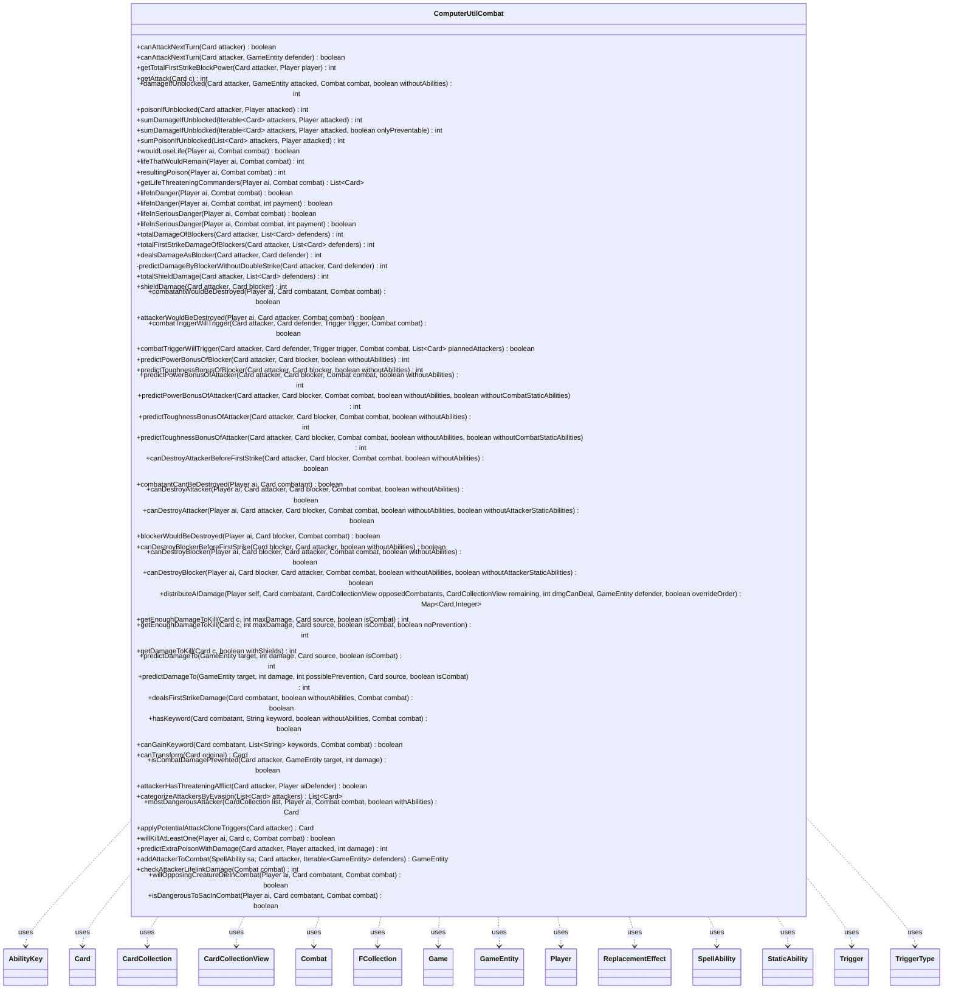

---
aliases:
  - ComputerUtilCombat
tags:
  - java/class
  - module/forge-ai
  - pkg/forge/ai
fqn: forge.ai.ComputerUtilCombat
package: forge.ai
module: forge-ai
kind: Class
---

# ComputerUtilCombat

**Package:** `forge.ai`   **Module:** `forge-ai`   **Kind:** Class



## Relationships
**Uses:**
- [[forge.game.Game|Game]]
- [[forge.game.GameEntity|GameEntity]]
- [[forge.game.ability.AbilityKey|AbilityKey]]
- [[forge.game.card.Card|Card]]
- [[forge.game.card.CardCollection|CardCollection]]
- [[forge.game.card.CardCollectionView|CardCollectionView]]
- [[forge.game.combat.Combat|Combat]]
- [[forge.game.player.Player|Player]]
- [[forge.game.replacement.ReplacementEffect|ReplacementEffect]]
- [[forge.game.spellability.SpellAbility|SpellAbility]]
- [[forge.game.staticability.StaticAbility|StaticAbility]]
- [[forge.game.trigger.Trigger|Trigger]]
- [[forge.game.trigger.TriggerType|TriggerType]]
- [[forge.util.collect.FCollection|FCollection]]


## Design Description

The class already has a complete, well-written Design Description in the note. Here is a concise version:

ComputerUtilCombat is a stateless utility class — composed entirely of static methods — that supplies the forge-ai module with combat-math and combat-prediction routines. It has no supertype or interface; rather than modeling combat, it reasons over a `Combat` to forecast the outcomes the AI needs before committing to attacks, blocks, or sacrifices: damage and poison if unblocked, whether a player's life is in danger, whether a given attacker or blocker would be destroyed, and how an attacker's damage should be distributed.

To do this it collaborates broadly with the game model — `Card`, `Player`, `GameEntity`, `Combat`, `Trigger`/`TriggerType`, `StaticAbility`, and `ReplacementEffect` — simulating keywords, triggered and activated pump abilities, and damage-prevention layers to predict power/toughness swings without mutating game state. Notable design intent includes numerous hard-coded card special cases, conservative "would-survive" heuristics, and AI-profile-driven danger thresholds, reflecting a pragmatic, approximation-first approach to combat evaluation.

## Source
`forge-ai/src/main/java/forge/ai/ComputerUtilCombat.java`

```java
/*
 * Forge: Play Magic: the Gathering.
 * Copyright (C) 2011  Forge Team
 *
 * This program is free software: you can redistribute it and/or modify
 * it under the terms of the GNU General Public License as published by
 * the Free Software Foundation, either version 3 of the License, or
 * (at your option) any later version.
 *
 * This program is distributed in the hope that it will be useful,
 * but WITHOUT ANY WARRANTY; without even the implied warranty of
 * MERCHANTABILITY or FITNESS FOR A PARTICULAR PURPOSE.  See the
 * GNU General Public License for more details.
 *
 * You should have received a copy of the GNU General Public License
 * along with this program.  If not, see <http://www.gnu.org/licenses/>.
 */
package forge.ai;

import com.google.common.collect.Iterables;
import com.google.common.collect.Lists;
import com.google.common.collect.Maps;
import forge.game.Game;
import forge.game.GameEntity;
import forge.game.ability.AbilityKey;
import forge.game.ability.AbilityUtils;
import forge.game.ability.ApiType;
import forge.game.card.*;
import forge.game.combat.AttackingBand;
import forge.game.combat.Combat;
import forge.game.combat.CombatUtil;
import forge.game.cost.CostPayment;
import forge.game.keyword.Keyword;
import forge.game.phase.PhaseType;
import forge.game.player.Player;
import forge.game.replacement.ReplacementEffect;
import forge.game.replacement.ReplacementLayer;
import forge.game.replacement.ReplacementType;
import forge.game.spellability.SpellAbility;
import forge.game.staticability.StaticAbility;
import forge.game.staticability.StaticAbilityAssignCombatDamageAsUnblocked;
import forge.game.staticability.StaticAbilityMode;
import forge.game.staticability.StaticAbilityMustAttack;
import forge.game.trigger.Trigger;
import forge.game.trigger.TriggerType;
import forge.game.zone.ZoneType;
import forge.util.IterableUtil;
import forge.util.MyRandom;
import forge.util.TextUtil;
import forge.util.collect.FCollection;

import java.util.List;
import java.util.Map;


/**
 * <p>
 * ComputerCombatUtil class.
 * </p>
 *
 * @author Forge
 * @version $Id: ComputerUtil.java 19179 2013-01-25 18:48:29Z Max mtg  $
 */
public class ComputerUtilCombat {

    /**
     * <p>
     * canAttackNextTurn.
     * </p>
     *
     * @param attacker
     *            a {@link forge.game.card.Card} object.
     * @return a boolean.
     */
    public static boolean canAttackNextTurn(final Card attacker) {
        final Iterable<GameEntity> defenders = CombatUtil.getAllPossibleDefenders(attacker.getController());
        return IterableUtil.any(defenders, input -> canAttackNextTurn(attacker, input));
    }

    /**
     * <p>
     * canAttackNextTurn.
     * </p>
     *
     * @param attacker
     *            a {@link forge.game.card.Card} object.
     * @param defender
     *            the defending {@link GameEntity}.
     * @return a boolean.
     */
    public static boolean canAttackNextTurn(final Card attacker, final GameEntity defender) {
        if (!attacker.isCreature()) {
            return false;
        }
        if (!CombatUtil.canAttackNextTurn(attacker, defender)) {
            return false;
        }

        if (attacker.getGame().getReplacementHandler().wouldPhaseBeSkipped(attacker.getController(), PhaseType.COMBAT_BEGIN)) {
            return false;
        }

        final List<GameEntity> mustAttack = StaticAbilityMustAttack.entitiesMustAttack(attacker);
        //if it contains only attacker, it only has a non-specific must attack
        mustAttack.removeAll(new CardCollection(attacker));
        if (!mustAttack.isEmpty() && !mustAttack.contains(defender)) {
            return false;
        }

        // TODO this should be a factor but needs some alignment with AttachAi
        //boolean leavesPlay = !ComputerUtilCard.hasActiveUndyingOrPersist(attacker)
        //        && ((attacker.hasKeyword(Keyword.VANISHING) && attacker.getCounters(CounterEnumType.TIME) == 1)
        //        || (attacker.hasKeyword(Keyword.FADING) && attacker.getCounters(CounterEnumType.FADE) == 0)
        //        || attacker.hasSVar("EndOfTurnLeavePlay"));
        // The creature won't untap next turn
        return !attacker.isTapped() || (attacker.getCounters(CounterEnumType.STUN) == 0 && attacker.canUntap(attacker.getController(), true));
    }

    /**
     * <p>
     * getTotalFirstStrikeBlockPower.
     * </p>
     *
     * @param attacker
     *            a {@link forge.game.card.Card} object.
     * @param player
     *            a {@link forge.game.player.Player} object.
     * @return a int.
     */
    public static int getTotalFirstStrikeBlockPower(final Card attacker, final Player player) {
        List<Card> list = player.getCreaturesInPlay();
        list = CardLists.filter(list, c -> (c.hasFirstStrike() || c.hasDoubleStrike()) && CombatUtil.canBlock(attacker, c));

        return totalFirstStrikeDamageOfBlockers(attacker, list);
    }

    // This function takes Doran and Double Strike into account
    /**
     * <p>
     * getAttack.
     * </p>
     *
     * @param c
     *            a {@link forge.game.card.Card} object.
     * @return a int.
     */
    public static int getAttack(final Card c) {
        int n = c.getNetCombatDamage();

        if (c.hasDoubleStrike()) {
            n *= 2;
        }

        return n;
    }

    // Returns the damage an unblocked attacker would deal
    /**
     * <p>
     * damageIfUnblocked.
     * </p>
     *
     * @param attacker
     *            a {@link forge.game.card.Card} object.
     * @param attacked
     *            a {@link forge.game.player.Player} object.
     * @param combat
     *            a {@link forge.game.combat.Combat} object.
     * @return a int.
     */
    public static int damageIfUnblocked(final Card attacker, final GameEntity attacked, final Combat combat, boolean withoutAbilities) {
        int damage = attacker.getNetCombatDamage();
        int sum = 0;
        if (attacked instanceof Player p && !p.canLoseLife()) {
            return 0;
        }

        if (!attacker.hasKeyword(Keyword.INFECT)) {
            // ask ReplacementDamage directly
            if (isCombatDamagePrevented(attacker, attacked, damage)) {
                return 0;
            }

            damage += predictPowerBonusOfAttacker(attacker, null, combat, withoutAbilities);
            sum = predictDamageTo(attacked, damage, attacker, true);
            if (attacker.hasDoubleStrike()) {
                sum *= 2;
            }
        }
        return sum;
    }

    // Returns the poison an unblocked attacker would deal
    /**
     * <p>
     * poisonIfUnblocked.
     * </p>
     *
     * @param attacker
     *            a {@link forge.game.card.Card} object.
     * @param attacked
     *            a {@link forge.game.player.Player} object.
     * @return a int.
     */
    public static int poisonIfUnblocked(final Card attacker, final Player attacked) {
        if (!attacked.canReceiveCounters(CounterEnumType.POISON)) {
            return 0;
        }
        int damage = attacker.getNetCombatDamage() +
                predictPowerBonusOfAttacker(attacker, null, null, false);
        int poison = 0;
        if (attacker.isInfectDamage(attacked)) {
            int pd = predictDamageTo(attacked, damage, attacker, true);
            // opponent can always order it so that he gets 0
            if (pd > 1 || !attacker.getController().getOpponents().getCardsIn(ZoneType.Battlefield).anyMatch(CardPredicates.nameEquals("Vorinclex, Monstrous Raider"))) {
                poison = pd;
                if (attacker.hasDoubleStrike()) {
                    poison *= 2;
                }
            }
        }
        if (damage > 0) {
            poison += predictExtraPoisonWithDamage(attacker, attacked, damage);
        }
        return poison;
    }

    // Returns the damage unblocked attackers would deal
    /**
     * <p>
     * sumDamageIfUnblocked.
     * </p>
     *
     * @param attackers
     * @param attacked
     *            a {@link forge.game.player.Player} object.
     * @return a int.
     */
    public static int sumDamageIfUnblocked(final Iterable<Card> attackers, final Player attacked) {
        return sumDamageIfUnblocked(attackers, attacked, false);
    }
    public static int sumDamageIfUnblocked(final Iterable<Card> attackers, final Player attacked, boolean onlyPreventable) {
        int sum = 0;
        for (final Card attacker : attackers) {
            if (onlyPreventable && !attacker.canDamagePrevented(true)) {
                continue;
            }
            // TODO always applies full prevention shields for each, so this might wrongly lower the result
            sum += damageIfUnblocked(attacker, attacked, null, false);
        }
        return sum;
    }

    // Returns the number of poison counters unblocked attackers would deal
    /**
     * <p>
     * sumPoisonIfUnblocked.
     * </p>
     *
     * @param attackers
     * @param attacked
     *            a {@link forge.game.player.Player} object.
     * @return a int.
     */
    public static int sumPoisonIfUnblocked(final List<Card> attackers, final Player attacked) {
        int sum = 0;
        for (final Card attacker : attackers) {
            sum += poisonIfUnblocked(attacker, attacked);
        }
        return sum;
    }

    // Checks if the life of the attacked Player would be reduced
    /**
     * <p>
     * wouldLoseLife.
     * </p>
     *
     * @param combat
     *            a {@link forge.game.combat.Combat} object.
     * @return a boolean.
     */
    public static boolean wouldLoseLife(final Player ai, final Combat combat) {
        return lifeThatWouldRemain(ai, combat) < ai.getLife();
    }

    // calculates the amount of life that will remain after the attack
    /**
     * <p>
     * lifeThatWouldRemain.
     * </p>
     *
     * @param combat
     *            a {@link forge.game.combat.Combat} object.
     * @return a int.
     */
    public static int lifeThatWouldRemain(final Player ai, final Combat combat) {
        int damage = 0;

        if (ai.canLoseLife()) {
            final List<Card> attackers = combat.getAttackersOf(ai);
            final List<Card> unblocked = Lists.newArrayList();

            for (final Card attacker : attackers) {
                final List<Card> blockers = combat.getBlockers(attacker);

                if (blockers.size() == 0
                        || StaticAbilityAssignCombatDamageAsUnblocked.assignCombatDamageAsUnblocked(attacker)) {
                    unblocked.add(attacker);
                } else if (attacker.hasKeyword(Keyword.TRAMPLE) && !attacker.hasKeyword(Keyword.INFECT)) {
                    int dmgAfterShielding = getAttack(attacker) - totalShieldDamage(attacker, blockers);
                    if (dmgAfterShielding > 0) {
                        damage += dmgAfterShielding;
                    }
                }
            }

            damage += sumDamageIfUnblocked(unblocked, ai);
        }

        return ai.getLife() - damage;
    }

    // calculates the amount of poison counters after the attack
    /**
     * <p>
     * resultingPoison.
     * </p>
     *
     * @param combat
     *            a {@link forge.game.combat.Combat} object.
     * @return a int.
     */
    public static int resultingPoison(final Player ai, final Combat combat) {
        // ai can't get poison counters, so the value can't change
        if (!ai.canReceiveCounters(CounterEnumType.POISON)) {
            return ai.getPoisonCounters();
        }

        int poison = 0;

        final List<Card> attackers = combat.getAttackersOf(ai);
        final List<Card> unblocked = Lists.newArrayList();

        for (final Card attacker : attackers) {
            final List<Card> blockers = combat.getBlockers(attacker);

            if (blockers.isEmpty()
                    || StaticAbilityAssignCombatDamageAsUnblocked.assignCombatDamageAsUnblocked(attacker)) {
                unblocked.add(attacker);
            } else if (attacker.hasKeyword(Keyword.TRAMPLE)) {
                int trampleDamage = getAttack(attacker) - totalShieldDamage(attacker, blockers);
                if (trampleDamage > 0) {
                    if (attacker.isInfectDamage(ai)) {
                        poison += trampleDamage;
                    }
                    poison += predictExtraPoisonWithDamage(attacker, ai, trampleDamage);
                }
            }
        }

        poison += sumPoisonIfUnblocked(unblocked, ai);

        return ai.getPoisonCounters() + poison;
    }

    public static List<Card> getLifeThreateningCommanders(final Player ai, final Combat combat) {
        List<Card> res = Lists.newArrayList();
        for (Card c : combat.getAttackers()) {
            if (c.isCommander() && combat.isAttacking(c, ai)) {
                int currentCommanderDamage = ai.getCommanderDamage(c);
                if (damageIfUnblocked(c, ai, combat, false) + currentCommanderDamage >= 21) {
                    res.add(c);
                }
            }
        }
        return res;
    }

    /**
     * <p>
     * lifeInDanger.
     * </p>
     *
     * @param combat
     *            a {@link forge.game.combat.Combat} object.
     * @return boolean true if life/poison changes and will be in dangerous range as specified by AI profile.
     */
    public static boolean lifeInDanger(final Player ai, final Combat combat) {
        return lifeInDanger(ai, combat, 0);
    }
    public static boolean lifeInDanger(final Player ai, final Combat combat, final int payment) {
        // life in danger only cares about the player's life. Not Planeswalkers' life
        if (ai.cantLose() || combat == null || combat.getAttackingPlayer() == ai) {
            return false;
        }

        // TODO check for replacement effect instead
        CardCollectionView otb = ai.getCardsIn(ZoneType.Battlefield);
        // Special cases:
        // AI can't lose in combat in presence of Worship (with creatures)
        if (otb.anyMatch(CardPredicates.nameEquals("Worship")) && !ai.getCreaturesInPlay().isEmpty()) {
            return false;
        }
        // AI can't lose in combat in presence of Elderscale Wurm (at 7 life or more)
        if (otb.anyMatch(CardPredicates.nameEquals("Elderscale Wurm")) && ai.getLife() >= 7) {
            return false;
        }

        // check for creatures that must be blocked
        final List<Card> attackers = combat.getAttackersOf(ai);

        final List<Card> threateningCommanders = getLifeThreateningCommanders(ai, combat);

        for (final Card attacker : attackers) {
            final List<Card> blockers = combat.getBlockers(attacker);

            if (blockers.isEmpty()) {
                if (!attacker.getSVar("MustBeBlocked").isEmpty()) {
                    boolean cond = false;
                    String condVal = attacker.getSVar("MustBeBlocked");
                    boolean isAttackingPlayer = combat.getDefenderByAttacker(attacker) instanceof Player;

                    cond |= "true".equalsIgnoreCase(condVal);
                    cond |= "attackingplayer".equalsIgnoreCase(condVal) && isAttackingPlayer;
                    cond |= "attackingplayerconservative".equalsIgnoreCase(condVal) && isAttackingPlayer
                            && ai.getCreaturesInPlay().size() >= 3 && ai.getCreaturesInPlay().size() > attacker.getController().getCreaturesInPlay().size();

                    if (cond) {
                        return true;
                    }
                }
            }
            if (threateningCommanders.contains(attacker)) {
                return true;
            }
        }

        if (resultingPoison(ai, combat) > Math.max(7, ai.getPoisonCounters())) {
            return true;
        }

        int threshold = AiProfileUtil.getIntProperty(ai, AiProps.AI_IN_DANGER_THRESHOLD);
        int maxTreshold = AiProfileUtil.getIntProperty(ai, AiProps.AI_IN_DANGER_MAX_THRESHOLD) - threshold;
        int chance = MyRandom.getRandom().nextInt(80) + 5;
        while (maxTreshold > 0) {
            if (MyRandom.getRandom().nextInt(100) < chance) {
                threshold++;
            }
            maxTreshold--;
        }

        return !ai.cantLoseForZeroOrLessLife() && lifeThatWouldRemain(ai, combat) - payment < Math.min(threshold, ai.getLife());
    }

    /**
     * <p>
     * lifeInSeriousDanger.
     * </p>
     *
     * @param combat
     *            a {@link forge.game.combat.Combat} object.
     * @return boolean - true if player would lose.
     */
    public static boolean lifeInSeriousDanger(final Player ai, final Combat combat) {
        return lifeInSeriousDanger(ai, combat, 0);
    }
    public static boolean lifeInSeriousDanger(final Player ai, final Combat combat, final int payment) {
        // life in danger only cares about the player's life. Not about a Planeswalkers life
        if (ai.cantLose() || combat == null) {
            return false;
        }

        final List<Card> threateningCommanders = getLifeThreateningCommanders(ai, combat);

        // check for creatures that must be blocked
        final List<Card> attackers = combat.getAttackersOf(ai);

        for (final Card attacker : attackers) {
            final List<Card> blockers = combat.getBlockers(attacker);

            if (blockers.isEmpty()) {
                if (!attacker.getSVar("MustBeBlocked").isEmpty()) {
                    return true;
                }
            }
            if (threateningCommanders.contains(attacker)) {
                return true;
            }
        }

        if (resultingPoison(ai, combat) >= ai.getGame().getRules().getPoisonCountersToLose()) {
            return true;
        }

        return !ai.cantLoseForZeroOrLessLife() && lifeThatWouldRemain(ai, combat) - payment < 1;
    }

    // This calculates the amount of damage a blockgang can deal to the attacker
    // (first strike not supported)
    /**
     * <p>
     * totalDamageOfBlockers.
     * </p>
     *
     * @param attacker
     *            a {@link forge.game.card.Card} object.
     * @param defenders
     * @return a int.
     */
    public static int totalDamageOfBlockers(final Card attacker, final List<Card> defenders) {
        int damage = 0;

        if (attacker.isEquippedBy("Godsend") && !defenders.isEmpty()) {
            defenders.remove(0);
        }

        for (final Card defender : defenders) {
            damage += dealsDamageAsBlocker(attacker, defender);
        }
        return damage;
    }
    /**
     * Overload of totalDamageOfBlockers() for first-strike damage only.
     * @param attacker creature to be blocked
     * @param defenders first-strike blockers
     * @return sum of first-strike damage from blockers
     */
    public static int totalFirstStrikeDamageOfBlockers(final Card attacker, final List<Card> defenders) {
        int damage = 0;

        if (attacker.isEquippedBy("Godsend") && !defenders.isEmpty()) {
            defenders.remove(0);
        }

        for (final Card defender : defenders) {
            damage += predictDamageByBlockerWithoutDoubleStrike(attacker, defender);
        }
        return damage;
    }

    // This calculates the amount of damage a blocker in a blockgang can deal to the attacker
    /**
     * <p>
     * dealsDamageAsBlocker.
     * </p>
     *
     * @param attacker
     *            a {@link forge.game.card.Card} object.
     * @param defender
     *            a {@link forge.game.card.Card} object.
     * @return a int.
     */
    public static int dealsDamageAsBlocker(final Card attacker, final Card defender) {
        int defenderDamage = predictDamageByBlockerWithoutDoubleStrike(attacker, defender);

        if (defender.hasDoubleStrike()) {
            defenderDamage += predictDamageTo(attacker, defenderDamage, defender, true);
        }

        return defenderDamage;
    }

    /**
     * Predicts the damage to an attacker by a defending creature without double-strike.
     * @param attacker
     * @param defender
     * @return
     */
    private static int predictDamageByBlockerWithoutDoubleStrike(final Card attacker, final Card defender) {
        if (attacker.getName().equals("Sylvan Basilisk") && !defender.hasKeyword(Keyword.INDESTRUCTIBLE)) {
            return 0;
        }

        int flankingMagnitude = 0;
        if (attacker.hasKeyword(Keyword.FLANKING) && !defender.hasKeyword(Keyword.FLANKING)) {
            flankingMagnitude = attacker.getAmountOfKeyword(Keyword.FLANKING);

            if (flankingMagnitude >= defender.getNetToughness()) {
                return 0;
            }
            if (flankingMagnitude >= defender.getNetToughness() - defender.getDamage()
                    && !defender.hasKeyword(Keyword.INDESTRUCTIBLE)) {
                return 0;
            }

        } // flanking
        if (attacker.hasKeyword(Keyword.INDESTRUCTIBLE) && !defender.isWitherDamage()) {
            return 0;
        }

        int defenderDamage;
        if (defender.toughnessAssignsDamage()) {
            defenderDamage = defender.getNetToughness() + predictToughnessBonusOfBlocker(attacker, defender, true);
        } else {
        	defenderDamage = defender.getNetPower() + predictPowerBonusOfBlocker(attacker, defender, true);
        }

        // consider static Damage Prevention
        defenderDamage = predictDamageTo(attacker, defenderDamage, defender, true);
        return defenderDamage;
    }

    // This calculates the amount of damage a blocker in a blockgang can take
    // from the attacker (for trampling attackers)
    /**
     * <p>
     * totalShieldDamage.
     * </p>
     *
     * @param attacker
     *            a {@link forge.game.card.Card} object.
     * @param defenders
     * @return a int.
     */
    public static int totalShieldDamage(final Card attacker, final List<Card> defenders) {
        int defenderDefense = 0;

        for (final Card defender : defenders) {
            defenderDefense += shieldDamage(attacker, defender);
        }

        return defenderDefense;
    }

    // This calculates the amount of damage a blocker in a blockgang can take
    // from the attacker (for trampling attackers)
    /**
     * <p>
     * shieldDamage.
     * </p>
     *
     * @param attacker
     *            a {@link forge.game.card.Card} object.
     * @param blocker
     *            a {@link forge.game.card.Card} object.
     * @return a int.
     */
    public static int shieldDamage(final Card attacker, final Card blocker) {
        if (canDestroyBlockerBeforeFirstStrike(blocker, attacker, false)) {
        	return 0;
        }

        int flankingMagnitude = 0;
        if (attacker.hasKeyword(Keyword.FLANKING) && !blocker.hasKeyword(Keyword.FLANKING)) {
            flankingMagnitude = attacker.getAmountOfKeyword(Keyword.FLANKING);

            if (flankingMagnitude >= blocker.getNetToughness()) {
                return 0;
            }
            if (flankingMagnitude >= blocker.getNetToughness() - blocker.getDamage()
                    && !blocker.hasKeyword(Keyword.INDESTRUCTIBLE)) {
                return 0;
            }
        } // flanking

        final int defBushidoMagnitude = blocker.getKeywordMagnitude(Keyword.BUSHIDO);

        final int defenderDefense = blocker.getLethalDamage() - flankingMagnitude + defBushidoMagnitude;

        return defenderDefense;
    }

    // For AI safety measures like Regeneration
    /**
     * <p>
     * combatantWouldBeDestroyed.
     * </p>
     * @param ai
     *
     * @param combatant
     *            a {@link forge.game.card.Card} object.
     * @return a boolean.
     */
    public static boolean combatantWouldBeDestroyed(Player ai, final Card combatant, Combat combat) {
        if (combat.isAttacking(combatant)) {
            return attackerWouldBeDestroyed(ai, combatant, combat);
        }
        if (combat.isBlocking(combatant)) {
            return blockerWouldBeDestroyed(ai, combatant, combat);
        }
        return false;
    }

    // For AI safety measures like Regeneration
    /**
     * <p>
     * attackerWouldBeDestroyed.
     * </p>
     * @param ai
     *
     * @param attacker
     *            a {@link forge.game.card.Card} object.
     * @return a boolean.
     */
    public static boolean attackerWouldBeDestroyed(Player ai, final Card attacker, Combat combat) {
        final List<Card> blockers = combat.getBlockers(attacker);
        int firstStrikeBlockerDmg = 0;

        for (final Card defender : blockers) {
            if (!defender.isWitherDamage() && canDestroyAttacker(ai, attacker, defender, combat, true)) {
                return true;
            }
            if (defender.hasFirstStrike() || defender.hasDoubleStrike()) {
                firstStrikeBlockerDmg += defender.getNetCombatDamage();
            }
        }

        // Consider first strike and double strike
        if (attacker.hasFirstStrike() || attacker.hasDoubleStrike()) {
            return firstStrikeBlockerDmg >= getDamageToKill(attacker, true);
        }

        return totalDamageOfBlockers(attacker, blockers) >= getDamageToKill(attacker, false);
    }

    /**
     * <p>
     * combatTriggerWillTrigger.
     * </p>
     *
     * @param attacker
     *            a {@link forge.game.card.Card} object.
     * @param defender
     *            a {@link forge.game.card.Card} object.
     * @param trigger
     *            a {@link forge.game.trigger.Trigger} object.
     * @param combat
     *            a {@link forge.game.combat.Combat} object.
     * @return a boolean.
     */
    public static boolean combatTriggerWillTrigger(final Card attacker, final Card defender, final Trigger trigger,
            Combat combat) {
        return combatTriggerWillTrigger(attacker, defender, trigger, combat, null);
    }
    public static boolean combatTriggerWillTrigger(final Card attacker, final Card defender, final Trigger trigger,
            Combat combat, final List<Card> plannedAttackers) {
        final Game game = attacker.getGame();
        boolean willTrigger = false;
        final Card source = trigger.getHostCard();
        if (combat == null) {
            combat = game.getCombat();
            if (combat == null) {
                return false;
            }
        }

        if (!trigger.zonesCheck(game.getZoneOf(trigger.getHostCard()))) {
            return false;
        }
        if (!trigger.requirementsCheck(game)) {
            return false;
        }

        TriggerType mode = trigger.getMode();
        if (mode == TriggerType.Attacks) {
            willTrigger = true;
            if (combat.isAttacking(attacker)) {
                return false; // The trigger should have triggered already
            }
            if (trigger.hasParam("ValidCard")) {
                if (!trigger.matchesValidParam("ValidCard", attacker)
                        && !(combat.isAttacking(source) && trigger.matchesValidParam("ValidCard", source)
                            && !trigger.hasParam("Alone"))) {
                    return false;
                }
            }
            if (trigger.hasParam("Attacked")) {
                if (combat.isAttacking(attacker)) {
                    if (!trigger.matchesValidParam("Attacked", combat.getDefenderByAttacker(attacker))) {
                        return false;
                    }
                } else {
                    if ("You,Planeswalker.YouCtrl".equals(trigger.getParam("Attacked"))) {
                        if (source.getController() == attacker.getController()) {
                            return false;
                        }
                    }
                }
            }
            if (trigger.hasParam("Alone") && plannedAttackers != null && plannedAttackers.size() != 1) {
                return false; // won't trigger since the AI is planning to attack with more than one creature
            }
        }

        // defender == null means unblocked
        if (defender == null && mode == TriggerType.AttackerUnblocked) {
            willTrigger = true;
            if (!trigger.matchesValidParam("ValidCard", attacker)) {
                return false;
            }
        }

        if (defender == null) {
            return willTrigger;
        }

        if (mode == TriggerType.Blocks) {
            willTrigger = true;
            if (trigger.hasParam("ValidBlocked")) {
                String validBlocked = trigger.getParam("ValidBlocked");
                if (validBlocked.contains(".withLesserPower")) {
                    // Have to check this restriction here as triggering objects aren't set yet, so
                    // ValidBlocked$Creature.powerLTX where X:TriggeredBlocker$CardPower crashes with NPE
                    validBlocked = TextUtil.fastReplace(validBlocked, ".withLesserPower", "");
                    if (defender.getCurrentPower() <= attacker.getCurrentPower()) {
                        return false;
                    }
                }
                if (!trigger.matchesValid(attacker, validBlocked.split(","))) {
                    return false;
                }
            }
            if (trigger.hasParam("ValidCard")) {
                String validBlocker = trigger.getParam("ValidCard");
                if (validBlocker.contains(".withLesserPower")) {
                    // Have to check this restriction here as triggering objects aren't set yet, so
                    // ValidCard$Creature.powerLTX where X:TriggeredAttacker$CardPower crashes with NPE
                    validBlocker = TextUtil.fastReplace(validBlocker, ".withLesserPower", "");
                    if (defender.getCurrentPower() >= attacker.getCurrentPower()) {
                        return false;
                    }
                }
                if (!trigger.matchesValid(defender, validBlocker.split(","))) {
                    return false;
                }
            }
        } else if (mode == TriggerType.AttackerBlocked || mode == TriggerType.AttackerBlockedByCreature) {
            willTrigger = true;
            if (!trigger.matchesValidParam("ValidBlocker", defender)) {
                return false;
            }
            if (!trigger.matchesValidParam("ValidCard", attacker)) {
                return false;
            }
        } else if (mode == TriggerType.DamageDone) {
            willTrigger = true;
            if (trigger.hasParam("ValidSource") && !"False".equals(trigger.getParam("CombatDamage"))) {
                if (!(trigger.matchesValidParam("ValidSource", defender)
                        && defender.getNetCombatDamage() > 0
                        && trigger.matchesValidParam("ValidTarget", attacker))) {
                    return false;
                }
                if (!(trigger.matchesValidParam("ValidSource", attacker)
                        && attacker.getNetCombatDamage() > 0
                        && trigger.matchesValidParam("ValidTarget", defender))) {
                    return false;
                }
            }
        }

        return willTrigger;
    }

    // Predict the Power bonus of the blocker if blocking the attacker
    // (Flanking, Bushido and other triggered abilities)
    /**
     * <p>
     * predictPowerBonusOfBlocker.
     * </p>
     *
     * @param attacker
     *            a {@link forge.game.card.Card} object.
     * @param blocker
     *            a {@link forge.game.card.Card} object.
     * @return a int.
     */
    public static int predictPowerBonusOfBlocker(final Card attacker, final Card blocker, boolean withoutAbilities) {
        int power = 0;

        // Serene Master switches power with attacker
        if (blocker.getName().equals("Serene Master")) {
            power += attacker.getNetPower() - blocker.getNetPower();
        } else if (blocker.getName().equals("Shape Stealer")) {
            power += attacker.getNetPower() - blocker.getNetPower();
        }

        // if the attacker has first strike and wither the blocker will deal
        // less damage than expected
        if (dealsFirstStrikeDamage(attacker, withoutAbilities, null)
                && attacker.isWitherDamage()
                && !dealsFirstStrikeDamage(blocker, withoutAbilities, null)
                && blocker.canReceiveCounters(CounterEnumType.M1M1)) {
            power -= attacker.getNetCombatDamage();
        }

        final Game game = attacker.getGame();
        // look out for continuous static abilities that only care for blocking creatures
        final CardCollectionView cardList = CardCollection.combine(game.getCardsIn(ZoneType.Battlefield), game.getCardsIn(ZoneType.Command));
        for (final Card card : cardList) {
            for (final StaticAbility stAb : card.getStaticAbilities()) {
                if (!stAb.checkMode(StaticAbilityMode.Continuous)) {
                    continue;
                }
                if (!stAb.hasParam("Affected") || !stAb.getParam("Affected").contains("blocking")) {
                    continue;
                }
                final String valid = TextUtil.fastReplace(stAb.getParam("Affected"), "blocking", "Creature");
                if (!blocker.isValid(valid, card.getController(), card, stAb)) {
                    continue;
                }
                if (stAb.hasParam("AddPower")) {
                    power += AbilityUtils.calculateAmount(card, stAb.getParam("AddPower"), stAb);
                }
            }
        }

        final FCollection<Trigger> theTriggers = new FCollection<>();
        for (Card card : game.getCardsIn(ZoneType.Battlefield)) {
            theTriggers.addAll(card.getTriggers());
        }
        for (Card card : game.getCardsIn(ZoneType.Command)) {
            theTriggers.addAll(card.getTriggers());
        }
        theTriggers.addAll(attacker.getTriggers());
        for (final Trigger trigger : theTriggers) {
            final Card source = trigger.getHostCard();

            if (!combatTriggerWillTrigger(attacker, blocker, trigger, null)) {
                continue;
            }

            SpellAbility sa = trigger.ensureAbility();
            if (sa == null) {
                continue;
            }

            if (!ApiType.Pump.equals(sa.getApi())) {
                continue;
            }

            if (sa.usesTargeting()) {
                continue;
            }

            if (!sa.hasParam("NumAtt")) {
                continue;
            }

            String defined = sa.getParam("Defined");
            final List<Card> list = AbilityUtils.getDefinedCards(source, defined, sa);
            if (defined != null && defined.startsWith("TriggeredBlocker")) {
                list.add(blocker);
            }
            if (!list.contains(blocker)) {
                continue;
            }

            power += AbilityUtils.calculateAmount(source, sa.getParam("NumAtt"), sa, true);
        }
        if (withoutAbilities) {
            return power;
        }
        for (SpellAbility ability : blocker.getAllSpellAbilities()) {
            if (!ability.isActivatedAbility()) {
                continue;
            }
            if (ability.hasParam("ActivationPhases") || ability.hasParam("SorcerySpeed") || ability.hasParam("ActivationZone")) {
                continue;
            }
            if (ability.usesTargeting() && !ability.canTarget(blocker)) {
                continue;
            }

            int pBonus = 0;
            if (ability.getApi() == ApiType.Pump) {
                if (!ability.hasParam("NumAtt")) {
                    continue;
                }

                pBonus = AbilityUtils.calculateAmount(ability.getHostCard(), ability.getParam("NumAtt"), ability);
            } else if (ability.getApi() == ApiType.PutCounter) {
                if (!ability.hasParam("CounterType") || !ability.getParam("CounterType").equals("P1P1")) {
                    continue;
                }

                if (ability.hasParam("Monstrosity") && blocker.isMonstrous()) {
                    continue;
                }

                if (ability.hasParam("Adapt") && blocker.getCounters(CounterEnumType.P1P1) > 0) {
                    continue;
                }

                pBonus = AbilityUtils.calculateAmount(ability.getHostCard(), ability.getParamOrDefault("CounterNum", "1"), ability);
            }

            if (pBonus > 0 && ComputerUtilCost.canPayCost(ability, blocker.getController(), false)) {
                power += pBonus;
            }
        }

        return power;
    }

    // Predict the Toughness bonus of the blocker if blocking the attacker
    // (Flanking, Bushido and other triggered abilities)
    /**
     * <p>
     * predictToughnessBonusOfBlocker.
     * </p>
     *
     * @param attacker
     *            a {@link forge.game.card.Card} object.
     * @param blocker
     *            a {@link forge.game.card.Card} object.
     * @return a int.
     */
    public static int predictToughnessBonusOfBlocker(final Card attacker, final Card blocker, boolean withoutAbilities) {
        int toughness = 0;

        if (blocker.getName().equals("Shape Stealer")) {
            toughness += attacker.getNetToughness() - blocker.getNetToughness();
        }

        final Game game = attacker.getGame();
        final FCollection<Trigger> theTriggers = new FCollection<>();
        for (Card card : game.getCardsIn(ZoneType.Battlefield)) {
            theTriggers.addAll(card.getTriggers());
        }
        for (Card card : game.getCardsIn(ZoneType.Command)) {
            theTriggers.addAll(card.getTriggers());
        }
        theTriggers.addAll(attacker.getTriggers());
        for (final Trigger trigger : theTriggers) {
            final Card source = trigger.getHostCard();

            if (!combatTriggerWillTrigger(attacker, blocker, trigger, null)) {
                continue;
            }

            SpellAbility sa = trigger.ensureAbility();
            if (sa == null) {
                continue;
            }

            final String defined = sa.getParam("Defined");

            // DealDamage triggers
            if (ApiType.DealDamage.equals(sa.getApi())) {
                if (defined == null || !defined.startsWith("TriggeredBlocker")) {
                    continue;
                }
                int damage = AbilityUtils.calculateAmount(source, sa.getParam("NumDmg"), sa);
                toughness -= predictDamageTo(blocker, damage, source, false);
            } else

            // -1/-1 PutCounter triggers
            if (ApiType.PutCounter.equals(sa.getApi())) {
                if (defined == null || !defined.startsWith("TriggeredBlocker")) {
                    continue;
                }
                if (!"M1M1".equals(sa.getParam("CounterType"))) {
                    continue;
                }
                toughness -= AbilityUtils.calculateAmount(source, sa.getParamOrDefault("CounterNum", "1"), sa);
            } else

            // Pump triggers
            if (ApiType.Pump.equals(sa.getApi())) {
                if (sa.usesTargeting()) {
                    continue; // targeted pumping not supported
                }
                final List<Card> list = AbilityUtils.getDefinedCards(source, defined, null);
                if (defined != null && defined.startsWith("TriggeredBlocker")) {
                    list.add(blocker);
                }
                if (list.isEmpty() || !list.contains(blocker)) {
                    continue;
                }
                if (!sa.hasParam("NumDef")) {
                    continue;
                }

                toughness += AbilityUtils.calculateAmount(source, sa.getParam("NumDef"), sa, true);
            }
        }
        if (withoutAbilities) {
            return toughness;
        }
        for (SpellAbility ability : blocker.getAllSpellAbilities()) {
            if (!ability.isActivatedAbility()) {
                continue;
            }

            if (ability.hasParam("ActivationPhases") || ability.hasParam("SorcerySpeed") || ability.hasParam("ActivationZone")) {
                continue;
            }
            if (ability.usesTargeting() && !ability.canTarget(blocker)) {
                continue;
            }

            int tBonus = 0;
            if (ability.getApi() == ApiType.Pump) {
                if (!ability.hasParam("NumDef")) {
                    continue;
                }

                tBonus = AbilityUtils.calculateAmount(ability.getHostCard(), ability.getParam("NumDef"), ability);
            } else if (ability.getApi() == ApiType.PutCounter) {
                if (!ability.hasParam("CounterType") || !ability.getParam("CounterType").equals("P1P1")) {
                    continue;
                }

                if (ability.hasParam("Monstrosity") && blocker.isMonstrous()) {
                    continue;
                }

                if (ability.hasParam("Adapt") && blocker.getCounters(CounterEnumType.P1P1) > 0) {
                    continue;
                }

                tBonus = AbilityUtils.calculateAmount(ability.getHostCard(), ability.getParamOrDefault("CounterNum", "1"), ability);
            }

            if (tBonus > 0 && ComputerUtilCost.canPayCost(ability, blocker.getController(), false)) {
                toughness += tBonus;
            }
        }
        return toughness;
    }

    // Predict the Power bonus of the blocker if blocking the attacker
    // (Flanking, Bushido and other triggered abilities)
    /**
     * <p>
     * predictPowerBonusOfAttacker.
     * </p>
     *
     * @param attacker
     *            a {@link forge.game.card.Card} object.
     * @param blocker
     *            a {@link forge.game.card.Card} object.
     * @param combat
     *            a {@link forge.game.combat.Combat} object.
     * @return a int.
     */
    public static int predictPowerBonusOfAttacker(final Card attacker, final Card blocker, final Combat combat, boolean withoutAbilities) {
        return predictPowerBonusOfAttacker(attacker, blocker, combat, withoutAbilities, false);
    }
    public static int predictPowerBonusOfAttacker(final Card attacker, final Card blocker, final Combat combat, boolean withoutAbilities, boolean withoutCombatStaticAbilities) {
        int power = 0;

        // Serene Master switches power with attacker
        if (blocker!= null && blocker.getName().equals("Serene Master")) {
            power += blocker.getNetPower() - attacker.getNetPower();
        } else if (blocker != null && attacker.getName().equals("Shape Stealer")) {
            power += blocker.getNetPower() - attacker.getNetPower();
        }

        final Game game = attacker.getGame();
        final FCollection<Trigger> theTriggers = new FCollection<>();
        for (Card card : game.getCardsIn(ZoneType.Battlefield)) {
            theTriggers.addAll(card.getTriggers());
        }
        for (Card card : game.getCardsIn(ZoneType.Command)) {
            theTriggers.addAll(card.getTriggers());
        }
        // if the defender has first strike and wither the attacker will deal
        // less damage than expected
        if (null != blocker) {
            if (dealsFirstStrikeDamage(blocker, withoutAbilities, combat)
                    && blocker.isWitherDamage()
                    && !dealsFirstStrikeDamage(attacker, withoutAbilities, combat)
                    && attacker.canReceiveCounters(CounterEnumType.M1M1)) {
                power -= blocker.getNetCombatDamage();
            }
            theTriggers.addAll(blocker.getTriggers());
        }

        // TODO consider Exert + Enlist

        // look out for continuous static abilities that only care for attacking creatures
        if (!withoutCombatStaticAbilities) {
            final CardCollectionView cardList = CardCollection.combine(game.getCardsIn(ZoneType.Battlefield), game.getCardsIn(ZoneType.Command));
            for (final Card card : cardList) {
                for (final StaticAbility stAb : card.getStaticAbilities()) {
                    if (!stAb.checkMode(StaticAbilityMode.Continuous)) {
                        continue;
                    }
                    if (!stAb.hasParam("Affected") || !stAb.getParam("Affected").contains("attacking")) {
                        continue;
                    }
                    final String valid = TextUtil.fastReplace(stAb.getParam("Affected"), "attacking", "Creature");
                    if (!attacker.isValid(valid, card.getController(), card, stAb)) {
                        continue;
                    }
                    if (stAb.hasParam("AddPower")) {
                        power += AbilityUtils.calculateAmount(card, stAb.getParam("AddPower"), stAb);
                    }
                }
            }
        }

        for (final Trigger trigger : theTriggers) {
            final Card source = trigger.getHostCard();

            if (!combatTriggerWillTrigger(attacker, blocker, trigger, combat)) {
                continue;
            }

            // Extra check for the Exalted trigger in case we're declaring more than one attacker
            if (combat != null && trigger.isKeyword(Keyword.EXALTED)) {
                if (!combat.getAttackers().isEmpty() && !combat.getAttackers().contains(attacker)) {
                    continue;
                }
            }

            SpellAbility sa = trigger.ensureAbility();
            if (sa == null) {
                continue;
            }

            if (sa.usesTargeting()) {
                continue; // targeted pumping not supported
            }

            if (!ApiType.Pump.equals(sa.getApi()) && !ApiType.PumpAll.equals(sa.getApi())) {
                continue;
            }

            if (!sa.hasParam("NumAtt")) {
                continue;
            }

            sa.setActivatingPlayer(source.getController());

            if (sa.hasParam("Cost")) {
                if (!CostPayment.canPayAdditionalCosts(sa.getPayCosts(), sa, true)) {
                    continue;
                }
            }

            List<Card> list = Lists.newArrayList();
            if (sa.hasParam("ValidCards")) {
                if (attacker.isValid(sa.getParam("ValidCards").split(","), source.getController(), source, null)
                        || attacker.isValid(sa.getParam("ValidCards").replace("attacking+", "").split(","),
                                source.getController(), source, null)) {
                    list.add(attacker);
                }
            } else {
                list = AbilityUtils.getDefinedCards(source, sa.getParam("Defined"), null);
            }
            if (sa.hasParam("Defined") && sa.getParam("Defined").startsWith("TriggeredAttacker")) {
                list.add(attacker);
            }
            if (!list.contains(attacker)) {
                continue;
            }

            String att = sa.getParam("NumAtt");
            if (att.startsWith("+")) {
                att = att.substring(1);
            }
            if (att.matches("[0-9][0-9]?") || att.matches("-" + "[0-9][0-9]?")) {
                power += Integer.parseInt(att);
            } else {
                String bonus = AbilityUtils.getSVar(sa, att);
                if (bonus.contains("Count$Valid Creature.blockingTriggeredAttacker")) {
                    bonus = TextUtil.fastReplace(bonus, "Count$Valid Creature.blockingTriggeredAttacker", "Number$1");
                } else if (bonus.contains("TriggeredPlayersDefenders$Amount")) { // for Melee
                    bonus = TextUtil.fastReplace(bonus, "TriggeredPlayersDefenders$Amount", "Number$1");
                } else if (bonus.contains("TriggeredAttacker$CardPower")) { // e.g. Arahbo, Roar of the World
                    bonus = TextUtil.fastReplace(bonus, "TriggeredAttacker$CardPower", TextUtil.concatNoSpace("Number$", String.valueOf(attacker.getNetPower())));
                } else if (bonus.contains("TriggeredAttacker$CardToughness")) {
                    bonus = TextUtil.fastReplace(bonus, "TriggeredAttacker$CardToughness", TextUtil.concatNoSpace("Number$", String.valueOf(attacker.getNetToughness())));
                }
                power += AbilityUtils.calculateAmount(source, bonus, sa);

            }
        }
        if (withoutAbilities) {
            return power;
        }
        for (SpellAbility ability : attacker.getAllSpellAbilities()) {
            if (!ability.isActivatedAbility()) {
                continue;
            }
            if (ability.hasParam("ActivationPhases") || ability.hasParam("SorcerySpeed") || ability.hasParam("ActivationZone")) {
                continue;
            }
            if (ability.usesTargeting() && !ability.canTarget(attacker)) {
                continue;
            }

            int pBonus = 0;
            if (ability.getApi() == ApiType.Pump) {
                if (!ability.hasParam("NumAtt")) {
                    continue;
                }

                if (ComputerUtilCost.isSacrificeSelfCost(ability.getPayCosts())) {
                    continue;
                }

                if (!ability.getPayCosts().hasTapCost()) {
                    pBonus = AbilityUtils.calculateAmount(ability.getHostCard(), ability.getParam("NumAtt"), ability);
                }
            } else if (ability.getApi() == ApiType.PutCounter) {
                if (!ability.hasParam("CounterType") || !ability.getParam("CounterType").equals("P1P1")) {
                    continue;
                }

                if (ability.hasParam("Monstrosity") && attacker.isMonstrous()) {
                    continue;
                }

                if (ability.hasParam("Adapt") && attacker.getCounters(CounterEnumType.P1P1) > 0) {
                    continue;
                }

                if (!ability.getPayCosts().hasTapCost()) {
                    pBonus = AbilityUtils.calculateAmount(ability.getHostCard(), ability.getParamOrDefault("CounterNum", "1"), ability);
                }
            }

            if (pBonus > 0 && ComputerUtilCost.canPayCost(ability, attacker.getController(), false)) {
                power += pBonus;
            }
        }
        return power;
    }

    // Predict the Toughness bonus of the attacker if blocked by the blocker
    // (Flanking, Bushido and other triggered abilities)
    /**
     * <p>
     * predictToughnessBonusOfAttacker.
     * </p>
     *
     * @param attacker
     *            a {@link forge.game.card.Card} object.
     * @param blocker
     *            a {@link forge.game.card.Card} object.
     * @param combat
     *            a {@link forge.game.combat.Combat} object.
     * @return a int.
     */
    public static int predictToughnessBonusOfAttacker(final Card attacker, final Card blocker, final Combat combat
            , boolean withoutAbilities) {
        return predictToughnessBonusOfAttacker(attacker, blocker, combat, withoutAbilities, false);
    }
    public static int predictToughnessBonusOfAttacker(final Card attacker, final Card blocker, final Combat combat
            , boolean withoutAbilities, boolean withoutCombatStaticAbilities) {
        int toughness = 0;

        if (blocker != null && attacker.getName().equals("Shape Stealer")) {
            toughness += blocker.getNetToughness() - attacker.getNetToughness();
        }

        final Game game = attacker.getGame();
        final FCollection<Trigger> theTriggers = new FCollection<>();
        for (Card card : game.getCardsIn(ZoneType.Battlefield)) {
            theTriggers.addAll(card.getTriggers());
        }
        for (Card card : game.getCardsIn(ZoneType.Command)) {
            theTriggers.addAll(card.getTriggers());
        }
        if (blocker != null) {
            theTriggers.addAll(blocker.getTriggers());
        }

        // look out for continuous static abilities that only care for attacking creatures
        if (!withoutCombatStaticAbilities) {
            final CardCollectionView cardList = game.getCardsIn(ZoneType.Battlefield);
            for (final Card card : cardList) {
                for (final StaticAbility stAb : card.getStaticAbilities()) {
                    if (!stAb.checkMode(StaticAbilityMode.Continuous)) {
                        continue;
                    }
                    if (!stAb.hasParam("Affected")) {
                        continue;
                    }
                    if (!stAb.hasParam("AddToughness")) {
                        continue;
                    }
                    String affected = stAb.getParam("Affected");
                    String addT = stAb.getParam("AddToughness");
                    if (affected.contains("attacking")) {
                        final String valid = TextUtil.fastReplace(affected, "attacking", "Creature");
                        if (!attacker.isValid(valid, card.getController(), card, null)) {
                            continue;
                        }
                        toughness += AbilityUtils.calculateAmount(card, addT, stAb, true);
                    } else if (affected.contains("untapped")) {
                        final String valid = TextUtil.fastReplace(affected, "untapped", "Creature");
                        if (!attacker.isValid(valid, card.getController(), card, null)
                                || attacker.hasKeyword(Keyword.VIGILANCE)) {
                            continue;
                        }
                        // remove the bonus, because it will no longer be granted
                        toughness -= AbilityUtils.calculateAmount(card, addT, stAb, true);
                    }
                }
            }
        }

        for (final Trigger trigger : theTriggers) {
            final Card source = trigger.getHostCard();

            if (!combatTriggerWillTrigger(attacker, blocker, trigger, combat)) {
                continue;
            }

            SpellAbility sa = trigger.ensureAbility();
            if (sa == null) {
                continue;
            }

            if (sa.usesTargeting()) {
                continue; // targeted pumping not supported
            }

            sa.setActivatingPlayer(source.getController());

            // DealDamage triggers
            if (ApiType.DealDamage.equals(sa.getApi())) {
                if (!sa.hasParam("Defined") || !sa.getParam("Defined").startsWith("TriggeredAttacker")) {
                    continue;
                }
                int damage = AbilityUtils.calculateAmount(source, sa.getParam("NumDmg"), sa);

                toughness -= predictDamageTo(attacker, damage, source, false);
            } else if (sa.getApi() == ApiType.EachDamage && "TriggeredAttackerLKICopy".equals(sa.getParam("Defined"))) {
                List<Card> valid = CardLists.getValidCards(source.getController().getCreaturesInPlay(), sa.getParam("ValidCards"), source.getController(), source, sa);
                // TODO: this assumes that 1 damage is dealt per creature. Improve this to check the parameter/X to determine
                // how much damage is dealt by each of the creatures in the valid list.
                toughness -= valid.size();
            } else if (ApiType.Pump.equals(sa.getApi())) {
                if (!sa.hasParam("NumDef")) {
                    continue;
                }
                if (sa.hasParam("Cost")) {
                    if (!CostPayment.canPayAdditionalCosts(sa.getPayCosts(), sa, true)) {
                        continue;
                    }
                }

                final String defined = sa.getParam("Defined");
                CardCollection list = AbilityUtils.getDefinedCards(source, defined, sa);
                if (defined != null && defined.startsWith("TriggeredAttacker")) {
                    list.add(attacker);
                }
                if (!list.contains(attacker)) {
                    continue;
                }

                String def = sa.getParam("NumDef");
                if (def.startsWith("+")) {
                    def = def.substring(1);
                }
                if (def.matches("[0-9][0-9]?") || def.matches("-" + "[0-9][0-9]?")) {
                    toughness += Integer.parseInt(def);
                } else {
                    String bonus = AbilityUtils.getSVar(sa, def);
                    if (bonus.contains("Count$Valid Creature.blockingTriggeredAttacker")) {
                        bonus = TextUtil.fastReplace(bonus, "Count$Valid Creature.blockingTriggeredAttacker", "Number$1");
                    } else if (bonus.contains("TriggeredPlayersDefenders$Amount")) { // for Melee
                        bonus = TextUtil.fastReplace(bonus, "TriggeredPlayersDefenders$Amount", "Number$1");
                    }
                    toughness += AbilityUtils.calculateAmount(source, bonus, sa);
                }
            } else if (ApiType.PumpAll.equals(sa.getApi())) {
                if (!sa.hasParam("NumDef")) {
                    continue;
                }
                if (sa.hasParam("Cost")) {
                    if (!CostPayment.canPayAdditionalCosts(sa.getPayCosts(), sa, true)) {
                        continue;
                    }
                }

                if (!sa.hasParam("ValidCards")) {
                    continue;
                }
                if (!attacker.isValid(sa.getParam("ValidCards").replace("attacking+", "").split(","), source.getController(), source, sa)) {
                    continue;
                }

                String def = sa.getParam("NumDef");
                if (def.startsWith("+")) {
                    def = def.substring(1);
                }
                if (def.matches("[0-9][0-9]?") || def.matches("-" + "[0-9][0-9]?")) {
                    toughness += Integer.parseInt(def);
                } else {
                    String bonus = AbilityUtils.getSVar(sa, def);
                    if (bonus.contains("Count$Valid Creature.blockingTriggeredAttacker")) {
                        bonus = TextUtil.fastReplace(bonus, "Count$Valid Creature.blockingTriggeredAttacker", "Number$1");
                    } else if (bonus.contains("TriggeredPlayersDefenders$Amount")) { // for Melee
                        bonus = TextUtil.fastReplace(bonus, "TriggeredPlayersDefenders$Amount", "Number$1");
                    }
                    toughness += AbilityUtils.calculateAmount(source, bonus, sa);
                }
            }
        }
        if (withoutAbilities) {
            return toughness;
        }
        for (SpellAbility ability : attacker.getAllSpellAbilities()) {
            if (!ability.isActivatedAbility()) {
                continue;
            }

            if (ability.hasParam("ActivationPhases") || ability.hasParam("SorcerySpeed") || ability.hasParam("ActivationZone")) {
                continue;
            }
            if (ability.usesTargeting() && !ability.canTarget(attacker)) {
                continue;
            }
            if (ability.getPayCosts().hasTapCost() && !attacker.hasKeyword(Keyword.VIGILANCE)) {
                continue;
            }

            int tBonus = 0;
            if (ability.getApi() == ApiType.Pump) {
                if (!ability.hasParam("NumDef")) {
                    continue;
                }

                tBonus = AbilityUtils.calculateAmount(ability.getHostCard(), ability.getParam("NumDef"), ability, true);
            } else if (ability.getApi() == ApiType.PutCounter) {
                if (!ability.hasParam("CounterType") || !ability.getParam("CounterType").equals("P1P1")) {
                    continue;
                }

                if (ability.hasParam("Monstrosity") && attacker.isMonstrous()) {
                    continue;
                }

                if (ability.hasParam("Adapt") && attacker.getCounters(CounterEnumType.P1P1) > 0) {
                    continue;
                }

                tBonus = AbilityUtils.calculateAmount(ability.getHostCard(), ability.getParamOrDefault("CounterNum", "1"), ability);
            }

            if (tBonus > 0 && ComputerUtilCost.canPayCost(ability, attacker.getController(), false)) {
                toughness += tBonus;
            }
        }
        return toughness;
    }

    // check whether the attacker will be destroyed by triggered abilities before First Strike damage
    public static boolean canDestroyAttackerBeforeFirstStrike(final Card attacker, final Card blocker, final Combat combat,
            final boolean withoutAbilities) {
        if (blocker.isEquippedBy("Godsend")) {
           return true;
        }
        if (combatantCantBeDestroyed(attacker.getController(), attacker)) {
            return false;
        }

        //Check triggers that deal damage or shrink the attacker
        if (getDamageToKill(attacker, false)
                + predictToughnessBonusOfAttacker(attacker, blocker, combat, withoutAbilities) <= 0) {
            return true;
        }

        // check Destroy triggers (Cockatrice and friends)
        final FCollection<Trigger> theTriggers = new FCollection<>();
        for (Card card : attacker.getGame().getCardsIn(ZoneType.Battlefield)) {
            theTriggers.addAll(card.getTriggers());
        }
        for (Trigger trigger : theTriggers) {
            final Card source = trigger.getHostCard();

            if (!combatTriggerWillTrigger(attacker, blocker, trigger, null)) {
                continue;
            }
            SpellAbility sa = trigger.ensureAbility();
            if (sa == null) {
                continue;
            }
            if (ApiType.Destroy.equals(sa.getApi())) {
                if (!sa.hasParam("Defined")) {
                    continue;
                }
                if (sa.getParam("Defined").startsWith("TriggeredAttacker")) {
                    return true;
                }
                if (sa.getParam("Defined").equals("Self") && source.equals(attacker)) {
                    return true;
                }
                if (sa.getParam("Defined").equals("TriggeredTarget") && source.equals(blocker)) {
                    return true;
                }
            }
        }
        return false;
    }

    // can the combatant be potentially destroyed or is it potentially indestructible?
    /**
     * <p>
     * attackerCantBeDestroyedNow.
     * </p>
     * @param ai
     *
     * @param combatant
     *            a {@link forge.game.card.Card} object.
     * @return a boolean.
     */
    public static boolean combatantCantBeDestroyed(final Player ai, final Card combatant) {
        if (combatant.getCounters(CounterEnumType.SHIELD) > 0) {
            return true;
        }

        // will regenerate
        if (combatant.getShieldCount() > 0 && combatant.canBeShielded()) {
            return true;
        }

        // either indestructible or may regenerate
        if (combatant.hasKeyword(Keyword.INDESTRUCTIBLE) || ComputerUtil.canRegenerate(ai, combatant)) {
            return true;
        }

        return false;
    }

    // can the blocker destroy the attacker?
    /**
     * <p>
     * canDestroyAttacker.
     * </p>
     * @param ai
     *
     * @param attacker
     *            a {@link forge.game.card.Card} object.
     * @param blocker
     *            a {@link forge.game.card.Card} object.
     * @param combat
     *            a {@link forge.game.combat.Combat} object.
     * @param withoutAbilities
     *            a boolean.
     * @return a boolean.
     */
    public static boolean canDestroyAttacker(Player ai, Card attacker, Card blocker, final Combat combat,
            final boolean withoutAbilities) {
        return canDestroyAttacker(ai, attacker, blocker, combat, withoutAbilities, false);
    }
    public static boolean canDestroyAttacker(Player ai, Card attacker, Card blocker, final Combat combat,
            final boolean withoutAbilities, final boolean withoutAttackerStaticAbilities) {
        // Can activate transform ability
        if (!withoutAbilities) {
            attacker = canTransform(attacker);
            blocker = canTransform(blocker);
        }
    	if (canDestroyAttackerBeforeFirstStrike(attacker, blocker, combat, withoutAbilities)) {
    		return true;
    	}

    	if (canDestroyBlockerBeforeFirstStrike(blocker, attacker, withoutAbilities)) {
    		return false;
    	}

        int flankingMagnitude = 0;
        if (attacker.hasKeyword(Keyword.FLANKING) && !blocker.hasKeyword(Keyword.FLANKING)) {
            flankingMagnitude = attacker.getAmountOfKeyword(Keyword.FLANKING);

            if (flankingMagnitude >= blocker.getNetToughness()) {
                return false;
            }
            if (flankingMagnitude >= blocker.getNetToughness() - blocker.getDamage()
                    && !blocker.hasKeyword(Keyword.INDESTRUCTIBLE)) {
                return false;
            }
        } // flanking

        if (((attacker.hasKeyword(Keyword.INDESTRUCTIBLE) || (!withoutAbilities && ComputerUtil.canRegenerate(ai, attacker)))
                && !(blocker.isWitherDamage()))
                || (attacker.hasKeyword(Keyword.PERSIST) && !attacker.canReceiveCounters(CounterEnumType.M1M1) && (attacker
                        .getCounters(CounterEnumType.M1M1) == 0))
                || (attacker.hasKeyword(Keyword.UNDYING) && !attacker.canReceiveCounters(CounterEnumType.P1P1) && (attacker
                        .getCounters(CounterEnumType.P1P1) == 0))) {
            return false;
        }

        int defenderDamage;
        if (blocker.toughnessAssignsDamage()) {
            defenderDamage = blocker.getNetToughness()
                    + predictToughnessBonusOfBlocker(attacker, blocker, withoutAbilities);
        } else {
        	defenderDamage = blocker.getNetPower()
                    + predictPowerBonusOfBlocker(attacker, blocker, withoutAbilities);
        }

        int possibleDefenderPrevention = 0;
        int possibleAttackerPrevention = 0;
        if (!withoutAbilities) {
            possibleDefenderPrevention = ComputerUtil.possibleDamagePrevention(blocker);
            possibleAttackerPrevention = ComputerUtil.possibleDamagePrevention(attacker);
        }

        // consider Damage Prevention/Replacement
        defenderDamage = predictDamageTo(attacker, defenderDamage, possibleAttackerPrevention, blocker, true);
        if (defenderDamage > 0 && isCombatDamagePrevented(blocker, attacker, defenderDamage)) {
            return false;
        }

        int attackerDamage;
        if (attacker.toughnessAssignsDamage()) {
            attackerDamage = attacker.getNetToughness()
                    + predictToughnessBonusOfAttacker(attacker, blocker, combat, withoutAbilities, withoutAttackerStaticAbilities);
        } else {
            attackerDamage = attacker.getNetPower()
                    + predictPowerBonusOfAttacker(attacker, blocker, combat, withoutAbilities, withoutAttackerStaticAbilities);
        }
        attackerDamage = predictDamageTo(blocker, attackerDamage, possibleDefenderPrevention, attacker, true);

        final int defenderLife = getDamageToKill(blocker, false)
                + predictToughnessBonusOfBlocker(attacker, blocker, withoutAbilities);
        final int attackerLife = getDamageToKill(attacker, false)
                + predictToughnessBonusOfAttacker(attacker, blocker, combat, withoutAbilities, withoutAttackerStaticAbilities);

        // AI should be less worried about Deathtouch
        if (blocker.hasDoubleStrike()) {
            if (defenderDamage > 0 && (hasKeyword(blocker, "Deathtouch", withoutAbilities, combat) || attacker.hasSVar("DestroyWhenDamaged"))) {
                return true;
            }
            if (defenderDamage >= attackerLife) {
                return true;
            }

            // Attacker may kill the blocker before he can deal normal (secondary) damage
            if (dealsFirstStrikeDamage(attacker, withoutAbilities, combat)
                    && !blocker.hasKeyword(Keyword.INDESTRUCTIBLE)) {
                if (attackerDamage >= defenderLife) {
                    return false;
                }
                if (attackerDamage > 0 && (hasKeyword(attacker, "Deathtouch", withoutAbilities, combat) || blocker.hasSVar("DestroyWhenDamaged"))) {
                    return false;
                }
            }
            if (attackerLife <= 2 * defenderDamage) {
                return true;
            }
        } // defender double strike
        else { // no double strike for defender
               // Attacker may kill the blocker before he can deal any damage
            if (dealsFirstStrikeDamage(attacker, withoutAbilities, combat)
                    && !blocker.hasKeyword(Keyword.INDESTRUCTIBLE)
                    && !dealsFirstStrikeDamage(blocker, withoutAbilities, combat)) {
                if (attackerDamage >= defenderLife) {
                    return false;
                }
                if (attackerDamage > 0 && (hasKeyword(attacker, "Deathtouch", withoutAbilities, combat) || blocker.hasSVar("DestroyWhenDamaged"))) {
                    return false;
                }
            }

            if (defenderDamage > 0 && (hasKeyword(blocker, "Deathtouch", withoutAbilities, combat) || attacker.hasSVar("DestroyWhenDamaged"))) {
                return true;
            }

            return defenderDamage >= attackerLife;
        } // defender no double strike
        return false;// should never arrive here
    } // canDestroyAttacker

    // For AI safety measures like Regeneration
    /**
     * <p>
     * blockerWouldBeDestroyed.
     * </p>
     * @param ai
     *
     * @param blocker
     *            a {@link forge.game.card.Card} object.
     * @return a boolean.
     */
    public static boolean blockerWouldBeDestroyed(Player ai, final Card blocker, Combat combat) {
        // TODO This function only checks if a single attacker at a time would destroy a blocker
        // This needs to expand to tally up damage
        final List<Card> attackers = combat.getAttackersBlockedBy(blocker);

        for (Card attacker : attackers) {
            if (!attacker.isWitherDamage() && canDestroyBlocker(ai, blocker, attacker, combat, true)) {
                return true;
            }
        }
        return false;
    }

    public static boolean canDestroyBlockerBeforeFirstStrike(final Card blocker, final Card attacker, final boolean withoutAbilities) {
    	if (attacker.isEquippedBy("Godsend")) {
            return true;
        }

        if (attacker.getName().equals("Elven Warhounds")) {
        	return true;
        }

        int flankingMagnitude = 0;
        if (attacker.hasKeyword(Keyword.FLANKING) && !blocker.hasKeyword(Keyword.FLANKING)) {
            flankingMagnitude = attacker.getAmountOfKeyword(Keyword.FLANKING);

            if (flankingMagnitude >= blocker.getNetToughness()) {
                return true;
            }
            if (flankingMagnitude >= getDamageToKill(blocker, false)
                    && !blocker.hasKeyword(Keyword.INDESTRUCTIBLE)) {
                return true;
            }
        }

        if (blocker.hasKeyword(Keyword.INDESTRUCTIBLE) || ComputerUtil.canRegenerate(blocker.getController(), blocker)) {
            return false;
        }

        if (getDamageToKill(blocker, false)
        		+ predictToughnessBonusOfBlocker(attacker, blocker, withoutAbilities) <= 0) {
        	return true;
        }

        final Game game = blocker.getGame();
        final FCollection<Trigger> theTriggers = new FCollection<>();
        for (Card card : game.getCardsIn(ZoneType.Battlefield)) {
            theTriggers.addAll(card.getTriggers());
        }
        for (Trigger trigger : theTriggers) {
            final Card source = trigger.getHostCard();

            if (!combatTriggerWillTrigger(attacker, blocker, trigger, null)) {
                continue;
            }
            SpellAbility sa = trigger.ensureAbility();
            if (sa == null) {
                continue;
            }
            // Destroy triggers
            if (ApiType.Destroy.equals(sa.getApi())) {
                if (!sa.hasParam("Defined")) {
                    continue;
                }
                if (sa.getParam("Defined").startsWith("TriggeredBlocker")) {
                    return true;
                }
                if (sa.getParam("Defined").equals("Self") && source.equals(blocker)) {
                    return true;
                }
                if (sa.getParam("Defined").equals("TriggeredTarget") && source.equals(attacker)) {
                    return true;
                }
            }
        }

    	return false;
    }

    // can the attacker destroy this blocker?
    /**
     * <p>
     * canDestroyBlocker.
     * </p>
     * @param ai
     *
     * @param blocker
     *            a {@link forge.game.card.Card} object.
     * @param attacker
     *            a {@link forge.game.card.Card} object.
     * @param combat
     *            a {@link forge.game.combat.Combat} object.
     * @param withoutAbilities
     *            a boolean.
     * @return a boolean.
     */
    public static boolean canDestroyBlocker(Player ai, Card blocker, Card attacker, final Combat combat,
            final boolean withoutAbilities) {
        return canDestroyBlocker(ai, blocker, attacker, combat, withoutAbilities, false);
    }
    public static boolean canDestroyBlocker(Player ai, Card blocker, Card attacker, final Combat combat,
            final boolean withoutAbilities, final boolean withoutAttackerStaticAbilities) {
        // Can activate transform ability
        if (!withoutAbilities) {
            attacker = canTransform(attacker);
            blocker = canTransform(blocker);
        }
    	if (canDestroyBlockerBeforeFirstStrike(blocker, attacker, withoutAbilities)) {
    		return true;
    	}

        if (((blocker.hasKeyword(Keyword.INDESTRUCTIBLE) || (!withoutAbilities && ComputerUtil.canRegenerate(ai, blocker)))
                && !attacker.isWitherDamage())
                || (blocker.hasKeyword(Keyword.PERSIST) && !blocker.canReceiveCounters(CounterEnumType.M1M1) && blocker
                        .getCounters(CounterEnumType.M1M1) == 0)
                || (blocker.hasKeyword(Keyword.UNDYING) && !blocker.canReceiveCounters(CounterEnumType.P1P1) && blocker
                        .getCounters(CounterEnumType.P1P1) == 0)) {
            return false;
        }

    	if (canDestroyAttackerBeforeFirstStrike(attacker, blocker, combat, withoutAbilities)) {
    		return false;
    	}

        int defenderDamage;
        int attackerDamage;
        if (blocker.toughnessAssignsDamage()) {
            defenderDamage = blocker.getNetToughness()
                    + predictToughnessBonusOfBlocker(attacker, blocker, withoutAbilities);
        } else {
        	defenderDamage = blocker.getNetPower()
                    + predictPowerBonusOfBlocker(attacker, blocker, withoutAbilities);
        }
        if (attacker.toughnessAssignsDamage()) {
            attackerDamage = attacker.getNetToughness()
                    + predictToughnessBonusOfAttacker(attacker, blocker, combat, withoutAbilities, withoutAttackerStaticAbilities);
        } else {
        	attackerDamage = attacker.getNetPower()
                    + predictPowerBonusOfAttacker(attacker, blocker, combat, withoutAbilities, withoutAttackerStaticAbilities);
        }

        int possibleDefenderPrevention = 0;
        int possibleAttackerPrevention = 0;
        if (!withoutAbilities) {
            possibleDefenderPrevention = ComputerUtil.possibleDamagePrevention(blocker);
            possibleAttackerPrevention = ComputerUtil.possibleDamagePrevention(attacker);
        }

        // consider Damage Prevention/Replacement
        defenderDamage = predictDamageTo(attacker, defenderDamage, possibleAttackerPrevention, blocker, true);
        attackerDamage = predictDamageTo(blocker, attackerDamage, possibleDefenderPrevention, attacker, true);

        // Damage prevention might come from a static effect
        if (isCombatDamagePrevented(attacker, blocker, attackerDamage)) {
            attackerDamage = 0;
        }
        if (isCombatDamagePrevented(blocker, attacker, defenderDamage)) {
            defenderDamage = 0;
        }

        if (combat != null) {
            for (Card atkr : combat.getAttackersBlockedBy(blocker)) {
                if (!atkr.equals(attacker)) {
                    attackerDamage += predictDamageTo(blocker, atkr.getNetCombatDamage(), atkr, true);
                }
            }
        }

        final int defenderLife = getDamageToKill(blocker, false)
                + predictToughnessBonusOfBlocker(attacker, blocker, withoutAbilities);
        final int attackerLife = getDamageToKill(attacker, false)
                + predictToughnessBonusOfAttacker(attacker, blocker, combat, withoutAbilities, withoutAttackerStaticAbilities);

        // AI should be less worried about deathtouch
        if (attacker.hasDoubleStrike()) {
            if (attackerDamage >= defenderLife) {
                return true;
            }
            if (attackerDamage > 0 && (hasKeyword(attacker, "Deathtouch", withoutAbilities, combat) || blocker.hasSVar("DestroyWhenDamaged"))) {
                return true;
            }

            // Attacker may kill the blocker before he can deal normal (secondary) damage
            if (dealsFirstStrikeDamage(blocker, withoutAbilities, combat)
                    && !attacker.hasKeyword(Keyword.INDESTRUCTIBLE)) {
                if (defenderDamage >= attackerLife) {
                    return false;
                }
                if (defenderDamage > 0 && (hasKeyword(blocker, "Deathtouch", withoutAbilities, combat) || attacker.hasSVar("DestroyWhenDamaged"))) {
                    return false;
                }
            }
            if (defenderLife <= 2 * attackerDamage) {
                return true;
            }
        } // attacker double strike

        else { // no double strike for attacker
               // Defender may kill the attacker before he can deal any damage
            if (dealsFirstStrikeDamage(blocker, withoutAbilities, combat)
                    && !attacker.hasKeyword(Keyword.INDESTRUCTIBLE)
                    && !dealsFirstStrikeDamage(attacker, withoutAbilities, combat)) {

                if (defenderDamage >= attackerLife) {
                    return false;
                }
                if (defenderDamage > 0 && (hasKeyword(blocker, "Deathtouch", withoutAbilities, combat) || attacker.hasSVar("DestroyWhenDamaged"))) {
                    return false;
                }
            }

            if (attackerDamage > 0 && (hasKeyword(attacker, "Deathtouch", withoutAbilities, combat) || blocker.hasSVar("DestroyWhenDamaged"))) {
                return true;
            }

            return attackerDamage >= defenderLife;

        } // attacker no double strike
        return false;// should never arrive here
    }

    /**
     * <p>
     * distributeAIDamage.
     * </p>
     *
     * @param self
     *            a {@link forge.game.player.Player} object.
     * @param combatant
     *            a {@link forge.game.card.Card} object.
     * @param opposedCombatants
     * @param dmgCanDeal
     *            a int.
     * @param defender
     * @param overrideOrder overriding combatant order
     */
    public static Map<Card, Integer> distributeAIDamage(final Player self, final Card combatant, CardCollectionView opposedCombatants, final CardCollectionView remaining, int dmgCanDeal, GameEntity defender, boolean overrideOrder) {
        Map<Card, Integer> damageMap = Maps.newHashMap();
        Combat combat = combatant.getGame().getCombat();

        boolean isAttacking = defender != null;

        // Check for Banding, Defensive Formation
        boolean isAttackingMe = isAttacking && combat.getDefenderPlayerByAttacker(combatant).equals(self);
        boolean isBlockingMyBand = combatant.getController().isOpponentOf(self) && AttackingBand.isValidBand(opposedCombatants, true);
        final boolean aiDistributesBandingDmg = isAttackingMe || isBlockingMyBand;

        final boolean hasTrample = combatant.hasKeyword(Keyword.TRAMPLE);

        if (combat != null && remaining != null && hasTrample && combatant.isAttacking() && !aiDistributesBandingDmg) {
            // if attacker has trample and some of its blockers are also blocking others it's generally a good idea
            // to assign those without trample first so we can maximize the damage to the defender
            for (final Card c : remaining) {
                if (c == combatant || c.hasKeyword(Keyword.TRAMPLE)) {
                    continue;
                }
                final CardCollection sharedBlockers = new CardCollection(opposedCombatants);
                sharedBlockers.retainAll(combat.getBlockers(c));
                if (!sharedBlockers.isEmpty()) {
                    // signal skip for now
                    return null;
                }
            }
            // TODO sort remaining tramplers for DamageDone triggers
        }

        // Order the combatants in preferred order in case legacy ordering is disabled
        if (isAttacking && overrideOrder) {
            if (combatant.isAttacking()) { 
                opposedCombatants = AiBlockController.orderBlockers(combatant, new CardCollection(opposedCombatants));
            } else {
                opposedCombatants = AiBlockController.orderAttackers(combatant, new CardCollection(opposedCombatants));
            }
        }

        if (opposedCombatants.size() == 1) {
            final Card blocker = opposedCombatants.getFirst();
            int dmgToBlocker = dmgCanDeal;

            if (hasTrample && isAttacking && !aiDistributesBandingDmg) { // otherwise no entity to deliver damage via trample
                dmgToBlocker = getEnoughDamageToKill(blocker, dmgCanDeal, combatant, true);

                if (dmgCanDeal < dmgToBlocker) {
                    // can't kill so just put the lowest legal amount
                    dmgToBlocker = Math.min(blocker.getLethalDamage(), dmgCanDeal);
                }

                final int remainingDmg = dmgCanDeal - dmgToBlocker;
                // If Extra trample damage, assign to defending player/planeswalker (when there is one)
                if (remainingDmg > 0) {
                    damageMap.put(null, remainingDmg);
                }
            }
            damageMap.put(blocker, dmgToBlocker);
        } // 1 blocker
        else if (!aiDistributesBandingDmg) {
            // Does the attacker deal lethal damage to all blockers
            //Blocking Order now determined after declare blockers
            Card lastBlocker = null;
            for (final Card b : opposedCombatants) {
                lastBlocker = b;
                final int dmgToKill = getEnoughDamageToKill(b, dmgCanDeal, combatant, true);
                if (dmgToKill <= dmgCanDeal) {
                    damageMap.put(b, dmgToKill);
                    dmgCanDeal -= dmgToKill;
                } else {
                    // if it can't be killed choose the minimum damage
                    int dmg = Math.min(b.getLethalDamage(), dmgCanDeal);
                    damageMap.put(b, dmg);
                    dmgCanDeal -= dmg;
                    if (dmgCanDeal <= 0) {
                        break;
                    }
                }
            } // for

            if (dmgCanDeal > 0) { // if any damage left undistributed,
                if (hasTrample && isAttacking) // if you have trample, deal damage to defending entity
                    damageMap.put(null, dmgCanDeal);
                else if (lastBlocker != null) { // otherwise flush it into last blocker
                    damageMap.merge(lastBlocker, dmgCanDeal, Integer::sum);
                }
            }
        } else {
            // In the event of Banding or Defensive Formation, assign max damage to the blocker who
            // can tank all the damage or to the worst blocker to lose as little as possible
            for (final Card b : opposedCombatants) {
                final int dmgToKill = getEnoughDamageToKill(b, dmgCanDeal, combatant, true);
                if (dmgToKill > dmgCanDeal) {
                    damageMap.put(b, dmgCanDeal);
                    break;
                }
            }
            if (damageMap.isEmpty()) {
                damageMap.put(ComputerUtilCard.getWorstCreatureAI(opposedCombatants), dmgCanDeal);
            }
        }
        return damageMap;
    }

    // how much damage is enough to kill the creature (for AI)
    /**
     * <p>
     * getEnoughDamageToKill.
     * </p>
     *
     * @param maxDamage
     *            a int.
     * @param source
     *            a {@link forge.game.card.Card} object.
     * @param isCombat
     *            a boolean.
     * @return a int.
     */
    public final static int getEnoughDamageToKill(final Card c, final int maxDamage, final Card source, final boolean isCombat) {
        return getEnoughDamageToKill(c, maxDamage, source, isCombat, false);
    }

    /**
     * <p>
     * getEnoughDamageToKill.
     * </p>
     *
     * @param maxDamage
     *            a int.
     * @param source
     *            a {@link forge.game.card.Card} object.
     * @param isCombat
     *            a boolean.
     * @param noPrevention
     *            a boolean.
     * @return a int.
     */
    public static final int getEnoughDamageToKill(final Card c, final int maxDamage, final Card source, final boolean isCombat, final boolean noPrevention) {
        int killDamage = getDamageToKill(c, false);

        if (c.hasKeyword(Keyword.INDESTRUCTIBLE) || c.getCounters(CounterEnumType.SHIELD) > 0 || (c.getShieldCount() > 0 && c.canBeShielded())) {
            if (!source.isWitherDamage()) {
                return maxDamage + 1;
            }
        } else if (source.hasKeyword(Keyword.DEATHTOUCH) && c.isCreature()) {
            killDamage = 1;
        }

        for (int i = 1; i <= maxDamage; i++) {
            if (noPrevention) {
                if (c.staticReplaceDamage(i, source, isCombat) >= killDamage) {
                    return i;
                }
            } else {
                if (predictDamageTo(c, i, source, isCombat) >= killDamage) {
                    return i;
                }
            }
        }

        return maxDamage + 1;
    }

    // the amount of damage needed to kill the creature (for AI)
    /**
     * <p>
     * getKillDamage.
     * </p>
     *
     * @return a int.
     */
    public final static int getDamageToKill(final Card c, boolean withShields) {
        int damageShield = withShields ? c.getPreventNextDamageTotalShields() : 0;
        int killDamage = c.getExcessDamageValue(false);

        if (killDamage > damageShield
                && c.hasSVar("DestroyWhenDamaged")) {
            killDamage = 1;
        }

        return killDamage + damageShield;
    }

    /**
     * <p>
     * predictDamage.
     * </p>
     *
     * @param damage
     *            a int.
     * @param source
     *            a {@link forge.game.card.Card} object.
     * @param isCombat
     *            a boolean.
     * @return a int.
     */
    public final static int predictDamageTo(final GameEntity target, final int damage, final Card source, final boolean isCombat) {
        return predictDamageTo(target, damage, 0, source, isCombat);
    }

    // This function helps the AI calculate the actual amount of damage an
    // effect would deal
    /**
     * <p>
     * predictDamage.
     * </p>
     *
     * @param damage
     *            a int.
     * @param possiblePrevention
     *            a int.
     * @param source
     *            a {@link forge.game.card.Card} object.
     * @param isCombat
     *            a boolean.
     * @return a int.
     */
    public final static int predictDamageTo(final GameEntity target, final int damage, final int possiblePrevention, final Card source, final boolean isCombat) {
        int restDamage = damage;

        restDamage = target.staticReplaceDamage(restDamage, source, isCombat);
        restDamage = target.staticDamagePrevention(restDamage, possiblePrevention, source, isCombat);

        return restDamage;
    }

    public final static boolean dealsFirstStrikeDamage(final Card combatant, final boolean withoutAbilities, final Combat combat) {
        if (combatant.hasFirstStrike() || combatant.hasDoubleStrike()) {
            return true;
        }

        if (!withoutAbilities) {
            return canGainKeyword(combatant, Lists.newArrayList("Double Strike", "First Strike"), combat);
        }

        return false;
    }

    /**
     * Refactored version of canGainKeyword(final Card combatant, final String keyword) that specifies if abilities are
     * to be considered.
     * @param combatant target card
     * @param keyword keyword to consider
     * @param withoutAbilities flag that determines if activated abilities are to be considered
     * @return
     */
    public final static boolean hasKeyword(final Card combatant, final String keyword, final boolean withoutAbilities, final Combat combat) {
        if (combatant.hasKeyword(keyword)) {
            return true;
        }
        if (!withoutAbilities) {
            return canGainKeyword(combatant, Lists.newArrayList(keyword), combat);
        }
        return false;
    }

    public final static boolean canGainKeyword(final Card combatant, final List<String> keywords, final Combat combat) {
    	final Player controller = combatant.getController();
    	for (Card c : controller.getCardsIn(ZoneType.Battlefield)) {
	    	for (SpellAbility ability : c.getAllSpellAbilities()) {
	            if (!ability.isActivatedAbility()) {
	                continue;
	            }
	            if (ability.getApi() != ApiType.Pump) {
	                continue;
	            }
	
	            if (ability.hasParam("ActivationPhases") || ability.hasParam("SorcerySpeed")) {
	                continue;
	            }
	
	            if (!ability.hasParam("KW") || !ComputerUtilCost.canPayCost(ability, controller, false)) {
	                continue;
	            }
	            if (c != combatant) {
	            	if (!ability.usesTargeting() || !ability.canTarget(combatant)) {
	            		continue;
	            	}
	            	//the AI will will fail to predict tapping of attackers
	            	if (controller.getGame().getPhaseHandler().isPlayerTurn(controller)) {
		            	if (combat == null || !combat.isAttacking(combatant) || combat.isAttacking(c)) {
		            		continue;
		            	}
	            	}

	            }
	            for (String keyword : keywords) {
	            	if (ability.getParam("KW").contains(keyword)) {
	            		return true;
	            	}
	            }
	        }
    	}

        return false;
    }

    /**
     * Transforms into alternate state if possible
     * @param original original creature
     * @return transform creature if possible, original creature otherwise
     */
    public final static Card canTransform(Card original) {
        if (original.isTransformable() && !original.isInAlternateState()) {
            for (SpellAbility sa : original.getSpellAbilities()) {
                if (sa.getApi() == ApiType.SetState && ComputerUtilCost.canPayCost(sa, original.getController(), false)) {
                    Card transformed = CardCopyService.getLKICopy(original);
                    transformed.getCurrentState().copyFrom(original.getAlternateState(), true);
                    transformed.updateStateForView();
                    return transformed;
                }
            }
        }
        return original;
    }

    public static boolean isCombatDamagePrevented(final Card attacker, final GameEntity target, final int damage) {
        if (!attacker.canDamagePrevented(true)) {
            return false;
        }

        final Game game = attacker.getGame();

        // first try to replace the damage
        final Map<AbilityKey, Object> repParams = AbilityKey.mapFromAffected(target);
        repParams.put(AbilityKey.DamageSource, attacker);
        repParams.put(AbilityKey.DamageAmount, damage);
        repParams.put(AbilityKey.IsCombat, true);

        List<ReplacementEffect> list = game.getReplacementHandler().getReplacementList(
                ReplacementType.DamageDone, repParams, ReplacementLayer.Other);

        for (final ReplacementEffect re : list) {
            Map<String, String> params = re.getMapParams();
            if (params.containsKey("Prevent") ||
                    (re.getOverridingAbility() != null && re.getOverridingAbility().getApi() != ApiType.ReplaceDamage && re.getOverridingAbility().getApi() != ApiType.ReplaceEffect)) {
                return true;
            }
        }
        return false;
    }

    public static boolean attackerHasThreateningAfflict(Card attacker, Player aiDefender) {
        // TODO: expand this to account for more complex situations like the Wildfire Eternal unblocked trigger
        int afflictDmg = attacker.getKeywordMagnitude(Keyword.AFFLICT);
        return afflictDmg > attacker.getNetPower() || afflictDmg >= aiDefender.getLife();
    }

    public static List<Card> categorizeAttackersByEvasion(List<Card> attackers) {
        List<Card> categorizedAttackers = Lists.newArrayList();

        CardCollection withEvasion = new CardCollection();
        CardCollection withoutEvasion = new CardCollection();

        for (Card atk : attackers) {
            if (atk.hasKeyword(Keyword.FLYING) || atk.hasKeyword(Keyword.SHADOW)
                    || atk.hasKeyword(Keyword.HORSEMANSHIP) || atk.hasKeyword(Keyword.FEAR)
                    || atk.hasKeyword(Keyword.INTIMIDATE) || atk.hasKeyword(Keyword.SKULK)
                    || atk.hasKeyword(Keyword.PROTECTION)) {
                withEvasion.add(atk);
            } else {
                withoutEvasion.add(atk);
            }
        }

        // attackers that can only be blocked by cards with specific keywords or color, etc.
        // (maybe will need to split into 2 or 3 tiers depending on importance)
        categorizedAttackers.addAll(withEvasion);
        // all other attackers that have no evasion
        // (Menace and other abilities that limit blocking by amount of blockers is likely handled
        // elsewhere, but that needs testing and possibly fine-tuning).
        categorizedAttackers.addAll(withoutEvasion);

        return categorizedAttackers;
    }

    public static Card mostDangerousAttacker(CardCollection list, Player ai, Combat combat, boolean withAbilities) {
        Card damageCard = null;
        Card poisonCard = null;

        int damageScore = 0;
        int poisonScore = 0;


        for(Card c : list) {
            int estimatedDmg = damageIfUnblocked(c, ai, combat, withAbilities);
            int estimatedPoison = poisonIfUnblocked(c, ai);

            if (combat.isBlocked(c)) {
                if (!c.hasKeyword(Keyword.TRAMPLE)) {
                    continue;
                }

                int absorbedByToughness = 0;
                for (Card blocker : combat.getBlockers(c)) {
                    absorbedByToughness += blocker.getNetToughness();
                }
                estimatedPoison -= absorbedByToughness;
                estimatedDmg -= absorbedByToughness;
            }

            if (estimatedDmg > damageScore) {
                damageScore = estimatedDmg;
                damageCard = c;
            }

            if (estimatedPoison > poisonScore) {
                poisonScore = estimatedPoison;
                poisonCard = c;
            }
        }

        if (damageCard == null && poisonCard == null) {
            return null;
        } else if (damageCard == null) {
            return poisonCard;
        } else if (poisonCard == null) {
            return damageCard;
        }

        int life = ai.getLife();
        int poisonLife = 10 - ai.getPoisonCounters();
        double percentLife = life * 1.0 / damageScore;
        double percentPoison = poisonLife * 1.0 / poisonScore;

        if (percentLife >= percentPoison) {
            return damageCard;
        } else {
            return poisonCard;
        }
    }

    public static Card applyPotentialAttackCloneTriggers(Card attacker) {
        // This method returns the potentially cloned card if the creature turns into something else during the attack
        // (currently looks for the creature with maximum raw power since that's what the AI usually judges by when
        // deciding whether the creature is worth blocking).
        // If the creature doesn't change into anything, returns the original creature.
        Card attackerAfterTrigs = attacker;

        // Test for some special triggers that can change the creature in combat
        for (Trigger t : attacker.getTriggers()) {
            if (t.getMode() == TriggerType.Attacks) {
                SpellAbility exec = t.ensureAbility();
                if (exec == null) {
                    continue;
                }
                if (exec.getApi() == ApiType.Clone && "Self".equals(exec.getParam("CloneTarget"))
                        && exec.hasParam("ValidTgts") && exec.getParam("ValidTgts").contains("Creature")
                        && exec.getParam("ValidTgts").contains("attacking")) {
                    // Tilonalli's Skinshifter and potentially other similar cards that can clone other stuff
                    // while attacking
                    if (exec.getParam("ValidTgts").contains("nonLegendary") && attacker.getType().isLegendary()) {
                        continue;
                    }
                    int maxPwr = 0;
                    for (Card c : attacker.getController().getCreaturesInPlay()) {
                        if (c.getNetPower() > maxPwr || (c.getNetPower() == maxPwr && ComputerUtilCard.evaluateCreature(c) > ComputerUtilCard.evaluateCreature(attackerAfterTrigs))) {
                            maxPwr = c.getNetPower();
                            attackerAfterTrigs = c;
                        }
                    }
                }
            }
        }

        return attackerAfterTrigs;
    }

    public static boolean willKillAtLeastOne(final Player ai, final Card c, final Combat combat) {
        // This method detects if the attacking or blocking group the card "c" belongs to will kill
        // at least one creature it's in combat with (either profitably or as a trade),
        if (combat == null) {
            return false;
        }

        if (combat.isBlocked(c)) {
            for (Card blk : combat.getBlockers(c)) {
                if (blockerWouldBeDestroyed(ai, blk, combat)) {
                    return true;
                }
            }
        } else if (combat.isBlocking(c)) {
            for (Card atk : combat.getAttackersBlockedBy(c)) {
                if (attackerWouldBeDestroyed(ai, atk, combat)) {
                    return true;
                }
            }
        }

        return false;
    }

    public static int predictExtraPoisonWithDamage(Card attacker, Player attacked, int damage) {
        int poison = 0;
        int damageAfterRepl = predictDamageTo(attacked, damage, attacker, true);
        if (damageAfterRepl > 0) {
            for (Card c : attacker.getController().getCardsIn(ZoneType.Battlefield)) {
                for (Trigger t : c.getTriggers()) {
                    if (t.getMode() == TriggerType.DamageDone && !"False".equals(t.getParam("CombatDamage")) && t.matchesValidParam("ValidSource", attacker)) {
                        SpellAbility ab = t.getOverridingAbility();
                        if (ab.getApi() == ApiType.Poison && "TriggeredTarget".equals(ab.getParam("Defined"))) {
                            poison += AbilityUtils.calculateAmount(attacker, ab.getParam("Num"), ab);
                        }
                    }
                }
                // TODO: Predict replacement effects for counters (doubled, reduced, additional counters, etc.)
            }
            // intern toxic effect
            poison += attacker.getKeywordMagnitude(Keyword.TOXIC);
        }
        if (attacker.hasDoubleStrike()) {
            poison *= 2;
        }
        return poison;
    }

    public static GameEntity addAttackerToCombat(SpellAbility sa, Card attacker, Iterable<? extends GameEntity> defenders) {
        Combat combat = sa.getHostCard().getGame().getCombat();
        if (combat != null) {
            GameEntity def = combat.getDefenderByAttacker(sa.getHostCard());
            // 1. If the card that spawned the attacker was sent at a card, attack the same. Consider improving.
            if (def instanceof Card card && Iterables.contains(defenders, def)) {
                if (card.isPlaneswalker()) {
                    return def;
                }
                if (card.isBattle()) {
                    return def;
                }
            }
            // 2. Otherwise, go through the list of options one by one, choose the first one that can't be blocked profitably.
            for (GameEntity p : defenders) {
                if (p instanceof Player p1 && !ComputerUtilCard.canBeBlockedProfitably(p1, attacker, true)) {
                    return p;
                }
                if (p instanceof Card card && !ComputerUtilCard.canBeBlockedProfitably(card.getController(), attacker, true)) {
                    return p;
                }
            }
        }
        return Iterables.getFirst(defenders, null);
    }

    public static int checkAttackerLifelinkDamage(Combat combat) {
        if (combat == null) {
            return 0;
        }

        int totalLifeLinkDamage = 0;
        for (Card attacker : combat.getAttackers()) {
            int netDamage = attacker.getNetCombatDamage();
            if ((attacker.hasKeyword(Keyword.LIFELINK) || attacker.hasSVar("LikeLifeLink")) && netDamage > 0) {
                int damage = ComputerUtilCombat.predictDamageTo(combat.getDefenderByAttacker(attacker), netDamage, attacker, true);
                boolean prevented = ComputerUtilCombat.isCombatDamagePrevented(attacker, combat.getDefenderByAttacker(attacker), damage);
                if (!prevented) {
                    totalLifeLinkDamage += damage;
                }
            }
        }
        return totalLifeLinkDamage;
    }

    public static boolean willOpposingCreatureDieInCombat(final Player ai, final Card combatant, final Combat combat) {
        if (combat != null) {
            if (combat.isBlocking(combatant)) {
                for (Card atk : combat.getAttackersBlockedBy(combatant)) {
                    if (ComputerUtilCombat.combatantWouldBeDestroyed(ai, atk, combat)) {
                        return true;
                    }
                }
            } else if (combat.isBlocked(combatant)) {
                for (Card blk : combat.getBlockers(combatant)) {
                    if (ComputerUtilCombat.combatantWouldBeDestroyed(ai, blk, combat)) {
                        return true;
                    }
                }
            }
        }
        return false;
    }

    public static boolean isDangerousToSacInCombat(final Player ai, final Card combatant, final Combat combat) {
        if (combat != null) {
            if (combat.isBlocking(combatant)) {
                if (combatant.hasKeyword(Keyword.BANDING)) {
                    return true;
                }
                for (Card atk : combat.getAttackersBlockedBy(combatant)) {
                    if (atk.hasKeyword(Keyword.TRAMPLE)) {
                        return true;
                    }
                }
            } else if (combat.isBlocked(combatant)) {
                if (combatant.hasKeyword(Keyword.BANDING)) {
                    return true;
                }
            }
        }
        return false;
    }
}
```

## Python
`forge/ai/ComputerUtilCombat.py`

```python
from forge.game.Game import Game
from forge.game.GameEntity import GameEntity
from forge.game.ability.AbilityKey import AbilityKey
from forge.game.ability.AbilityUtils import AbilityUtils
from forge.game.ability.ApiType import ApiType
from forge.game.card.Card import Card
from forge.game.card.CardCollection import CardCollection
from forge.game.card.CardCollectionView import CardCollectionView
from forge.game.card.CardLists import CardLists
from forge.game.card.CardPredicates import CardPredicates
from forge.game.card.CounterEnumType import CounterEnumType
from forge.game.card.CardCopyService import CardCopyService
from forge.game.combat.AttackingBand import AttackingBand
from forge.game.combat.Combat import Combat
from forge.game.combat.CombatUtil import CombatUtil
from forge.game.cost.CostPayment import CostPayment
from forge.game.keyword.Keyword import Keyword
from forge.game.phase.PhaseType import PhaseType
from forge.game.player.Player import Player
from forge.game.replacement.ReplacementEffect import ReplacementEffect
from forge.game.replacement.ReplacementLayer import ReplacementLayer
from forge.game.replacement.ReplacementType import ReplacementType
from forge.game.spellability.SpellAbility import SpellAbility
from forge.game.staticability.StaticAbility import StaticAbility
from forge.game.staticability.StaticAbilityAssignCombatDamageAsUnblocked import StaticAbilityAssignCombatDamageAsUnblocked
from forge.game.staticability.StaticAbilityMode import StaticAbilityMode
from forge.game.staticability.StaticAbilityMustAttack import StaticAbilityMustAttack
from forge.game.trigger.Trigger import Trigger
from forge.game.trigger.TriggerType import TriggerType
from forge.game.zone.ZoneType import ZoneType
from forge.util.IterableUtil import IterableUtil
from forge.util.MyRandom import MyRandom
from forge.util.TextUtil import TextUtil
from forge.util.collect.FCollection import FCollection
from forge.ai.AiBlockController import AiBlockController
from forge.ai.AiProfileUtil import AiProfileUtil
from forge.ai.AiProps import AiProps
from forge.ai.ComputerUtil import ComputerUtil
from forge.ai.ComputerUtilCard import ComputerUtilCard
from forge.ai.ComputerUtilCost import ComputerUtilCost

import re

_UNSET = object()


class ComputerUtilCombat:
    """
    ComputerCombatUtil class.

    @author Forge
    """

    @staticmethod
    def canAttackNextTurn(attacker, defender=_UNSET):
        if defender is _UNSET:
            defenders = CombatUtil.getAllPossibleDefenders(attacker.getController())
            return IterableUtil.any(defenders, lambda input: ComputerUtilCombat.canAttackNextTurn(attacker, input))

        if not attacker.isCreature():
            return False
        if not CombatUtil.canAttackNextTurn(attacker, defender):
            return False

        if attacker.getGame().getReplacementHandler().wouldPhaseBeSkipped(attacker.getController(), PhaseType.COMBAT_BEGIN):
            return False

        mustAttack = StaticAbilityMustAttack.entitiesMustAttack(attacker)
        # if it contains only attacker, it only has a non-specific must attack
        _toRemove = CardCollection(attacker)
        mustAttack = [e for e in mustAttack if e not in _toRemove]
        if mustAttack and defender not in mustAttack:
            return False

        # TODO this should be a factor but needs some alignment with AttachAi
        # boolean leavesPlay = !ComputerUtilCard.hasActiveUndyingOrPersist(attacker)
        #        && ((attacker.hasKeyword(Keyword.VANISHING) && attacker.getCounters(CounterEnumType.TIME) == 1)
        #        || (attacker.hasKeyword(Keyword.FADING) && attacker.getCounters(CounterEnumType.FADE) == 0)
        #        || attacker.hasSVar("EndOfTurnLeavePlay"));
        # The creature won't untap next turn
        return (not attacker.isTapped()) or (attacker.getCounters(CounterEnumType.STUN) == 0 and attacker.canUntap(attacker.getController(), True))

    @staticmethod
    def getTotalFirstStrikeBlockPower(attacker, player):
        list = player.getCreaturesInPlay()
        list = CardLists.filter(list, lambda c: (c.hasFirstStrike() or c.hasDoubleStrike()) and CombatUtil.canBlock(attacker, c))

        return ComputerUtilCombat.totalFirstStrikeDamageOfBlockers(attacker, list)

    # This function takes Doran and Double Strike into account
    @staticmethod
    def getAttack(c):
        n = c.getNetCombatDamage()

        if c.hasDoubleStrike():
            n *= 2

        return n

    # Returns the damage an unblocked attacker would deal
    @staticmethod
    def damageIfUnblocked(attacker, attacked, combat, withoutAbilities):
        damage = attacker.getNetCombatDamage()
        sum = 0
        if isinstance(attacked, Player) and not attacked.canLoseLife():
            return 0

        if not attacker.hasKeyword(Keyword.INFECT):
            # ask ReplacementDamage directly
            if ComputerUtilCombat.isCombatDamagePrevented(attacker, attacked, damage):
                return 0

            damage += ComputerUtilCombat.predictPowerBonusOfAttacker(attacker, None, combat, withoutAbilities)
            sum = ComputerUtilCombat.predictDamageTo(attacked, damage, attacker, True)
            if attacker.hasDoubleStrike():
                sum *= 2
        return sum

    # Returns the poison an unblocked attacker would deal
    @staticmethod
    def poisonIfUnblocked(attacker, attacked):
        if not attacked.canReceiveCounters(CounterEnumType.POISON):
            return 0
        damage = attacker.getNetCombatDamage() + ComputerUtilCombat.predictPowerBonusOfAttacker(attacker, None, None, False)
        poison = 0
        if attacker.isInfectDamage(attacked):
            pd = ComputerUtilCombat.predictDamageTo(attacked, damage, attacker, True)
            # opponent can always order it so that he gets 0
            if pd > 1 or not attacker.getController().getOpponents().getCardsIn(ZoneType.Battlefield).anyMatch(CardPredicates.nameEquals("Vorinclex, Monstrous Raider")):
                poison = pd
                if attacker.hasDoubleStrike():
                    poison *= 2
        if damage > 0:
            poison += ComputerUtilCombat.predictExtraPoisonWithDamage(attacker, attacked, damage)
        return poison

    # Returns the damage unblocked attackers would deal
    @staticmethod
    def sumDamageIfUnblocked(attackers, attacked, onlyPreventable=False):
        sum = 0
        for attacker in attackers:
            if onlyPreventable and not attacker.canDamagePrevented(True):
                continue
            # TODO always applies full prevention shields for each, so this might wrongly lower the result
            sum += ComputerUtilCombat.damageIfUnblocked(attacker, attacked, None, False)
        return sum

    # Returns the number of poison counters unblocked attackers would deal
    @staticmethod
    def sumPoisonIfUnblocked(attackers, attacked):
        sum = 0
        for attacker in attackers:
            sum += ComputerUtilCombat.poisonIfUnblocked(attacker, attacked)
        return sum

    # Checks if the life of the attacked Player would be reduced
    @staticmethod
    def wouldLoseLife(ai, combat):
        return ComputerUtilCombat.lifeThatWouldRemain(ai, combat) < ai.getLife()

    # calculates the amount of life that will remain after the attack
    @staticmethod
    def lifeThatWouldRemain(ai, combat):
        damage = 0

        if ai.canLoseLife():
            attackers = combat.getAttackersOf(ai)
            unblocked = []

            for attacker in attackers:
                blockers = combat.getBlockers(attacker)

                if blockers.size() == 0 or StaticAbilityAssignCombatDamageAsUnblocked.assignCombatDamageAsUnblocked(attacker):
                    unblocked.append(attacker)
                elif attacker.hasKeyword(Keyword.TRAMPLE) and not attacker.hasKeyword(Keyword.INFECT):
                    dmgAfterShielding = ComputerUtilCombat.getAttack(attacker) - ComputerUtilCombat.totalShieldDamage(attacker, blockers)
                    if dmgAfterShielding > 0:
                        damage += dmgAfterShielding

            damage += ComputerUtilCombat.sumDamageIfUnblocked(unblocked, ai)

        return ai.getLife() - damage

    # calculates the amount of poison counters after the attack
    @staticmethod
    def resultingPoison(ai, combat):
        # ai can't get poison counters, so the value can't change
        if not ai.canReceiveCounters(CounterEnumType.POISON):
            return ai.getPoisonCounters()

        poison = 0

        attackers = combat.getAttackersOf(ai)
        unblocked = []

        for attacker in attackers:
            blockers = combat.getBlockers(attacker)

            if blockers.isEmpty() or StaticAbilityAssignCombatDamageAsUnblocked.assignCombatDamageAsUnblocked(attacker):
                unblocked.append(attacker)
            elif attacker.hasKeyword(Keyword.TRAMPLE):
                trampleDamage = ComputerUtilCombat.getAttack(attacker) - ComputerUtilCombat.totalShieldDamage(attacker, blockers)
                if trampleDamage > 0:
                    if attacker.isInfectDamage(ai):
                        poison += trampleDamage
                    poison += ComputerUtilCombat.predictExtraPoisonWithDamage(attacker, ai, trampleDamage)

        poison += ComputerUtilCombat.sumPoisonIfUnblocked(unblocked, ai)

        return ai.getPoisonCounters() + poison

    @staticmethod
    def getLifeThreateningCommanders(ai, combat):
        res = []
        for c in combat.getAttackers():
            if c.isCommander() and combat.isAttacking(c, ai):
                currentCommanderDamage = ai.getCommanderDamage(c)
                if ComputerUtilCombat.damageIfUnblocked(c, ai, combat, False) + currentCommanderDamage >= 21:
                    res.append(c)
        return res

    @staticmethod
    def lifeInDanger(ai, combat, payment=0):
        # life in danger only cares about the player's life. Not Planeswalkers' life
        if ai.cantLose() or combat is None or combat.getAttackingPlayer() is ai:
            return False

        # TODO check for replacement effect instead
        otb = ai.getCardsIn(ZoneType.Battlefield)
        # Special cases:
        # AI can't lose in combat in presence of Worship (with creatures)
        if otb.anyMatch(CardPredicates.nameEquals("Worship")) and not ai.getCreaturesInPlay().isEmpty():
            return False
        # AI can't lose in combat in presence of Elderscale Wurm (at 7 life or more)
        if otb.anyMatch(CardPredicates.nameEquals("Elderscale Wurm")) and ai.getLife() >= 7:
            return False

        # check for creatures that must be blocked
        attackers = combat.getAttackersOf(ai)

        threateningCommanders = ComputerUtilCombat.getLifeThreateningCommanders(ai, combat)

        for attacker in attackers:
            blockers = combat.getBlockers(attacker)

            if blockers.isEmpty():
                if attacker.getSVar("MustBeBlocked") != "":
                    cond = False
                    condVal = attacker.getSVar("MustBeBlocked")
                    isAttackingPlayer = isinstance(combat.getDefenderByAttacker(attacker), Player)

                    cond |= condVal.lower() == "true"
                    cond |= condVal.lower() == "attackingplayer" and isAttackingPlayer
                    cond |= condVal.lower() == "attackingplayerconservative" and isAttackingPlayer \
                        and ai.getCreaturesInPlay().size() >= 3 and ai.getCreaturesInPlay().size() > attacker.getController().getCreaturesInPlay().size()

                    if cond:
                        return True
            if attacker in threateningCommanders:
                return True

        if ComputerUtilCombat.resultingPoison(ai, combat) > max(7, ai.getPoisonCounters()):
            return True

        threshold = AiProfileUtil.getIntProperty(ai, AiProps.AI_IN_DANGER_THRESHOLD)
        maxTreshold = AiProfileUtil.getIntProperty(ai, AiProps.AI_IN_DANGER_MAX_THRESHOLD) - threshold
        chance = MyRandom.getRandom().nextInt(80) + 5
        while maxTreshold > 0:
            if MyRandom.getRandom().nextInt(100) < chance:
                threshold += 1
            maxTreshold -= 1

        return (not ai.cantLoseForZeroOrLessLife()) and ComputerUtilCombat.lifeThatWouldRemain(ai, combat) - payment < min(threshold, ai.getLife())

    @staticmethod
    def lifeInSeriousDanger(ai, combat, payment=0):
        # life in danger only cares about the player's life. Not about a Planeswalkers life
        if ai.cantLose() or combat is None:
            return False

        threateningCommanders = ComputerUtilCombat.getLifeThreateningCommanders(ai, combat)

        # check for creatures that must be blocked
        attackers = combat.getAttackersOf(ai)

        for attacker in attackers:
            blockers = combat.getBlockers(attacker)

            if blockers.isEmpty():
                if attacker.getSVar("MustBeBlocked") != "":
                    return True
            if attacker in threateningCommanders:
                return True

        if ComputerUtilCombat.resultingPoison(ai, combat) >= ai.getGame().getRules().getPoisonCountersToLose():
            return True

        return (not ai.cantLoseForZeroOrLessLife()) and ComputerUtilCombat.lifeThatWouldRemain(ai, combat) - payment < 1

    # This calculates the amount of damage a blockgang can deal to the attacker
    # (first strike not supported)
    @staticmethod
    def totalDamageOfBlockers(attacker, defenders):
        damage = 0

        if attacker.isEquippedBy("Godsend") and len(defenders) > 0:
            del defenders[0]

        for defender in defenders:
            damage += ComputerUtilCombat.dealsDamageAsBlocker(attacker, defender)
        return damage

    # Overload of totalDamageOfBlockers() for first-strike damage only.
    @staticmethod
    def totalFirstStrikeDamageOfBlockers(attacker, defenders):
        damage = 0

        if attacker.isEquippedBy("Godsend") and len(defenders) > 0:
            del defenders[0]

        for defender in defenders:
            damage += ComputerUtilCombat.predictDamageByBlockerWithoutDoubleStrike(attacker, defender)
        return damage

    # This calculates the amount of damage a blocker in a blockgang can deal to the attacker
    @staticmethod
    def dealsDamageAsBlocker(attacker, defender):
        defenderDamage = ComputerUtilCombat.predictDamageByBlockerWithoutDoubleStrike(attacker, defender)

        if defender.hasDoubleStrike():
            defenderDamage += ComputerUtilCombat.predictDamageTo(attacker, defenderDamage, defender, True)

        return defenderDamage

    # Predicts the damage to an attacker by a defending creature without double-strike.
    @staticmethod
    def predictDamageByBlockerWithoutDoubleStrike(attacker, defender):
        if attacker.getName() == "Sylvan Basilisk" and not defender.hasKeyword(Keyword.INDESTRUCTIBLE):
            return 0

        flankingMagnitude = 0
        if attacker.hasKeyword(Keyword.FLANKING) and not defender.hasKeyword(Keyword.FLANKING):
            flankingMagnitude = attacker.getAmountOfKeyword(Keyword.FLANKING)

            if flankingMagnitude >= defender.getNetToughness():
                return 0
            if flankingMagnitude >= defender.getNetToughness() - defender.getDamage() \
                    and not defender.hasKeyword(Keyword.INDESTRUCTIBLE):
                return 0

        # flanking
        if attacker.hasKeyword(Keyword.INDESTRUCTIBLE) and not defender.isWitherDamage():
            return 0

        if defender.toughnessAssignsDamage():
            defenderDamage = defender.getNetToughness() + ComputerUtilCombat.predictToughnessBonusOfBlocker(attacker, defender, True)
        else:
            defenderDamage = defender.getNetPower() + ComputerUtilCombat.predictPowerBonusOfBlocker(attacker, defender, True)

        # consider static Damage Prevention
        defenderDamage = ComputerUtilCombat.predictDamageTo(attacker, defenderDamage, defender, True)
        return defenderDamage

    # This calculates the amount of damage a blocker in a blockgang can take
    # from the attacker (for trampling attackers)
    @staticmethod
    def totalShieldDamage(attacker, defenders):
        defenderDefense = 0

        for defender in defenders:
            defenderDefense += ComputerUtilCombat.shieldDamage(attacker, defender)

        return defenderDefense

    # This calculates the amount of damage a blocker in a blockgang can take
    # from the attacker (for trampling attackers)
    @staticmethod
    def shieldDamage(attacker, blocker):
        if ComputerUtilCombat.canDestroyBlockerBeforeFirstStrike(blocker, attacker, False):
            return 0

        flankingMagnitude = 0
        if attacker.hasKeyword(Keyword.FLANKING) and not blocker.hasKeyword(Keyword.FLANKING):
            flankingMagnitude = attacker.getAmountOfKeyword(Keyword.FLANKING)

            if flankingMagnitude >= blocker.getNetToughness():
                return 0
            if flankingMagnitude >= blocker.getNetToughness() - blocker.getDamage() \
                    and not blocker.hasKeyword(Keyword.INDESTRUCTIBLE):
                return 0
        # flanking

        defBushidoMagnitude = blocker.getKeywordMagnitude(Keyword.BUSHIDO)

        defenderDefense = blocker.getLethalDamage() - flankingMagnitude + defBushidoMagnitude

        return defenderDefense

    # For AI safety measures like Regeneration
    @staticmethod
    def combatantWouldBeDestroyed(ai, combatant, combat):
        if combat.isAttacking(combatant):
            return ComputerUtilCombat.attackerWouldBeDestroyed(ai, combatant, combat)
        if combat.isBlocking(combatant):
            return ComputerUtilCombat.blockerWouldBeDestroyed(ai, combatant, combat)
        return False

    # For AI safety measures like Regeneration
    @staticmethod
    def attackerWouldBeDestroyed(ai, attacker, combat):
        blockers = combat.getBlockers(attacker)
        firstStrikeBlockerDmg = 0

        for defender in blockers:
            if not defender.isWitherDamage() and ComputerUtilCombat.canDestroyAttacker(ai, attacker, defender, combat, True):
                return True
            if defender.hasFirstStrike() or defender.hasDoubleStrike():
                firstStrikeBlockerDmg += defender.getNetCombatDamage()

        # Consider first strike and double strike
        if attacker.hasFirstStrike() or attacker.hasDoubleStrike():
            return firstStrikeBlockerDmg >= ComputerUtilCombat.getDamageToKill(attacker, True)

        return ComputerUtilCombat.totalDamageOfBlockers(attacker, blockers) >= ComputerUtilCombat.getDamageToKill(attacker, False)

    @staticmethod
    def combatTriggerWillTrigger(attacker, defender, trigger, combat, plannedAttackers=None):
        game = attacker.getGame()
        willTrigger = False
        source = trigger.getHostCard()
        if combat is None:
            combat = game.getCombat()
            if combat is None:
                return False

        if not trigger.zonesCheck(game.getZoneOf(trigger.getHostCard())):
            return False
        if not trigger.requirementsCheck(game):
            return False

        mode = trigger.getMode()
        if mode == TriggerType.Attacks:
            willTrigger = True
            if combat.isAttacking(attacker):
                return False  # The trigger should have triggered already
            if trigger.hasParam("ValidCard"):
                if not trigger.matchesValidParam("ValidCard", attacker) \
                        and not (combat.isAttacking(source) and trigger.matchesValidParam("ValidCard", source)
                                 and not trigger.hasParam("Alone")):
                    return False
            if trigger.hasParam("Attacked"):
                if combat.isAttacking(attacker):
                    if not trigger.matchesValidParam("Attacked", combat.getDefenderByAttacker(attacker)):
                        return False
                else:
                    if trigger.getParam("Attacked") == "You,Planeswalker.YouCtrl":
                        if source.getController() is attacker.getController():
                            return False
            if trigger.hasParam("Alone") and plannedAttackers is not None and len(plannedAttackers) != 1:
                return False  # won't trigger since the AI is planning to attack with more than one creature

        # defender == null means unblocked
        if defender is None and mode == TriggerType.AttackerUnblocked:
            willTrigger = True
            if not trigger.matchesValidParam("ValidCard", attacker):
                return False

        if defender is None:
            return willTrigger

        if mode == TriggerType.Blocks:
            willTrigger = True
            if trigger.hasParam("ValidBlocked"):
                validBlocked = trigger.getParam("ValidBlocked")
                if ".withLesserPower" in validBlocked:
                    # Have to check this restriction here as triggering objects aren't set yet, so
                    # ValidBlocked$Creature.powerLTX where X:TriggeredBlocker$CardPower crashes with NPE
                    validBlocked = TextUtil.fastReplace(validBlocked, ".withLesserPower", "")
                    if defender.getCurrentPower() <= attacker.getCurrentPower():
                        return False
                if not trigger.matchesValid(attacker, validBlocked.split(",")):
                    return False
            if trigger.hasParam("ValidCard"):
                validBlocker = trigger.getParam("ValidCard")
                if ".withLesserPower" in validBlocker:
                    # Have to check this restriction here as triggering objects aren't set yet, so
                    # ValidCard$Creature.powerLTX where X:TriggeredAttacker$CardPower crashes with NPE
                    validBlocker = TextUtil.fastReplace(validBlocker, ".withLesserPower", "")
                    if defender.getCurrentPower() >= attacker.getCurrentPower():
                        return False
                if not trigger.matchesValid(defender, validBlocker.split(",")):
                    return False
        elif mode == TriggerType.AttackerBlocked or mode == TriggerType.AttackerBlockedByCreature:
            willTrigger = True
            if not trigger.matchesValidParam("ValidBlocker", defender):
                return False
            if not trigger.matchesValidParam("ValidCard", attacker):
                return False
        elif mode == TriggerType.DamageDone:
            willTrigger = True
            if trigger.hasParam("ValidSource") and trigger.getParam("CombatDamage") != "False":
                if not (trigger.matchesValidParam("ValidSource", defender)
                        and defender.getNetCombatDamage() > 0
                        and trigger.matchesValidParam("ValidTarget", attacker)):
                    return False
                if not (trigger.matchesValidParam("ValidSource", attacker)
                        and attacker.getNetCombatDamage() > 0
                        and trigger.matchesValidParam("ValidTarget", defender)):
                    return False

        return willTrigger

    # Predict the Power bonus of the blocker if blocking the attacker
    # (Flanking, Bushido and other triggered abilities)
    @staticmethod
    def predictPowerBonusOfBlocker(attacker, blocker, withoutAbilities):
        power = 0

        # Serene Master switches power with attacker
        if blocker.getName() == "Serene Master":
            power += attacker.getNetPower() - blocker.getNetPower()
        elif blocker.getName() == "Shape Stealer":
            power += attacker.getNetPower() - blocker.getNetPower()

        # if the attacker has first strike and wither the blocker will deal
        # less damage than expected
        if ComputerUtilCombat.dealsFirstStrikeDamage(attacker, withoutAbilities, None) \
                and attacker.isWitherDamage() \
                and not ComputerUtilCombat.dealsFirstStrikeDamage(blocker, withoutAbilities, None) \
                and blocker.canReceiveCounters(CounterEnumType.M1M1):
            power -= attacker.getNetCombatDamage()

        game = attacker.getGame()
        # look out for continuous static abilities that only care for blocking creatures
        cardList = CardCollection.combine(game.getCardsIn(ZoneType.Battlefield), game.getCardsIn(ZoneType.Command))
        for card in cardList:
            for stAb in card.getStaticAbilities():
                if not stAb.checkMode(StaticAbilityMode.Continuous):
                    continue
                if not stAb.hasParam("Affected") or "blocking" not in stAb.getParam("Affected"):
                    continue
                valid = TextUtil.fastReplace(stAb.getParam("Affected"), "blocking", "Creature")
                if not blocker.isValid(valid, card.getController(), card, stAb):
                    continue
                if stAb.hasParam("AddPower"):
                    power += AbilityUtils.calculateAmount(card, stAb.getParam("AddPower"), stAb)

        theTriggers = FCollection()
        for card in game.getCardsIn(ZoneType.Battlefield):
            theTriggers.addAll(card.getTriggers())
        for card in game.getCardsIn(ZoneType.Command):
            theTriggers.addAll(card.getTriggers())
        theTriggers.addAll(attacker.getTriggers())
        for trigger in theTriggers:
            source = trigger.getHostCard()

            if not ComputerUtilCombat.combatTriggerWillTrigger(attacker, blocker, trigger, None):
                continue

            sa = trigger.ensureAbility()
            if sa is None:
                continue

            if sa.getApi() != ApiType.Pump:
                continue

            if sa.usesTargeting():
                continue

            if not sa.hasParam("NumAtt"):
                continue

            defined = sa.getParam("Defined")
            list = AbilityUtils.getDefinedCards(source, defined, sa)
            if defined is not None and defined.startswith("TriggeredBlocker"):
                list.append(blocker)
            if blocker not in list:
                continue

            power += AbilityUtils.calculateAmount(source, sa.getParam("NumAtt"), sa, True)
        if withoutAbilities:
            return power
        for ability in blocker.getAllSpellAbilities():
            if not ability.isActivatedAbility():
                continue
            if ability.hasParam("ActivationPhases") or ability.hasParam("SorcerySpeed") or ability.hasParam("ActivationZone"):
                continue
            if ability.usesTargeting() and not ability.canTarget(blocker):
                continue

            pBonus = 0
            if ability.getApi() == ApiType.Pump:
                if not ability.hasParam("NumAtt"):
                    continue

                pBonus = AbilityUtils.calculateAmount(ability.getHostCard(), ability.getParam("NumAtt"), ability)
            elif ability.getApi() == ApiType.PutCounter:
                if not ability.hasParam("CounterType") or ability.getParam("CounterType") != "P1P1":
                    continue

                if ability.hasParam("Monstrosity") and blocker.isMonstrous():
                    continue

                if ability.hasParam("Adapt") and blocker.getCounters(CounterEnumType.P1P1) > 0:
                    continue

                pBonus = AbilityUtils.calculateAmount(ability.getHostCard(), ability.getParamOrDefault("CounterNum", "1"), ability)

            if pBonus > 0 and ComputerUtilCost.canPayCost(ability, blocker.getController(), False):
                power += pBonus

        return power

    # Predict the Toughness bonus of the blocker if blocking the attacker
    # (Flanking, Bushido and other triggered abilities)
    @staticmethod
    def predictToughnessBonusOfBlocker(attacker, blocker, withoutAbilities):
        toughness = 0

        if blocker.getName() == "Shape Stealer":
            toughness += attacker.getNetToughness() - blocker.getNetToughness()

        game = attacker.getGame()
        theTriggers = FCollection()
        for card in game.getCardsIn(ZoneType.Battlefield):
            theTriggers.addAll(card.getTriggers())
        for card in game.getCardsIn(ZoneType.Command):
            theTriggers.addAll(card.getTriggers())
        theTriggers.addAll(attacker.getTriggers())
        for trigger in theTriggers:
            source = trigger.getHostCard()

            if not ComputerUtilCombat.combatTriggerWillTrigger(attacker, blocker, trigger, None):
                continue

            sa = trigger.ensureAbility()
            if sa is None:
                continue

            defined = sa.getParam("Defined")

            # DealDamage triggers
            if sa.getApi() == ApiType.DealDamage:
                if defined is None or not defined.startswith("TriggeredBlocker"):
                    continue
                damage = AbilityUtils.calculateAmount(source, sa.getParam("NumDmg"), sa)
                toughness -= ComputerUtilCombat.predictDamageTo(blocker, damage, source, False)

            # -1/-1 PutCounter triggers
            elif sa.getApi() == ApiType.PutCounter:
                if defined is None or not defined.startswith("TriggeredBlocker"):
                    continue
                if sa.getParam("CounterType") != "M1M1":
                    continue
                toughness -= AbilityUtils.calculateAmount(source, sa.getParamOrDefault("CounterNum", "1"), sa)

            # Pump triggers
            elif sa.getApi() == ApiType.Pump:
                if sa.usesTargeting():
                    continue  # targeted pumping not supported
                list = AbilityUtils.getDefinedCards(source, defined, None)
                if defined is not None and defined.startswith("TriggeredBlocker"):
                    list.append(blocker)
                if len(list) == 0 or blocker not in list:
                    continue
                if not sa.hasParam("NumDef"):
                    continue

                toughness += AbilityUtils.calculateAmount(source, sa.getParam("NumDef"), sa, True)
        if withoutAbilities:
            return toughness
        for ability in blocker.getAllSpellAbilities():
            if not ability.isActivatedAbility():
                continue

            if ability.hasParam("ActivationPhases") or ability.hasParam("SorcerySpeed") or ability.hasParam("ActivationZone"):
                continue
            if ability.usesTargeting() and not ability.canTarget(blocker):
                continue

            tBonus = 0
            if ability.getApi() == ApiType.Pump:
                if not ability.hasParam("NumDef"):
                    continue

                tBonus = AbilityUtils.calculateAmount(ability.getHostCard(), ability.getParam("NumDef"), ability)
            elif ability.getApi() == ApiType.PutCounter:
                if not ability.hasParam("CounterType") or ability.getParam("CounterType") != "P1P1":
                    continue

                if ability.hasParam("Monstrosity") and blocker.isMonstrous():
                    continue

                if ability.hasParam("Adapt") and blocker.getCounters(CounterEnumType.P1P1) > 0:
                    continue

                tBonus = AbilityUtils.calculateAmount(ability.getHostCard(), ability.getParamOrDefault("CounterNum", "1"), ability)

            if tBonus > 0 and ComputerUtilCost.canPayCost(ability, blocker.getController(), False):
                toughness += tBonus
        return toughness

    # Predict the Power bonus of the attacker if blocked by the blocker
    # (Flanking, Bushido and other triggered abilities)
    @staticmethod
    def predictPowerBonusOfAttacker(attacker, blocker, combat, withoutAbilities, withoutCombatStaticAbilities=False):
        power = 0

        # Serene Master switches power with attacker
        if blocker is not None and blocker.getName() == "Serene Master":
            power += blocker.getNetPower() - attacker.getNetPower()
        elif blocker is not None and attacker.getName() == "Shape Stealer":
            power += blocker.getNetPower() - attacker.getNetPower()

        game = attacker.getGame()
        theTriggers = FCollection()
        for card in game.getCardsIn(ZoneType.Battlefield):
            theTriggers.addAll(card.getTriggers())
        for card in game.getCardsIn(ZoneType.Command):
            theTriggers.addAll(card.getTriggers())
        # if the defender has first strike and wither the attacker will deal
        # less damage than expected
        if blocker is not None:
            if ComputerUtilCombat.dealsFirstStrikeDamage(blocker, withoutAbilities, combat) \
                    and blocker.isWitherDamage() \
                    and not ComputerUtilCombat.dealsFirstStrikeDamage(attacker, withoutAbilities, combat) \
                    and attacker.canReceiveCounters(CounterEnumType.M1M1):
                power -= blocker.getNetCombatDamage()
            theTriggers.addAll(blocker.getTriggers())

        # TODO consider Exert + Enlist

        # look out for continuous static abilities that only care for attacking creatures
        if not withoutCombatStaticAbilities:
            cardList = CardCollection.combine(game.getCardsIn(ZoneType.Battlefield), game.getCardsIn(ZoneType.Command))
            for card in cardList:
                for stAb in card.getStaticAbilities():
                    if not stAb.checkMode(StaticAbilityMode.Continuous):
                        continue
                    if not stAb.hasParam("Affected") or "attacking" not in stAb.getParam("Affected"):
                        continue
                    valid = TextUtil.fastReplace(stAb.getParam("Affected"), "attacking", "Creature")
                    if not attacker.isValid(valid, card.getController(), card, stAb):
                        continue
                    if stAb.hasParam("AddPower"):
                        power += AbilityUtils.calculateAmount(card, stAb.getParam("AddPower"), stAb)

        for trigger in theTriggers:
            source = trigger.getHostCard()

            if not ComputerUtilCombat.combatTriggerWillTrigger(attacker, blocker, trigger, combat):
                continue

            # Extra check for the Exalted trigger in case we're declaring more than one attacker
            if combat is not None and trigger.isKeyword(Keyword.EXALTED):
                if not combat.getAttackers().isEmpty() and attacker not in combat.getAttackers():
                    continue

            sa = trigger.ensureAbility()
            if sa is None:
                continue

            if sa.usesTargeting():
                continue  # targeted pumping not supported

            if sa.getApi() != ApiType.Pump and sa.getApi() != ApiType.PumpAll:
                continue

            if not sa.hasParam("NumAtt"):
                continue

            sa.setActivatingPlayer(source.getController())

            if sa.hasParam("Cost"):
                if not CostPayment.canPayAdditionalCosts(sa.getPayCosts(), sa, True):
                    continue

            list = []
            if sa.hasParam("ValidCards"):
                if attacker.isValid(sa.getParam("ValidCards").split(","), source.getController(), source, None) \
                        or attacker.isValid(sa.getParam("ValidCards").replace("attacking+", "").split(","),
                                            source.getController(), source, None):
                    list.append(attacker)
            else:
                list = AbilityUtils.getDefinedCards(source, sa.getParam("Defined"), None)
            if sa.hasParam("Defined") and sa.getParam("Defined").startswith("TriggeredAttacker"):
                list.append(attacker)
            if attacker not in list:
                continue

            att = sa.getParam("NumAtt")
            if att.startswith("+"):
                att = att[1:]
            if re.fullmatch(r"[0-9][0-9]?", att) or re.fullmatch(r"-[0-9][0-9]?", att):
                power += int(att)
            else:
                bonus = AbilityUtils.getSVar(sa, att)
                if "Count$Valid Creature.blockingTriggeredAttacker" in bonus:
                    bonus = TextUtil.fastReplace(bonus, "Count$Valid Creature.blockingTriggeredAttacker", "Number$1")
                elif "TriggeredPlayersDefenders$Amount" in bonus:  # for Melee
                    bonus = TextUtil.fastReplace(bonus, "TriggeredPlayersDefenders$Amount", "Number$1")
                elif "TriggeredAttacker$CardPower" in bonus:  # e.g. Arahbo, Roar of the World
                    bonus = TextUtil.fastReplace(bonus, "TriggeredAttacker$CardPower", TextUtil.concatNoSpace("Number$", str(attacker.getNetPower())))
                elif "TriggeredAttacker$CardToughness" in bonus:
                    bonus = TextUtil.fastReplace(bonus, "TriggeredAttacker$CardToughness", TextUtil.concatNoSpace("Number$", str(attacker.getNetToughness())))
                power += AbilityUtils.calculateAmount(source, bonus, sa)

        if withoutAbilities:
            return power
        for ability in attacker.getAllSpellAbilities():
            if not ability.isActivatedAbility():
                continue
            if ability.hasParam("ActivationPhases") or ability.hasParam("SorcerySpeed") or ability.hasParam("ActivationZone"):
                continue
            if ability.usesTargeting() and not ability.canTarget(attacker):
                continue

            pBonus = 0
            if ability.getApi() == ApiType.Pump:
                if not ability.hasParam("NumAtt"):
                    continue

                if ComputerUtilCost.isSacrificeSelfCost(ability.getPayCosts()):
                    continue

                if not ability.getPayCosts().hasTapCost():
                    pBonus = AbilityUtils.calculateAmount(ability.getHostCard(), ability.getParam("NumAtt"), ability)
            elif ability.getApi() == ApiType.PutCounter:
                if not ability.hasParam("CounterType") or ability.getParam("CounterType") != "P1P1":
                    continue

                if ability.hasParam("Monstrosity") and attacker.isMonstrous():
                    continue

                if ability.hasParam("Adapt") and attacker.getCounters(CounterEnumType.P1P1) > 0:
                    continue

                if not ability.getPayCosts().hasTapCost():
                    pBonus = AbilityUtils.calculateAmount(ability.getHostCard(), ability.getParamOrDefault("CounterNum", "1"), ability)

            if pBonus > 0 and ComputerUtilCost.canPayCost(ability, attacker.getController(), False):
                power += pBonus
        return power

    # Predict the Toughness bonus of the attacker if blocked by the blocker
    # (Flanking, Bushido and other triggered abilities)
    @staticmethod
    def predictToughnessBonusOfAttacker(attacker, blocker, combat, withoutAbilities, withoutCombatStaticAbilities=False):
        toughness = 0

        if blocker is not None and attacker.getName() == "Shape Stealer":
            toughness += blocker.getNetToughness() - attacker.getNetToughness()

        game = attacker.getGame()
        theTriggers = FCollection()
        for card in game.getCardsIn(ZoneType.Battlefield):
            theTriggers.addAll(card.getTriggers())
        for card in game.getCardsIn(ZoneType.Command):
            theTriggers.addAll(card.getTriggers())
        if blocker is not None:
            theTriggers.addAll(blocker.getTriggers())

        # look out for continuous static abilities that only care for attacking creatures
        if not withoutCombatStaticAbilities:
            cardList = game.getCardsIn(ZoneType.Battlefield)
            for card in cardList:
                for stAb in card.getStaticAbilities():
                    if not stAb.checkMode(StaticAbilityMode.Continuous):
                        continue
                    if not stAb.hasParam("Affected"):
                        continue
                    if not stAb.hasParam("AddToughness"):
                        continue
                    affected = stAb.getParam("Affected")
                    addT = stAb.getParam("AddToughness")
                    if "attacking" in affected:
                        valid = TextUtil.fastReplace(affected, "attacking", "Creature")
                        if not attacker.isValid(valid, card.getController(), card, None):
                            continue
                        toughness += AbilityUtils.calculateAmount(card, addT, stAb, True)
                    elif "untapped" in affected:
                        valid = TextUtil.fastReplace(affected, "untapped", "Creature")
                        if not attacker.isValid(valid, card.getController(), card, None) \
                                or attacker.hasKeyword(Keyword.VIGILANCE):
                            continue
                        # remove the bonus, because it will no longer be granted
                        toughness -= AbilityUtils.calculateAmount(card, addT, stAb, True)

        for trigger in theTriggers:
            source = trigger.getHostCard()

            if not ComputerUtilCombat.combatTriggerWillTrigger(attacker, blocker, trigger, combat):
                continue

            sa = trigger.ensureAbility()
            if sa is None:
                continue

            if sa.usesTargeting():
                continue  # targeted pumping not supported

            sa.setActivatingPlayer(source.getController())

            # DealDamage triggers
            if sa.getApi() == ApiType.DealDamage:
                if not sa.hasParam("Defined") or not sa.getParam("Defined").startswith("TriggeredAttacker"):
                    continue
                damage = AbilityUtils.calculateAmount(source, sa.getParam("NumDmg"), sa)

                toughness -= ComputerUtilCombat.predictDamageTo(attacker, damage, source, False)
            elif sa.getApi() == ApiType.EachDamage and sa.getParam("Defined") == "TriggeredAttackerLKICopy":
                valid = CardLists.getValidCards(source.getController().getCreaturesInPlay(), sa.getParam("ValidCards"), source.getController(), source, sa)
                # TODO: this assumes that 1 damage is dealt per creature. Improve this to check the parameter/X to determine
                # how much damage is dealt by each of the creatures in the valid list.
                toughness -= len(valid)
            elif sa.getApi() == ApiType.Pump:
                if not sa.hasParam("NumDef"):
                    continue
                if sa.hasParam("Cost"):
                    if not CostPayment.canPayAdditionalCosts(sa.getPayCosts(), sa, True):
                        continue

                defined = sa.getParam("Defined")
                list = AbilityUtils.getDefinedCards(source, defined, sa)
                if defined is not None and defined.startswith("TriggeredAttacker"):
                    list.append(attacker)
                if attacker not in list:
                    continue

                numDef = sa.getParam("NumDef")
                if numDef.startswith("+"):
                    numDef = numDef[1:]
                if re.fullmatch(r"[0-9][0-9]?", numDef) or re.fullmatch(r"-[0-9][0-9]?", numDef):
                    toughness += int(numDef)
                else:
                    bonus = AbilityUtils.getSVar(sa, numDef)
                    if "Count$Valid Creature.blockingTriggeredAttacker" in bonus:
                        bonus = TextUtil.fastReplace(bonus, "Count$Valid Creature.blockingTriggeredAttacker", "Number$1")
                    elif "TriggeredPlayersDefenders$Amount" in bonus:  # for Melee
                        bonus = TextUtil.fastReplace(bonus, "TriggeredPlayersDefenders$Amount", "Number$1")
                    toughness += AbilityUtils.calculateAmount(source, bonus, sa)
            elif sa.getApi() == ApiType.PumpAll:
                if not sa.hasParam("NumDef"):
                    continue
                if sa.hasParam("Cost"):
                    if not CostPayment.canPayAdditionalCosts(sa.getPayCosts(), sa, True):
                        continue

                if not sa.hasParam("ValidCards"):
                    continue
                if not attacker.isValid(sa.getParam("ValidCards").replace("attacking+", "").split(","), source.getController(), source, sa):
                    continue

                numDef = sa.getParam("NumDef")
                if numDef.startswith("+"):
                    numDef = numDef[1:]
                if re.fullmatch(r"[0-9][0-9]?", numDef) or re.fullmatch(r"-[0-9][0-9]?", numDef):
                    toughness += int(numDef)
                else:
                    bonus = AbilityUtils.getSVar(sa, numDef)
                    if "Count$Valid Creature.blockingTriggeredAttacker" in bonus:
                        bonus = TextUtil.fastReplace(bonus, "Count$Valid Creature.blockingTriggeredAttacker", "Number$1")
                    elif "TriggeredPlayersDefenders$Amount" in bonus:  # for Melee
                        bonus = TextUtil.fastReplace(bonus, "TriggeredPlayersDefenders$Amount", "Number$1")
                    toughness += AbilityUtils.calculateAmount(source, bonus, sa)
        if withoutAbilities:
            return toughness
        for ability in attacker.getAllSpellAbilities():
            if not ability.isActivatedAbility():
                continue

            if ability.hasParam("ActivationPhases") or ability.hasParam("SorcerySpeed") or ability.hasParam("ActivationZone"):
                continue
            if ability.usesTargeting() and not ability.canTarget(attacker):
                continue
            if ability.getPayCosts().hasTapCost() and not attacker.hasKeyword(Keyword.VIGILANCE):
                continue

            tBonus = 0
            if ability.getApi() == ApiType.Pump:
                if not ability.hasParam("NumDef"):
                    continue

                tBonus = AbilityUtils.calculateAmount(ability.getHostCard(), ability.getParam("NumDef"), ability, True)
            elif ability.getApi() == ApiType.PutCounter:
                if not ability.hasParam("CounterType") or ability.getParam("CounterType") != "P1P1":
                    continue

                if ability.hasParam("Monstrosity") and attacker.isMonstrous():
                    continue

                if ability.hasParam("Adapt") and attacker.getCounters(CounterEnumType.P1P1) > 0:
                    continue

                tBonus = AbilityUtils.calculateAmount(ability.getHostCard(), ability.getParamOrDefault("CounterNum", "1"), ability)

            if tBonus > 0 and ComputerUtilCost.canPayCost(ability, attacker.getController(), False):
                toughness += tBonus
        return toughness

    # check whether the attacker will be destroyed by triggered abilities before First Strike damage
    @staticmethod
    def canDestroyAttackerBeforeFirstStrike(attacker, blocker, combat, withoutAbilities):
        if blocker.isEquippedBy("Godsend"):
            return True
        if ComputerUtilCombat.combatantCantBeDestroyed(attacker.getController(), attacker):
            return False

        # Check triggers that deal damage or shrink the attacker
        if ComputerUtilCombat.getDamageToKill(attacker, False) \
                + ComputerUtilCombat.predictToughnessBonusOfAttacker(attacker, blocker, combat, withoutAbilities) <= 0:
            return True

        # check Destroy triggers (Cockatrice and friends)
        theTriggers = FCollection()
        for card in attacker.getGame().getCardsIn(ZoneType.Battlefield):
            theTriggers.addAll(card.getTriggers())
        for trigger in theTriggers:
            source = trigger.getHostCard()

            if not ComputerUtilCombat.combatTriggerWillTrigger(attacker, blocker, trigger, None):
                continue
            sa = trigger.ensureAbility()
            if sa is None:
                continue
            if sa.getApi() == ApiType.Destroy:
                if not sa.hasParam("Defined"):
                    continue
                if sa.getParam("Defined").startswith("TriggeredAttacker"):
                    return True
                if sa.getParam("Defined") == "Self" and source == attacker:
                    return True
                if sa.getParam("Defined") == "TriggeredTarget" and source == blocker:
                    return True
        return False

    # can the combatant be potentially destroyed or is it potentially indestructible?
    @staticmethod
    def combatantCantBeDestroyed(ai, combatant):
        if combatant.getCounters(CounterEnumType.SHIELD) > 0:
            return True

        # will regenerate
        if combatant.getShieldCount() > 0 and combatant.canBeShielded():
            return True

        # either indestructible or may regenerate
        if combatant.hasKeyword(Keyword.INDESTRUCTIBLE) or ComputerUtil.canRegenerate(ai, combatant):
            return True

        return False

    # can the blocker destroy the attacker?
    @staticmethod
    def canDestroyAttacker(ai, attacker, blocker, combat, withoutAbilities, withoutAttackerStaticAbilities=False):
        # Can activate transform ability
        if not withoutAbilities:
            attacker = ComputerUtilCombat.canTransform(attacker)
            blocker = ComputerUtilCombat.canTransform(blocker)
        if ComputerUtilCombat.canDestroyAttackerBeforeFirstStrike(attacker, blocker, combat, withoutAbilities):
            return True

        if ComputerUtilCombat.canDestroyBlockerBeforeFirstStrike(blocker, attacker, withoutAbilities):
            return False

        flankingMagnitude = 0
        if attacker.hasKeyword(Keyword.FLANKING) and not blocker.hasKeyword(Keyword.FLANKING):
            flankingMagnitude = attacker.getAmountOfKeyword(Keyword.FLANKING)

            if flankingMagnitude >= blocker.getNetToughness():
                return False
            if flankingMagnitude >= blocker.getNetToughness() - blocker.getDamage() \
                    and not blocker.hasKeyword(Keyword.INDESTRUCTIBLE):
                return False
        # flanking

        if (((attacker.hasKeyword(Keyword.INDESTRUCTIBLE) or (not withoutAbilities and ComputerUtil.canRegenerate(ai, attacker)))
                and not blocker.isWitherDamage())
                or (attacker.hasKeyword(Keyword.PERSIST) and not attacker.canReceiveCounters(CounterEnumType.M1M1) and attacker.getCounters(CounterEnumType.M1M1) == 0)
                or (attacker.hasKeyword(Keyword.UNDYING) and not attacker.canReceiveCounters(CounterEnumType.P1P1) and attacker.getCounters(CounterEnumType.P1P1) == 0)):
            return False

        if blocker.toughnessAssignsDamage():
            defenderDamage = blocker.getNetToughness() + ComputerUtilCombat.predictToughnessBonusOfBlocker(attacker, blocker, withoutAbilities)
        else:
            defenderDamage = blocker.getNetPower() + ComputerUtilCombat.predictPowerBonusOfBlocker(attacker, blocker, withoutAbilities)

        possibleDefenderPrevention = 0
        possibleAttackerPrevention = 0
        if not withoutAbilities:
            possibleDefenderPrevention = ComputerUtil.possibleDamagePrevention(blocker)
            possibleAttackerPrevention = ComputerUtil.possibleDamagePrevention(attacker)

        # consider Damage Prevention/Replacement
        defenderDamage = ComputerUtilCombat.predictDamageTo(attacker, defenderDamage, possibleAttackerPrevention, blocker, True)
        if defenderDamage > 0 and ComputerUtilCombat.isCombatDamagePrevented(blocker, attacker, defenderDamage):
            return False

        if attacker.toughnessAssignsDamage():
            attackerDamage = attacker.getNetToughness() + ComputerUtilCombat.predictToughnessBonusOfAttacker(attacker, blocker, combat, withoutAbilities, withoutAttackerStaticAbilities)
        else:
            attackerDamage = attacker.getNetPower() + ComputerUtilCombat.predictPowerBonusOfAttacker(attacker, blocker, combat, withoutAbilities, withoutAttackerStaticAbilities)
        attackerDamage = ComputerUtilCombat.predictDamageTo(blocker, attackerDamage, possibleDefenderPrevention, attacker, True)

        defenderLife = ComputerUtilCombat.getDamageToKill(blocker, False) + ComputerUtilCombat.predictToughnessBonusOfBlocker(attacker, blocker, withoutAbilities)
        attackerLife = ComputerUtilCombat.getDamageToKill(attacker, False) + ComputerUtilCombat.predictToughnessBonusOfAttacker(attacker, blocker, combat, withoutAbilities, withoutAttackerStaticAbilities)

        # AI should be less worried about Deathtouch
        if blocker.hasDoubleStrike():
            if defenderDamage > 0 and (ComputerUtilCombat.hasKeyword(blocker, "Deathtouch", withoutAbilities, combat) or attacker.hasSVar("DestroyWhenDamaged")):
                return True
            if defenderDamage >= attackerLife:
                return True

            # Attacker may kill the blocker before he can deal normal (secondary) damage
            if ComputerUtilCombat.dealsFirstStrikeDamage(attacker, withoutAbilities, combat) \
                    and not blocker.hasKeyword(Keyword.INDESTRUCTIBLE):
                if attackerDamage >= defenderLife:
                    return False
                if attackerDamage > 0 and (ComputerUtilCombat.hasKeyword(attacker, "Deathtouch", withoutAbilities, combat) or blocker.hasSVar("DestroyWhenDamaged")):
                    return False
            if attackerLife <= 2 * defenderDamage:
                return True
        # defender double strike
        else:  # no double strike for defender
            # Attacker may kill the blocker before he can deal any damage
            if ComputerUtilCombat.dealsFirstStrikeDamage(attacker, withoutAbilities, combat) \
                    and not blocker.hasKeyword(Keyword.INDESTRUCTIBLE) \
                    and not ComputerUtilCombat.dealsFirstStrikeDamage(blocker, withoutAbilities, combat):
                if attackerDamage >= defenderLife:
                    return False
                if attackerDamage > 0 and (ComputerUtilCombat.hasKeyword(attacker, "Deathtouch", withoutAbilities, combat) or blocker.hasSVar("DestroyWhenDamaged")):
                    return False

            if defenderDamage > 0 and (ComputerUtilCombat.hasKeyword(blocker, "Deathtouch", withoutAbilities, combat) or attacker.hasSVar("DestroyWhenDamaged")):
                return True

            return defenderDamage >= attackerLife
        # defender no double strike
        return False  # should never arrive here

    # For AI safety measures like Regeneration
    @staticmethod
    def blockerWouldBeDestroyed(ai, blocker, combat):
        # TODO This function only checks if a single attacker at a time would destroy a blocker
        # This needs to expand to tally up damage
        attackers = combat.getAttackersBlockedBy(blocker)

        for attacker in attackers:
            if not attacker.isWitherDamage() and ComputerUtilCombat.canDestroyBlocker(ai, blocker, attacker, combat, True):
                return True
        return False

    @staticmethod
    def canDestroyBlockerBeforeFirstStrike(blocker, attacker, withoutAbilities):
        if attacker.isEquippedBy("Godsend"):
            return True

        if attacker.getName() == "Elven Warhounds":
            return True

        flankingMagnitude = 0
        if attacker.hasKeyword(Keyword.FLANKING) and not blocker.hasKeyword(Keyword.FLANKING):
            flankingMagnitude = attacker.getAmountOfKeyword(Keyword.FLANKING)

            if flankingMagnitude >= blocker.getNetToughness():
                return True
            if flankingMagnitude >= ComputerUtilCombat.getDamageToKill(blocker, False) \
                    and not blocker.hasKeyword(Keyword.INDESTRUCTIBLE):
                return True

        if blocker.hasKeyword(Keyword.INDESTRUCTIBLE) or ComputerUtil.canRegenerate(blocker.getController(), blocker):
            return False

        if ComputerUtilCombat.getDamageToKill(blocker, False) \
                + ComputerUtilCombat.predictToughnessBonusOfBlocker(attacker, blocker, withoutAbilities) <= 0:
            return True

        game = blocker.getGame()
        theTriggers = FCollection()
        for card in game.getCardsIn(ZoneType.Battlefield):
            theTriggers.addAll(card.getTriggers())
        for trigger in theTriggers:
            source = trigger.getHostCard()

            if not ComputerUtilCombat.combatTriggerWillTrigger(attacker, blocker, trigger, None):
                continue
            sa = trigger.ensureAbility()
            if sa is None:
                continue
            # Destroy triggers
            if sa.getApi() == ApiType.Destroy:
                if not sa.hasParam("Defined"):
                    continue
                if sa.getParam("Defined").startswith("TriggeredBlocker"):
                    return True
                if sa.getParam("Defined") == "Self" and source == blocker:
                    return True
                if sa.getParam("Defined") == "TriggeredTarget" and source == attacker:
                    return True

        return False

    # can the attacker destroy this blocker?
    @staticmethod
    def canDestroyBlocker(ai, blocker, attacker, combat, withoutAbilities, withoutAttackerStaticAbilities=False):
        # Can activate transform ability
        if not withoutAbilities:
            attacker = ComputerUtilCombat.canTransform(attacker)
            blocker = ComputerUtilCombat.canTransform(blocker)
        if ComputerUtilCombat.canDestroyBlockerBeforeFirstStrike(blocker, attacker, withoutAbilities):
            return True

        if (((blocker.hasKeyword(Keyword.INDESTRUCTIBLE) or (not withoutAbilities and ComputerUtil.canRegenerate(ai, blocker)))
                and not attacker.isWitherDamage())
                or (blocker.hasKeyword(Keyword.PERSIST) and not blocker.canReceiveCounters(CounterEnumType.M1M1) and blocker.getCounters(CounterEnumType.M1M1) == 0)
                or (blocker.hasKeyword(Keyword.UNDYING) and not blocker.canReceiveCounters(CounterEnumType.P1P1) and blocker.getCounters(CounterEnumType.P1P1) == 0)):
            return False

        if ComputerUtilCombat.canDestroyAttackerBeforeFirstStrike(attacker, blocker, combat, withoutAbilities):
            return False

        if blocker.toughnessAssignsDamage():
            defenderDamage = blocker.getNetToughness() + ComputerUtilCombat.predictToughnessBonusOfBlocker(attacker, blocker, withoutAbilities)
        else:
            defenderDamage = blocker.getNetPower() + ComputerUtilCombat.predictPowerBonusOfBlocker(attacker, blocker, withoutAbilities)
        if attacker.toughnessAssignsDamage():
            attackerDamage = attacker.getNetToughness() + ComputerUtilCombat.predictToughnessBonusOfAttacker(attacker, blocker, combat, withoutAbilities, withoutAttackerStaticAbilities)
        else:
            attackerDamage = attacker.getNetPower() + ComputerUtilCombat.predictPowerBonusOfAttacker(attacker, blocker, combat, withoutAbilities, withoutAttackerStaticAbilities)

        possibleDefenderPrevention = 0
        possibleAttackerPrevention = 0
        if not withoutAbilities:
            possibleDefenderPrevention = ComputerUtil.possibleDamagePrevention(blocker)
            possibleAttackerPrevention = ComputerUtil.possibleDamagePrevention(attacker)

        # consider Damage Prevention/Replacement
        defenderDamage = ComputerUtilCombat.predictDamageTo(attacker, defenderDamage, possibleAttackerPrevention, blocker, True)
        attackerDamage = ComputerUtilCombat.predictDamageTo(blocker, attackerDamage, possibleDefenderPrevention, attacker, True)

        # Damage prevention might come from a static effect
        if ComputerUtilCombat.isCombatDamagePrevented(attacker, blocker, attackerDamage):
            attackerDamage = 0
        if ComputerUtilCombat.isCombatDamagePrevented(blocker, attacker, defenderDamage):
            defenderDamage = 0

        if combat is not None:
            for atkr in combat.getAttackersBlockedBy(blocker):
                if atkr != attacker:
                    attackerDamage += ComputerUtilCombat.predictDamageTo(blocker, atkr.getNetCombatDamage(), atkr, True)

        defenderLife = ComputerUtilCombat.getDamageToKill(blocker, False) + ComputerUtilCombat.predictToughnessBonusOfBlocker(attacker, blocker, withoutAbilities)
        attackerLife = ComputerUtilCombat.getDamageToKill(attacker, False) + ComputerUtilCombat.predictToughnessBonusOfAttacker(attacker, blocker, combat, withoutAbilities, withoutAttackerStaticAbilities)

        # AI should be less worried about deathtouch
        if attacker.hasDoubleStrike():
            if attackerDamage >= defenderLife:
                return True
            if attackerDamage > 0 and (ComputerUtilCombat.hasKeyword(attacker, "Deathtouch", withoutAbilities, combat) or blocker.hasSVar("DestroyWhenDamaged")):
                return True

            # Attacker may kill the blocker before he can deal normal (secondary) damage
            if ComputerUtilCombat.dealsFirstStrikeDamage(blocker, withoutAbilities, combat) \
                    and not attacker.hasKeyword(Keyword.INDESTRUCTIBLE):
                if defenderDamage >= attackerLife:
                    return False
                if defenderDamage > 0 and (ComputerUtilCombat.hasKeyword(blocker, "Deathtouch", withoutAbilities, combat) or attacker.hasSVar("DestroyWhenDamaged")):
                    return False
            if defenderLife <= 2 * attackerDamage:
                return True
        # attacker double strike
        else:  # no double strike for attacker
            # Defender may kill the attacker before he can deal any damage
            if ComputerUtilCombat.dealsFirstStrikeDamage(blocker, withoutAbilities, combat) \
                    and not attacker.hasKeyword(Keyword.INDESTRUCTIBLE) \
                    and not ComputerUtilCombat.dealsFirstStrikeDamage(attacker, withoutAbilities, combat):

                if defenderDamage >= attackerLife:
                    return False
                if defenderDamage > 0 and (ComputerUtilCombat.hasKeyword(blocker, "Deathtouch", withoutAbilities, combat) or attacker.hasSVar("DestroyWhenDamaged")):
                    return False

            if attackerDamage > 0 and (ComputerUtilCombat.hasKeyword(attacker, "Deathtouch", withoutAbilities, combat) or blocker.hasSVar("DestroyWhenDamaged")):
                return True

            return attackerDamage >= defenderLife
        # attacker no double strike
        return False  # should never arrive here

    @staticmethod
    def distributeAIDamage(self, combatant, opposedCombatants, remaining, dmgCanDeal, defender, overrideOrder):
        damageMap = {}
        combat = combatant.getGame().getCombat()

        isAttacking = defender is not None

        # Check for Banding, Defensive Formation
        isAttackingMe = isAttacking and combat.getDefenderPlayerByAttacker(combatant) == self
        isBlockingMyBand = combatant.getController().isOpponentOf(self) and AttackingBand.isValidBand(opposedCombatants, True)
        aiDistributesBandingDmg = isAttackingMe or isBlockingMyBand

        hasTrample = combatant.hasKeyword(Keyword.TRAMPLE)

        if combat is not None and remaining is not None and hasTrample and combatant.isAttacking() and not aiDistributesBandingDmg:
            # if attacker has trample and some of its blockers are also blocking others it's generally a good idea
            # to assign those without trample first so we can maximize the damage to the defender
            for c in remaining:
                if c is combatant or c.hasKeyword(Keyword.TRAMPLE):
                    continue
                sharedBlockers = CardCollection(opposedCombatants)
                sharedBlockers.retainAll(combat.getBlockers(c))
                if not sharedBlockers.isEmpty():
                    # signal skip for now
                    return None
            # TODO sort remaining tramplers for DamageDone triggers

        # Order the combatants in preferred order in case legacy ordering is disabled
        if isAttacking and overrideOrder:
            if combatant.isAttacking():
                opposedCombatants = AiBlockController.orderBlockers(combatant, CardCollection(opposedCombatants))
            else:
                opposedCombatants = AiBlockController.orderAttackers(combatant, CardCollection(opposedCombatants))

        if opposedCombatants.size() == 1:
            blocker = opposedCombatants.getFirst()
            dmgToBlocker = dmgCanDeal

            if hasTrample and isAttacking and not aiDistributesBandingDmg:  # otherwise no entity to deliver damage via trample
                dmgToBlocker = ComputerUtilCombat.getEnoughDamageToKill(blocker, dmgCanDeal, combatant, True)

                if dmgCanDeal < dmgToBlocker:
                    # can't kill so just put the lowest legal amount
                    dmgToBlocker = min(blocker.getLethalDamage(), dmgCanDeal)

                remainingDmg = dmgCanDeal - dmgToBlocker
                # If Extra trample damage, assign to defending player/planeswalker (when there is one)
                if remainingDmg > 0:
                    damageMap[None] = remainingDmg
            damageMap[blocker] = dmgToBlocker
        # 1 blocker
        elif not aiDistributesBandingDmg:
            # Does the attacker deal lethal damage to all blockers
            # Blocking Order now determined after declare blockers
            lastBlocker = None
            for b in opposedCombatants:
                lastBlocker = b
                dmgToKill = ComputerUtilCombat.getEnoughDamageToKill(b, dmgCanDeal, combatant, True)
                if dmgToKill <= dmgCanDeal:
                    damageMap[b] = dmgToKill
                    dmgCanDeal -= dmgToKill
                else:
                    # if it can't be killed choose the minimum damage
                    dmg = min(b.getLethalDamage(), dmgCanDeal)
                    damageMap[b] = dmg
                    dmgCanDeal -= dmg
                    if dmgCanDeal <= 0:
                        break
            # for

            if dmgCanDeal > 0:  # if any damage left undistributed,
                if hasTrample and isAttacking:  # if you have trample, deal damage to defending entity
                    damageMap[None] = dmgCanDeal
                elif lastBlocker is not None:  # otherwise flush it into last blocker
                    damageMap[lastBlocker] = damageMap.get(lastBlocker, 0) + dmgCanDeal
        else:
            # In the event of Banding or Defensive Formation, assign max damage to the blocker who
            # can tank all the damage or to the worst blocker to lose as little as possible
            for b in opposedCombatants:
                dmgToKill = ComputerUtilCombat.getEnoughDamageToKill(b, dmgCanDeal, combatant, True)
                if dmgToKill > dmgCanDeal:
                    damageMap[b] = dmgCanDeal
                    break
            if not damageMap:
                damageMap[ComputerUtilCard.getWorstCreatureAI(opposedCombatants)] = dmgCanDeal
        return damageMap

    # how much damage is enough to kill the creature (for AI)
    @staticmethod
    def getEnoughDamageToKill(c, maxDamage, source, isCombat, noPrevention=False):
        killDamage = ComputerUtilCombat.getDamageToKill(c, False)

        if c.hasKeyword(Keyword.INDESTRUCTIBLE) or c.getCounters(CounterEnumType.SHIELD) > 0 or (c.getShieldCount() > 0 and c.canBeShielded()):
            if not source.isWitherDamage():
                return maxDamage + 1
        elif source.hasKeyword(Keyword.DEATHTOUCH) and c.isCreature():
            killDamage = 1

        for i in range(1, maxDamage + 1):
            if noPrevention:
                if c.staticReplaceDamage(i, source, isCombat) >= killDamage:
                    return i
            else:
                if ComputerUtilCombat.predictDamageTo(c, i, source, isCombat) >= killDamage:
                    return i

        return maxDamage + 1

    # the amount of damage needed to kill the creature (for AI)
    @staticmethod
    def getDamageToKill(c, withShields):
        damageShield = c.getPreventNextDamageTotalShields() if withShields else 0
        killDamage = c.getExcessDamageValue(False)

        if killDamage > damageShield and c.hasSVar("DestroyWhenDamaged"):
            killDamage = 1

        return killDamage + damageShield

    # This function helps the AI calculate the actual amount of damage an effect would deal
    @staticmethod
    def predictDamageTo(target, damage, a, b, c=_UNSET):
        if c is _UNSET:
            # predictDamageTo(target, damage, source, isCombat)
            source = a
            isCombat = b
            return ComputerUtilCombat.predictDamageTo(target, damage, 0, source, isCombat)

        # predictDamageTo(target, damage, possiblePrevention, source, isCombat)
        possiblePrevention = a
        source = b
        isCombat = c
        restDamage = damage

        restDamage = target.staticReplaceDamage(restDamage, source, isCombat)
        restDamage = target.staticDamagePrevention(restDamage, possiblePrevention, source, isCombat)

        return restDamage

    @staticmethod
    def dealsFirstStrikeDamage(combatant, withoutAbilities, combat):
        if combatant.hasFirstStrike() or combatant.hasDoubleStrike():
            return True

        if not withoutAbilities:
            return ComputerUtilCombat.canGainKeyword(combatant, ["Double Strike", "First Strike"], combat)

        return False

    # Refactored version of canGainKeyword that specifies if abilities are to be considered.
    @staticmethod
    def hasKeyword(combatant, keyword, withoutAbilities, combat):
        if combatant.hasKeyword(keyword):
            return True
        if not withoutAbilities:
            return ComputerUtilCombat.canGainKeyword(combatant, [keyword], combat)
        return False

    @staticmethod
    def canGainKeyword(combatant, keywords, combat):
        controller = combatant.getController()
        for c in controller.getCardsIn(ZoneType.Battlefield):
            for ability in c.getAllSpellAbilities():
                if not ability.isActivatedAbility():
                    continue
                if ability.getApi() != ApiType.Pump:
                    continue

                if ability.hasParam("ActivationPhases") or ability.hasParam("SorcerySpeed"):
                    continue

                if not ability.hasParam("KW") or not ComputerUtilCost.canPayCost(ability, controller, False):
                    continue
                if c is not combatant:
                    if not ability.usesTargeting() or not ability.canTarget(combatant):
                        continue
                    # the AI will will fail to predict tapping of attackers
                    if controller.getGame().getPhaseHandler().isPlayerTurn(controller):
                        if combat is None or not combat.isAttacking(combatant) or combat.isAttacking(c):
                            continue

                for keyword in keywords:
                    if keyword in ability.getParam("KW"):
                        return True

        return False

    # Transforms into alternate state if possible
    @staticmethod
    def canTransform(original):
        if original.isTransformable() and not original.isInAlternateState():
            for sa in original.getSpellAbilities():
                if sa.getApi() == ApiType.SetState and ComputerUtilCost.canPayCost(sa, original.getController(), False):
                    transformed = CardCopyService.getLKICopy(original)
                    transformed.getCurrentState().copyFrom(original.getAlternateState(), True)
                    transformed.updateStateForView()
                    return transformed
        return original

    @staticmethod
    def isCombatDamagePrevented(attacker, target, damage):
        if not attacker.canDamagePrevented(True):
            return False

        game = attacker.getGame()

        # first try to replace the damage
        repParams = AbilityKey.mapFromAffected(target)
        repParams[AbilityKey.DamageSource] = attacker
        repParams[AbilityKey.DamageAmount] = damage
        repParams[AbilityKey.IsCombat] = True

        list = game.getReplacementHandler().getReplacementList(
            ReplacementType.DamageDone, repParams, ReplacementLayer.Other)

        for re in list:
            params = re.getMapParams()
            if "Prevent" in params or \
                    (re.getOverridingAbility() is not None and re.getOverridingAbility().getApi() != ApiType.ReplaceDamage and re.getOverridingAbility().getApi() != ApiType.ReplaceEffect):
                return True
        return False

    @staticmethod
    def attackerHasThreateningAfflict(attacker, aiDefender):
        # TODO: expand this to account for more complex situations like the Wildfire Eternal unblocked trigger
        afflictDmg = attacker.getKeywordMagnitude(Keyword.AFFLICT)
        return afflictDmg > attacker.getNetPower() or afflictDmg >= aiDefender.getLife()

    @staticmethod
    def categorizeAttackersByEvasion(attackers):
        categorizedAttackers = []

        withEvasion = CardCollection()
        withoutEvasion = CardCollection()

        for atk in attackers:
            if atk.hasKeyword(Keyword.FLYING) or atk.hasKeyword(Keyword.SHADOW) \
                    or atk.hasKeyword(Keyword.HORSEMANSHIP) or atk.hasKeyword(Keyword.FEAR) \
                    or atk.hasKeyword(Keyword.INTIMIDATE) or atk.hasKeyword(Keyword.SKULK) \
                    or atk.hasKeyword(Keyword.PROTECTION):
                withEvasion.add(atk)
            else:
                withoutEvasion.add(atk)

        # attackers that can only be blocked by cards with specific keywords or color, etc.
        # (maybe will need to split into 2 or 3 tiers depending on importance)
        categorizedAttackers.extend(withEvasion)
        # all other attackers that have no evasion
        # (Menace and other abilities that limit blocking by amount of blockers is likely handled
        # elsewhere, but that needs testing and possibly fine-tuning).
        categorizedAttackers.extend(withoutEvasion)

        return categorizedAttackers

    @staticmethod
    def mostDangerousAttacker(list, ai, combat, withAbilities):
        damageCard = None
        poisonCard = None

        damageScore = 0
        poisonScore = 0

        for c in list:
            estimatedDmg = ComputerUtilCombat.damageIfUnblocked(c, ai, combat, withAbilities)
            estimatedPoison = ComputerUtilCombat.poisonIfUnblocked(c, ai)

            if combat.isBlocked(c):
                if not c.hasKeyword(Keyword.TRAMPLE):
                    continue

                absorbedByToughness = 0
                for blocker in combat.getBlockers(c):
                    absorbedByToughness += blocker.getNetToughness()
                estimatedPoison -= absorbedByToughness
                estimatedDmg -= absorbedByToughness

            if estimatedDmg > damageScore:
                damageScore = estimatedDmg
                damageCard = c

            if estimatedPoison > poisonScore:
                poisonScore = estimatedPoison
                poisonCard = c

        if damageCard is None and poisonCard is None:
            return None
        elif damageCard is None:
            return poisonCard
        elif poisonCard is None:
            return damageCard

        life = ai.getLife()
        poisonLife = 10 - ai.getPoisonCounters()
        percentLife = life * 1.0 / damageScore
        percentPoison = poisonLife * 1.0 / poisonScore

        if percentLife >= percentPoison:
            return damageCard
        else:
            return poisonCard

    @staticmethod
    def applyPotentialAttackCloneTriggers(attacker):
        # This method returns the potentially cloned card if the creature turns into something else during the attack
        # (currently looks for the creature with maximum raw power since that's what the AI usually judges by when
        # deciding whether the creature is worth blocking).
        # If the creature doesn't change into anything, returns the original creature.
        attackerAfterTrigs = attacker

        # Test for some special triggers that can change the creature in combat
        for t in attacker.getTriggers():
            if t.getMode() == TriggerType.Attacks:
                exec = t.ensureAbility()
                if exec is None:
                    continue
                if exec.getApi() == ApiType.Clone and exec.getParam("CloneTarget") == "Self" \
                        and exec.hasParam("ValidTgts") and "Creature" in exec.getParam("ValidTgts") \
                        and "attacking" in exec.getParam("ValidTgts"):
                    # Tilonalli's Skinshifter and potentially other similar cards that can clone other stuff
                    # while attacking
                    if "nonLegendary" in exec.getParam("ValidTgts") and attacker.getType().isLegendary():
                        continue
                    maxPwr = 0
                    for c in attacker.getController().getCreaturesInPlay():
                        if c.getNetPower() > maxPwr or (c.getNetPower() == maxPwr and ComputerUtilCard.evaluateCreature(c) > ComputerUtilCard.evaluateCreature(attackerAfterTrigs)):
                            maxPwr = c.getNetPower()
                            attackerAfterTrigs = c

        return attackerAfterTrigs

    @staticmethod
    def willKillAtLeastOne(ai, c, combat):
        # This method detects if the attacking or blocking group the card "c" belongs to will kill
        # at least one creature it's in combat with (either profitably or as a trade),
        if combat is None:
            return False

        if combat.isBlocked(c):
            for blk in combat.getBlockers(c):
                if ComputerUtilCombat.blockerWouldBeDestroyed(ai, blk, combat):
                    return True
        elif combat.isBlocking(c):
            for atk in combat.getAttackersBlockedBy(c):
                if ComputerUtilCombat.attackerWouldBeDestroyed(ai, atk, combat):
                    return True

        return False

    @staticmethod
    def predictExtraPoisonWithDamage(attacker, attacked, damage):
        poison = 0
        damageAfterRepl = ComputerUtilCombat.predictDamageTo(attacked, damage, attacker, True)
        if damageAfterRepl > 0:
            for c in attacker.getController().getCardsIn(ZoneType.Battlefield):
                for t in c.getTriggers():
                    if t.getMode() == TriggerType.DamageDone and t.getParam("CombatDamage") != "False" and t.matchesValidParam("ValidSource", attacker):
                        ab = t.getOverridingAbility()
                        if ab.getApi() == ApiType.Poison and ab.getParam("Defined") == "TriggeredTarget":
                            poison += AbilityUtils.calculateAmount(attacker, ab.getParam("Num"), ab)
                # TODO: Predict replacement effects for counters (doubled, reduced, additional counters, etc.)
            # intern toxic effect
            poison += attacker.getKeywordMagnitude(Keyword.TOXIC)
        if attacker.hasDoubleStrike():
            poison *= 2
        return poison

    @staticmethod
    def addAttackerToCombat(sa, attacker, defenders):
        combat = sa.getHostCard().getGame().getCombat()
        if combat is not None:
            defn = combat.getDefenderByAttacker(sa.getHostCard())
            # 1. If the card that spawned the attacker was sent at a card, attack the same. Consider improving.
            if isinstance(defn, Card) and defn in defenders:
                if defn.isPlaneswalker():
                    return defn
                if defn.isBattle():
                    return defn
            # 2. Otherwise, go through the list of options one by one, choose the first one that can't be blocked profitably.
            for p in defenders:
                if isinstance(p, Player) and not ComputerUtilCard.canBeBlockedProfitably(p, attacker, True):
                    return p
                if isinstance(p, Card) and not ComputerUtilCard.canBeBlockedProfitably(p.getController(), attacker, True):
                    return p
        return next(iter(defenders), None)

    @staticmethod
    def checkAttackerLifelinkDamage(combat):
        if combat is None:
            return 0

        totalLifeLinkDamage = 0
        for attacker in combat.getAttackers():
            netDamage = attacker.getNetCombatDamage()
            if (attacker.hasKeyword(Keyword.LIFELINK) or attacker.hasSVar("LikeLifeLink")) and netDamage > 0:
                damage = ComputerUtilCombat.predictDamageTo(combat.getDefenderByAttacker(attacker), netDamage, attacker, True)
                prevented = ComputerUtilCombat.isCombatDamagePrevented(attacker, combat.getDefenderByAttacker(attacker), damage)
                if not prevented:
                    totalLifeLinkDamage += damage
        return totalLifeLinkDamage

    @staticmethod
    def willOpposingCreatureDieInCombat(ai, combatant, combat):
        if combat is not None:
            if combat.isBlocking(combatant):
                for atk in combat.getAttackersBlockedBy(combatant):
                    if ComputerUtilCombat.combatantWouldBeDestroyed(ai, atk, combat):
                        return True
            elif combat.isBlocked(combatant):
                for blk in combat.getBlockers(combatant):
                    if ComputerUtilCombat.combatantWouldBeDestroyed(ai, blk, combat):
                        return True
        return False

    @staticmethod
    def isDangerousToSacInCombat(ai, combatant, combat):
        if combat is not None:
            if combat.isBlocking(combatant):
                if combatant.hasKeyword(Keyword.BANDING):
                    return True
                for atk in combat.getAttackersBlockedBy(combatant):
                    if atk.hasKeyword(Keyword.TRAMPLE):
                        return True
            elif combat.isBlocked(combatant):
                if combatant.hasKeyword(Keyword.BANDING):
                    return True
        return False
```
