---
aliases:
  - ComputerUtilCost
tags:
  - java/class
  - module/forge-ai
  - pkg/forge/ai
fqn: forge.ai.ComputerUtilCost
package: forge.ai
module: forge-ai
kind: Class
---

# ComputerUtilCost

**Package:** `forge.ai`   **Module:** `forge-ai`   **Kind:** Class



```mermaid
classDiagram
    class ComputerUtilCost {
        +checkExileFromGraveCost(Cost cost, Player payer, SpellAbility sa) boolean
        +checkAddM1M1CounterCost(Cost cost, Card source) boolean
        +checkRemoveCounterCost(Cost cost, Card source, SpellAbility sa) boolean
        +checkDiscardCost(Player ai, Cost cost, Card source, SpellAbility sa) boolean
        +checkDamageCost(Player ai, Cost cost, Card source, int remainingLife, SpellAbility sa) boolean
        +checkLifeCost(Player ai, Cost cost, Card source, int remainingLife, SpellAbility sourceAbility) boolean
        +checkForManaSacrificeCost(Player ai, Cost cost, SpellAbility sourceAbility, boolean effect) boolean
        +checkCreatureSacrificeCost(Player ai, Cost cost, Card source, SpellAbility sourceAbility) boolean
        +checkSacrificeCost(Player ai, Cost cost, Card source, SpellAbility sourceAbility, boolean important) boolean
        +checkSacrificeCost(Player ai, Cost cost, Card source, SpellAbility sourceAbility) boolean
        +isSacrificeSelfCost(Cost cost) boolean
        +checkTapTypeCost(Player ai, Cost cost, Card source, SpellAbility sa, Collection~Card~ alreadyTapped) boolean
        +canPayCost(SpellAbility sa, Player payer, boolean effect) boolean
        +canPayCost(Cost cost, SpellAbility sa, Player payer, boolean effect) boolean
        +getAvailableManaColors(Player ai, Card additionalLand) Set~String~
        +getAvailableManaColors(Player ai, List~Card~ additionalLands) Set~String~
        +isFreeCastAllowedByPermanent(Player player, String altCost) boolean
        +setMaxXValue(SpellAbility sa, Player ai, boolean effect) int
        +paymentChoicesWithoutTargets(Iterable~Card~ choices, SpellAbility source, Player ai) CardCollection
    }
    ComputerUtilCost ..> AiController : uses
    ComputerUtilCost ..> AiCostDecision : uses
    ComputerUtilCost ..> Card : uses
    ComputerUtilCost ..> CardCollection : uses
    ComputerUtilCost ..> CardCollectionView : uses
    ComputerUtilCost ..> Combat : uses
    ComputerUtilCost ..> Cost : uses
    ComputerUtilCost ..> CostDamage : uses
    ComputerUtilCost ..> CostDiscard : uses
    ComputerUtilCost ..> CostExile : uses
    ComputerUtilCost ..> CostPart : uses
    ComputerUtilCost ..> CostPayLife : uses
    ComputerUtilCost ..> CostPutCounter : uses
    ComputerUtilCost ..> CostRemoveAnyCounter : uses
    ComputerUtilCost ..> CostRemoveCounter : uses
    ComputerUtilCost ..> CostSacrifice : uses
    ComputerUtilCost ..> CostTapType : uses
    ComputerUtilCost ..> CounterType : uses
    ComputerUtilCost ..> Game : uses
    ComputerUtilCost ..> GameObject : uses
    ComputerUtilCost ..> PaymentDecision : uses
    ComputerUtilCost ..> Player : uses
    ComputerUtilCost ..> PlayerControllerAi : uses
    ComputerUtilCost ..> Spell : uses
    ComputerUtilCost ..> SpellAbility : uses
    ComputerUtilCost ..> SpellAbilityAi : uses
    ComputerUtilCost ..> TargetChoices : uses
```

## Relationships
**Uses:**
- [[forge.ai.AiController|AiController]]
- [[forge.ai.AiCostDecision|AiCostDecision]]
- [[forge.ai.PlayerControllerAi|PlayerControllerAi]]
- [[forge.ai.SpellAbilityAi|SpellAbilityAi]]
- [[forge.game.Game|Game]]
- [[forge.game.GameObject|GameObject]]
- [[forge.game.card.Card|Card]]
- [[forge.game.card.CardCollection|CardCollection]]
- [[forge.game.card.CardCollectionView|CardCollectionView]]
- [[forge.game.card.CounterType|CounterType]]
- [[forge.game.combat.Combat|Combat]]
- [[forge.game.cost.Cost|Cost]]
- [[forge.game.cost.CostDamage|CostDamage]]
- [[forge.game.cost.CostDiscard|CostDiscard]]
- [[forge.game.cost.CostExile|CostExile]]
- [[forge.game.cost.CostPart|CostPart]]
- [[forge.game.cost.CostPayLife|CostPayLife]]
- [[forge.game.cost.CostPutCounter|CostPutCounter]]
- [[forge.game.cost.CostRemoveAnyCounter|CostRemoveAnyCounter]]
- [[forge.game.cost.CostRemoveCounter|CostRemoveCounter]]
- [[forge.game.cost.CostSacrifice|CostSacrifice]]
- [[forge.game.cost.CostTapType|CostTapType]]
- [[forge.game.cost.PaymentDecision|PaymentDecision]]
- [[forge.game.player.Player|Player]]
- [[forge.game.spellability.Spell|Spell]]
- [[forge.game.spellability.SpellAbility|SpellAbility]]
- [[forge.game.spellability.TargetChoices|TargetChoices]]


## Design Description

ComputerUtilCost is a stateless utility class in the `forge.ai` package that centralizes the AI's reasoning about whether a `SpellAbility`'s `Cost` is both legally and strategically payable. Exposing only static methods, it walks the `CostPart` members of a `Cost`—sacrifice, life payment, damage, discard, counter add/removal, exile, and tap-type costs—and decides whether an AI `Player` should commit to paying without harming itself, guarding against lethal life loss, valuable creature sacrifice, P1P1/M1M1 self-destruction, and needless planeswalker loyalty drain.

Rather than owning the cost model, it collaborates across the AI subsystem: it delegates concrete choices to `ComputerUtil`/`AiCostDecision`, mana feasibility to `ComputerUtilMana`, and player control to `AiController`/`PlayerControllerAi`, while recording committed cards in `AiCardMemory` to avoid double-paying. The umbrella `canPayCost` layers heuristic concerns—Ward, Casualty, extra-mana effects like Nether Void—atop raw payability, reflecting a deliberate separation between rules-legal payment and strategically advisable payment.

## Source
`forge-ai/src/main/java/forge/ai/ComputerUtilCost.java`

```java
package forge.ai;

import java.util.Collection;
import java.util.List;
import java.util.Set;
import java.util.function.Predicate;

import forge.game.GameObject;
import org.apache.commons.lang3.ObjectUtils;
import org.apache.commons.lang3.StringUtils;

import com.google.common.collect.Lists;
import com.google.common.collect.Sets;

import forge.ai.AiCardMemory.MemorySet;
import forge.ai.ability.AnimateAi;
import forge.game.Game;
import forge.game.ability.AbilityUtils;
import forge.game.card.*;
import forge.game.combat.Combat;
import forge.game.cost.*;
import forge.game.keyword.Keyword;
import forge.game.phase.PhaseType;
import forge.game.player.Player;
import forge.game.spellability.Spell;
import forge.game.spellability.SpellAbility;
import forge.game.spellability.TargetChoices;
import forge.game.zone.ZoneType;
import forge.util.IterableUtil;
import forge.util.MyRandom;
import forge.util.TextUtil;

public class ComputerUtilCost {

    public static boolean checkExileFromGraveCost(final Cost cost, final Player payer, final SpellAbility sa) {
        CardCollection payingCards = new CardCollection();
        int needed = 0;
        for (final CostPart part : cost.getCostParts()) {
            if (part instanceof CostExile) {
                if (part.payCostFromSource()) {
                    continue;
                }
                int amt = part.getAbilityAmount(sa);
                needed += amt;
                CardCollection toAdd = ComputerUtil.chooseExileFrom(payer, (CostExile) part, sa.getHostCard(), amt, sa, true);
                if (toAdd != null) {
                    payingCards.addAll(toAdd);
                }
            }
        }
        if (payingCards.size() < needed) {
            return false;
        }
        return true;
    }

    /**
     * Check add m1 m1 counter cost.
     *
     * @param cost
     *            the cost
     * @param source
     *            the source
     * @return true, if successful
     */
    public static boolean checkAddM1M1CounterCost(final Cost cost, final Card source) {
        if (cost == null) {
            return true;
        }
        for (final CostPart part : cost.getCostParts()) {
            if (part instanceof CostPutCounter addCounter) {
                final CounterType type = addCounter.getCounter();

                if (type.is(CounterEnumType.M1M1)) {
                    return false;
                }
            }
        }
        return true;
    }

    /**
     * Check remove counter cost.
     *
     * @param cost
     *            the cost
     * @param source
     *            the source
     * @return true, if successful
     */
    public static boolean checkRemoveCounterCost(final Cost cost, final Card source, final SpellAbility sa) {
        if (cost == null) {
            return true;
        }
        final AiCostDecision decision = new AiCostDecision(sa.getActivatingPlayer(), sa, false);
        for (final CostPart part : cost.getCostParts()) {
            if (part instanceof CostRemoveCounter remCounter) {
                final CounterType type = remCounter.counter;
                if (!part.payCostFromSource()) {
                    if (type.is(CounterEnumType.P1P1)) {
                        return false;
                    }
                    continue;
                }

                // even if it can be paid, removing zero counters should not be done.
                if (part.payCostFromSource() && source.getCounters(type) <= 0) {
                    return false;
                }

                // ignore Loyality abilities with Zero as Cost
                if (!type.is(CounterEnumType.LOYALTY)) {
                    PaymentDecision pay = decision.visit(remCounter);
                    if (pay == null || pay.counterTable.totalValues() <= 0) {
                        return false;
                    }
                }

                //don't kill the creature
                if (type.is(CounterEnumType.P1P1) && source.getLethalDamage() <= 1
                        && !source.hasKeyword(Keyword.UNDYING)) {
                    return false;
                }
            } else if (part instanceof CostRemoveAnyCounter remCounter) {
                PaymentDecision pay = decision.visit(remCounter);
                return pay != null;
            }
        }
        return true;
    }

    /**
     * Check discard cost.
     *
     * @param cost
     *            the cost
     * @param source
     *            the source
     * @return true, if successful
     */
    public static boolean checkDiscardCost(final Player ai, final Cost cost, final Card source, SpellAbility sa) {
        if (cost == null) {
            return true;
        }

        CardCollection hand = new CardCollection(ai.getCardsIn(ZoneType.Hand));

        for (final CostPart part : cost.getCostParts()) {
            if (part instanceof CostDiscard disc) {
                final String type = disc.getType();
                final CardCollection typeList;
                int num;
                if (type.equals("Hand")) {
                    typeList = hand;
                    num = hand.size();
                } else {
                    if (type.equals("CARDNAME")) {
                        if (source.getAbilityText().contains("Bloodrush")) {
                            continue;
                        }
                        if (ai.getGame().getPhaseHandler().is(PhaseType.END_OF_TURN, ai)
                                && !ai.isUnlimitedHandSize() && ai.getCardsIn(ZoneType.Hand).size() > ai.getMaxHandSize()) {
                            // Better do something than just discard stuff
                            return true;
                        }
                        return false;
                    }
                    typeList = CardLists.getValidCards(hand, type, source.getController(), source, sa);
                    if (typeList.size() > ai.getMaxHandSize()) {
                        continue;
                    }
                    num = AbilityUtils.calculateAmount(source, disc.getAmount(), sa);
                }
                for (int i = 0; i < num; i++) {
                    Card pref = ComputerUtil.getCardPreference(ai, source, "DiscardCost", typeList);
                    if (pref == null) {
                        return false;
                    }
                    typeList.remove(pref);
                    hand.remove(pref);
                }
            }
        }
        return true;
    }

    /**
     * Check life cost.
     *
     * @param cost
     *            the cost
     * @param source
     *            the source
     * @param remainingLife
     *            the remaining life
     * @return true, if successful
     */
    public static boolean checkDamageCost(final Player ai, final Cost cost, final Card source, final int remainingLife, final SpellAbility sa) {
        if (cost == null) {
            return true;
        }
        for (final CostPart part : cost.getCostParts()) {
            if (part instanceof CostDamage pay) {
                int realDamage = ComputerUtilCombat.predictDamageTo(ai, pay.getAbilityAmount(sa), source, false);
                if (ai.getLife() - realDamage < remainingLife
                        && realDamage > 0 && !ai.cantLoseForZeroOrLessLife()
                        && ai.canLoseLife()) {
                    return false;
                }
                if (source.getName().equals("Skullscorch") && ai.getCardsIn(ZoneType.Hand).size() < 2) {
                    return false;
                }
            }
        }
        return true;
    }

    /**
     * Check life cost.
     *
     * @param cost
     *            the cost
     * @param source
     *            the source
     * @param remainingLife
     *            the remaining life
     * @param sourceAbility TODO
     * @return true, if successful
     */
    public static boolean checkLifeCost(final Player ai, final Cost cost, final Card source, int remainingLife, SpellAbility sourceAbility) {
        if (cost == null) {
            return true;
        }
        for (final CostPart part : cost.getCostParts()) {
            if (part instanceof CostPayLife payLife) {
                int amount = payLife.getAbilityAmount(sourceAbility);

                // check if there's override for the remainingLife threshold
                if (sourceAbility != null && sourceAbility.hasParam("AILifeThreshold")) {
                    remainingLife = Integer.parseInt(sourceAbility.getParam("AILifeThreshold"));
                }

                if (ai.getLife() - amount < remainingLife && !ai.cantLoseForZeroOrLessLife()) {
                    return false;
                }
            }
        }
        return true;
    }

    public static boolean checkForManaSacrificeCost(final Player ai, final Cost cost, final SpellAbility sourceAbility, final boolean effect) {
        // TODO cheating via autopay can still happen, need to get the real ai player from controlledBy
        if (cost == null || !ai.isAI()) {
            return true;
        }
        for (final CostPart part : cost.getCostParts()) {
            if (part instanceof CostSacrifice) {
                CardCollection list = new CardCollection();
                final CardCollection exclude = new CardCollection();
                if (AiCardMemory.getMemorySet(ai, MemorySet.PAYS_SAC_COST) != null) {
                    exclude.addAll(AiCardMemory.getMemorySet(ai, MemorySet.PAYS_SAC_COST));
                }
                if (part.payCostFromSource()) {
                    list.add(sourceAbility.getHostCard());
                } else if (part.getType().equals("OriginalHost")) {
                    list.add(sourceAbility.getOriginalHost());
                } else if (part.getAmount().equals("All")) {
                    // Does the AI want to use Sacrifice All?
                    return false;
                } else {
                    int c = part.getAbilityAmount(sourceAbility);
                    final AiController aic = ((PlayerControllerAi)ai.getController()).getAi();
                    CardCollectionView choices = aic.chooseSacrificeType(part.getType(), sourceAbility, effect, c, exclude);
                    if (choices != null) {
                        list.addAll(choices);
                    }
                }
                list.removeAll(exclude);
                if (list.isEmpty()) {
                    return false;
                }
                for (Card choice : list) {
                    AiCardMemory.rememberCard(ai, choice, MemorySet.PAYS_SAC_COST);
                }
                return true;
            }
        }
        return true;
    }

    /**
     * Check creature sacrifice cost.
     *
     * @param cost
     *            the cost
     * @param source
     *            the source
     * @return true, if successful
     */
    public static boolean checkCreatureSacrificeCost(final Player ai, final Cost cost, final Card source, final SpellAbility sourceAbility) {
        if (cost == null) {
            return true;
        }
        for (final CostPart part : cost.getCostParts()) {
            if (part instanceof CostSacrifice sac) {
                final int amount = AbilityUtils.calculateAmount(source, sac.getAmount(), sourceAbility);

                if (sac.payCostFromSource() && source.isCreature()) {
                    return false;
                }
                final String type = sac.getType();

                if (type.equals("CARDNAME")) {
                    continue;
                }

                final CardCollection sacList = new CardCollection();
                CardCollection typeList = CardLists.getValidCards(ai.getCardsIn(ZoneType.Battlefield), type.split(";"), source.getController(), source, sourceAbility);

                // don't sacrifice the card we're pumping
                typeList = paymentChoicesWithoutTargets(typeList, sourceAbility, ai);

                int count = 0;
                while (count < amount) {
                    Card prefCard = ComputerUtil.getCardPreference(ai, source, "SacCost", typeList);
                    if (prefCard == null) {
                        return false;
                    }
                    sacList.add(prefCard);
                    typeList.remove(prefCard);
                    count++;
                }
            }
        }
        return true;
    }

    /**
     * Check sacrifice cost.
     *
     * @param cost
     *            the cost
     * @param source
     *            the source
     * @param important
     *            is the gain important enough?
     * @return true, if successful
     */
    public static boolean checkSacrificeCost(final Player ai, final Cost cost, final Card source, final SpellAbility sourceAbility, final boolean important) {
        if (cost == null) {
            return true;
        }
        for (final CostPart part : cost.getCostParts()) {
            if (part instanceof CostSacrifice sac) {
                if (sac.payCostFromSource()) {
                    if (!important) {
                        return false;
                    }
                    if (!CardLists.filterControlledBy(source.getEnchantedBy(), source.getController()).isEmpty()) {
                        return false;
                    }
                    if (source.isCreature()) {
                        // e.g. Sakura-Tribe Elder
                        final Combat combat = ai.getGame().getCombat();
                        final boolean beforeNextTurn = ai.getGame().getPhaseHandler().is(PhaseType.END_OF_TURN) && ai.getGame().getPhaseHandler().getNextTurn().equals(ai) && ComputerUtilCard.evaluateCreature(source) <= 150;
                        final boolean creatureInDanger = ComputerUtil.predictCreatureWillDieThisTurn(ai, source, sourceAbility, false)
                                && !ComputerUtilCombat.willOpposingCreatureDieInCombat(ai, source, combat);
                        final int lifeThreshold = AiProfileUtil.getIntProperty(ai, AiProps.AI_IN_DANGER_THRESHOLD);
                        final boolean aiInDanger = ai.getLife() <= lifeThreshold && ai.canLoseLife() && !ai.cantLoseForZeroOrLessLife();
                        if (creatureInDanger && !ComputerUtilCombat.isDangerousToSacInCombat(ai, source, combat)) {
                            return true;
                        } else if (aiInDanger || !beforeNextTurn) {
                            return false;
                        }
                    }
                    continue;
                }

                String type = sac.getType();
                boolean differentNames = false;
                if (type.contains("+WithDifferentNames")) {
                    type = type.replace("+WithDifferentNames", "");
                    differentNames = true;
                }

                CardCollection typeList = CardLists.getValidCards(ai.getCardsIn(ZoneType.Battlefield), type.split(";"), source.getController(), source, sourceAbility);
                if (differentNames) {
                    final Set<Card> uniqueNameCards = Sets.newHashSet();
                    for (final Card card : typeList) {
                        // CR 201.2b Those objects have different names only if each of them has at least one name and no two objects in that group have a name in common
                        if (!card.hasNoName()) {
                            uniqueNameCards.add(card);
                        }
                    }
                    typeList.clear();
                    typeList.addAll(uniqueNameCards);
                }

                final int amount = AbilityUtils.calculateAmount(source, sac.getAmount(), sourceAbility);
                // don't sacrifice the card we're pumping
                typeList = paymentChoicesWithoutTargets(typeList, sourceAbility, ai);

                int count = 0;
                while (count < amount) {
                    Card prefCard = ComputerUtil.getCardPreference(ai, source, "SacCost", typeList, sourceAbility);
                    if (prefCard == null) {
                        return false;
                    }
                    typeList.remove(prefCard);
                    count++;
                }
            }
        }
        return true;
    }

    /**
     * Check sacrifice cost.
     *
     * @param cost
     *            the cost
     * @param source
     *            the source
     * @return true, if successful
     */
    public static boolean checkSacrificeCost(final Player ai, final Cost cost, final Card source, final SpellAbility sourceAbility) {
        return checkSacrificeCost(ai, cost, source, sourceAbility, true);
    }

    public static boolean isSacrificeSelfCost(final Cost cost) {
        if (cost == null) {
            return false;
        }
        for (final CostPart part : cost.getCostParts()) {
            if (part instanceof CostSacrifice && part.payCostFromSource()) {
                return true;
            }
        }
        return false;
    }

    /**
     * Check TapType cost.
     *
     * @param cost
     *            the cost
     * @param source
     *            the source
     * @return true, if successful
     */
    public static boolean checkTapTypeCost(final Player ai, final Cost cost, final Card source, final SpellAbility sa, final Collection<Card> alreadyTapped) {
        if (cost == null) {
            return true;
        }
        for (final CostPart part : cost.getCostParts()) {
            if (part instanceof CostTapType) {
                String type = part.getType();

                /*
                 * Only crew with creatures weaker than vehicle
                 *
                 * Possible improvements:
                 * - block against evasive (flyers, intimidate, etc.)
                 * - break board stall by racing with evasive vehicle
                 */
                if (sa.isCrew()) {
                    Card vehicle = AnimateAi.becomeAnimated(source, sa);
                    final int vehicleValue = ComputerUtilCard.evaluateCreature(vehicle);
                    String totalP = type.split("withTotalPowerGE")[1];
                    type = TextUtil.fastReplace(type, TextUtil.concatNoSpace("+withTotalPowerGE", totalP), "");
                    CardCollection exclude = CardLists.getValidCards(ai.getCardsIn(ZoneType.Battlefield), type.split(";"), source.getController(), source, sa);
                    exclude = CardLists.filter(exclude, c -> ComputerUtilCard.evaluateCreature(c) >= vehicleValue); // exclude creatures >= vehicle
                    exclude.addAll(alreadyTapped);
                    CardCollection tappedCrew = ComputerUtil.chooseTapTypeAccumulatePower(ai, type, sa, true, Integer.parseInt(totalP), exclude);
                    if (tappedCrew != null) {
                        alreadyTapped.addAll(tappedCrew);
                        return true;
                    }
                    return false;
                }

                // check if we have a valid card to tap (e.g. Jaspera Sentinel)
                Integer c = part.convertAmount();
                if (c == null) {
                    c = AbilityUtils.calculateAmount(source, part.getAmount(), sa);
                }
                CardCollection exclude = new CardCollection();
                if (alreadyTapped != null) {
                    exclude.addAll(alreadyTapped);
                }
                // trying to produce mana that includes tapping source that will already be tapped
                if (exclude.contains(source) && cost.hasTapCost()) {
                    return false;
                }
                // if we want to pay for an ability with tapping the source can't be chosen
                if (sa.getPayCosts().hasTapCost()) {
                    exclude.add(sa.getHostCard());
                }
                CardCollection tapChoices = ComputerUtil.chooseTapType(ai, type, source, cost.hasTapCost(), c, exclude, sa);
                if (tapChoices != null) {
                    if (alreadyTapped != null) {
                        alreadyTapped.addAll(tapChoices);
                        // if manasource gets tapped to produce it also can't help paying another
                        if (cost.hasTapCost()) {
                            alreadyTapped.add(source);
                        }
                    }
                    return true;
                }
                return false;
            }
        }
        return true;
    }

    /**
     * <p>
     * canPayCost.
     * </p>
     *
     * @param sa
     *            a {@link forge.game.spellability.SpellAbility} object.
     * @param payer
     *            a {@link forge.game.player.Player} object.
     * @return a boolean.
     */
    public static boolean canPayCost(final SpellAbility sa, final Player payer, final boolean effect) {
        return canPayCost(sa.getPayCosts(), sa, payer, effect);
    }
    public static boolean canPayCost(final Cost cost, final SpellAbility sa, final Player payer, final boolean effect) {
        if (sa.getActivatingPlayer() == null) {
            sa.setActivatingPlayer(payer); // complaints on NPE had came before this line was added.
        }

        // Check for stuff like Nether Void
        int extraManaNeeded = 0;
        if (!effect) {
            boolean cannotBeCountered = !sa.isCounterableBy(null);

            if (sa instanceof Spell) {
                for (Card c : payer.getGame().getCardsIn(ZoneType.Battlefield)) {
                    final String snem = c.getSVar("AI_SpellsNeedExtraMana");
                    if (!StringUtils.isBlank(snem)) {
                        if (cannotBeCountered && c.getName().equals("Nether Void")) {
                            continue;
                        }
                        String[] parts = TextUtil.split(snem, ' ');
                        boolean meetsRestriction = parts.length == 1 || payer.isValid(parts[1], c.getController(), c, sa);
                        if(!meetsRestriction)
                            continue;

                        if (StringUtils.isNumeric(parts[0])) {
                            extraManaNeeded += Integer.parseInt(parts[0]);
                        } else {
                            System.out.println("wrong SpellsNeedExtraMana SVar format on " + c);
                        }
                    }
                }
                for (Card c : payer.getCardsIn(ZoneType.Command)) {
                    if (cannotBeCountered) {
                        continue;
                    }
                    final String snem = c.getSVar("SpellsNeedExtraManaEffect");
                    if (!StringUtils.isBlank(snem)) {
                        if (StringUtils.isNumeric(snem)) {
                            extraManaNeeded += Integer.parseInt(snem);
                        } else {
                            System.out.println("wrong SpellsNeedExtraManaEffect SVar format on " + c);
                        }
                    }
                }
            }

            // Try not to lose Planeswalker if not threatened
            if (sa.isPwAbility()) {
                for (final CostPart part : cost.getCostParts()) {
                    if (part instanceof CostRemoveCounter) {
                        if (part.convertAmount() != null && part.convertAmount() == sa.getHostCard().getCurrentLoyalty()) {
                            // refuse to pay if opponent has no creature threats or
                            // 50% chance otherwise
                            if (payer.getOpponents().getCreaturesInPlay().isEmpty()
                                    || MyRandom.getRandom().nextFloat() < .5f) {
                                return false;
                            }
                        }
                    }
                }
            }

            // Account for possible Ward after the spell is fully targeted
            // TODO: ideally, this should be done while targeting, so that a different target can be preferred if the best
            // one is warded and can't be paid for. (currently it will be stuck with the target until it could pay)
            if (!sa.isTrigger() && !cannotBeCountered) {
                Set<GameObject> distinctObjects = Sets.newHashSet();
                for (TargetChoices tc : sa.getAllTargetChoices()) {
                    for (Card tgt : tc.getTargetCards()) {
                        if (!distinctObjects.add(tgt)) {
                            continue;
                        }
                        // TODO some older cards don't use the keyword, so check for trigger instead
                        if (tgt.hasKeyword(Keyword.WARD) && tgt.isInPlay() && tgt.getController().isOpponentOf(sa.getHostCard().getController())) {
                            Cost wardCost = ComputerUtilCard.getTotalWardCost(tgt);
                            // don't use API converter since it might have special part logic not meant for Ward cost
                            SpellAbilityAi topAI = new SpellAbilityAi() {};
                            if (!topAI.willPayCosts(payer, sa, wardCost, sa.getHostCard())) {
                                return false;
                            }
                            if (wardCost.hasManaCost()) {
                                extraManaNeeded += wardCost.getTotalMana().getCMC();
                            }
                        }
                    }
                }
            }

            // Bail early on Casualty in case there are no cards that would make sense to pay with
            if (sa.getHostCard().hasKeyword(Keyword.CASUALTY)) {
                for (final CostPart part : cost.getCostParts()) {
                    if (part instanceof CostSacrifice) {
                        CardCollection valid = CardLists.getValidCards(payer.getCardsIn(ZoneType.Battlefield), part.getType().split(";"),
                                sa.getActivatingPlayer(), sa.getHostCard(), sa);
                        valid = CardLists.filter(valid, CardPredicates.hasSVar("AIDontSacToCasualty").negate());
                        if (valid.isEmpty()) {
                            return false;
                        }
                    }
                }
            }
        }

        // TODO both of these call CostAdjustment.adjust, try to reuse instead
        return ComputerUtilMana.canPayManaCost(cost, sa, payer, extraManaNeeded, effect)
                && CostPayment.canPayAdditionalCosts(cost, sa, effect, payer);
    }

    public static Set<String> getAvailableManaColors(Player ai, Card additionalLand) {
        return getAvailableManaColors(ai, Lists.newArrayList(additionalLand));
    }
    public static Set<String> getAvailableManaColors(Player ai, List<Card> additionalLands) {
        CardCollection cardsToConsider = CardLists.filter(ai.getCardsIn(ZoneType.Battlefield), CardPredicates.UNTAPPED);
        Set<String> colorsAvailable = Sets.newHashSet();

        if (additionalLands != null) {
            cardsToConsider.addAll(additionalLands);
        }

        for (Card c : cardsToConsider) {
            for (SpellAbility sa : c.getManaAbilities()) {
                if (sa.getManaPart() != null) {
                    colorsAvailable.add(sa.getManaPart().getOrigProduced());
                }
            }
        }

        return colorsAvailable;
    }

    public static boolean isFreeCastAllowedByPermanent(Player player, String altCost) {
        Game game = player.getGame();
        for (Card cardInPlay : game.getCardsIn(ZoneType.Battlefield)) {
            if (cardInPlay.hasSVar("AllowFreeCast")) {
                return altCost == null ? "Always".equals(cardInPlay.getSVar("AllowFreeCast"))
                        : altCost.equals(cardInPlay.getSVar("AllowFreeCast"));
            }
        }
        return false;
    }

    public static int setMaxXValue(SpellAbility sa, Player ai, final boolean effect) {
        final Card source = sa.getHostCard();
        SpellAbility root = sa.getRootAbility();
        final Cost abCost = root.getPayCosts();

        // check that X is really free choice
        if (abCost == null || !abCost.hasXInAnyCostPart() || !sa.getSVar("X").equals("Count$xPaid")) {
            return 0;
        }

        Integer val = null;

        if (root.costHasManaX()) {
            val = ComputerUtilMana.determineLeftoverMana(root, ai, effect);
            // TODO find a way to consider lower value due to Ward
            if (sa.hasParam("AIXMax")) {
                sa.setXManaCostPaid(val);
                int calculated = AbilityUtils.calculateAmount(source, sa.getParam("AIXMax"), sa);
                val = Math.min(val, calculated);
            }
        }

        if (sa.usesTargeting()) {
            // if announce is used as min targets, check what the max possible number would be
            if ("X".equals(sa.getTargetRestrictions().getMinTargets())) {
                val = ObjectUtils.min(val, CardUtil.getValidCardsToTarget(sa).size());
            }

            if (sa.hasParam("AIMaxTgtsCount")) {
                // Cards that have confusing costs for the AI (e.g. Eliminate the Competition) can have forced max target constraints specified
                // TODO: is there a better way to predict things like "sac X" costs without needing a special AI variable?
                val = ObjectUtils.min(val, AbilityUtils.calculateAmount(source, "Count$" + sa.getParam("AIMaxTgtsCount"), sa));
            }
        }

        val = ObjectUtils.min(val, abCost.getMaxForNonManaX(root, ai, effect));

        if (val != null && val > 0) {
            // filter cost parts for preferences, don't choose X > than possible preferences
            for (final CostPart part : abCost.getCostParts()) {
                if (part instanceof CostSacrifice) {
                    if (part.payCostFromSource()) {
                        continue;
                    }
                    if (!part.getAmount().equals("X")) {
                        continue;
                    }

                    final CardCollection typeList = CardLists.getValidCards(ai.getCardsIn(ZoneType.Battlefield), part.getType().split(";"), source.getController(), source, sa);

                    int count = 0;
                    while (count < val) {
                        Card prefCard = ComputerUtil.getCardPreference(ai, source, "SacCost", typeList);
                        if (prefCard == null) {
                            break;
                        }
                        typeList.remove(prefCard);
                        count++;
                    }
                    val = ObjectUtils.min(val, count);
                }
            }
        }

        int x = ObjectUtils.defaultIfNull(val, 0);
        sa.setXManaCostPaid(x);
        return x;
    }

    public static CardCollection paymentChoicesWithoutTargets(Iterable<Card> choices, SpellAbility source, Player ai) {
        if (source.usesTargeting()) {
            final CardCollectionView targets = source.getTargets().getTargetCards();
            choices = IterableUtil.filter(choices, Predicate.not(CardPredicates.isController(ai).and(targets::contains)));
        }
        return new CardCollection(choices);
    }
}
```

## Python
`forge/ai/ComputerUtilCost.py`

```python
from typing import Collection, Iterable, List, Set

from forge.ai.AiController import AiController
from forge.ai.AiCostDecision import AiCostDecision
from forge.ai.AiCardMemory import AiCardMemory
from forge.ai.PlayerControllerAi import PlayerControllerAi
from forge.ai.SpellAbilityAi import SpellAbilityAi
from forge.ai.ComputerUtil import ComputerUtil
from forge.ai.ComputerUtilMana import ComputerUtilMana
from forge.ai.ComputerUtilCombat import ComputerUtilCombat
from forge.ai.ComputerUtilCard import ComputerUtilCard
from forge.ai.AiProfileUtil import AiProfileUtil
from forge.ai.AiProps import AiProps
from forge.ai.ability.AnimateAi import AnimateAi
from forge.game.Game import Game
from forge.game.GameObject import GameObject
from forge.game.ability.AbilityUtils import AbilityUtils
from forge.game.card.Card import Card
from forge.game.card.CardCollection import CardCollection
from forge.game.card.CardCollectionView import CardCollectionView
from forge.game.card.CardLists import CardLists
from forge.game.card.CardPredicates import CardPredicates
from forge.game.card.CardUtil import CardUtil
from forge.game.card.CounterType import CounterType
from forge.game.card.CounterEnumType import CounterEnumType
from forge.game.combat.Combat import Combat
from forge.game.cost.Cost import Cost
from forge.game.cost.CostDamage import CostDamage
from forge.game.cost.CostDiscard import CostDiscard
from forge.game.cost.CostExile import CostExile
from forge.game.cost.CostPart import CostPart
from forge.game.cost.CostPayLife import CostPayLife
from forge.game.cost.CostPutCounter import CostPutCounter
from forge.game.cost.CostRemoveAnyCounter import CostRemoveAnyCounter
from forge.game.cost.CostRemoveCounter import CostRemoveCounter
from forge.game.cost.CostSacrifice import CostSacrifice
from forge.game.cost.CostTapType import CostTapType
from forge.game.cost.CostPayment import CostPayment
from forge.game.cost.PaymentDecision import PaymentDecision
from forge.game.keyword.Keyword import Keyword
from forge.game.phase.PhaseType import PhaseType
from forge.game.player.Player import Player
from forge.game.spellability.Spell import Spell
from forge.game.spellability.SpellAbility import SpellAbility
from forge.game.spellability.TargetChoices import TargetChoices
from forge.game.zone.ZoneType import ZoneType
from forge.util.IterableUtil import IterableUtil
from forge.util.MyRandom import MyRandom
from forge.util.TextUtil import TextUtil


def _minIgnoreNull(a, b):
    if a is None:
        return b
    if b is None:
        return a
    return a if a <= b else b


class ComputerUtilCost:

    @staticmethod
    def checkExileFromGraveCost(cost: Cost, payer: Player, sa: SpellAbility) -> bool:
        payingCards = CardCollection()
        needed = 0
        for part in cost.getCostParts():
            if isinstance(part, CostExile):
                if part.payCostFromSource():
                    continue
                amt = part.getAbilityAmount(sa)
                needed += amt
                toAdd = ComputerUtil.chooseExileFrom(payer, part, sa.getHostCard(), amt, sa, True)
                if toAdd is not None:
                    payingCards.addAll(toAdd)
        if payingCards.size() < needed:
            return False
        return True

    @staticmethod
    def checkAddM1M1CounterCost(cost: Cost, source: Card) -> bool:
        if cost is None:
            return True
        for part in cost.getCostParts():
            if isinstance(part, CostPutCounter):
                addCounter = part
                type = addCounter.getCounter()

                if type.is_(CounterEnumType.M1M1):
                    return False
        return True

    @staticmethod
    def checkRemoveCounterCost(cost: Cost, source: Card, sa: SpellAbility) -> bool:
        if cost is None:
            return True
        decision = AiCostDecision(sa.getActivatingPlayer(), sa, False)
        for part in cost.getCostParts():
            if isinstance(part, CostRemoveCounter):
                remCounter = part
                type = remCounter.counter
                if not part.payCostFromSource():
                    if type.is_(CounterEnumType.P1P1):
                        return False
                    continue

                # even if it can be paid, removing zero counters should not be done.
                if part.payCostFromSource() and source.getCounters(type) <= 0:
                    return False

                # ignore Loyality abilities with Zero as Cost
                if not type.is_(CounterEnumType.LOYALTY):
                    pay = decision.visit(remCounter)
                    if pay is None or pay.counterTable.totalValues() <= 0:
                        return False

                # don't kill the creature
                if type.is_(CounterEnumType.P1P1) and source.getLethalDamage() <= 1 \
                        and not source.hasKeyword(Keyword.UNDYING):
                    return False
            elif isinstance(part, CostRemoveAnyCounter):
                remCounter = part
                pay = decision.visit(remCounter)
                return pay is not None
        return True

    @staticmethod
    def checkDiscardCost(ai: Player, cost: Cost, source: Card, sa: SpellAbility) -> bool:
        if cost is None:
            return True

        hand = CardCollection(ai.getCardsIn(ZoneType.Hand))

        for part in cost.getCostParts():
            if isinstance(part, CostDiscard):
                disc = part
                type = disc.getType()
                if type == "Hand":
                    typeList = hand
                    num = hand.size()
                else:
                    if type == "CARDNAME":
                        if "Bloodrush" in source.getAbilityText():
                            continue
                        if ai.getGame().getPhaseHandler().is_(PhaseType.END_OF_TURN, ai) \
                                and not ai.isUnlimitedHandSize() and ai.getCardsIn(ZoneType.Hand).size() > ai.getMaxHandSize():
                            # Better do something than just discard stuff
                            return True
                        return False
                    typeList = CardLists.getValidCards(hand, type, source.getController(), source, sa)
                    if typeList.size() > ai.getMaxHandSize():
                        continue
                    num = AbilityUtils.calculateAmount(source, disc.getAmount(), sa)
                for i in range(num):
                    pref = ComputerUtil.getCardPreference(ai, source, "DiscardCost", typeList)
                    if pref is None:
                        return False
                    typeList.remove(pref)
                    hand.remove(pref)
        return True

    @staticmethod
    def checkDamageCost(ai: Player, cost: Cost, source: Card, remainingLife: int, sa: SpellAbility) -> bool:
        if cost is None:
            return True
        for part in cost.getCostParts():
            if isinstance(part, CostDamage):
                pay = part
                realDamage = ComputerUtilCombat.predictDamageTo(ai, pay.getAbilityAmount(sa), source, False)
                if ai.getLife() - realDamage < remainingLife \
                        and realDamage > 0 and not ai.cantLoseForZeroOrLessLife() \
                        and ai.canLoseLife():
                    return False
                if source.getName() == "Skullscorch" and ai.getCardsIn(ZoneType.Hand).size() < 2:
                    return False
        return True

    @staticmethod
    def checkLifeCost(ai: Player, cost: Cost, source: Card, remainingLife: int, sourceAbility: SpellAbility) -> bool:
        if cost is None:
            return True
        for part in cost.getCostParts():
            if isinstance(part, CostPayLife):
                payLife = part
                amount = payLife.getAbilityAmount(sourceAbility)

                # check if there's override for the remainingLife threshold
                if sourceAbility is not None and sourceAbility.hasParam("AILifeThreshold"):
                    remainingLife = int(sourceAbility.getParam("AILifeThreshold"))

                if ai.getLife() - amount < remainingLife and not ai.cantLoseForZeroOrLessLife():
                    return False
        return True

    @staticmethod
    def checkForManaSacrificeCost(ai: Player, cost: Cost, sourceAbility: SpellAbility, effect: bool) -> bool:
        # TODO cheating via autopay can still happen, need to get the real ai player from controlledBy
        if cost is None or not ai.isAI():
            return True
        for part in cost.getCostParts():
            if isinstance(part, CostSacrifice):
                list = CardCollection()
                exclude = CardCollection()
                if AiCardMemory.getMemorySet(ai, AiCardMemory.MemorySet.PAYS_SAC_COST) is not None:
                    exclude.addAll(AiCardMemory.getMemorySet(ai, AiCardMemory.MemorySet.PAYS_SAC_COST))
                if part.payCostFromSource():
                    list.add(sourceAbility.getHostCard())
                elif part.getType() == "OriginalHost":
                    list.add(sourceAbility.getOriginalHost())
                elif part.getAmount() == "All":
                    # Does the AI want to use Sacrifice All?
                    return False
                else:
                    c = part.getAbilityAmount(sourceAbility)
                    aic = ai.getController().getAi()
                    choices = aic.chooseSacrificeType(part.getType(), sourceAbility, effect, c, exclude)
                    if choices is not None:
                        list.addAll(choices)
                list.removeAll(exclude)
                if list.isEmpty():
                    return False
                for choice in list:
                    AiCardMemory.rememberCard(ai, choice, AiCardMemory.MemorySet.PAYS_SAC_COST)
                return True
        return True

    @staticmethod
    def checkCreatureSacrificeCost(ai: Player, cost: Cost, source: Card, sourceAbility: SpellAbility) -> bool:
        if cost is None:
            return True
        for part in cost.getCostParts():
            if isinstance(part, CostSacrifice):
                sac = part
                amount = AbilityUtils.calculateAmount(source, sac.getAmount(), sourceAbility)

                if sac.payCostFromSource() and source.isCreature():
                    return False
                type = sac.getType()

                if type == "CARDNAME":
                    continue

                sacList = CardCollection()
                typeList = CardLists.getValidCards(ai.getCardsIn(ZoneType.Battlefield), type.split(";"), source.getController(), source, sourceAbility)

                # don't sacrifice the card we're pumping
                typeList = ComputerUtilCost.paymentChoicesWithoutTargets(typeList, sourceAbility, ai)

                count = 0
                while count < amount:
                    prefCard = ComputerUtil.getCardPreference(ai, source, "SacCost", typeList)
                    if prefCard is None:
                        return False
                    sacList.add(prefCard)
                    typeList.remove(prefCard)
                    count += 1
        return True

    @staticmethod
    def checkSacrificeCost(ai: Player, cost: Cost, source: Card, sourceAbility: SpellAbility, important: bool = True) -> bool:
        if cost is None:
            return True
        for part in cost.getCostParts():
            if isinstance(part, CostSacrifice):
                sac = part
                if sac.payCostFromSource():
                    if not important:
                        return False
                    if not CardLists.filterControlledBy(source.getEnchantedBy(), source.getController()).isEmpty():
                        return False
                    if source.isCreature():
                        # e.g. Sakura-Tribe Elder
                        combat = ai.getGame().getCombat()
                        beforeNextTurn = ai.getGame().getPhaseHandler().is_(PhaseType.END_OF_TURN) and ai.getGame().getPhaseHandler().getNextTurn() == ai and ComputerUtilCard.evaluateCreature(source) <= 150
                        creatureInDanger = ComputerUtil.predictCreatureWillDieThisTurn(ai, source, sourceAbility, False) \
                                and not ComputerUtilCombat.willOpposingCreatureDieInCombat(ai, source, combat)
                        lifeThreshold = AiProfileUtil.getIntProperty(ai, AiProps.AI_IN_DANGER_THRESHOLD)
                        aiInDanger = ai.getLife() <= lifeThreshold and ai.canLoseLife() and not ai.cantLoseForZeroOrLessLife()
                        if creatureInDanger and not ComputerUtilCombat.isDangerousToSacInCombat(ai, source, combat):
                            return True
                        elif aiInDanger or not beforeNextTurn:
                            return False
                    continue

                type = sac.getType()
                differentNames = False
                if "+WithDifferentNames" in type:
                    type = type.replace("+WithDifferentNames", "")
                    differentNames = True

                typeList = CardLists.getValidCards(ai.getCardsIn(ZoneType.Battlefield), type.split(";"), source.getController(), source, sourceAbility)
                if differentNames:
                    uniqueNameCards = set()
                    for card in typeList:
                        # CR 201.2b Those objects have different names only if each of them has at least one name and no two objects in that group have a name in common
                        if not card.hasNoName():
                            uniqueNameCards.add(card)
                    typeList.clear()
                    typeList.addAll(uniqueNameCards)

                amount = AbilityUtils.calculateAmount(source, sac.getAmount(), sourceAbility)
                # don't sacrifice the card we're pumping
                typeList = ComputerUtilCost.paymentChoicesWithoutTargets(typeList, sourceAbility, ai)

                count = 0
                while count < amount:
                    prefCard = ComputerUtil.getCardPreference(ai, source, "SacCost", typeList, sourceAbility)
                    if prefCard is None:
                        return False
                    typeList.remove(prefCard)
                    count += 1
        return True

    @staticmethod
    def isSacrificeSelfCost(cost: Cost) -> bool:
        if cost is None:
            return False
        for part in cost.getCostParts():
            if isinstance(part, CostSacrifice) and part.payCostFromSource():
                return True
        return False

    @staticmethod
    def checkTapTypeCost(ai: Player, cost: Cost, source: Card, sa: SpellAbility, alreadyTapped: Collection[Card]) -> bool:
        if cost is None:
            return True
        for part in cost.getCostParts():
            if isinstance(part, CostTapType):
                type = part.getType()

                # Only crew with creatures weaker than vehicle
                #
                # Possible improvements:
                # - block against evasive (flyers, intimidate, etc.)
                # - break board stall by racing with evasive vehicle
                if sa.isCrew():
                    vehicle = AnimateAi.becomeAnimated(source, sa)
                    vehicleValue = ComputerUtilCard.evaluateCreature(vehicle)
                    totalP = type.split("withTotalPowerGE")[1]
                    type = TextUtil.fastReplace(type, TextUtil.concatNoSpace("+withTotalPowerGE", totalP), "")
                    exclude = CardLists.getValidCards(ai.getCardsIn(ZoneType.Battlefield), type.split(";"), source.getController(), source, sa)
                    exclude = CardLists.filter(exclude, lambda c: ComputerUtilCard.evaluateCreature(c) >= vehicleValue)  # exclude creatures >= vehicle
                    exclude.addAll(alreadyTapped)
                    tappedCrew = ComputerUtil.chooseTapTypeAccumulatePower(ai, type, sa, True, int(totalP), exclude)
                    if tappedCrew is not None:
                        alreadyTapped.addAll(tappedCrew)
                        return True
                    return False

                # check if we have a valid card to tap (e.g. Jaspera Sentinel)
                c = part.convertAmount()
                if c is None:
                    c = AbilityUtils.calculateAmount(source, part.getAmount(), sa)
                exclude = CardCollection()
                if alreadyTapped is not None:
                    exclude.addAll(alreadyTapped)
                # trying to produce mana that includes tapping source that will already be tapped
                if exclude.contains(source) and cost.hasTapCost():
                    return False
                # if we want to pay for an ability with tapping the source can't be chosen
                if sa.getPayCosts().hasTapCost():
                    exclude.add(sa.getHostCard())
                tapChoices = ComputerUtil.chooseTapType(ai, type, source, cost.hasTapCost(), c, exclude, sa)
                if tapChoices is not None:
                    if alreadyTapped is not None:
                        alreadyTapped.addAll(tapChoices)
                        # if manasource gets tapped to produce it also can't help paying another
                        if cost.hasTapCost():
                            alreadyTapped.add(source)
                    return True
                return False
        return True

    @staticmethod
    def canPayCost(*args) -> bool:
        if len(args) == 3:
            sa, payer, effect = args
            return ComputerUtilCost.canPayCost(sa.getPayCosts(), sa, payer, effect)

        cost, sa, payer, effect = args
        if sa.getActivatingPlayer() is None:
            sa.setActivatingPlayer(payer)  # complaints on NPE had came before this line was added.

        # Check for stuff like Nether Void
        extraManaNeeded = 0
        if not effect:
            cannotBeCountered = not sa.isCounterableBy(None)

            if isinstance(sa, Spell):
                for c in payer.getGame().getCardsIn(ZoneType.Battlefield):
                    snem = c.getSVar("AI_SpellsNeedExtraMana")
                    if snem and snem.strip():
                        if cannotBeCountered and c.getName() == "Nether Void":
                            continue
                        parts = TextUtil.split(snem, ' ')
                        meetsRestriction = len(parts) == 1 or payer.isValid(parts[1], c.getController(), c, sa)
                        if not meetsRestriction:
                            continue

                        if parts[0].isdigit():
                            extraManaNeeded += int(parts[0])
                        else:
                            print("wrong SpellsNeedExtraMana SVar format on " + str(c))
                for c in payer.getCardsIn(ZoneType.Command):
                    if cannotBeCountered:
                        continue
                    snem = c.getSVar("SpellsNeedExtraManaEffect")
                    if snem and snem.strip():
                        if snem.isdigit():
                            extraManaNeeded += int(snem)
                        else:
                            print("wrong SpellsNeedExtraManaEffect SVar format on " + str(c))

            # Try not to lose Planeswalker if not threatened
            if sa.isPwAbility():
                for part in cost.getCostParts():
                    if isinstance(part, CostRemoveCounter):
                        if part.convertAmount() is not None and part.convertAmount() == sa.getHostCard().getCurrentLoyalty():
                            # refuse to pay if opponent has no creature threats or
                            # 50% chance otherwise
                            if part.convertAmount() is not None and (payer.getOpponents().getCreaturesInPlay().isEmpty()
                                    or MyRandom.getRandom().nextFloat() < .5):
                                return False

            # Account for possible Ward after the spell is fully targeted
            # TODO: ideally, this should be done while targeting, so that a different target can be preferred if the best
            # one is warded and can't be paid for. (currently it will be stuck with the target until it could pay)
            if not sa.isTrigger() and not cannotBeCountered:
                distinctObjects = set()
                for tc in sa.getAllTargetChoices():
                    for tgt in tc.getTargetCards():
                        if tgt in distinctObjects:
                            continue
                        distinctObjects.add(tgt)
                        # TODO some older cards don't use the keyword, so check for trigger instead
                        if tgt.hasKeyword(Keyword.WARD) and tgt.isInPlay() and tgt.getController().isOpponentOf(sa.getHostCard().getController()):
                            wardCost = ComputerUtilCard.getTotalWardCost(tgt)
                            # don't use API converter since it might have special part logic not meant for Ward cost
                            topAI = SpellAbilityAi()
                            if not topAI.willPayCosts(payer, sa, wardCost, sa.getHostCard()):
                                return False
                            if wardCost.hasManaCost():
                                extraManaNeeded += wardCost.getTotalMana().getCMC()

            # Bail early on Casualty in case there are no cards that would make sense to pay with
            if sa.getHostCard().hasKeyword(Keyword.CASUALTY):
                for part in cost.getCostParts():
                    if isinstance(part, CostSacrifice):
                        valid = CardLists.getValidCards(payer.getCardsIn(ZoneType.Battlefield), part.getType().split(";"),
                                sa.getActivatingPlayer(), sa.getHostCard(), sa)
                        valid = CardLists.filter(valid, lambda c: not CardPredicates.hasSVar("AIDontSacToCasualty")(c))
                        if valid.isEmpty():
                            return False

        # TODO both of these call CostAdjustment.adjust, try to reuse instead
        return ComputerUtilMana.canPayManaCost(cost, sa, payer, extraManaNeeded, effect) \
                and CostPayment.canPayAdditionalCosts(cost, sa, effect, payer)

    @staticmethod
    def getAvailableManaColors(ai: Player, additional) -> Set[str]:
        if not isinstance(additional, list):
            return ComputerUtilCost.getAvailableManaColors(ai, [additional])

        additionalLands = additional
        cardsToConsider = CardLists.filter(ai.getCardsIn(ZoneType.Battlefield), CardPredicates.UNTAPPED)
        colorsAvailable = set()

        if additionalLands is not None:
            cardsToConsider.addAll(additionalLands)

        for c in cardsToConsider:
            for sa in c.getManaAbilities():
                if sa.getManaPart() is not None:
                    colorsAvailable.add(sa.getManaPart().getOrigProduced())

        return colorsAvailable

    @staticmethod
    def isFreeCastAllowedByPermanent(player: Player, altCost: str) -> bool:
        game = player.getGame()
        for cardInPlay in game.getCardsIn(ZoneType.Battlefield):
            if cardInPlay.hasSVar("AllowFreeCast"):
                return "Always" == cardInPlay.getSVar("AllowFreeCast") if altCost is None \
                        else altCost == cardInPlay.getSVar("AllowFreeCast")
        return False

    @staticmethod
    def setMaxXValue(sa: SpellAbility, ai: Player, effect: bool) -> int:
        source = sa.getHostCard()
        root = sa.getRootAbility()
        abCost = root.getPayCosts()

        # check that X is really free choice
        if abCost is None or not abCost.hasXInAnyCostPart() or sa.getSVar("X") != "Count$xPaid":
            return 0

        val = None

        if root.costHasManaX():
            val = ComputerUtilMana.determineLeftoverMana(root, ai, effect)
            # TODO find a way to consider lower value due to Ward
            if sa.hasParam("AIXMax"):
                sa.setXManaCostPaid(val)
                calculated = AbilityUtils.calculateAmount(source, sa.getParam("AIXMax"), sa)
                val = min(val, calculated)

        if sa.usesTargeting():
            # if announce is used as min targets, check what the max possible number would be
            if "X" == sa.getTargetRestrictions().getMinTargets():
                val = _minIgnoreNull(val, CardUtil.getValidCardsToTarget(sa).size())

            if sa.hasParam("AIMaxTgtsCount"):
                # Cards that have confusing costs for the AI (e.g. Eliminate the Competition) can have forced max target constraints specified
                # TODO: is there a better way to predict things like "sac X" costs without needing a special AI variable?
                val = _minIgnoreNull(val, AbilityUtils.calculateAmount(source, "Count$" + sa.getParam("AIMaxTgtsCount"), sa))

        val = _minIgnoreNull(val, abCost.getMaxForNonManaX(root, ai, effect))

        if val is not None and val > 0:
            # filter cost parts for preferences, don't choose X > than possible preferences
            for part in abCost.getCostParts():
                if isinstance(part, CostSacrifice):
                    if part.payCostFromSource():
                        continue
                    if part.getAmount() != "X":
                        continue

                    typeList = CardLists.getValidCards(ai.getCardsIn(ZoneType.Battlefield), part.getType().split(";"), source.getController(), source, sa)

                    count = 0
                    while count < val:
                        prefCard = ComputerUtil.getCardPreference(ai, source, "SacCost", typeList)
                        if prefCard is None:
                            break
                        typeList.remove(prefCard)
                        count += 1
                    val = _minIgnoreNull(val, count)

        x = val if val is not None else 0
        sa.setXManaCostPaid(x)
        return x

    @staticmethod
    def paymentChoicesWithoutTargets(choices: Iterable[Card], source: SpellAbility, ai: Player) -> CardCollection:
        if source.usesTargeting():
            targets = source.getTargets().getTargetCards()
            choices = IterableUtil.filter(choices, lambda c: not (CardPredicates.isController(ai)(c) and targets.contains(c)))
        return CardCollection(choices)
```
