---
aliases:
  - ComputerUtilMana
tags:
  - java/class
  - module/forge-ai
  - pkg/forge/ai
fqn: forge.ai.ComputerUtilMana
package: forge.ai
module: forge-ai
kind: Class
---

# ComputerUtilMana

**Package:** `forge.ai`   **Module:** `forge-ai`   **Kind:** Class



```mermaid
classDiagram
    class ComputerUtilMana {
        -boolean DEBUG_MANA_PAYMENT
        +canPayManaCost(ManaCostBeingPaid cost, SpellAbility sa, Player ai, boolean effect) boolean
        +canPayManaCost(SpellAbility sa, Player ai, int extraMana, boolean effect) boolean
        +canPayManaCost(Cost cost, SpellAbility sa, Player ai, int extraMana, boolean effect) boolean
        +payManaCost(ManaCostBeingPaid cost, SpellAbility sa, Player ai, boolean effect) boolean
        +payManaCost(Cost cost, Player ai, SpellAbility sa, boolean effect) boolean
        -payManaCost(Cost cost, SpellAbility sa, Player ai, boolean test, int extraMana, boolean checkPlayable, boolean effect) boolean
        +getConvergeCount(SpellAbility sa, Player ai) int
        +hasEnoughManaSourcesToCast(SpellAbility sa, Player ai) boolean
        -scoreManaProducingCard(Card card) Integer
        -sortManaAbilities(ListMultimap~ManaCostShard,SpellAbility~ manaAbilityMap, SpellAbility sa) void
        +chooseManaAbility(ManaCostBeingPaid cost, SpellAbility sa, Player ai, ManaCostShard toPay, Collection~SpellAbility~ maList, boolean checkCosts) SpellAbility
        +predictManaReplacement(SpellAbility saPayment, Player ai, ManaCostShard toPay) String
        +predictManafromSpellAbility(SpellAbility saPayment, Player ai, ManaCostShard toPay) String
        +getManaSourcesToPayCost(ManaCostBeingPaid cost, SpellAbility sa, Player ai) CardCollection
        -payManaCost(ManaCostBeingPaid cost, SpellAbility sa, Player ai, boolean test, boolean checkPlayable, boolean effect) boolean
        -resetPayment(List~SpellAbility~ payments) void
        -getSourcesForShards(ManaCostBeingPaid cost, SpellAbility sa, Player ai, boolean test, boolean checkPlayable, boolean hasConverge) ListMultimap~ManaCostShard,SpellAbility~
        -setExpressColorChoice(SpellAbility sa, Player ai, ManaCostBeingPaid cost, ManaCostShard toPay, SpellAbility saPayment) void
        -canPayShardWithSpellAbility(ManaCostShard toPay, Player ai, SpellAbility ma, SpellAbility sa, boolean checkCosts, Map~String,Integer~ xManaCostPaidByColor) boolean
        -isManaSourceReserved(Player ai, Card sourceCard, SpellAbility sa) boolean
        -getNextShardToPay(ManaCostBeingPaid cost, Multimap~ManaCostShard,SpellAbility~ sourcesForShards) ManaCostShard
        -adjustManaCostToAvoidNegEffects(ManaCostBeingPaid cost, Card card, Player ai) void
        -getComboManaChoice(Player ai, SpellAbility manaAb, SpellAbility saRoot, ManaCostBeingPaid cost) void
        -satisfiesColorChoice(AbilityManaPart abMana, StringBuilder choices, String choice) boolean
        -payMultipleMana(ManaCostBeingPaid testCost, String mana, Player p) String
        -groupAndOrderToPayShards(Player ai, ListMultimap~Integer,SpellAbility~ manaAbilityMap, ManaCostBeingPaid cost) ListMultimap~ManaCostShard,SpellAbility~
        +calculateManaCost(Cost cost, SpellAbility sa, Player payer, boolean test, int extraMana, boolean effect) ManaCostBeingPaid
        +getAvailableManaEstimate(Player p) int
        +getAvailableManaEstimate(Player p, boolean checkPlayable) int
        +getAvailableManaSources(Player ai, boolean checkPlayable) CardCollection
        -groupSourcesByManaColor(Player ai, boolean checkPlayable) ListMultimap~Integer,SpellAbility~
        +determineLeftoverMana(SpellAbility sa, Player player, boolean effect) int
        +determineLeftoverMana(SpellAbility sa, Player player, String shardColor, boolean effect) int
        +getAIPlayableMana(Card c) List~SpellAbility~
        +getConvokeOrImproviseFromList(ManaCost cost, List~Card~ list, boolean artifacts, boolean creatures) Map~Card,ManaCostShard~
    }
    ComputerUtilMana ..> AbilityKey : uses
    ComputerUtilMana ..> AbilityManaPart : uses
    ComputerUtilMana ..> AbilitySub : uses
    ComputerUtilMana ..> AiController : uses
    ComputerUtilMana ..> AiCostDecision : uses
    ComputerUtilMana ..> AiDeckStatistics : uses
    ComputerUtilMana ..> Card : uses
    ComputerUtilMana ..> CardCollection : uses
    ComputerUtilMana ..> CardCollectionView : uses
    ComputerUtilMana ..> CardPlayOption : uses
    ComputerUtilMana ..> Color : uses
    ComputerUtilMana ..> ColorSet : uses
    ComputerUtilMana ..> Combat : uses
    ComputerUtilMana ..> Cost : uses
    ComputerUtilMana ..> CostPart : uses
    ComputerUtilMana ..> CostPartMana : uses
    ComputerUtilMana ..> CostPayEnergy : uses
    ComputerUtilMana ..> CostPayment : uses
    ComputerUtilMana ..> CostSacrifice : uses
    ComputerUtilMana ..> Game : uses
    ComputerUtilMana ..> MagicColor : uses
    ComputerUtilMana ..> Mana : uses
    ComputerUtilMana ..> ManaCost : uses
    ComputerUtilMana ..> ManaCostBeingPaid : uses
    ComputerUtilMana ..> ManaCostShard : uses
    ComputerUtilMana ..> ManaPool : uses
    ComputerUtilMana ..> PhaseType : uses
    ComputerUtilMana ..> Player : uses
    ComputerUtilMana ..> PlayerControllerAi : uses
    ComputerUtilMana ..> ReplacementEffect : uses
    ComputerUtilMana ..> SpellAbility : uses
    ComputerUtilMana ..> Trigger : uses
    ComputerUtilMana ..> Zone : uses
```

## Relationships
**Uses:**
- [[forge.ai.AiController|AiController]]
- [[forge.ai.AiCostDecision|AiCostDecision]]
- [[forge.ai.AiDeckStatistics|AiDeckStatistics]]
- [[forge.ai.PlayerControllerAi|PlayerControllerAi]]
- [[forge.card.ColorSet|ColorSet]]
- [[forge.card.MagicColor|MagicColor]]
- [[forge.card.MagicColor.Color|Color]]
- [[forge.card.mana.ManaCost|ManaCost]]
- [[forge.card.mana.ManaCostShard|ManaCostShard]]
- [[forge.game.Game|Game]]
- [[forge.game.ability.AbilityKey|AbilityKey]]
- [[forge.game.card.Card|Card]]
- [[forge.game.card.CardCollection|CardCollection]]
- [[forge.game.card.CardCollectionView|CardCollectionView]]
- [[forge.game.card.CardPlayOption|CardPlayOption]]
- [[forge.game.combat.Combat|Combat]]
- [[forge.game.cost.Cost|Cost]]
- [[forge.game.cost.CostPart|CostPart]]
- [[forge.game.cost.CostPartMana|CostPartMana]]
- [[forge.game.cost.CostPayEnergy|CostPayEnergy]]
- [[forge.game.cost.CostPayment|CostPayment]]
- [[forge.game.cost.CostSacrifice|CostSacrifice]]
- [[forge.game.mana.Mana|Mana]]
- [[forge.game.mana.ManaCostBeingPaid|ManaCostBeingPaid]]
- [[forge.game.mana.ManaPool|ManaPool]]
- [[forge.game.phase.PhaseType|PhaseType]]
- [[forge.game.player.Player|Player]]
- [[forge.game.replacement.ReplacementEffect|ReplacementEffect]]
- [[forge.game.spellability.AbilityManaPart|AbilityManaPart]]
- [[forge.game.spellability.AbilitySub|AbilitySub]]
- [[forge.game.spellability.SpellAbility|SpellAbility]]
- [[forge.game.trigger.Trigger|Trigger]]
- [[forge.game.zone.Zone|Zone]]


## Design Description

ComputerUtilMana is a stateless utility class in the forge-ai module (all methods static, with only a private `DEBUG_MANA_PAYMENT` flag) that centralizes how the AI evaluates and pays mana costs. Its core responsibility is twofold: determining whether a given `SpellAbility` or `Cost` can be afforded by an AI `Player` (`canPayManaCost`, `hasEnoughManaSourcesToCast`, `getAvailableManaEstimate`) and, when it can, actually committing the payment (`payManaCost`). To do so it calculates a `ManaCostBeingPaid`, gathers and ranks the player's mana-producing abilities, maps each `ManaCostShard` to candidate sources, and pays them shard by shard while handling Phyrexian life, converge, combo/reflected mana, and replacement effects.

Having no supertype, it acts as a pure helper layered over the game model—collaborating with `Player`, `Card`, `ManaPool`, the `Cost`/`CostPayment` hierarchy, and `forge.game.mana` types—and with sibling AI components like `AiController`, `AiCostDecision`, and `AiDeckStatistics`. Notable design intent appears in its unified `test`/production execution path (the same routines both predict feasibility and commit mana), heuristic source ordering that preserves access to flexible and deck-common colors, mana-reservation logic for holding sources across phases, and numerous card-specific special cases (Cavern of Souls, Treasure, Black Lotus) that sharpen the AI's payment choices.

## Source
`forge-ai/src/main/java/forge/ai/ComputerUtilMana.java`

```java
package forge.ai;

import com.google.common.collect.ArrayListMultimap;
import com.google.common.collect.ListMultimap;
import com.google.common.collect.Lists;
import com.google.common.collect.Maps;
import com.google.common.collect.Multimap;
import forge.ai.AiCardMemory.MemorySet;
import forge.ai.ability.AnimateAi;
import forge.card.ColorSet;
import forge.card.MagicColor;
import forge.card.mana.ManaAtom;
import forge.card.mana.ManaCost;
import forge.card.mana.ManaCostShard;
import forge.game.CardTraitPredicates;
import forge.game.Game;
import forge.game.GameActionUtil;
import forge.game.ability.AbilityKey;
import forge.game.ability.AbilityUtils;
import forge.game.ability.ApiType;
import forge.game.card.*;
import forge.game.combat.Combat;
import forge.game.combat.CombatUtil;
import forge.game.cost.*;
import forge.game.keyword.Keyword;
import forge.game.mana.Mana;
import forge.game.mana.ManaCostBeingPaid;
import forge.game.mana.ManaPool;
import forge.game.phase.PhaseType;
import forge.game.player.Player;
import forge.game.player.PlayerPredicates;
import forge.game.replacement.ReplacementEffect;
import forge.game.replacement.ReplacementLayer;
import forge.game.replacement.ReplacementType;
import forge.game.spellability.AbilityManaPart;
import forge.game.spellability.AbilitySub;
import forge.game.spellability.SpellAbility;
import forge.game.staticability.StaticAbilityManaConvert;
import forge.game.trigger.Trigger;
import forge.game.trigger.TriggerType;
import forge.game.zone.Zone;
import forge.game.zone.ZoneType;
import forge.util.MyRandom;
import forge.util.TextUtil;
import org.apache.commons.lang3.StringUtils;

import java.util.*;
import java.util.stream.Collectors;

public class ComputerUtilMana {
    private final static boolean DEBUG_MANA_PAYMENT = false;

    public static boolean canPayManaCost(ManaCostBeingPaid cost, final SpellAbility sa, final Player ai, final boolean effect) {
        cost = new ManaCostBeingPaid(cost); //check copy of cost so it doesn't modify the exist cost being paid
        return payManaCost(cost, sa, ai, true, true, effect);
    }
    public static boolean canPayManaCost(final SpellAbility sa, final Player ai, final int extraMana, final boolean effect) {
        return canPayManaCost(sa.getPayCosts(), sa, ai, extraMana, effect);
    }
    public static boolean canPayManaCost(final Cost cost, final SpellAbility sa, final Player ai, final int extraMana, final boolean effect) {
        return payManaCost(cost, sa, ai, true, extraMana, true, effect);
    }

    public static boolean payManaCost(ManaCostBeingPaid cost, final SpellAbility sa, final Player ai, final boolean effect) {
        return payManaCost(cost, sa, ai, false, true, effect);
    }
    public static boolean payManaCost(final Cost cost, final Player ai, final SpellAbility sa, final boolean effect) {
        return payManaCost(cost, sa, ai, false, 0, true, effect);
    }
    private static boolean payManaCost(final Cost cost, final SpellAbility sa, final Player ai, final boolean test, final int extraMana, boolean checkPlayable, final boolean effect) {
        ManaCostBeingPaid manaCost = calculateManaCost(cost, sa, ai, test, extraMana, effect);
        return payManaCost(manaCost, sa, ai, test, checkPlayable, effect);
    }

    /**
     * Return the number of colors used for payment for Converge
     */
    public static int getConvergeCount(final SpellAbility sa, final Player ai) {
        ManaCostBeingPaid cost = calculateManaCost(sa.getPayCosts(), sa, ai, true, 0, false);
        if (payManaCost(cost, sa, ai, true, true, false)) {
            return cost.getSunburst();
        }
        return 0;
    }

    // Does not check if mana sources can be used right now, just checks for potential chance.
    public static boolean hasEnoughManaSourcesToCast(final SpellAbility sa, final Player ai) {
        if (ai == null || sa == null)
            return false;
        sa.setActivatingPlayer(ai);
        return payManaCost(sa.getPayCosts(), sa, ai, true, 0, false, false);
    }

    private static Integer scoreManaProducingCard(final Card card) {
        int score = 0;

        for (SpellAbility ability : card.getSpellAbilities()) {
            ability.setActivatingPlayer(card.getController());
            if (ability.isManaAbility()) {
                score += ability.calculateScoreForManaAbility();
                // TODO check TriggersWhenSpent
            }
            else if (!ability.isTrigger() && ability.isPossible()) {
                score += 13; //add 13 for any non-mana activated abilities
            }
        }

        if (card.isCreature()) {
            //treat attacking and blocking as though they're non-mana abilities
            if (CombatUtil.canAttack(card)) {
                score += 13;
            }
            if (CombatUtil.canBlock(card)) {
                score += 13;
            }
        }

        return score;
    }

    private static void sortManaAbilities(final ListMultimap<ManaCostShard, SpellAbility> manaAbilityMap, final SpellAbility sa) {
        final Map<Card, Integer> manaCardMap = Maps.newHashMap();
        final List<Card> orderedCards = Lists.newArrayList();

        for (final ManaCostShard shard : manaAbilityMap.keySet()) {
            for (SpellAbility ability : manaAbilityMap.get(shard)) {
                final Card hostCard = ability.getHostCard();
                if (!manaCardMap.containsKey(hostCard)) {
                    manaCardMap.put(hostCard, scoreManaProducingCard(hostCard));
                    orderedCards.add(hostCard);
                }
            }
        }

        // lower value means better choice
        orderedCards.sort(Comparator.comparingInt(manaCardMap::get));

        if (DEBUG_MANA_PAYMENT) {
            System.out.print("Ordered Cards: " + orderedCards.size());
            for (Card card : orderedCards) {
                System.out.print(card.getName() + ", ");
            }
            System.out.println();
        }

        String[] colorsMostCommon;
        if (manaAbilityMap.keySet().stream().anyMatch(ManaCostShard::isGeneric)) {
            // early tempo is more important so we only look at hand here
            CardCollection hand = new CardCollection(sa.getActivatingPlayer().getCardsIn(ZoneType.Hand));
            hand.remove(sa.getHostCard());
            AiDeckStatistics stats = AiDeckStatistics.fromCards(hand);
            Integer[] orderedColorsIdx = {0, 1, 2, 3, 4};
            // order common colors to the front, increases chance AI can play a second spell after
            Arrays.sort(orderedColorsIdx, Comparator.comparingInt(o -> stats.maxPips[(int) o]).reversed());
            colorsMostCommon = Arrays.stream(orderedColorsIdx)
                    .filter(idx -> stats.maxPips[idx] > 0)
                    .map(idx -> MagicColor.toShortString(MagicColor.WUBRG[idx]))
                    .toArray(String[]::new);
        } else {
            colorsMostCommon = null;
        }

        for (final ManaCostShard shard : manaAbilityMap.keySet()) {
            final List<SpellAbility> abilities = manaAbilityMap.get(shard);
            final List<SpellAbility> newAbilities = new ArrayList<>(abilities);

            if (DEBUG_MANA_PAYMENT) {
                System.out.println("Unsorted Abilities: " + newAbilities);
            }

            newAbilities.sort((ability1, ability2) -> {
                int preOrder = orderedCards.indexOf(ability1.getHostCard()) - orderedCards.indexOf(ability2.getHostCard());

                if (preOrder != 0) {
                    // if the score is identical (most likely basics) try keep access to more colors longer
                    if (shard.isGeneric() && manaCardMap.get(ability1.getHostCard()) == manaCardMap.get(ability2.getHostCard())) {
                        for (String col : colorsMostCommon) {
                            if (ability1.canProduce(col) && !ability2.canProduce(col)) {
                                return 1;
                            }
                            if (!ability1.canProduce(col) && ability2.canProduce(col)) {
                                return -1;
                            }
                        }
                    }

                    // sources were previously sorted, so add their index to connect those values to some degree
                    // This has been disabled because it makes the AI more likely to sacrifice lands than use creatures for mana
                    // preOrder += abilities.indexOf(ability1) - abilities.indexOf(ability2);

                    return preOrder;
                }

                // Mana abilities on the same card
                String shardMana = shard.toShortString();

                boolean payWithAb1 = ability1.getManaPart().mana(ability1).contains(shardMana);
                boolean payWithAb2 = ability2.getManaPart().mana(ability2).contains(shardMana);

                if (payWithAb1 && !payWithAb2) {
                    return -1;
                } else if (payWithAb2 && !payWithAb1) {
                    return 1;
                }

                return ability1.compareTo(ability2);
            });

            if (DEBUG_MANA_PAYMENT) {
                System.out.println("Sorted Abilities: " + newAbilities);
            }

            manaAbilityMap.replaceValues(shard, newAbilities);

            // Sort the first N abilities so that the preferred shard is selected, e.g. Adamant
            String manaPref = sa.getParamOrDefault("AIManaPref", "");
            if (manaPref.isEmpty() && sa.getHostCard() != null && sa.getHostCard().hasSVar("AIManaPref")) {
                manaPref = sa.getHostCard().getSVar("AIManaPref");
            }

            if (!manaPref.isEmpty()) {
                final String[] prefShardInfo = manaPref.split(":");
                final String preferredShard = prefShardInfo[0];
                final int preferredShardAmount = prefShardInfo.length > 1 ? Integer.parseInt(prefShardInfo[1]) : 3;

                if (!preferredShard.isEmpty()) {
                    final List<SpellAbility> prefSortedAbilities = new ArrayList<>(newAbilities);
                    final List<SpellAbility> otherSortedAbilities = new ArrayList<>(newAbilities);

                    prefSortedAbilities.sort((ability1, ability2) -> {
                        if (ability1.getManaPart().mana(ability1).contains(preferredShard))
                            return -1;
                        else if (ability2.getManaPart().mana(ability2).contains(preferredShard))
                            return 1;

                        return 0;
                    });
                    otherSortedAbilities.sort((ability1, ability2) -> {
                        if (ability1.getManaPart().mana(ability1).contains(preferredShard))
                            return 1;
                        else if (ability2.getManaPart().mana(ability2).contains(preferredShard))
                            return -1;

                        return 0;
                    });

                    final List<SpellAbility> finalAbilities = new ArrayList<>();
                    for (int i = 0; i < preferredShardAmount && i < prefSortedAbilities.size(); i++) {
                        finalAbilities.add(prefSortedAbilities.get(i));
                    }
                    for (SpellAbility ab : otherSortedAbilities) {
                        if (!finalAbilities.contains(ab))
                            finalAbilities.add(ab);
                    }

                    manaAbilityMap.replaceValues(shard, finalAbilities);
                }
            }
        }
    }

    public static SpellAbility chooseManaAbility(ManaCostBeingPaid cost, SpellAbility sa, Player ai, ManaCostShard toPay,
            Collection<SpellAbility> maList, boolean checkCosts) {
        Card saHost = sa.getHostCard();

        // CastTotalManaSpent (AIPreference:ManaFrom$Type or AIManaPref$ Type)
        String manaSourceType = "";
        if (saHost.hasSVar("AIPreference")) {
            String condition = saHost.getSVar("AIPreference");
            if (condition.startsWith("ManaFrom")) {
                manaSourceType = TextUtil.split(condition, '$')[1];
            }
        } else if (sa.hasParam("AIManaPref")) {
            manaSourceType = sa.getParam("AIManaPref");
        }
        if (manaSourceType != "") {
            List<SpellAbility> filteredList = Lists.newArrayList(maList);
            switch (manaSourceType) {
                case "Snow":
                    filteredList.sort((ab1, ab2) -> ab1.getHostCard() != null && ab1.getHostCard().isSnow()
                            && ab2.getHostCard() != null && !ab2.getHostCard().isSnow() ? -1 : 1);
                    maList = filteredList;
                    break;
                case "Treasure":
                    // Try to spend only one Treasure if possible
                    filteredList.sort((ab1, ab2) -> ab1.getHostCard() != null && ab1.getHostCard().getType().hasSubtype("Treasure")
                            && ab2.getHostCard() != null && !ab2.getHostCard().getType().hasSubtype("Treasure") ? -1 : 1);
                    SpellAbility first = filteredList.get(0);
                    if (first.getHostCard() != null && first.getHostCard().getType().hasSubtype("Treasure")) {
                        maList.remove(first);
                        List<SpellAbility> updatedList = Lists.newArrayList();
                        updatedList.add(first);
                        updatedList.addAll(maList);
                        maList = updatedList;
                    }
                    break;
                case "TreasureMax":
                    // Ok to spend as many Treasures as possible
                    filteredList.sort((ab1, ab2) -> ab1.getHostCard() != null && ab1.getHostCard().getType().hasSubtype("Treasure")
                            && ab2.getHostCard() != null && !ab2.getHostCard().getType().hasSubtype("Treasure") ? -1 : 1);
                    maList = filteredList;
                    break;
                case "NotSameCard":
                    String hostName = sa.getHostCard().getName();
                    maList = filteredList.stream()
                            .filter(saPay -> !saPay.getHostCard().getName().equals(hostName))
                            .collect(Collectors.toList());
                    break;
                default:
                    break;
            }
        }

        for (final SpellAbility ma : maList) {
            // this rarely seems like a good idea
            if (ma.getHostCard() == saHost) {
                continue;
            }

            if (ma.getPayCosts().hasTapCost() && AiCardMemory.isRememberedCard(ai, ma.getHostCard(), MemorySet.PAYS_TAP_COST)) {
                continue;
            }

            int amount = ma.hasParam("Amount") ? AbilityUtils.calculateAmount(ma.getHostCard(), ma.getParam("Amount"), ma) : 1;
            if (amount <= 0) {
                // wrong gamestate for variable amount
                continue;
            }

            if (sa.getApi() == ApiType.Animate) {
                // For abilities like Genju of the Cedars, make sure that we're not activating the aura ability by tapping the enchanted card for mana
                if (saHost.isAura() && "Enchanted".equals(sa.getParam("Defined"))
                        && ma.getHostCard() == saHost.getEnchantingCard()
                        && ma.getPayCosts().hasTapCost()) {
                    continue;
                }

                // If a manland was previously animated this turn, do not tap it to animate another manland
                if (saHost.isLand() && ma.getHostCard().isLand()
                        && ai.getController().isAI()
                        && AnimateAi.isAnimatedThisTurn(ai, ma.getHostCard())) {
                    continue;
                }
            } else if (sa.getApi() == ApiType.Pump) {
                if ((saHost.isInstant() || saHost.isSorcery())
                        && ma.getHostCard().isCreature()
                        && ai.getController().isAI()
                        && ma.getPayCosts().hasTapCost()
                        && sa.getTargets().getTargetCards().contains(ma.getHostCard())) {
                    // do not activate pump instants/sorceries targeting creatures by tapping targeted
                    // creatures for mana (for example, Servant of the Conduit)
                    continue;
                }
            } else if (sa.getApi() == ApiType.Attach
                    && "AvoidPayingWithAttachTarget".equals(saHost.getSVar("AIPaymentPreference"))) {
                // For cards like Genju of the Cedars, make sure we're not attaching to the same land that will
                // be tapped to pay its own cost if there's another untapped land like that available
                if (ma.getHostCard().equals(sa.getTargetCard())) {
                    if (CardLists.count(ai.getCardsIn(ZoneType.Battlefield), CardPredicates.nameEquals(ma.getHostCard().getName()).and(CardPredicates.UNTAPPED)) > 1) {
                        continue;
                    }
                }
            }

            SpellAbility paymentChoice = ma;

            // Exception: when paying generic mana with Cavern of Souls, prefer the colored mana producing ability
            // to attempt to make the spell uncounterable when possible.
            if (ComputerUtilAbility.getAbilitySourceName(ma).equals("Cavern of Souls")
                    && saHost.getType().hasCreatureType(ma.getHostCard().getChosenType())) {
                if (toPay == ManaCostShard.COLORLESS && cost.getUnpaidShards().contains(ManaCostShard.GENERIC)) {
                    // Deprioritize Cavern of Souls, try to pay generic mana with it instead to use the NoCounter ability
                    continue;
                } else if (toPay == ManaCostShard.GENERIC || toPay == ManaCostShard.X) {
                    for (SpellAbility ab : maList) {
                        if (ab.isManaAbility() && ab.getManaPart().isAnyMana() && ab.hasParam("AddsNoCounter")) {
                            if (!ab.getHostCard().isTapped()) {
                                paymentChoice = ab;
                                break;
                            }
                        }
                    }
                }
            }

            if (!canPayShardWithSpellAbility(toPay, ai, paymentChoice, sa, checkCosts, cost.getXManaCostPaidByColor())) {
                continue;
            }

            // these should come last since they reserve the paying cards
            // (this means if a mana ability has both parts it doesn't currently undo reservations if the second part fails)
            if (!ComputerUtilCost.checkForManaSacrificeCost(ai, ma.getPayCosts(), ma, ma.isTrigger())) {
                continue;
            }
            if (!ComputerUtilCost.checkTapTypeCost(ai, ma.getPayCosts(), ma.getHostCard(), sa, AiCardMemory.getMemorySet(ai, MemorySet.PAYS_TAP_COST))) {
                continue;
            }

            return paymentChoice;
        }
        return null;
    }

    public static String predictManaReplacement(SpellAbility saPayment, Player ai, ManaCostShard toPay) {
        Card hostCard = saPayment.getHostCard();
        Game game = hostCard.getGame();
        String manaProduced = toPay.isSnow() && hostCard.isSnow() ? "S" : GameActionUtil.generatedTotalMana(saPayment);

        final Map<AbilityKey, Object> repParams = AbilityKey.mapFromAffected(hostCard);
        repParams.put(AbilityKey.Mana, manaProduced);
        repParams.put(AbilityKey.Activator, ai);
        repParams.put(AbilityKey.AbilityMana, saPayment); // RootAbility

        // TODO Damping Sphere might replace later?

        // add flags to replacementEffects to filter better?
        List<ReplacementEffect> reList = game.getReplacementHandler().getReplacementList(ReplacementType.ProduceMana, repParams, ReplacementLayer.Other);

        List<SpellAbility> replaceMana = Lists.newArrayList();
        List<SpellAbility> replaceType = Lists.newArrayList();
        List<SpellAbility> replaceAmount = Lists.newArrayList(); // currently only multi

        // try to guess the color the mana gets replaced to
        for (ReplacementEffect re : reList) {
            SpellAbility o = re.getOverridingAbility();

            if (o == null || o.getApi() != ApiType.ReplaceMana) {
                continue;
            }

            // this one does replace the amount too
            if (o.hasParam("ReplaceMana")) {
                replaceMana.add(o);
            } else if (o.hasParam("ReplaceType") || o.hasParam("ReplaceColor")) {
                // this one replaces the color/type
                // check if this one can be replaced into wanted mana shard
                replaceType.add(o);
            } else if (o.hasParam("ReplaceAmount")) {
                replaceAmount.add(o);
            }
        }

        // it is better to apply these ones first
        if (!replaceMana.isEmpty()) {
            for (SpellAbility saMana : replaceMana) {
                // one of then has to Any
                // one of then has to C
                // one of then has to B
                String m = saMana.getParam("ReplaceMana");
                if ("Any".equals(m)) {
                    byte rs = MagicColor.GREEN;
                    for (byte c : MagicColor.WUBRGC) {
                        if (toPay.canBePaidWithManaOfColor(c)) {
                            rs = c;
                            break;
                        }
                    }
                    manaProduced = MagicColor.toShortString(rs);
                } else {
                    manaProduced = m;
                }
            }
        }

        // then apply this one
        if (!replaceType.isEmpty()) {
            for (SpellAbility saMana : replaceAmount) {
                Card card = saMana.getHostCard();
                if (saMana.hasParam("ReplaceType")) {
                    // replace color and colorless
                    String color = saMana.getParam("ReplaceType");
                    if ("Any".equals(color)) {
                        byte rs = MagicColor.GREEN;
                        for (byte c : MagicColor.WUBRGC) {
                            if (toPay.canBePaidWithManaOfColor(c)) {
                                rs = c;
                                break;
                            }
                        }
                        color = MagicColor.toShortString(rs);
                    }
                    for (byte c : MagicColor.WUBRGC) {
                        String s = MagicColor.toShortString(c);
                        manaProduced = manaProduced.replace(s, color);
                    }
                } else if (saMana.hasParam("ReplaceColor")) {
                    String color = saMana.getParam("ReplaceColor");
                    if ("Chosen".equals(color)) {
                        if (card.hasChosenColor()) {
                            color = MagicColor.toShortString(card.getChosenColor());
                        }
                    }
                    if (saMana.hasParam("ReplaceOnly")) {
                        manaProduced = manaProduced.replace(saMana.getParam("ReplaceOnly"), color);
                    } else {
                        for (byte c : MagicColor.WUBRG) {
                            String s = MagicColor.toShortString(c);
                            manaProduced = manaProduced.replace(s, color);
                        }
                    }
                }
            }
        }

        // then multiply if able
        if (!replaceAmount.isEmpty()) {
            int totalAmount = 1;
            for (SpellAbility saMana : replaceAmount) {
                totalAmount *= Integer.parseInt(saMana.getParam("ReplaceAmount"));
            }
            manaProduced = StringUtils.repeat(manaProduced, " ", totalAmount);
        }

        return manaProduced;
    }

    public static String predictManafromSpellAbility(SpellAbility saPayment, Player ai, ManaCostShard toPay) {
        Card hostCard = saPayment.getHostCard();

        StringBuilder manaProduced = new StringBuilder(predictManaReplacement(saPayment, ai, toPay));
        String originalProduced = manaProduced.toString();

        if (originalProduced.isEmpty()) {
            return originalProduced;
        }

        // Run triggers like Nissa
        final Map<AbilityKey, Object> runParams = AbilityKey.mapFromCard(hostCard);
        runParams.put(AbilityKey.Activator, ai); // assuming AI would only ever gives itself mana
        runParams.put(AbilityKey.AbilityMana, saPayment);
        runParams.put(AbilityKey.Produced, originalProduced);
        for (Trigger tr : ai.getGame().getTriggerHandler().getActiveTrigger(TriggerType.TapsForMana, runParams)) {
            SpellAbility trSA = tr.ensureAbility();
            if (trSA == null) {
                continue;
            }
            if (ApiType.Mana.equals(trSA.getApi())) {
                int pAmount = AbilityUtils.calculateAmount(trSA.getHostCard(), trSA.getParamOrDefault("Amount", "1"), trSA);
                String produced = trSA.getParam("Produced");
                if (produced.equals("Chosen")) {
                    produced = MagicColor.toShortString(trSA.getHostCard().getChosenColor());
                }
                manaProduced.append(" ").append(StringUtils.repeat(produced, " ", pAmount));
            } else if (ApiType.ManaReflected.equals(trSA.getApi())) {
                final String colorOrType = trSA.getParamOrDefault("ColorOrType", "Color");
                // currently Color or Type, Type is colors + colorless
                final String reflectProperty = trSA.getParam("ReflectProperty");

                if (reflectProperty.equals("Produced") && !originalProduced.isEmpty()) {
                    // check if a colorless shard can be paid from the trigger
                    if (toPay.equals(ManaCostShard.COLORLESS) && colorOrType.equals("Type") && originalProduced.contains("C")) {
                        manaProduced.append(" " + "C");
                    } else if (originalProduced.length() == 1) {
                        // if length is only one, and it either is equal C == Type
                        if (colorOrType.equals("Type") || !originalProduced.equals("C")) {
                            manaProduced.append(" ").append(originalProduced);
                        }
                    } else {
                        // should it look for other shards too?
                        boolean found = false;
                        for (String s : originalProduced.split(" ")) {
                            if (colorOrType.equals("Type") || !s.equals("C") && toPay.canBePaidWithManaOfColor(MagicColor.fromName(s))) {
                                found = true;
                                manaProduced.append(" ").append(s);
                                break;
                            }
                        }
                        // no good mana found? just add the first generated color
                        if (!found) {
                            for (String s : originalProduced.split(" ")) {
                                if (colorOrType.equals("Type") || !s.equals("C")) {
                                    manaProduced.append(" ").append(s);
                                    break;
                                }
                            }
                        }
                    }
                }
            }
        }
        return manaProduced.toString();
    }

    public static CardCollection getManaSourcesToPayCost(final ManaCostBeingPaid cost, final SpellAbility sa, final Player ai) {
        // TODO ManaConvert

        CardCollection manaSources = new CardCollection();

        adjustManaCostToAvoidNegEffects(cost, sa.getHostCard(), ai);
        List<Mana> manaSpentToPay = new ArrayList<>();

        List<ManaCostShard> unpaidShards = cost.getUnpaidShards();
        Collections.sort(unpaidShards); // most difficult shards must come first
        for (ManaCostShard part : unpaidShards) {
            if (part != ManaCostShard.X) {
                if (cost.isPaid()) {
                    continue;
                }

                // get a mana of this type from floating, bail if none available
                final Mana mana = CostPayment.getMana(ai, part, sa, (byte) -1, cost.getXManaCostPaidByColor());
                if (mana != null) {
                    if (ai.getManaPool().tryPayCostWithMana(sa, cost, mana, false)) {
                        manaSpentToPay.add(mana);
                    }
                }
            }
        }

        if (cost.isPaid()) {
            // refund any mana taken from mana pool when test
            ai.getManaPool().refundMana(manaSpentToPay);
            CostPayment.handleOfferings(sa, true, cost.isPaid());
            return manaSources;
        }

        // arrange all mana abilities by color produced.
        final ListMultimap<Integer, SpellAbility> manaAbilityMap = groupSourcesByManaColor(ai, true);
        if (manaAbilityMap.isEmpty()) {
            ai.getManaPool().refundMana(manaSpentToPay);
            CostPayment.handleOfferings(sa, true, cost.isPaid());
            return manaSources;
        }

        // select which abilities may be used for each shard
        ListMultimap<ManaCostShard, SpellAbility> sourcesForShards = groupAndOrderToPayShards(ai, manaAbilityMap, cost);

        sortManaAbilities(sourcesForShards, sa);

        ManaCostShard toPay;
        // Loop over mana needed
        while (!cost.isPaid()) {
            toPay = getNextShardToPay(cost, sourcesForShards);

            Collection<SpellAbility> maList = sourcesForShards.get(toPay);
            if (maList == null) {
                break;
            }

            SpellAbility saPayment = chooseManaAbility(cost, sa, ai, toPay, maList, true);
            if (saPayment == null) {
                boolean lifeInsteadOfBlack = toPay.isBlack() && ai.hasKeyword("PayLifeInsteadOf:B");
                if ((!toPay.isPhyrexian() && !lifeInsteadOfBlack) || !ai.canPayLife(2, false, sa)) {
                    break; // cannot pay
                }

                if (toPay.isPhyrexian()) {
                    cost.payPhyrexian();
                } else if (lifeInsteadOfBlack) {
                    cost.decreaseShard(ManaCostShard.BLACK, 1);
                }

                continue;
            }

            manaSources.add(saPayment.getHostCard());
            setExpressColorChoice(sa, ai, cost, toPay, saPayment);

            String manaProduced = predictManafromSpellAbility(saPayment, ai, toPay);

            payMultipleMana(cost, manaProduced, ai);

            // remove from available lists
            sourcesForShards.values().removeIf(CardTraitPredicates.isHostCard(saPayment.getHostCard()));
        }

        CostPayment.handleOfferings(sa, true, cost.isPaid());
        ai.getManaPool().refundMana(manaSpentToPay);

        return manaSources;
    }

    private static boolean payManaCost(final ManaCostBeingPaid cost, final SpellAbility sa, final Player ai, final boolean test, boolean checkPlayable, boolean effect) {
        if ((sa.isOffering() && sa.getSacrificedAsOffering() == null) || (sa.isEmerge() && sa.getSacrificedAsEmerge() == null)) {
            // nothing was chosen
            return false;
        }

        AiCardMemory.clearMemorySet(ai, MemorySet.PAYS_TAP_COST);
        AiCardMemory.clearMemorySet(ai, MemorySet.PAYS_SAC_COST);
        adjustManaCostToAvoidNegEffects(cost, sa.getHostCard(), ai);

        List<Mana> manaSpentToPay = test ? new ArrayList<>() : sa.getPayingMana();
        List<SpellAbility> paymentList = Lists.newArrayList();
        final ManaPool manapool = ai.getManaPool();

        // Apply color/type conversion matrix if necessary (already done via autopay)
        if (ai.getControllingPlayer() == null) {
            manapool.restoreColorReplacements();
            CardPlayOption mayPlay = sa.getMayPlayOption();
            if (!effect) {
                if (sa.isSpell() && mayPlay != null) {
                    mayPlay.applyManaConvert(manapool);
                } else if (sa.isActivatedAbility() && sa.getGrantorStatic() != null && sa.getGrantorStatic().hasParam("ManaConversion")) {
                    AbilityUtils.applyManaColorConversion(manapool, sa.getGrantorStatic().getParam("ManaConversion"));
                }
            }
            if (sa.hasParam("ManaConversion")) {
                AbilityUtils.applyManaColorConversion(manapool, sa.getParam("ManaConversion"));
            }
            StaticAbilityManaConvert.manaConvert(manapool, ai, sa.getHostCard(), effect && !sa.isCastFromPlayEffect() ? null : sa);
        }

        // not worth checking if it makes sense to not spend floating first
        if (manapool.payManaCostFromPool(cost, sa, test, manaSpentToPay)) {
            CostPayment.handleOfferings(sa, test, cost.isPaid());
            // paid all from floating mana
            return true;
        }

        int phyLifeToPay = 2;
        boolean purePhyrexian = cost.containsOnlyPhyrexianMana();
        boolean hasConverge = sa.getHostCard().hasConverge();
        ListMultimap<ManaCostShard, SpellAbility> sourcesForShards = getSourcesForShards(cost, sa, ai, test, checkPlayable, hasConverge);

        int testEnergyPool = ai.getCounters(CounterEnumType.ENERGY);
        ManaCostShard toPay = null;
        List<SpellAbility> saExcludeList = new ArrayList<>();

        // Loop over mana needed
        while (!cost.isPaid()) {
            while (!cost.isPaid() && !manapool.isEmpty()) {
                boolean found = false;
                for (byte color : ManaAtom.MANATYPES) {
                    if (manapool.tryPayCostWithColor(color, sa, cost, manaSpentToPay)) {
                        found = true;
                        break;
                    }
                }
                if (!found) {
                    break;
                }
            }
            if (cost.isPaid()) {
                break;
            }

            if (sourcesForShards == null && !purePhyrexian) {
                // no mana abilities to use for paying
                break;
            }

            toPay = getNextShardToPay(cost, sourcesForShards);

            Collection<SpellAbility> saList = null;
            if (hasConverge &&
                    (toPay == ManaCostShard.GENERIC || toPay == ManaCostShard.X)) {
                final int unpaidColors = cost.getUnpaidColors() + cost.getColorsPaid() ^ ManaCostShard.COLORS_SUPERPOSITION;
                for (final MagicColor.Color b : ColorSet.fromMask(unpaidColors)) {
                    // try and pay other colors for converge
                    final ManaCostShard shard = ManaCostShard.valueOf(b.getColorMask());
                    saList = sourcesForShards.get(shard);
                    if (saList != null && !saList.isEmpty()) {
                        toPay = shard;
                        break;
                    }
                }
                if (saList == null || saList.isEmpty()) {
                    // failed to converge, revert to paying generic
                    saList = sourcesForShards.get(toPay);
                    hasConverge = false;
                }
            } else if (sourcesForShards == null && purePhyrexian) {
                // Phyrexian mana only: no valid mana sources, but can still pay life
                saList = Lists.newArrayList();
            } else {
                saList = sourcesForShards.get(toPay);
            }

            saList.removeAll(saExcludeList);

            SpellAbility saPayment = saList.isEmpty() ? null : chooseManaAbility(cost, sa, ai, toPay, saList, checkPlayable || !test);

            if (saPayment != null && ComputerUtilCost.isSacrificeSelfCost(saPayment.getPayCosts()) && sa.isTargeting(saPayment.getHostCard())) {
                // not a good idea to sac a card that you're targeting with the SA you're paying for
                saExcludeList.add(saPayment);
                continue;
            }

            if (saPayment != null && "BlackLotus".equals(saPayment.getParam("AILogic")) && !SpecialCardAi.BlackLotus.consider(ai, sa, cost)) {
                // since we checked this already, do not loop indefinitely checking again
                saExcludeList.add(saPayment);
                continue;
            }

            if (saPayment == null) {
                boolean lifeInsteadOfBlack = toPay.isBlack() && ai.hasKeyword("PayLifeInsteadOf:B");
                if ((!toPay.isPhyrexian() && !lifeInsteadOfBlack) || !ai.canPayLife(phyLifeToPay, false, sa)
                        || (ai.getLife() <= phyLifeToPay && !ai.cantLoseForZeroOrLessLife())) {
                    // cannot pay
                    break;
                }
                if (test) {
                    phyLifeToPay += 2;
                }

                if (sa.hasParam("AIPhyrexianPayment")) {
                    if ("Never".equals(sa.getParam("AIPhyrexianPayment"))) {
                        break; // unwise to pay
                    } else if (sa.getParam("AIPhyrexianPayment").startsWith("OnFatalDamage.")) {
                        int dmg = Integer.parseInt(sa.getParam("AIPhyrexianPayment").substring(14));
                        if (ai.getOpponents().stream().noneMatch(PlayerPredicates.lifeLessOrEqualTo(dmg))) {
                            break; // no one to finish with the gut shot
                        }
                    }
                }

                if (toPay.isPhyrexian()) {
                    cost.payPhyrexian();
                    if (!test) {
                        sa.setSpendPhyrexianMana(true);
                    }
                } else if (lifeInsteadOfBlack) {
                    cost.decreaseShard(ManaCostShard.BLACK, 1);
                }

                if (!test) {
                    ai.payLife(2, sa, false);
                }
                continue;
            }
            paymentList.add(saPayment);

            setExpressColorChoice(sa, ai, cost, toPay, saPayment);

            if (saPayment.getPayCosts().hasTapCost()) {
                AiCardMemory.rememberCard(ai, saPayment.getHostCard(), MemorySet.PAYS_TAP_COST);
            }

            if (test) {
                // Check energy when testing
                CostPayEnergy energyCost = saPayment.getPayCosts().getCostEnergy();
                if (energyCost != null) {
                    testEnergyPool -= Integer.parseInt(energyCost.getAmount());
                    if (testEnergyPool < 0) {
                        // Can't pay energy cost
                        break;
                    }
                }

                String manaProduced = predictManafromSpellAbility(saPayment, ai, toPay);
                payMultipleMana(cost, manaProduced, ai);

                // remove to prevent re-usage since resources don't get consumed
                sourcesForShards.values().removeIf(CardTraitPredicates.isHostCard(saPayment.getHostCard()));
            } else {
                final CostPayment pay = new CostPayment(saPayment.getPayCosts(), saPayment);
                if (!pay.payComputerCosts(new AiCostDecision(ai, saPayment, effect, true))) {
                    saList.remove(saPayment);
                    continue;
                }

                ai.getGame().getStack().addAndUnfreeze(saPayment);
                // subtract mana from mana pool
                manapool.payManaFromAbility(sa, cost, saPayment);

                // need to consider if another use is now prevented
                if (!cost.isPaid() && saPayment.isActivatedAbility() && !saPayment.getRestrictions().canPlay(saPayment.getHostCard(), saPayment)) {
                    sourcesForShards.values().removeIf(s -> s == saPayment);
                }

                if (hasConverge) {
                    // hack to prevent converge re-using sources
                    sourcesForShards.values().removeIf(CardTraitPredicates.isHostCard(saPayment.getHostCard()));
                }
            }
        }

        CostPayment.handleOfferings(sa, test, cost.isPaid());

//        if (DEBUG_MANA_PAYMENT) {
//            System.err.printf("%s > [%s] payment has %s (%s +%d) for (%s) %s:%n\t%s%n%n",
//                    FThreads.debugGetCurrThreadId(), test ? "test" : "PROD", cost.isPaid() ? "*PAID*" : "failed", originalCost,
//                    extraMana, sa.getHostCard(), sa.toUnsuppressedString(), StringUtils.join(paymentPlan, "\n\t"));
//        }

        // The cost is still unpaid, so refund the mana and report
        if (!cost.isPaid()) {
            manapool.refundMana(manaSpentToPay);
            if (test) {
                resetPayment(paymentList);
            } else {
                System.out.println("ComputerUtilMana: payManaCost() cost was not paid for " + sa + " (" +  sa.getHostCard().getName() + "). Didn't find what to pay for " + toPay);
                sa.setSkip(true);
            }
            return false;
        }

        if (test) {
            manapool.refundMana(manaSpentToPay);
            resetPayment(paymentList);
        }

        return true;
    }

    private static void resetPayment(List<SpellAbility> payments) {
        for (SpellAbility sa : payments) {
            sa.getManaPart().clearExpressChoice();
        }
    }

    /**
     * Creates a mapping between the required mana shards and the available spell abilities to pay for them
     */
    private static ListMultimap<ManaCostShard, SpellAbility> getSourcesForShards(final ManaCostBeingPaid cost,
            final SpellAbility sa, final Player ai, final boolean test, final boolean checkPlayable,
            final boolean hasConverge) {
        // arrange all mana abilities by color produced.
        final ListMultimap<Integer, SpellAbility> manaAbilityMap = groupSourcesByManaColor(ai, checkPlayable);
        if (manaAbilityMap.isEmpty()) {
            // no mana abilities, bailing out
            return null;
        }
        if (DEBUG_MANA_PAYMENT) {
            System.out.println("DEBUG_MANA_PAYMENT: manaAbilityMap = " + manaAbilityMap);
        }

        // select which abilities may be used for each shard
        ListMultimap<ManaCostShard, SpellAbility> sourcesForShards = groupAndOrderToPayShards(ai, manaAbilityMap, cost);
        if (hasConverge) {
            // add extra colors for paying converge
            final int unpaidColors = cost.getUnpaidColors() + cost.getColorsPaid() ^ ManaCostShard.COLORS_SUPERPOSITION;
            for (final MagicColor.Color color : ColorSet.fromMask(unpaidColors)) {
                final byte b = color.getColorMask();
                final ManaCostShard shard = ManaCostShard.valueOf(b);
                if (!sourcesForShards.containsKey(shard)) {
                    if (ai.getManaPool().canPayForShardWithColor(shard, b)) {
                        for (SpellAbility saMana : manaAbilityMap.get((int)b)) {
                            sourcesForShards.get(shard).add(saMana);
                        }
                    }
                }
            }
        }

        sortManaAbilities(sourcesForShards, sa);
        if (DEBUG_MANA_PAYMENT) {
            System.out.println("DEBUG_MANA_PAYMENT: sourcesForShards = " + sourcesForShards);
        }
        return sourcesForShards;
    }

    private static void setExpressColorChoice(final SpellAbility sa, final Player ai, ManaCostBeingPaid cost,
            ManaCostShard toPay, SpellAbility saPayment) {
        AbilityManaPart m = saPayment.getManaPart();
        if (m.isComboMana()) {
            // usually we'll want to produce color that matches the shard
            ColorSet shared = ColorSet.fromMask(toPay.getColorMask()).getSharedColors(ColorSet.fromNames(m.getComboColors(saPayment).split(" ")));
            // but other effects might still lead to a more permissive payment
            if (!shared.isColorless()) {
                m.setExpressChoice(shared.iterator().next().getShortName());
            }
            getComboManaChoice(ai, saPayment, sa, cost);
        }
        else if (saPayment.getApi() == ApiType.ManaReflected) {
            Set<String> reflected = CardUtil.getReflectableManaColors(saPayment);

            for (byte c : MagicColor.WUBRGC) {
                if (ai.getManaPool().canPayForShardWithColor(toPay, c) && reflected.contains(MagicColor.toLongString(c))) {
                    m.setExpressChoice(MagicColor.toShortString(c));
                    return;
                }
            }
        }
        else if (m.isAnyMana()) {
            byte colorChoice = 0;
            if (toPay.isOr2Generic())
                colorChoice = toPay.getColorMask();
            else {
                for (byte c : MagicColor.WUBRG) {
                    if (ai.getManaPool().canPayForShardWithColor(toPay, c)) {
                        colorChoice = c;
                        break;
                    }
                }
            }
            m.setExpressChoice(MagicColor.toShortString(colorChoice));
        }
    }

    private static boolean canPayShardWithSpellAbility(ManaCostShard toPay, Player ai, SpellAbility ma, SpellAbility sa, boolean checkCosts, Map<String, Integer> xManaCostPaidByColor) {
        final Card sourceCard = ma.getHostCard();

        if (isManaSourceReserved(ai, sourceCard, sa)) {
            return false;
        }

        if (toPay.isSnow() && !sourceCard.isSnow()) {
            return false;
        }

        AbilityManaPart m = ma.getManaPart();
        if (!m.meetsManaRestrictions(sa)) {
            return false;
        }

        if (checkCosts) {
            // Check if AI can still play this mana ability
            ma.setActivatingPlayer(ai);
            if (!CostPayment.canPayAdditionalCosts(ma.getPayCosts(), ma, false)) {
                return false;
            } else if (ma.getRestrictions() != null && ma.getRestrictions().isInstantSpeed()) {
                return false;
            }
        }

        if (m.isComboMana()) {
            for (String s : m.getComboColors(ma).split(" ")) {
                if (toPay == ManaCostShard.COLORED_X && !ManaCostBeingPaid.canColoredXShardBePaidByColor(s, xManaCostPaidByColor)) {
                    continue;
                }

                if (!sa.allowsPayingWithShard(sourceCard, ManaAtom.fromName(s))) {
                    continue;
                }

                if ("Any".equals(s) || ai.getManaPool().canPayForShardWithColor(toPay, ManaAtom.fromName(s))){
                    return true;
                }
            }
            return false;
        }

        if (ma.getApi() == ApiType.ManaReflected) {
            Set<String> reflected = CardUtil.getReflectableManaColors(ma);

            for (byte c : MagicColor.WUBRGC) {
                if (toPay == ManaCostShard.COLORED_X && !ManaCostBeingPaid.canColoredXShardBePaidByColor(MagicColor.toShortString(c), xManaCostPaidByColor)) {
                    continue;
                }

                if (!sa.allowsPayingWithShard(sourceCard, c)) {
                    continue;
                }

                if (ai.getManaPool().canPayForShardWithColor(toPay, c) && reflected.contains(MagicColor.toLongString(c))) {
                    m.setExpressChoice(MagicColor.toShortString(c));
                    return true;
                }
            }
            return false;
        }

        if (!sa.allowsPayingWithShard(sourceCard, MagicColor.fromName(m.getOrigProduced()))) {
            return false;
        }

        if (toPay == ManaCostShard.COLORED_X) {
            for (String s : m.mana(ma).split(" ")) {
                if (ManaCostBeingPaid.canColoredXShardBePaidByColor(s, xManaCostPaidByColor)) {
                    return true;
                }
            }
            return false;
        }

        return true;
    }

    // isManaSourceReserved returns true if sourceCard is reserved as a mana source for payment
    // for the future spell to be cast in another phase. However, if "sa" (the spell ability that is
    // being considered for casting) is high priority, then mana source reservation will be ignored.
    private static boolean isManaSourceReserved(Player ai, Card sourceCard, SpellAbility sa) {
        if (sa == null) {
            return false;
        }
        if (!(ai.getController() instanceof PlayerControllerAi)) {
            return false;
        }

        // Mana reserved for spell synchronization
        if (AiCardMemory.isRememberedCard(ai, sourceCard, AiCardMemory.MemorySet.HELD_MANA_SOURCES_FOR_NEXT_SPELL)) {
            return true;
        }

        PhaseType curPhase = ai.getGame().getPhaseHandler().getPhase();
        AiController aic = ((PlayerControllerAi)ai.getController()).getAi();
        int chanceToReserve = aic.getIntProperty(AiProps.RESERVE_MANA_FOR_MAIN2_CHANCE);

        // For combat tricks, always obey mana reservation
        if (curPhase == PhaseType.COMBAT_DECLARE_BLOCKERS || curPhase == PhaseType.CLEANUP) {
            if (!(ai.getGame().getPhaseHandler().isPlayerTurn(ai))) {
                AiCardMemory.clearMemorySet(ai, AiCardMemory.MemorySet.HELD_MANA_SOURCES_FOR_ENEMY_DECLBLK);
                AiCardMemory.clearMemorySet(ai, AiCardMemory.MemorySet.CHOSEN_FOG_EFFECT);
            } else
                AiCardMemory.clearMemorySet(ai, AiCardMemory.MemorySet.HELD_MANA_SOURCES_FOR_DECLBLK);
        } else {
            if ((AiCardMemory.isRememberedCard(ai, sourceCard, AiCardMemory.MemorySet.HELD_MANA_SOURCES_FOR_DECLBLK)) ||
                    (AiCardMemory.isRememberedCard(ai, sourceCard, AiCardMemory.MemorySet.HELD_MANA_SOURCES_FOR_ENEMY_DECLBLK))) {
                // This mana source is held elsewhere for a combat trick.
                return true;
            }
        }

        // If it's a low priority spell (it's explicitly marked so elsewhere in the AI with a SVar), always
        // obey mana reservations for Main 2; otherwise, obey mana reservations depending on the "chance to reserve"
        // AI profile variable.
        if (sa.getSVar("LowPriorityAI").isEmpty()) {
            if (chanceToReserve == 0 || MyRandom.getRandom().nextInt(100) >= chanceToReserve) {
                return false;
            }
        }

        if (curPhase == PhaseType.MAIN2 || curPhase == PhaseType.CLEANUP) {
            AiCardMemory.clearMemorySet(ai, AiCardMemory.MemorySet.HELD_MANA_SOURCES_FOR_MAIN2);
        } else {
            if (AiCardMemory.isRememberedCard(ai, sourceCard, AiCardMemory.MemorySet.HELD_MANA_SOURCES_FOR_MAIN2)) {
                // This mana source is held elsewhere for a Main Phase 2 spell.
                return true;
            }
        }

        return false;
    }

    private static ManaCostShard getNextShardToPay(ManaCostBeingPaid cost, Multimap<ManaCostShard, SpellAbility> sourcesForShards) {
        List<ManaCostShard> shardsToPay = Lists.newArrayList(cost.getDistinctShards());
        // optimize order so that the shards with less available sources are considered first
        shardsToPay.sort(Comparator.comparingInt(shard -> sourcesForShards.get(shard).size()));
        // mind the priorities
        // * Pay mono-colored first
        // * Pay 2/C with matching colors
        // * pay hybrids
        // * pay phyrexian, keep mana for colorless
        // * pay generic
        return cost.getShardToPayByPriority(shardsToPay, ColorSet.WUBRG.getColor());
    }

    private static void adjustManaCostToAvoidNegEffects(ManaCostBeingPaid cost, final Card card, Player ai) {
        // Make mana needed to avoid negative effect a mandatory cost for the AI
        for (String manaPart : card.getSVar("ManaNeededToAvoidNegativeEffect").split(",")) {
            // convert long color strings to short color strings
            if (manaPart.isEmpty()) {
                continue;
            }

            byte mask = ManaAtom.fromName(manaPart);

            // make mana mandatory for AI
            if (!cost.needsColor(mask, ai.getManaPool()) && cost.getGenericManaAmount() > 0) {
                ManaCostShard shard = ManaCostShard.valueOf(mask);
                cost.increaseShard(shard, 1);
                cost.decreaseGenericMana(1);
            }
        }
    }

    /**
     * <p>
     * getComboManaChoice.
     * </p>
     *
     * @param manaAb
     *            a {@link forge.game.spellability.SpellAbility} object.
     * @param saRoot
     *            a {@link forge.game.spellability.SpellAbility} object.
     * @param cost
     *            a {@link forge.game.mana.ManaCostBeingPaid} object.
     */
    private static void getComboManaChoice(final Player ai, final SpellAbility manaAb, final SpellAbility saRoot, final ManaCostBeingPaid cost) {
        final StringBuilder choiceString = new StringBuilder();
        final Card source = manaAb.getHostCard();
        final AbilityManaPart abMana = manaAb.getManaPart();

        if (abMana.isComboMana()) {
            int amount = manaAb.hasParam("Amount") ? AbilityUtils.calculateAmount(source, manaAb.getParam("Amount"), manaAb) : 1;
            final ManaCostBeingPaid testCost = new ManaCostBeingPaid(cost);
            final String[] comboColors = abMana.getComboColors(manaAb).split(" ");
            for (int nMana = 1; nMana <= amount; nMana++) {
                String choice = "";
                // Use expressChoice first
                if (!abMana.getExpressChoice().isEmpty()) {
                    choice = abMana.getExpressChoice();
                    abMana.clearExpressChoice();
                    byte colorMask = ManaAtom.fromName(choice);
                    if (manaAb.canProduce(choice) && satisfiesColorChoice(abMana, choiceString, choice) && testCost.isAnyPartPayableWith(colorMask, ai.getManaPool())) {
                        choiceString.append(choice);
                        payMultipleMana(testCost, choice, ai);
                        continue;
                    }
                }
                // check colors needed for cost
                if (!testCost.isPaid()) {
                    // Loop over combo colors
                    for (String color : comboColors) {
                        if (satisfiesColorChoice(abMana, choiceString, choice) && testCost.needsColor(ManaAtom.fromName(color), ai.getManaPool())) {
                            payMultipleMana(testCost, color, ai);
                            if (nMana != 1) {
                                choiceString.append(" ");
                            }
                            choiceString.append(color);
                            choice = color;
                            break;
                        }
                    }
                    if (!choice.isEmpty()) {
                        continue;
                    }
                }
                // check if combo mana can produce most common color in hand
                String commonColor = ComputerUtilCard.getMostProminentColor(ai.getCardsIn(ZoneType.Hand));
                if (!commonColor.isEmpty() && satisfiesColorChoice(abMana, choiceString, MagicColor.toShortString(commonColor)) && abMana.getComboColors(manaAb).contains(MagicColor.toShortString(commonColor))) {
                    choice = MagicColor.toShortString(commonColor);
                } else {
                    // default to first available color
                    for (String c : comboColors) {
                        if (satisfiesColorChoice(abMana, choiceString, c)) {
                            choice = c;
                            break;
                        }
                    }
                }
                if (nMana != 1) {
                    choiceString.append(" ");
                }
                choiceString.append(choice);
            }
        }
        if (choiceString.toString().isEmpty()) {
            choiceString.append("0");
        }

        abMana.setExpressChoice(choiceString.toString());
    }

    private static boolean satisfiesColorChoice(AbilityManaPart abMana, StringBuilder choices, String choice) {
        return !abMana.getOrigProduced().contains("Different") || !choices.toString().contains(choice);
    }

    /**
     * <p>
     * payMultipleMana.
     * </p>
     * @param mana
     *            a {@link java.lang.String} object.
     * @return a boolean.
     */
    private static String payMultipleMana(ManaCostBeingPaid testCost, String mana, final Player p) {
        List<String> unused = new ArrayList<>(4);
        for (String manaPart : TextUtil.split(mana, ' ')) {
            if (StringUtils.isNumeric(manaPart)) {
                for (int i = Integer.parseInt(manaPart); i > 0; i--) {
                    boolean wasNeeded = testCost.ai_payMana("1", p.getManaPool());
                    if (!wasNeeded) {
                        unused.add(Integer.toString(i));
                        break;
                    }
                }
            } else {
                String color = MagicColor.toShortString(manaPart);
                boolean wasNeeded = testCost.ai_payMana(color, p.getManaPool());
                if (!wasNeeded) {
                    unused.add(color);
                }
            }
        }
        return unused.isEmpty() ? null : StringUtils.join(unused, ' ');
    }

    /**
     * Find all mana sources.
     * @param manaAbilityMap The map of SpellAbilities that produce mana.
     * @return Were all mana sources found?
     */
    private static ListMultimap<ManaCostShard, SpellAbility> groupAndOrderToPayShards(final Player ai, final ListMultimap<Integer, SpellAbility> manaAbilityMap,
            final ManaCostBeingPaid cost) {
        ListMultimap<ManaCostShard, SpellAbility> res = ArrayListMultimap.create();

        if ((cost.getGenericManaAmount() > 0 || cost.hasAnyKind(ManaAtom.OR_2_GENERIC)) && manaAbilityMap.containsKey(ManaAtom.GENERIC)) {
            res.putAll(ManaCostShard.GENERIC, manaAbilityMap.get(ManaAtom.GENERIC));
        }

        // loop over cost parts
        for (ManaCostShard shard : cost.getDistinctShards()) {
            if (DEBUG_MANA_PAYMENT) {
                System.out.println("DEBUG_MANA_PAYMENT: shard = " + shard);
            }
            if (shard == ManaCostShard.S) {
                res.putAll(shard, manaAbilityMap.get(ManaAtom.IS_SNOW));
                continue;
            }

            if (shard.isOr2Generic()) {
                Integer colorKey = (int) shard.getColorMask();
                if (manaAbilityMap.containsKey(colorKey))
                    res.putAll(shard, manaAbilityMap.get(colorKey));
                if (manaAbilityMap.containsKey(ManaAtom.GENERIC))
                    res.putAll(shard, manaAbilityMap.get(ManaAtom.GENERIC));
                continue;
            }

            if (shard == ManaCostShard.GENERIC) {
                continue;
            }

            for (Integer colorint : manaAbilityMap.keySet()) {
                // apply mana color change matrix here
                if (ai.getManaPool().canPayForShardWithColor(shard, colorint.byteValue())) {
                    for (SpellAbility sa : manaAbilityMap.get(colorint)) {
                        if (!res.get(shard).contains(sa)) {
                            res.put(shard, sa);
                        }
                    }
                }
            }
        }

        return res;
    }

    /**
     * Calculate the ManaCost for the given SpellAbility.
     * @param sa The SpellAbility to calculate for.
     * @param test test
     * @param extraMana extraMana
     * @return ManaCost
     */
    public static ManaCostBeingPaid calculateManaCost(final Cost cost, final SpellAbility sa, final Player payer, final boolean test, final int extraMana, final boolean effect) {
        Card host = sa.getHostCard();
        Zone castFromBackup = null;
        if (test && sa.isSpell() && !host.isInZone(ZoneType.Stack)) {
            castFromBackup = host.getCastFrom();
            host.setCastFrom(host.getZone() != null ? host.getZone() : null);
        }

        Cost payCosts;
        if (test) {
            payCosts = CostAdjustment.adjust(cost, sa, effect);
            // prevent asking Human when only predicting
            if (!payer.getController().isAI()) {
                sa.setMaxWaterbend(null);
            }
        } else {
            // when not testing CostPayment already handled raise
            payCosts = cost;
        }
        CostPartMana manapart = payCosts != null ? payCosts.getCostMana() : null;
        final ManaCost mana = payCosts != null ? ( manapart == null ? ManaCost.ZERO : manapart.getManaCostFor(sa) ) : ManaCost.NO_COST;

        ManaCostBeingPaid manaCost = new ManaCostBeingPaid(mana);

        // Tack xMana Payments into mana here if X is a set value
        if (manaCost.getXcounter() > 0 || extraMana > 0) {
            int manaToAdd = 0;
            int xCounter = manaCost.getXcounter();
            if (test && extraMana > 0) {
                final int multiplicator = Math.max(xCounter, 1);
                manaToAdd = extraMana * multiplicator;
            } else {
                manaToAdd = AbilityUtils.calculateAmount(host, sa.getParamOrDefault("XAlternative", "X"), sa) * xCounter;
            }

            if (manaToAdd < 1 && payCosts != null && payCosts.getCostMana().getXMin() > 0) {
                // AI cannot really handle X costs properly but this keeps AI from violating rules
                manaToAdd = 1;
            }

            String xColor = sa.getXColor();
            if (xColor == null) {
                xColor = "1";
            }
            if (host.hasKeyword("Spend only colored mana on X. No more than one mana of each color may be spent this way.")) {
                xColor = "WUBRGX";
            }
            if (xCounter > 0) {
                manaCost.setXManaCostPaid(manaToAdd / xCounter, xColor);
            } else {
                manaCost.increaseShard(ManaCostShard.parseNonGeneric(xColor), manaToAdd);
            }

            if (!test) {
                sa.setXManaCostPaid(manaToAdd / xCounter);
            }
        }

        CostAdjustment.adjust(manaCost, sa, payer, null, test, effect);

        if ("NumTimes".equals(sa.getParam("Announce"))) { // e.g. the Adversary cycle
            ManaCost mkCost = sa.getPayCosts().getTotalMana();
            ManaCost mCost = ManaCost.ZERO;
            for (int i = 0; i < 10; i++) {
                mCost = ManaCost.combine(mCost, mkCost);
                ManaCostBeingPaid mcbp = new ManaCostBeingPaid(mCost);
                if (!canPayManaCost(mcbp, sa, sa.getActivatingPlayer(), true)) {
                    host.setSVar("NumTimes", "Number$" + i);
                    break;
                }
            }
        }

        if (test && sa.isSpell() && !host.isInZone(ZoneType.Stack)) {
            host.setCastFrom(castFromBackup);
        }

        return manaCost;
    }

    // This method can be used to estimate the total amount of mana available to the player,
    // including the mana available in that player's mana pool
    public static int getAvailableManaEstimate(final Player p) {
        return getAvailableManaEstimate(p, true);
    }
    public static int getAvailableManaEstimate(final Player p, final boolean checkPlayable) {
        int availableMana = 0;

        final List<Card> srcs = CardLists.filter(p.getCardsIn(ZoneType.Battlefield), c -> !c.getManaAbilities().isEmpty());

        int maxProduced = 0;
        int producedWithCost = 0;
        boolean hasSourcesWithNoManaCost = false;

        for (Card src : srcs) {
            maxProduced = 0;

            for (SpellAbility ma : src.getManaAbilities()) {
                ma.setActivatingPlayer(p);
                if (!checkPlayable || ma.canPlay()) {
                    int costsToActivate = ma.getPayCosts().getCostMana() != null ? ma.getPayCosts().getCostMana().convertAmount() : 0;
                    int producedMana = ma.getParamOrDefault("Produced", "").split(" ").length;
                    int producedAmount = AbilityUtils.calculateAmount(src, ma.getParamOrDefault("Amount", "1"), ma);

                    int producedTotal = producedMana * producedAmount - costsToActivate;

                    if (costsToActivate > 0) {
                        producedWithCost += producedTotal;
                    } else if (!hasSourcesWithNoManaCost) {
                        hasSourcesWithNoManaCost = true;
                    }

                    if (producedTotal > maxProduced) {
                        maxProduced = producedTotal;
                    }
                }
            }

            availableMana += maxProduced;
        }

        availableMana += p.getManaPool().totalMana();

        if (producedWithCost > 0 && !hasSourcesWithNoManaCost) {
            availableMana -= producedWithCost; // probably can't activate them, no other mana available
        }

        return availableMana;
    }

    public static CardCollection getAvailableManaSources(final Player ai, final boolean checkPlayable) {
        final CardCollectionView list = CardCollection.combine(ai.getCardsIn(ZoneType.Battlefield), ai.getCardsIn(ZoneType.Hand));
        final List<Card> manaSources = CardLists.filter(list, c -> {
            for (final SpellAbility am : getAIPlayableMana(c)) {
                am.setActivatingPlayer(ai);
                if (!checkPlayable || (am.canPlay() && am.checkRestrictions(ai))) {
                    return true;
                }
            }
            return false;
        });

        final CardCollection sortedManaSources = new CardCollection();
        final CardCollection otherManaSources = new CardCollection();
        final CardCollection useLastManaSources = new CardCollection();
        final CardCollection colorlessManaSources = new CardCollection();
        final CardCollection oneManaSources = new CardCollection();
        final CardCollection twoManaSources = new CardCollection();
        final CardCollection threeManaSources = new CardCollection();
        final CardCollection fourManaSources = new CardCollection();
        final CardCollection fiveManaSources = new CardCollection();
        final CardCollection anyColorManaSources = new CardCollection();

        // Sort mana sources
        // 1. Use lands that can only produce colorless mana without
        // drawback/cost first
        // 2. Search for mana sources that have a certain number of abilities
        // 3. Use lands that produce any color many
        // 4. all other sources (creature, costs, drawback, etc.)
        for (Card card : manaSources) {
            // exclude creature sources that will tap as a part of an attack declaration
            if (card.isCreature()) {
                if (card.getGame().getPhaseHandler().is(PhaseType.COMBAT_DECLARE_ATTACKERS, ai)) {
                    Combat combat = card.getGame().getCombat();
                    if (combat.getAttackers().indexOf(card) != -1 && !card.hasKeyword(Keyword.VIGILANCE)) {
                        continue;
                    }
                }
            }
            // exclude cards that will deal lethal damage when tapped
            if (ai.canLoseLife() && !ai.cantLoseForZeroOrLessLife()) {
                boolean dealsLethalOnTap = false;
                for (Trigger t : card.getTriggers()) {
                    if (t.getMode() == TriggerType.Taps || t.getMode() == TriggerType.TapsForMana) {
                        SpellAbility trigSa = t.getOverridingAbility();
                        if (trigSa.getApi() == ApiType.DealDamage && trigSa.getParamOrDefault("Defined", "").equals("You")) {
                            int numDamage = AbilityUtils.calculateAmount(card, trigSa.getParam("NumDmg"), null);
                            numDamage = ai.staticReplaceDamage(numDamage, card, false);
                            if (ai.getLife() <= numDamage) {
                                dealsLethalOnTap = true;
                                break;
                            }
                        }
                    }
                }
                if (dealsLethalOnTap) {
                    continue;
                }
            }

            if (card.isCreature() || card.isEnchanted()) {
                otherManaSources.add(card);
                continue; // don't use creatures before other permanents
            }

            int usableManaAbilities = 0;
            boolean needsLimitedResources = false;
            boolean unpreferredCost = false;
            boolean producesAnyColor = false;
            final List<SpellAbility> manaAbilities = getAIPlayableMana(card);

            for (final SpellAbility m : manaAbilities) {
                if (m.getManaPart().isAnyMana()) {
                    producesAnyColor = true;
                }

                final Cost cost = m.getPayCosts();

                if (cost != null) {
                    // if the AI can't pay the additional costs skip the mana ability
                    m.setActivatingPlayer(ai);
                    if (!CostPayment.canPayAdditionalCosts(m.getPayCosts(), m, false)) {
                        continue;
                    }

                    if (!cost.isReusuableResource()) {
                        for (CostPart part : cost.getCostParts()) {
                            if (part instanceof CostSacrifice && !part.payCostFromSource()) {
                                unpreferredCost = true;
                            }
                        }
                        needsLimitedResources = !unpreferredCost;
                    }
                }

                AbilitySub sub = m.getSubAbility();
                // We really shouldn't be hardcoding names here. ChkDrawback should just return true for them
                if (sub != null && !card.getName().equals("Pristine Talisman") && !card.getName().equals("Zhur-Taa Druid")) {
                    if (!SpellApiToAi.Converter.get(sub).chkDrawbackWithSubs(ai, sub).willingToPlay()) {
                        continue;
                    }
                    needsLimitedResources = true; // TODO: check for good drawbacks (gainLife)
                }
                usableManaAbilities++;
            }

            if (unpreferredCost) {
                useLastManaSources.add(card);
            } else if (needsLimitedResources) {
                otherManaSources.add(card);
            } else if (producesAnyColor) {
                anyColorManaSources.add(card);
            } else if (usableManaAbilities == 1) {
                if (manaAbilities.get(0).getManaPart().mana(manaAbilities.get(0)).equals("C")) {
                    colorlessManaSources.add(card);
                } else {
                    oneManaSources.add(card);
                }
            } else if (usableManaAbilities == 2) {
                twoManaSources.add(card);
            } else if (usableManaAbilities == 3) {
                threeManaSources.add(card);
            } else if (usableManaAbilities == 4) {
                fourManaSources.add(card);
            } else {
                fiveManaSources.add(card);
            }
        }
        sortedManaSources.addAll(sortedManaSources.size(), colorlessManaSources);
        sortedManaSources.addAll(sortedManaSources.size(), oneManaSources);
        sortedManaSources.addAll(sortedManaSources.size(), twoManaSources);
        sortedManaSources.addAll(sortedManaSources.size(), threeManaSources);
        sortedManaSources.addAll(sortedManaSources.size(), fourManaSources);
        sortedManaSources.addAll(sortedManaSources.size(), fiveManaSources);
        sortedManaSources.addAll(sortedManaSources.size(), anyColorManaSources);
        //use better creatures later
        ComputerUtilCard.sortByEvaluateCreature(otherManaSources);
        Collections.reverse(otherManaSources);
        sortedManaSources.addAll(sortedManaSources.size(), otherManaSources);
        // This should be things like sacrifice other stuff.
        ComputerUtilCard.sortByEvaluateCreature(useLastManaSources);
        Collections.reverse(useLastManaSources);
        sortedManaSources.addAll(sortedManaSources.size(), useLastManaSources);

        if (DEBUG_MANA_PAYMENT) {
            System.out.println("DEBUG_MANA_PAYMENT: sortedManaSources = " + sortedManaSources);
        }
        return sortedManaSources;
    }

    private static ListMultimap<Integer, SpellAbility> groupSourcesByManaColor(final Player ai, boolean checkPlayable) {
        final ListMultimap<Integer, SpellAbility> manaMap = ArrayListMultimap.create();
        final Game game = ai.getGame();

        // Loop over all current available mana sources
        for (final Card sourceCard : getAvailableManaSources(ai, checkPlayable)) {
            if (DEBUG_MANA_PAYMENT) {
                System.out.println("DEBUG_MANA_PAYMENT: groupSourcesByManaColor sourceCard = " + sourceCard);
            }
            for (final SpellAbility m : getAIPlayableMana(sourceCard)) {
                if (DEBUG_MANA_PAYMENT) {
                    System.out.println("DEBUG_MANA_PAYMENT: groupSourcesByManaColor m = " + m);
                }
                m.setActivatingPlayer(ai);
                if (checkPlayable && !m.canPlay()) {
                    continue;
                }

                // don't kill yourself
                final Cost abCost = m.getPayCosts();
                if (!ComputerUtilCost.checkLifeCost(ai, abCost, sourceCard, 1, m)) {
                    continue;
                }

                // don't use abilities with dangerous drawbacks
                // TODO this has already been checked earlier
                AbilitySub sub = m.getSubAbility();
                if (sub != null && !SpellApiToAi.Converter.get(sub).chkDrawbackWithSubs(ai, sub).willingToPlay()) {
                    continue;
                }

                manaMap.put(ManaAtom.GENERIC, m); // add to generic source list

                SpellAbility tail = m;
                while (tail != null) {
                    AbilityManaPart mp = m.getManaPart();
                    if (mp != null && tail.metConditions()) {
                        // TODO Replacement Check currently doesn't work for reflected colors

                        // setup produce mana replacement effects
                        String origin = mp.getOrigProduced();
                        final Map<AbilityKey, Object> repParams = AbilityKey.mapFromAffected(sourceCard);
                        repParams.put(AbilityKey.Mana, origin);
                        repParams.put(AbilityKey.Activator, ai);
                        repParams.put(AbilityKey.AbilityMana, m); // RootAbility

                        List<ReplacementEffect> reList = game.getReplacementHandler().getReplacementList(ReplacementType.ProduceMana, repParams, ReplacementLayer.Other);

                        if (reList.isEmpty()) {
                            Set<String> reflectedColors = CardUtil.getReflectableManaColors(m);
                            // find possible colors
                            for (byte color : MagicColor.WUBRG) {
                                if (tail.canThisProduce(MagicColor.toShortString(color)) || reflectedColors.contains(MagicColor.toLongString(color))) {
                                    manaMap.put((int)color, m);
                                }
                            }
                            if (m.canThisProduce("C") || reflectedColors.contains(MagicColor.Constant.COLORLESS)) {
                                manaMap.put(ManaAtom.COLORLESS, m);
                            }
                        } else {
                            // try to guess the color the mana gets replaced to
                            for (ReplacementEffect re : reList) {
                                SpellAbility o = re.getOverridingAbility();
                                String replaced = origin;
                                if (o == null || o.getApi() != ApiType.ReplaceMana) {
                                    continue;
                                }
                                if (o.hasParam("ReplaceMana")) {
                                    replaced = o.getParam("ReplaceMana");
                                } else if (o.hasParam("ReplaceType")) {
                                    String color = o.getParam("ReplaceType");
                                    for (byte c : MagicColor.WUBRGC) {
                                        String s = MagicColor.toShortString(c);
                                        replaced = replaced.replace(s, color);
                                    }
                                } else if (o.hasParam("ReplaceColor")) {
                                    String color = o.getParam("ReplaceColor");
                                    if (o.hasParam("ReplaceOnly")) {
                                        replaced = replaced.replace(o.getParam("ReplaceOnly"), color);
                                    } else {
                                        for (byte c : MagicColor.WUBRG) {
                                            String s = MagicColor.toShortString(c);
                                            replaced = replaced.replace(s, color);
                                        }
                                    }
                                }

                                for (byte color : MagicColor.WUBRG) {
                                    if ("Any".equals(replaced) || replaced.contains(MagicColor.toShortString(color))) {
                                        manaMap.put((int)color, m);
                                    }
                                }

                                if (replaced.contains("C")) {
                                    manaMap.put(ManaAtom.COLORLESS, m);
                                }
                            }
                        }
                    }
                    tail = tail.getSubAbility();
                }

                if (m.getHostCard().isSnow()) {
                    manaMap.put(ManaAtom.IS_SNOW, m);
                }
                if (DEBUG_MANA_PAYMENT) {
                    System.out.println("DEBUG_MANA_PAYMENT: groupSourcesByManaColor manaMap  = " + manaMap);
                }
            } // end of mana abilities loop
        } // end of mana sources loop

        return manaMap;
    }

    /**
     * <p>
     * determineLeftoverMana.
     * </p>
     *
     * @param sa
     *            a {@link forge.game.spellability.SpellAbility} object.
     * @param player
     *            a {@link forge.game.player.Player} object.
     * @return a int.
     * @since 1.0.15
     */
    public static int determineLeftoverMana(final SpellAbility sa, final Player player, final boolean effect) {
        int max = 99;
        if (sa.hasParam("XMax")) {
            max = Math.min(max, AbilityUtils.calculateAmount(sa.getHostCard(), sa.getParam("XMax"), sa));
        }
        if (sa.hasParam("AIXMax")) {
            // when maximum depends on X calculate once before to avoid running more expensive checks for higher limit
            sa.setXManaCostPaid(max);
            max = Math.min(max, AbilityUtils.calculateAmount(sa.getHostCard(), sa.getParam("AIXMax"), sa));
        }
        for (int i = 1; i <= max; i++) {
            if (!canPayManaCost(sa.getRootAbility(), player, i, effect)) {
                return i - 1;
            }
        }
        return max;
    }

    /**
     * <p>
     * determineLeftoverMana.
     * </p>
     *
     * @param sa
     *            a {@link forge.game.spellability.SpellAbility} object.
     * @param player
     *            a {@link forge.game.player.Player} object.
     * @param shardColor
     *            a mana shard to specifically test for.
     * @return a int.
     * @since 1.5.59
     */
    public static int determineLeftoverMana(final SpellAbility sa, final Player player, final String shardColor, final boolean effect) {
        ManaCost origCost = sa.getRootAbility().getPayCosts().getTotalMana();

        String shardSurplus = shardColor;
        for (int i = 1; i < 100; i++) {
            ManaCost extra = new ManaCost(shardSurplus);
            if (!canPayManaCost(new ManaCostBeingPaid(ManaCost.combine(origCost, extra)), sa, player, effect)) {
                return i - 1;
            }
            shardSurplus += " " + shardColor;
        }
        return 99;
    }

    // Returns basic mana abilities plus "reflected mana" abilities
    /**
     * <p>
     * getAIPlayableMana.
     * </p>
     *
     * @return a {@link java.util.List} object.
     */
    public static List<SpellAbility> getAIPlayableMana(Card c) {
        final List<SpellAbility> res = new ArrayList<>();
        for (final SpellAbility a : c.getManaAbilities()) {
            // if a mana ability has a mana cost the AI will miscalculate
            // if there is a parent ability the AI can't use it
            final Cost cost = a.getPayCosts();
            if (cost.hasManaCost() || (a.getApi() != ApiType.Mana && a.getApi() != ApiType.ManaReflected)) {
                continue;
            }

            if (a.getRestrictions() != null && a.getRestrictions().isInstantSpeed()) {
                continue;
            }

            if (!res.contains(a)) {
                if (cost.isReusuableResource()) {
                    res.add(0, a);
                } else {
                    res.add(res.size(), a);
                }
            }
        }
        return res;
    }

    /**
     * Matches list of creatures to shards in mana cost for convoking.
     *
     * @param cost      cost of convoked ability
     * @param list      creatures to be evaluated
     * @param artifacts
     * @param creatures
     * @return map between creatures and shards to convoke
     */
    public static Map<Card, ManaCostShard> getConvokeOrImproviseFromList(final ManaCost cost, List<Card> list, boolean artifacts, boolean creatures) {
        final Map<Card, ManaCostShard> convoke = new HashMap<>();
        Card convoked = null;
        if (creatures && !artifacts) {
            // Run for convoke but not improvise or waterbending
            for (ManaCostShard toPay : cost) {
                if (toPay.isSnow() || toPay.isColorless()) {
                    continue;
                }
                for (Card c : list) {
                    final int mask = c.getColor().getColor() & toPay.getColorMask();
                    if (mask != 0) {
                        convoked = c;
                        convoke.put(c, toPay);
                        break;
                    }
                }
                if (convoked != null) {
                    list.remove(convoked);
                }
                convoked = null;
            }
        }
        for (int i = 0; i < list.size() && i < cost.getGenericCost(); i++) {
            convoke.put(list.get(i), ManaCostShard.GENERIC);
        }
        return convoke;
    }
}
```

## Python
`forge/ai/ComputerUtilMana.py`

```python
from functools import cmp_to_key

from forge.ai.AiCardMemory import AiCardMemory
from forge.ai.AiCardMemory.MemorySet import MemorySet
from forge.ai.AiController import AiController
from forge.ai.AiCostDecision import AiCostDecision
from forge.ai.AiDeckStatistics import AiDeckStatistics
from forge.ai.AiProps import AiProps
from forge.ai.ComputerUtilAbility import ComputerUtilAbility
from forge.ai.ComputerUtilCard import ComputerUtilCard
from forge.ai.ComputerUtilCost import ComputerUtilCost
from forge.ai.PlayerControllerAi import PlayerControllerAi
from forge.ai.SpecialCardAi import SpecialCardAi
from forge.ai.SpellApiToAi import SpellApiToAi
from forge.ai.ability.AnimateAi import AnimateAi
from forge.card.ColorSet import ColorSet
from forge.card.MagicColor import MagicColor
from forge.card.MagicColor.Color import Color
from forge.card.mana.ManaAtom import ManaAtom
from forge.card.mana.ManaCost import ManaCost
from forge.card.mana.ManaCostShard import ManaCostShard
from forge.game.CardTraitPredicates import CardTraitPredicates
from forge.game.Game import Game
from forge.game.GameActionUtil import GameActionUtil
from forge.game.ability.AbilityKey import AbilityKey
from forge.game.ability.AbilityUtils import AbilityUtils
from forge.game.ability.ApiType import ApiType
from forge.game.card.Card import Card
from forge.game.card.CardCollection import CardCollection
from forge.game.card.CardCollectionView import CardCollectionView
from forge.game.card.CardLists import CardLists
from forge.game.card.CardPlayOption import CardPlayOption
from forge.game.card.CardPredicates import CardPredicates
from forge.game.card.CardUtil import CardUtil
from forge.game.card.CounterEnumType import CounterEnumType
from forge.game.combat.Combat import Combat
from forge.game.combat.CombatUtil import CombatUtil
from forge.game.cost.Cost import Cost
from forge.game.cost.CostAdjustment import CostAdjustment
from forge.game.cost.CostPart import CostPart
from forge.game.cost.CostPartMana import CostPartMana
from forge.game.cost.CostPayEnergy import CostPayEnergy
from forge.game.cost.CostPayment import CostPayment
from forge.game.cost.CostSacrifice import CostSacrifice
from forge.game.keyword.Keyword import Keyword
from forge.game.mana.Mana import Mana
from forge.game.mana.ManaCostBeingPaid import ManaCostBeingPaid
from forge.game.mana.ManaPool import ManaPool
from forge.game.phase.PhaseType import PhaseType
from forge.game.player.Player import Player
from forge.game.player.PlayerPredicates import PlayerPredicates
from forge.game.replacement.ReplacementEffect import ReplacementEffect
from forge.game.replacement.ReplacementLayer import ReplacementLayer
from forge.game.replacement.ReplacementType import ReplacementType
from forge.game.spellability.AbilityManaPart import AbilityManaPart
from forge.game.spellability.AbilitySub import AbilitySub
from forge.game.spellability.SpellAbility import SpellAbility
from forge.game.staticability.StaticAbilityManaConvert import StaticAbilityManaConvert
from forge.game.trigger.Trigger import Trigger
from forge.game.trigger.TriggerType import TriggerType
from forge.game.zone.Zone import Zone
from forge.game.zone.ZoneType import ZoneType
from forge.util.MyRandom import MyRandom
from forge.util.TextUtil import TextUtil


class ListMultimap:
    """Minimal stand-in for Guava's ListMultimap used internally by this port."""
    def __init__(self):
        self._map = {}

    @staticmethod
    def create():
        return ListMultimap()

    def put(self, key, value):
        self._map.setdefault(key, []).append(value)

    def putAll(self, key, values):
        self._map.setdefault(key, []).extend(list(values))

    def get(self, key):
        return self._map.setdefault(key, [])

    def keySet(self):
        return [k for k, v in self._map.items() if len(v) > 0]

    def containsKey(self, key):
        return key in self._map and len(self._map[key]) > 0

    def isEmpty(self):
        for v in self._map.values():
            if len(v) > 0:
                return False
        return True

    def replaceValues(self, key, values):
        self._map[key] = list(values)

    def removeIfValues(self, pred):
        for k in list(self._map.keys()):
            self._map[k] = [v for v in self._map[k] if not pred(v)]


class ComputerUtilMana:
    DEBUG_MANA_PAYMENT = False

    @staticmethod
    def canPayManaCost(*args):
        if len(args) == 5:
            cost, sa, ai, extraMana, effect = args
            return ComputerUtilMana.payManaCost(cost, sa, ai, True, extraMana, True, effect)
        a0 = args[0]
        if isinstance(a0, ManaCostBeingPaid):
            cost, sa, ai, effect = args
            cost = ManaCostBeingPaid(cost)  # check copy of cost so it doesn't modify the exist cost being paid
            return ComputerUtilMana.payManaCost(cost, sa, ai, True, True, effect)
        else:
            sa, ai, extraMana, effect = args
            return ComputerUtilMana.canPayManaCost(sa.getPayCosts(), sa, ai, extraMana, effect)

    @staticmethod
    def payManaCost(*args):
        n = len(args)
        if n == 4:
            if isinstance(args[0], ManaCostBeingPaid):
                cost, sa, ai, effect = args
                return ComputerUtilMana.payManaCost(cost, sa, ai, False, True, effect)
            else:
                cost, ai, sa, effect = args
                return ComputerUtilMana.payManaCost(cost, sa, ai, False, 0, True, effect)
        if n == 7:
            cost, sa, ai, test, extraMana, checkPlayable, effect = args
            manaCost = ComputerUtilMana.calculateManaCost(cost, sa, ai, test, extraMana, effect)
            return ComputerUtilMana.payManaCost(manaCost, sa, ai, test, checkPlayable, effect)
        # n == 6: private (ManaCostBeingPaid cost, sa, ai, test, checkPlayable, effect)
        return ComputerUtilMana._payManaCostImpl(*args)

    @staticmethod
    def getConvergeCount(sa, ai):
        """Return the number of colors used for payment for Converge"""
        cost = ComputerUtilMana.calculateManaCost(sa.getPayCosts(), sa, ai, True, 0, False)
        if ComputerUtilMana.payManaCost(cost, sa, ai, True, True, False):
            return cost.getSunburst()
        return 0

    @staticmethod
    def hasEnoughManaSourcesToCast(sa, ai):
        # Does not check if mana sources can be used right now, just checks for potential chance.
        if ai is None or sa is None:
            return False
        sa.setActivatingPlayer(ai)
        return ComputerUtilMana.payManaCost(sa.getPayCosts(), sa, ai, True, 0, False, False)

    @staticmethod
    def scoreManaProducingCard(card):
        score = 0

        for ability in card.getSpellAbilities():
            ability.setActivatingPlayer(card.getController())
            if ability.isManaAbility():
                score += ability.calculateScoreForManaAbility()
                # TODO check TriggersWhenSpent
            elif not ability.isTrigger() and ability.isPossible():
                score += 13  # add 13 for any non-mana activated abilities

        if card.isCreature():
            # treat attacking and blocking as though they're non-mana abilities
            if CombatUtil.canAttack(card):
                score += 13
            if CombatUtil.canBlock(card):
                score += 13

        return score

    @staticmethod
    def sortManaAbilities(manaAbilityMap, sa):
        manaCardMap = {}
        orderedCards = []

        for shard in manaAbilityMap.keySet():
            for ability in manaAbilityMap.get(shard):
                hostCard = ability.getHostCard()
                if hostCard not in manaCardMap:
                    manaCardMap[hostCard] = ComputerUtilMana.scoreManaProducingCard(hostCard)
                    orderedCards.append(hostCard)

        # lower value means better choice
        orderedCards.sort(key=lambda c: manaCardMap[c])

        if ComputerUtilMana.DEBUG_MANA_PAYMENT:
            print("Ordered Cards: " + str(len(orderedCards)), end="")
            for card in orderedCards:
                print(card.getName() + ", ", end="")
            print()

        if any(shard.isGeneric() for shard in manaAbilityMap.keySet()):
            # early tempo is more important so we only look at hand here
            hand = CardCollection(sa.getActivatingPlayer().getCardsIn(ZoneType.Hand))
            hand.remove(sa.getHostCard())
            stats = AiDeckStatistics.fromCards(hand)
            orderedColorsIdx = [0, 1, 2, 3, 4]
            # order common colors to the front, increases chance AI can play a second spell after
            orderedColorsIdx.sort(key=lambda o: stats.maxPips[o], reverse=True)
            colorsMostCommon = [MagicColor.toShortString(MagicColor.WUBRG[idx])
                                for idx in orderedColorsIdx if stats.maxPips[idx] > 0]
        else:
            colorsMostCommon = None

        def idxOf(card):
            return orderedCards.index(card) if card in orderedCards else -1

        for shard in manaAbilityMap.keySet():
            abilities = manaAbilityMap.get(shard)
            newAbilities = list(abilities)

            if ComputerUtilMana.DEBUG_MANA_PAYMENT:
                print("Unsorted Abilities: " + str(newAbilities))

            def cmp(ability1, ability2, shard=shard):
                preOrder = idxOf(ability1.getHostCard()) - idxOf(ability2.getHostCard())

                if preOrder != 0:
                    # if the score is identical (most likely basics) try keep access to more colors longer
                    if shard.isGeneric() and manaCardMap.get(ability1.getHostCard()) == manaCardMap.get(ability2.getHostCard()):
                        for col in colorsMostCommon:
                            if ability1.canProduce(col) and not ability2.canProduce(col):
                                return 1
                            if not ability1.canProduce(col) and ability2.canProduce(col):
                                return -1

                    # sources were previously sorted, so add their index to connect those values to some degree
                    # This has been disabled because it makes the AI more likely to sacrifice lands than use creatures for mana
                    # preOrder += abilities.indexOf(ability1) - abilities.indexOf(ability2)

                    return preOrder

                # Mana abilities on the same card
                shardMana = shard.toShortString()

                payWithAb1 = shardMana in ability1.getManaPart().mana(ability1)
                payWithAb2 = shardMana in ability2.getManaPart().mana(ability2)

                if payWithAb1 and not payWithAb2:
                    return -1
                elif payWithAb2 and not payWithAb1:
                    return 1

                return ability1.compareTo(ability2)

            newAbilities.sort(key=cmp_to_key(cmp))

            if ComputerUtilMana.DEBUG_MANA_PAYMENT:
                print("Sorted Abilities: " + str(newAbilities))

            manaAbilityMap.replaceValues(shard, newAbilities)

            # Sort the first N abilities so that the preferred shard is selected, e.g. Adamant
            manaPref = sa.getParamOrDefault("AIManaPref", "")
            if manaPref == "" and sa.getHostCard() is not None and sa.getHostCard().hasSVar("AIManaPref"):
                manaPref = sa.getHostCard().getSVar("AIManaPref")

            if manaPref != "":
                prefShardInfo = manaPref.split(":")
                preferredShard = prefShardInfo[0]
                preferredShardAmount = int(prefShardInfo[1]) if len(prefShardInfo) > 1 else 3

                if preferredShard != "":
                    prefSortedAbilities = list(newAbilities)
                    otherSortedAbilities = list(newAbilities)

                    def pref_cmp(ability1, ability2):
                        if preferredShard in ability1.getManaPart().mana(ability1):
                            return -1
                        elif preferredShard in ability2.getManaPart().mana(ability2):
                            return 1
                        return 0

                    def other_cmp(ability1, ability2):
                        if preferredShard in ability1.getManaPart().mana(ability1):
                            return 1
                        elif preferredShard in ability2.getManaPart().mana(ability2):
                            return -1
                        return 0

                    prefSortedAbilities.sort(key=cmp_to_key(pref_cmp))
                    otherSortedAbilities.sort(key=cmp_to_key(other_cmp))

                    finalAbilities = []
                    i = 0
                    while i < preferredShardAmount and i < len(prefSortedAbilities):
                        finalAbilities.append(prefSortedAbilities[i])
                        i += 1
                    for ab in otherSortedAbilities:
                        if ab not in finalAbilities:
                            finalAbilities.append(ab)

                    manaAbilityMap.replaceValues(shard, finalAbilities)

    @staticmethod
    def chooseManaAbility(cost, sa, ai, toPay, maList, checkCosts):
        saHost = sa.getHostCard()

        # CastTotalManaSpent (AIPreference:ManaFrom$Type or AIManaPref$ Type)
        manaSourceType = ""
        if saHost.hasSVar("AIPreference"):
            condition = saHost.getSVar("AIPreference")
            if condition.startswith("ManaFrom"):
                manaSourceType = TextUtil.split(condition, '$')[1]
        elif sa.hasParam("AIManaPref"):
            manaSourceType = sa.getParam("AIManaPref")
        if manaSourceType != "":
            filteredList = list(maList)
            if manaSourceType == "Snow":
                filteredList.sort(key=cmp_to_key(lambda ab1, ab2: -1 if (ab1.getHostCard() is not None and ab1.getHostCard().isSnow()
                                                                         and ab2.getHostCard() is not None and not ab2.getHostCard().isSnow()) else 1))
                maList = filteredList
            elif manaSourceType == "Treasure":
                # Try to spend only one Treasure if possible
                filteredList.sort(key=cmp_to_key(lambda ab1, ab2: -1 if (ab1.getHostCard() is not None and ab1.getHostCard().getType().hasSubtype("Treasure")
                                                                         and ab2.getHostCard() is not None and not ab2.getHostCard().getType().hasSubtype("Treasure")) else 1))
                first = filteredList[0]
                if first.getHostCard() is not None and first.getHostCard().getType().hasSubtype("Treasure"):
                    maList.remove(first)
                    updatedList = []
                    updatedList.append(first)
                    updatedList.extend(maList)
                    maList = updatedList
            elif manaSourceType == "TreasureMax":
                # Ok to spend as many Treasures as possible
                filteredList.sort(key=cmp_to_key(lambda ab1, ab2: -1 if (ab1.getHostCard() is not None and ab1.getHostCard().getType().hasSubtype("Treasure")
                                                                         and ab2.getHostCard() is not None and not ab2.getHostCard().getType().hasSubtype("Treasure")) else 1))
                maList = filteredList
            elif manaSourceType == "NotSameCard":
                hostName = sa.getHostCard().getName()
                maList = [saPay for saPay in filteredList if saPay.getHostCard().getName() != hostName]
            else:
                pass

        for ma in maList:
            # this rarely seems like a good idea
            if ma.getHostCard() == saHost:
                continue

            if ma.getPayCosts().hasTapCost() and AiCardMemory.isRememberedCard(ai, ma.getHostCard(), MemorySet.PAYS_TAP_COST):
                continue

            amount = AbilityUtils.calculateAmount(ma.getHostCard(), ma.getParam("Amount"), ma) if ma.hasParam("Amount") else 1
            if amount <= 0:
                # wrong gamestate for variable amount
                continue

            if sa.getApi() == ApiType.Animate:
                # For abilities like Genju of the Cedars, make sure that we're not activating the aura ability by tapping the enchanted card for mana
                if saHost.isAura() and sa.getParam("Defined") == "Enchanted" \
                        and ma.getHostCard() == saHost.getEnchantingCard() \
                        and ma.getPayCosts().hasTapCost():
                    continue

                # If a manland was previously animated this turn, do not tap it to animate another manland
                if saHost.isLand() and ma.getHostCard().isLand() \
                        and ai.getController().isAI() \
                        and AnimateAi.isAnimatedThisTurn(ai, ma.getHostCard()):
                    continue
            elif sa.getApi() == ApiType.Pump:
                if (saHost.isInstant() or saHost.isSorcery()) \
                        and ma.getHostCard().isCreature() \
                        and ai.getController().isAI() \
                        and ma.getPayCosts().hasTapCost() \
                        and ma.getHostCard() in sa.getTargets().getTargetCards():
                    # do not activate pump instants/sorceries targeting creatures by tapping targeted
                    # creatures for mana (for example, Servant of the Conduit)
                    continue
            elif sa.getApi() == ApiType.Attach \
                    and saHost.getSVar("AIPaymentPreference") == "AvoidPayingWithAttachTarget":
                # For cards like Genju of the Cedars, make sure we're not attaching to the same land that will
                # be tapped to pay its own cost if there's another untapped land like that available
                if ma.getHostCard() == sa.getTargetCard():
                    if CardLists.count(ai.getCardsIn(ZoneType.Battlefield),
                                       lambda c, name=ma.getHostCard().getName(): CardPredicates.nameEquals(name)(c) and CardPredicates.UNTAPPED(c)) > 1:
                        continue

            paymentChoice = ma

            # Exception: when paying generic mana with Cavern of Souls, prefer the colored mana producing ability
            # to attempt to make the spell uncounterable when possible.
            if ComputerUtilAbility.getAbilitySourceName(ma) == "Cavern of Souls" \
                    and saHost.getType().hasCreatureType(ma.getHostCard().getChosenType()):
                if toPay == ManaCostShard.COLORLESS and ManaCostShard.GENERIC in cost.getUnpaidShards():
                    # Deprioritize Cavern of Souls, try to pay generic mana with it instead to use the NoCounter ability
                    continue
                elif toPay == ManaCostShard.GENERIC or toPay == ManaCostShard.X:
                    for ab in maList:
                        if ab.isManaAbility() and ab.getManaPart().isAnyMana() and ab.hasParam("AddsNoCounter"):
                            if not ab.getHostCard().isTapped():
                                paymentChoice = ab
                                break

            if not ComputerUtilMana.canPayShardWithSpellAbility(toPay, ai, paymentChoice, sa, checkCosts, cost.getXManaCostPaidByColor()):
                continue

            # these should come last since they reserve the paying cards
            # (this means if a mana ability has both parts it doesn't currently undo reservations if the second part fails)
            if not ComputerUtilCost.checkForManaSacrificeCost(ai, ma.getPayCosts(), ma, ma.isTrigger()):
                continue
            if not ComputerUtilCost.checkTapTypeCost(ai, ma.getPayCosts(), ma.getHostCard(), sa, AiCardMemory.getMemorySet(ai, MemorySet.PAYS_TAP_COST)):
                continue

            return paymentChoice
        return None

    @staticmethod
    def predictManaReplacement(saPayment, ai, toPay):
        hostCard = saPayment.getHostCard()
        game = hostCard.getGame()
        manaProduced = "S" if (toPay.isSnow() and hostCard.isSnow()) else GameActionUtil.generatedTotalMana(saPayment)

        repParams = AbilityKey.mapFromAffected(hostCard)
        repParams[AbilityKey.Mana] = manaProduced
        repParams[AbilityKey.Activator] = ai
        repParams[AbilityKey.AbilityMana] = saPayment  # RootAbility

        # TODO Damping Sphere might replace later?

        # add flags to replacementEffects to filter better?
        reList = game.getReplacementHandler().getReplacementList(ReplacementType.ProduceMana, repParams, ReplacementLayer.Other)

        replaceMana = []
        replaceType = []
        replaceAmount = []  # currently only multi

        # try to guess the color the mana gets replaced to
        for re in reList:
            o = re.getOverridingAbility()

            if o is None or o.getApi() != ApiType.ReplaceMana:
                continue

            # this one does replace the amount too
            if o.hasParam("ReplaceMana"):
                replaceMana.append(o)
            elif o.hasParam("ReplaceType") or o.hasParam("ReplaceColor"):
                # this one replaces the color/type
                # check if this one can be replaced into wanted mana shard
                replaceType.append(o)
            elif o.hasParam("ReplaceAmount"):
                replaceAmount.append(o)

        # it is better to apply these ones first
        if len(replaceMana) != 0:
            for saMana in replaceMana:
                # one of then has to Any
                # one of then has to C
                # one of then has to B
                m = saMana.getParam("ReplaceMana")
                if m == "Any":
                    rs = MagicColor.GREEN
                    for c in MagicColor.WUBRGC:
                        if toPay.canBePaidWithManaOfColor(c):
                            rs = c
                            break
                    manaProduced = MagicColor.toShortString(rs)
                else:
                    manaProduced = m

        # then apply this one
        if len(replaceType) != 0:
            for saMana in replaceAmount:
                card = saMana.getHostCard()
                if saMana.hasParam("ReplaceType"):
                    # replace color and colorless
                    color = saMana.getParam("ReplaceType")
                    if color == "Any":
                        rs = MagicColor.GREEN
                        for c in MagicColor.WUBRGC:
                            if toPay.canBePaidWithManaOfColor(c):
                                rs = c
                                break
                        color = MagicColor.toShortString(rs)
                    for c in MagicColor.WUBRGC:
                        s = MagicColor.toShortString(c)
                        manaProduced = manaProduced.replace(s, color)
                elif saMana.hasParam("ReplaceColor"):
                    color = saMana.getParam("ReplaceColor")
                    if color == "Chosen":
                        if card.hasChosenColor():
                            color = MagicColor.toShortString(card.getChosenColor())
                    if saMana.hasParam("ReplaceOnly"):
                        manaProduced = manaProduced.replace(saMana.getParam("ReplaceOnly"), color)
                    else:
                        for c in MagicColor.WUBRG:
                            s = MagicColor.toShortString(c)
                            manaProduced = manaProduced.replace(s, color)

        # then multiply if able
        if len(replaceAmount) != 0:
            totalAmount = 1
            for saMana in replaceAmount:
                totalAmount *= int(saMana.getParam("ReplaceAmount"))
            manaProduced = " ".join([manaProduced] * totalAmount)

        return manaProduced

    @staticmethod
    def predictManafromSpellAbility(saPayment, ai, toPay):
        hostCard = saPayment.getHostCard()

        manaProduced = ComputerUtilMana.predictManaReplacement(saPayment, ai, toPay)
        originalProduced = manaProduced

        if originalProduced == "":
            return originalProduced

        # Run triggers like Nissa
        runParams = AbilityKey.mapFromCard(hostCard)
        runParams[AbilityKey.Activator] = ai  # assuming AI would only ever gives itself mana
        runParams[AbilityKey.AbilityMana] = saPayment
        runParams[AbilityKey.Produced] = originalProduced
        for tr in ai.getGame().getTriggerHandler().getActiveTrigger(TriggerType.TapsForMana, runParams):
            trSA = tr.ensureAbility()
            if trSA is None:
                continue
            if ApiType.Mana == trSA.getApi():
                pAmount = AbilityUtils.calculateAmount(trSA.getHostCard(), trSA.getParamOrDefault("Amount", "1"), trSA)
                produced = trSA.getParam("Produced")
                if produced == "Chosen":
                    produced = MagicColor.toShortString(trSA.getHostCard().getChosenColor())
                manaProduced = manaProduced + " " + " ".join([produced] * pAmount)
            elif ApiType.ManaReflected == trSA.getApi():
                colorOrType = trSA.getParamOrDefault("ColorOrType", "Color")
                # currently Color or Type, Type is colors + colorless
                reflectProperty = trSA.getParam("ReflectProperty")

                if reflectProperty == "Produced" and originalProduced != "":
                    # check if a colorless shard can be paid from the trigger
                    if toPay == ManaCostShard.COLORLESS and colorOrType == "Type" and "C" in originalProduced:
                        manaProduced = manaProduced + " " + "C"
                    elif len(originalProduced) == 1:
                        # if length is only one, and it either is equal C == Type
                        if colorOrType == "Type" or originalProduced != "C":
                            manaProduced = manaProduced + " " + originalProduced
                    else:
                        # should it look for other shards too?
                        found = False
                        for s in originalProduced.split(" "):
                            if colorOrType == "Type" or (s != "C" and toPay.canBePaidWithManaOfColor(MagicColor.fromName(s))):
                                found = True
                                manaProduced = manaProduced + " " + s
                                break
                        # no good mana found? just add the first generated color
                        if not found:
                            for s in originalProduced.split(" "):
                                if colorOrType == "Type" or s != "C":
                                    manaProduced = manaProduced + " " + s
                                    break
        return manaProduced

    @staticmethod
    def getManaSourcesToPayCost(cost, sa, ai):
        # TODO ManaConvert

        manaSources = CardCollection()

        ComputerUtilMana.adjustManaCostToAvoidNegEffects(cost, sa.getHostCard(), ai)
        manaSpentToPay = []

        unpaidShards = cost.getUnpaidShards()
        unpaidShards.sort()  # most difficult shards must come first
        for part in unpaidShards:
            if part != ManaCostShard.X:
                if cost.isPaid():
                    continue

                # get a mana of this type from floating, bail if none available
                mana = CostPayment.getMana(ai, part, sa, -1, cost.getXManaCostPaidByColor())
                if mana is not None:
                    if ai.getManaPool().tryPayCostWithMana(sa, cost, mana, False):
                        manaSpentToPay.append(mana)

        if cost.isPaid():
            # refund any mana taken from mana pool when test
            ai.getManaPool().refundMana(manaSpentToPay)
            CostPayment.handleOfferings(sa, True, cost.isPaid())
            return manaSources

        # arrange all mana abilities by color produced.
        manaAbilityMap = ComputerUtilMana.groupSourcesByManaColor(ai, True)
        if manaAbilityMap.isEmpty():
            ai.getManaPool().refundMana(manaSpentToPay)
            CostPayment.handleOfferings(sa, True, cost.isPaid())
            return manaSources

        # select which abilities may be used for each shard
        sourcesForShards = ComputerUtilMana.groupAndOrderToPayShards(ai, manaAbilityMap, cost)

        ComputerUtilMana.sortManaAbilities(sourcesForShards, sa)

        # Loop over mana needed
        while not cost.isPaid():
            toPay = ComputerUtilMana.getNextShardToPay(cost, sourcesForShards)

            maList = sourcesForShards.get(toPay)
            if maList is None:
                break

            saPayment = ComputerUtilMana.chooseManaAbility(cost, sa, ai, toPay, maList, True)
            if saPayment is None:
                lifeInsteadOfBlack = toPay.isBlack() and ai.hasKeyword("PayLifeInsteadOf:B")
                if (not toPay.isPhyrexian() and not lifeInsteadOfBlack) or not ai.canPayLife(2, False, sa):
                    break  # cannot pay

                if toPay.isPhyrexian():
                    cost.payPhyrexian()
                elif lifeInsteadOfBlack:
                    cost.decreaseShard(ManaCostShard.BLACK, 1)

                continue

            manaSources.add(saPayment.getHostCard())
            ComputerUtilMana.setExpressColorChoice(sa, ai, cost, toPay, saPayment)

            manaProduced = ComputerUtilMana.predictManafromSpellAbility(saPayment, ai, toPay)

            ComputerUtilMana.payMultipleMana(cost, manaProduced, ai)

            # remove from available lists
            sourcesForShards.removeIfValues(CardTraitPredicates.isHostCard(saPayment.getHostCard()))

        CostPayment.handleOfferings(sa, True, cost.isPaid())
        ai.getManaPool().refundMana(manaSpentToPay)

        return manaSources

    @staticmethod
    def _payManaCostImpl(cost, sa, ai, test, checkPlayable, effect):
        if (sa.isOffering() and sa.getSacrificedAsOffering() is None) or (sa.isEmerge() and sa.getSacrificedAsEmerge() is None):
            # nothing was chosen
            return False

        AiCardMemory.clearMemorySet(ai, MemorySet.PAYS_TAP_COST)
        AiCardMemory.clearMemorySet(ai, MemorySet.PAYS_SAC_COST)
        ComputerUtilMana.adjustManaCostToAvoidNegEffects(cost, sa.getHostCard(), ai)

        manaSpentToPay = [] if test else sa.getPayingMana()
        paymentList = []
        manapool = ai.getManaPool()

        # Apply color/type conversion matrix if necessary (already done via autopay)
        if ai.getControllingPlayer() is None:
            manapool.restoreColorReplacements()
            mayPlay = sa.getMayPlayOption()
            if not effect:
                if sa.isSpell() and mayPlay is not None:
                    mayPlay.applyManaConvert(manapool)
                elif sa.isActivatedAbility() and sa.getGrantorStatic() is not None and sa.getGrantorStatic().hasParam("ManaConversion"):
                    AbilityUtils.applyManaColorConversion(manapool, sa.getGrantorStatic().getParam("ManaConversion"))
            if sa.hasParam("ManaConversion"):
                AbilityUtils.applyManaColorConversion(manapool, sa.getParam("ManaConversion"))
            StaticAbilityManaConvert.manaConvert(manapool, ai, sa.getHostCard(), None if (effect and not sa.isCastFromPlayEffect()) else sa)

        # not worth checking if it makes sense to not spend floating first
        if manapool.payManaCostFromPool(cost, sa, test, manaSpentToPay):
            CostPayment.handleOfferings(sa, test, cost.isPaid())
            # paid all from floating mana
            return True

        phyLifeToPay = 2
        purePhyrexian = cost.containsOnlyPhyrexianMana()
        hasConverge = sa.getHostCard().hasConverge()
        sourcesForShards = ComputerUtilMana.getSourcesForShards(cost, sa, ai, test, checkPlayable, hasConverge)

        testEnergyPool = ai.getCounters(CounterEnumType.ENERGY)
        toPay = None
        saExcludeList = []

        # Loop over mana needed
        while not cost.isPaid():
            while not cost.isPaid() and not manapool.isEmpty():
                found = False
                for color in ManaAtom.MANATYPES:
                    if manapool.tryPayCostWithColor(color, sa, cost, manaSpentToPay):
                        found = True
                        break
                if not found:
                    break
            if cost.isPaid():
                break

            if sourcesForShards is None and not purePhyrexian:
                # no mana abilities to use for paying
                break

            toPay = ComputerUtilMana.getNextShardToPay(cost, sourcesForShards)

            saList = None
            if hasConverge and (toPay == ManaCostShard.GENERIC or toPay == ManaCostShard.X):
                unpaidColors = (cost.getUnpaidColors() + cost.getColorsPaid()) ^ ManaCostShard.COLORS_SUPERPOSITION
                for b in ColorSet.fromMask(unpaidColors):
                    # try and pay other colors for converge
                    shard = ManaCostShard.valueOf(b.getColorMask())
                    saList = sourcesForShards.get(shard)
                    if saList is not None and len(saList) != 0:
                        toPay = shard
                        break
                if saList is None or len(saList) == 0:
                    # failed to converge, revert to paying generic
                    saList = sourcesForShards.get(toPay)
                    hasConverge = False
            elif sourcesForShards is None and purePhyrexian:
                # Phyrexian mana only: no valid mana sources, but can still pay life
                saList = []
            else:
                saList = sourcesForShards.get(toPay)

            saList[:] = [x for x in saList if x not in saExcludeList]

            saPayment = None if len(saList) == 0 else ComputerUtilMana.chooseManaAbility(cost, sa, ai, toPay, saList, checkPlayable or not test)

            if saPayment is not None and ComputerUtilCost.isSacrificeSelfCost(saPayment.getPayCosts()) and sa.isTargeting(saPayment.getHostCard()):
                # not a good idea to sac a card that you're targeting with the SA you're paying for
                saExcludeList.append(saPayment)
                continue

            if saPayment is not None and saPayment.getParam("AILogic") == "BlackLotus" and not SpecialCardAi.BlackLotus.consider(ai, sa, cost):
                # since we checked this already, do not loop indefinitely checking again
                saExcludeList.append(saPayment)
                continue

            if saPayment is None:
                lifeInsteadOfBlack = toPay.isBlack() and ai.hasKeyword("PayLifeInsteadOf:B")
                if (not toPay.isPhyrexian() and not lifeInsteadOfBlack) or not ai.canPayLife(phyLifeToPay, False, sa) \
                        or (ai.getLife() <= phyLifeToPay and not ai.cantLoseForZeroOrLessLife()):
                    # cannot pay
                    break
                if test:
                    phyLifeToPay += 2

                if sa.hasParam("AIPhyrexianPayment"):
                    if sa.getParam("AIPhyrexianPayment") == "Never":
                        break  # unwise to pay
                    elif sa.getParam("AIPhyrexianPayment").startswith("OnFatalDamage."):
                        dmg = int(sa.getParam("AIPhyrexianPayment")[14:])
                        if not any(PlayerPredicates.lifeLessOrEqualTo(dmg)(p) for p in ai.getOpponents()):
                            break  # no one to finish with the gut shot

                if toPay.isPhyrexian():
                    cost.payPhyrexian()
                    if not test:
                        sa.setSpendPhyrexianMana(True)
                elif lifeInsteadOfBlack:
                    cost.decreaseShard(ManaCostShard.BLACK, 1)

                if not test:
                    ai.payLife(2, sa, False)
                continue
            paymentList.append(saPayment)

            ComputerUtilMana.setExpressColorChoice(sa, ai, cost, toPay, saPayment)

            if saPayment.getPayCosts().hasTapCost():
                AiCardMemory.rememberCard(ai, saPayment.getHostCard(), MemorySet.PAYS_TAP_COST)

            if test:
                # Check energy when testing
                energyCost = saPayment.getPayCosts().getCostEnergy()
                if energyCost is not None:
                    testEnergyPool -= int(energyCost.getAmount())
                    if testEnergyPool < 0:
                        # Can't pay energy cost
                        break

                manaProduced = ComputerUtilMana.predictManafromSpellAbility(saPayment, ai, toPay)
                ComputerUtilMana.payMultipleMana(cost, manaProduced, ai)

                # remove to prevent re-usage since resources don't get consumed
                sourcesForShards.removeIfValues(CardTraitPredicates.isHostCard(saPayment.getHostCard()))
            else:
                pay = CostPayment(saPayment.getPayCosts(), saPayment)
                if not pay.payComputerCosts(AiCostDecision(ai, saPayment, effect, True)):
                    saList.remove(saPayment)
                    continue

                ai.getGame().getStack().addAndUnfreeze(saPayment)
                # subtract mana from mana pool
                manapool.payManaFromAbility(sa, cost, saPayment)

                # need to consider if another use is now prevented
                if not cost.isPaid() and saPayment.isActivatedAbility() and not saPayment.getRestrictions().canPlay(saPayment.getHostCard(), saPayment):
                    sourcesForShards.removeIfValues(lambda s, target=saPayment: s is target)

                if hasConverge:
                    # hack to prevent converge re-using sources
                    sourcesForShards.removeIfValues(CardTraitPredicates.isHostCard(saPayment.getHostCard()))

        CostPayment.handleOfferings(sa, test, cost.isPaid())

        # if (DEBUG_MANA_PAYMENT) {
        #     System.err.printf("%s > [%s] payment has %s (%s +%d) for (%s) %s:%n\t%s%n%n", ...)
        # }

        # The cost is still unpaid, so refund the mana and report
        if not cost.isPaid():
            manapool.refundMana(manaSpentToPay)
            if test:
                ComputerUtilMana.resetPayment(paymentList)
            else:
                print("ComputerUtilMana: payManaCost() cost was not paid for " + str(sa) + " (" + sa.getHostCard().getName() + "). Didn't find what to pay for " + str(toPay))
                sa.setSkip(True)
            return False

        if test:
            manapool.refundMana(manaSpentToPay)
            ComputerUtilMana.resetPayment(paymentList)

        return True

    @staticmethod
    def resetPayment(payments):
        for sa in payments:
            sa.getManaPart().clearExpressChoice()

    @staticmethod
    def getSourcesForShards(cost, sa, ai, test, checkPlayable, hasConverge):
        """Creates a mapping between the required mana shards and the available spell abilities to pay for them"""
        # arrange all mana abilities by color produced.
        manaAbilityMap = ComputerUtilMana.groupSourcesByManaColor(ai, checkPlayable)
        if manaAbilityMap.isEmpty():
            # no mana abilities, bailing out
            return None
        if ComputerUtilMana.DEBUG_MANA_PAYMENT:
            print("DEBUG_MANA_PAYMENT: manaAbilityMap = " + str(manaAbilityMap))

        # select which abilities may be used for each shard
        sourcesForShards = ComputerUtilMana.groupAndOrderToPayShards(ai, manaAbilityMap, cost)
        if hasConverge:
            # add extra colors for paying converge
            unpaidColors = (cost.getUnpaidColors() + cost.getColorsPaid()) ^ ManaCostShard.COLORS_SUPERPOSITION
            for color in ColorSet.fromMask(unpaidColors):
                b = color.getColorMask()
                shard = ManaCostShard.valueOf(b)
                if not sourcesForShards.containsKey(shard):
                    if ai.getManaPool().canPayForShardWithColor(shard, b):
                        for saMana in manaAbilityMap.get(int(b)):
                            sourcesForShards.get(shard).append(saMana)

        ComputerUtilMana.sortManaAbilities(sourcesForShards, sa)
        if ComputerUtilMana.DEBUG_MANA_PAYMENT:
            print("DEBUG_MANA_PAYMENT: sourcesForShards = " + str(sourcesForShards))
        return sourcesForShards

    @staticmethod
    def setExpressColorChoice(sa, ai, cost, toPay, saPayment):
        m = saPayment.getManaPart()
        if m.isComboMana():
            # usually we'll want to produce color that matches the shard
            shared = ColorSet.fromMask(toPay.getColorMask()).getSharedColors(ColorSet.fromNames(m.getComboColors(saPayment).split(" ")))
            # but other effects might still lead to a more permissive payment
            if not shared.isColorless():
                m.setExpressChoice(next(iter(shared)).getShortName())
            ComputerUtilMana.getComboManaChoice(ai, saPayment, sa, cost)
        elif saPayment.getApi() == ApiType.ManaReflected:
            reflected = CardUtil.getReflectableManaColors(saPayment)

            for c in MagicColor.WUBRGC:
                if ai.getManaPool().canPayForShardWithColor(toPay, c) and (MagicColor.toLongString(c) in reflected):
                    m.setExpressChoice(MagicColor.toShortString(c))
                    return
        elif m.isAnyMana():
            colorChoice = 0
            if toPay.isOr2Generic():
                colorChoice = toPay.getColorMask()
            else:
                for c in MagicColor.WUBRG:
                    if ai.getManaPool().canPayForShardWithColor(toPay, c):
                        colorChoice = c
                        break
            m.setExpressChoice(MagicColor.toShortString(colorChoice))

    @staticmethod
    def canPayShardWithSpellAbility(toPay, ai, ma, sa, checkCosts, xManaCostPaidByColor):
        sourceCard = ma.getHostCard()

        if ComputerUtilMana.isManaSourceReserved(ai, sourceCard, sa):
            return False

        if toPay.isSnow() and not sourceCard.isSnow():
            return False

        m = ma.getManaPart()
        if not m.meetsManaRestrictions(sa):
            return False

        if checkCosts:
            # Check if AI can still play this mana ability
            ma.setActivatingPlayer(ai)
            if not CostPayment.canPayAdditionalCosts(ma.getPayCosts(), ma, False):
                return False
            elif ma.getRestrictions() is not None and ma.getRestrictions().isInstantSpeed():
                return False

        if m.isComboMana():
            for s in m.getComboColors(ma).split(" "):
                if toPay == ManaCostShard.COLORED_X and not ManaCostBeingPaid.canColoredXShardBePaidByColor(s, xManaCostPaidByColor):
                    continue

                if not sa.allowsPayingWithShard(sourceCard, ManaAtom.fromName(s)):
                    continue

                if s == "Any" or ai.getManaPool().canPayForShardWithColor(toPay, ManaAtom.fromName(s)):
                    return True
            return False

        if ma.getApi() == ApiType.ManaReflected:
            reflected = CardUtil.getReflectableManaColors(ma)

            for c in MagicColor.WUBRGC:
                if toPay == ManaCostShard.COLORED_X and not ManaCostBeingPaid.canColoredXShardBePaidByColor(MagicColor.toShortString(c), xManaCostPaidByColor):
                    continue

                if not sa.allowsPayingWithShard(sourceCard, c):
                    continue

                if ai.getManaPool().canPayForShardWithColor(toPay, c) and (MagicColor.toLongString(c) in reflected):
                    m.setExpressChoice(MagicColor.toShortString(c))
                    return True
            return False

        if not sa.allowsPayingWithShard(sourceCard, MagicColor.fromName(m.getOrigProduced())):
            return False

        if toPay == ManaCostShard.COLORED_X:
            for s in m.mana(ma).split(" "):
                if ManaCostBeingPaid.canColoredXShardBePaidByColor(s, xManaCostPaidByColor):
                    return True
            return False

        return True

    @staticmethod
    def isManaSourceReserved(ai, sourceCard, sa):
        # isManaSourceReserved returns true if sourceCard is reserved as a mana source for payment
        # for the future spell to be cast in another phase. However, if "sa" (the spell ability that is
        # being considered for casting) is high priority, then mana source reservation will be ignored.
        if sa is None:
            return False
        if not isinstance(ai.getController(), PlayerControllerAi):
            return False

        # Mana reserved for spell synchronization
        if AiCardMemory.isRememberedCard(ai, sourceCard, AiCardMemory.MemorySet.HELD_MANA_SOURCES_FOR_NEXT_SPELL):
            return True

        curPhase = ai.getGame().getPhaseHandler().getPhase()
        aic = ai.getController().getAi()
        chanceToReserve = aic.getIntProperty(AiProps.RESERVE_MANA_FOR_MAIN2_CHANCE)

        # For combat tricks, always obey mana reservation
        if curPhase == PhaseType.COMBAT_DECLARE_BLOCKERS or curPhase == PhaseType.CLEANUP:
            if not ai.getGame().getPhaseHandler().isPlayerTurn(ai):
                AiCardMemory.clearMemorySet(ai, AiCardMemory.MemorySet.HELD_MANA_SOURCES_FOR_ENEMY_DECLBLK)
                AiCardMemory.clearMemorySet(ai, AiCardMemory.MemorySet.CHOSEN_FOG_EFFECT)
            else:
                AiCardMemory.clearMemorySet(ai, AiCardMemory.MemorySet.HELD_MANA_SOURCES_FOR_DECLBLK)
        else:
            if AiCardMemory.isRememberedCard(ai, sourceCard, AiCardMemory.MemorySet.HELD_MANA_SOURCES_FOR_DECLBLK) or \
                    AiCardMemory.isRememberedCard(ai, sourceCard, AiCardMemory.MemorySet.HELD_MANA_SOURCES_FOR_ENEMY_DECLBLK):
                # This mana source is held elsewhere for a combat trick.
                return True

        # If it's a low priority spell (it's explicitly marked so elsewhere in the AI with a SVar), always
        # obey mana reservations for Main 2; otherwise, obey mana reservations depending on the "chance to reserve"
        # AI profile variable.
        if sa.getSVar("LowPriorityAI") == "":
            if chanceToReserve == 0 or MyRandom.getRandom().nextInt(100) >= chanceToReserve:
                return False

        if curPhase == PhaseType.MAIN2 or curPhase == PhaseType.CLEANUP:
            AiCardMemory.clearMemorySet(ai, AiCardMemory.MemorySet.HELD_MANA_SOURCES_FOR_MAIN2)
        else:
            if AiCardMemory.isRememberedCard(ai, sourceCard, AiCardMemory.MemorySet.HELD_MANA_SOURCES_FOR_MAIN2):
                # This mana source is held elsewhere for a Main Phase 2 spell.
                return True

        return False

    @staticmethod
    def getNextShardToPay(cost, sourcesForShards):
        shardsToPay = list(cost.getDistinctShards())

        def sizeOf(shard):
            return len(sourcesForShards.get(shard)) if sourcesForShards is not None else 0

        # optimize order so that the shards with less available sources are considered first
        shardsToPay.sort(key=sizeOf)
        # mind the priorities
        # * Pay mono-colored first
        # * Pay 2/C with matching colors
        # * pay hybrids
        # * pay phyrexian, keep mana for colorless
        # * pay generic
        return cost.getShardToPayByPriority(shardsToPay, ColorSet.WUBRG.getColor())

    @staticmethod
    def adjustManaCostToAvoidNegEffects(cost, card, ai):
        # Make mana needed to avoid negative effect a mandatory cost for the AI
        for manaPart in card.getSVar("ManaNeededToAvoidNegativeEffect").split(","):
            # convert long color strings to short color strings
            if manaPart == "":
                continue

            mask = ManaAtom.fromName(manaPart)

            # make mana mandatory for AI
            if not cost.needsColor(mask, ai.getManaPool()) and cost.getGenericManaAmount() > 0:
                shard = ManaCostShard.valueOf(mask)
                cost.increaseShard(shard, 1)
                cost.decreaseGenericMana(1)

    @staticmethod
    def getComboManaChoice(ai, manaAb, saRoot, cost):
        choiceString = ""
        source = manaAb.getHostCard()
        abMana = manaAb.getManaPart()

        if abMana.isComboMana():
            amount = AbilityUtils.calculateAmount(source, manaAb.getParam("Amount"), manaAb) if manaAb.hasParam("Amount") else 1
            testCost = ManaCostBeingPaid(cost)
            comboColors = abMana.getComboColors(manaAb).split(" ")
            for nMana in range(1, amount + 1):
                choice = ""
                # Use expressChoice first
                if abMana.getExpressChoice() != "":
                    choice = abMana.getExpressChoice()
                    abMana.clearExpressChoice()
                    colorMask = ManaAtom.fromName(choice)
                    if manaAb.canProduce(choice) and ComputerUtilMana.satisfiesColorChoice(abMana, choiceString, choice) and testCost.isAnyPartPayableWith(colorMask, ai.getManaPool()):
                        choiceString += choice
                        ComputerUtilMana.payMultipleMana(testCost, choice, ai)
                        continue
                # check colors needed for cost
                if not testCost.isPaid():
                    # Loop over combo colors
                    for color in comboColors:
                        if ComputerUtilMana.satisfiesColorChoice(abMana, choiceString, choice) and testCost.needsColor(ManaAtom.fromName(color), ai.getManaPool()):
                            ComputerUtilMana.payMultipleMana(testCost, color, ai)
                            if nMana != 1:
                                choiceString += " "
                            choiceString += color
                            choice = color
                            break
                    if choice != "":
                        continue
                # check if combo mana can produce most common color in hand
                commonColor = ComputerUtilCard.getMostProminentColor(ai.getCardsIn(ZoneType.Hand))
                if commonColor != "" and ComputerUtilMana.satisfiesColorChoice(abMana, choiceString, MagicColor.toShortString(commonColor)) and (MagicColor.toShortString(commonColor) in abMana.getComboColors(manaAb)):
                    choice = MagicColor.toShortString(commonColor)
                else:
                    # default to first available color
                    for c in comboColors:
                        if ComputerUtilMana.satisfiesColorChoice(abMana, choiceString, c):
                            choice = c
                            break
                if nMana != 1:
                    choiceString += " "
                choiceString += choice
        if choiceString == "":
            choiceString = "0"

        abMana.setExpressChoice(choiceString)

    @staticmethod
    def satisfiesColorChoice(abMana, choices, choice):
        return ("Different" not in abMana.getOrigProduced()) or (choice not in choices)

    @staticmethod
    def payMultipleMana(testCost, mana, p):
        unused = []
        for manaPart in TextUtil.split(mana, ' '):
            if manaPart.isdigit():
                i = int(manaPart)
                while i > 0:
                    wasNeeded = testCost.ai_payMana("1", p.getManaPool())
                    if not wasNeeded:
                        unused.append(str(i))
                        break
                    i -= 1
            else:
                color = MagicColor.toShortString(manaPart)
                wasNeeded = testCost.ai_payMana(color, p.getManaPool())
                if not wasNeeded:
                    unused.append(color)
        return None if len(unused) == 0 else " ".join(unused)

    @staticmethod
    def groupAndOrderToPayShards(ai, manaAbilityMap, cost):
        """Find all mana sources."""
        res = ListMultimap.create()

        if (cost.getGenericManaAmount() > 0 or cost.hasAnyKind(ManaAtom.OR_2_GENERIC)) and manaAbilityMap.containsKey(ManaAtom.GENERIC):
            res.putAll(ManaCostShard.GENERIC, manaAbilityMap.get(ManaAtom.GENERIC))

        # loop over cost parts
        for shard in cost.getDistinctShards():
            if ComputerUtilMana.DEBUG_MANA_PAYMENT:
                print("DEBUG_MANA_PAYMENT: shard = " + str(shard))
            if shard == ManaCostShard.S:
                res.putAll(shard, manaAbilityMap.get(ManaAtom.IS_SNOW))
                continue

            if shard.isOr2Generic():
                colorKey = int(shard.getColorMask())
                if manaAbilityMap.containsKey(colorKey):
                    res.putAll(shard, manaAbilityMap.get(colorKey))
                if manaAbilityMap.containsKey(ManaAtom.GENERIC):
                    res.putAll(shard, manaAbilityMap.get(ManaAtom.GENERIC))
                continue

            if shard == ManaCostShard.GENERIC:
                continue

            for colorint in manaAbilityMap.keySet():
                # apply mana color change matrix here
                if ai.getManaPool().canPayForShardWithColor(shard, colorint):
                    for sa in manaAbilityMap.get(colorint):
                        if sa not in res.get(shard):
                            res.put(shard, sa)

        return res

    @staticmethod
    def calculateManaCost(cost, sa, payer, test, extraMana, effect):
        """Calculate the ManaCost for the given SpellAbility."""
        host = sa.getHostCard()
        castFromBackup = None
        if test and sa.isSpell() and not host.isInZone(ZoneType.Stack):
            castFromBackup = host.getCastFrom()
            host.setCastFrom(host.getZone() if host.getZone() is not None else None)

        if test:
            payCosts = CostAdjustment.adjust(cost, sa, effect)
            # prevent asking Human when only predicting
            if not payer.getController().isAI():
                sa.setMaxWaterbend(None)
        else:
            # when not testing CostPayment already handled raise
            payCosts = cost
        manapart = payCosts.getCostMana() if payCosts is not None else None
        if payCosts is not None:
            mana = ManaCost.ZERO if manapart is None else manapart.getManaCostFor(sa)
        else:
            mana = ManaCost.NO_COST

        manaCost = ManaCostBeingPaid(mana)

        # Tack xMana Payments into mana here if X is a set value
        if manaCost.getXcounter() > 0 or extraMana > 0:
            manaToAdd = 0
            xCounter = manaCost.getXcounter()
            if test and extraMana > 0:
                multiplicator = max(xCounter, 1)
                manaToAdd = extraMana * multiplicator
            else:
                manaToAdd = AbilityUtils.calculateAmount(host, sa.getParamOrDefault("XAlternative", "X"), sa) * xCounter

            if manaToAdd < 1 and payCosts is not None and payCosts.getCostMana().getXMin() > 0:
                # AI cannot really handle X costs properly but this keeps AI from violating rules
                manaToAdd = 1

            xColor = sa.getXColor()
            if xColor is None:
                xColor = "1"
            if host.hasKeyword("Spend only colored mana on X. No more than one mana of each color may be spent this way."):
                xColor = "WUBRGX"
            if xCounter > 0:
                manaCost.setXManaCostPaid(manaToAdd // xCounter, xColor)
            else:
                manaCost.increaseShard(ManaCostShard.parseNonGeneric(xColor), manaToAdd)

            if not test:
                sa.setXManaCostPaid(manaToAdd // xCounter)

        CostAdjustment.adjust(manaCost, sa, payer, None, test, effect)

        if sa.getParam("Announce") == "NumTimes":  # e.g. the Adversary cycle
            mkCost = sa.getPayCosts().getTotalMana()
            mCost = ManaCost.ZERO
            for i in range(10):
                mCost = ManaCost.combine(mCost, mkCost)
                mcbp = ManaCostBeingPaid(mCost)
                if not ComputerUtilMana.canPayManaCost(mcbp, sa, sa.getActivatingPlayer(), True):
                    host.setSVar("NumTimes", "Number$" + str(i))
                    break

        if test and sa.isSpell() and not host.isInZone(ZoneType.Stack):
            host.setCastFrom(castFromBackup)

        return manaCost

    @staticmethod
    def getAvailableManaEstimate(*args):
        # This method can be used to estimate the total amount of mana available to the player,
        # including the mana available in that player's mana pool
        if len(args) == 1:
            p = args[0]
            return ComputerUtilMana.getAvailableManaEstimate(p, True)

        p, checkPlayable = args
        availableMana = 0

        srcs = CardLists.filter(p.getCardsIn(ZoneType.Battlefield), lambda c: len(c.getManaAbilities()) != 0)

        producedWithCost = 0
        hasSourcesWithNoManaCost = False

        for src in srcs:
            maxProduced = 0

            for ma in src.getManaAbilities():
                ma.setActivatingPlayer(p)
                if (not checkPlayable) or ma.canPlay():
                    costsToActivate = ma.getPayCosts().getCostMana().convertAmount() if ma.getPayCosts().getCostMana() is not None else 0
                    producedMana = len(ma.getParamOrDefault("Produced", "").split(" "))
                    producedAmount = AbilityUtils.calculateAmount(src, ma.getParamOrDefault("Amount", "1"), ma)

                    producedTotal = producedMana * producedAmount - costsToActivate

                    if costsToActivate > 0:
                        producedWithCost += producedTotal
                    elif not hasSourcesWithNoManaCost:
                        hasSourcesWithNoManaCost = True

                    if producedTotal > maxProduced:
                        maxProduced = producedTotal

            availableMana += maxProduced

        availableMana += p.getManaPool().totalMana()

        if producedWithCost > 0 and not hasSourcesWithNoManaCost:
            availableMana -= producedWithCost  # probably can't activate them, no other mana available

        return availableMana

    @staticmethod
    def getAvailableManaSources(ai, checkPlayable):
        lst = CardCollection.combine(ai.getCardsIn(ZoneType.Battlefield), ai.getCardsIn(ZoneType.Hand))

        def srcFilter(c):
            for am in ComputerUtilMana.getAIPlayableMana(c):
                am.setActivatingPlayer(ai)
                if (not checkPlayable) or (am.canPlay() and am.checkRestrictions(ai)):
                    return True
            return False

        manaSources = CardLists.filter(lst, srcFilter)

        sortedManaSources = CardCollection()
        otherManaSources = CardCollection()
        useLastManaSources = CardCollection()
        colorlessManaSources = CardCollection()
        oneManaSources = CardCollection()
        twoManaSources = CardCollection()
        threeManaSources = CardCollection()
        fourManaSources = CardCollection()
        fiveManaSources = CardCollection()
        anyColorManaSources = CardCollection()

        # Sort mana sources
        # 1. Use lands that can only produce colorless mana without
        # drawback/cost first
        # 2. Search for mana sources that have a certain number of abilities
        # 3. Use lands that produce any color many
        # 4. all other sources (creature, costs, drawback, etc.)
        for card in manaSources:
            # exclude creature sources that will tap as a part of an attack declaration
            if card.isCreature():
                if getattr(card.getGame().getPhaseHandler(), "is")(PhaseType.COMBAT_DECLARE_ATTACKERS, ai):
                    combat = card.getGame().getCombat()
                    if card in combat.getAttackers() and not card.hasKeyword(Keyword.VIGILANCE):
                        continue
            # exclude cards that will deal lethal damage when tapped
            if ai.canLoseLife() and not ai.cantLoseForZeroOrLessLife():
                dealsLethalOnTap = False
                for t in card.getTriggers():
                    if t.getMode() == TriggerType.Taps or t.getMode() == TriggerType.TapsForMana:
                        trigSa = t.getOverridingAbility()
                        if trigSa.getApi() == ApiType.DealDamage and trigSa.getParamOrDefault("Defined", "") == "You":
                            numDamage = AbilityUtils.calculateAmount(card, trigSa.getParam("NumDmg"), None)
                            numDamage = ai.staticReplaceDamage(numDamage, card, False)
                            if ai.getLife() <= numDamage:
                                dealsLethalOnTap = True
                                break
                if dealsLethalOnTap:
                    continue

            if card.isCreature() or card.isEnchanted():
                otherManaSources.add(card)
                continue  # don't use creatures before other permanents

            usableManaAbilities = 0
            needsLimitedResources = False
            unpreferredCost = False
            producesAnyColor = False
            manaAbilities = ComputerUtilMana.getAIPlayableMana(card)

            for m in manaAbilities:
                if m.getManaPart().isAnyMana():
                    producesAnyColor = True

                cost = m.getPayCosts()

                if cost is not None:
                    # if the AI can't pay the additional costs skip the mana ability
                    m.setActivatingPlayer(ai)
                    if not CostPayment.canPayAdditionalCosts(m.getPayCosts(), m, False):
                        continue

                    if not cost.isReusuableResource():
                        for part in cost.getCostParts():
                            if isinstance(part, CostSacrifice) and not part.payCostFromSource():
                                unpreferredCost = True
                        needsLimitedResources = not unpreferredCost

                sub = m.getSubAbility()
                # We really shouldn't be hardcoding names here. ChkDrawback should just return true for them
                if sub is not None and card.getName() != "Pristine Talisman" and card.getName() != "Zhur-Taa Druid":
                    if not SpellApiToAi.Converter.get(sub).chkDrawbackWithSubs(ai, sub).willingToPlay():
                        continue
                    needsLimitedResources = True  # TODO: check for good drawbacks (gainLife)
                usableManaAbilities += 1

            if unpreferredCost:
                useLastManaSources.add(card)
            elif needsLimitedResources:
                otherManaSources.add(card)
            elif producesAnyColor:
                anyColorManaSources.add(card)
            elif usableManaAbilities == 1:
                if manaAbilities[0].getManaPart().mana(manaAbilities[0]) == "C":
                    colorlessManaSources.add(card)
                else:
                    oneManaSources.add(card)
            elif usableManaAbilities == 2:
                twoManaSources.add(card)
            elif usableManaAbilities == 3:
                threeManaSources.add(card)
            elif usableManaAbilities == 4:
                fourManaSources.add(card)
            else:
                fiveManaSources.add(card)
        sortedManaSources.addAll(sortedManaSources.size(), colorlessManaSources)
        sortedManaSources.addAll(sortedManaSources.size(), oneManaSources)
        sortedManaSources.addAll(sortedManaSources.size(), twoManaSources)
        sortedManaSources.addAll(sortedManaSources.size(), threeManaSources)
        sortedManaSources.addAll(sortedManaSources.size(), fourManaSources)
        sortedManaSources.addAll(sortedManaSources.size(), fiveManaSources)
        sortedManaSources.addAll(sortedManaSources.size(), anyColorManaSources)
        # use better creatures later
        ComputerUtilCard.sortByEvaluateCreature(otherManaSources)
        otherManaSources.reverse()
        sortedManaSources.addAll(sortedManaSources.size(), otherManaSources)
        # This should be things like sacrifice other stuff.
        ComputerUtilCard.sortByEvaluateCreature(useLastManaSources)
        useLastManaSources.reverse()
        sortedManaSources.addAll(sortedManaSources.size(), useLastManaSources)

        if ComputerUtilMana.DEBUG_MANA_PAYMENT:
            print("DEBUG_MANA_PAYMENT: sortedManaSources = " + str(sortedManaSources))
        return sortedManaSources

    @staticmethod
    def groupSourcesByManaColor(ai, checkPlayable):
        manaMap = ListMultimap.create()
        game = ai.getGame()

        # Loop over all current available mana sources
        for sourceCard in ComputerUtilMana.getAvailableManaSources(ai, checkPlayable):
            if ComputerUtilMana.DEBUG_MANA_PAYMENT:
                print("DEBUG_MANA_PAYMENT: groupSourcesByManaColor sourceCard = " + str(sourceCard))
            for m in ComputerUtilMana.getAIPlayableMana(sourceCard):
                if ComputerUtilMana.DEBUG_MANA_PAYMENT:
                    print("DEBUG_MANA_PAYMENT: groupSourcesByManaColor m = " + str(m))
                m.setActivatingPlayer(ai)
                if checkPlayable and not m.canPlay():
                    continue

                # don't kill yourself
                abCost = m.getPayCosts()
                if not ComputerUtilCost.checkLifeCost(ai, abCost, sourceCard, 1, m):
                    continue

                # don't use abilities with dangerous drawbacks
                # TODO this has already been checked earlier
                sub = m.getSubAbility()
                if sub is not None and not SpellApiToAi.Converter.get(sub).chkDrawbackWithSubs(ai, sub).willingToPlay():
                    continue

                manaMap.put(ManaAtom.GENERIC, m)  # add to generic source list

                tail = m
                while tail is not None:
                    mp = m.getManaPart()
                    if mp is not None and tail.metConditions():
                        # TODO Replacement Check currently doesn't work for reflected colors

                        # setup produce mana replacement effects
                        origin = mp.getOrigProduced()
                        repParams = AbilityKey.mapFromAffected(sourceCard)
                        repParams[AbilityKey.Mana] = origin
                        repParams[AbilityKey.Activator] = ai
                        repParams[AbilityKey.AbilityMana] = m  # RootAbility

                        reList = game.getReplacementHandler().getReplacementList(ReplacementType.ProduceMana, repParams, ReplacementLayer.Other)

                        if len(reList) == 0:
                            reflectedColors = CardUtil.getReflectableManaColors(m)
                            # find possible colors
                            for color in MagicColor.WUBRG:
                                if tail.canThisProduce(MagicColor.toShortString(color)) or (MagicColor.toLongString(color) in reflectedColors):
                                    manaMap.put(int(color), m)
                            if m.canThisProduce("C") or (MagicColor.Constant.COLORLESS in reflectedColors):
                                manaMap.put(ManaAtom.COLORLESS, m)
                        else:
                            # try to guess the color the mana gets replaced to
                            for re in reList:
                                o = re.getOverridingAbility()
                                replaced = origin
                                if o is None or o.getApi() != ApiType.ReplaceMana:
                                    continue
                                if o.hasParam("ReplaceMana"):
                                    replaced = o.getParam("ReplaceMana")
                                elif o.hasParam("ReplaceType"):
                                    color = o.getParam("ReplaceType")
                                    for c in MagicColor.WUBRGC:
                                        s = MagicColor.toShortString(c)
                                        replaced = replaced.replace(s, color)
                                elif o.hasParam("ReplaceColor"):
                                    color = o.getParam("ReplaceColor")
                                    if o.hasParam("ReplaceOnly"):
                                        replaced = replaced.replace(o.getParam("ReplaceOnly"), color)
                                    else:
                                        for c in MagicColor.WUBRG:
                                            s = MagicColor.toShortString(c)
                                            replaced = replaced.replace(s, color)

                                for color in MagicColor.WUBRG:
                                    if replaced == "Any" or (MagicColor.toShortString(color) in replaced):
                                        manaMap.put(int(color), m)

                                if "C" in replaced:
                                    manaMap.put(ManaAtom.COLORLESS, m)
                    tail = tail.getSubAbility()

                if m.getHostCard().isSnow():
                    manaMap.put(ManaAtom.IS_SNOW, m)
                if ComputerUtilMana.DEBUG_MANA_PAYMENT:
                    print("DEBUG_MANA_PAYMENT: groupSourcesByManaColor manaMap  = " + str(manaMap))
            # end of mana abilities loop
        # end of mana sources loop

        return manaMap

    @staticmethod
    def determineLeftoverMana(*args):
        if len(args) == 3:
            sa, player, effect = args
            max = 99
            if sa.hasParam("XMax"):
                max = min(max, AbilityUtils.calculateAmount(sa.getHostCard(), sa.getParam("XMax"), sa))
            if sa.hasParam("AIXMax"):
                # when maximum depends on X calculate once before to avoid running more expensive checks for higher limit
                sa.setXManaCostPaid(max)
                max = min(max, AbilityUtils.calculateAmount(sa.getHostCard(), sa.getParam("AIXMax"), sa))
            for i in range(1, max + 1):
                if not ComputerUtilMana.canPayManaCost(sa.getRootAbility(), player, i, effect):
                    return i - 1
            return max

        sa, player, shardColor, effect = args
        origCost = sa.getRootAbility().getPayCosts().getTotalMana()

        shardSurplus = shardColor
        for i in range(1, 100):
            extra = ManaCost(shardSurplus)
            if not ComputerUtilMana.canPayManaCost(ManaCostBeingPaid(ManaCost.combine(origCost, extra)), sa, player, effect):
                return i - 1
            shardSurplus += " " + shardColor
        return 99

    @staticmethod
    def getAIPlayableMana(c):
        # Returns basic mana abilities plus "reflected mana" abilities
        res = []
        for a in c.getManaAbilities():
            # if a mana ability has a mana cost the AI will miscalculate
            # if there is a parent ability the AI can't use it
            cost = a.getPayCosts()
            if cost.hasManaCost() or (a.getApi() != ApiType.Mana and a.getApi() != ApiType.ManaReflected):
                continue

            if a.getRestrictions() is not None and a.getRestrictions().isInstantSpeed():
                continue

            if a not in res:
                if cost.isReusuableResource():
                    res.insert(0, a)
                else:
                    res.append(a)
        return res

    @staticmethod
    def getConvokeOrImproviseFromList(cost, list, artifacts, creatures):
        """Matches list of creatures to shards in mana cost for convoking."""
        convoke = {}
        convoked = None
        if creatures and not artifacts:
            # Run for convoke but not improvise or waterbending
            for toPay in cost:
                if toPay.isSnow() or toPay.isColorless():
                    continue
                for c in list:
                    mask = c.getColor().getColor() & toPay.getColorMask()
                    if mask != 0:
                        convoked = c
                        convoke[c] = toPay
                        break
                if convoked is not None:
                    list.remove(convoked)
                convoked = None
        i = 0
        while i < len(list) and i < cost.getGenericCost():
            convoke[list[i]] = ManaCostShard.GENERIC
            i += 1
        return convoke
```
