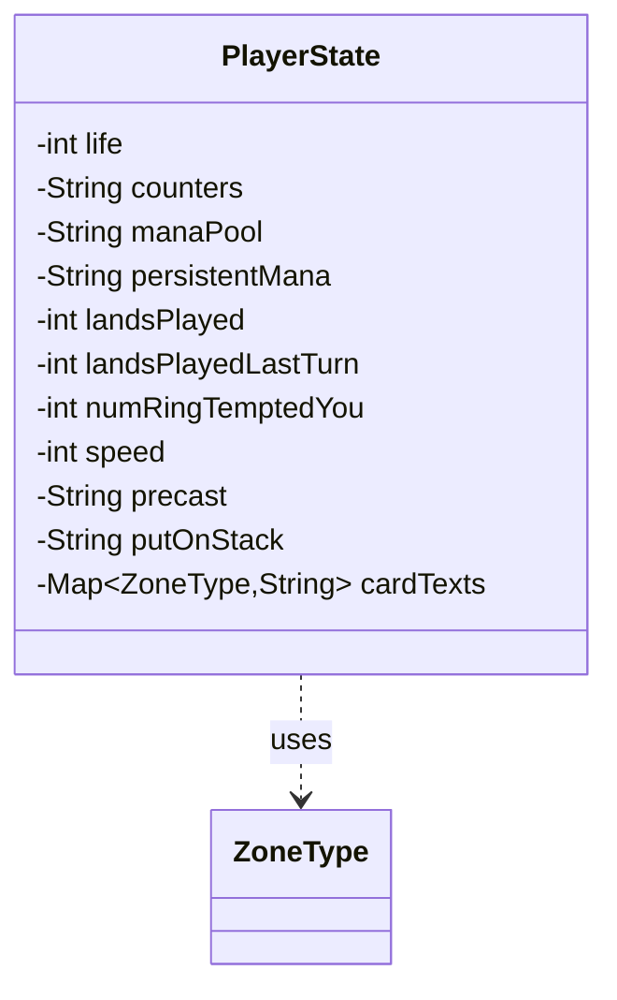

---
aliases:
  - PlayerState
tags:
  - java/class
  - module/forge-ai
  - pkg/forge/ai
fqn: forge.ai.GameState.PlayerState
package: forge.ai
module: forge-ai
kind: Class
---

# PlayerState

**Package:** `forge.ai`   **Module:** `forge-ai`   **Kind:** Class



## Relationships
**Uses:**
- [[forge.game.zone.ZoneType|ZoneType]]

## Design Description

`PlayerState` is a lightweight, package-private data holder nested within `GameState` that captures a complete snapshot of a single player's condition for the AI's game-state simulation and serialization. It records numeric attributes (life, lands played this and last turn, Ring-tempted count, speed) alongside string-encoded fields for counters, mana pool, persistent mana, and queued actions (`precast`, `putOnStack`), deferring parsing of these compound values to the surrounding `GameState` logic.

As a passive struct, it owns no behavior and depends only on `ZoneType`, which keys its `cardTexts` map associating each game zone with a textual representation of the cards it contains. The use of an `EnumMap` over `ZoneType` reflects deliberate efficiency for a fixed enum key set, while sentinel defaults (`life = -1`, null strings) signal "unset" fields, supporting partial state definitions when scripting or restoring scenarios.

## Source
`forge-ai/src/main/java/forge/ai/GameState.java` — declaration excerpt

```java
    static class PlayerState {
        private int life = -1;
        private String counters = "";
        private String manaPool = "";
        private String persistentMana = "";
        private int landsPlayed = 0;
        private int landsPlayedLastTurn = 0;
        private int numRingTemptedYou = 0;
        private int speed = 0;
        private String precast = null;
        private String putOnStack = null;
        private final Map<ZoneType, String> cardTexts = new EnumMap<>(ZoneType.class);
    }
```
