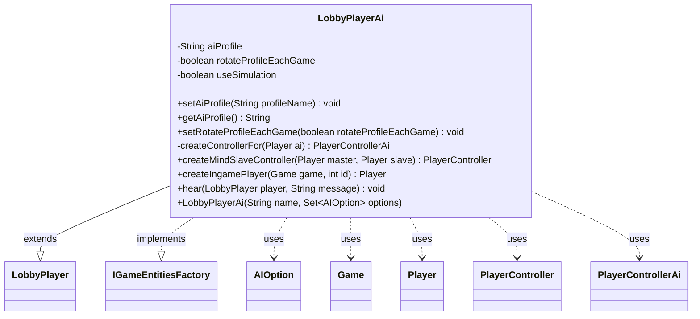

---
aliases:
  - LobbyPlayerAi
tags:
  - java/class
  - module/forge-ai
  - pkg/forge/ai
fqn: forge.ai.LobbyPlayerAi
package: forge.ai
module: forge-ai
kind: Class
---

# LobbyPlayerAi

**Package:** `forge.ai`   **Module:** `forge-ai`   **Kind:** Class



## Relationships
**Extends:**
- [[forge.LobbyPlayer|LobbyPlayer]]
**Implements:**
- [[forge.game.player.IGameEntitiesFactory|IGameEntitiesFactory]]
**Uses:**
- [[forge.ai.AIOption|AIOption]]
- [[forge.ai.PlayerControllerAi|PlayerControllerAi]]
- [[forge.game.Game|Game]]
- [[forge.game.player.Player|Player]]
- [[forge.game.player.PlayerController|PlayerController]]


## Design Description

`LobbyPlayerAi` represents an AI-controlled seat in the game lobby, holding the configuration—AI profile name, per-game profile rotation, and a simulation flag—that determines how a computer opponent is set up and behaves. Extending `LobbyPlayer`, it provides the AI variant of a lobby participant, while its implementation of `IGameEntitiesFactory` makes it responsible for constructing the engine-side `Player` and its decision-making controller.

Its core responsibility is building `PlayerControllerAi` instances through the private `createControllerFor` helper, reused for both ordinary in-game players and mind-slave control of another player, propagating the simulation setting into each. The design cleanly separates lobby-level identity and preferences from the runtime objects it produces, optionally randomizing the profile each game via `AiProfileUtil`. The no-op `hear` override deliberately leaves the local AI "deaf," signaling it has no need to process chat messages.

## Source
`forge-ai/src/main/java/forge/ai/LobbyPlayerAi.java`

```java
package forge.ai;

import java.util.Set;

import forge.LobbyPlayer;
import forge.game.Game;
import forge.game.player.IGameEntitiesFactory;
import forge.game.player.Player;
import forge.game.player.PlayerController;
import org.tinylog.Logger;

public class LobbyPlayerAi extends LobbyPlayer implements IGameEntitiesFactory {

    private String aiProfile = "";
    private boolean rotateProfileEachGame;
    private boolean useSimulation;

    public LobbyPlayerAi(String name, Set<AIOption> options) {
        super(name);
        if (options != null && options.contains(AIOption.USE_SIMULATION)) {
            this.useSimulation = true;
        }
    }

    public void setAiProfile(String profileName) {
        Logger.debug("[AI Preferences] " + name + " using profile " + profileName);
        aiProfile = profileName;
    }
    public String getAiProfile() {
        return aiProfile;
    }

    public void setRotateProfileEachGame(boolean rotateProfileEachGame) {
        this.rotateProfileEachGame = rotateProfileEachGame;
    }

    private PlayerControllerAi createControllerFor(Player ai) {
        PlayerControllerAi result = new PlayerControllerAi(ai.getGame(), ai, this);
        result.setUseSimulation(useSimulation);
        return result;
    }

    @Override
    public PlayerController createMindSlaveController(Player master, Player slave) {
        return createControllerFor(slave);
    }

    @Override
    public Player createIngamePlayer(Game game, final int id) {
        Player ai = new Player(getName(), game, id);
        ai.setFirstController(createControllerFor(ai));

        if (rotateProfileEachGame) {
            setAiProfile(AiProfileUtil.getRandomProfile());
        }
        return ai;
    }

    @Override
    public void hear(LobbyPlayer player, String message) { /* Local AI is deaf. */ }
}
```

## Python
`forge/ai/LobbyPlayerAi.py`

```python
from typing import Set

from forge.LobbyPlayer import LobbyPlayer
from forge.game.Game import Game
from forge.game.player.IGameEntitiesFactory import IGameEntitiesFactory
from forge.game.player.Player import Player
from forge.game.player.PlayerController import PlayerController
from forge.ai.AIOption import AIOption
from forge.ai.PlayerControllerAi import PlayerControllerAi
from forge.ai.AiProfileUtil import AiProfileUtil
from tinylog import Logger


class LobbyPlayerAi(LobbyPlayer, IGameEntitiesFactory):

    def __init__(self, name: str, options: Set[AIOption]):
        super().__init__(name)
        self.aiProfile = ""
        self.rotateProfileEachGame = False
        self.useSimulation = False
        if options is not None and AIOption.USE_SIMULATION in options:
            self.useSimulation = True

    def setAiProfile(self, profileName: str) -> None:
        Logger.debug("[AI Preferences] " + self.name + " using profile " + profileName)
        self.aiProfile = profileName

    def getAiProfile(self) -> str:
        return self.aiProfile

    def setRotateProfileEachGame(self, rotateProfileEachGame: bool) -> None:
        self.rotateProfileEachGame = rotateProfileEachGame

    def createControllerFor(self, ai: Player) -> PlayerControllerAi:
        result = PlayerControllerAi(ai.getGame(), ai, self)
        result.setUseSimulation(self.useSimulation)
        return result

    def createMindSlaveController(self, master: Player, slave: Player) -> PlayerController:
        return self.createControllerFor(slave)

    def createIngamePlayer(self, game: Game, id: int) -> Player:
        ai = Player(self.getName(), game, id)
        ai.setFirstController(self.createControllerFor(ai))

        if self.rotateProfileEachGame:
            self.setAiProfile(AiProfileUtil.getRandomProfile())
        return ai

    def hear(self, player: LobbyPlayer, message: str) -> None:
        """Local AI is deaf."""
        pass
```
