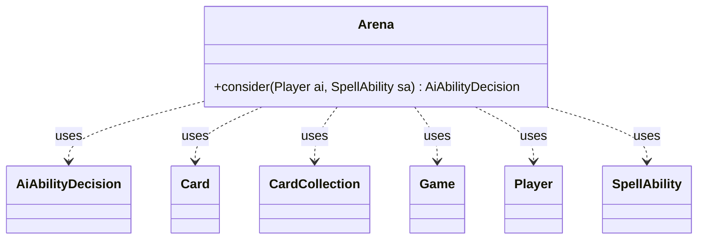

---
aliases:
  - Arena
tags:
  - java/class
  - module/forge-ai
  - pkg/forge/ai
fqn: forge.ai.SpecialCardAi.Arena
package: forge.ai
module: forge-ai
kind: Class
---

# Arena

**Package:** `forge.ai`   **Module:** `forge-ai`   **Kind:** Class



## Relationships
**Uses:**
- [[forge.ai.AiAbilityDecision|AiAbilityDecision]]
- [[forge.game.Game|Game]]
- [[forge.game.card.Card|Card]]
- [[forge.game.card.CardCollection|CardCollection]]
- [[forge.game.player.Player|Player]]
- [[forge.game.spellability.SpellAbility|SpellAbility]]

## Design Description

The `Arena` class is a static AI-helper bundled inside `SpecialCardAi`, dedicated to deciding when the AI should activate the fight-style ability of *Arena* and *Magus of the Arena*. Its sole `consider` method evaluates the game state through the supplied `Player` and `SpellAbility`, returning an `AiAbilityDecision` that pairs a numeric score with an `AiPlayDecision` verdict—the standard contract the engine's special-card handlers expose.

Treating the ability as targeted removal, it defers play until the end step before the AI's own turn, then collaborates with `Game`, `CardCollection`, and `Card` to scan its creatures for one that can kill every opposing creature unscathed (via `FightAi.canKill`). On finding such a creature it sets the spell's target and reports a high-confidence `Removal` decision; otherwise it signals waiting, missing prerequisites, or non-playability. The design favors safe, guaranteed-value combat over speculative trades.

## Source
`forge-ai/src/main/java/forge/ai/SpecialCardAi.java` — declaration excerpt

```java
    // Arena and Magus of the Arena
    public static class Arena {
        public static AiAbilityDecision consider(final Player ai, final SpellAbility sa) {
            final Game game = ai.getGame();

            // TODO This is basically removal, so we may want to play this at other times
            if (!game.getPhaseHandler().is(PhaseType.END_OF_TURN) || game.getPhaseHandler().getNextTurn() != ai) {
                return new AiAbilityDecision(0, AiPlayDecision.WaitForEndOfTurn);
            }

            CardCollection aiCreatures = ai.getCreaturesInPlay();
            if (aiCreatures.isEmpty()) {
                return new AiAbilityDecision(0, AiPlayDecision.MissingNeededCards);
            }

            for (Player opp : ai.getOpponents()) {
                CardCollection oppCreatures = opp.getCreaturesInPlay();
                if (oppCreatures.isEmpty()) {
                    continue;
                }

                for (Card aiCreature : aiCreatures) {
                    boolean canKillAll = true;
                    for (Card oppCreature : oppCreatures) {
                        if (FightAi.canKill(oppCreature, aiCreature, 0)) {
                            canKillAll = false;
                            break;
                        }
                        if (!FightAi.canKill(aiCreature, oppCreature, 0)) {
                            canKillAll = false;
                            break;
                        }
                    }
                    if (canKillAll) {
                        sa.getTargets().clear();
                        sa.getTargets().add(aiCreature);
                        return new AiAbilityDecision(100, AiPlayDecision.Removal);
                    }
                }
            }
            return new AiAbilityDecision(0, AiPlayDecision.CantPlayAi);
        }
    }
```
