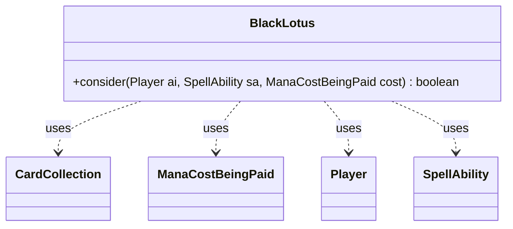

---
aliases:
  - BlackLotus
tags:
  - java/class
  - module/forge-ai
  - pkg/forge/ai
fqn: forge.ai.SpecialCardAi.BlackLotus
package: forge.ai
module: forge-ai
kind: Class
---

# BlackLotus

**Package:** `forge.ai`   **Module:** `forge-ai`   **Kind:** Class



## Relationships
**Uses:**
- [[forge.game.card.CardCollection|CardCollection]]
- [[forge.game.mana.ManaCostBeingPaid|ManaCostBeingPaid]]
- [[forge.game.player.Player|Player]]
- [[forge.game.spellability.SpellAbility|SpellAbility]]

## Design Description

BlackLotus is a stateless AI decision helper, nested within `SpecialCardAi`, that governs whether the computer player should activate Black Lotus (or Lotus Bloom) for a burst of mana. Its single static `consider` method evaluates the proposed spell against the AI's mana situation and deck profile, collaborating with `Player` to inspect available mana sources and owned cards, and inspecting the `SpellAbility` and its `ManaCostBeingPaid` to gauge the payoff.

The design encodes heuristic intent rather than rules logic: it samples the deck's CMC distribution via `CardCollection` filtering to classify it as low-curve, then sets a minimum cost threshold so the AI avoids "wasting" a one-shot mana artifact on cheap spells—while still allowing a borderline 3-CMC play when it is otherwise short on mana. As a self-contained, side-effect-free predicate, it slots cleanly into Forge's broader AI evaluation pipeline.

## Source
`forge-ai/src/main/java/forge/ai/SpecialCardAi.java` — declaration excerpt

```java
    // Black Lotus and Lotus Bloom
    public static class BlackLotus {
        public static boolean consider(final Player ai, final SpellAbility sa, final ManaCostBeingPaid cost) {
            CardCollection manaSources = ComputerUtilMana.getAvailableManaSources(ai, true);
            int numManaSrcs = manaSources.size();

            CardCollection allCards = CardLists.filter(ai.getAllCards(), Arrays.asList(CardPredicates.NON_TOKEN,
                    CardPredicates.NON_LANDS, CardPredicates.isOwner(ai)));

            int numHighCMC = CardLists.count(allCards, CardPredicates.greaterCMC(5));
            int numLowCMC = CardLists.count(allCards, CardPredicates.lessCMC(3));

            boolean isLowCMCDeck = numHighCMC <= 6 && numLowCMC >= 25;

            int minCMC = isLowCMCDeck ? 3 : 4; // probably not worth wasting a lotus on a low-CMC spell (<4 CMC), except in low-CMC decks, where 3 CMC may be fine
            int paidCMC = cost.getConvertedManaCost();
            if (paidCMC < minCMC) {
                // if it's a CMC 3 spell and we're more than one mana source short for it, might be worth it anyway
                return paidCMC == 3 && numManaSrcs < 3;
            }

            return true;
        }
    }
```

## Python
`forge/ai/SpecialCardAi/BlackLotus.py`

```python
from forge.game.card.CardCollection import CardCollection
from forge.game.mana.ManaCostBeingPaid import ManaCostBeingPaid
from forge.game.player.Player import Player
from forge.game.spellability.SpellAbility import SpellAbility
from forge.ai.ComputerUtilMana import ComputerUtilMana
from forge.game.card.CardLists import CardLists
from forge.game.card.CardPredicates import CardPredicates


# Black Lotus and Lotus Bloom
class BlackLotus:
    @staticmethod
    def consider(ai: Player, sa: SpellAbility, cost: ManaCostBeingPaid) -> bool:
        manaSources: CardCollection = ComputerUtilMana.getAvailableManaSources(ai, True)
        numManaSrcs = manaSources.size()

        allCards: CardCollection = CardLists.filter(ai.getAllCards(), [
            CardPredicates.NON_TOKEN,
            CardPredicates.NON_LANDS,
            CardPredicates.isOwner(ai),
        ])

        numHighCMC = CardLists.count(allCards, CardPredicates.greaterCMC(5))
        numLowCMC = CardLists.count(allCards, CardPredicates.lessCMC(3))

        isLowCMCDeck = numHighCMC <= 6 and numLowCMC >= 25

        minCMC = 3 if isLowCMCDeck else 4  # probably not worth wasting a lotus on a low-CMC spell (<4 CMC), except in low-CMC decks, where 3 CMC may be fine
        paidCMC = cost.getConvertedManaCost()
        if paidCMC < minCMC:
            # if it's a CMC 3 spell and we're more than one mana source short for it, might be worth it anyway
            return paidCMC == 3 and numManaSrcs < 3

        return True
```
