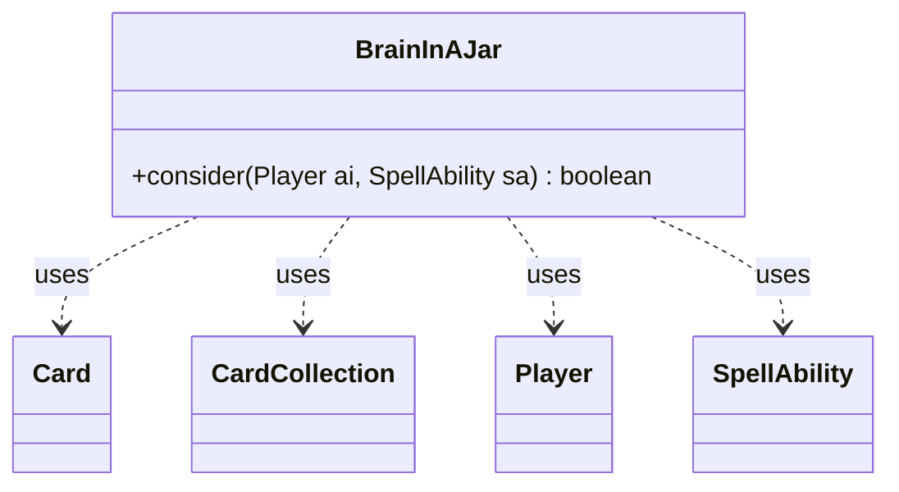

---
aliases:
  - BrainInAJar
tags:
  - java/class
  - module/forge-ai
  - pkg/forge/ai
fqn: forge.ai.SpecialCardAi.BrainInAJar
package: forge.ai
module: forge-ai
kind: Class
---

# BrainInAJar

**Package:** `forge.ai`   **Module:** `forge-ai`   **Kind:** Class



## Relationships
**Uses:**
- [[forge.game.card.Card|Card]]
- [[forge.game.card.CardCollection|CardCollection]]
- [[forge.game.player.Player|Player]]
- [[forge.game.spellability.SpellAbility|SpellAbility]]

## Design Description

BrainInAJar is a stateless AI helper, nested as a static class within `SpecialCardAi`, that encapsulates the decision logic for the eponymous card. Its sole responsibility is the static `consider` method, which determines whether the AI should activate the card's ability and how many charge counters to spend by setting the X mana cost paid on the candidate `SpellAbility`.

It collaborates with the engine's core domain types to make this judgment: it reads the host `Card` and its charge counters, filters the controlling `Player`'s hand and library into `CardCollection`s of instants and sorceries, and compares converted mana costs to find a castable target. The design favors casting from hand when an exactly affordable spell exists, otherwise removing the minimum counters needed to reach the library's highest-CMC spell, and falls back to scrying when no eligible spells remain. As a pure decision function with no retained state, it keeps card-specific heuristics isolated and side-effect-free apart from configuring the passed ability.

## Source
`forge-ai/src/main/java/forge/ai/SpecialCardAi.java` — declaration excerpt

```java
    // Brain in a Jar
    public static class BrainInAJar {
        public static boolean consider(final Player ai, final SpellAbility sa) {
            final Card source = sa.getHostCard();

            int counterNum = source.getCounters(CounterEnumType.CHARGE);
            // no need for logic
            if (counterNum == 0) {
                return false;
            }
            int libsize = ai.getCardsIn(ZoneType.Library).size();

            final CardCollection hand = CardLists.filter(ai.getCardsIn(ZoneType.Hand),
                    CardPredicates.INSTANTS_AND_SORCERIES);
            if (!hand.isEmpty()) {
                // has spell that can be cast in hand with put ability
                if (hand.anyMatch(CardPredicates.hasCMC(counterNum + 1))) {
                    return false;
                }
                // has spell that can be cast if one counter is removed
                if (hand.anyMatch(CardPredicates.hasCMC(counterNum))) {
                    sa.setXManaCostPaid(1);
                    return true;
                }
            }
            final CardCollection library = CardLists.filter(ai.getCardsIn(ZoneType.Library),
                    CardPredicates.INSTANTS_AND_SORCERIES);
            if (!library.isEmpty()) {
                // get max cmc of instant or sorceries in the library
                int maxCMC = 0;
                for (final Card c : library) {
                    int v = c.getCMC();
                    if (c.isSplitCard()) {
                        v = Math.max(c.getCMC(Card.SplitCMCMode.LeftSplitCMC), c.getCMC(Card.SplitCMCMode.RightSplitCMC));
                    }
                    if (v > maxCMC) {
                        maxCMC = v;
                    }
                }
                // there is a spell with more CMC, no need to remove counter
                if (counterNum + 1 < maxCMC) {
                    return false;
                }
                int maxToRemove = counterNum - maxCMC + 1;
                // no Scry 0, even if its caught from later stuff
                if (maxToRemove <= 0) {
                    return false;
                }
                sa.setXManaCostPaid(maxToRemove);
            } else {
                // no Instant or Sorceries anymore, just scry
                sa.setXManaCostPaid(Math.min(counterNum, libsize));
            }
            return true;
        }
    }
```

## Python
`forge/ai/SpecialCardAi/BrainInAJar.py`

```python
from forge.game.card.Card import Card
from forge.game.card.CardCollection import CardCollection
from forge.game.player.Player import Player
from forge.game.spellability.SpellAbility import SpellAbility
from forge.game.card.CardLists import CardLists
from forge.game.card.CardPredicates import CardPredicates
from forge.game.card.CounterEnumType import CounterEnumType
from forge.game.zone.ZoneType import ZoneType


class BrainInAJar:
    @staticmethod
    def consider(ai: Player, sa: SpellAbility) -> bool:
        source = sa.getHostCard()

        counterNum = source.getCounters(CounterEnumType.CHARGE)
        # no need for logic
        if counterNum == 0:
            return False
        libsize = ai.getCardsIn(ZoneType.Library).size()

        hand = CardLists.filter(ai.getCardsIn(ZoneType.Hand),
                CardPredicates.INSTANTS_AND_SORCERIES)
        if not hand.isEmpty():
            # has spell that can be cast in hand with put ability
            if hand.anyMatch(CardPredicates.hasCMC(counterNum + 1)):
                return False
            # has spell that can be cast if one counter is removed
            if hand.anyMatch(CardPredicates.hasCMC(counterNum)):
                sa.setXManaCostPaid(1)
                return True
        library = CardLists.filter(ai.getCardsIn(ZoneType.Library),
                CardPredicates.INSTANTS_AND_SORCERIES)
        if not library.isEmpty():
            # get max cmc of instant or sorceries in the library
            maxCMC = 0
            for c in library:
                v = c.getCMC()
                if c.isSplitCard():
                    v = max(c.getCMC(Card.SplitCMCMode.LeftSplitCMC), c.getCMC(Card.SplitCMCMode.RightSplitCMC))
                if v > maxCMC:
                    maxCMC = v
            # there is a spell with more CMC, no need to remove counter
            if counterNum + 1 < maxCMC:
                return False
            maxToRemove = counterNum - maxCMC + 1
            # no Scry 0, even if its caught from later stuff
            if maxToRemove <= 0:
                return False
            sa.setXManaCostPaid(maxToRemove)
        else:
            # no Instant or Sorceries anymore, just scry
            sa.setXManaCostPaid(min(counterNum, libsize))
        return True
```
