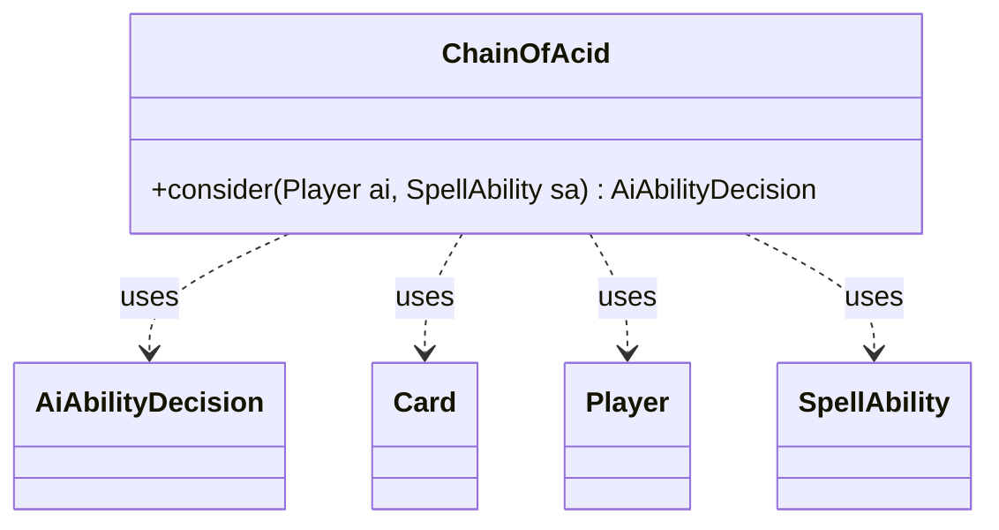

---
aliases:
  - ChainOfAcid
tags:
  - java/class
  - module/forge-ai
  - pkg/forge/ai
fqn: forge.ai.SpecialCardAi.ChainOfAcid
package: forge.ai
module: forge-ai
kind: Class
---

# ChainOfAcid

**Package:** `forge.ai`   **Module:** `forge-ai`   **Kind:** Class



## Relationships
**Uses:**
- [[forge.ai.AiAbilityDecision|AiAbilityDecision]]
- [[forge.game.card.Card|Card]]
- [[forge.game.player.Player|Player]]
- [[forge.game.spellability.SpellAbility|SpellAbility]]

## Design Description

ChainOfAcid is a stateless AI helper—one of the nested static decision classes within `SpecialCardAi`—that encapsulates the targeting heuristic for the card "Chain of Acid." Its sole responsibility is the `consider` method, which examines a `Player`'s game state to decide whether and how to play the associated `SpellAbility`, returning an `AiAbilityDecision` that pairs a numeric score with an `AiPlayDecision` verdict.

Collaborating with `Card`, `Player`, and `SpellAbility`, it filters the AI's own lands against the opponent's non-creature permanents and only commits when the AI holds a comfortable land surplus (more than the opponent's permanents plus two), guarding against mana-lock. When favorable, it selects the opponent's least valuable permanent via `ComputerUtilCard.getWorstAI`, sets it as the target, and signals `WillPlay`; otherwise it declines with `TargetingFailed`. An inline TODO frankly acknowledges the AI's limited ability to evaluate non-creature permanents, marking this as deliberately conservative, provisional logic.

## Source
`forge-ai/src/main/java/forge/ai/SpecialCardAi.java` — declaration excerpt

```java
    // Chain of Acid
    public static class ChainOfAcid {
        public static AiAbilityDecision consider(final Player ai, final SpellAbility sa) {
            List<Card> AiLandsOnly = CardLists.filter(ai.getCardsIn(ZoneType.Battlefield),
                    CardPredicates.LANDS);
            List<Card> OppPerms = CardLists.filter(ai.getOpponents().getCardsIn(ZoneType.Battlefield),
                    CardPredicates.NON_CREATURES);

            // TODO: improve this logic (currently the AI has difficulty evaluating non-creature permanents,
            // which it can only distinguish by their CMC, considering >CMC higher value).
            // Currently ensures that the AI will still have lands provided that the human player goes to
            // destroy all the AI's lands in order (to avoid manalock).
            if (!OppPerms.isEmpty() && AiLandsOnly.size() > OppPerms.size() + 2) {
                // If there are enough lands, target the worst non-creature permanent of the opponent
                Card worstOppPerm = ComputerUtilCard.getWorstAI(OppPerms);
                if (worstOppPerm != null) {
                    sa.resetTargets();
                    sa.getTargets().add(worstOppPerm);
                    return new AiAbilityDecision(100, AiPlayDecision.WillPlay);
                }
            }
            return new AiAbilityDecision(0, AiPlayDecision.TargetingFailed);
        }
    }
```

## Python
`forge/ai/SpecialCardAi/ChainOfAcid.py`

```python
from forge.ai.AiAbilityDecision import AiAbilityDecision
from forge.ai.AiPlayDecision import AiPlayDecision
from forge.ai.ComputerUtilCard import ComputerUtilCard
from forge.game.card.Card import Card
from forge.game.card.CardLists import CardLists
from forge.game.card.CardPredicates import CardPredicates
from forge.game.player.Player import Player
from forge.game.spellability.SpellAbility import SpellAbility
from forge.game.zone.ZoneType import ZoneType


# Chain of Acid
class ChainOfAcid:
    @staticmethod
    def consider(ai: Player, sa: SpellAbility) -> AiAbilityDecision:
        AiLandsOnly = CardLists.filter(ai.getCardsIn(ZoneType.Battlefield),
                CardPredicates.LANDS)
        OppPerms = CardLists.filter(ai.getOpponents().getCardsIn(ZoneType.Battlefield),
                CardPredicates.NON_CREATURES)

        # TODO: improve this logic (currently the AI has difficulty evaluating non-creature permanents,
        # which it can only distinguish by their CMC, considering >CMC higher value).
        # Currently ensures that the AI will still have lands provided that the human player goes to
        # destroy all the AI's lands in order (to avoid manalock).
        if OppPerms and len(AiLandsOnly) > len(OppPerms) + 2:
            # If there are enough lands, target the worst non-creature permanent of the opponent
            worstOppPerm = ComputerUtilCard.getWorstAI(OppPerms)
            if worstOppPerm is not None:
                sa.resetTargets()
                sa.getTargets().add(worstOppPerm)
                return AiAbilityDecision(100, AiPlayDecision.WillPlay)
        return AiAbilityDecision(0, AiPlayDecision.TargetingFailed)
```
