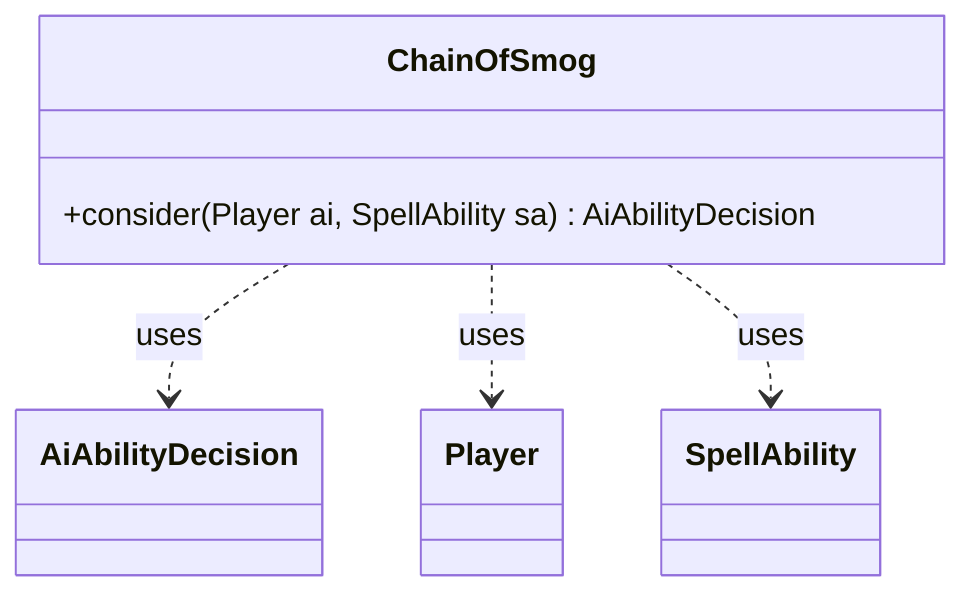

---
aliases:
  - ChainOfSmog
tags:
  - java/class
  - module/forge-ai
  - pkg/forge/ai
fqn: forge.ai.SpecialCardAi.ChainOfSmog
package: forge.ai
module: forge-ai
kind: Class
---

# ChainOfSmog

**Package:** `forge.ai`   **Module:** `forge-ai`   **Kind:** Class



## Relationships
**Uses:**
- [[forge.ai.AiAbilityDecision|AiAbilityDecision]]
- [[forge.game.player.Player|Player]]
- [[forge.game.spellability.SpellAbility|SpellAbility]]

## Design Description

A nested static helper within `SpecialCardAi` that encapsulates the AI's decision logic for the card *Chain of Smog*, a discard-and-copy spell. Its sole `consider` method evaluates whether the AI should cast the ability for the given `Player`, returning an `AiAbilityDecision` paired with an `AiPlayDecision` outcome and a numeric confidence score.

Acting as a stateless strategy callback, it collaborates with the game model (`Player`, `SpellAbility`, zones) to inspect hand contents and, when the AI holds cards, selects a legal opponent target—preferring one with a non-empty hand—before committing to play at full confidence. When the AI's own hand is empty it bails with a `TargetingFailed` decision. The design favors small per-card static classes over subclassing, and the inline TODO signals a known limitation in target selection awaiting refinement.

## Source
`forge-ai/src/main/java/forge/ai/SpecialCardAi.java` — declaration excerpt

```java
    // Chain of Smog
    public static class ChainOfSmog {
        public static AiAbilityDecision consider(final Player ai, final SpellAbility sa) {
            if (ai.getCardsIn(ZoneType.Hand).isEmpty()) {
                // to avoid failure to add to stack, provide a legal target opponent first (choosing random at this point)
                // TODO: this makes the AI target opponents with 0 cards in hand, but bailing from here causes a
                // "failed to add to stack" error, needs investigation and improvement.
                Player targOpp = Aggregates.random(ai.getOpponents());

                for (Player opp : ai.getOpponents()) {
                    if (!opp.getCardsIn(ZoneType.Hand).isEmpty()) {
                        targOpp = opp;
                        break;
                    }
                }

                sa.getParent().resetTargets();
                sa.getParent().getTargets().add(targOpp);
                return new AiAbilityDecision(100, AiPlayDecision.WillPlay);
            }

            return new AiAbilityDecision(0, AiPlayDecision.TargetingFailed);
        }
    }
```
