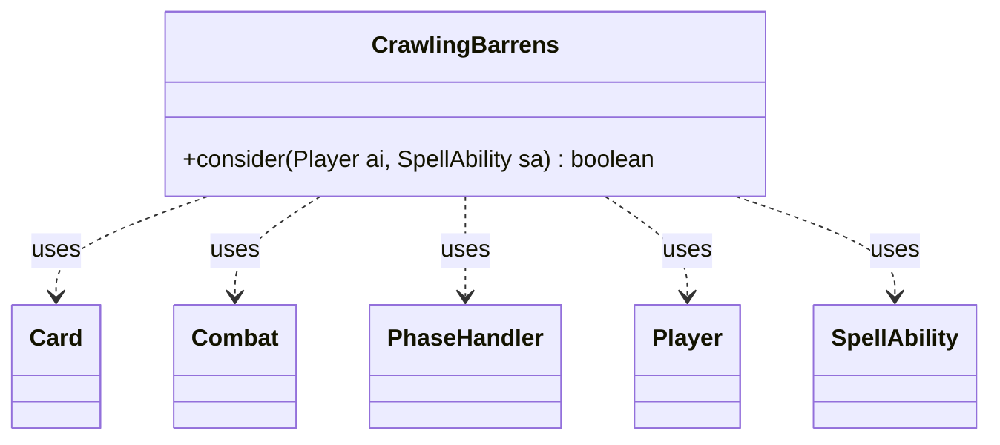

---
aliases:
  - CrawlingBarrens
tags:
  - java/class
  - module/forge-ai
  - pkg/forge/ai
fqn: forge.ai.SpecialCardAi.CrawlingBarrens
package: forge.ai
module: forge-ai
kind: Class
---

# CrawlingBarrens

**Package:** `forge.ai`   **Module:** `forge-ai`   **Kind:** Class



## Relationships
**Uses:**
- [[forge.game.card.Card|Card]]
- [[forge.game.combat.Combat|Combat]]
- [[forge.game.phase.PhaseHandler|PhaseHandler]]
- [[forge.game.player.Player|Player]]
- [[forge.game.spellability.SpellAbility|SpellAbility]]

## Design Description

CrawlingBarrens is a small, stateless AI helper—one of the nested static decision classes inside `SpecialCardAi`—that encapsulates the logic for whether the AI should activate Crawling Barrens' animation ability. Its single `consider(Player, SpellAbility)` method returns a boolean verdict rather than performing the action, keeping decision-making cleanly separated from execution.

To evaluate the play, it simulates the outcome by building the prospective animated `Card` via `AnimateAi`, applying the +1/+1 counters the real ability would grant, then weighs three timing-sensitive scenarios using `PhaseHandler` and `Combat`: animating at the opponent's end step before the AI's turn, creating a worthwhile attacker in its own main phase, or producing a valuable blocker. The design intent is opportunistic, value-driven activation—committing mana only when the manland yields a meaningful attacker, blocker, or end-of-turn tempo gain—while collaborating with shared utilities like `ComputerUtilCard` for combat assessments.

## Source
`forge-ai/src/main/java/forge/ai/SpecialCardAi.java` — declaration excerpt

```java
    // Crawling Barrens
    public static class CrawlingBarrens {
        public static boolean consider(final Player ai, final SpellAbility sa) {
            final PhaseHandler ph = ai.getGame().getPhaseHandler();
            final Combat combat = ai.getGame().getCombat();

            Card animated = AnimateAi.becomeAnimated(sa.getHostCard(), sa.getSubAbility());
            if (sa.getHostCard().canReceiveCounters(CounterEnumType.P1P1)) {
                animated.addCounterInternal(CounterEnumType.P1P1, 2, ai, false, null, null);
            }
            boolean isOppEOT = ph.is(PhaseType.END_OF_TURN) && ph.getNextTurn() == ai;
            boolean isValuableAttacker = ph.is(PhaseType.MAIN1, ai) && ComputerUtilCard.doesSpecifiedCreatureAttackAI(ai, animated);
            boolean isValuableBlocker = combat != null && combat.getDefendingPlayers().contains(ai) && ComputerUtilCard.doesSpecifiedCreatureBlock(ai, animated);

            return isOppEOT || isValuableAttacker || isValuableBlocker;
        }
    }
```

## Python
`forge/ai/SpecialCardAi/CrawlingBarrens.py`

```python
from forge.game.card.Card import Card
from forge.game.card.CounterEnumType import CounterEnumType
from forge.game.combat.Combat import Combat
from forge.game.phase.PhaseHandler import PhaseHandler
from forge.game.phase.PhaseType import PhaseType
from forge.game.player.Player import Player
from forge.game.spellability.SpellAbility import SpellAbility
from forge.ai.AnimateAi import AnimateAi
from forge.ai.ComputerUtilCard import ComputerUtilCard


class CrawlingBarrens:
    @staticmethod
    def consider(ai: Player, sa: SpellAbility) -> bool:
        ph = ai.getGame().getPhaseHandler()
        combat = ai.getGame().getCombat()

        animated = AnimateAi.becomeAnimated(sa.getHostCard(), sa.getSubAbility())
        if sa.getHostCard().canReceiveCounters(CounterEnumType.P1P1):
            animated.addCounterInternal(CounterEnumType.P1P1, 2, ai, False, None, None)
        isOppEOT = ph.is_(PhaseType.END_OF_TURN) and ph.getNextTurn() == ai
        isValuableAttacker = ph.is_(PhaseType.MAIN1, ai) and ComputerUtilCard.doesSpecifiedCreatureAttackAI(ai, animated)
        isValuableBlocker = combat is not None and ai in combat.getDefendingPlayers() and ComputerUtilCard.doesSpecifiedCreatureBlock(ai, animated)

        return isOppEOT or isValuableAttacker or isValuableBlocker
```
