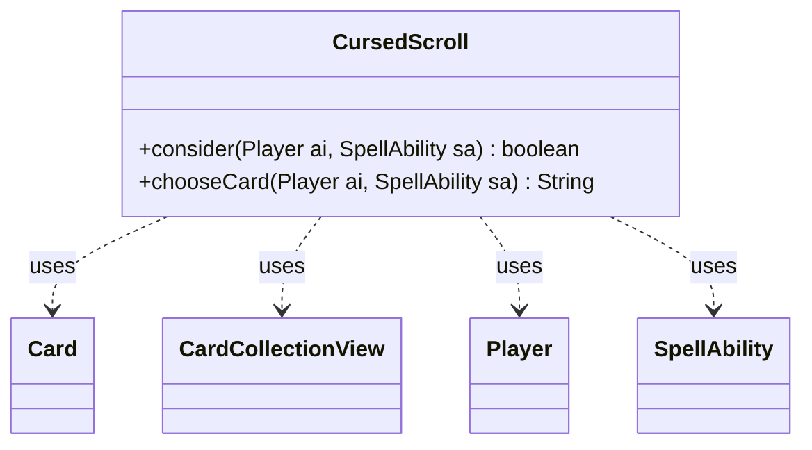

---
aliases:
  - CursedScroll
tags:
  - java/class
  - module/forge-ai
  - pkg/forge/ai
fqn: forge.ai.SpecialCardAi.CursedScroll
package: forge.ai
module: forge-ai
kind: Class
---

# CursedScroll

**Package:** `forge.ai`   **Module:** `forge-ai`   **Kind:** Class



## Relationships
**Uses:**
- [[forge.game.card.Card|Card]]
- [[forge.game.card.CardCollectionView|CardCollectionView]]
- [[forge.game.player.Player|Player]]
- [[forge.game.spellability.SpellAbility|SpellAbility]]

## Design Description

CursedScroll is a stateless AI helper—a static nested class within `SpecialCardAi`—that encapsulates Forge's decision logic for the namesake artifact, whose effect names a card and deals damage if a matching card is revealed from hand. It exposes two static entry points: `consider`, which decides whether the AI should activate the ability, and `chooseCard`, which selects the card name to declare. Both operate by inspecting the AI player's hand via `Player.getCardsIn` and grouping cards by name with `CardLists`/`CardPredicates`.

The design reflects the engine's broader convention of isolating per-card special-case AI as small, side-effect-free static utilities collaborating with the core game model (`Player`, `Card`, `CardCollectionView`, `SpellAbility`) rather than holding state. `consider` is deliberately conservative—only firing when every card in hand shares one name—while `chooseCard` independently picks the most frequent name to maximize the chance of a reveal, a pragmatic heuristic acknowledged as provisional by its inline comment.

## Source
`forge-ai/src/main/java/forge/ai/SpecialCardAi.java` — declaration excerpt

```java
    // Cursed Scroll
    public static class CursedScroll {
        public static boolean consider(final Player ai, final SpellAbility sa) {
            CardCollectionView hand = ai.getCardsIn(ZoneType.Hand);
            if (hand.isEmpty()) {
                return false;
            }

            // For now, see if all cards in hand have the same name, and then proceed if true
            return CardLists.filter(hand, CardPredicates.nameEquals(hand.getFirst().getName())).size() == hand.size();
        }

        public static String chooseCard(final Player ai, final SpellAbility sa) {
            int maxCount = 0;
            Card best = null;
            CardCollectionView hand = ai.getCardsIn(ZoneType.Hand);

            for (Card c : ai.getCardsIn(ZoneType.Hand)) {
                int count = CardLists.filter(hand, CardPredicates.nameEquals(c.getName())).size();
                if (count > maxCount) {
                    maxCount = count;
                    best = c;
                }
            }

            return best != null ? best.getName() : "";
        }
    }
```

## Python
`forge/ai/SpecialCardAi/CursedScroll.py`

```python
from forge.game.card.Card import Card
from forge.game.card.CardCollectionView import CardCollectionView
from forge.game.player.Player import Player
from forge.game.spellability.SpellAbility import SpellAbility
from forge.game.zone.ZoneType import ZoneType
from forge.game.card.CardLists import CardLists
from forge.game.card.CardPredicates import CardPredicates


class CursedScroll:
    @staticmethod
    def consider(ai: Player, sa: SpellAbility) -> bool:
        hand: CardCollectionView = ai.getCardsIn(ZoneType.Hand)
        if hand.isEmpty():
            return False

        # For now, see if all cards in hand have the same name, and then proceed if true
        return CardLists.filter(hand, CardPredicates.nameEquals(hand.getFirst().getName())).size() == hand.size()

    @staticmethod
    def chooseCard(ai: Player, sa: SpellAbility) -> str:
        maxCount = 0
        best: Card = None
        hand: CardCollectionView = ai.getCardsIn(ZoneType.Hand)

        for c in ai.getCardsIn(ZoneType.Hand):
            count = CardLists.filter(hand, CardPredicates.nameEquals(c.getName())).size()
            if count > maxCount:
                maxCount = count
                best = c

        return best.getName() if best is not None else ""
```
