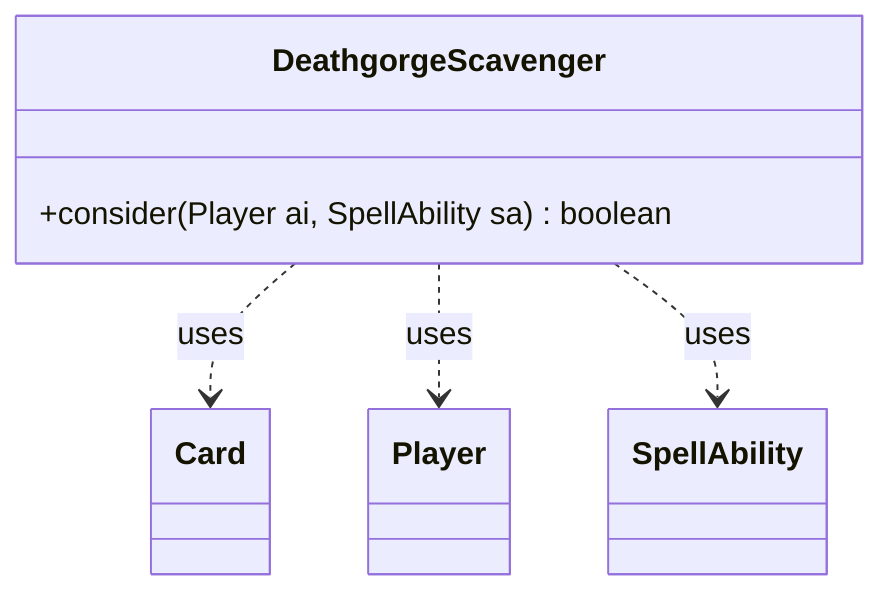

---
aliases:
  - DeathgorgeScavenger
tags:
  - java/class
  - module/forge-ai
  - pkg/forge/ai
fqn: forge.ai.SpecialCardAi.DeathgorgeScavenger
package: forge.ai
module: forge-ai
kind: Class
---

# DeathgorgeScavenger

**Package:** `forge.ai`   **Module:** `forge-ai`   **Kind:** Class



## Relationships
**Uses:**
- [[forge.game.card.Card|Card]]
- [[forge.game.player.Player|Player]]
- [[forge.game.spellability.SpellAbility|SpellAbility]]

## Design Description

DeathgorgeScavenger is a stateless AI helper, packaged as a static nested class within `forge.ai.SpecialCardAi`, that encodes the targeting logic for the Magic card of the same name. Its sole `consider` method decides whether and what the AI should exile from a graveyard, returning `true` only when a valid target is chosen. It collaborates with `Player` to inspect both opponents' and its own graveyards, with `Card` to identify candidates, and with `SpellAbility` to reset and assign targets on the pending ability.

The design intent is heuristic and situational: it prefers exiling the opponents' weakest cards (falling back to its own graveyard when none exist), and weighs creatures versus non-creatures by game state — favoring a creature for lifegain when the AI is low on life, and a non-creature for the counter bonus when its host is attacking. This keeps card-specific decision-making isolated from the generic ability framework.

## Source
`forge-ai/src/main/java/forge/ai/SpecialCardAi.java` — declaration excerpt

```java
    // Deathgorge Scavenger
    public static class DeathgorgeScavenger {
        public static boolean consider(final Player ai, final SpellAbility sa) {
            Card worstCreat = ComputerUtilCard.getWorstAI(CardLists.filter(ai.getOpponents().getCardsIn(ZoneType.Graveyard), CardPredicates.CREATURES));
            Card worstNonCreat = ComputerUtilCard.getWorstAI(CardLists.filter(ai.getOpponents().getCardsIn(ZoneType.Graveyard), CardPredicates.NON_CREATURES));
            if (worstCreat == null) {
                worstCreat = ComputerUtilCard.getWorstAI(CardLists.filter(ai.getCardsIn(ZoneType.Graveyard), CardPredicates.CREATURES));
            }
            if (worstNonCreat == null) {
                worstNonCreat = ComputerUtilCard.getWorstAI(CardLists.filter(ai.getCardsIn(ZoneType.Graveyard), CardPredicates.NON_CREATURES));
            }

            sa.resetTargets();
            if (worstCreat != null && ai.getLife() <= ai.getStartingLife() / 4) {
                sa.getTargets().add(worstCreat);
            } else if (worstNonCreat != null && ai.getGame().getCombat() != null
                    && ai.getGame().getCombat().isAttacking(sa.getHostCard())) {
                sa.getTargets().add(worstNonCreat);
            } else if (worstCreat != null) {
                sa.getTargets().add(worstCreat);
            }

            return sa.getTargets().size() > 0;
        }
    }
```

## Python
`forge/ai/SpecialCardAi/DeathgorgeScavenger.py`

```python
from forge.game.card.Card import Card
from forge.game.player.Player import Player
from forge.game.spellability.SpellAbility import SpellAbility


# Deathgorge Scavenger
class DeathgorgeScavenger:
    @staticmethod
    def consider(ai: Player, sa: SpellAbility) -> bool:
        worstCreat = ComputerUtilCard.getWorstAI(CardLists.filter(ai.getOpponents().getCardsIn(ZoneType.Graveyard), CardPredicates.CREATURES))
        worstNonCreat = ComputerUtilCard.getWorstAI(CardLists.filter(ai.getOpponents().getCardsIn(ZoneType.Graveyard), CardPredicates.NON_CREATURES))
        if worstCreat is None:
            worstCreat = ComputerUtilCard.getWorstAI(CardLists.filter(ai.getCardsIn(ZoneType.Graveyard), CardPredicates.CREATURES))
        if worstNonCreat is None:
            worstNonCreat = ComputerUtilCard.getWorstAI(CardLists.filter(ai.getCardsIn(ZoneType.Graveyard), CardPredicates.NON_CREATURES))

        sa.resetTargets()
        if worstCreat is not None and ai.getLife() <= ai.getStartingLife() // 4:
            sa.getTargets().add(worstCreat)
        elif worstNonCreat is not None and ai.getGame().getCombat() is not None \
                and ai.getGame().getCombat().isAttacking(sa.getHostCard()):
            sa.getTargets().add(worstNonCreat)
        elif worstCreat is not None:
            sa.getTargets().add(worstCreat)

        return sa.getTargets().size() > 0
```
