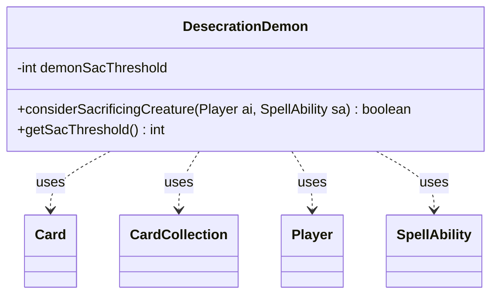

---
aliases:
  - DesecrationDemon
tags:
  - java/class
  - module/forge-ai
  - pkg/forge/ai
fqn: forge.ai.SpecialCardAi.DesecrationDemon
package: forge.ai
module: forge-ai
kind: Class
---

# DesecrationDemon

**Package:** `forge.ai`   **Module:** `forge-ai`   **Kind:** Class



## Relationships
**Uses:**
- [[forge.game.card.Card|Card]]
- [[forge.game.card.CardCollection|CardCollection]]
- [[forge.game.player.Player|Player]]
- [[forge.game.spellability.SpellAbility|SpellAbility]]

## Design Description

DesecrationDemon is a stateless AI helper, nested within `SpecialCardAi`, that encapsulates the computer player's decision logic for the card Desecration Demon — specifically whether the AI should sacrifice a creature in response to the demon's triggered sacrifice cost. As a static utility holder rather than a domain entity, it owns no instance state; its single tuning constant, `demonSacThreshold`, is exposed via `getSacThreshold()` so callers know how aggressively to sacrifice when desperate.

Its core method, `considerSacrificingCreature`, collaborates with `Player`, `SpellAbility`, and `Card` to read game state, and uses `CardCollection` with predicate filters to find untapped flying or reach blockers. The intent is defensive: it only recommends a sacrifice on the owner's turn, when the demon can attack, the AI's life is at or below the demon's power, and no useful flying blocker exists — modeling a last-ditch survival heuristic rather than routine play.

## Source
`forge-ai/src/main/java/forge/ai/SpecialCardAi.java` — declaration excerpt

```java
    // Desecration Demon
    public static class DesecrationDemon {
        private static final int demonSacThreshold = Integer.MAX_VALUE; // if we're in dire conditions, sac everything from worst to best hoping to find an answer

        public static boolean considerSacrificingCreature(final Player ai, final SpellAbility sa) {
            Card c = sa.getHostCard();

            // Only check for sacrifice if it's the owner's turn, and it can attack.
            // TODO: Maybe check if sacrificing a creature allows AI to kill the opponent with the rest on their turn?
            if (!CombatUtil.canAttack(c) ||
                    !ai.getGame().getPhaseHandler().isPlayerTurn(sa.getActivatingPlayer())) {
                return false;
            }

            CardCollection flyingCreatures = CardLists.filter(ai.getCardsIn(ZoneType.Battlefield),
                    CardPredicates.UNTAPPED.and(
                            CardPredicates.hasKeyword(Keyword.FLYING).or(CardPredicates.hasKeyword(Keyword.REACH))));
            boolean hasUsefulBlocker = false;

            for (Card fc : flyingCreatures) {
                if (!ComputerUtilCard.isUselessCreature(ai, fc)) {
                    hasUsefulBlocker = true;
                    break;
                }
            }

            return ai.getLife() <= c.getNetPower() && !hasUsefulBlocker;
        }

        public static int getSacThreshold() {
            return demonSacThreshold;
        }
    }
```

## Python
`forge/ai/SpecialCardAi/DesecrationDemon.py`

```python
from forge.game.card.Card import Card
from forge.game.card.CardCollection import CardCollection
from forge.game.player.Player import Player
from forge.game.spellability.SpellAbility import SpellAbility


class DesecrationDemon:
    demonSacThreshold = 2147483647  # if we're in dire conditions, sac everything from worst to best hoping to find an answer

    @staticmethod
    def considerSacrificingCreature(ai: Player, sa: SpellAbility) -> bool:
        c = sa.getHostCard()

        # Only check for sacrifice if it's the owner's turn, and it can attack.
        # TODO: Maybe check if sacrificing a creature allows AI to kill the opponent with the rest on their turn?
        if (not CombatUtil.canAttack(c) or
                not ai.getGame().getPhaseHandler().isPlayerTurn(sa.getActivatingPlayer())):
            return False

        flyingCreatures = CardLists.filter(ai.getCardsIn(ZoneType.Battlefield),
                CardPredicates.UNTAPPED.and_(
                        CardPredicates.hasKeyword(Keyword.FLYING).or_(CardPredicates.hasKeyword(Keyword.REACH))))
        hasUsefulBlocker = False

        for fc in flyingCreatures:
            if not ComputerUtilCard.isUselessCreature(ai, fc):
                hasUsefulBlocker = True
                break

        return ai.getLife() <= c.getNetPower() and not hasUsefulBlocker

    @staticmethod
    def getSacThreshold() -> int:
        return DesecrationDemon.demonSacThreshold
```
