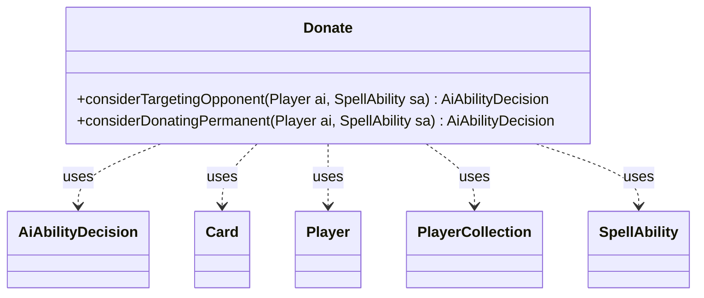

---
aliases:
  - Donate
tags:
  - java/class
  - module/forge-ai
  - pkg/forge/ai
fqn: forge.ai.SpecialCardAi.Donate
package: forge.ai
module: forge-ai
kind: Class
---

# Donate

**Package:** `forge.ai`   **Module:** `forge-ai`   **Kind:** Class



## Relationships
**Uses:**
- [[forge.ai.AiAbilityDecision|AiAbilityDecision]]
- [[forge.game.card.Card|Card]]
- [[forge.game.player.Player|Player]]
- [[forge.game.player.PlayerCollection|PlayerCollection]]
- [[forge.game.spellability.SpellAbility|SpellAbility]]

## Design Description

The `Donate` class is a static nested helper within `SpecialCardAi`, providing AI decision logic for cards that gift permanents to opponents (e.g., Donate, Illusions of Grandeur, Pacts). It exposes two stateless static methods returning `AiAbilityDecision` values, fitting the engine's pattern of delegating card-specific AI behavior to dedicated handlers keyed on the `DonateMe` SVar.

`considerTargetingOpponent` locates a preferred donatable `Card`, then filters the AI's opponents via a `PlayerCollection`, preferring a player who doesn't already control a copy of that card and, among candidates, the one with the fewest lands — a heuristic that maximizes the donated card's drawback. `considerDonatingPermanent` selects the permanent to give away. Both manipulate the `SpellAbility`'s targets directly and signal intent through weighted `WillPlay`/`TargetingFailed` decisions, collaborating with `Player`, `Card`, and `SpellAbility` rather than holding state.

## Source
`forge-ai/src/main/java/forge/ai/SpecialCardAi.java` — declaration excerpt

```java
    // Donate
    public static class Donate {
        public static AiAbilityDecision considerTargetingOpponent(final Player ai, final SpellAbility sa) {
            final Card donateTarget = ComputerUtil.getCardPreference(ai, sa.getHostCard(), "DonateMe", CardLists.filter(
                    ai.getCardsIn(ZoneType.Battlefield).threadSafeIterable(), CardPredicates.hasSVar("DonateMe")));
            if (donateTarget != null) {
                // first filter for opponents which can be targeted by SA
                PlayerCollection oppList = ai.getOpponents().filter(PlayerPredicates.isTargetableBy(sa));

                // All opponents have hexproof or something like that
                if (oppList.isEmpty()) {
                    return new AiAbilityDecision(0, AiPlayDecision.TargetingFailed);
                }

                // filter for player who does not have donate target already
                PlayerCollection oppTarget = oppList.filter(PlayerPredicates.isNotCardInPlay(donateTarget.getName()));
                // fall back to previous list
                if (oppTarget.isEmpty()) {
                    oppTarget = oppList;
                }

                // select player with less lands on the field (helpful for Illusions of Grandeur and probably Pacts too)
                Player opp = Collections.min(oppTarget,
                        PlayerPredicates.compareByZoneSize(ZoneType.Battlefield, CardPredicates.LANDS));

                if (opp != null) {
                    sa.resetTargets();
                    sa.getTargets().add(opp);
                }
                return new AiAbilityDecision(100, AiPlayDecision.WillPlay);
            }
            // No targets found to donate, so do nothing.
            return new AiAbilityDecision(0, AiPlayDecision.TargetingFailed);
        }

        public static AiAbilityDecision considerDonatingPermanent(final Player ai, final SpellAbility sa) {
            Card donateTarget = ComputerUtil.getCardPreference(ai, sa.getHostCard(), "DonateMe", CardLists.filter(ai.getCardsIn(ZoneType.Battlefield).threadSafeIterable(), CardPredicates.hasSVar("DonateMe")));
            if (donateTarget != null) {
                sa.resetTargets();
                sa.getTargets().add(donateTarget);
                return new AiAbilityDecision(100, AiPlayDecision.WillPlay);
            }

            // Should never get here because targetOpponent, called before targetPermanentToDonate, should already have made the AI bail
            System.err.println("Warning: Donate AI failed at SpecialCardAi.Donate#targetPermanentToDonate despite successfully targeting an opponent first.");
            return new AiAbilityDecision(0, AiPlayDecision.TargetingFailed);
        }
    }
```

## Python
`forge/ai/SpecialCardAi/Donate.py`

```python
from forge.ai.AiAbilityDecision import AiAbilityDecision
from forge.ai.AiPlayDecision import AiPlayDecision
from forge.ai.ComputerUtil import ComputerUtil
from forge.game.card.Card import Card
from forge.game.card.CardLists import CardLists
from forge.game.card.CardPredicates import CardPredicates
from forge.game.player.Player import Player
from forge.game.player.PlayerCollection import PlayerCollection
from forge.game.player.PlayerPredicates import PlayerPredicates
from forge.game.spellability.SpellAbility import SpellAbility
from forge.game.zone.ZoneType import ZoneType

import functools
import sys


class Donate:
    @staticmethod
    def considerTargetingOpponent(ai: Player, sa: SpellAbility) -> AiAbilityDecision:
        donateTarget = ComputerUtil.getCardPreference(ai, sa.getHostCard(), "DonateMe", CardLists.filter(
                ai.getCardsIn(ZoneType.Battlefield).threadSafeIterable(), CardPredicates.hasSVar("DonateMe")))
        if donateTarget is not None:
            # first filter for opponents which can be targeted by SA
            oppList = ai.getOpponents().filter(PlayerPredicates.isTargetableBy(sa))

            # All opponents have hexproof or something like that
            if oppList.isEmpty():
                return AiAbilityDecision(0, AiPlayDecision.TargetingFailed)

            # filter for player who does not have donate target already
            oppTarget = oppList.filter(PlayerPredicates.isNotCardInPlay(donateTarget.getName()))
            # fall back to previous list
            if oppTarget.isEmpty():
                oppTarget = oppList

            # select player with less lands on the field (helpful for Illusions of Grandeur and probably Pacts too)
            opp = min(oppTarget, key=functools.cmp_to_key(
                    PlayerPredicates.compareByZoneSize(ZoneType.Battlefield, CardPredicates.LANDS)))

            if opp is not None:
                sa.resetTargets()
                sa.getTargets().add(opp)
            return AiAbilityDecision(100, AiPlayDecision.WillPlay)
        # No targets found to donate, so do nothing.
        return AiAbilityDecision(0, AiPlayDecision.TargetingFailed)

    @staticmethod
    def considerDonatingPermanent(ai: Player, sa: SpellAbility) -> AiAbilityDecision:
        donateTarget = ComputerUtil.getCardPreference(ai, sa.getHostCard(), "DonateMe", CardLists.filter(
                ai.getCardsIn(ZoneType.Battlefield).threadSafeIterable(), CardPredicates.hasSVar("DonateMe")))
        if donateTarget is not None:
            sa.resetTargets()
            sa.getTargets().add(donateTarget)
            return AiAbilityDecision(100, AiPlayDecision.WillPlay)

        # Should never get here because targetOpponent, called before targetPermanentToDonate, should already have made the AI bail
        print("Warning: Donate AI failed at SpecialCardAi.Donate#targetPermanentToDonate despite successfully targeting an opponent first.", file=sys.stderr)
        return AiAbilityDecision(0, AiPlayDecision.TargetingFailed)
```
