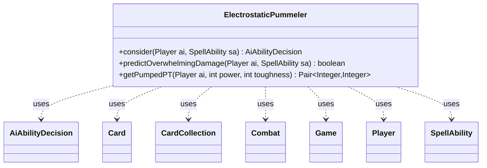

---
aliases:
  - ElectrostaticPummeler
tags:
  - java/class
  - module/forge-ai
  - pkg/forge/ai
fqn: forge.ai.SpecialCardAi.ElectrostaticPummeler
package: forge.ai
module: forge-ai
kind: Class
---

# ElectrostaticPummeler

**Package:** `forge.ai`   **Module:** `forge-ai`   **Kind:** Class



## Relationships
**Uses:**
- [[forge.ai.AiAbilityDecision|AiAbilityDecision]]
- [[forge.game.Game|Game]]
- [[forge.game.card.Card|Card]]
- [[forge.game.card.CardCollection|CardCollection]]
- [[forge.game.combat.Combat|Combat]]
- [[forge.game.player.Player|Player]]
- [[forge.game.spellability.SpellAbility|SpellAbility]]

## Design Description

Electrostatic Pummeler is a static utility nested within `SpecialCardAi`, encapsulating the AI decision logic for the energy-fueled creature card of the same name. Rather than implementing an interface, it exposes stateless helper methods that the broader AI consults: `consider` returns an `AiAbilityDecision` indicating whether and how strongly to activate the Pummeler's pump, while `predictOverwhelmingDamage` and `getPumpedPT` model the card's doubling-via-energy mechanic to forecast combat outcomes.

The design centers on combat-trick timing: it collaborates with `Game`, `Combat`, `Player`, `Card`, and `CardCollection` to evaluate threats, blockers, planeswalker loyalty, and lethal trample damage, deferring activation until the declare-blockers step and recording the card as a mandatory attacker via `AiCardMemory`. Each branch encodes a specific tactical heuristic—saving the creature from removal, avoiding overpumping, respecting first strike—so the AI activates only when a favorable, often lethal, exchange is predicted.

## Source
`forge-ai/src/main/java/forge/ai/SpecialCardAi.java` — declaration excerpt

```java
    // Electrostatic Pummeler
    public static class ElectrostaticPummeler {
        public static AiAbilityDecision consider(final Player ai, final SpellAbility sa) {
            final Card source = sa.getHostCard();
            Game game = ai.getGame();
            Combat combat = game.getCombat();
            Pair<Integer, Integer> predictedPT = getPumpedPT(ai, source.getNetCombatDamage(), source.getNetToughness());

            // Try to save the Pummeler from death by pumping it if it's threatened with a damage spell
            if (ComputerUtil.predictThreatenedObjects(ai, null, true).contains(source)) {
                SpellAbility saTop = game.getStack().peekAbility();

                if (saTop.getApi() == ApiType.DealDamage || saTop.getApi() == ApiType.DamageAll) {
                    int dmg = AbilityUtils.calculateAmount(saTop.getHostCard(), saTop.getParam("NumDmg"), saTop);
                    if (source.getNetToughness() - source.getDamage() <= dmg && predictedPT.getRight() - source.getDamage() > dmg)
                        return new AiAbilityDecision(100, AiPlayDecision.WillPlay);
                }
            }

            // Do not activate if damage will be prevented
            if (source.staticDamagePrevention(predictedPT.getLeft(), 0, source, true) == 0) {
                return new AiAbilityDecision(0, AiPlayDecision.DoesntImpactGame);
            }

            // Activate Electrostatic Pummeler's pump only as a combat trick
            if (game.getPhaseHandler().is(PhaseType.COMBAT_BEGIN)) {
                if (predictOverwhelmingDamage(ai, sa)) {
                    // We'll try to deal lethal trample/unblocked damage, so remember the card for attack
                    // and wait until declare blockers step.
                    AiCardMemory.rememberCard(ai, source, AiCardMemory.MemorySet.MANDATORY_ATTACKERS);
                    return new AiAbilityDecision(0, AiPlayDecision.CantPlayAi);
                }
            } else if (!game.getPhaseHandler().is(PhaseType.COMBAT_DECLARE_BLOCKERS)) {
                return new AiAbilityDecision(0, AiPlayDecision.WaitForCombat);
            }

            if (combat == null || !(combat.isAttacking(source) || combat.isBlocking(source))) {
                return new AiAbilityDecision(0, AiPlayDecision.CantPlayAi);
            }

            boolean isBlocking = combat.isBlocking(source);
            boolean cantDie = ComputerUtilCombat.combatantCantBeDestroyed(ai, source);

            CardCollection opposition = isBlocking ? combat.getAttackersBlockedBy(source) : combat.getBlockers(source);
            int oppP = Aggregates.sum(opposition, Card::getNetCombatDamage);
            int oppT = Aggregates.sum(opposition, Card::getNetToughness);

            boolean oppHasFirstStrike = false;
            boolean oppCantDie = true;
            boolean unblocked = opposition.isEmpty();
            boolean canTrample = source.hasKeyword(Keyword.TRAMPLE);

            if (!isBlocking && combat.getDefenderByAttacker(source) instanceof Card) {
                int loyalty = combat.getDefenderByAttacker(source).getCounters(CounterEnumType.LOYALTY);
                int totalDamageToPW = 0;
                for (Card atk : combat.getAttackersOf(combat.getDefenderByAttacker(source))) {
                    if (combat.isUnblocked(atk)) {
                        totalDamageToPW += atk.getNetCombatDamage();
                    }
                }
                if (totalDamageToPW >= oppT + loyalty) {
                    // Already enough damage to take care of the planeswalker
                    return new AiAbilityDecision(0, AiPlayDecision.DoesntImpactCombat);
                }
                if ((unblocked || canTrample) && predictedPT.getLeft() >= oppT + loyalty) {
                    // Can pump to kill the planeswalker, go for it
                    return new AiAbilityDecision(100, AiPlayDecision.ImpactCombat);
                }

            }

            for (Card c : opposition) {
                if (c.hasKeyword(Keyword.FIRST_STRIKE) || c.hasKeyword(Keyword.DOUBLE_STRIKE)) {
                    oppHasFirstStrike = true;
                }
                if (!ComputerUtilCombat.combatantCantBeDestroyed(c.getController(), c)) {
                    oppCantDie = false;
                }
            }

            if (!isBlocking) {
                int oppLife = combat.getDefendingPlayerRelatedTo(source).getLife();
                if (((unblocked || canTrample) && (predictedPT.getLeft() - oppT > oppLife / 2))
                        || (canTrample && predictedPT.getLeft() - oppT > 0 && predictedPT.getRight() > oppP)) {
                    // We can deal a lot of damage (either a lot of damage directly to the opponent,
                    // or kill the blocker(s) and damage the opponent at the same time, so go for it
                    AiCardMemory.rememberCard(ai, source, AiCardMemory.MemorySet.MANDATORY_ATTACKERS);
                    return new AiAbilityDecision(100, AiPlayDecision.ImpactCombat);
                }
            }

            if (predictedPT.getRight() - source.getDamage() <= oppP && oppHasFirstStrike && !cantDie) {
                // Can't survive first strike or double strike, don't pump
                return new AiAbilityDecision(0, AiPlayDecision.DoesntImpactCombat);
            }
            if (predictedPT.getLeft() < oppT && (!cantDie || predictedPT.getRight() - source.getDamage() <= oppP)) {
                // Can't pump enough to kill the blockers and survive, don't pump
                return new AiAbilityDecision(0, AiPlayDecision.DoesntImpactCombat);
            }
            if (source.getNetCombatDamage() > oppT && source.getNetToughness() > oppP) {
                // Already enough to kill the blockers and survive, don't overpump
                return new AiAbilityDecision(0, AiPlayDecision.DoesntImpactCombat);
            }
            if (oppCantDie && !source.hasKeyword(Keyword.TRAMPLE) && !source.isWitherDamage()
                    && predictedPT.getLeft() <= oppT) {
                // Can't kill or cripple anyone, as well as can't Trample over, so don't pump
                return new AiAbilityDecision(0, AiPlayDecision.DoesntImpactCombat);
            }

            // If we got here, it should be a favorable combat pump, resulting in at least one
            // opposing creature dying, and hopefully with the Pummeler surviving combat.
            return new AiAbilityDecision(100, AiPlayDecision.ImpactCombat);
        }

        public static boolean predictOverwhelmingDamage(final Player ai, final SpellAbility sa) {
            final Card source = sa.getHostCard();
            int oppLife = ai.getWeakestOpponent().getLife();
            CardCollection oppInPlay = ai.getWeakestOpponent().getCreaturesInPlay();
            CardCollection potentialBlockers = new CardCollection();

            for (Card b : oppInPlay) {
                if (CombatUtil.canBlock(source, b)) {
                    potentialBlockers.add(b);
                }
            }

            Pair<Integer, Integer> predictedPT = getPumpedPT(ai, source.getNetCombatDamage(), source.getNetToughness());
            int oppT = Aggregates.sum(potentialBlockers, Card::getNetToughness);

            return potentialBlockers.isEmpty() || (source.hasKeyword(Keyword.TRAMPLE) && predictedPT.getLeft() - oppT >= oppLife);
        }

        public static Pair<Integer, Integer> getPumpedPT(Player ai, int power, int toughness) {
            int energy = ai.getCounters(CounterEnumType.ENERGY);
            if (energy > 0) {
                int numActivations = energy / 3;
                for (int i = 0; i < numActivations; i++) {
                    power *= 2;
                    toughness *= 2;
                }
            }

            return Pair.of(power, toughness);
        }
    }
```

## Python
`forge/ai/SpecialCardAi/ElectrostaticPummeler.py`

```python
from forge.ai.AiAbilityDecision import AiAbilityDecision
from forge.ai.AiPlayDecision import AiPlayDecision
from forge.ai.ComputerUtil import ComputerUtil
from forge.ai.ComputerUtilCombat import ComputerUtilCombat
from forge.ai.AiCardMemory import AiCardMemory
from forge.game.Game import Game
from forge.game.ability.ApiType import ApiType
from forge.game.ability.AbilityUtils import AbilityUtils
from forge.game.card.Card import Card
from forge.game.card.CardCollection import CardCollection
from forge.game.card.CounterEnumType import CounterEnumType
from forge.game.combat.Combat import Combat
from forge.game.combat.CombatUtil import CombatUtil
from forge.game.keyword.Keyword import Keyword
from forge.game.phase.PhaseType import PhaseType
from forge.game.player.Player import Player
from forge.game.spellability.SpellAbility import SpellAbility
from forge.util.Aggregates import Aggregates
from org.apache.commons.lang3.tuple.Pair import Pair


# Electrostatic Pummeler
class ElectrostaticPummeler:
    @staticmethod
    def consider(ai: Player, sa: SpellAbility) -> AiAbilityDecision:
        source = sa.getHostCard()
        game = ai.getGame()
        combat = game.getCombat()
        predictedPT = ElectrostaticPummeler.getPumpedPT(ai, source.getNetCombatDamage(), source.getNetToughness())

        # Try to save the Pummeler from death by pumping it if it's threatened with a damage spell
        if source in ComputerUtil.predictThreatenedObjects(ai, None, True):
            saTop = game.getStack().peekAbility()

            if saTop.getApi() == ApiType.DealDamage or saTop.getApi() == ApiType.DamageAll:
                dmg = AbilityUtils.calculateAmount(saTop.getHostCard(), saTop.getParam("NumDmg"), saTop)
                if source.getNetToughness() - source.getDamage() <= dmg and predictedPT.getRight() - source.getDamage() > dmg:
                    return AiAbilityDecision(100, AiPlayDecision.WillPlay)

        # Do not activate if damage will be prevented
        if source.staticDamagePrevention(predictedPT.getLeft(), 0, source, True) == 0:
            return AiAbilityDecision(0, AiPlayDecision.DoesntImpactGame)

        # Activate Electrostatic Pummeler's pump only as a combat trick
        if getattr(game.getPhaseHandler(), "is")(PhaseType.COMBAT_BEGIN):
            if ElectrostaticPummeler.predictOverwhelmingDamage(ai, sa):
                # We'll try to deal lethal trample/unblocked damage, so remember the card for attack
                # and wait until declare blockers step.
                AiCardMemory.rememberCard(ai, source, AiCardMemory.MemorySet.MANDATORY_ATTACKERS)
                return AiAbilityDecision(0, AiPlayDecision.CantPlayAi)
        elif not getattr(game.getPhaseHandler(), "is")(PhaseType.COMBAT_DECLARE_BLOCKERS):
            return AiAbilityDecision(0, AiPlayDecision.WaitForCombat)

        if combat is None or not (combat.isAttacking(source) or combat.isBlocking(source)):
            return AiAbilityDecision(0, AiPlayDecision.CantPlayAi)

        isBlocking = combat.isBlocking(source)
        cantDie = ComputerUtilCombat.combatantCantBeDestroyed(ai, source)

        opposition = combat.getAttackersBlockedBy(source) if isBlocking else combat.getBlockers(source)
        oppP = Aggregates.sum(opposition, Card.getNetCombatDamage)
        oppT = Aggregates.sum(opposition, Card.getNetToughness)

        oppHasFirstStrike = False
        oppCantDie = True
        unblocked = opposition.isEmpty()
        canTrample = source.hasKeyword(Keyword.TRAMPLE)

        if not isBlocking and isinstance(combat.getDefenderByAttacker(source), Card):
            loyalty = combat.getDefenderByAttacker(source).getCounters(CounterEnumType.LOYALTY)
            totalDamageToPW = 0
            for atk in combat.getAttackersOf(combat.getDefenderByAttacker(source)):
                if combat.isUnblocked(atk):
                    totalDamageToPW += atk.getNetCombatDamage()
            if totalDamageToPW >= oppT + loyalty:
                # Already enough damage to take care of the planeswalker
                return AiAbilityDecision(0, AiPlayDecision.DoesntImpactCombat)
            if (unblocked or canTrample) and predictedPT.getLeft() >= oppT + loyalty:
                # Can pump to kill the planeswalker, go for it
                return AiAbilityDecision(100, AiPlayDecision.ImpactCombat)

        for c in opposition:
            if c.hasKeyword(Keyword.FIRST_STRIKE) or c.hasKeyword(Keyword.DOUBLE_STRIKE):
                oppHasFirstStrike = True
            if not ComputerUtilCombat.combatantCantBeDestroyed(c.getController(), c):
                oppCantDie = False

        if not isBlocking:
            oppLife = combat.getDefendingPlayerRelatedTo(source).getLife()
            if (((unblocked or canTrample) and (predictedPT.getLeft() - oppT > oppLife // 2))
                    or (canTrample and predictedPT.getLeft() - oppT > 0 and predictedPT.getRight() > oppP)):
                # We can deal a lot of damage (either a lot of damage directly to the opponent,
                # or kill the blocker(s) and damage the opponent at the same time, so go for it
                AiCardMemory.rememberCard(ai, source, AiCardMemory.MemorySet.MANDATORY_ATTACKERS)
                return AiAbilityDecision(100, AiPlayDecision.ImpactCombat)

        if predictedPT.getRight() - source.getDamage() <= oppP and oppHasFirstStrike and not cantDie:
            # Can't survive first strike or double strike, don't pump
            return AiAbilityDecision(0, AiPlayDecision.DoesntImpactCombat)
        if predictedPT.getLeft() < oppT and (not cantDie or predictedPT.getRight() - source.getDamage() <= oppP):
            # Can't pump enough to kill the blockers and survive, don't pump
            return AiAbilityDecision(0, AiPlayDecision.DoesntImpactCombat)
        if source.getNetCombatDamage() > oppT and source.getNetToughness() > oppP:
            # Already enough to kill the blockers and survive, don't overpump
            return AiAbilityDecision(0, AiPlayDecision.DoesntImpactCombat)
        if (oppCantDie and not source.hasKeyword(Keyword.TRAMPLE) and not source.isWitherDamage()
                and predictedPT.getLeft() <= oppT):
            # Can't kill or cripple anyone, as well as can't Trample over, so don't pump
            return AiAbilityDecision(0, AiPlayDecision.DoesntImpactCombat)

        # If we got here, it should be a favorable combat pump, resulting in at least one
        # opposing creature dying, and hopefully with the Pummeler surviving combat.
        return AiAbilityDecision(100, AiPlayDecision.ImpactCombat)

    @staticmethod
    def predictOverwhelmingDamage(ai: Player, sa: SpellAbility) -> bool:
        source = sa.getHostCard()
        oppLife = ai.getWeakestOpponent().getLife()
        oppInPlay = ai.getWeakestOpponent().getCreaturesInPlay()
        potentialBlockers = CardCollection()

        for b in oppInPlay:
            if CombatUtil.canBlock(source, b):
                potentialBlockers.add(b)

        predictedPT = ElectrostaticPummeler.getPumpedPT(ai, source.getNetCombatDamage(), source.getNetToughness())
        oppT = Aggregates.sum(potentialBlockers, Card.getNetToughness)

        return potentialBlockers.isEmpty() or (source.hasKeyword(Keyword.TRAMPLE) and predictedPT.getLeft() - oppT >= oppLife)

    @staticmethod
    def getPumpedPT(ai: Player, power: int, toughness: int) -> Pair:
        energy = ai.getCounters(CounterEnumType.ENERGY)
        if energy > 0:
            numActivations = energy // 3
            for i in range(numActivations):
                power *= 2
                toughness *= 2

        return Pair.of(power, toughness)
```
