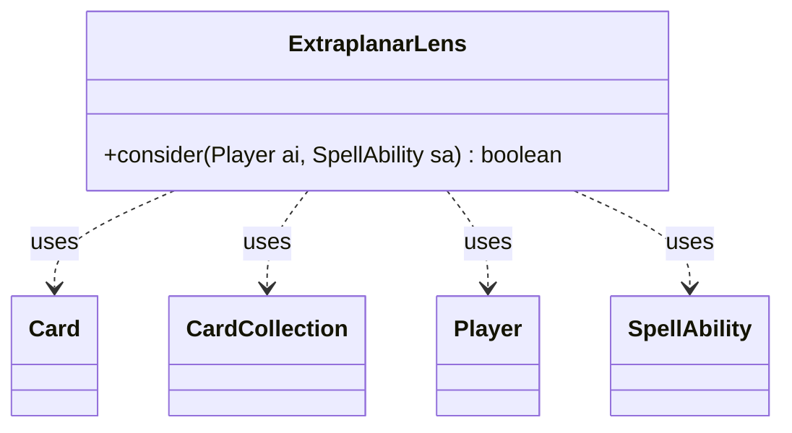

---
aliases:
  - ExtraplanarLens
tags:
  - java/class
  - module/forge-ai
  - pkg/forge/ai
fqn: forge.ai.SpecialCardAi.ExtraplanarLens
package: forge.ai
module: forge-ai
kind: Class
---

# ExtraplanarLens

**Package:** `forge.ai`   **Module:** `forge-ai`   **Kind:** Class



## Relationships
**Uses:**
- [[forge.game.card.Card|Card]]
- [[forge.game.card.CardCollection|CardCollection]]
- [[forge.game.player.Player|Player]]
- [[forge.game.spellability.SpellAbility|SpellAbility]]

## Design Description

ExtraplanarLens is a stateless AI helper, nested within `SpecialCardAi`, that encapsulates the targeting logic for the Extraplanar Lens card. Exposed solely through the static `consider(Player, SpellAbility)` method, it conforms to the convention used by its sibling special-card handlers: inspect game state and either select a target and return true, or decline by returning false. It collaborates with `Player` to enumerate basic lands on the battlefield, builds `CardCollection` sets via filtering predicates, and mutates the supplied `SpellAbility`'s target set.

The design intent is to imprint the lens on the basic land type the AI controls most, while preferring a "self-only" choice—a type the AI holds multiple copies of but no opponent owns—so the mana-doubling benefit isn't shared. It falls back to the simple best-count land when no exclusive option exists, resetting targets beforehand to keep selection idempotent.

## Source
`forge-ai/src/main/java/forge/ai/SpecialCardAi.java` — declaration excerpt

```java
    // Extraplanar Lens
    public static class ExtraplanarLens {
        public static boolean consider(final Player ai, final SpellAbility sa) {
            Card bestBasic = null;
            Card bestBasicSelfOnly = null;

            CardCollection aiLands = CardLists.filter(ai.getCardsIn(ZoneType.Battlefield), CardPredicates.LANDS_PRODUCING_MANA);
            CardCollection oppLands = CardLists.filter(ai.getOpponents().getCardsIn(ZoneType.Battlefield),
                    CardPredicates.LANDS_PRODUCING_MANA);

            int bestCount = 0;
            int bestSelfOnlyCount = 0;
            for (String landType : MagicColor.Constant.BASIC_LANDS) {
                CardCollection landsOfType = CardLists.filter(aiLands, CardPredicates.nameEquals(landType));
                CardCollection oppLandsOfType = CardLists.filter(oppLands, CardPredicates.nameEquals(landType));

                int numCtrl = CardLists.filter(aiLands, CardPredicates.nameEquals(landType)).size();
                if (numCtrl > bestCount) {
                    bestCount = numCtrl;
                    bestBasic = ComputerUtilCard.getWorstLand(landsOfType);
                }
                if (numCtrl > bestSelfOnlyCount && numCtrl > 1 && oppLandsOfType.isEmpty() && bestBasicSelfOnly == null) {
                    bestSelfOnlyCount = numCtrl;
                    bestBasicSelfOnly = ComputerUtilCard.getWorstLand(landsOfType);
                }
            }

            sa.resetTargets();
            if (bestBasicSelfOnly != null) {
                sa.getTargets().add(bestBasicSelfOnly);
                return true;
            } else if (bestBasic != null) {
                sa.getTargets().add(bestBasic);
                return true;
            }

            return false;
        }
    }
```

## Python
`forge/ai/SpecialCardAi/ExtraplanarLens.py`

```python
from forge.game.card.Card import Card
from forge.game.card.CardCollection import CardCollection
from forge.game.player.Player import Player
from forge.game.spellability.SpellAbility import SpellAbility
from forge.game.card.CardLists import CardLists
from forge.game.card.CardPredicates import CardPredicates
from forge.game.zone.ZoneType import ZoneType
from forge.card.MagicColor import MagicColor
from forge.ai.ComputerUtilCard import ComputerUtilCard


class ExtraplanarLens:
    @staticmethod
    def consider(ai: Player, sa: SpellAbility) -> bool:
        bestBasic = None
        bestBasicSelfOnly = None

        aiLands = CardLists.filter(ai.getCardsIn(ZoneType.Battlefield), CardPredicates.LANDS_PRODUCING_MANA)
        oppLands = CardLists.filter(ai.getOpponents().getCardsIn(ZoneType.Battlefield),
                CardPredicates.LANDS_PRODUCING_MANA)

        bestCount = 0
        bestSelfOnlyCount = 0
        for landType in MagicColor.Constant.BASIC_LANDS:
            landsOfType = CardLists.filter(aiLands, CardPredicates.nameEquals(landType))
            oppLandsOfType = CardLists.filter(oppLands, CardPredicates.nameEquals(landType))

            numCtrl = CardLists.filter(aiLands, CardPredicates.nameEquals(landType)).size()
            if numCtrl > bestCount:
                bestCount = numCtrl
                bestBasic = ComputerUtilCard.getWorstLand(landsOfType)
            if numCtrl > bestSelfOnlyCount and numCtrl > 1 and oppLandsOfType.isEmpty() and bestBasicSelfOnly is None:
                bestSelfOnlyCount = numCtrl
                bestBasicSelfOnly = ComputerUtilCard.getWorstLand(landsOfType)

        sa.resetTargets()
        if bestBasicSelfOnly is not None:
            sa.getTargets().add(bestBasicSelfOnly)
            return True
        elif bestBasic is not None:
            sa.getTargets().add(bestBasic)
            return True

        return False
```
