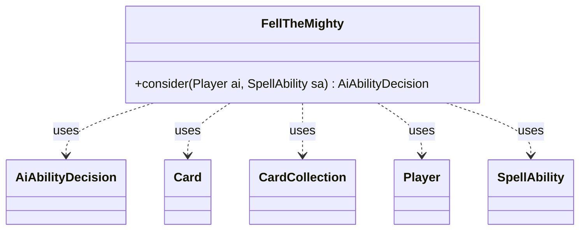

---
aliases:
  - FellTheMighty
tags:
  - java/class
  - module/forge-ai
  - pkg/forge/ai
fqn: forge.ai.SpecialCardAi.FellTheMighty
package: forge.ai
module: forge-ai
kind: Class
---

# FellTheMighty

**Package:** `forge.ai`   **Module:** `forge-ai`   **Kind:** Class



## Relationships
**Uses:**
- [[forge.ai.AiAbilityDecision|AiAbilityDecision]]
- [[forge.game.card.Card|Card]]
- [[forge.game.card.CardCollection|CardCollection]]
- [[forge.game.player.Player|Player]]
- [[forge.game.spellability.SpellAbility|SpellAbility]]

## Design Description

FellTheMighty is a stateless AI helper—one of several static nested strategy classes in `SpecialCardAi`—that decides whether the controlling `Player`'s "Fell the Mighty" effect should be cast. Its single static `consider` method evaluates the game state and returns an `AiAbilityDecision` encoding both a confidence score and an `AiPlayDecision` rationale.

The logic centers on the card's destroy-the-weakest mechanic: it gathers the AI's creatures into a `CardCollection`, sorts by ascending power to find its own lowest-power creature, and verifies the `SpellAbility` can target it. It then collects opposing creatures with greater power and, using `ComputerUtilCard.evaluateCreatureList`, plays only when the threats removed exceed a value threshold (200)—a deliberate cost-benefit gate ensuring the AI sacrifices a small creature only to clear a substantially larger opposing board. Targets are set as a side effect on the passed-in `SpellAbility`, reflecting Forge's convention of mutating ability state during AI consideration.

## Source
`forge-ai/src/main/java/forge/ai/SpecialCardAi.java` — declaration excerpt

```java
    // Fell the Mighty
    public static class FellTheMighty {
        public static AiAbilityDecision consider(final Player ai, final SpellAbility sa) {
            CardCollection aiList = ai.getCreaturesInPlay();
            if (aiList.isEmpty()) {
                return new AiAbilityDecision(0, AiPlayDecision.MissingNeededCards);
            }
            CardLists.sortByPowerAsc(aiList);
            Card lowest = aiList.get(0);
            if (!sa.canTarget(lowest)) {
                return new AiAbilityDecision(0, AiPlayDecision.TargetingFailed);
            }

            CardCollection oppList = CardLists.filter(ai.getGame().getCardsIn(ZoneType.Battlefield),
                    CardPredicates.CREATURES, CardPredicates.isControlledByAnyOf(ai.getOpponents()));

            oppList = CardLists.filterPower(oppList, lowest.getNetPower() + 1);
            if (ComputerUtilCard.evaluateCreatureList(oppList) > 200) {
                sa.resetTargets();
                sa.getTargets().add(lowest);
                return new AiAbilityDecision(100, AiPlayDecision.WillPlay);
            }
            return new AiAbilityDecision(0, AiPlayDecision.TargetingFailed);
        }
    }
```
