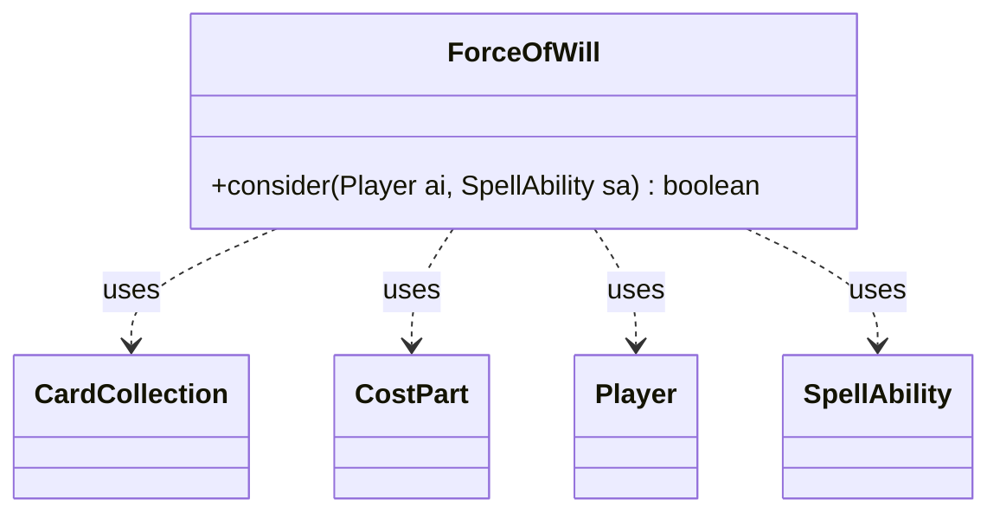

---
aliases:
  - ForceOfWill
tags:
  - java/class
  - module/forge-ai
  - pkg/forge/ai
fqn: forge.ai.SpecialCardAi.ForceOfWill
package: forge.ai
module: forge-ai
kind: Class
---

# ForceOfWill

**Package:** `forge.ai`   **Module:** `forge-ai`   **Kind:** Class



## Relationships
**Uses:**
- [[forge.game.card.CardCollection|CardCollection]]
- [[forge.game.cost.CostPart|CostPart]]
- [[forge.game.player.Player|Player]]
- [[forge.game.spellability.SpellAbility|SpellAbility]]

## Design Description

Force of Will's nested AI helper encapsulates the decision logic for whether the AI should cast the card, exposing a single static `consider(Player, SpellAbility)` predicate. Its responsibility is narrow: inspect the casting player's hand and the spell's pay costs to judge whether playing the card is viable, returning `true` only when the AI can realistically afford and benefit from the cast.

As one of many inner classes in `SpecialCardAi`, it follows a stateless utility pattern rather than implementing a shared interface. It collaborates with `Player` to query the hand, scans each `CostPart` of the `SpellAbility` to detect the alternative "exile and pay life" cost, and uses a filtered `CardCollection` of blue cards to guard against edge cases—refusing the cast when too few blue cards exist or when no low-CMC card is available to exile. This guards against the AI wasting the card or making suboptimal exile choices given its current valuation limitations.

## Source
`forge-ai/src/main/java/forge/ai/SpecialCardAi.java` — declaration excerpt

```java
    // Force of Will
    public static class ForceOfWill {
        public static boolean consider(final Player ai, final SpellAbility sa) {
            CardCollection blueCards = CardLists.filter(ai.getCardsIn(ZoneType.Hand), CardPredicates.isColor(MagicColor.BLUE));

            boolean isExileMode = false;
            for (CostPart c : sa.getPayCosts().getCostParts()) {
                if (c.toString().contains("Exile")) {
                    isExileMode = true; // the AI is trying to go for the "exile and pay life" alt cost
                    break;
                }
            }

            if (isExileMode) {
                if (blueCards.size() < 2) {
                    // Need to have something else in hand that is blue in addition to Force of Will itself,
                    // otherwise the AI will fail to play the card and the card will disappear from the pool
                    return false;
                } else if (!blueCards.anyMatch(CardPredicates.lessCMC(3))) {
                    // We probably need a low-CMC card to exile to it, exiling a higher CMC spell may be suboptimal
                    // since the AI does not prioritize/value cards vs. permission at the moment.
                    return false;
                }
            }

            return true;
        }
    }
```
