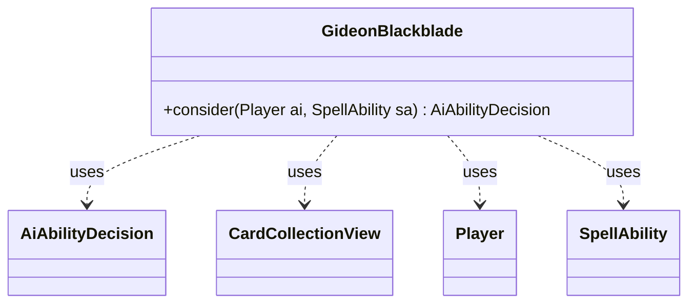

---
aliases:
  - GideonBlackblade
tags:
  - java/class
  - module/forge-ai
  - pkg/forge/ai
fqn: forge.ai.SpecialCardAi.GideonBlackblade
package: forge.ai
module: forge-ai
kind: Class
---

# GideonBlackblade

**Package:** `forge.ai`   **Module:** `forge-ai`   **Kind:** Class



## Relationships
**Uses:**
- [[forge.ai.AiAbilityDecision|AiAbilityDecision]]
- [[forge.game.card.CardCollectionView|CardCollectionView]]
- [[forge.game.player.Player|Player]]
- [[forge.game.spellability.SpellAbility|SpellAbility]]

## Design Description

GideonBlackblade is a stateless AI helper, nested as a static inner class of `SpecialCardAi`, that encapsulates the decision logic for casting the card Gideon Blackblade. Its sole `consider` method evaluates a `SpellAbility` for a given `Player`, selecting the best legal target among the AI's own battlefield permanents and returning an `AiAbilityDecision` that signals the engine to play the ability.

The class collaborates with the game model through `Player` and `SpellAbility`, queries the AI's controlled permanents as a `CardCollectionView`, and delegates target-quality ranking to `ComputerUtilCard`. By resetting targets and re-filtering for targetability before choosing, it ensures a valid selection each evaluation, and it always returns a maximum-confidence `WillPlay` verdict—reflecting an intent to encapsulate per-card AI behavior in small, self-contained, side-effect-light units invoked by the broader ability-decision framework.

## Source
`forge-ai/src/main/java/forge/ai/SpecialCardAi.java` — declaration excerpt

```java
    // Gideon Blackblade
    public static class GideonBlackblade {
        public static AiAbilityDecision consider(final Player ai, final SpellAbility sa) {
            sa.resetTargets();
            CardCollectionView otb = CardLists.filter(ai.getCardsIn(ZoneType.Battlefield), CardPredicates.isTargetableBy(sa));
            if (!otb.isEmpty()) {
                sa.getTargets().add(ComputerUtilCard.getBestAI(otb));
            }
            return new AiAbilityDecision(100, AiPlayDecision.WillPlay);
        }
    }
```
