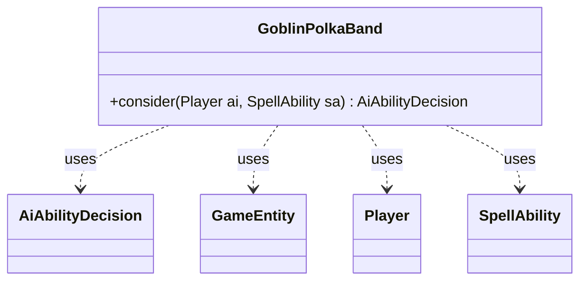

---
aliases:
  - GoblinPolkaBand
tags:
  - java/class
  - module/forge-ai
  - pkg/forge/ai
fqn: forge.ai.SpecialCardAi.GoblinPolkaBand
package: forge.ai
module: forge-ai
kind: Class
---

# GoblinPolkaBand

**Package:** `forge.ai`   **Module:** `forge-ai`   **Kind:** Class



## Relationships
**Uses:**
- [[forge.ai.AiAbilityDecision|AiAbilityDecision]]
- [[forge.game.GameEntity|GameEntity]]
- [[forge.game.player.Player|Player]]
- [[forge.game.spellability.SpellAbility|SpellAbility]]

## Design Description

Goblin Polka Band is a stateless AI helper—one of many static nested strategy classes inside `SpecialCardAi`—that encapsulates the bespoke logic for casting the named card. Its sole `consider` method evaluates whether the AI should play the spell and, if so, how to target it, returning an `AiAbilityDecision` that pairs a confidence score with an `AiPlayDecision` verdict.

The class collaborates with `Player` to survey untapped opposing creatures and with `ComputerUtilMana` to gauge available red mana, capping the target count at the lesser of the two. It writes the chosen count into the host card's `TgtNum` SVar to drive the spell's X-style announcement, then populates the `SpellAbility`'s targets with a random selection of valid `GameEntity` candidates. The all-static, instance-free design reflects a lightweight, dispatch-driven pattern where per-card AI behavior is invoked without allocation.

## Source
`forge-ai/src/main/java/forge/ai/SpecialCardAi.java` — declaration excerpt

```java
    // Goblin Polka Band
    public static class GoblinPolkaBand {
        public static AiAbilityDecision consider(final Player ai, final SpellAbility sa) {
            int maxPotentialTgts = ai.getOpponents().getCreaturesInPlay().filter(CardPredicates.UNTAPPED).size();
            int maxPotentialPayment = ComputerUtilMana.determineLeftoverMana(sa, ai, "R", false);

            int numTgts = Math.min(maxPotentialPayment, maxPotentialTgts);
            if (numTgts == 0) {
                return new AiAbilityDecision(0, AiPlayDecision.TargetingFailed);
            }

            // Set Announce
            sa.getHostCard().setSVar("TgtNum", String.valueOf(numTgts));

            // Simulate random targeting
            List<GameEntity> validTgts = sa.getTargetRestrictions().getAllCandidates(sa, true);
            sa.resetTargets();
            sa.getTargets().addAll(Aggregates.random(validTgts, numTgts));
            return new AiAbilityDecision(100, AiPlayDecision.WillPlay);
        }
    }
```

## Python
`forge/ai/SpecialCardAi/GoblinPolkaBand.py`

```python
from forge.ai.AiAbilityDecision import AiAbilityDecision
from forge.ai.AiPlayDecision import AiPlayDecision
from forge.ai.ComputerUtilMana import ComputerUtilMana
from forge.game.GameEntity import GameEntity
from forge.game.card.CardPredicates import CardPredicates
from forge.game.player.Player import Player
from forge.game.spellability.SpellAbility import SpellAbility
from forge.util.Aggregates import Aggregates


# Goblin Polka Band
class GoblinPolkaBand:
    @staticmethod
    def consider(ai: Player, sa: SpellAbility) -> AiAbilityDecision:
        maxPotentialTgts = ai.getOpponents().getCreaturesInPlay().filter(CardPredicates.UNTAPPED).size()
        maxPotentialPayment = ComputerUtilMana.determineLeftoverMana(sa, ai, "R", False)

        numTgts = min(maxPotentialPayment, maxPotentialTgts)
        if numTgts == 0:
            return AiAbilityDecision(0, AiPlayDecision.TargetingFailed)

        # Set Announce
        sa.getHostCard().setSVar("TgtNum", str(numTgts))

        # Simulate random targeting
        validTgts: list[GameEntity] = sa.getTargetRestrictions().getAllCandidates(sa, True)
        sa.resetTargets()
        sa.getTargets().addAll(Aggregates.random(validTgts, numTgts))
        return AiAbilityDecision(100, AiPlayDecision.WillPlay)
```
