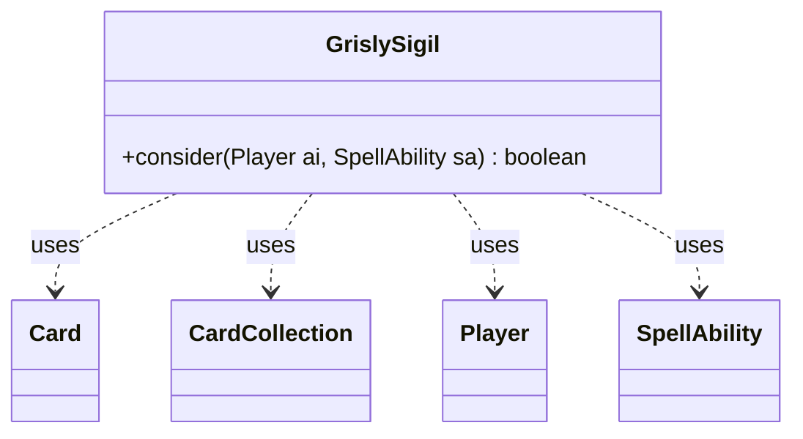

---
aliases:
  - GrislySigil
tags:
  - java/class
  - module/forge-ai
  - pkg/forge/ai
fqn: forge.ai.SpecialCardAi.GrislySigil
package: forge.ai
module: forge-ai
kind: Class
---

# GrislySigil

**Package:** `forge.ai`   **Module:** `forge-ai`   **Kind:** Class



## Relationships
**Uses:**
- [[forge.game.card.Card|Card]]
- [[forge.game.card.CardCollection|CardCollection]]
- [[forge.game.player.Player|Player]]
- [[forge.game.spellability.SpellAbility|SpellAbility]]

## Design Description

Grisly Sigil is one creature's effect handler within Forge's AI subsystem, where it implements the computer player's decision logic for the card "Grisly Sigil." Packaged as a static nested helper inside `SpecialCardAi`, it exposes a single static `consider` method rather than implementing a shared interface, reflecting the convention that special-case card AI lives in lightweight, stateless utility classes.

The method evaluates whether the AI should activate the ability by collecting valid targets controlled by opponents (via `CardCollection`), then estimating lethal damage against each `Card`—using net toughness for creatures or loyalty for planeswalkers—to find destroyable targets. When viable targets exist, it resets the `SpellAbility`'s targets, selects the best candidate through `ComputerUtilCard.getBestAI`, and returns true. The inline TODOs for Casualty support and damage reduction signal that this is deliberately heuristic, prioritizing a workable kill-oriented play over exhaustive optimization.

## Source
`forge-ai/src/main/java/forge/ai/SpecialCardAi.java` — declaration excerpt

```java
    // Grisly Sigil
    public static class GrislySigil {
        public static boolean consider(final Player ai, final SpellAbility sa) {
            // TODO: improve targeting support for Casualty 1
            CardCollection potentialTgts = CardLists.filterControlledBy(CardUtil.getValidCardsToTarget(sa), ai.getOpponents());

            for (Card c : potentialTgts) {
                int potentialDamage = c.getAssignedDamage(false, null) > 0 ? 3 : 1; // TODO: account for damage reduction
                if (c.canBeDestroyed()) {
                    int damageToDeal = c.isCreature() ? c.getNetToughness() : c.getCurrentLoyalty();
                    if (damageToDeal <= c.getAssignedDamage() + potentialDamage) {
                        potentialTgts.add(c);
                    }
                }
            }

            if (!potentialTgts.isEmpty()) {
                sa.resetTargets();
                sa.getTargets().add(ComputerUtilCard.getBestAI(potentialTgts));
                return true;
            }

            return false;
        }
    }
```
